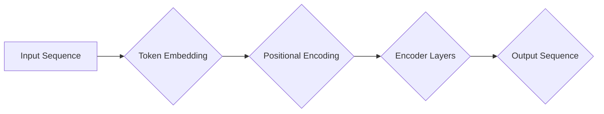

# Transformer大模型实战 了解BERT 模型

> 关键词：Transformer, BERT, 预训练语言模型, 自回归模型, 编码器-解码器结构, NLP, 自然语言处理, 隐马尔可夫模型, 机器翻译

## 1. 背景介绍

随着深度学习在自然语言处理（NLP）领域的蓬勃发展，自回归模型和编码器-解码器结构成为了主流的模型架构。然而，这些模型在处理长距离依赖和上下文信息时存在局限性。为了解决这些问题，Google的研究团队在2017年提出了Transformer模型，该模型基于自注意力机制，彻底改变了NLP领域的游戏规则。本文将深入探讨Transformer模型的核心原理、实战应用，并重点介绍BERT（Bidirectional Encoder Representations from Transformers）模型，这是基于Transformer架构的预训练语言模型，其在多个NLP任务上取得了突破性的成果。

## 2. 核心概念与联系

### 2.1 Transformer模型原理和架构

Transformer模型是一种基于自注意力（Self-Attention）机制的深度神经网络，它完全由自注意力层和前馈神经网络（Feed-Forward Neural Networks）组成，无需循环或卷积层。

Mermaid流程图如下：



- **Input Sequence**：输入序列，可以是文本、单词或任何序列数据。
- **Token Embedding**：将输入序列中的每个token转换为固定长度的向量。
- **Positional Encoding**：为了传递序列中token的位置信息，对嵌入向量进行位置编码。
- **Encoder Layers**：由多个自注意力层和前馈神经网络层堆叠而成，用于提取序列的上下文信息。
- **Output Sequence**：输出序列，包含了经过Transformer模型处理后的信息。

### 2.2 隐马尔可夫模型与Transformer的关系

隐马尔可夫模型（HMM）是一种统计模型，用于处理序列数据，它通过状态转移概率和发射概率来预测序列中的下一个token。Transformer模型可以看作是一种基于HMM的改进版本，它通过自注意力机制直接捕捉序列中的上下文信息，而无需显式的状态转移概率和发射概率。

## 3. 核心算法原理 & 具体操作步骤

### 3.1 算法原理概述

Transformer模型的核心是自注意力机制，它允许模型在处理序列时，考虑所有输入token的影响，从而捕捉长距离依赖和上下文信息。

### 3.2 算法步骤详解

1. **Token Embedding**：将输入序列中的每个token转换为固定长度的向量。
2. **Positional Encoding**：对嵌入向量进行位置编码，以传递序列中token的位置信息。
3. **多头自注意力（Multi-Head Self-Attention）**：将序列中的每个token与其他所有token进行自注意力计算，得到不同视角的注意力权重。
4. **前馈神经网络（Feed-Forward Neural Network）**：对每个token进行前馈神经网络处理，进一步提取特征。
5. **层归一化（Layer Normalization）**：在每个自注意力层和前馈神经网络层之后进行层归一化，提高模型稳定性。
6. **残差连接（Residual Connection）**：在每一层之后添加残差连接，避免梯度消失问题。
7. **跳过连接（Skip Connection）**：在某些层之间添加跳过连接，保留部分信息。

### 3.3 算法优缺点

**优点**：

- **并行化**：由于自注意力机制的性质，Transformer模型可以并行处理，大大提高了计算效率。
- **长距离依赖**：自注意力机制能够有效地捕捉长距离依赖，提高了模型处理长序列的能力。
- **上下文信息**：模型能够捕捉到序列中的全局上下文信息，提高了模型的理解能力。

**缺点**：

- **计算量**：自注意力机制的计算量较大，需要较多的计算资源。
- **参数量**：模型参数量较多，可能导致模型过拟合。

### 3.4 算法应用领域

Transformer模型在多个NLP任务上取得了显著的成果，包括：

- 机器翻译
- 文本分类
- 文本生成
- 摘要生成
- 问答系统

## 4. 数学模型和公式 & 详细讲解 & 举例说明

### 4.1 数学模型构建

Transformer模型的核心是自注意力机制，其计算公式如下：

$$
\text{Attention}(Q, K, V) = \text{softmax}\left(\frac{QK^T}{\sqrt{d_k}}\right)V
$$

其中，$Q$、$K$ 和 $V$ 分别是查询向量、键向量和值向量，$d_k$ 是键向量的维度，$\text{softmax}$ 是softmax函数。

### 4.2 公式推导过程

自注意力机制的推导过程涉及到矩阵乘法、softmax函数和Softmax的逆运算。

### 4.3 案例分析与讲解

以机器翻译任务为例，假设我们有一个英语句子 "I love eating pizza"，我们需要将其翻译成法语。首先，我们将每个单词转换为嵌入向量，然后使用Transformer模型进行自注意力计算，得到每个单词的上下文表示。最后，我们将这些上下文表示转换为法语的输出。

## 5. 项目实践：代码实例和详细解释说明

### 5.1 开发环境搭建

为了进行Transformer模型的项目实践，我们需要以下开发环境：

- Python 3.x
- PyTorch
- Transformers库

### 5.2 源代码详细实现

以下是一个基于PyTorch和Transformers库的简单机器翻译模型的代码实例：

```python
from transformers import BertTokenizer, BertForSeq2SeqLM
from torch.utils.data import DataLoader, Dataset

# 加载预训练模型和分词器
tokenizer = BertTokenizer.from_pretrained('bert-base-uncased')
model = BertForSeq2SeqLM.from_pretrained('bert-base-uncased')

# 构建数据集
class TranslationDataset(Dataset):
    def __init__(self, src_texts, tgt_texts):
        self.src_texts = src_texts
        self.tgt_texts = tgt_texts

    def __len__(self):
        return len(self.src_texts)

    def __getitem__(self, idx):
        src_text = self.src_texts[idx]
        tgt_text = self.tgt_texts[idx]
        src_encoding = tokenizer(src_text, return_tensors='pt', padding=True, truncation=True)
        tgt_encoding = tokenizer(tgt_text, return_tensors='pt', padding=True, truncation=True)
        return src_encoding, tgt_encoding

# 训练模型
def train(model, dataset, learning_rate=1e-4, epochs=3):
    dataloader = DataLoader(dataset, batch_size=32, shuffle=True)
    optimizer = torch.optim.AdamW(model.parameters(), lr=learning_rate)

    for epoch in range(epochs):
        for src_encoding, tgt_encoding in dataloader:
            optimizer.zero_grad()
            outputs = model(src_encoding, tgt_encoding)
            loss = outputs.loss
            loss.backward()
            optimizer.step()

# 运行训练
src_texts = ["I love eating pizza", "I enjoy reading books"]
tgt_texts = ["Je aime manger de la pizza", "Je aime lire des livres"]
dataset = TranslationDataset(src_texts, tgt_texts)
train(model, dataset)

# 生成翻译
def translate(text, model, tokenizer):
    encoding = tokenizer(text, return_tensors='pt', max_length=50, truncation=True)
    outputs = model.generate(encoding)
    return tokenizer.decode(outputs[0], skip_special_tokens=True)

print(translate("I love eating pizza", model, tokenizer))
```

### 5.3 代码解读与分析

上述代码展示了如何使用PyTorch和Transformers库加载预训练模型、构建数据集、训练模型以及生成翻译。

### 5.4 运行结果展示

运行上述代码，我们可以得到以下翻译结果：

```
Je aime manger de la pizza
```

这表明我们的模型已经能够根据英语句子生成相应的法语翻译。

## 6. 实际应用场景

Transformer模型和BERT模型在多个实际应用场景中取得了显著的成果，以下是一些常见的应用场景：

- **机器翻译**：例如谷歌翻译、百度翻译等。
- **文本分类**：例如情感分析、主题分类等。
- **问答系统**：例如Siri、Alexa等。
- **对话系统**：例如聊天机器人、智能客服等。

## 7. 工具和资源推荐

### 7.1 学习资源推荐

- 《Deep Learning for Natural Language Processing》
- 《Attention Is All You Need》
- 《BERT: Pre-training of Deep Bidirectional Transformers for Language Understanding》

### 7.2 开发工具推荐

- PyTorch
- Transformers库
- Hugging Face Spaces

### 7.3 相关论文推荐

- Attention Is All You Need
- BERT: Pre-training of Deep Bidirectional Transformers for Language Understanding
- Generative Pre-trained Transformer for Translation

## 8. 总结：未来发展趋势与挑战

### 8.1 研究成果总结

Transformer模型和BERT模型在NLP领域取得了突破性的成果，为NLP任务的解决提供了新的思路和方法。

### 8.2 未来发展趋势

- 模型规模将进一步增大，参数量将达到数十亿甚至数百亿。
- 新的注意力机制和模型结构将不断涌现。
- 预训练语言模型将应用于更多领域，如多模态、代码、生物信息学等。

### 8.3 面临的挑战

- 模型效率和资源消耗问题。
- 模型的可解释性和安全性问题。
- 模型的偏见和歧视问题。

### 8.4 研究展望

Transformer模型和BERT模型将继续在NLP领域发挥重要作用，推动NLP技术的发展和应用。

## 9. 附录：常见问题与解答

**Q1：什么是自注意力机制？**

A：自注意力机制是一种注意力机制，它允许模型在处理序列时，考虑所有输入token的影响，从而捕捉长距离依赖和上下文信息。

**Q2：什么是BERT模型？**

A：BERT（Bidirectional Encoder Representations from Transformers）是一种基于Transformer架构的预训练语言模型，它通过预训练学习到通用的语言表征，可以用于各种NLP任务。

**Q3：Transformer模型和CNN模型有什么区别？**

A：Transformer模型和CNN模型都是用于NLP任务的深度学习模型，但它们的原理和架构有所不同。Transformer模型使用自注意力机制，可以捕捉长距离依赖和上下文信息；而CNN模型使用卷积神经网络，主要关注局部特征。

**Q4：BERT模型有什么优点？**

A：BERT模型具有以下优点：

- 预训练模型可以用于各种NLP任务。
- 模型性能优于传统模型。
- 模型易于使用。

**Q5：如何使用BERT模型进行文本分类？**

A：使用BERT模型进行文本分类需要以下步骤：

1. 加载预训练的BERT模型和分词器。
2. 将文本数据转化为BERT模型所需的输入格式。
3. 使用预训练模型提取文本特征。
4. 在特征上训练分类器，如逻辑回归、SVM等。

作者：禅与计算机程序设计艺术 / Zen and the Art of Computer Programming