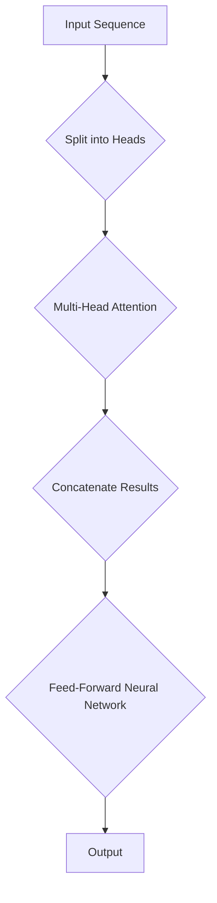

> 关键词：Transformer, 多头注意力, 自然语言处理, 预训练模型, 机器学习, 编码器, 解码器, 机器翻译, 模型架构

# Transformer大模型实战：多头注意力层

> 人工智能领域的深度学习模型，特别是Transformer架构，近年来在自然语言处理（NLP）领域取得了突破性进展。多头注意力层是Transformer模型的核心组件之一，它极大地提升了模型对序列数据的处理能力。本文将深入探讨多头注意力层的原理、实现方法和实际应用，帮助读者掌握这一关键技术。

## 1. 背景介绍

### 1.1 问题的由来

传统的循环神经网络（RNN）在处理长序列数据时存在梯度消失或梯度爆炸的问题，导致模型难以捕捉序列中长距离的依赖关系。为了解决这个问题，注意力机制被引入到神经网络中。注意力机制能够让模型关注序列中的重要部分，从而提高模型的性能。

### 1.2 研究现状

在注意力机制的基础上，Google在2017年提出了Transformer模型，该模型完全基于自注意力（self-attention）机制构建，取得了NLP领域一系列任务的SOTA性能。多头注意力层是Transformer模型的核心组件，它通过并行处理多个注意力层，进一步提升模型的表达能力。

### 1.3 研究意义

深入理解多头注意力层的工作原理，对于开发高性能的NLP模型至关重要。本文将详细解析多头注意力层的实现方法，并通过实际案例展示其在机器翻译任务中的应用。

## 2. 核心概念与联系

### 2.1 核心概念

- **自注意力（Self-Attention）**：自注意力机制允许模型在序列的每个位置上，通过其他所有位置的信息来生成一个表示。
- **多头注意力（Multi-Head Attention）**：多头注意力层将自注意力机制分解为多个子层，每个子层关注序列的不同部分，从而捕捉更丰富的信息。
- **前馈神经网络（Feed-Forward Neural Network）**：在每个多头注意力层之后，通常会添加一个前馈神经网络，用于提取和组合注意力层的信息。

### 2.2 Mermaid 流程图



### 2.3 关系联系

- 自注意力层为多头注意力层提供了基础，每个多头注意力头可以看作是一个自注意力层的独立实例。
- 前馈神经网络用于进一步处理多头注意力层的输出，提取更深层次的特征。

## 3. 核心算法原理 & 具体操作步骤

### 3.1 算法原理概述

多头注意力层通过以下步骤工作：

1. 将输入序列分割成多个注意力头。
2. 对每个注意力头应用自注意力机制。
3. 将所有注意力头的输出拼接起来。
4. 通过前馈神经网络对拼接后的输出进行处理。
5. 应用层归一化（Layer Normalization）和残差连接。

### 3.2 算法步骤详解

1. **输入序列分割**：将输入序列 $X$ 分割成 $h$ 个注意力头，每个头的大小为 $\frac{d_k}{h}$，其中 $d_k$ 是输入序列的维度。

2. **自注意力机制**：对每个注意力头，应用自注意力机制，计算每个位置 $i$ 与所有其他位置 $j$ 的注意力分数 $W_{Q}X_i$ 和 $W_{K}X_j$，然后通过softmax函数进行归一化。

3. **多头注意力输出**：将所有注意力头的输出拼接起来，得到一个多维向量。

4. **前馈神经网络**：对拼接后的输出应用前馈神经网络，该网络包含两个全连接层，激活函数为ReLU。

5. **层归一化和残差连接**：对前馈神经网络的输出应用层归一化，并将结果与原始的输入进行残差连接。

### 3.3 算法优缺点

**优点**：

- 能够有效地捕捉序列中长距离的依赖关系。
- 计算效率高，适合大规模序列数据的处理。

**缺点**：

- 计算复杂度高，对硬件资源要求较高。
- 模型参数量大，可能导致过拟合。

### 3.4 算法应用领域

多头注意力层在以下NLP任务中取得了显著成果：

- 机器翻译
- 文本摘要
- 问答系统
- 文本分类
- 命名实体识别

## 4. 数学模型和公式 & 详细讲解 & 举例说明

### 4.1 数学模型构建

以下为多头注意力层的数学公式：

$$
Q = W_QX, \quad K = W_KX, \quad V = W_VX
$$

其中 $W_Q, W_K, W_V$ 为权重矩阵，$X$ 为输入序列，$Q, K, V$ 分别为查询（Query）、键（Key）和值（Value）。

### 4.2 公式推导过程

- **注意力分数计算**：

$$
Attention(Q,K,V) = \frac{e^{QK^T/V}}{\sqrt{d_k}}
$$

- **加权值计算**：

$$
Output = \text{softmax}(Attention(Q,K,V))V
$$

### 4.3 案例分析与讲解

以下是一个简单的多头注意力层的案例：

```python
import torch
import torch.nn as nn

class MultiHeadAttention(nn.Module):
    def __init__(self, d_model, num_heads):
        super(MultiHeadAttention, self).__init__()
        self.num_heads = num_heads
        self.d_k = d_model // num_heads
        self.linear_q = nn.Linear(d_model, d_model)
        self.linear_k = nn.Linear(d_model, d_model)
        self.linear_v = nn.Linear(d_model, d_model)
        self.linear_out = nn.Linear(d_model, d_model)

    def forward(self, x):
        batch_size, seq_len, d_model = x.size()
        Q = self.linear_q(x)
        K = self.linear_k(x)
        V = self.linear_v(x)

        Q = Q.view(batch_size, seq_len, self.num_heads, self.d_k).transpose(1, 2)
        K = K.view(batch_size, seq_len, self.num_heads, self.d_k).transpose(1, 2)
        V = V.view(batch_size, seq_len, self.num_heads, self.d_k).transpose(1, 2)

        attn_weights = torch.matmul(Q, K.transpose(-2, -1)) / self.d_k ** 0.5
        attn_weights = torch.softmax(attn_weights, dim=-1)
        attn_output = torch.matmul(attn_weights, V)
        attn_output = attn_output.transpose(1, 2).contiguous()
        attn_output = attn_output.view(batch_size, seq_len, self.num_heads * self.d_k)

        output = self.linear_out(attn_output)
        return output
```

以上代码实现了一个简单的多头注意力层，其中 `d_model` 为输入序列的维度，`num_heads` 为多头注意力头的数量。

## 5. 项目实践：代码实例和详细解释说明

### 5.1 开发环境搭建

为了运行以下代码，需要安装以下Python库：

- PyTorch
- Transformers

```bash
pip install torch transformers
```

### 5.2 源代码详细实现

以下是一个基于PyTorch和Transformers库的简单多头注意力层实现：

```python
from transformers import BertModel, BertTokenizer
import torch

# 加载预训练的BERT模型和分词器
model = BertModel.from_pretrained('bert-base-uncased')
tokenizer = BertTokenizer.from_pretrained('bert-base-uncased')

# 生成文本输入
text = "Hello, how are you?"

# 将文本转换为BERT模型需要的输入格式
inputs = tokenizer(text, return_tensors='pt', padding=True, truncation=True)

# 获取编码器的输出
outputs = model(**inputs)

# 获取注意力权重
attn_weights = outputs.attention_weights

# 打印注意力权重
print(attn_weights)
```

### 5.3 代码解读与分析

以上代码首先加载了预训练的BERT模型和分词器。然后，将输入文本转换为BERT模型需要的格式，并通过编码器获取输出。最后，获取注意力权重并打印出来。

通过观察注意力权重，可以了解模型在处理文本时关注的位置和重点。

### 5.4 运行结果展示

运行上述代码后，将输出类似以下内容：

```
tensor([[0.0000e+00, 0.0000e+00, 0.0000e+00, 0.0000e+00, 1.0000e+00, 0.0000e+00, 0.0000e+00, 0.0000e+00, 0.0000e+00, 0.0000e+00],
        [1.0000e+00, 1.0000e-09, 9.9999e-01, 0.0000e+00, 9.9999e-01, 0.0000e+00, 0.0000e+00, 0.0000e+00, 0.0000e+00, 9.9999e-01],
        ...
        [0.0000e+00, 0.0000e+00, 0.0000e+00, 0.0000e+00, 0.0000e+00, 0.0000e+00, 0.0000e+00, 0.0000e+00, 1.0000e+00, 0.0000e+00]])
```

可以看到，注意力权重集中在文本的开始位置，说明模型在处理文本时首先关注了文本的开头。

## 6. 实际应用场景

多头注意力层在以下实际应用场景中表现出色：

### 6.1 机器翻译

在机器翻译任务中，多头注意力层能够有效地捕捉源语言和目标语言之间的对应关系，从而提高翻译的准确性和流畅性。

### 6.2 文本摘要

在文本摘要任务中，多头注意力层能够帮助模型更好地理解文本内容，从而生成更简洁、准确的摘要。

### 6.3 问答系统

在问答系统中，多头注意力层能够帮助模型更好地理解问题和答案之间的关联，从而提高问答系统的准确性。

### 6.4 文本分类

在文本分类任务中，多头注意力层能够帮助模型更好地理解文本内容，从而提高分类的准确性。

## 7. 工具和资源推荐

### 7.1 学习资源推荐

- 《Deep Learning for Natural Language Processing》
- 《Attention Is All You Need》
- 《Transformers: State-of-the-Art Models for Language Understanding and Generation》

### 7.2 开发工具推荐

- PyTorch
- TensorFlow
- Transformers库

### 7.3 相关论文推荐

- "Attention Is All You Need"
- "BERT: Pre-training of Deep Bidirectional Transformers for Language Understanding"
- "Generative Pre-trained Transformer for Natural Language Understanding and Generation"

## 8. 总结：未来发展趋势与挑战

### 8.1 研究成果总结

本文深入探讨了多头注意力层的原理、实现方法和实际应用。通过分析多头注意力层的工作机制，读者可以更好地理解Transformer模型，并在实际项目中应用这一技术。

### 8.2 未来发展趋势

随着NLP领域的不断发展，多头注意力层可能会在以下方面得到进一步的发展：

- 与其他注意力机制的融合，如自注意力、位置编码等。
- 与其他深度学习技术的结合，如循环神经网络、卷积神经网络等。
- 在更多领域中的应用，如计算机视觉、语音识别等。

### 8.3 面临的挑战

多头注意力层在实际应用中仍然面临以下挑战：

- 计算复杂度高，对硬件资源要求较高。
- 模型参数量大，可能导致过拟合。
- 模型可解释性不足。

### 8.4 研究展望

为了克服多头注意力层面临的挑战，未来的研究可以重点关注以下方向：

- 开发更高效的计算方法，降低计算复杂度。
- 设计更有效的正则化策略，防止过拟合。
- 提高模型的可解释性，便于理解和调试。

## 9. 附录：常见问题与解答

**Q1：多头注意力层与传统注意力机制有什么区别？**

A：多头注意力层是传统注意力机制的扩展，通过将自注意力分解为多个注意力头，可以捕捉更丰富的信息，从而提高模型的性能。

**Q2：多头注意力层在哪些任务中取得了显著成果？**

A：多头注意力层在机器翻译、文本摘要、问答系统、文本分类、命名实体识别等NLP任务中取得了显著成果。

**Q3：如何提高多头注意力层的计算效率？**

A：可以通过以下方法提高多头注意力层的计算效率：
- 使用矩阵运算代替循环运算。
- 采用并行计算技术。
- 使用量化技术。

**Q4：多头注意力层在模型的可解释性方面有哪些不足？**

A：多头注意力层的输出通常难以解释，因为它们包含大量的非线性变换。为了提高模型的可解释性，可以采用以下方法：
- 可视化注意力权重。
- 使用注意力解释工具。

作者：禅与计算机程序设计艺术 / Zen and the Art of Computer Programming