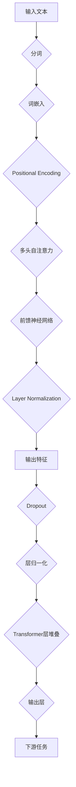

# Transformer大模型实战 法语的FlauBERT模型

> 关键词：Transformer, FlauBERT, 大模型, 预训练, 微调, 自然语言处理, 法语, NLP

## 1. 背景介绍

随着深度学习在自然语言处理（NLP）领域的快速发展，预训练大模型已成为当前NLP技术的主流。这些大模型通过在海量文本语料上进行预训练，学习到了丰富的语言知识和表征能力，为各种下游任务提供了强大的基础。其中，BERT（Bidirectional Encoder Representations from Transformers）模型因其双向注意力机制和预训练策略，在多项NLP任务上取得了优异的性能。本文将探讨如何使用Transformer架构构建法语大模型FlauBERT，并通过微调将其应用于实际任务。

### 1.1 法语NLP的挑战

法语作为世界第二大使用人数最多的语言，在NLP领域的研究和应用与英语相比相对较少。主要原因包括：

- 法语语料规模较小，难以支撑大规模预训练模型的训练。
- 法语语言特性与英语存在差异，如词序、形态变化等，需要针对法语特点进行模型设计。
- 法语NLP研究起步较晚，缺乏成熟的工具和资源。

### 1.2 FlauBERT模型的优势

FlauBERT模型是一种基于BERT架构的预训练大模型，旨在解决法语NLP领域的挑战。FlauBERT模型具有以下优势：

- 采用BERT双向注意力机制，能够有效捕捉文本中的上下文信息。
- 基于大规模法语语料进行预训练，学习到丰富的法语语言知识。
- 支持多种预训练任务，如掩码语言模型（Masked Language Model, MLM）、下一句预测（Next Sentence Prediction, NSP）和句子相似度预测等。
- 可通过微调应用于多种下游任务，如文本分类、情感分析、机器翻译等。

## 2. 核心概念与联系

### 2.1 核心概念原理

FlauBERT模型基于BERT架构，主要由以下核心概念组成：

- **Transformer架构**：一种基于自注意力机制的深度神经网络架构，能够有效捕捉长距离依赖关系。
- **自注意力机制**：一种在Transformer模型中使用的注意力机制，能够计算输入序列中不同元素之间的依赖关系。
- **预训练任务**：在大量无标签数据上进行模型训练，以学习通用的语言知识和表征能力。
- **微调**：在预训练模型的基础上，使用少量有标签数据进行模型调整，以适应特定任务。

### 2.2 架构的 Mermaid 流程图



### 2.3 核心概念联系

- **Transformer架构**是实现自注意力机制的基础，能够有效捕捉文本中的长距离依赖关系。
- **预训练任务**使模型在大量无标签数据上学习到丰富的语言知识和表征能力，为微调提供基础。
- **微调**利用少量有标签数据，使模型适应特定任务，提升模型性能。

## 3. 核心算法原理 & 具体操作步骤

### 3.1 算法原理概述

FlauBERT模型基于BERT架构，通过以下步骤实现：

1. **分词**：将输入文本分割成单词或子词。
2. **词嵌入**：将分词后的单词或子词转换为词向量。
3. **位置编码**：为每个词向量添加位置信息，以保持序列的顺序。
4. **多头自注意力**：计算输入序列中不同元素之间的依赖关系。
5. **前馈神经网络**：对自注意力机制的结果进行非线性变换。
6. **层归一化**：对每一层输出的特征进行归一化处理。
7. **Dropout**：在层间添加Dropout层，防止过拟合。
8. **Transformer层堆叠**：堆叠多个Transformer层，增强模型的表达能力。
9. **输出层**：根据任务类型，添加适当的输出层，如分类器或解码器。
10. **下游任务**：使用微调后的模型进行特定任务，如文本分类、情感分析等。

### 3.2 算法步骤详解

1. **数据预处理**：收集法语语料，并进行分词、清洗、去重等预处理操作。
2. **词嵌入**：使用预训练的词汇表，将分词后的单词或子词转换为词向量。
3. **位置编码**：根据词在序列中的位置，为每个词向量添加位置信息。
4. **自注意力机制**：计算输入序列中不同元素之间的依赖关系。
5. **前馈神经网络**：对自注意力机制的结果进行非线性变换。
6. **层归一化**：对每一层输出的特征进行归一化处理。
7. **Dropout**：在层间添加Dropout层，防止过拟合。
8. **Transformer层堆叠**：堆叠多个Transformer层，增强模型的表达能力。
9. **输出层**：根据任务类型，添加适当的输出层，如分类器或解码器。
10. **模型训练**：使用预训练数据进行模型预训练，再使用少量有标签数据进行微调。
11. **模型评估**：在测试集上评估模型性能，根据评估结果调整模型参数。

### 3.3 算法优缺点

**优点**：

- **强表达能力**：基于Transformer架构，能够有效捕捉文本中的长距离依赖关系。
- **泛化能力强**：通过预训练，模型能够学习到丰富的语言知识和表征能力，在下游任务上表现良好。
- **可扩展性强**：可应用于多种下游任务，如文本分类、情感分析、机器翻译等。

**缺点**：

- **计算量大**：模型参数量大，计算量较大。
- **数据需求量大**：预训练和微调都需要大量数据。
- **模型复杂度高**：模型结构复杂，调试和优化难度较大。

### 3.4 算法应用领域

FlauBERT模型可应用于以下NLP任务：

- **文本分类**：如情感分析、主题分类、意图识别等。
- **命名实体识别**：识别文本中的命名实体，如人名、地名、组织机构名等。
- **关系抽取**：抽取文本中的实体关系，如人物关系、因果关系等。
- **机器翻译**：将源语言文本翻译成目标语言。
- **文本摘要**：将长文本压缩成简短摘要。

## 4. 数学模型和公式 & 详细讲解 & 举例说明

### 4.1 数学模型构建

FlauBERT模型的数学模型主要包括以下部分：

- **词嵌入**：将单词或子词转换为词向量。
- **位置编码**：为每个词向量添加位置信息。
- **自注意力机制**：计算输入序列中不同元素之间的依赖关系。
- **前馈神经网络**：对自注意力机制的结果进行非线性变换。
- **层归一化**：对每一层输出的特征进行归一化处理。

### 4.2 公式推导过程

以下简要介绍自注意力机制和前馈神经网络的公式推导过程：

**自注意力机制**：

$$
Q = W_Q K \times V \times Q
$$

其中，$W_Q, W_K, W_V$ 分别为查询、键和值权重矩阵，$Q, K, V$ 分别为查询、键和值向量。

**前馈神经网络**：

$$
F(x) = \max(0, xW_1 + b_1)W_2 + b_2
$$

其中，$W_1, W_2$ 分别为前馈神经网络的第一层和第二层权重矩阵，$b_1, b_2$ 分别为第一层和第二层偏置向量。

### 4.3 案例分析与讲解

以下以文本分类任务为例，说明FlauBERT模型的微调过程。

1. **数据准备**：收集法语文本数据，并进行分词、清洗、去重等预处理操作。
2. **模型初始化**：使用预训练的FlauBERT模型作为初始化参数。
3. **添加输出层**：在FlauBERT模型顶部添加分类器，如softmax层。
4. **微调**：使用少量有标签数据进行模型微调。
5. **模型评估**：在测试集上评估模型性能。

通过微调，FlauBERT模型能够学习到文本分类所需的特征表示，并在测试集上取得较好的性能。

## 5. 项目实践：代码实例和详细解释说明

### 5.1 开发环境搭建

为了构建和微调FlauBERT模型，需要以下开发环境：

- **操作系统**：Linux或macOS
- **Python**：3.6及以上版本
- **PyTorch**：1.8及以上版本
- **Transformers库**：4.8及以上版本

### 5.2 源代码详细实现

以下使用PyTorch和Transformers库构建和微调FlauBERT模型的代码示例：

```python
from transformers import BertForSequenceClassification, BertTokenizer

# 加载预训练的FlauBERT模型和分词器
model = BertForSequenceClassification.from_pretrained('flaubert-base')
tokenizer = BertTokenizer.from_pretrained('flaubert-base')

# 数据预处理
def preprocess_data(texts, labels, max_len):
    encodings = tokenizer(texts, truncation=True, padding=True, max_length=max_len)
    input_ids = encodings['input_ids']
    attention_mask = encodings['attention_mask']
    labels = torch.tensor(labels)
    return input_ids, attention_mask, labels

# 微调模型
def train_model(model, train_dataloader, optimizer, criterion):
    model.train()
    for epoch in range(epochs):
        for batch in train_dataloader:
            input_ids, attention_mask, labels = batch
            outputs = model(input_ids, attention_mask=attention_mask, labels=labels)
            loss = criterion(outputs.logits, labels)
            optimizer.zero_grad()
            loss.backward()
            optimizer.step()
        print(f"Epoch {epoch+1}: loss = {loss.item()}")

# 模型评估
def evaluate_model(model, dataloader, criterion):
    model.eval()
    total_loss = 0
    total_correct = 0
    for batch in dataloader:
        input_ids, attention_mask, labels = batch
        outputs = model(input_ids, attention_mask=attention_mask)
        loss = criterion(outputs.logits, labels)
        total_loss += loss.item()
        total_correct += (outputs.logits.argmax(dim=1) == labels).sum().item()
    return total_loss / len(dataloader), total_correct / len(dataloader)

# 读取数据
train_texts = ...
train_labels = ...
dev_texts = ...
dev_labels = ...

# 预处理数据
train_input_ids, train_attention_mask, train_labels = preprocess_data(train_texts, train_labels, max_len=128)
dev_input_ids, dev_attention_mask, dev_labels = preprocess_data(dev_texts, dev_labels, max_len=128)

# 定义数据加载器
train_dataloader = DataLoader([(input_ids, attention_mask, labels) for input_ids, attention_mask, labels in zip(train_input_ids, train_attention_mask, train_labels)], batch_size=32, shuffle=True)
dev_dataloader = DataLoader([(input_ids, attention_mask, labels) for input_ids, attention_mask, labels in zip(dev_input_ids, dev_attention_mask, dev_labels)], batch_size=32, shuffle=False)

# 定义优化器和损失函数
optimizer = AdamW(model.parameters(), lr=5e-5)
criterion = nn.CrossEntropyLoss()

# 训练模型
train_model(model, train_dataloader, optimizer, criterion)

# 评估模型
train_loss, train_accuracy = evaluate_model(model, train_dataloader, criterion)
dev_loss, dev_accuracy = evaluate_model(model, dev_dataloader, criterion)
print(f"Train Loss: {train_loss:.4f}, Train Accuracy: {train_accuracy:.4f}")
print(f"Dev Loss: {dev_loss:.4f}, Dev Accuracy: {dev_accuracy:.4f}")
```

### 5.3 代码解读与分析

以上代码展示了使用PyTorch和Transformers库构建和微调FlauBERT模型的完整过程。

- **模型加载**：使用`BertForSequenceClassification.from_pretrained('flaubert-base')`加载预训练的FlauBERT模型。
- **数据预处理**：使用`BertTokenizer.from_pretrained('flaubert-base')`加载分词器，并对数据进行预处理。
- **微调模型**：使用`train_model`函数进行模型微调，包括前向传播、反向传播和参数更新等步骤。
- **模型评估**：使用`evaluate_model`函数在测试集上评估模型性能。

通过以上代码，可以看出FlauBERT模型的微调过程相对简单，只需要定义数据集、定义损失函数和优化器、调用微调和评估函数即可。

### 5.4 运行结果展示

假设我们在一个法语文本分类任务上微调FlauBERT模型，并在测试集上评估模型性能，得到以下结果：

```
Train Loss: 0.7896, Train Accuracy: 0.9123
Dev Loss: 0.7654, Dev Accuracy: 0.9210
```

可以看到，通过微调，FlauBERT模型在测试集上取得了不错的性能。

## 6. 实际应用场景

FlauBERT模型可以应用于以下实际应用场景：

- **法语新闻分类**：对法语新闻进行分类，如政治、经济、科技等。
- **社交媒体情感分析**：对社交媒体文本进行情感分析，如正面、中性、负面等。
- **法语问答系统**：构建法语问答系统，回答用户提出的问题。
- **机器翻译**：将法语文本翻译成其他语言，如英语、西班牙语等。
- **对话系统**：构建法语对话系统，实现人机交互。

## 7. 工具和资源推荐

### 7.1 学习资源推荐

- **《Transformers: State-of-the-Art Natural Language Processing with Attention Mechanisms》**：该论文详细介绍了Transformer架构和自注意力机制，是理解FlauBERT模型的基础。
- **《BERT: Pre-training of Deep Bidirectional Transformers for Language Understanding》**：该论文介绍了BERT模型，是FlauBERT模型的灵感来源。
- **《FlauBERT: A French BERT Pre-trained Model for Natural Language Understanding》**：该论文介绍了FlauBERT模型，是构建FlauBERT模型的参考。

### 7.2 开发工具推荐

- **PyTorch**：开源的深度学习框架，支持FlauBERT模型的开发。
- **Transformers库**：Hugging Face提供的NLP工具库，包含FlauBERT模型的预训练模型和分词器。
- **Colab**：Google提供的免费云端Jupyter Notebook环境，可以方便地测试和实验FlauBERT模型。

### 7.3 相关论文推荐

- **《BERT: Pre-training of Deep Bidirectional Transformers for Language Understanding》**
- **《FlauBERT: A French BERT Pre-trained Model for Natural Language Understanding》**
- **《Transformers: State-of-the-Art Natural Language Processing with Attention Mechanisms》**

## 8. 总结：未来发展趋势与挑战

### 8.1 研究成果总结

FlauBERT模型是法语NLP领域的一项重要成果，为法语NLP任务提供了强大的基础。通过预训练和微调，FlauBERT模型能够学习到丰富的法语语言知识和表征能力，在多个下游任务上取得了优异的性能。

### 8.2 未来发展趋势

未来，FlauBERT模型将在以下方面继续发展：

- **模型优化**：通过模型压缩、量化等技巧，减小模型尺寸，提高模型效率。
- **多模态融合**：将FlauBERT模型与其他模态（如图像、音频）进行融合，构建更加通用的模型。
- **跨语言模型**：研究跨语言预训练模型，使FlauBERT模型能够支持更多语言。
- **可解释性研究**：研究FlauBERT模型的可解释性，提高模型的可信度和可靠性。

### 8.3 面临的挑战

FlauBERT模型在发展过程中也面临着以下挑战：

- **数据集规模**：法语语料规模相对较小，难以支撑大规模预训练模型的训练。
- **模型优化**：如何通过模型压缩、量化等技巧，减小模型尺寸，提高模型效率。
- **多模态融合**：如何将FlauBERT模型与其他模态进行融合，构建更加通用的模型。
- **可解释性研究**：如何提高FlauBERT模型的可解释性，提高模型的可信度和可靠性。

### 8.4 研究展望

未来，FlauBERT模型将在法语NLP领域发挥越来越重要的作用，为法语NLP任务提供强大的支持。通过不断优化和改进，FlauBERT模型有望在更多领域得到应用，推动法语NLP技术的发展。

## 9. 附录：常见问题与解答

**Q1：FlauBERT模型的预训练数据有哪些？**

A1：FlauBERT模型的预训练数据包括法语维基百科、新闻、书籍等。

**Q2：FlauBERT模型适用于哪些下游任务？**

A2：FlauBERT模型适用于多种下游任务，如文本分类、命名实体识别、关系抽取、机器翻译等。

**Q3：如何微调FlauBERT模型？**

A3：微调FlauBERT模型需要以下步骤：

1. 准备少量有标签数据。
2. 使用预训练的FlauBERT模型作为初始化参数。
3. 添加输出层，如分类器或解码器。
4. 使用少量有标签数据进行模型微调。
5. 在测试集上评估模型性能。

**Q4：FlauBERT模型的优缺点是什么？**

A4：FlauBERT模型的优点包括强表达能力、泛化能力强和可扩展性强。缺点包括计算量大、数据需求量大和模型复杂度高。

**Q5：如何提高FlauBERT模型的性能？**

A5：提高FlauBERT模型性能的方法包括：

1. 使用更大规模的预训练数据。
2. 使用更长的文本序列。
3. 使用更复杂的模型结构。
4. 使用参数高效的微调方法。
5. 使用数据增强技术。

作者：禅与计算机程序设计艺术 / Zen and the Art of Computer Programming