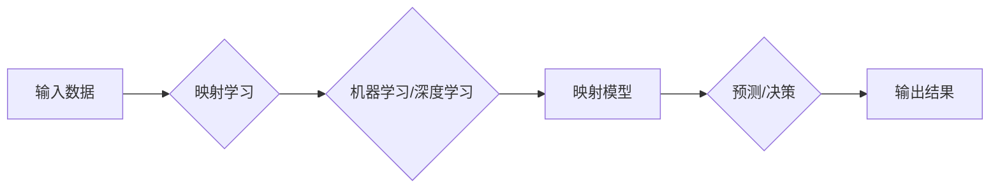

> 关键词：人工智能，先进制造，映射学习，工业自动化，智能制造，大数据，深度学习，机器学习

# 一切皆是映射：AI助力下的先进制造业革新

在数字化转型的浪潮中，人工智能（AI）正成为推动先进制造业革新的核心力量。通过将现实世界的复杂问题转化为可计算的数学模型，AI技术实现了对制造过程的智能化控制、优化和预测，从而提升效率、降低成本、增强产品质量。本文将深入探讨AI在先进制造业中的应用，分析其背后的映射学习原理，并展望未来发展趋势与挑战。

## 1. 背景介绍

### 1.1 制造业面临的挑战

传统制造业在经历了数百年发展后，面临着诸多挑战：

- **生产效率低下**：传统的生产流程往往依赖于人工操作，效率低下，难以满足日益增长的市场需求。
- **产品质量波动**：由于人工操作的不可控性，产品质量难以保证，导致次品率高、返修率高。
- **资源浪费**：能源消耗、材料浪费等问题严重，不利于可持续发展。
- **创新不足**：缺乏对生产数据的深入分析和利用，难以实现生产过程的持续优化和创新。

### 1.2 AI的兴起

随着大数据、云计算、物联网等技术的发展，AI技术逐渐从理论研究走向实践应用。AI通过学习海量数据，建立复杂的数学模型，实现对现实世界的模拟、控制和优化。在先进制造业中，AI技术正成为提升生产效率、降低成本、提高产品质量的关键驱动力。

### 1.3 映射学习原理

AI在先进制造业中的应用，其核心在于映射学习（Mapping Learning）。映射学习是指将现实世界的复杂问题转化为可计算的数学模型，从而实现对现实世界的理解和控制。在映射学习中，AI通过学习输入数据与输出数据之间的映射关系，建立映射模型，并利用该模型对新的输入数据进行预测或决策。

## 2. 核心概念与联系

### 2.1 核心概念

- **映射学习**：将现实世界的复杂问题转化为可计算的数学模型，实现对现实世界的模拟、控制和优化。
- **机器学习**：通过算法和统计模型从数据中学习，以实现对未知模式的预测或决策。
- **深度学习**：一种特殊的机器学习方法，使用多层神经网络模型对数据进行学习。
- **工业自动化**：利用机器代替人工完成生产过程中的各种操作，提高生产效率和产品质量。
- **智能制造**：以数据驱动为基础，通过人工智能、物联网、云计算等技术实现生产过程的智能化、柔性化和网络化。

### 2.2 架构流程图



## 3. 核心算法原理 & 具体操作步骤

### 3.1 算法原理概述

AI在先进制造业中的应用，主要涉及以下步骤：

1. 数据采集：通过传感器、摄像头等设备收集生产过程中的各种数据。
2. 数据预处理：对采集到的数据进行清洗、去噪、归一化等处理，使其适合模型学习。
3. 模型选择：根据具体任务选择合适的机器学习或深度学习模型。
4. 模型训练：使用预处理后的数据对模型进行训练，学习输入数据与输出数据之间的映射关系。
5. 模型评估：使用验证集或测试集评估模型的性能，调整模型参数。
6. 模型部署：将训练好的模型部署到生产环境中，实现对生产过程的智能化控制。

### 3.2 算法步骤详解

#### 3.2.1 数据采集

数据采集是AI应用的基础。在先进制造业中，数据采集通常包括以下类型：

- **传感器数据**：如温度、压力、流量、振动等物理量数据。
- **机器视觉数据**：如摄像头采集的图像、视频数据。
- **生产过程数据**：如设备运行状态、生产进度等数据。

#### 3.2.2 数据预处理

数据预处理是提高模型性能的关键步骤。常见的预处理方法包括：

- **数据清洗**：去除数据中的错误、异常值和噪声。
- **数据归一化**：将不同量纲的数据转换为相同的尺度，方便模型学习。
- **数据降维**：通过主成分分析、线性判别分析等方法降低数据维度。

#### 3.2.3 模型选择

根据具体任务选择合适的机器学习或深度学习模型。常见的模型包括：

- **线性回归**：用于回归预测任务。
- **逻辑回归**：用于二分类任务。
- **支持向量机**：用于分类和回归预测任务。
- **神经网络**：用于复杂非线性关系的学习。
- **卷积神经网络（CNN）**：用于图像识别和图像处理。
- **循环神经网络（RNN）**：用于序列数据处理。

#### 3.2.4 模型训练

使用预处理后的数据对模型进行训练。训练过程中，模型会不断调整参数，以最小化预测误差。

#### 3.2.5 模型评估

使用验证集或测试集评估模型的性能。常见的评估指标包括：

- **准确率**：分类任务中正确预测的样本比例。
- **召回率**：分类任务中被正确预测的样本比例。
- **F1值**：准确率和召回率的调和平均值。
- **均方误差**：回归任务中预测值与真实值之间的平方差的平均值。

#### 3.2.6 模型部署

将训练好的模型部署到生产环境中，实现对生产过程的智能化控制。

### 3.3 算法优缺点

#### 3.3.1 优点

- **提高效率**：自动化生产过程，减少人工操作，提高生产效率。
- **降低成本**：优化生产流程，减少资源浪费，降低生产成本。
- **提高质量**：提高产品质量，降低次品率和返修率。
- **预测性强**：通过模型预测设备故障、市场趋势等，提前采取行动。

#### 3.3.2 缺点

- **数据依赖**：需要大量高质量的数据进行训练。
- **模型复杂**：深度学习模型复杂度高，训练和推理时间长。
- **泛化能力**：模型可能对特定数据集过度拟合，泛化能力不足。

### 3.4 算法应用领域

AI在先进制造业中的应用非常广泛，以下是一些典型的应用领域：

- **生产过程控制**：通过模型预测设备状态、故障预测等，实现对生产过程的智能化控制。
- **产品质量检测**：通过机器视觉和深度学习技术，实现对产品质量的自动检测和分类。
- **供应链优化**：通过分析供应链数据，优化库存管理、运输计划等。
- **设备预测性维护**：通过预测设备故障，提前进行维护，减少停机时间。
- **产品设计与优化**：通过模拟仿真和优化算法，设计出更加高效、可靠的产品。

## 4. 数学模型和公式 & 详细讲解 & 举例说明

### 4.1 数学模型构建

在AI应用中，常用的数学模型包括：

- **线性回归模型**：$y = \beta_0 + \beta_1x_1 + \beta_2x_2 + \cdots + \beta_nx_n$

- **逻辑回归模型**：$p(y=1) = \sigma(\beta_0 + \beta_1x_1 + \beta_2x_2 + \cdots + \beta_nx_n)$

- **神经网络模型**：$f(x) = \sigma(\sigma(\sigma(\cdots \sigma(W_1x + b_1) + b_2) \cdots + b_n)$

### 4.2 公式推导过程

以线性回归模型为例，其推导过程如下：

- 假设线性回归模型为 $y = \beta_0 + \beta_1x_1 + \beta_2x_2 + \cdots + \beta_nx_n$
- 损失函数为 $\mathcal{L}(\beta) = \frac{1}{2} \sum_{i=1}^n (y_i - \hat{y}_i)^2$
- 梯度下降法更新参数：$\beta_k = \beta_k - \alpha \frac{\partial \mathcal{L}(\beta)}{\partial \beta_k}$

### 4.3 案例分析与讲解

以生产过程控制为例，假设我们需要预测设备的运行状态。具体步骤如下：

1. 收集设备运行数据，包括温度、压力、振动等。
2. 对数据进行预处理，包括清洗、归一化等。
3. 选择合适的模型，如线性回归或神经网络。
4. 使用预处理后的数据对模型进行训练。
5. 使用验证集或测试集评估模型性能。
6. 将训练好的模型部署到生产环境中，实现对设备状态的预测。

## 5. 项目实践：代码实例和详细解释说明

### 5.1 开发环境搭建

1. 安装Python环境。
2. 安装NumPy、Pandas等数据处理库。
3. 安装Scikit-learn、TensorFlow等机器学习库。

### 5.2 源代码详细实现

以下是一个使用Scikit-learn库进行线性回归的简单示例：

```python
import numpy as np
from sklearn.linear_model import LinearRegression

# 生成模拟数据
X = np.linspace(0, 10, 100).reshape(-1, 1)
y = 2 * X + np.random.normal(0, 1, 100)

# 创建线性回归模型
model = LinearRegression()

# 训练模型
model.fit(X, y)

# 预测
X_predict = np.linspace(0, 10, 100).reshape(-1, 1)
y_predict = model.predict(X_predict)

# 可视化结果
import matplotlib.pyplot as plt

plt.scatter(X, y, color='blue', label='Original data')
plt.plot(X_predict, y_predict, color='red', label='Fitted line')

plt.xlabel('X')
plt.ylabel('Y')
plt.legend()
plt.show()
```

### 5.3 代码解读与分析

上述代码展示了如何使用Scikit-learn库进行线性回归。首先，我们生成了一组模拟数据，然后创建了一个线性回归模型，并使用这些数据进行训练。最后，我们使用训练好的模型对新的数据进行预测，并将预测结果可视化。

### 5.4 运行结果展示

运行上述代码，可以得到如下可视化结果：


从图中可以看出，线性回归模型能够较好地拟合模拟数据。

## 6. 实际应用场景

### 6.1 生产过程控制

在工业生产中，通过AI技术对设备状态进行实时监测和预测，可以实现生产过程的自动化控制和优化。例如，通过监测设备的振动数据，可以预测设备故障，并提前进行维护，避免停机损失。

### 6.2 产品质量检测

AI技术在产品质量检测方面具有广泛的应用。通过机器视觉和深度学习技术，可以对产品进行自动检测和分类，提高检测效率和准确性。

### 6.3 供应链优化

AI技术可以分析供应链数据，优化库存管理、运输计划等，降低成本、提高效率。

### 6.4 设备预测性维护

AI技术可以预测设备故障，提前进行维护，减少停机时间，降低维护成本。

### 6.5 产品设计与优化

AI技术可以模拟仿真和优化算法，设计出更加高效、可靠的产品。

## 7. 工具和资源推荐

### 7.1 学习资源推荐

- 《深度学习》（Goodfellow, Bengio, Courville）
- 《机器学习》（Tom Mitchell）
- 《Python机器学习》（ Sebastian Raschka）

### 7.2 开发工具推荐

- NumPy
- Pandas
- Scikit-learn
- TensorFlow
- PyTorch

### 7.3 相关论文推荐

- “Deep Learning for Manufacturing” (2019)
- “AI in Manufacturing: A Systematic Review” (2020)
- “AI-Driven Manufacturing: A Review of Opportunities and Challenges” (2020)

## 8. 总结：未来发展趋势与挑战

### 8.1 研究成果总结

AI在先进制造业中的应用已经取得了显著的成果，为制造业的转型升级提供了新的动力。通过映射学习，AI技术能够实现对生产过程的智能化控制、优化和预测，提升效率、降低成本、增强产品质量。

### 8.2 未来发展趋势

- **模型轻量化**：随着边缘计算的兴起，模型轻量化成为未来发展趋势之一。轻量化模型能够在有限的硬件资源下实现高效的预测和决策。
- **可解释性AI**：提高AI模型的可解释性，使其决策过程更加透明，增强用户对AI的信任。
- **跨领域迁移**：提升AI模型的跨领域迁移能力，使其能够在不同领域之间进行知识迁移和应用。
- **人机协同**：推动人机协同发展，实现人与机器的深度融合。

### 8.3 面临的挑战

- **数据质量**：高质量的数据是AI模型训练的基础，如何获取高质量、多样化的数据成为一大挑战。
- **模型可解释性**：提高AI模型的可解释性，使其决策过程更加透明，增强用户对AI的信任。
- **算法公平性**：避免AI算法在应用过程中产生歧视和偏见，确保算法的公平性。
- **安全与隐私**：保护用户数据和模型安全，防止数据泄露和恶意攻击。

### 8.4 研究展望

未来，AI在先进制造业中的应用将更加广泛，为实现制造业的智能化、绿色化、服务化提供有力支撑。通过不断攻克技术难题，AI技术将为制造业带来更加美好的未来。

## 9. 附录：常见问题与解答

**Q1：AI在先进制造业中的应用有哪些具体案例？**

A1：AI在先进制造业中的应用案例非常丰富，包括生产过程控制、产品质量检测、供应链优化、设备预测性维护、产品设计与优化等。

**Q2：如何保证AI模型的可解释性？**

A2：提高AI模型的可解释性需要从多个方面入手，包括：

- 使用可解释性模型，如决策树、线性回归等。
- 解释模型输出结果，如提供推理过程、敏感度分析等。
- 增强模型透明度，如公开模型结构和参数等。

**Q3：如何应对AI算法的歧视和偏见问题？**

A3：应对AI算法的歧视和偏见问题需要：

- 使用无偏见数据集进行训练。
- 采用公平性评估方法，评估模型的公平性。
- 限制模型对少数群体的歧视。

**Q4：AI在制造业中如何与其他技术结合？**

A4：AI在制造业中可以与其他技术结合，如：

- 物联网（IoT）：实现设备联网和数据采集。
- 云计算：提供弹性的计算资源。
- 大数据：提供海量数据支持。
- 5G：提供高速、低延迟的网络连接。

**Q5：如何评估AI模型的性能？**

A5：评估AI模型的性能可以从以下方面进行：

- 准确率、召回率、F1值等指标。
- 验证集和测试集上的性能表现。
- 模型在真实场景中的应用效果。

---

作者：禅与计算机程序设计艺术 / Zen and the Art of Computer Programming