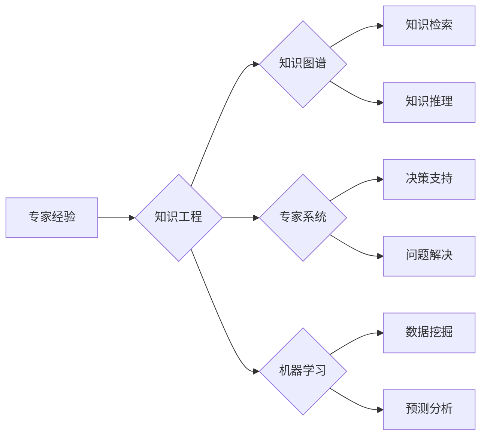

> 关键词：专家经验，知识工程，知识图谱，专家系统，机器学习，自然语言处理，实践固化，IT领域，自动化

# 专家经验在生产中的固化

## 1. 背景介绍

在众多行业和领域中，专家的经验和知识是推动技术进步和业务创新的重要资源。然而，随着专家的更替和时间的推移，这些宝贵的经验往往难以传承和共享。如何将专家经验固化，并将其应用于实际生产中，成为了IT领域的一个重要课题。

### 1.1 问题的由来

传统的专家经验固化方法主要依赖于人工记录和文档整理，效率低、成本高且难以保证信息的准确性和时效性。随着信息技术的快速发展，特别是人工智能和知识图谱技术的应用，专家经验固化进入了一个新的时代。

### 1.2 研究现状

目前，专家经验固化的主要方法包括：

- 专家系统：通过规则推理模拟专家决策过程，将专家知识转化为可执行的操作。
- 知识图谱：构建领域知识的知识图谱，利用图结构化数据提高知识检索和推理效率。
- 机器学习：利用机器学习算法从大量数据中学习专家知识，实现知识自动化。

### 1.3 研究意义

专家经验固化对于IT领域具有重要意义：

- 提高生产效率：通过自动化应用专家知识，减少人工操作，提高生产效率。
- 降低成本：减少对专家人工依赖，降低人力成本。
- 知识传承：将专家经验转化为可共享的知识资产，实现知识传承。
- 创新驱动：为新产品和服务开发提供知识支持，驱动创新。

### 1.4 本文结构

本文将围绕专家经验固化的主题，从核心概念、算法原理、实际应用等方面展开讨论。具体内容包括：

- 核心概念与联系：介绍专家经验固化的相关概念，并使用Mermaid流程图展示其关系。
- 核心算法原理：阐述专家系统、知识图谱、机器学习等关键算法原理。
- 实际应用场景：分析专家经验固化在不同行业和领域的应用案例。
- 工具和资源推荐：推荐相关学习资源、开发工具和学术论文。
- 总结：总结研究成果，展望未来发展趋势和挑战。

## 2. 核心概念与联系

### 2.1 核心概念

- 专家经验：指专家在长期实践中积累的专业知识和技能。
- 知识工程：将专家知识转化为计算机可处理的形式，实现知识自动化。
- 知识图谱：用图结构表示知识，包含实体、关系和属性。
- 专家系统：模拟专家决策过程，辅助决策和问题解决。
- 机器学习：从数据中学习模式，实现数据驱动的决策和预测。

### 2.2 Mermaid流程图



如图所示，专家经验是知识工程的基础，通过知识工程可以将专家经验转化为知识图谱、专家系统或机器学习模型。知识图谱可以用于知识检索和推理，专家系统用于决策支持和问题解决，机器学习用于数据挖掘和预测分析。

## 3. 核心算法原理 & 具体操作步骤

### 3.1 算法原理概述

#### 3.1.1 专家系统

专家系统通过模拟专家的决策过程，将专家知识表示为一系列规则，并利用推理机进行推理，最终给出决策结果。

#### 3.1.2 知识图谱

知识图谱使用图结构表示知识，包含实体、关系和属性。通过图数据库存储和查询知识，实现知识的关联分析和推理。

#### 3.1.3 机器学习

机器学习通过从数据中学习模式，实现数据驱动的决策和预测。常见的机器学习方法包括监督学习、无监督学习和强化学习。

### 3.2 算法步骤详解

#### 3.2.1 专家系统

1. 知识获取：通过访谈、问卷调查等方式收集专家知识。
2. 知识表示：将专家知识表示为规则和事实。
3. 推理机：根据规则和事实进行推理，生成推理结果。

#### 3.2.2 知识图谱

1. 实体识别：从文本中识别实体，包括命名实体识别和实体消歧。
2. 关系抽取：从文本中抽取实体之间的关系。
3. 属性抽取：从文本中抽取实体的属性。
4. 知识存储：将实体、关系和属性存储到图数据库中。

#### 3.2.3 机器学习

1. 数据收集：收集相关数据，包括标注数据和无标注数据。
2. 特征工程：从数据中提取特征，用于训练模型。
3. 模型训练：选择合适的机器学习算法，训练模型。
4. 模型评估：评估模型性能，包括准确率、召回率、F1值等。

### 3.3 算法优缺点

#### 3.3.1 专家系统

优点：能较好地模拟专家决策过程，适应性强。

缺点：知识获取成本高，知识表示困难，推理效率低。

#### 3.3.2 知识图谱

优点：能有效地组织和管理知识，提高知识检索和推理效率。

缺点：构建和维护成本高，难以处理动态变化的知识。

#### 3.3.3 机器学习

优点：能自动从数据中学习知识，适应性强。

缺点：对数据质量要求高，模型可解释性差。

### 3.4 算法应用领域

- 专家系统：医疗诊断、法律咨询、金融风控等。
- 知识图谱：搜索引擎、推荐系统、智能问答等。
- 机器学习：图像识别、语音识别、自然语言处理等。

## 4. 数学模型和公式 & 详细讲解 & 举例说明

### 4.1 数学模型构建

#### 4.1.1 专家系统

专家系统的数学模型可以表示为：

$$
M = R \times F
$$

其中，$M$ 为专家系统模型，$R$ 为规则集，$F$ 为事实集。

#### 4.1.2 知识图谱

知识图谱的数学模型可以表示为：

$$
G = (E, R, A)
$$

其中，$G$ 为知识图谱模型，$E$ 为实体集合，$R$ 为关系集合，$A$ 为属性集合。

#### 4.1.3 机器学习

机器学习的数学模型可以表示为：

$$
f(x) = \mathbf{w}^T \mathbf{x}
$$

其中，$f(x)$ 为模型输出，$\mathbf{w}$ 为模型参数，$\mathbf{x}$ 为输入特征。

### 4.2 公式推导过程

#### 4.2.1 专家系统

专家系统的公式推导过程涉及逻辑推理和规则匹配，较为复杂，此处不再展开。

#### 4.2.2 知识图谱

知识图谱的公式推导过程涉及图算法和图遍历，较为复杂，此处不再展开。

#### 4.2.3 机器学习

机器学习的公式推导过程涉及概率论、统计学和优化理论，较为复杂，此处不再展开。

### 4.3 案例分析与讲解

#### 4.3.1 专家系统案例

以医疗诊断系统为例，专家系统的知识表示如下：

- 规则1：如果患者有发热症状，并且体温超过38℃，则可能患有感冒。
- 规则2：如果患者有咳嗽症状，并且体温超过38℃，则可能患有肺炎。

假设患者有发热和咳嗽症状，根据规则匹配和推理，可以判断患者可能患有肺炎。

#### 4.3.2 知识图谱案例

以搜索引擎为例，知识图谱的知识表示如下：

- 实体1：苹果公司
- 实体2：iPhone
- 关系1：(苹果公司)生产(iPhone)

假设用户搜索“苹果公司的产品”，根据知识图谱的检索和推理，可以返回“iPhone”等结果。

#### 4.3.3 机器学习案例

以图像识别为例，机器学习的知识表示如下：

- 输入特征：图像像素值
- 输出特征：类别标签（如猫、狗、鸟等）

假设输入一张猫的图像，通过机器学习模型训练得到的权重，可以判断输入图像为猫。

## 5. 项目实践：代码实例和详细解释说明

### 5.1 开发环境搭建

1. 安装Python：从Python官网下载并安装Python。
2. 安装相关库：使用pip安装以下库：

```bash
pip install pytorch numpy pandas scikit-learn
```

### 5.2 源代码详细实现

以下是一个基于PyTorch实现的图像识别项目的代码示例：

```python
import torch
import torch.nn as nn
import torch.optim as optim
from torch.utils.data import DataLoader, Dataset
from torchvision import transforms
from PIL import Image

# 定义数据集
class ImageDataset(Dataset):
    def __init__(self, file_path, transform=None):
        self.file_path = file_path
        self.transform = transform

    def __len__(self):
        return len(self.file_path)

    def __getitem__(self, index):
        image_path = self.file_path[index]
        image = Image.open(image_path)
        if self.transform:
            image = self.transform(image)
        return image

# 定义卷积神经网络模型
class ConvNet(nn.Module):
    def __init__(self):
        super(ConvNet, self).__init__()
        self.conv1 = nn.Conv2d(3, 32, kernel_size=3, stride=1, padding=1)
        self.relu = nn.ReLU()
        self.pool = nn.MaxPool2d(kernel_size=2, stride=2)
        self.fc1 = nn.Linear(32 * 32 * 32, 10)

    def forward(self, x):
        x = self.conv1(x)
        x = self.relu(x)
        x = self.pool(x)
        x = x.view(-1, 32 * 32 * 32)
        x = self.fc1(x)
        return x

# 数据预处理
transform = transforms.Compose([
    transforms.Resize((64, 64)),
    transforms.ToTensor(),
])

# 加载数据
train_dataset = ImageDataset(train_file_path, transform=transform)
train_loader = DataLoader(train_dataset, batch_size=32, shuffle=True)

# 创建模型、损失函数和优化器
model = ConvNet()
criterion = nn.CrossEntropyLoss()
optimizer = optim.SGD(model.parameters(), lr=0.01)

# 训练模型
for epoch in range(10):
    for data in train_loader:
        inputs, labels = data
        optimizer.zero_grad()
        outputs = model(inputs)
        loss = criterion(outputs, labels)
        loss.backward()
        optimizer.step()
    print(f"Epoch {epoch+1}, Loss: {loss.item()}")

# 保存模型
torch.save(model.state_dict(), 'model.pth')
```

### 5.3 代码解读与分析

1. **数据集定义**：`ImageDataset`类负责加载数据集，并进行预处理。
2. **卷积神经网络模型**：`ConvNet`类定义了一个简单的卷积神经网络模型，包括卷积层、ReLU激活函数、池化层和全连接层。
3. **数据预处理**：使用`transforms.Compose`对图像进行缩放、转换为Tensor等操作。
4. **加载数据**：使用`DataLoader`将数据集分为批次，并进行随机打乱。
5. **创建模型、损失函数和优化器**：创建卷积神经网络模型、交叉熵损失函数和SGD优化器。
6. **训练模型**：使用训练数据训练模型，并打印损失值。
7. **保存模型**：将训练好的模型参数保存到文件中。

### 5.4 运行结果展示

运行上述代码，训练完成后，可以在`model.pth`文件中找到训练好的模型参数。可以使用以下代码进行模型评估：

```python
import torch
from torchvision import transforms
from PIL import Image

# 加载模型
model = ConvNet()
model.load_state_dict(torch.load('model.pth'))

# 加载数据
test_dataset = ImageDataset(test_file_path, transform=transform)
test_loader = DataLoader(test_dataset, batch_size=32, shuffle=False)

# 评估模型
correct = 0
total = 0
with torch.no_grad():
    for data in test_loader:
        images, labels = data
        outputs = model(images)
        _, predicted = torch.max(outputs.data, 1)
        total += labels.size(0)
        correct += (predicted == labels).sum().item()

print(f'Accuracy of the network on the 10000 test images: {100 * correct / total}%')
```

## 6. 实际应用场景

### 6.1 医疗诊断

利用专家系统构建医疗诊断系统，将医生的经验和知识转化为可执行的操作，辅助医生进行诊断。

### 6.2 金融风控

利用知识图谱构建金融风控系统，通过分析实体之间的关系和属性，识别潜在风险。

### 6.3 智能问答

利用自然语言处理技术构建智能问答系统，将专家知识转化为可检索和推理的知识图谱，为用户提供问答服务。

### 6.4 工业自动化

利用机器学习技术构建工业自动化系统，通过学习工业生产数据，实现设备的故障预测和优化控制。

## 7. 工具和资源推荐

### 7.1 学习资源推荐

1. 《人工智能：一种现代的方法》
2. 《深度学习》
3. 《图论及其应用》
4. 《专家系统设计与应用》

### 7.2 开发工具推荐

1. Python
2. PyTorch
3. TensorFlow
4. Neo4j
5. Protégé

### 7.3 相关论文推荐

1. "Expert Systems and Their Applicaions"
2. "A Large-Scale Knowledge Graph for Food and Nutrition"
3. "Leveraging Domain Knowledge in Deep Learning for Industrial Fault Diagnosis"

## 8. 总结：未来发展趋势与挑战

### 8.1 研究成果总结

本文介绍了专家经验固化的相关概念、算法原理和应用场景，并通过代码示例展示了如何实现专家经验固化。研究表明，专家经验固化在IT领域具有重要的应用价值，能够提高生产效率、降低成本、实现知识传承和驱动创新。

### 8.2 未来发展趋势

1. 跨领域知识融合：将不同领域专家的知识进行融合，构建跨领域知识图谱和专家系统。
2. 个性化知识推荐：根据用户需求和场景，推荐个性化的知识和服务。
3. 知识增强学习：利用知识增强学习技术，提高模型的泛化能力和可解释性。
4. 知识工程与人工智能的结合：将知识工程与人工智能技术相结合，实现更加智能的知识管理和应用。

### 8.3 面临的挑战

1. 知识获取和表示：如何有效地获取和表示专家知识，仍然是专家经验固化面临的重要挑战。
2. 模型可解释性：如何提高模型的可解释性，让用户理解模型的决策过程，是专家经验固化应用的重要问题。
3. 模型鲁棒性：如何提高模型的鲁棒性，使其能够应对不确定性和噪声，是专家经验固化在实际应用中需要解决的挑战。

### 8.4 研究展望

随着人工智能和知识图谱技术的不断发展，专家经验固化将在更多领域得到应用。未来，专家经验固化将朝着更加智能化、个性化和可解释的方向发展，为人类创造更加智能和高效的生产生活方式。

## 9. 附录：常见问题与解答

**Q1：专家经验固化适用于所有领域吗？**

A：专家经验固化适用于需要专家知识和技能的领域，如医疗、金融、工业等。但对于一些不需要复杂知识推理和决策支持的领域，如简单的数据统计和分析，专家经验固化的效果可能有限。

**Q2：知识图谱和专家系统有什么区别？**

A：知识图谱是一种结构化知识表示方法，通过图结构表示实体、关系和属性。专家系统是一种模拟专家决策过程的系统，通过规则推理和知识表示实现决策。知识图谱可以提供领域知识，专家系统可以进行决策推理。

**Q3：机器学习在专家经验固化中扮演什么角色？**

A：机器学习可以用于从数据中学习专家知识，实现知识自动化。机器学习模型可以用于知识抽取、知识推理和预测分析等任务。

**Q4：如何提高专家经验固化的可解释性？**

A：提高专家经验固化的可解释性可以从以下几个方面入手：

1. 使用可解释的机器学习模型，如决策树、规则学习等。
2. 解释模型的决策过程，如可视化、解释规则等。
3. 将专家知识与模型决策结果进行对比分析，找出差异原因。

**Q5：专家经验固化在工业自动化中的应用有哪些？**

A：在工业自动化中，专家经验固化可以用于：

1. 设备故障预测：通过学习历史故障数据，预测设备可能出现的故障，提前进行维护。
2. 生产流程优化：通过分析生产数据，优化生产流程，提高生产效率。
3. 产品质量控制：通过分析产品质量数据，识别质量缺陷，提高产品质量。

作者：禅与计算机程序设计艺术 / Zen and the Art of Computer Programming