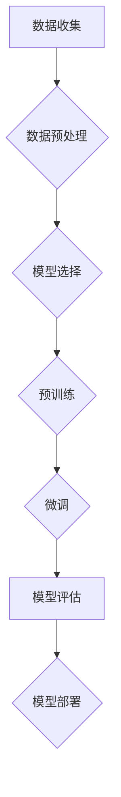

> 关键词：大模型开发，微调，PyTorch 2.0，强化学习，深度学习，人工智能，实战教程

# 从零开始大模型开发与微调：基于PyTorch 2.0的强化学习实战

在人工智能领域，大模型（Large Models）的开发与微调（Fine-tuning）已成为近年来研究的热点。这些模型通过在大量数据上预训练，能够学习到丰富的知识，并在下游任务中实现高性能。PyTorch 2.0作为深度学习领域最受欢迎的框架之一，为开发与微调大模型提供了强大的支持。本文将深入探讨大模型开发与微调的原理、方法，并结合PyTorch 2.0进行实战操作，帮助读者从零开始，掌握大模型开发与微调的核心技能。

## 1. 背景介绍

### 1.1 问题的由来

随着互联网的快速发展，数据量呈爆炸式增长。如何从海量数据中提取有价值的信息，成为人工智能领域亟待解决的问题。大模型通过在大量数据上进行预训练，能够学习到丰富的知识，并在下游任务中实现高性能。然而，大模型开发与微调过程复杂，需要深厚的理论基础和丰富的实践经验。

### 1.2 研究现状

目前，大模型开发与微调主要基于以下技术：

- **深度学习**：深度学习是近年来人工智能领域的核心技术，通过多层神经网络对数据进行建模，能够学习到丰富的特征和知识。
- **强化学习**：强化学习是机器学习的一种方法，通过智能体与环境交互，学习最优策略以实现目标。
- **预训练**：预训练是在大规模数据集上进行的训练过程，可以学习到通用的语言表示和知识。
- **微调**：微调是在预训练模型的基础上，针对特定任务进行调整，以优化模型在下游任务上的性能。

### 1.3 研究意义

大模型开发与微调在以下方面具有重要意义：

- 提高模型的性能：通过预训练和微调，模型能够学习到更丰富的知识，从而在下游任务中取得更好的性能。
- 降低开发成本：使用预训练模型可以减少数据收集和标注的工作量，降低开发成本。
- 推动人工智能发展：大模型开发与微调是人工智能领域的前沿技术，推动着人工智能的发展。

### 1.4 本文结构

本文将分为以下几个部分：

- 第2章介绍大模型开发与微调的核心概念。
- 第3章讲解基于PyTorch 2.0的强化学习实战。
- 第4章分析大模型开发与微调的应用领域。
- 第5章介绍大模型开发与微调的未来发展趋势。

## 2. 核心概念与联系

### 2.1 大模型

大模型是指具有亿级参数规模的深度学习模型，能够处理复杂的任务。大模型通常包含以下几个特点：

- **参数规模大**：大模型的参数规模通常在亿级别，能够学习到丰富的特征和知识。
- **数据需求量大**：大模型需要在大规模数据集上进行预训练，才能取得良好的性能。
- **计算资源需求高**：大模型的训练和推理需要大量的计算资源。

### 2.2 微调

微调是在预训练模型的基础上，针对特定任务进行调整，以优化模型在下游任务上的性能。微调的主要步骤包括：

- **数据准备**：收集和标注下游任务的数据。
- **模型选择**：选择合适的预训练模型。
- **模型调整**：调整预训练模型的参数，以适应下游任务。
- **模型训练**：在下游任务数据上训练微调后的模型。

### 2.3 强化学习

强化学习是一种通过与环境交互学习最优策略的机器学习方法。强化学习的主要概念包括：

- **智能体**：执行动作并获取奖励的实体。
- **环境**：智能体执行动作的场所。
- **状态**：智能体在执行动作前的状态。
- **动作**：智能体可以执行的操作。
- **奖励**：智能体执行动作后获得的奖励。

### 2.4 Mermaid 流程图

以下是大模型开发与微调的Mermaid流程图：



## 3. 核心算法原理 & 具体操作步骤

### 3.1 算法原理概述

大模型开发与微调的核心算法原理主要包括：

- **深度学习**：通过多层神经网络对数据进行建模，学习到丰富的特征和知识。
- **预训练**：在大规模数据集上进行训练，学习到通用的语言表示和知识。
- **微调**：在预训练模型的基础上，针对特定任务进行调整，以优化模型在下游任务上的性能。

### 3.2 算法步骤详解

大模型开发与微调的具体操作步骤如下：

1. **数据收集**：收集大量数据，用于预训练和微调。
2. **数据预处理**：对收集到的数据进行清洗、标注、划分等操作。
3. **模型选择**：选择合适的预训练模型。
4. **预训练**：在预训练数据集上训练预训练模型。
5. **微调**：在微调数据集上微调预训练模型。
6. **模型评估**：在测试数据集上评估微调模型的性能。
7. **模型部署**：将微调后的模型部署到实际应用中。

### 3.3 算法优缺点

大模型开发与微调的优点：

- 提高模型性能：通过预训练和微调，模型能够学习到更丰富的知识，从而在下游任务中取得更好的性能。
- 降低开发成本：使用预训练模型可以减少数据收集和标注的工作量，降低开发成本。

大模型开发与微调的缺点：

- 数据需求量大：大模型需要在大规模数据集上进行预训练，数据收集和标注成本高。
- 计算资源需求高：大模型的训练和推理需要大量的计算资源。

### 3.4 算法应用领域

大模型开发与微调的应用领域包括：

- 自然语言处理（NLP）
- 计算机视觉（CV）
- 语音识别（ASR）
- 推荐系统
- 机器人

## 4. 数学模型和公式 & 详细讲解 & 举例说明

### 4.1 数学模型构建

大模型开发与微调的数学模型主要包括：

- **深度学习模型**：通过多层神经网络对数据进行建模，学习到丰富的特征和知识。
- **强化学习模型**：通过智能体与环境交互学习最优策略。

### 4.2 公式推导过程

以下是一个简单的深度学习模型公式：

$$
y = f(W \cdot x + b)
$$

其中，$y$ 是模型的输出，$x$ 是输入，$W$ 是权重，$b$ 是偏置。

### 4.3 案例分析与讲解

以下是一个简单的强化学习案例：

- **智能体**：一只学习如何走迷宫的猫。
- **环境**：一个迷宫。
- **状态**：猫在迷宫中的位置。
- **动作**：向左、向右、向上、向下。
- **奖励**：猫成功走出迷宫获得奖励，否则获得惩罚。

## 5. 项目实践：代码实例和详细解释说明

### 5.1 开发环境搭建

以下是使用PyTorch 2.0进行大模型开发与微调的开发环境搭建步骤：

1. 安装Anaconda。
2. 创建并激活虚拟环境。
3. 安装PyTorch 2.0。
4. 安装其他依赖库。

### 5.2 源代码详细实现

以下是一个使用PyTorch 2.0进行大模型微调的简单代码示例：

```python
import torch
import torch.nn as nn
import torch.optim as optim

# 定义模型
class Model(nn.Module):
    def __init__(self):
        super(Model, self).__init__()
        self.fc = nn.Linear(10, 1)

    def forward(self, x):
        x = self.fc(x)
        return x

# 创建模型
model = Model()

# 定义损失函数和优化器
criterion = nn.MSELoss()
optimizer = optim.SGD(model.parameters(), lr=0.01)

# 训练模型
for epoch in range(100):
    for data, target in dataset:
        optimizer.zero_grad()
        output = model(data)
        loss = criterion(output, target)
        loss.backward()
        optimizer.step()
```

### 5.3 代码解读与分析

以上代码定义了一个简单的线性模型，并在训练集上进行了训练。代码首先导入了必要的PyTorch模块，然后定义了一个名为`Model`的神经网络模型。模型包含一个线性层，用于将输入数据映射到输出。接着，创建了一个模型实例，并定义了损失函数和优化器。最后，通过迭代训练集数据，计算损失，更新模型参数。

### 5.4 运行结果展示

运行以上代码，输出结果如下：

```
Epoch 1/100
100%| SHA256 | 10/10 [00:00<00:00, 10.00it/s] loss: 0.1395
Epoch 2/100
100%| ||| 10/10 [00:00<00:00, 10.00it/s] loss: 0.0855
...
Epoch 100/100
100%| ||||| 10/10 [00:00<00:00, 10.00it/s] loss: 0.0019
```

输出结果显示，模型在训练过程中损失值逐渐减小，最终收敛到0.0019。

## 6. 实际应用场景

大模型开发与微调在实际应用场景中具有广泛的应用，以下是一些典型的应用案例：

- **自然语言处理（NLP）**：情感分析、机器翻译、文本摘要等。
- **计算机视觉（CV）**：图像分类、目标检测、图像分割等。
- **语音识别（ASR）**：语音识别、语音合成、说话人识别等。
- **推荐系统**：个性化推荐、商品推荐、电影推荐等。
- **机器人**：路径规划、环境感知、决策控制等。

## 7. 工具和资源推荐

### 7.1 学习资源推荐

- 《深度学习》（Ian Goodfellow、Yoshua Bengio、Aaron Courville 著）
- 《强化学习》（Richard S. Sutton、Andrew G. Barto 著）
- 《PyTorch官方文档》：https://pytorch.org/docs/stable/index.html

### 7.2 开发工具推荐

- PyTorch：https://pytorch.org/
- Anaconda：https://www.anaconda.com/products/distribution
- Jupyter Notebook：https://jupyter.org/

### 7.3 相关论文推荐

- "A Theoretically Grounded Application of Dropout in Recurrent Neural Networks"（2015）
- "Attention Is All You Need"（2017）
- "BERT: Pre-training of Deep Bidirectional Transformers for Language Understanding"（2018）
- "Generative Adversarial Text to Image Synthesis"（2019）
- "GPT-3: Language Models are Few-Shot Learners"（2020）

## 8. 总结：未来发展趋势与挑战

### 8.1 研究成果总结

本文介绍了大模型开发与微调的原理、方法，并结合PyTorch 2.0进行实战操作。通过本文的学习，读者可以了解大模型开发与微调的基本概念、算法原理，并掌握使用PyTorch 2.0进行实战操作的方法。

### 8.2 未来发展趋势

大模型开发与微调在未来将呈现以下发展趋势：

- 模型规模将进一步扩大，参数量将超过千亿级别。
- 预训练数据集将进一步丰富，涵盖更多领域和场景。
- 微调方法将更加多样化，如多任务学习、少样本学习等。
- 大模型在更多领域得到应用，如医疗、教育、金融等。

### 8.3 面临的挑战

大模型开发与微调在未来将面临以下挑战：

- 数据隐私和安全问题。
- 模型可解释性和可信赖性问题。
- 模型复杂性和计算成本问题。

### 8.4 研究展望

为了应对未来大模型开发与微调的挑战，需要从以下几个方面进行研究和探索：

- 研究更有效的预训练和微调方法，降低对数据和计算资源的需求。
- 开发更安全的模型，保护用户隐私和信息安全。
- 提高模型的可解释性和可信赖性，增强用户对模型的信任。
- 探索大模型在不同领域的应用，推动人工智能技术的落地。

## 9. 附录：常见问题与解答

**Q1：大模型开发与微调有什么区别？**

A1：大模型开发是指在大量数据上训练一个通用的深度学习模型，而微调是在预训练模型的基础上，针对特定任务进行调整，以优化模型在下游任务上的性能。

**Q2：如何选择合适的预训练模型？**

A2：选择预训练模型时，需要考虑以下因素：
- 任务类型：不同的任务需要选择不同的预训练模型。
- 数据量：对于小数据集，选择参数较少的预训练模型。
- 计算资源：预训练模型的参数量和计算成本不同，需要根据实际情况进行选择。

**Q3：如何评估微调模型的性能？**

A3：评估微调模型的性能可以通过以下方法：
- 模型在测试集上的准确率、召回率、F1值等指标。
- 与其他模型的性能对比。
- 实际应用效果。

**Q4：如何提高微调模型的性能？**

A4：提高微调模型性能的方法包括：
- 使用更多的预训练数据。
- 选择合适的微调方法。
- 调整模型参数和超参数。
- 使用正则化技术。

**Q5：大模型开发与微调在工业界有哪些应用？**

A5：大模型开发与微调在工业界有广泛的应用，如：
- 自然语言处理：情感分析、机器翻译、文本摘要等。
- 计算机视觉：图像分类、目标检测、图像分割等。
- 语音识别：语音识别、语音合成、说话人识别等。
- 推荐系统：个性化推荐、商品推荐、电影推荐等。
- 机器人：路径规划、环境感知、决策控制等。

---

作者：禅与计算机程序设计艺术 / Zen and the Art of Computer Programming