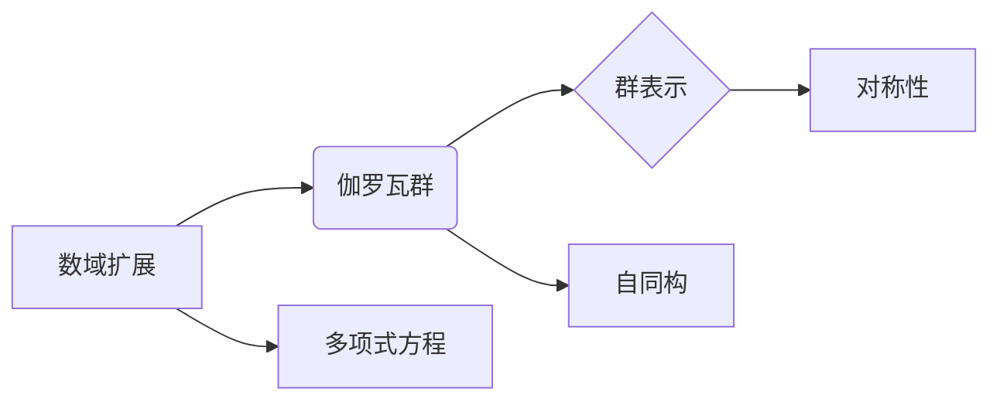

# 代数数论与伽罗瓦群表示

> 关键词：代数数论，伽罗瓦理论，数域扩展，群表示，对称性，群同态，抽象代数

## 1. 背景介绍

代数数论是数学的一个分支，它研究的是整数在有限域上的性质以及整数多项式的性质。伽罗瓦理论则是代数数论中的一个重要部分，它研究了多项式方程的可解性以及它们根之间的关系。伽罗瓦群表示则是伽罗瓦理论的一个应用，它将群论与数论结合起来，揭示了数域扩展与对称性之间的关系。

本文将深入探讨代数数论与伽罗瓦群表示的原理和应用，旨在帮助读者理解这一领域的核心概念和它们在数学和计算机科学中的重要性。

## 2. 核心概念与联系

### 2.1 核心概念

- **数域扩展**：数域扩展是代数数论中的一个基本概念，它指的是从一个数域到另一个包含它的数域的扩展。例如，从有理数域 $\mathbb{Q}$ 到复数域 $\mathbb{C}$ 的扩展。
- **伽罗瓦群**：伽罗瓦群是伽罗瓦理论的核心，它是由一个多项式方程的根的对称性所决定的群。伽罗瓦群中的每个元素对应于一个自同构，即一个保持多项式方程的根不变的双射。
- **群表示**：群表示是群论中的一个概念，它将群的元素映射到线性变换上。在伽罗瓦理论中，群表示用于描述数域扩展的结构。
- **对称性**：对称性是伽罗瓦群表示中的一个关键概念，它描述了数域扩展中元素的等价性。

### 2.2 Mermaid 流程图



### 2.3 核心概念联系

数域扩展是伽罗瓦群和群表示的起点，多项式方程的根的对称性决定了伽罗瓦群的结构。伽罗瓦群通过自同构来表示数域扩展中的对称性，而群表示则提供了研究这些自同构的工具。

## 3. 核心算法原理 & 具体操作步骤

### 3.1 算法原理概述

伽罗瓦理论的核心算法是寻找一个多项式方程的伽罗瓦群，并分析其结构。这个过程通常包括以下步骤：

1. 找出多项式方程的所有根。
2. 确定这些根在扩域中的对称性。
3. 构建伽罗瓦群，其中每个元素都是一个根的自同构。
4. 使用群表示理论来分析伽罗瓦群的结构。

### 3.2 算法步骤详解

1. **求解多项式方程**：使用数值方法或代数方法求解多项式方程，得到其所有根。
2. **确定根的对称性**：分析根之间的关系，确定它们在扩域中的对称性。
3. **构建伽罗瓦群**：根据根的对称性，构建伽罗瓦群。
4. **分析群结构**：使用群表示理论分析伽罗瓦群的结构，包括子群、同构等。

### 3.3 算法优缺点

**优点**：

- 伽罗瓦理论提供了一种统一的方法来研究多项式方程的可解性。
- 群表示理论提供了一种强大的工具来分析伽罗瓦群的结构。

**缺点**：

- 伽罗瓦理论的应用通常需要深厚的数学背景。
- 群表示理论的分析可能非常复杂。

### 3.4 算法应用领域

伽罗瓦理论和群表示理论在数学和计算机科学中有广泛的应用，包括：

- **密码学**：用于分析密码系统的安全性。
- **编码理论**：用于设计错误纠正码。
- **群表示论**：用于研究群的性质。

## 4. 数学模型和公式 & 详细讲解 & 举例说明

### 4.1 数学模型构建

伽罗瓦理论的核心数学模型是伽罗瓦群，它是由一个多项式方程的根的对称性所决定的群。伽罗瓦群中的每个元素是一个自同构，即一个保持多项式方程的根不变的双射。

### 4.2 公式推导过程

伽罗瓦群的构建通常涉及以下步骤：

1. **定义多项式方程**：设 $f(x) \in \mathbb{Q}[x]$ 是一个不可约多项式。
2. **定义扩域**：设 $E$ 是 $f(x)$ 的分裂域。
3. **定义伽罗瓦群**：设 $G = \text{Gal}(E/\mathbb{Q})$ 是 $E$ 在 $\mathbb{Q}$ 下的伽罗瓦群。
4. **定义自同构**：对于 $G$ 中的每个元素 $\sigma$，定义 $\sigma(a_i)$ 为 $f(x)$ 的根 $a_i$ 在 $E$ 中的像。

### 4.3 案例分析与讲解

考虑多项式方程 $f(x) = x^3 - 2$。这个方程的分裂域是 $E = \mathbb{Q}(\sqrt[3]{2}, \omega)$，其中 $\omega$ 是单位根 $e^{2\pi i/3}$。伽罗瓦群 $G = \text{Gal}(E/\mathbb{Q})$ 是由两个自同构 $\sigma_1$ 和 $\sigma_2$ 生成的，其中 $\sigma_1(\sqrt[3]{2}) = \omega \sqrt[3]{2}$ 和 $\sigma_2(\sqrt[3]{2}) = \omega^2 \sqrt[3]{2}$。

### 4.4 常见问题解答

**Q1：为什么伽罗瓦群是重要的？**

A1：伽罗瓦群是研究多项式方程可解性的关键，它揭示了多项式方程的根之间的关系和数域扩展的结构。

**Q2：群表示理论在伽罗瓦理论中有什么作用？**

A2：群表示理论提供了一种工具来分析伽罗瓦群的结构，包括子群、同构等，从而帮助我们更好地理解数域扩展的性质。

## 5. 项目实践：代码实例和详细解释说明

### 5.1 开发环境搭建

为了进行伽罗瓦理论的实践，我们需要一个支持抽象代数操作的数学软件，例如SageMath。

### 5.2 源代码详细实现

以下是一个使用SageMath实现伽罗瓦群计算的简单示例：

```python
# 定义多项式
f = x^3 - 2

# 找出多项式的根
roots = f.roots()

# 构建扩域
E = f.split_field()

# 获取伽罗瓦群
G = E.galois_group()

# 输出伽罗瓦群的结构
G
```

### 5.3 代码解读与分析

这段代码首先定义了一个多项式 $f(x) = x^3 - 2$，然后找出了它的根。接下来，代码构建了多项式的分裂域 $E$，并获取了伽罗瓦群 $G$。最后，代码输出了伽罗瓦群的结构。

### 5.4 运行结果展示

运行上述代码，我们将得到伽罗瓦群的结构，包括它的元素和子群。

## 6. 实际应用场景

伽罗瓦理论在数学和计算机科学中有许多实际应用，以下是一些例子：

- **密码学**：伽罗瓦理论被用于设计安全的多项式密码系统。
- **编码理论**：伽罗瓦理论帮助设计纠错码，提高数据传输的可靠性。
- **群表示论**：伽罗瓦理论在研究群的表示时提供了理论基础。

### 6.4 未来应用展望

随着数学和计算机科学的不断发展，伽罗瓦理论的应用领域将不断扩大。例如，它可以被用于：

- **量子计算**：伽罗瓦理论可以帮助设计量子算法。
- **机器学习**：伽罗瓦理论可以帮助理解机器学习模型的对称性。
- **数据加密**：伽罗瓦理论可以提供新的数据加密方法。

## 7. 工具和资源推荐

### 7.1 学习资源推荐

- **书籍**：
  - "Abstract Algebra" by David S. Dummit and Richard M. Foote
  - "Galois Theory" by Ian Nicholas Stewart
- **在线资源**：
  - [SageMath](https://www.sagemath.org/)
  - [Galois Theory](https://en.wikipedia.org/wiki/Galois_theory)

### 7.2 开发工具推荐

- **SageMath**：一个开源的数学软件，支持抽象代数操作。
- **Mathematica**：一个功能强大的数学计算软件。

### 7.3 相关论文推荐

- "Galois Theory of Algebraic Curves" by David R. Hayes
- "The Arithmetic of Elliptic Curves" by Joseph H. Silverman

## 8. 总结：未来发展趋势与挑战

### 8.1 研究成果总结

伽罗瓦理论是代数数论和群论的一个重要分支，它研究数域扩展和多项式方程的根之间的关系。伽罗瓦群表示是伽罗瓦理论的一个应用，它揭示了数域扩展与对称性之间的关系。

### 8.2 未来发展趋势

伽罗瓦理论将继续在数学和计算机科学中发挥重要作用。随着新算法和新工具的发展，伽罗瓦理论的应用将更加广泛。

### 8.3 面临的挑战

伽罗瓦理论的研究需要深厚的数学背景，这限制了其应用范围。未来，如何将伽罗瓦理论的知识传授给更广泛的受众是一个挑战。

### 8.4 研究展望

伽罗瓦理论将继续在数学和计算机科学中发挥重要作用。随着新算法和新工具的发展，伽罗瓦理论的应用将更加广泛，并在新的领域取得突破。

## 9. 附录：常见问题与解答

**Q1：什么是伽罗瓦理论？**

A1：伽罗瓦理论是代数数论和群论的一个重要分支，它研究数域扩展和多项式方程的根之间的关系。

**Q2：伽罗瓦群表示有什么作用？**

A2：伽罗瓦群表示揭示了数域扩展与对称性之间的关系，是研究数域扩展结构的重要工具。

**Q3：伽罗瓦理论有哪些实际应用？**

A3：伽罗瓦理论在密码学、编码理论和群表示论等领域有广泛的应用。

作者：禅与计算机程序设计艺术 / Zen and the Art of Computer Programming