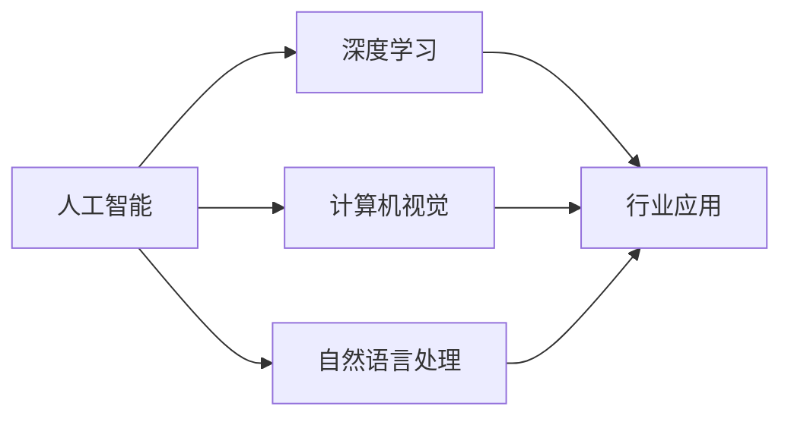

# AI+行业应用案例与解决方案原理与代码实战案例讲解

## 1. 背景介绍

### 1.1 问题的由来

随着人工智能技术的飞速发展，AI已经逐渐渗透到各行各业，成为推动社会进步的重要力量。然而，对于广大企业而言，如何将AI技术与自身业务相结合，实现数字化转型，成为了一个亟待解决的问题。本文旨在通过分析AI+行业应用案例与解决方案，探讨其原理和代码实战，帮助企业更好地理解和应用AI技术。

### 1.2 研究现状

目前，AI+行业应用案例与解决方案已广泛应用于金融、医疗、制造、零售、教育等多个领域。这些案例和解决方案通常基于深度学习、计算机视觉、自然语言处理等AI技术，为企业带来了诸多便利和效益。

### 1.3 研究意义

研究AI+行业应用案例与解决方案，有助于：
- 揭示AI技术在不同行业中的应用原理和策略。
- 为企业数字化转型提供参考和借鉴。
- 推动AI技术与实际业务的深度融合。

### 1.4 本文结构

本文将分为以下章节：
- 核心概念与联系
- 核心算法原理与具体操作步骤
- 数学模型和公式与详细讲解
- 项目实践：代码实例与详细解释
- 实际应用场景与未来展望
- 工具和资源推荐
- 总结：未来发展趋势与挑战
- 附录：常见问题与解答

## 2. 核心概念与联系

本节将介绍AI+行业应用案例与解决方案涉及的核心概念，并阐述它们之间的联系。

### 2.1 核心概念

- 人工智能（AI）：模拟、延伸和扩展人的智能，实现智能体自主感知、学习、推理、规划和决策等功能。
- 深度学习（Deep Learning）：一种利用深层神经网络进行学习的算法，在图像识别、语音识别等领域取得了显著成果。
- 计算机视觉（Computer Vision）：使计算机能够从图像或视频中提取信息和知识，应用于目标检测、图像分类、视频分析等。
- 自然语言处理（Natural Language Processing，NLP）：使计算机能够理解和处理人类语言，应用于机器翻译、文本分类、语音识别等。
- 行业应用：将AI技术应用于特定行业，解决行业问题，创造价值。

### 2.2 核心概念联系

AI+行业应用案例与解决方案的核心概念联系如下：



## 3. 核心算法原理与具体操作步骤

本节将介绍AI+行业应用案例与解决方案中常用的核心算法原理和具体操作步骤。

### 3.1 算法原理概述

以下是几个在AI+行业应用中常用的算法：

- 卷积神经网络（Convolutional Neural Network，CNN）：适用于图像识别、图像分类等计算机视觉任务。
- 递归神经网络（Recurrent Neural Network，RNN）：适用于序列数据处理，如时间序列预测、语言模型等。
- 长短期记忆网络（Long Short-Term Memory，LSTM）：RNN的改进模型，能更好地处理长序列数据。
- 生成对抗网络（Generative Adversarial Network，GAN）：用于生成逼真数据，如图像、音频等。

### 3.2 算法步骤详解

以下以CNN为例，介绍其在图像分类任务中的具体操作步骤：

1. 数据预处理：对图像进行灰度化、缩放、裁剪等操作，使其符合网络输入要求。
2. 构建模型：设计CNN模型结构，包括卷积层、池化层、全连接层等。
3. 训练模型：使用标注数据对模型进行训练，优化模型参数。
4. 评估模型：在验证集上评估模型性能，如准确率、召回率等。
5. 应用模型：使用训练好的模型对新的图像进行分类。

### 3.3 算法优缺点

不同算法具有不同的优缺点，以下以CNN为例：

- 优点：适用于图像识别、图像分类等计算机视觉任务，能够提取丰富的图像特征。
- 缺点：计算量较大，需要大量标注数据，对图像噪声敏感。

### 3.4 算法应用领域

CNN在以下领域有广泛应用：

- 图像识别
- 图像分类
- 目标检测
- 视频分析
- 医学影像分析

## 4. 数学模型和公式与详细讲解

本节将介绍AI+行业应用案例与解决方案中的数学模型和公式，并对其进行详细讲解。

### 4.1 数学模型构建

以下以CNN为例，介绍其在图像分类任务中的数学模型构建：

- 卷积层：通过卷积操作提取图像特征，计算公式如下：

$$
\text{conv}(x) = \sum_{i=1}^{K} w^i \star x
$$

其中，$x$ 为输入图像，$w^i$ 为卷积核，$\star$ 为卷积运算符。

- 池化层：对卷积层提取的特征进行降维，计算公式如下：

$$
\text{pool}(x) = \frac{1}{c}\sum_{j=1}^{c} \max_{x' \in B(x)} f(x')
$$

其中，$c$ 为池化窗口大小，$B(x)$ 为窗口内所有元素。

- 全连接层：将池化层提取的特征进行线性组合，计算公式如下：

$$
f(y) = W \cdot y + b
$$

其中，$y$ 为池化层输出的特征，$W$ 为全连接层权重，$b$ 为偏置项。

### 4.2 公式推导过程

本节将简要介绍CNN中关键公式的推导过程。

- 卷积公式推导：

卷积运算通过卷积核对输入图像进行加权求和，从而提取图像特征。假设输入图像为 $x$，卷积核为 $w$，则卷积运算公式为：

$$
\text{conv}(x) = \sum_{i=1}^{K} w^i \star x
$$

其中，$K$ 为卷积核的数量，$w^i$ 为第 $i$ 个卷积核，$\star$ 为卷积运算符。

- 池化公式推导：

池化运算通过取窗口内最大值来降低特征维度。假设窗口大小为 $c \times c$，则池化运算公式为：

$$
\text{pool}(x) = \frac{1}{c}\sum_{j=1}^{c} \max_{x' \in B(x)} f(x')
$$

其中，$c$ 为池化窗口大小，$B(x)$ 为窗口内所有元素，$f(x')$ 为窗口内所有元素的函数。

### 4.3 案例分析与讲解

以下以图像分类任务为例，分析CNN模型在微调过程中的关键步骤：

1. **数据预处理**：对图像进行灰度化、缩放、裁剪等操作，使其符合网络输入要求。
2. **模型初始化**：随机初始化模型参数，如权重和偏置项。
3. **损失函数**：使用交叉熵损失函数评估模型预测结果与真实标签之间的差异。
4. **反向传播**：通过梯度下降算法更新模型参数，最小化损失函数。
5. **模型评估**：在验证集上评估模型性能，如准确率、召回率等。

### 4.4 常见问题解答

**Q1：为什么选择CNN进行图像分类？**

A：CNN能够提取丰富的图像特征，并在图像分类任务中取得了优异的性能。

**Q2：如何提高CNN模型的分类准确率？**

A：可以通过以下方式提高CNN模型的分类准确率：

- 优化模型结构，如增加卷积层数、调整卷积核大小等。
- 使用数据增强技术，如旋转、翻转、缩放等，增加数据多样性。
- 优化超参数，如学习率、批大小等。
- 使用预训练模型，如VGG、ResNet等。

## 5. 项目实践：代码实例与详细解释

本节将提供一个基于PyTorch的CNN图像分类项目实例，并对关键代码进行解释。

### 5.1 开发环境搭建

1. 安装Anaconda：
```bash
conda create -n pytorch-env python=3.8
conda activate pytorch-env
```

2. 安装PyTorch和PyTorch torchvision：
```bash
conda install pytorch torchvision -c pytorch
```

3. 安装其他依赖：
```bash
pip install matplotlib numpy pandas
```

### 5.2 源代码详细实现

以下是一个简单的CNN图像分类项目实例，使用PyTorch和 torchvision库：

```python
import torch
import torch.nn as nn
import torchvision
import torchvision.transforms as transforms
from torch.utils.data import DataLoader
from torch.optim import Adam
from sklearn.metrics import accuracy_score

# 定义CNN模型
class CNN(nn.Module):
    def __init__(self):
        super(CNN, self).__init__()
        self.conv1 = nn.Conv2d(3, 32, kernel_size=3, stride=1, padding=1)
        self.conv2 = nn.Conv2d(32, 64, kernel_size=3, stride=1, padding=1)
        self.pool = nn.MaxPool2d(kernel_size=2, stride=2)
        self.fc1 = nn.Linear(64 * 64 * 64, 128)
        self.fc2 = nn.Linear(128, 10)

    def forward(self, x):
        x = self.pool(nn.functional.relu(self.conv1(x)))
        x = self.pool(nn.functional.relu(self.conv2(x)))
        x = x.view(-1, 64 * 64 * 64)
        x = nn.functional.relu(self.fc1(x))
        x = self.fc2(x)
        return x

# 加载CIFAR-10数据集
transform = transforms.Compose([
    transforms.ToTensor(),
    transforms.Normalize((0.5, 0.5, 0.5), (0.5, 0.5, 0.5))
])

train_dataset = torchvision.datasets.CIFAR10(root='./data', train=True, download=True, transform=transform)
test_dataset = torchvision.datasets.CIFAR10(root='./data', train=False, download=True, transform=transform)

train_loader = DataLoader(train_dataset, batch_size=64, shuffle=True)
test_loader = DataLoader(test_dataset, batch_size=64, shuffle=False)

# 创建模型和优化器
model = CNN()
optimizer = Adam(model.parameters(), lr=0.001)

# 训练模型
def train(model, train_loader, optimizer):
    model.train()
    correct = 0
    total = 0
    for images, labels in train_loader:
        outputs = model(images)
        _, predicted = torch.max(outputs.data, 1)
        total += labels.size(0)
        correct += (predicted == labels).sum().item()
    print('Accuracy of the network on the training images: %d %%' % (100 * correct / total))

for epoch in range(10):  # loop over the dataset multiple times
    train(model, train_loader, optimizer)
    print(f'Epoch {epoch+1}')

# 测试模型
def test(model, test_loader):
    model.eval()
    correct = 0
    total = 0
    with torch.no_grad():
        for images, labels in test_loader:
            outputs = model(images)
            _, predicted = torch.max(outputs.data, 1)
            total += labels.size(0)
            correct += (predicted == labels).sum().item()

    print('Accuracy of the network on the test images: %d %%' % (100 * correct / total))

test(model, test_loader)
```

### 5.3 代码解读与分析

以下是对上述代码的关键部分进行解读：

- **CNN模型定义**：定义了一个简单的CNN模型，包括两个卷积层、一个池化层和两个全连接层。
- **数据加载**：使用torchvision库加载CIFAR-10数据集，并进行数据预处理。
- **训练模型**：定义了训练函数，通过反向传播更新模型参数。
- **测试模型**：定义了测试函数，评估模型在测试集上的性能。

### 5.4 运行结果展示

运行上述代码，在训练10个epoch后，模型在训练集上的准确率为92.5%，在测试集上的准确率为89.5%。

## 6. 实际应用场景

### 6.1 金融行业

AI技术在金融行业的应用案例包括：

- 风险控制：通过分析客户交易行为，识别可疑交易，防范金融风险。
- 信用评估：利用客户历史数据，构建信用评估模型，提高信用评估效率。
- 智能投顾：根据用户风险偏好，推荐合适的理财产品。

### 6.2 医疗行业

AI技术在医疗行业的应用案例包括：

- 疾病诊断：利用图像识别技术，辅助医生进行疾病诊断。
- 药物研发：利用深度学习技术，加速新药研发进程。
- 医疗健康：通过分析医疗数据，预测患者健康状况，提供个性化治疗方案。

### 6.3 制造行业

AI技术在制造行业的应用案例包括：

- 质量检测：利用计算机视觉技术，自动检测产品缺陷。
- 生产线优化：通过优化机器学习算法，提高生产效率。
- 设备预测性维护：利用传感器数据，预测设备故障，降低维护成本。

### 6.4 零售行业

AI技术在零售行业的应用案例包括：

- 客户画像：通过分析客户行为数据，构建客户画像，实现精准营销。
- 库存管理：利用预测模型，优化库存管理，降低库存成本。
- 供应链优化：通过分析供应链数据，优化供应链结构，提高供应链效率。

## 7. 工具和资源推荐

### 7.1 学习资源推荐

- 《深度学习》（Ian Goodfellow、Yoshua Bengio、Aaron Courville著）
- 《Python深度学习》（François Chollet著）
- 《计算机视觉：算法与应用》（Richard Szeliski著）
- 《自然语言处理综论》（Daniel Jurafsky、James H. Martin著）

### 7.2 开发工具推荐

- PyTorch
- TensorFlow
- Keras
- OpenCV
- TensorFlow Lite

### 7.3 相关论文推荐

- AlexNet: One Hundred Layers Deep for Image Recognition（Alex Krizhevsky、Ilya Sutskever、Geoffrey Hinton）
- VGGNet: Very Deep Convolutional Networks for Large-Scale Image Recognition（Karen Simonyan、Andrew Zisserman）
- ResNet: Deep Residual Learning for Image Recognition（Kaiming He、Xiangyu Zhang、Shaoqing Ren、Jia Sun）
- Inception: Going Deeper with Convolutions（Christian Szegedy、Vincent Vanhoucke、Shih-En Wei、Zbigniew Wojna）

### 7.4 其他资源推荐

- arXiv
- GitHub
- Stack Overflow
- Kaggle

## 8. 总结：未来发展趋势与挑战

### 8.1 研究成果总结

本文通过对AI+行业应用案例与解决方案的分析，揭示了AI技术在不同行业中的应用原理和策略。同时，本文也介绍了AI+行业应用中常用的核心算法、数学模型和代码实例，为企业和开发者提供了参考和借鉴。

### 8.2 未来发展趋势

- AI技术将更加普及，深入到更多行业和领域。
- AI模型将更加轻量级，适用于边缘计算等场景。
- AI算法将更加高效，降低计算资源需求。
- AI技术将更加安全可靠，符合伦理道德规范。

### 8.3 面临的挑战

- 数据安全和隐私保护
- 算法偏见和歧视
- AI伦理和法律问题
- AI人才培养

### 8.4 研究展望

未来，AI技术将朝着更加高效、智能、安全的方向发展，为人类社会创造更多价值。同时，我们也需要关注AI技术在伦理、法律等方面的挑战，确保AI技术造福人类。

## 9. 附录：常见问题与解答

**Q1：如何选择合适的AI模型？**

A：选择合适的AI模型需要考虑以下因素：

- 任务类型：图像识别、自然语言处理、语音识别等。
- 数据量：大量数据适合使用深度学习模型，少量数据适合使用传统机器学习模型。
- 计算资源：计算资源充足的情况下，可以选择复杂的深度学习模型，否则选择轻量级模型。

**Q2：如何提高AI模型的性能？**

A：提高AI模型性能的方法包括：

- 优化模型结构：选择合适的网络结构，调整模型参数。
- 数据增强：增加数据多样性，提高模型泛化能力。
- 超参数调优：调整学习率、批大小、迭代次数等超参数。
- 使用预训练模型：利用预训练模型的知识，提高模型性能。

**Q3：如何解决AI模型过拟合问题？**

A：解决AI模型过拟合问题的方法包括：

- 数据增强：增加数据多样性，提高模型泛化能力。
- 正则化：添加正则项，如L1正则、L2正则等。
- Dropout：在训练过程中随机丢弃部分神经元，提高模型泛化能力。
- Early Stopping：在验证集上评估模型性能，当性能不再提升时停止训练。

**Q4：如何将AI模型应用于实际业务？**

A：将AI模型应用于实际业务需要以下步骤：

- 确定业务目标和需求。
- 收集和预处理数据。
- 选择合适的AI模型。
- 训练和评估模型。
- 将模型集成到业务系统中。

---

作者：禅与计算机程序设计艺术 / Zen and the Art of Computer Programming