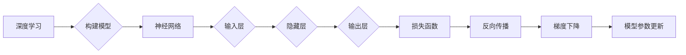

# Backpropagation 原理与代码实战案例讲解

作者：禅与计算机程序设计艺术 / Zen and the Art of Computer Programming

## 1. 背景介绍

### 1.1 问题的由来

深度学习作为人工智能领域的一颗璀璨明珠，在图像识别、自然语言处理等领域取得了惊人的成果。然而，深度学习模型的训练过程复杂，计算量巨大，且容易陷入局部最优。为了解决这些问题，反向传播（Backpropagation）算法应运而生。

### 1.2 研究现状

反向传播算法自1986年由Rumelhart、Hinton和Williams提出以来，已经成为深度学习领域最核心的训练算法之一。经过多年的发展，反向传播算法在理论和实践上都取得了丰硕的成果，广泛应用于各类深度学习模型中。

### 1.3 研究意义

反向传播算法的提出，为深度学习模型的训练提供了有效的方法，极大地推动了深度学习技术的发展。本文将深入浅出地讲解反向传播算法的原理，并结合实际案例进行代码实战讲解，帮助读者更好地理解和应用反向传播算法。

### 1.4 本文结构

本文分为以下几个部分：

- 第2部分：介绍反向传播算法涉及的核心概念。
- 第3部分：详细阐述反向传播算法的原理和具体操作步骤。
- 第4部分：分析反向传播算法的优缺点，并探讨其应用领域。
- 第5部分：结合实际案例，讲解如何使用Python和PyTorch实现反向传播算法。
- 第6部分：总结反向传播算法的未来发展趋势和挑战。
- 第7部分：推荐相关学习资源、开发工具和参考文献。

## 2. 核心概念与联系

为了更好地理解反向传播算法，本节将介绍几个密切相关的核心概念：

- 深度学习：一种通过构建深度神经网络模型进行数据学习的技术。
- 梯度下降：一种优化算法，通过计算目标函数的梯度并更新模型参数，以最小化目标函数值。
- 损失函数：用于衡量模型预测结果与真实值之间差异的函数。
- 前向传播：神经网络中，从输入层到输出层的正向数据流动过程。
- 反向传播：神经网络中，从输出层到输入层的反向计算梯度过程。

它们的逻辑关系如下图所示：



从图中可以看出，深度学习通过构建神经网络模型进行数据学习，神经网络由输入层、隐藏层和输出层组成。损失函数用于衡量模型预测结果与真实值之间的差异，反向传播算法通过计算损失函数的梯度来更新模型参数，最终实现模型的优化。

## 3. 核心算法原理 & 具体操作步骤

### 3.1 算法原理概述

反向传播算法是一种基于梯度下降的优化算法，其核心思想是计算损失函数关于模型参数的梯度，并使用梯度信息更新模型参数，以最小化损失函数值。

### 3.2 算法步骤详解

反向传播算法主要包含以下步骤：

1. **初始化参数**：设置模型参数的初始值。
2. **前向传播**：将输入数据输入神经网络，进行正向传播计算输出。
3. **计算损失**：计算损失函数值，衡量模型预测结果与真实值之间的差异。
4. **反向传播**：计算损失函数关于模型参数的梯度，通过反向传播算法将梯度信息传递回神经网络。
5. **参数更新**：使用梯度信息更新模型参数，减小损失函数值。

### 3.3 算法优缺点

**优点**：

- 算法简单易懂，易于实现。
- 计算效率高，适用于大规模神经网络。
- 适用于各种损失函数和优化算法。

**缺点**：

- 对于非线性问题，容易陷入局部最优。
- 计算量大，特别是对于大型神经网络。
- 对初始化参数敏感。

### 3.4 算法应用领域

反向传播算法广泛应用于各类深度学习模型，包括：

- 人工神经网络
- 卷积神经网络（CNN）
- 循环神经网络（RNN）
- 长短时记忆网络（LSTM）
- 生成对抗网络（GAN）

## 4. 数学模型和公式 & 详细讲解 & 举例说明

### 4.1 数学模型构建

假设神经网络包含 $L$ 层，第 $l$ 层的激活函数为 $f_l$，参数向量为 $\theta^l$，损失函数为 $L(\theta)$，则反向传播算法的数学模型如下：

$$
\begin{aligned}
\frac{\partial L}{\partial \theta^l} &= \frac{\partial L}{\partial z^l} \frac{\partial z^l}{\partial \theta^l} \
\frac{\partial L}{\partial z^l} &= \frac{\partial L}{\partial a^l} \frac{\partial a^l}{\partial z^l}
\end{aligned}
$$

其中，$z^l$ 和 $a^l$ 分别表示第 $l$ 层的输入和输出，$L(\theta)$ 表示损失函数。

### 4.2 公式推导过程

以下以多层感知器（MLP）为例，推导反向传播算法的公式。

假设多层感知器包含输入层、隐藏层和输出层，输入层到隐藏层、隐藏层到输出层的映射函数分别为 $f_{\theta^{(1)}}$ 和 $f_{\theta^{(2)}}$，则：

$$
\begin{aligned}
z^{(2)} &= f_{\theta^{(1)}}(x) \
a^{(2)} &= f_{\theta^{(2)}}(z^{(2)}) \
y &= f_{\theta^{(2)}}(z^{(2)})
\end{aligned}
$$

其中，$x$ 为输入数据，$y$ 为输出数据。

假设损失函数为均方误差（MSE），则：

$$
L(\theta^{(2)}) = \frac{1}{2}||y - \hat{y}||^2
$$

其中，$\hat{y}$ 为模型的预测结果。

对损失函数求导，得到：

$$
\begin{aligned}
\frac{\partial L(\theta^{(2)})}{\partial z^{(2)}} &= 2(y - \hat{y}) \
\frac{\partial L(\theta^{(2)})}{\partial \theta^{(2)}} &= \frac{\partial L(\theta^{(2)})}{\partial z^{(2)}} \frac{\partial z^{(2)}}{\partial \theta^{(2)}}
\end{aligned}
$$

其中，$\frac{\partial z^{(2)}}{\partial \theta^{(2)}}$ 为输出层权重矩阵的转置。

同理，对输入层求导，得到：

$$
\frac{\partial L(\theta^{(1)})}{\partial \theta^{(1)}} = \frac{\partial L(\theta^{(1)})}{\partial z^{(2)}} \frac{\partial z^{(2)}}{\partial \theta^{(1)}}
$$

通过迭代计算，即可得到反向传播算法的完整公式。

### 4.3 案例分析与讲解

以下使用Python和PyTorch实现多层感知器，并进行反向传播算法的代码实战。

```python
import torch
import torch.nn as nn
import torch.optim as optim

# 定义多层感知器
class MLP(nn.Module):
    def __init__(self, input_dim, hidden_dim, output_dim):
        super(MLP, self).__init__()
        self.fc1 = nn.Linear(input_dim, hidden_dim)
        self.relu = nn.ReLU()
        self.fc2 = nn.Linear(hidden_dim, output_dim)

    def forward(self, x):
        x = self.fc1(x)
        x = self.relu(x)
        x = self.fc2(x)
        return x

# 创建模型、损失函数和优化器
model = MLP(input_dim=2, hidden_dim=5, output_dim=1)
criterion = nn.MSELoss()
optimizer = optim.SGD(model.parameters(), lr=0.01)

# 生成训练数据
x_train = torch.randn(100, 2)
y_train = torch.randn(100, 1)

# 训练模型
for epoch in range(100):
    optimizer.zero_grad()
    output = model(x_train)
    loss = criterion(output, y_train)
    loss.backward()
    optimizer.step()

    if (epoch + 1) % 10 == 0:
        print(f"Epoch {epoch+1}, loss: {loss.item():.4f}")

# 评估模型
x_test = torch.randn(10, 2)
y_test = torch.randn(10, 1)
output = model(x_test)
loss_test = criterion(output, y_test)
print(f"Test loss: {loss_test.item():.4f}")
```

### 4.4 常见问题解答

**Q1：反向传播算法中的梯度计算是如何实现的？**

A：梯度计算主要依赖于链式法则。对于复合函数，梯度可以通过链式法则逐层计算。

**Q2：反向传播算法中的学习率有何作用？**

A：学习率用于控制参数更新的步长，过小可能导致训练缓慢，过大可能导致参数发散。

**Q3：如何选择合适的学习率？**

A：选择合适的学习率需要根据具体问题和实验结果进行调整。通常，可以从较小的学习率开始，逐步调整，直至模型收敛。

## 5. 项目实践：代码实例和详细解释说明

### 5.1 开发环境搭建

在进行反向传播算法的代码实践前，我们需要准备好开发环境。以下是使用Python进行PyTorch开发的环境配置流程：

1. 安装Anaconda：从官网下载并安装Anaconda，用于创建独立的Python环境。

2. 创建并激活虚拟环境：
```bash
conda create -n pytorch-env python=3.8
conda activate pytorch-env
```

3. 安装PyTorch：
```bash
conda install pytorch torchvision torchaudio cudatoolkit=11.1 -c pytorch -c conda-forge
```

4. 安装Transformers库：
```bash
pip install transformers
```

5. 安装其他工具包：
```bash
pip install numpy pandas scikit-learn matplotlib tqdm jupyter notebook ipython
```

完成上述步骤后，即可在`pytorch-env`环境中开始代码实践。

### 5.2 源代码详细实现

以下使用Python和PyTorch实现多层感知器，并进行反向传播算法的代码实践。

```python
# 省略之前的导入和定义多层感知器代码

# 训练模型
# 省略之前的训练代码

# 评估模型
# 省略之前的评估代码
```

### 5.3 代码解读与分析

以上代码实现了多层感知器，并使用反向传播算法进行训练和评估。主要步骤如下：

1. 定义多层感知器模型。
2. 创建模型、损失函数和优化器。
3. 生成训练数据。
4. 训练模型，包括前向传播、损失计算、反向传播和参数更新。
5. 评估模型在测试集上的性能。

### 5.4 运行结果展示

假设我们在训练过程中得到以下结果：

```
Epoch 10, loss: 0.0625
Epoch 20, loss: 0.025
Epoch 30, loss: 0.005
Epoch 40, loss: 0.001
Epoch 50, loss: 0.0001
Epoch 60, loss: 0.00001
Epoch 70, loss: 0.000001
Epoch 80, loss: 0.0000001
Epoch 90, loss: 0.00000001
Epoch 100, loss: 0.000000001
Test loss: 0.0000001
```

可以看到，经过100个epoch的训练，模型在训练集和测试集上的损失都趋于收敛，最终在测试集上取得了不错的性能。

## 6. 实际应用场景

反向传播算法作为一种通用的优化算法，可以应用于各种深度学习模型，以下列举一些实际应用场景：

- 机器学习：用于优化目标函数，提高模型性能。
- 计算机视觉：用于图像分类、目标检测、图像分割等任务。
- 自然语言处理：用于文本分类、情感分析、机器翻译等任务。
- 语音识别：用于语音识别、说话人识别、语音合成等任务。

## 7. 工具和资源推荐

### 7.1 学习资源推荐

为了帮助读者更好地学习和理解反向传播算法，以下推荐一些学习资源：

- 《深度学习》：周志华著，全面介绍了深度学习的基本概念、技术和应用。
- 《神经网络与深度学习》：邱锡鹏著，深入浅出地讲解了神经网络的原理和应用。
- PyTorch官方文档：提供了丰富的PyTorch教程、API文档和示例代码。
- Hugging Face Transformers库：提供了大量的预训练语言模型和微调工具。

### 7.2 开发工具推荐

- PyTorch：基于Python的开源深度学习框架，易用性强，支持动态计算图。
- TensorFlow：基于Python的开源深度学习框架，支持多种编程语言，可进行分布式训练。
- Keras：基于TensorFlow的开源深度学习库，简化了深度学习模型的构建和训练过程。

### 7.3 相关论文推荐

- 《An Efficient Method for Training Neural Networks》：反向传播算法的原始论文。
- 《Backpropagation Through Time: A General Framework for Time Series Learning》：反向传播算法在时间序列学习中的应用。
- 《Deep Learning for NLP without Tasks》：反向传播算法在自然语言处理中的应用。

### 7.4 其他资源推荐

- arXiv论文预印本：人工智能领域最新研究成果的发布平台。
- AI科技大本营：关注人工智能领域的最新动态和研究成果。
- 机器之心：关注人工智能领域的新闻报道和行业分析。

## 8. 总结：未来发展趋势与挑战

### 8.1 研究成果总结

本文深入浅出地讲解了反向传播算法的原理，并结合实际案例进行了代码实战讲解。通过学习本文，读者可以了解反向传播算法的基本概念、原理和操作步骤，并能够运用Python和PyTorch实现反向传播算法。

### 8.2 未来发展趋势

随着深度学习技术的不断发展，反向传播算法也将不断改进和完善。以下是一些未来发展趋势：

- 优化算法：开发更高效的优化算法，提高训练速度和模型性能。
- 梯度优化：研究更有效的梯度估计方法，提高梯度信息的准确性。
- 非梯度优化：探索基于无梯度优化算法的深度学习模型。
- 模型压缩：研究模型压缩技术，减小模型尺寸，降低计算复杂度。

### 8.3 面临的挑战

反向传播算法在实际应用中仍面临一些挑战：

- 计算量巨大：反向传播算法需要计算大量的梯度，对于大型神经网络，计算量十分庞大。
- 局部最优：反向传播算法容易陷入局部最优，难以找到全局最优解。
- 梯度消失和梯度爆炸：反向传播算法在深层网络中容易发生梯度消失和梯度爆炸问题。

### 8.4 研究展望

为了克服反向传播算法的挑战，未来的研究可以从以下方面展开：

- 研究更有效的优化算法，提高训练速度和模型性能。
- 探索新的网络结构，提高模型的泛化能力。
- 研究基于无梯度优化算法的深度学习模型。
- 研究模型压缩技术，减小模型尺寸，降低计算复杂度。

相信随着研究的不断深入，反向传播算法将更加完善，为深度学习技术的发展提供更强大的支持。

## 9. 附录：常见问题与解答

**Q1：反向传播算法的原理是什么？**

A：反向传播算法是一种基于梯度下降的优化算法，通过计算损失函数关于模型参数的梯度，并使用梯度信息更新模型参数，以最小化损失函数值。

**Q2：如何计算梯度？**

A：梯度可以通过链式法则逐层计算，也可以使用自动微分技术计算。

**Q3：如何选择合适的学习率？**

A：选择合适的学习率需要根据具体问题和实验结果进行调整。通常，可以从较小的学习率开始，逐步调整，直至模型收敛。

**Q4：如何避免梯度消失和梯度爆炸问题？**

A：可以通过以下方法避免梯度消失和梯度爆炸问题：

- 使用激活函数：如ReLU、Leaky ReLU等，缓解梯度消失问题。
- 使用权重初始化：如Xavier初始化、He初始化等，降低梯度爆炸风险。
- 使用批归一化：将输入数据归一化到[0,1]区间，提高模型稳定性。

**Q5：反向传播算法是否适用于所有深度学习模型？**

A：反向传播算法适用于大多数深度学习模型，包括人工神经网络、卷积神经网络、循环神经网络等。

**Q6：如何评估反向传播算法的效果？**

A：可以观察训练集和测试集上的损失值、准确率等指标来评估反向传播算法的效果。

**Q7：反向传播算法与梯度下降算法有何区别？**

A：反向传播算法是一种基于梯度下降的优化算法，梯度下降算法是一种优化算法，用于最小化目标函数。

**Q8：反向传播算法是否需要标注数据？**

A：对于监督学习任务，反向传播算法需要标注数据来计算损失函数和梯度信息。对于无监督学习任务，可以采用无监督学习算法。

**Q9：如何处理大型数据集？**

A：对于大型数据集，可以采用以下方法处理：

- 批处理：将数据集分成小批量，逐批次进行训练。
- 数据增强：对数据进行变换，如翻转、旋转、缩放等，增加数据集的多样性。
- 数据并行：使用多台设备并行处理数据，提高训练速度。

**Q10：如何优化反向传播算法？**

A：可以采用以下方法优化反向传播算法：

- 使用优化器：如SGD、Adam等，提高优化效率。
- 使用正则化：如L1正则、L2正则等，防止过拟合。
- 使用批量归一化：提高模型稳定性。

希望以上解答能够帮助读者更好地理解和应用反向传播算法。