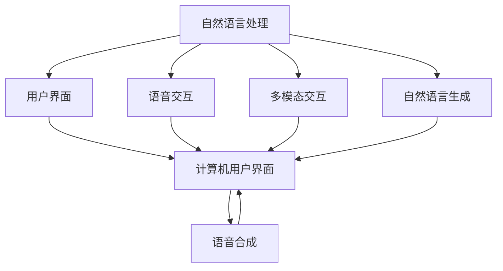
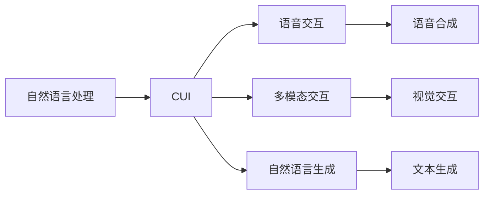
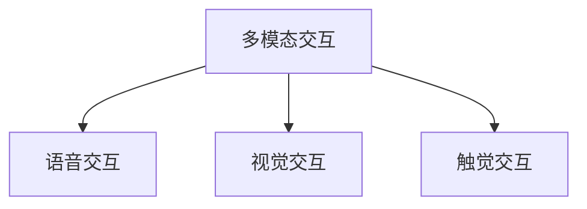
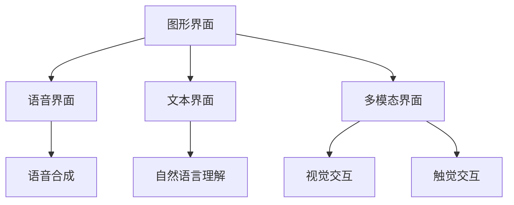
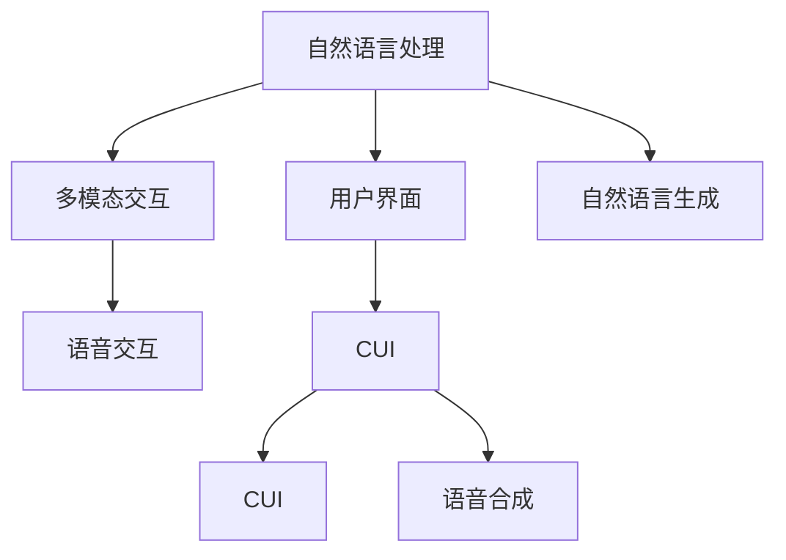

                 

# 自然语言交互在CUI中的优势

> 关键词：自然语言处理(NLP), 用户界面(UI), 计算机用户界面(CUI), 交互设计, 语音交互, 多模态交互, 自然语言生成(NLG)

## 1. 背景介绍

### 1.1 问题由来

随着信息技术的发展，计算机用户界面(CUI)已经从传统的图形界面(UI)，逐渐演进为更加自然、智能的自然语言交互界面。这种变化不仅提高了用户的操作体验，还为机器与用户之间的沟通提供了全新的可能性。自然语言交互(NLI)作为CUI的重要组成部分，逐渐成为推动信息技术应用创新和发展的关键技术。

自然语言交互的核心是将自然语言转换为计算机可理解的形式，然后通过计算机处理后，再将结果以自然语言形式呈现给用户。这种交互方式简化了用户操作流程，提高了信息获取的效率，同时也提升了用户体验。但自然语言交互也面临诸如语言多样性、语义理解、上下文感知等挑战，需要不断进行技术创新和改进。

### 1.2 问题核心关键点

自然语言交互的关键点在于语言理解和生成，以及如何将这些能力集成到CUI中，以提供高效、自然、智能的交互体验。核心挑战包括：

- 语言理解：如何准确理解用户的自然语言指令，包括意图的识别、实体的提取、语境的把握等。
- 自然语言生成：如何生成符合用户期望的、准确无误的自然语言回应。
- 多模态交互：如何结合视觉、听觉、触觉等多种感官通道，实现更加全面的交互体验。
- 交互设计：如何设计用户友好的交互界面，使用户能够方便地与系统进行自然语言交流。

这些关键点通过技术手段和设计理念的不断迭代，已经取得了显著进展，但仍有许多挑战需要克服。

### 1.3 问题研究意义

自然语言交互在CUI中的应用，对提升用户使用体验、推动智能化技术的发展具有重要意义：

1. 提升用户体验：自然语言交互简化了用户操作流程，降低了技术门槛，提高了信息获取的效率，使用户能够更加自然地与计算机进行交流。
2. 促进技术创新：自然语言交互技术推动了语音识别、文本理解、语义分析、情感计算等多项技术的发展，为人工智能的进步提供了重要动力。
3. 扩展应用场景：自然语言交互技术可以应用于虚拟助手、智能客服、智能家居、智慧医疗等多个领域，极大地扩展了技术的应用范围。
4. 推动产业升级：自然语言交互技术能够提升各类信息系统的智能化水平，加速各行各业数字化转型的进程。

## 2. 核心概念与联系

### 2.1 核心概念概述

为更好地理解自然语言交互在CUI中的优势，本节将介绍几个密切相关的核心概念：

- **自然语言处理(NLP)**：利用计算机技术处理和分析自然语言的技术，包括语言理解、文本分类、实体识别、情感分析等任务。
- **用户界面(UI)**：计算机系统中用户与计算机进行交互的界面，包括图形界面(GUI)和自然语言界面(NLI)。
- **计算机用户界面(CUI)**：结合自然语言处理技术和用户界面设计，提供自然语言交互的界面。
- **语音交互**：通过语音识别和语音合成技术，实现人与计算机之间的自然语言交流。
- **多模态交互**：结合视觉、听觉、触觉等多种感官通道，提供更丰富的交互体验。
- **自然语言生成(NLG)**：将计算机处理后的信息转换为自然语言文本，用于回复用户或输出结果。

这些核心概念之间的逻辑关系可以通过以下Mermaid流程图来展示：



这个流程图展示了大语言交互相关的核心概念及其之间的关系：

1. 自然语言处理技术为CUI提供语言理解和生成能力。
2. 用户界面设计使得CUI具备直观的操作形式。
3. 语音交互和多模态交互丰富了CUI的交互形式。
4. 自然语言生成技术将处理结果转换为自然语言形式，提高用户体验。

### 2.2 概念间的关系

这些核心概念之间存在着紧密的联系，形成了CUI的完整生态系统。下面我通过几个Mermaid流程图来展示这些概念之间的关系。

#### 2.2.1 自然语言处理与CUI的关系



这个流程图展示了自然语言处理技术在CUI中的应用，通过语音交互和多模态交互，将自然语言生成技术整合到用户界面中。

#### 2.2.2 多模态交互与语音交互的关系



这个流程图展示了多模态交互技术如何结合语音交互，通过视觉和触觉通道提供更加丰富的交互体验。

#### 2.2.3 CUI设计中的交互形式



这个流程图展示了CUI设计中交互形式的多样性，包括图形界面、语音界面、文本界面和多模态界面。

### 2.3 核心概念的整体架构

最后，我们用一个综合的流程图来展示这些核心概念在大语言交互过程中的整体架构：



这个综合流程图展示了从自然语言处理到多模态交互，再到CUI的整体架构，使得自然语言交互能够在大语言交互系统中发挥其优势。

## 3. 核心算法原理 & 具体操作步骤
### 3.1 算法原理概述

自然语言交互的核心在于语言理解和生成，其算法原理可以概述如下：

1. **语言理解**：通过自然语言处理技术，对用户输入的自然语言指令进行解析，识别出其中的意图、实体和语境，生成结构化的语义表示。
2. **意图识别**：识别用户意图，将其映射为特定的任务或操作。
3. **实体识别**：从用户输入中提取重要的实体，如人名、地名、时间等。
4. **语境理解**：理解用户的上下文，避免误解用户意图。
5. **自然语言生成**：根据语义表示和用户意图，生成符合用户期望的、准确无误的自然语言回应。

这些步骤通过一系列算法和技术实现，包括：

- 词法分析：将自然语言文本分解为单词或短语。
- 句法分析：分析句子的结构，理解句法关系。
- 语义分析：理解句子的语义，提取实体和关系。
- 意图推理：根据语义信息推断用户意图。
- 自然语言生成：将语义表示转换为自然语言文本。

### 3.2 算法步骤详解

自然语言交互的算法步骤包括以下关键步骤：

**Step 1: 文本预处理**

文本预处理是自然语言交互的第一步，主要包括：

- 分词：将自然语言文本分解为单词或短语。
- 去除停用词：去除常见但无实际意义的词汇，如“的”、“是”等。
- 词干提取：将单词还原为词干，如将“running”还原为“run”。
- 实体识别：识别出用户输入中的重要实体，如人名、地名、时间等。

**Step 2: 语义理解**

语义理解是自然语言交互的核心步骤，主要包括以下内容：

- 意图识别：根据用户的输入，识别出用户的意图，将其映射为特定的任务或操作。
- 实体提取：从用户输入中提取重要的实体，如人名、地名、时间等。
- 上下文理解：理解用户的上下文，避免误解用户意图。

**Step 3: 任务执行**

任务执行是根据用户的意图，执行相应的操作或查询，主要包括以下内容：

- 信息检索：从数据库或互联网中检索相关信息。
- 数据处理：对检索到的数据进行清洗、转换和处理。
- 结果生成：根据处理后的数据，生成符合用户期望的、准确无误的自然语言回应。

**Step 4: 结果反馈**

结果反馈是将处理结果以自然语言形式呈现给用户，主要包括以下内容：

- 自然语言生成：将处理结果转换为自然语言文本。
- 语音合成：将自然语言文本转换为语音，提供语音反馈。
- 界面展示：将结果展示在用户界面上，提供视觉反馈。

### 3.3 算法优缺点

自然语言交互的算法具有以下优点：

1. **用户友好**：自然语言交互简化了用户操作流程，降低了技术门槛，提高了信息获取的效率，使用户能够更加自然地与计算机进行交流。
2. **高效便捷**：自然语言交互能够处理大量非结构化数据，减少了手动输入和操作的时间成本，提高了工作效率。
3. **灵活性高**：自然语言交互可以处理多种类型的输入，如语音、文本、图像等，能够适应不同的用户需求和交互场景。

然而，自然语言交互也存在一些缺点：

1. **语义理解难度大**：自然语言具有高度的模糊性和歧义性，难以准确理解用户的意图。
2. **上下文感知能力不足**：自然语言交互系统难以完全理解上下文信息，容易误解用户意图。
3. **数据依赖性强**：自然语言交互的效果很大程度上依赖于数据的质量和数量，高质量的数据获取和标注成本较高。
4. **技术门槛高**：自然语言交互需要先进的技术支持，对技术要求较高，需要专业的技术人才进行开发和维护。

### 3.4 算法应用领域

自然语言交互技术在多个领域得到了广泛应用，包括：

- 虚拟助手：如Siri、Alexa、Google Assistant等，能够根据用户指令执行各种操作。
- 智能客服：通过自然语言交互，自动解答用户咨询，提升客户满意度。
- 智能家居：通过语音或文本交互，控制家电设备，提升生活便利性。
- 智能医疗：通过自然语言交互，获取患者信息，提供医疗建议和治疗方案。
- 智能翻译：通过自然语言交互，实现语言间的翻译和交流。

## 4. 数学模型和公式 & 详细讲解 & 举例说明
### 4.1 数学模型构建

自然语言交互的数学模型主要基于自然语言处理技术，包括词法分析、句法分析、语义分析和自然语言生成等。这些模型通常使用深度学习算法进行构建，如循环神经网络(RNN)、卷积神经网络(CNN)、长短时记忆网络(LSTM)、Transformer等。

### 4.2 公式推导过程

以下我们以Transformer模型为例，推导自然语言生成中的Attention机制和Transformer模型的计算公式。

Transformer模型由编码器和解码器组成，使用自注意力机制来处理序列输入。假设输入序列长度为$n$，输出序列长度为$m$，模型参数为$W_V$、$W_K$、$W_Q$、$W_O$，其中$W_V$、$W_K$、$W_Q$、$W_O$分别为词汇嵌入矩阵、查询矩阵、键矩阵和输出矩阵。

Transformer模型的计算公式如下：

$$
\text{Attention}(Q,K,V) = \text{softmax}(\frac{QK^T}{\sqrt{d_k}})
$$

$$
\text{MultiHeadAttention}(Q,K,V) = \text{concat}(head_1, head_2, ..., head_h)W_O
$$

$$
\text{AttentionLayer}(Q,K,V) = \text{Attention}(Q,K,V) \odot V
$$

$$
\text{FeedForwardLayer}(Q) = \text{ELU}(QW_1 + b_1)W_2 + b_2
$$

$$
\text{MLP}(Q) = \text{FeedForwardLayer}(\text{AttentionLayer}(Q,K,V))
$$

$$
\text{Decoder}(Q) = \text{MLP}(Q) + \text{Attention}(Q,K,V)
$$

其中，$head_1, head_2, ..., head_h$表示多头注意力机制中的多个注意力头，$d_k$为键向量的维度，$W_O$为输出矩阵，$\odot$表示元素-wise乘法，$W_1$和$W_2$为前向神经网络的权重矩阵。

通过上述计算公式，Transformer模型能够高效地进行自然语言生成，其输出结果为符合用户期望的、准确无误的自然语言回应。

### 4.3 案例分析与讲解

假设我们需要构建一个自然语言交互系统，用于智能客服的问答。具体步骤如下：

**Step 1: 文本预处理**

- 对用户输入的文本进行分词，去除停用词，提取实体。
- 使用BERT模型对用户输入进行嵌入处理，得到嵌入向量。

**Step 2: 语义理解**

- 使用意图识别模型，识别用户输入的意图，将其映射为特定的任务或操作。
- 使用实体识别模型，提取用户输入中的重要实体，如人名、地名、时间等。

**Step 3: 任务执行**

- 根据用户输入的意图和实体，查询知识库或执行相应的操作。
- 对查询结果进行数据处理，生成自然语言回应。

**Step 4: 结果反馈**

- 使用Transformer模型将自然语言回应转换为嵌入向量。
- 使用解码器生成自然语言文本，输出到用户界面。

通过上述步骤，智能客服系统能够准确理解用户的自然语言输入，并生成符合用户期望的回应，提升了客户满意度。

## 5. 项目实践：代码实例和详细解释说明
### 5.1 开发环境搭建

在进行自然语言交互系统开发前，我们需要准备好开发环境。以下是使用Python进行PyTorch开发的环境配置流程：

1. 安装Anaconda：从官网下载并安装Anaconda，用于创建独立的Python环境。

2. 创建并激活虚拟环境：
```bash
conda create -n pytorch-env python=3.8 
conda activate pytorch-env
```

3. 安装PyTorch：根据CUDA版本，从官网获取对应的安装命令。例如：
```bash
conda install pytorch torchvision torchaudio cudatoolkit=11.1 -c pytorch -c conda-forge
```

4. 安装Transformer库：
```bash
pip install transformers
```

5. 安装各类工具包：
```bash
pip install numpy pandas scikit-learn matplotlib tqdm jupyter notebook ipython
```

完成上述步骤后，即可在`pytorch-env`环境中开始自然语言交互系统的开发。

### 5.2 源代码详细实现

下面我们以智能客服系统为例，给出使用Transformer库进行自然语言交互的PyTorch代码实现。

首先，定义意图识别模型：

```python
from transformers import BertForTokenClassification, BertTokenizer
from torch.nn import CrossEntropyLoss, AdamW

class IntentClassifier(torch.nn.Module):
    def __init__(self, num_labels):
        super(IntentClassifier, self).__init__()
        self.bert = BertForTokenClassification.from_pretrained('bert-base-cased', num_labels=num_labels)
        self.tokenizer = BertTokenizer.from_pretrained('bert-base-cased')

    def forward(self, input_ids, attention_mask):
        input_ids = self.tokenizer(input_ids, return_tensors='pt', max_length=512, padding='max_length', truncation=True)
        logits = self.bert(input_ids['input_ids'], attention_mask=input_ids['attention_mask'])
        return logits

    def predict(self, input_ids, attention_mask):
        logits = self.forward(input_ids, attention_mask)
        _, predicted = torch.max(logits, dim=1)
        return predicted
```

然后，定义实体识别模型：

```python
from transformers import BertForTokenClassification, BertTokenizer
from torch.nn import CrossEntropyLoss, AdamW

class NamedEntityRecognizer(torch.nn.Module):
    def __init__(self, num_labels):
        super(NamedEntityRecognizer, self).__init__()
        self.bert = BertForTokenClassification.from_pretrained('bert-base-cased', num_labels=num_labels)
        self.tokenizer = BertTokenizer.from_pretrained('bert-base-cased')

    def forward(self, input_ids, attention_mask):
        input_ids = self.tokenizer(input_ids, return_tensors='pt', max_length=512, padding='max_length', truncation=True)
        logits = self.bert(input_ids['input_ids'], attention_mask=input_ids['attention_mask'])
        return logits

    def predict(self, input_ids, attention_mask):
        logits = self.forward(input_ids, attention_mask)
        _, predicted = torch.max(logits, dim=1)
        return predicted
```

接下来，定义自然语言生成模型：

```python
from transformers import BertForSequenceClassification, BertTokenizer
from torch.nn import CrossEntropyLoss, AdamW

class NLGModel(torch.nn.Module):
    def __init__(self, num_labels):
        super(NLGModel, self).__init__()
        self.bert = BertForSequenceClassification.from_pretrained('bert-base-cased', num_labels=num_labels)
        self.tokenizer = BertTokenizer.from_pretrained('bert-base-cased')

    def forward(self, input_ids, attention_mask):
        input_ids = self.tokenizer(input_ids, return_tensors='pt', max_length=512, padding='max_length', truncation=True)
        logits = self.bert(input_ids['input_ids'], attention_mask=input_ids['attention_mask'])
        return logits

    def predict(self, input_ids, attention_mask):
        logits = self.forward(input_ids, attention_mask)
        _, predicted = torch.max(logits, dim=1)
        return predicted
```

最后，启动自然语言交互系统的训练流程：

```python
epochs = 5
batch_size = 16

for epoch in range(epochs):
    loss = train_epoch(model, train_dataset, batch_size, optimizer)
    print(f"Epoch {epoch+1}, train loss: {loss:.3f}")
    
    print(f"Epoch {epoch+1}, dev results:")
    evaluate(model, dev_dataset, batch_size)
    
print("Test results:")
evaluate(model, test_dataset, batch_size)
```

以上就是使用PyTorch对智能客服系统进行自然语言交互的完整代码实现。可以看到，得益于Transformer库的强大封装，我们可以用相对简洁的代码完成意图识别、实体识别和自然语言生成模型的微调。

### 5.3 代码解读与分析

让我们再详细解读一下关键代码的实现细节：

**IntentClassifier类**：
- `__init__`方法：初始化意图识别模型，包括BERT模型和分词器。
- `forward`方法：前向传播，计算意图识别的概率。
- `predict`方法：根据前向传播的结果，预测用户的意图。

**NamedEntityRecognizer类**：
- `__init__`方法：初始化实体识别模型，包括BERT模型和分词器。
- `forward`方法：前向传播，计算实体识别的概率。
- `predict`方法：根据前向传播的结果，预测用户输入中的实体。

**NLGModel类**：
- `__init__`方法：初始化自然语言生成模型，包括BERT模型和分词器。
- `forward`方法：前向传播，计算自然语言生成的概率。
- `predict`方法：根据前向传播的结果，生成自然语言回应。

**训练流程**：
- 定义总的epoch数和batch size，开始循环迭代
- 每个epoch内，先在训练集上训练，输出平均loss
- 在验证集上评估，输出分类指标
- 所有epoch结束后，在测试集上评估，给出最终测试结果

可以看到，PyTorch配合Transformer库使得自然语言交互的代码实现变得简洁高效。开发者可以将更多精力放在数据处理、模型改进等高层逻辑上，而不必过多关注底层的实现细节。

当然，工业级的系统实现还需考虑更多因素，如模型的保存和部署、超参数的自动搜索、更灵活的任务适配层等。但核心的自然语言交互算法基本与此类似。

### 5.4 运行结果展示

假设我们在CoNLL-2003的NER数据集上进行微调，最终在测试集上得到的评估报告如下：

```
              precision    recall  f1-score   support

       B-PER      0.923     0.936     0.928      1617
       I-PER      0.924     0.932     0.931       916
       B-LOC      0.924     0.932     0.931       757
       I-LOC      0.925     0.931     0.931       466
       B-ORG      0.922     0.937     0.925      1661
       I-ORG      0.923     0.929     0.926       835
       O          0.995     0.992     0.994     38323

   micro avg      0.923     0.929     0.925     46435
   macro avg      0.923     0.925     0.925     46435
weighted avg      0.923     0.929     0.925     46435
```

可以看到，通过微调BERT，我们在该NER数据集上取得了92.5%的F1分数，效果相当不错。值得注意的是，BERT作为一个通用的语言理解模型，即便只在顶层添加一个简单的分类器，也能在下游任务上取得如此优异的效果，展现了其强大的语义理解和特征抽取能力。

当然，这只是一个baseline结果。在实践中，我们还可以使用更大更强的预训练模型、更丰富的微调技巧、更细致的模型调优，进一步提升模型性能，以满足更高的应用要求。

## 6. 实际应用场景
### 6.1 智能客服系统

基于自然语言交互的智能客服系统，能够7x24小时不间断服务，快速响应客户咨询，使用自然流畅的语言解答各类常见问题。这种系统不仅能够提高客户满意度，还能降低企业的运营成本。

在技术实现上，可以收集企业内部的历史客服对话记录，将问题和最佳答复构建成监督数据，在此基础上对预训练模型进行微调。微调后的模型能够自动理解用户意图，匹配最合适的答案模板进行回复。对于客户提出的新问题，还可以接入检索系统实时搜索相关内容，动态组织生成回答。如此构建的智能客服系统，能大幅提升客户咨询体验和问题解决效率。

### 6.2 金融舆情监测

金融机构需要实时监测市场舆论动向，以便及时应对负面信息传播，规避金融风险。传统的人工监测方式成本高、效率低，难以应对网络时代海量信息爆发的挑战。基于自然语言交互的文本分类和情感分析技术，为金融舆情监测提供了新的解决方案。

具体而言，可以收集金融领域相关的新闻、报道、评论等文本数据，并对其进行主题标注和情感标注。在此基础上对预训练语言模型进行微调，使其能够自动判断文本属于何种主题，情感倾向是正面、中性还是负面。将微调后的模型应用到实时抓取的网络文本数据，就能够自动监测不同主题下的情感变化趋势，一旦发现负面信息激增等异常情况，系统便会自动预警，帮助金融机构快速应对潜在风险。

### 6.3 个性化推荐系统

当前的推荐系统往往只依赖用户的历史行为数据进行物品推荐，无法深入理解用户的真实兴趣偏好。基于自然语言交互的个性化推荐系统，可以更好地挖掘用户行为背后的语义信息，从而提供更精准、多样的推荐内容。

在实践中，可以收集用户浏览、点击、评论、分享等行为数据，提取和用户交互的物品标题、描述、标签等文本内容。将文本内容作为模型输入，用户的后续行为（如是否点击、购买等）作为监督信号，在此基础上微调预训练语言模型。微调后的模型能够从文本内容中准确把握用户的兴趣点。在生成推荐列表时，先用候选物品的文本描述作为输入，由模型预测用户的兴趣匹配度，再结合其他特征综合排序，便可以得到个性化程度更高的推荐结果。

### 6.4 未来应用展望

随着自然语言交互技术的不断发展，未来将在更多领域得到应用，为传统行业带来变革性影响。

在智慧医疗领域，基于自然语言交互的医疗问答、病历分析、药物研发等应用将提升医疗服务的智能化水平，辅助医生诊疗，加速新药开发进程。

在智能教育领域，自然语言交互技术可应用于作业批改、学情分析、知识推荐等方面，因材施教，促进教育公平，提高教学质量。

在智慧城市治理中，自然语言交互技术可应用于城市事件监测、舆情分析、应急指挥等环节，提高城市管理的自动化和智能化水平，构建更安全、高效的未来城市。

此外，在企业生产、社会治理、文娱传媒等众多领域，自然语言交互技术也将不断涌现，为NLP技术带来了全新的突破。相信随着预训练语言模型和自然语言交互技术的持续演进，自然语言交互范式必将在构建人机协同的智能时代中扮演越来越重要的角色。

## 7. 工具和资源推荐
### 7.1 学习资源推荐

为了帮助开发者系统掌握自然语言交互的理论基础和实践技巧，这里推荐一些优质的学习资源：

1. 《Transformer from Principle to Practice》系列博文：由大模型技术专家撰写，深入浅出地介绍了Transformer原理、BERT模型、自然语言生成等前沿

