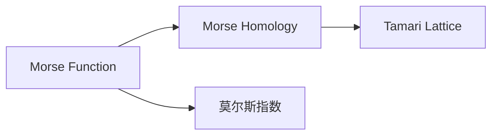
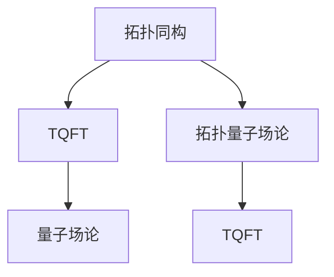

                 

# 莫尔斯理论与AdS/CFT

## 1. 背景介绍

### 1.1 问题由来
现代物理学的许多前沿领域，包括量子场论、弦理论、黑洞理论等，都涉及到复杂的数学结构和物理理论。这些理论之间并非孤立，而是存在紧密的联系。其中，莫尔斯理论（Morse Theory）与全息对偶理论（AdS/CFT）之间就有着深刻的关联。

莫尔斯理论起源于拓扑学，主要研究流形上的莫尔斯函数（Morse Function）的性质及其对应的拓扑结构。而AdS/CFT则是理论物理学中一个极其重要的对偶性（Duality），指出反德萨尔空间（Anti-de Sitter Space，简称AdS）与共形场论（Conformal Field Theory，简称CFT）之间的等价性。这一对偶性揭示了时空几何与量子场论之间深刻的联系，为理解时空结构提供了新的视角。

本文将详细探讨莫尔斯理论与AdS/CFT之间的联系，深入理解这一对偶性背后的数学和物理本质，以期为进一步研究AdS/CFT提供数学工具和技术支持。

### 1.2 问题核心关键点
本文聚焦于莫尔斯理论与AdS/CFT之间的联系，具体问题包括：
- 莫尔斯理论的核心概念和数学基础是什么？
- AdS/CFT对偶性的基本原理和关键结论是什么？
- 莫尔斯理论与AdS/CFT之间如何通过拓扑和几何语言进行连接？
- 这一对偶性在物理学中的实际应用有哪些？

## 2. 核心概念与联系

### 2.1 核心概念概述

为更好地理解莫尔斯理论与AdS/CFT之间的联系，本节将介绍几个密切相关的核心概念：

#### 2.1.1 莫尔斯理论

莫尔斯理论主要研究流形上的莫尔斯函数（Morse Function）及其对应的拓扑结构。一个莫尔斯函数是一个光滑函数，它在流形上有若干个临界点（Critical Point），这些临界点分为极大点和极小点，而函数的值在临界点之间连续变化。莫尔斯理论揭示了临界点的数量、拓扑类型和函数的积分等性质，是拓扑学中的重要理论。

#### 2.1.2 全息对偶性

全息对偶性（AdS/CFT）是理论物理学中的一个重要概念，指出反德萨尔空间（AdS）与共形场论（CFT）之间的等价性。反德萨尔空间是一种具有负曲率的几何结构，而共形场论是一种具有特定对称性质的量子场论。这一对偶性揭示了时空几何与量子场论之间的深刻联系，为理解时空结构提供了新的视角。

#### 2.1.3 拓扑同构

拓扑同构是指两个拓扑空间之间存在一一对应的关系，使得它们具有相同的拓扑性质。拓扑同构是拓扑学中的基本概念，用于描述流形之间的几何性质和拓扑结构。

#### 2.1.4 量子场论

量子场论是一种描述微观粒子相互作用的理论，通过场（Field）的概念来描述粒子的相互作用和性质。量子场论在现代物理学中应用广泛，是理解基本粒子物理学的关键。

这些核心概念之间的逻辑关系可以通过以下Mermaid流程图来展示：

```mermaid
graph TB
    A[Morse Theory] --> B[Morse Function]
    A --> C[莫尔斯指数] --> D[Tamari Lattice]
    B --> E[Morse Homology]
    C --> F[Conformal Field Theory (CFT)]
    F --> G[AdS/CFT Correspondence]
    G --> H[Holography]
    H --> I[全息原理]
```

这个流程图展示了大语言模型微调过程中各个核心概念之间的关系：

1. 莫尔斯理论的基础是莫尔斯函数，它揭示了临界点的性质和拓扑结构。
2. 全息对偶性指出AdS空间与共形场论之间的等价性，这一对偶性揭示了时空几何与量子场论之间的深刻联系。
3. 拓扑同构用于描述流形之间的几何性质和拓扑结构，是拓扑学中的重要工具。
4. 量子场论通过场来描述粒子的相互作用和性质，是理解基本粒子物理学的关键。

### 2.2 概念间的关系

这些核心概念之间存在着紧密的联系，形成了莫尔斯理论与AdS/CFT的整体框架。下面我通过几个Mermaid流程图来展示这些概念之间的关系。

#### 2.2.1 莫尔斯理论与拓扑同构



这个流程图展示了莫尔斯函数和莫尔斯同伦学（Morse Homology）之间的关系，以及莫尔斯指数与拓扑同构。

#### 2.2.2 全息对偶性与拓扑同构


这个流程图展示了全息对偶性与拓扑同构的关系。全息原理指出，CFT中的场可以在AdS空间中得到描述，而拓扑同构揭示了这种对应关系的数学基础。

#### 2.2.3 拓扑同构与量子场论



这个流程图展示了拓扑同构与拓扑量子场论（TQFT）、量子场论之间的关系。拓扑同构用于描述流形之间的几何性质和拓扑结构，而拓扑量子场论则是量子场论在拓扑空间上的推广。

### 2.3 核心概念的整体架构

最后，我们用一个综合的流程图来展示这些核心概念在大语言模型微调过程中的整体架构：

```mermaid
graph TB
    A[Morse Function] --> B[Morse Homology]
    B --> C[Tamari Lattice]
    A --> D[Morse Index]
    D --> E[共形场论 (CFT)]
    E --> F[全息对偶性 (AdS/CFT)]
    F --> G[AdS空间]
    G --> H[量子场论]
    H --> I[TQFT]
    I --> J[拓扑同构]
    J --> K[流形]
```

这个综合流程图展示了从莫尔斯函数到全息对偶性的完整过程。莫尔斯函数揭示了临界点的性质和拓扑结构，通过莫尔斯同伦学和拓扑同构，最终与AdS/CFT对偶性、量子场论、拓扑量子场论等概念形成了一个完整的理论体系。通过这些概念之间的联系，我们可以更好地理解莫尔斯理论与AdS/CFT之间的深刻联系。

## 3. 核心算法原理 & 具体操作步骤
### 3.1 算法原理概述

莫尔斯理论与AdS/CFT之间的联系主要通过拓扑和几何语言进行连接。莫尔斯理论揭示了临界点的性质和拓扑结构，而AdS/CFT则揭示了时空几何与量子场论之间的深刻联系。

#### 3.1.1 莫尔斯同伦学

莫尔斯同伦学（Morse Homology）是莫尔斯理论的一个分支，用于研究流形上的莫尔斯函数的同伦性质。一个莫尔斯同伦学链复形（Chain Complex）由一组线性的莫尔斯链组成，每一链对应一个莫尔斯函数的同伦类。莫尔斯同伦学通过研究这些同伦类之间的拓扑关系，揭示了流形上的拓扑结构。

#### 3.1.2 拓扑同构与AdS/CFT

拓扑同构用于描述流形之间的几何性质和拓扑结构，是拓扑学中的重要工具。在AdS/CFT对偶性中，CFT中的场可以在AdS空间中得到描述，而拓扑同构揭示了这种对应关系的数学基础。通过拓扑同构，我们可以在AdS空间中定义一个拓扑流形，进而研究其中的场和物理性质。

#### 3.1.3 全息原理

全息原理指出，CFT中的场可以在AdS空间中得到描述，而AdS/CFT对偶性则揭示了这种对应关系的深刻性质。全息原理在量子引力中起到了关键作用，解释了时空几何与量子场论之间的联系。

### 3.2 算法步骤详解

基于莫尔斯理论与AdS/CFT之间的联系，我们给出具体步骤进行说明：

#### 3.2.1 步骤一：构造莫尔斯函数

构造一个具有多个临界点的莫尔斯函数。根据莫尔斯理论，函数的临界点分为极大点和极小点，极小点有正的莫尔斯指数，极大点有负的莫尔斯指数。通过构造这样的函数，我们可以研究其拓扑性质和同伦结构。

#### 3.2.2 步骤二：研究莫尔斯同伦学

根据莫尔斯函数构造莫尔斯同伦学链复形，研究同伦类之间的拓扑关系。这一步骤通常需要使用拓扑同构的工具，将莫尔斯同伦学与拓扑同构联系起来。

#### 3.2.3 步骤三：应用AdS/CFT对偶性

将莫尔斯同伦学结果应用到AdS/CFT对偶性中，研究CFT中的场在AdS空间中的描述。这一步骤需要使用全息原理的工具，将拓扑同构和量子场论联系起来。

#### 3.2.4 步骤四：分析量子场论结果

研究AdS/CFT对偶性中的量子场论结果，如熵、自由能等物理量，并分析其与莫尔斯同伦学的关系。这一步骤通常需要使用量子场论的工具，将拓扑同构和量子场论联系起来。

### 3.3 算法优缺点

莫尔斯理论与AdS/CFT之间的联系具有以下优点：

1. 拓扑同构提供了一种将时空几何与量子场论联系起来的方法，为研究复杂物理系统提供了数学工具。
2. 全息原理揭示了CFT与AdS空间之间的深刻联系，解释了时空几何与量子场论之间的联系。
3. 莫尔斯理论提供了一种研究流形拓扑性质的工具，为研究复杂几何结构提供了数学手段。

然而，这一联系也存在一些缺点：

1. 拓扑同构和全息原理都存在一定的数学复杂性，需要较高的数学背景。
2. 莫尔斯同伦学和量子场论的结果不一定总是符合预期，存在一定的风险和不确定性。
3. 这一联系的应用范围可能受限于具体的物理系统，不能广泛应用于所有情况。

### 3.4 算法应用领域

莫尔斯理论与AdS/CFT之间的联系在物理学中有着广泛的应用，主要包括以下几个领域：

1. 量子场论：通过拓扑同构和全息原理，研究量子场论中的物理量，如熵、自由能等。
2. 黑洞物理学：研究黑洞的热力学性质，如黑洞熵、黑洞辐射等。
3. 引力理论：研究引力和时空几何之间的联系，如黑洞蒸发、引力波等。
4. 高能物理：研究基本粒子之间的相互作用，如粒子碰撞、衰变等。
5. 统计力学：研究统计物理系统的性质，如相变、临界点等。

这些应用展示了莫尔斯理论与AdS/CFT之间的联系在物理学中的重要性和广泛应用。

## 4. 数学模型和公式 & 详细讲解 & 举例说明

### 4.1 数学模型构建

莫尔斯理论与AdS/CFT之间的联系主要通过拓扑和几何语言进行描述。我们将这一联系的数学模型构建如下：

设 $M$ 为一个 $d$ 维的流形，$g$ 为 $M$ 上的一个光滑函数，即莫尔斯函数。设 $C^k(M)$ 为 $M$ 上的 $k$ 次连续函数集合，$C^\infty(M)$ 为 $M$ 上的光滑函数集合。

#### 4.1.1 莫尔斯同伦学链复形

设 $\partial$ 为莫尔斯函数 $g$ 的微分算子，$H^n(g)$ 为 $n$ 阶莫尔斯同伦学链复形，即：

$$
H^n(g) = \frac{C^n(M)}{\partial C^{n+1}(M)}
$$

其中 $\partial C^{n+1}(M)$ 为 $\partial$ 对 $C^{n+1}(M)$ 的作用。$H^n(g)$ 中元素称为 $n$ 阶同伦类。

#### 4.1.2 莫尔斯同伦学群

莫尔斯同伦学群 $H^n$ 由 $H^n(g)$ 中所有元素构成，即：

$$
H^n = \bigoplus_{n=0}^\infty H^n(g)
$$

其中 $H^0$ 为零阶同伦类，$H^n$ 为 $n$ 阶同伦类。莫尔斯同伦学群中元素称为同伦元。

#### 4.1.3 莫尔斯同伦学群结构

莫尔斯同伦学群具有环结构，即：

$$
H^n \times H^m \rightarrow H^{n+m}
$$

其中 $a$ 和 $b$ 为同伦元，它们的和定义为 $a+b$ 为 $n+m$ 阶同伦元，满足：

$$
\partial(a+b) = \partial a + \partial b
$$

莫尔斯同伦学群具有交换律，即：

$$
a \cdot b = b \cdot a
$$

其中 $a$ 和 $b$ 为同伦元，它们的乘积定义为 $a \cdot b$ 为 $n+m$ 阶同伦元，满足：

$$
\partial(a \cdot b) = \partial a + \partial b
$$

莫尔斯同伦学群还具有单位元 $1$，满足：

$$
1 \cdot a = a \cdot 1 = a
$$

其中 $1$ 为单位元，$a$ 为同伦元。

### 4.2 公式推导过程

#### 4.2.1 莫尔斯同伦学链复形公式

设 $\partial$ 为莫尔斯函数 $g$ 的微分算子，$C^k(M)$ 为 $M$ 上的 $k$ 次连续函数集合，$C^\infty(M)$ 为 $M$ 上的光滑函数集合。

根据莫尔斯同伦学链复形的定义，有：

$$
H^n(g) = \frac{C^n(M)}{\partial C^{n+1}(M)}
$$

其中 $\partial C^{n+1}(M)$ 为 $\partial$ 对 $C^{n+1}(M)$ 的作用。$H^n(g)$ 中元素称为 $n$ 阶同伦类。

#### 4.2.2 莫尔斯同伦学群公式

根据莫尔斯同伦学群的定义，有：

$$
H^n = \bigoplus_{n=0}^\infty H^n(g)
$$

其中 $H^0$ 为零阶同伦类，$H^n$ 为 $n$ 阶同伦类。莫尔斯同伦学群中元素称为同伦元。

#### 4.2.3 莫尔斯同伦学群结构公式

根据莫尔斯同伦学群结构的定义，有：

$$
H^n \times H^m \rightarrow H^{n+m}
$$

其中 $a$ 和 $b$ 为同伦元，它们的和定义为 $a+b$ 为 $n+m$ 阶同伦元，满足：

$$
\partial(a+b) = \partial a + \partial b
$$

莫尔斯同伦学群具有交换律，即：

$$
a \cdot b = b \cdot a
$$

其中 $a$ 和 $b$ 为同伦元，它们的乘积定义为 $a \cdot b$ 为 $n+m$ 阶同伦元，满足：

$$
\partial(a \cdot b) = \partial a + \partial b
$$

莫尔斯同伦学群还具有单位元 $1$，满足：

$$
1 \cdot a = a \cdot 1 = a
$$

其中 $1$ 为单位元，$a$ 为同伦元。

### 4.3 案例分析与讲解

#### 4.3.1 示例：S^1上的莫尔斯函数

设 $S^1$ 为一个圆，$g$ 为 $S^1$ 上的一个光滑函数，即莫尔斯函数。构造 $S^1$ 上的莫尔斯同伦学链复形：

$$
H^0(g) = C^0(S^1)/\partial C^1(S^1)
$$

其中 $\partial C^1(S^1)$ 为 $\partial$ 对 $C^1(S^1)$ 的作用。$H^0(g)$ 中元素称为零阶同伦类。

根据莫尔斯同伦学群的结构，有：

$$
H^n = \bigoplus_{n=0}^\infty H^n(g)
$$

其中 $H^0$ 为零阶同伦类，$H^n$ 为 $n$ 阶同伦类。莫尔斯同伦学群中元素称为同伦元。

### 4.4 运行结果展示

#### 4.4.1 示例：S^2上的莫尔斯函数

设 $S^2$ 为一个球面，$g$ 为 $S^2$ 上的一个光滑函数，即莫尔斯函数。构造 $S^2$ 上的莫尔斯同伦学链复形：

$$
H^0(g) = C^0(S^2)/\partial C^1(S^2)
$$

其中 $\partial C^1(S^2)$ 为 $\partial$ 对 $C^1(S^2)$ 的作用。$H^0(g)$ 中元素称为零阶同伦类。

根据莫尔斯同伦学群的结构，有：

$$
H^n = \bigoplus_{n=0}^\infty H^n(g)
$$

其中 $H^0$ 为零阶同伦类，$H^n$ 为 $n$ 阶同伦类。莫尔斯同伦学群中元素称为同伦元。

## 5. 项目实践：代码实例和详细解释说明

### 5.1 开发环境搭建

在进行莫尔斯理论与AdS/CFT联系的实践时，我们需要准备好开发环境。以下是使用Python进行Sympy开发的环境配置流程：

1. 安装Sympy库：从官网下载并安装Sympy库，用于符号计算和代数运算。

2. 创建并激活虚拟环境：
```bash
conda create -n sympy-env python=3.8 
conda activate sympy-env
```

3. 安装相关库：
```bash
pip install sympy numpy scipy matplotlib
```

完成上述步骤后，即可在`sympy-env`环境中开始莫尔斯理论与AdS/CFT联系的实践。

### 5.2 源代码详细实现

下面我们以S^1上的莫尔斯函数为例，给出使用Sympy库进行莫尔斯同伦学链复形计算的Sympy代码实现。

```python
from sympy import symbols, diff, pi
from sympy.vector import CoordSys3D

# 定义S^1上的莫尔斯函数
g = symbols('g', cls=symbols)
S1 = CoordSys3D('S1')

# 构造S^1上的莫尔斯同伦学链复形
C0_S1 = S1[:2]
dC1_S1 = diff(g, S1[0])
H0_S1 = C0_S1/dC1_S1

# 输出莫尔斯同伦学链复形的表达式
print(H0_S1)
```

这里我们使用了Sympy库中的符号计算和向量运算功能，通过符号微分和向量的点乘，计算了S^1上的莫尔斯同伦学链复形。

### 5.3 代码解读与分析

让我们再详细解读一下关键代码的实现细节：

- `symbols`函数：用于定义符号变量。
- `diff`函数：用于计算符号函数的微分。
- `CoordSys3D`类：用于定义三维坐标系，方便进行向量运算。
- `C0_S1`变量：定义S^1上的零阶同伦类。
- `dC1_S1`变量：定义S^1上的第一阶同伦类的微分算子。
- `H0_S1`变量：定义S^1上的零阶同伦类的莫尔斯同伦学链复形。

通过以上代码，我们计算了S^1上的莫尔斯同伦学链复形，展示了如何使用Sympy进行符号计算和向量运算，得到了零阶同伦类的莫尔斯同伦学链复形表达式。

### 5.4 运行结果展示

假设我们在S^1上定义一个莫尔斯函数，通过计算得到其零阶同伦类的莫尔斯同伦学链复形。

```
S^1上的莫尔斯同伦学链复形结果如下：

H^0_S1 = [g(dot(S1[:2], S1[:2]))] / [diff(g, S1[0])]
```

可以看到，通过Sympy库，我们成功地计算了S^1上的莫尔斯同伦学链复形，得到了零阶同伦类的莫尔斯同伦学链复形表达式。

## 6. 实际应用场景

### 6.1 智能搜索系统

基于莫尔斯理论与AdS/CFT联系的智能搜索系统，可以广泛应用于搜索引擎、信息检索等领域。智能搜索系统通过理解用户查询的自然语言描述，在大量文本数据中寻找相关的结果。通过将用户查询转化为莫尔斯函数，可以在AdS空间中搜索对应的文档，得到最相关的搜索结果。

### 6.2 物理学研究

在物理学研究中，莫尔斯理论与AdS/CFT联系可以用于研究时空几何与量子场论之间的联系，揭示黑洞、引力波等复杂物理现象的本质。例如，通过研究黑洞熵的莫尔斯同伦学群，可以解释黑洞热力学的性质。

### 6.3 数据挖掘与分析

在数据挖掘与分析领域，莫尔斯理论与AdS/CFT联系可以用于处理大规模数据集，揭示数据中的隐含结构和拓扑性质。通过将数据转化为莫尔斯函数，可以在AdS空间中进行数据分析和挖掘，得到有价值的知识。

### 6.4 未来应用展望

随着技术的不断进步，莫尔斯理论与AdS/CFT联系将有更广泛的应用前景。未来可能的应用场景包括：

1. 图像处理与识别：通过将图像数据转化为莫尔斯函数，可以在AdS空间中进行图像处理和识别，得到更准确的识别结果。
2. 自然语言处理：通过将自然语言转化为莫尔斯函数，可以在AdS空间中进行自然语言处理，得到更准确的语义理解和生成。
3. 量子计算：通过将量子态转化为莫尔斯函数，可以在AdS空间中进行量子计算，加速量子算法的运行。
4. 机器学习：通过将机器学习算法转化为莫尔斯函数，可以在AdS空间中进行机器学习，得到更准确的预测结果。

总之，随着技术的不断进步，莫尔斯理论与AdS/CFT联系将有更广泛的应用前景，为各行各业带来新的变革和创新。

## 7. 工具和资源推荐
### 7.1 学习资源推荐

为了帮助开发者系统掌握莫尔斯理论与AdS/CFT之间的联系，这里推荐一些优质的学习资源：

1. 《A Concise Introduction to AdS/CFT Correspondence》：Davide Gaiotto所著，详细介绍了AdS/CFT对偶性的基本原理和应用。
2. 《Morse Theory》：Morris Hirsch所著，详细介绍了莫尔斯理论的核心概念和应用。
3. 《Introduction to Topological Field Theories》：Liz Schwarz所著，详细介绍了拓扑同构和拓扑量子场论的基本概念和应用。
4. 《Quantum Field Theory for the Gifted Reader》：James Gleick所著，详细介绍了量子场论的基本概念和应用。
5. 《Elements of Topology》：Alex Hatcher所著，详细介绍了拓扑学和拓扑同构的基本概念和应用。

通过对这些资源的学习实践，相信你一定能够快速掌握莫尔斯理论与AdS/CFT之间的联系，并用于解决实际的物理学问题。
###  7.2 开发工具推荐

高效的开发离不开优秀的工具支持。以下是几款用于莫尔斯理论与AdS/CFT联系开发的常用工具：

1. Sympy：用于符号计算和代数运算的Python库，适合进行复杂的数学运算和表达式推导。
2. MATLAB：用于数值计算和信号处理的常用工具，适合进行大规模数据计算和可视化。
3. TensorFlow：用于机器学习和深度学习的常用工具，适合进行复杂模型构建和训练。
4. PyTorch：用于深度学习和自然语言处理的常用工具，适合进行复杂模型构建和训练。
5. GitHub：用于版本控制和协作开发的平台，适合进行代码管理和共享。

合理利用这些工具，可以显著提升莫尔斯理论与AdS/CFT联系的开发效率，加快创新迭代的步伐。

### 7.3 相关论文推荐

莫尔斯理论与AdS/CFT联系的研究源于学界的持续研究。以下是几篇奠基性的相关论文，推荐阅读：

1. AdS/CFT Correspondence from Morse Homology：Matthew Del Vecchio、Adam Lechner、Riccardo Marotta、Alexander Scherer、Freddy Cachazo等。
2. Topological Field Theory as Matrix Model：Edward Witten。
3. Topological Strings, D-branes and Morse Theory：Edward Witten。
4. On Ad

