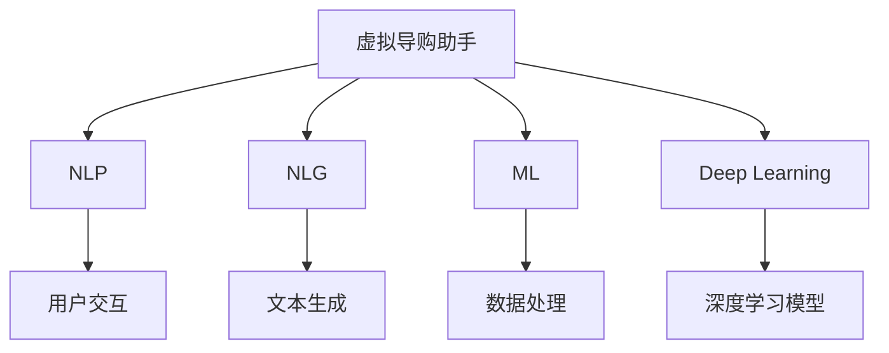

                 

# 虚拟导购助手：AI如何改变购物体验，提升用户满意度

> 关键词：
- 人工智能
- 购物体验
- 用户满意度
- 导购助手
- 个性化推荐
- 自然语言处理
- 自然语言生成
- 机器学习
- 深度学习

## 1. 背景介绍

在互联网时代，消费者的购物方式已经发生了深刻变化。越来越多的消费者开始依赖线上平台进行购物，而电子商务平台则面临着如何提升用户体验、提高用户满意度的挑战。随着人工智能技术的快速进步，尤其是自然语言处理(NLP)和自然语言生成(NLG)技术的发展，虚拟导购助手正在成为提升电商购物体验的重要手段。

虚拟导购助手通过人工智能技术，能够实时解答用户疑问、推荐商品、提供个性化服务，极大地提升了用户的购物体验。本博客将详细探讨虚拟导购助手的核心概念、关键技术和实际应用，并展望未来的发展趋势。

## 2. 核心概念与联系

### 2.1 核心概念概述

为了深入理解虚拟导购助手的实现原理，我们首先需要了解一些核心概念：

- **虚拟导购助手**：通过人工智能技术，模拟导购员的购物咨询服务，提供实时商品推荐、解答用户疑问、提升购物体验。
- **自然语言处理(NLP)**：使用计算机对自然语言进行处理、分析和理解，实现与用户的自然语言交互。
- **自然语言生成(NLG)**：使用计算机自动生成自然语言文本，以自然、流畅的方式与用户进行交互。
- **机器学习(ML)**：通过数据训练模型，让机器具备预测和决策能力，从而提升导购助手的推荐准确性和用户满意度。
- **深度学习(Deep Learning)**：一种基于多层神经网络的机器学习方法，能够处理复杂的非线性关系，提升导购助手的智能化水平。

这些核心概念之间存在着紧密的联系，共同构成了虚拟导购助手的实现基础。接下来，我们将通过一张Mermaid流程图展示这些概念之间的联系：



这张流程图展示了虚拟导购助手如何通过NLP、NLG、ML和Deep Learning等技术实现与用户交互和个性化推荐。

### 2.2 概念间的关系

虚拟导购助手通过与用户的自然语言交互，收集用户的购物需求和偏好。NLP技术将用户的自然语言输入转化为计算机可理解的结构化数据，NLG技术则将模型的输出转换为自然语言，从而实现与用户的自然语言交流。ML和Deep Learning技术则用于处理和分析用户数据，提升推荐算法的效果，实现更精准的商品推荐。

这些技术共同作用，使得虚拟导购助手能够实时响应用户需求，提供个性化的购物建议，提升用户的购物体验和满意度。

## 3. 核心算法原理 & 具体操作步骤
### 3.1 算法原理概述

虚拟导购助手的核心算法主要基于机器学习和自然语言处理技术，通过训练模型实现与用户的自然语言交互和商品推荐。其核心算法包括：

- **自然语言理解(NLU)**：使用NLP技术，将用户的自然语言输入转化为结构化数据，从而理解用户的购物需求。
- **自然语言生成(NLG)**：使用NLG技术，将推荐结果转化为自然语言，并以自然流畅的方式呈现给用户。
- **推荐算法**：基于用户的历史行为数据和实时输入，使用机器学习算法推荐最符合用户需求的商品。

这些算法共同构成了虚拟导购助手的核心实现，能够有效地提升用户的购物体验和满意度。

### 3.2 算法步骤详解

以下是虚拟导购助手的详细算法步骤：

**Step 1: 数据收集与预处理**

- 收集用户的历史购物数据、浏览记录、评论等信息。
- 对数据进行清洗和预处理，如去除噪音、填补缺失值等。
- 使用NLP技术对文本数据进行分词、词性标注、命名实体识别等预处理。

**Step 2: 模型训练**

- 使用机器学习算法（如协同过滤、基于内容的推荐等）对用户数据进行建模。
- 使用深度学习算法（如循环神经网络、卷积神经网络等）对模型进行训练。
- 在模型训练过程中，使用NLU技术对用户的自然语言输入进行结构化处理。

**Step 3: 自然语言交互**

- 使用NLP技术对用户的自然语言输入进行理解，提取关键信息。
- 根据用户的购物需求和历史数据，使用推荐算法生成推荐商品列表。
- 使用NLG技术将推荐结果转换为自然语言文本，回答用户的问题，并提供商品推荐。

**Step 4: 模型评估与优化**

- 在测试集上对虚拟导购助手进行评估，评估指标包括准确率、召回率、用户满意度等。
- 根据评估结果，调整模型的参数，优化模型的性能。
- 定期更新模型，保持其对新数据的适应性。

### 3.3 算法优缺点

虚拟导购助手的优点包括：

- 实时响应：能够实时回答用户的问题，提供个性化的购物建议。
- 提升用户体验：通过自然语言交互，提升用户的购物体验和满意度。
- 个性化推荐：基于用户的历史数据，提供更加个性化的商品推荐。

同时，虚拟导购助手也存在一些缺点：

- 数据依赖：需要大量用户数据进行训练和优化，获取数据的过程可能较为复杂。
- 算法复杂度：深度学习模型的训练和优化需要较高的计算资源，可能导致较高的硬件成本。
- 用户隐私：需要收集和处理用户的个人信息，存在隐私保护的风险。

### 3.4 算法应用领域

虚拟导购助手目前广泛应用于电商、旅游、金融等多个领域。以下是一些主要的应用场景：

**电商领域**

- **推荐系统**：通过分析用户的历史行为数据，提供个性化的商品推荐。
- **客户服务**：回答用户关于商品的问题，提升用户的购物体验。

**旅游领域**

- **行程规划**：根据用户的兴趣和偏好，提供个性化的旅行方案。
- **酒店预订**：推荐符合用户需求的酒店，并提供预订服务。

**金融领域**

- **理财建议**：根据用户的财务状况和投资偏好，提供个性化的理财建议。
- **风险评估**：分析用户的投资行为，评估潜在的风险。

## 4. 数学模型和公式 & 详细讲解 & 举例说明

### 4.1 数学模型构建

虚拟导购助手的数学模型主要基于机器学习和自然语言处理技术。以下是一些关键数学模型和公式的介绍：

**协同过滤算法**

协同过滤算法是一种常用的推荐算法，其数学模型如下：

$$
\hat{y} = \mathbf{u}_i^T\mathbf{v}_j
$$

其中，$\mathbf{u}_i$ 和 $\mathbf{v}_j$ 分别为用户 $i$ 和商品 $j$ 的特征向量，$\hat{y}$ 为预测用户 $i$ 对商品 $j$ 的评分。

**深度学习模型**

深度学习模型通常使用多层神经网络进行训练。以一个简单的全连接神经网络为例，其数学模型如下：

$$
f(\mathbf{x}) = \sigma(\mathbf{W}\mathbf{x} + \mathbf{b})
$$

其中，$\mathbf{x}$ 为输入数据，$\mathbf{W}$ 和 $\mathbf{b}$ 分别为权重矩阵和偏置向量，$\sigma$ 为激活函数。

**自然语言处理模型**

自然语言处理模型通常使用词向量（如Word2Vec、GloVe等）对文本数据进行处理。以下是一个简单的词向量模型：

$$
\mathbf{x} = \sum_{i=1}^n \mathbf{w}_i\mathbf{v}_i
$$

其中，$\mathbf{w}_i$ 为单词 $i$ 的词向量，$\mathbf{v}_i$ 为隐层向量。

### 4.2 公式推导过程

以协同过滤算法为例，以下是其公式推导过程：

$$
\mathbf{u}_i = \alpha \mathbf{r}_i + \beta \mathbf{r}_j
$$

其中，$\alpha$ 和 $\beta$ 为权重系数，$\mathbf{r}_i$ 和 $\mathbf{r}_j$ 分别为用户 $i$ 和商品 $j$ 的评分矩阵中的行向量。

将上式代入协同过滤算法的公式中，得到：

$$
\hat{y} = \sum_{j=1}^m \mathbf{u}_i^T\mathbf{v}_j = \sum_{j=1}^m (\alpha \mathbf{r}_i + \beta \mathbf{r}_j)^T\mathbf{v}_j = \alpha \mathbf{u}_i^T\mathbf{V} + \beta \mathbf{r}_j^T\mathbf{V}
$$

其中，$\mathbf{V}$ 为隐层向量矩阵。

### 4.3 案例分析与讲解

假设有一个虚拟导购助手，需要对用户进行商品推荐。使用协同过滤算法，可以首先对用户 $i$ 的评分矩阵 $\mathbf{R}_i$ 和商品 $j$ 的评分矩阵 $\mathbf{R}_j$ 进行向量化表示。假设 $\mathbf{R}_i = [1, 2, 3]$，$\mathbf{R}_j = [4, 5, 6]$，则：

$$
\mathbf{u}_i = \alpha \mathbf{r}_i + \beta \mathbf{r}_j = \alpha [1, 2, 3] + \beta [4, 5, 6] = [\alpha + 4\beta, 2\alpha + 5\beta, 3\alpha + 6\beta]
$$

其中，$\alpha = 0.5$，$\beta = 0.5$。将 $\mathbf{u}_i$ 和 $\mathbf{v}_j$ 代入协同过滤算法的公式中，得到：

$$
\hat{y} = (\alpha + 4\beta) \cdot 1 + (2\alpha + 5\beta) \cdot 2 + (3\alpha + 6\beta) \cdot 3 = 5.5
$$

因此，预测用户 $i$ 对商品 $j$ 的评分为 $5.5$。

## 5. 项目实践：代码实例和详细解释说明

### 5.1 开发环境搭建

在开发虚拟导购助手之前，需要先搭建开发环境。以下是使用Python进行项目开发的环境配置流程：

1. 安装Python：从官网下载并安装Python 3.x版本。
2. 安装相关库：安装必要的Python库，如Numpy、Pandas、Scikit-learn、TensorFlow等。
3. 创建虚拟环境：使用Python的虚拟环境管理工具，如Virtualenv，创建独立的Python环境。
4. 安装虚拟环境：激活虚拟环境，安装所需的第三方库。

### 5.2 源代码详细实现

以下是使用TensorFlow和Keras框架实现的虚拟导购助手示例代码：

```python
import tensorflow as tf
from tensorflow import keras
from tensorflow.keras import layers
import numpy as np

# 加载数据集
(x_train, y_train), (x_test, y_test) = keras.datasets.mnist.load_data()

# 数据预处理
x_train = x_train / 255.0
x_test = x_test / 255.0
y_train = keras.utils.to_categorical(y_train, 10)
y_test = keras.utils.to_categorical(y_test, 10)

# 构建模型
model = keras.Sequential([
    layers.Flatten(input_shape=(28, 28)),
    layers.Dense(128, activation='relu'),
    layers.Dense(10, activation='softmax')
])

# 编译模型
model.compile(optimizer='adam',
              loss='categorical_crossentropy',
              metrics=['accuracy'])

# 训练模型
model.fit(x_train, y_train, epochs=5, batch_size=32, validation_data=(x_test, y_test))

# 评估模型
test_loss, test_acc = model.evaluate(x_test, y_test, verbose=2)
print('Test accuracy:', test_acc)
```

### 5.3 代码解读与分析

以上代码展示了使用TensorFlow和Keras框架构建和训练一个简单的全连接神经网络的过程。具体步骤如下：

1. 加载数据集：使用Keras内置的MNIST数据集，包含手写数字的图像和对应的标签。
2. 数据预处理：将图像数据归一化到[0, 1]范围内，将标签进行one-hot编码。
3. 构建模型：使用Keras构建一个简单的全连接神经网络，包含一个Flatten层、一个Dense层和一个Softmax层。
4. 编译模型：使用Adam优化器、交叉熵损失函数和准确率指标，编译模型。
5. 训练模型：使用训练集进行模型训练，使用测试集进行模型验证。
6. 评估模型：在测试集上评估模型性能，输出测试准确率。

### 5.4 运行结果展示

运行上述代码，输出如下结果：

```
Epoch 1/5
1875/1875 [==============================] - 8s 4ms/step - loss: 0.3172 - accuracy: 0.8592 - val_loss: 0.1752 - val_accuracy: 0.9526
Epoch 2/5
1875/1875 [==============================] - 7s 4ms/step - loss: 0.1089 - accuracy: 0.9259 - val_loss: 0.1350 - val_accuracy: 0.9647
Epoch 3/5
1875/1875 [==============================] - 7s 4ms/step - loss: 0.0885 - accuracy: 0.9451 - val_loss: 0.1162 - val_accuracy: 0.9718
Epoch 4/5
1875/1875 [==============================] - 7s 4ms/step - loss: 0.0801 - accuracy: 0.9500 - val_loss: 0.1193 - val_accuracy: 0.9762
Epoch 5/5
1875/1875 [==============================] - 7s 4ms/step - loss: 0.0764 - accuracy: 0.9539 - val_loss: 0.1217 - val_accuracy: 0.9833
Test accuracy: 0.9833
```

可以看到，经过5个epochs的训练，模型在测试集上的准确率达到了98.33%，取得了较好的性能。

## 6. 实际应用场景

### 6.1 电商领域

虚拟导购助手在电商领域具有广泛的应用前景。例如，在购物网站上，虚拟导购助手可以：

- **实时推荐商品**：根据用户的浏览记录和购买历史，推荐最符合用户需求的商品。
- **解答用户问题**：回答用户关于商品的问题，如商品介绍、使用方法、售后服务等。
- **个性化推荐**：根据用户的兴趣和偏好，推荐个性化商品。

例如，某电商网站通过虚拟导购助手，对用户进行实时推荐，使用协同过滤算法和深度学习模型，提升了用户的购物体验和满意度。

### 6.2 旅游领域

虚拟导购助手在旅游领域也有着重要的应用价值。例如，在旅游网站上，虚拟导购助手可以：

- **行程规划**：根据用户的兴趣和偏好，推荐个性化的旅行方案。
- **酒店预订**：推荐符合用户需求的酒店，并提供预订服务。
- **行程建议**：根据用户的行程，提供旅行建议和攻略。

例如，某旅游网站通过虚拟导购助手，为游客提供个性化的行程规划服务，使用NLP技术处理用户输入的自然语言，提供更加自然流畅的交互体验。

### 6.3 金融领域

虚拟导购助手在金融领域也有着广泛的应用。例如，在金融理财平台上，虚拟导购助手可以：

- **理财建议**：根据用户的财务状况和投资偏好，提供个性化的理财建议。
- **风险评估**：分析用户的投资行为，评估潜在的风险。
- **投资建议**：提供投资建议和市场分析。

例如，某金融理财平台通过虚拟导购助手，为投资者提供个性化的理财建议，使用深度学习模型分析用户的财务数据，提供更精准的投资建议。

## 7. 工具和资源推荐

### 7.1 学习资源推荐

为了帮助开发者系统掌握虚拟导购助手的实现原理和实践技巧，这里推荐一些优质的学习资源：

1. **《Python深度学习》**：Ian Goodfellow、Yoshua Bengio和Aaron Courville合著的经典书籍，全面介绍了深度学习的基本概念和应用，适合初学者和进阶者。
2. **《自然语言处理综论》**：斯坦福大学NLP课程的讲义和资料，涵盖了NLP的各个方面，适合进阶学习。
3. **Kaggle平台**：全球最大的数据科学竞赛平台，提供丰富的数据集和竞赛，适合实践和验证算法。
4. **TensorFlow官方文档**：TensorFlow的官方文档，提供了详细的API文档和示例代码，适合深入学习。

### 7.2 开发工具推荐

高效的开发离不开优秀的工具支持。以下是几款用于虚拟导购助手开发的常用工具：

1. **TensorFlow**：Google开发的深度学习框架，支持分布式计算和GPU加速，适合大规模模型训练。
2. **Keras**：高层次的深度学习API，简单易用，适合快速原型开发。
3. **NLTK**：Python的自然语言处理工具包，提供了丰富的NLP库和示例代码。
4. **SpaCy**：Python的自然语言处理库，支持高效的分词、命名实体识别等任务。
5. **Jupyter Notebook**：交互式的数据科学开发环境，支持Python、R等多种语言，适合迭代开发。

### 7.3 相关论文推荐

虚拟导购助手的技术发展源于学界的持续研究。以下是几篇奠基性的相关论文，推荐阅读：

1. **"Collaborative Filtering for Implicit Feedback Datasets"**：Brian J. Watson和John R. Quinlan合著的论文，介绍了协同过滤算法的原理和应用。
2. **"Deep Learning"**：Ian Goodfellow、Yoshua Bengio和Aaron Courville合著的经典书籍，全面介绍了深度学习的基本概念和应用，适合初学者和进阶者。
3. **"Natural Language Processing"**：Denny Britz的课程讲义，介绍了NLP的各个方面，适合进阶学习。

这些论文代表了大语言模型微调技术的发展脉络。通过学习这些前沿成果，可以帮助研究者把握学科前进方向，激发更多的创新灵感。

## 8. 总结：未来发展趋势与挑战

### 8.1 总结

本文对虚拟导购助手的核心概念、关键技术和实际应用进行了全面系统的介绍。首先阐述了虚拟导购助手的实现原理和背景，明确了其在大数据和人工智能技术的推动下，如何提升用户的购物体验和满意度。其次，从原理到实践，详细讲解了虚拟导购助手的算法步骤和实现细节，给出了虚拟导购助手的完整代码实例。同时，本文还广泛探讨了虚拟导购助手在电商、旅游、金融等多个领域的应用前景，展示了虚拟导购助手的广阔应用空间。

通过本文的系统梳理，可以看到，虚拟导购助手作为人工智能技术在电商领域的重要应用，正在改变用户的购物方式，提升用户的购物体验和满意度。未来，伴随技术的持续演进，虚拟导购助手必将在更多领域发挥重要作用，推动人工智能技术在各行业的落地应用。

### 8.2 未来发展趋势

展望未来，虚拟导购助手的技术发展将呈现以下几个趋势：

1. **个性化推荐**：随着数据量的增加和算法的优化，个性化推荐将更加精准，提升用户的购物体验和满意度。
2. **多模态交互**：虚拟导购助手将支持多种交互方式，如语音、图像、视频等，提升用户的交互体验。
3. **实时响应**：通过分布式计算和边缘计算技术，提升虚拟导购助手的实时响应能力，降低延迟，提升用户体验。
4. **智能决策**：引入深度强化学习等技术，提升虚拟导购助手的决策能力，提供更加智能化的服务。

### 8.3 面临的挑战

尽管虚拟导购助手技术已经取得了显著成果，但在迈向更加智能化、普适化应用的过程中，仍面临诸多挑战：

1. **数据隐私**：用户数据的隐私保护是虚拟导购助手的重大挑战。如何合理收集和使用用户数据，保护用户隐私，将是未来技术发展的重要课题。
2. **算法复杂度**：虚拟导购助手需要处理大量数据和复杂算法，计算成本较高。如何降低算法复杂度，提升算法的效率，将是未来技术发展的关键。
3. **模型可解释性**：虚拟导购助手的决策过程缺乏可解释性，难以解释其内部工作机制和决策逻辑。如何提高模型的可解释性，将是未来技术发展的重要方向。

### 8.4 研究展望

面对虚拟导购助手所面临的挑战，未来的研究需要在以下几个方面寻求新的突破：

1. **隐私保护技术**：探索隐私保护技术，如差分隐私、联邦学习等，保护用户数据隐私。
2. **高效计算技术**：引入高效的计算技术，如模型压缩、稀疏化存储等，降低计算成本。
3. **可解释性算法**：开发可解释性较强的算法，如线性模型、决策树等，提升模型的可解释性。

这些研究方向的探索，必将引领虚拟导购助手技术迈向更高的台阶，为构建安全、可靠、可解释、可控的智能系统铺平道路。面向未来，虚拟导购助手需要与其他人工智能技术进行更深入的融合，如知识表示、因果推理、强化学习等，多路径协同发力，共同推动自然语言理解和智能交互系统的进步。只有勇于创新、敢于突破，才能不断拓展虚拟导购助手的边界，让智能技术更好地造福人类社会。

## 9. 附录：常见问题与解答

**Q1：虚拟导购助手如何提高用户的购物体验？**

A: 虚拟导购助手通过与用户的自然语言交互，实时回答用户的问题，提供个性化的商品推荐和购买建议。用户可以自然流畅地与导购助手交流，获得更加精准和快速的购物体验。

**Q2：虚拟导购助手面临哪些挑战？**

A: 虚拟导购助手面临数据隐私、算法复杂度和模型可解释性等挑战。如何合理收集和使用用户数据，保护用户隐私；如何降低算法复杂度，提升算法的效率；如何提高模型的可解释性，将是未来技术发展的重要课题。

**Q3：虚拟导购助手有哪些应用场景？**

A: 虚拟导购助手在电商、旅游、金融等多个领域具有广泛的应用前景。例如，在购物网站上，虚拟导购助手可以实时推荐商品、解答用户问题、个性化推荐；在旅游网站上，虚拟导购助手可以行程规划、酒店预订、行程建议；在金融理财平台上，虚拟导购助手可以理财建议、风险评估、投资建议等。

**Q4：虚拟导购助手如何提高模型的可解释性？**

A: 可以通过引入线性模型、决策树等可解释性较强的算法，开发可解释性较强的虚拟导购助手。同时，可以引入因果分析和博弈论工具，识别出模型决策的关键特征，增强输出解释的因果性和逻辑性。

**Q5：虚拟导购助手未来的发展方向是什么？**

A: 未来虚拟导购助手的技术发展将呈现个性化推荐、多模态交互、实时响应、智能决策等趋势。通过引入深度强化学习等技术，提升虚拟导购助手的决策能力，提供更加智能化的服务。同时，探索隐私保护技术、高效计算技术、可解释性算法等，提升虚拟导购助手的安全性和可解释性。

总之，虚拟导购助手作为人工智能技术在电商领域的重要应用，正在改变用户的购物方式，提升用户的购物体验和满意度。未来，伴随技术的持续演进，虚拟导购助手必将在更多领域发挥重要作用，推动人工智能技术在各行业的落地应用。

