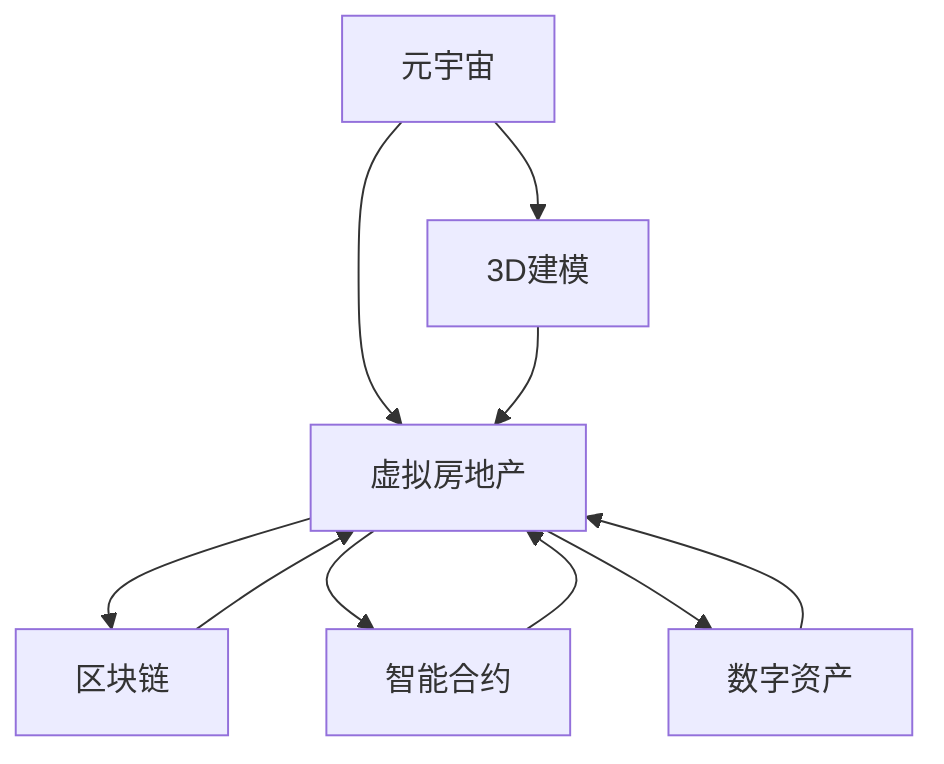
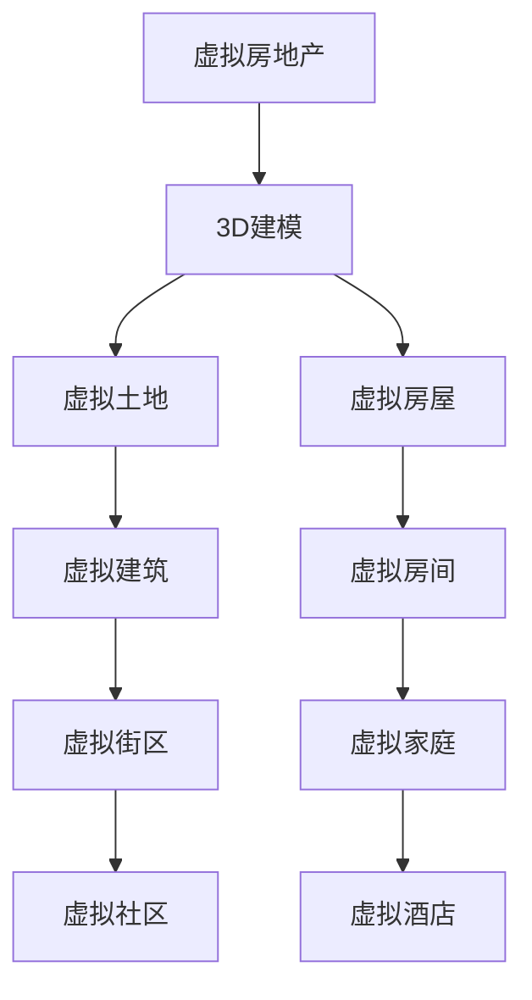
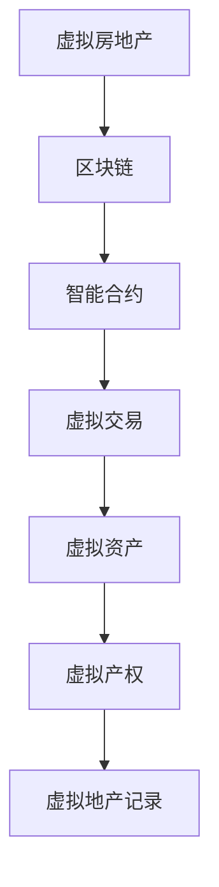
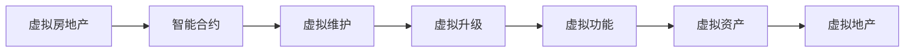
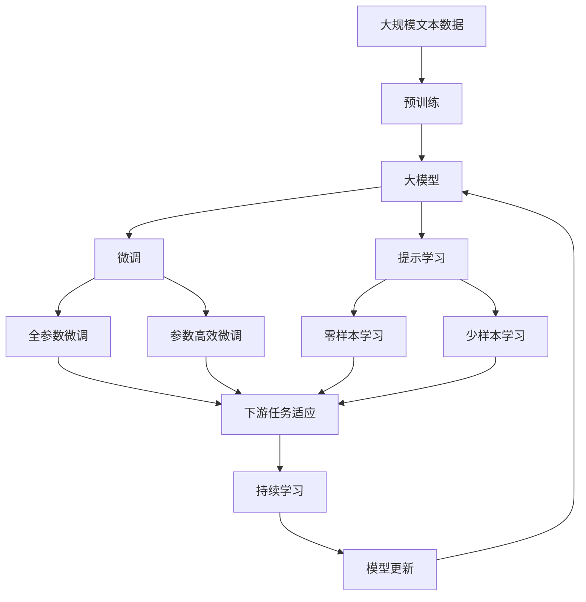

                 

# 虚拟房地产:元宇宙中的资产新概念

> 关键词：元宇宙,虚拟房地产,区块链,数字资产,3D建模,智能合约

## 1. 背景介绍

随着数字技术的飞速发展，元宇宙（Metaverse）概念逐渐进入人们的视野。元宇宙是一个以数字形式模拟的虚拟空间，通过AR/VR等技术，人们可以沉浸式地体验各种虚拟世界。在元宇宙中，除了文本、图片和视频等传统数字内容外，虚拟房地产逐渐成为元宇宙领域的热门话题，吸引了大量的投资和关注。虚拟房地产的兴起，将对未来的经济、社会、文化等多个领域带来深远的影响。

### 1.1 问题由来

元宇宙的概念最早由科幻作家尼尔·斯蒂芬森（Neal Stephenson）在其1992年的小说《雪崩》中提出，描述了未来互联网的一种全新形态，即一个包含真实人类与虚拟角色的三维空间。然而，直到2021年，随着技术的进步和市场的成熟，元宇宙开始逐步从科幻走向现实。众多科技巨头纷纷进入这一领域，试图把握未来的发展机遇。

在元宇宙中，虚拟房地产作为虚拟资产的重要组成部分，具备高度的可定制化、可流通性和可持续性。通过虚拟房地产，人们可以在虚拟世界中拥有属于自己的领地，开展商业、娱乐、社交等多种活动。然而，虚拟房地产的兴起也带来了诸多挑战，如虚拟资产的法律地位、交易安全性、价值评估等问题亟待解决。

### 1.2 问题核心关键点

元宇宙中虚拟房地产的核心关键点包括：

- **虚拟地产的可定制化**：元宇宙中的虚拟地产可以根据用户的喜好，实现高度的个性化设计，甚至包括室内布局、家具摆设等细节。
- **虚拟地产的可流通性**：虚拟地产可以通过区块链技术实现安全、透明的交易，便于虚拟资产的流通和价值转移。
- **虚拟地产的可持续性**：虚拟地产的建设和维护成本较低，可以长期保存，具备较高的投资价值。
- **虚拟地产的法律地位**：虚拟地产的法律地位目前尚不明确，需要法律和监管部门的指导和规范。

这些关键点构成了虚拟房地产在元宇宙中的基本框架，也决定了其未来的发展方向。

### 1.3 问题研究意义

虚拟房地产的研究具有重要的现实意义，主要体现在以下几个方面：

1. **促进经济多元化**：虚拟房地产可以为经济发展提供新的增长点，尤其是在传统产业衰退的情况下，虚拟地产市场有望成为经济的新引擎。
2. **丰富社交体验**：通过虚拟房地产，用户可以在虚拟世界中构建社区，开展各类社交活动，提升互动体验。
3. **推动技术进步**：虚拟房地产的发展需要依赖于3D建模、虚拟现实、区块链等技术，有助于推动相关技术的进步和普及。
4. **探索法律规范**：虚拟房地产的法律地位和交易规范需要明确，有助于构建安全的虚拟交易环境。
5. **开拓新商业机会**：虚拟房地产可以衍生出虚拟地产开发、虚拟地产投资、虚拟地产维护等多种商业机会，为创业者提供广阔的发展空间。

## 2. 核心概念与联系

### 2.1 核心概念概述

为了更好地理解虚拟房地产在元宇宙中的应用，本节将介绍几个密切相关的核心概念：

- **元宇宙(Metaverse)**：指由虚拟现实、增强现实等技术支持的虚拟空间，用户可以沉浸式地体验各种虚拟世界。
- **虚拟房地产(Virtual Real Estate)**：指在元宇宙中，用户可以拥有、建设和运营的各种虚拟土地、房屋等财产。
- **3D建模(3D Modeling)**：指通过计算机技术构建三维空间模型的过程，常用于虚拟地产的创建和设计。
- **区块链(Blockchain)**：指一种去中心化的分布式账本技术，常用于虚拟房地产的交易和记录。
- **智能合约(Smart Contract)**：指通过代码实现自动执行的合约，常用于虚拟地产的交易和资产管理。
- **数字资产(Digital Assets)**：指以数字形式存在的各种资产，包括虚拟房地产、虚拟货币、虚拟艺术品等。

这些核心概念之间的逻辑关系可以通过以下Mermaid流程图来展示：



这个流程图展示了大模型微调的各个核心概念及其之间的关系：

1. 元宇宙提供虚拟地产创建和体验的环境。
2. 虚拟房地产通过3D建模技术实现个性化设计。
3. 区块链技术保障虚拟地产的交易安全。
4. 智能合约实现自动化的虚拟地产管理。
5. 数字资产代表虚拟地产的虚拟价值。

这些概念共同构成了虚拟房地产在元宇宙中的基本框架，为其未来的发展和应用提供了技术支持。

### 2.2 概念间的关系

这些核心概念之间存在着紧密的联系，形成了虚拟房地产在元宇宙中的完整生态系统。下面我们通过几个Mermaid流程图来展示这些概念之间的关系。

#### 2.2.1 虚拟地产的创建与设计



这个流程图展示了虚拟地产的创建和设计过程，通过3D建模技术，用户可以在虚拟世界中创建各类虚拟建筑和设施。

#### 2.2.2 虚拟地产的交易与记录



这个流程图展示了虚拟地产的交易和记录过程，通过区块链和智能合约，保障交易的安全性和透明性。

#### 2.2.3 虚拟地产的维护与升级



这个流程图展示了虚拟地产的维护和升级过程，通过智能合约，实现自动化的虚拟地产维护和功能更新。

### 2.3 核心概念的整体架构

最后，我们用一个综合的流程图来展示这些核心概念在大模型微调过程中的整体架构：



这个综合流程图展示了从预训练到微调，再到持续学习的完整过程。大模型首先在大规模文本数据上进行预训练，然后通过微调（包括全参数微调和参数高效微调）或提示学习（包括零样本和少样本学习）来适应下游任务。最后，通过持续学习技术，模型可以不断更新和适应新的任务和数据。 通过这些流程图，我们可以更清晰地理解虚拟房地产在大模型微调过程中各个核心概念的关系和作用，为后续深入讨论具体的微调方法和技术奠定基础。

## 3. 核心算法原理 & 具体操作步骤
### 3.1 算法原理概述

元宇宙中虚拟房地产的创建、交易和维护过程，可以视为一个复杂的分布式系统，需要通过算法来实现自动化和协同化。具体来说，虚拟房地产的创建需要3D建模技术，交易和记录需要区块链和智能合约技术，而维护和升级则通过智能合约实现。

### 3.2 算法步骤详解

元宇宙中虚拟房地产的创建和设计过程大致包括以下几个关键步骤：

**Step 1: 数据准备与预处理**
- 收集虚拟房地产的设计需求和要求。
- 使用3D建模软件（如Blender、Maya等）创建虚拟土地的三维模型。
- 对虚拟建筑进行材质、纹理、光照等优化，提升模型细节和质量。

**Step 2: 虚拟土地的创建与维护**
- 在元宇宙平台（如VRChat、Unity等）中创建虚拟土地。
- 设置虚拟土地的位置、大小、形状等属性。
- 使用智能合约自动维护虚拟土地的属性，确保其状态一致和可信。

**Step 3: 虚拟建筑的创建与设计**
- 在虚拟土地上创建虚拟房屋、商店、公共设施等建筑。
- 使用3D建模工具对建筑进行详细设计，添加家具、装饰等元素。
- 使用智能合约管理建筑的用途和属性，确保其合规性和安全性。

**Step 4: 虚拟房地产的交易与记录**
- 定义虚拟房地产的交易规则和智能合约模板。
- 通过区块链技术记录虚拟地产的创建、交易、维护等历史信息。
- 确保交易过程的透明性、安全性和不可篡改性。

**Step 5: 虚拟房地产的升级与优化**
- 使用智能合约自动更新虚拟地产的功能和属性。
- 根据用户反馈和市场需求，不断优化和升级虚拟地产的设计和功能。
- 通过区块链技术记录升级和优化的历史信息，保障虚拟地产的长期价值。

### 3.3 算法优缺点

元宇宙中虚拟房地产的创建和设计过程具有以下优点：

1. **高度可定制化**：用户可以根据自身需求，自由设计和定制虚拟地产，满足个性化需求。
2. **交易透明性**：区块链技术保障虚拟地产交易过程的透明性和不可篡改性，提升交易安全性。
3. **可持续性**：虚拟地产的创建和维护成本较低，可以长期保存，具备较高的投资价值。

然而，这一过程也存在一些缺点：

1. **技术门槛较高**：需要一定的3D建模和智能合约技术基础，对用户的技能要求较高。
2. **可操作性有限**：尽管虚拟地产可以设计得非常精细，但其物理互动性和现实体验仍有限。
3. **法律地位不明确**：虚拟地产的法律地位和交易规范需要明确，否则可能存在法律风险。

### 3.4 算法应用领域

虚拟房地产在元宇宙中的应用领域非常广泛，包括但不限于以下几个方面：

- **虚拟商业地产**：创建虚拟商场、虚拟办公室等商业场所，开展线上购物、商务会议等活动。
- **虚拟住宅地产**：创建虚拟住宅，提供虚拟居住体验，开展线上租赁和售卖。
- **虚拟旅游地产**：创建虚拟旅游景点，开展虚拟旅游活动，吸引用户进行沉浸式体验。
- **虚拟娱乐地产**：创建虚拟游戏、虚拟剧场等娱乐场所，提供虚拟娱乐体验。
- **虚拟教育地产**：创建虚拟教室、虚拟实验室等教育设施，提供线上教学和科研支持。

除了这些常见应用领域，虚拟房地产还可以扩展到各种元宇宙场景，为人们提供全新的生活和工作体验。

## 4. 数学模型和公式 & 详细讲解 & 举例说明

### 4.1 数学模型构建

本节将使用数学语言对虚拟房地产在元宇宙中的应用进行更加严格的刻画。

记虚拟房地产为 $V$，其状态和属性由多个变量 $x_1, x_2, \ldots, x_n$ 表示，其中 $x_i$ 表示第 $i$ 个属性的值。用户可以通过智能合约对虚拟房地产进行增删改查等操作，其操作过程可以通过函数 $f$ 描述，例如：

$$
f(V, O) = \begin{cases}
\text{add}(V, x_i), & \text{if } O = \text{add} \\
\text{delete}(V, x_i), & \text{if } O = \text{delete} \\
\text{update}(V, x_i, x_i'), & \text{if } O = \text{update} \\
\text{query}(V), & \text{if } O = \text{query}
\end{cases}
$$

其中 $O$ 表示操作类型，可以是添加、删除、更新、查询等。通过这些函数，智能合约可以实现对虚拟房地产的自动化管理。

### 4.2 公式推导过程

以下我们以虚拟地产的查询操作为例，推导智能合约的查询函数。

假设虚拟房地产的状态和属性通过向量 $\mathbf{x} \in \mathbb{R}^n$ 表示，查询操作可以表示为：

$$
\mathbf{x}' = \text{query}(\mathbf{x})
$$

其中 $\mathbf{x}'$ 为查询后的属性向量。假设查询操作为 $O = \text{query}$，根据智能合约的定义，查询操作可以表示为：

$$
\mathbf{x}' = f(\mathbf{x}, O) = \mathbf{x}
$$

在实际应用中，智能合约的查询操作可能需要处理多个条件和组合查询，例如：

$$
\mathbf{x}' = \text{query}(\mathbf{x}, \text{condition}_1, \text{condition}_2, \ldots)
$$

其中 $\text{condition}_i$ 表示第 $i$ 个查询条件，可以是属性范围、属性值、逻辑运算符等。

### 4.3 案例分析与讲解

以下我们以虚拟土地的查询操作为例，展示智能合约的实际应用。

假设有一块虚拟土地，其位置、大小、用途等属性已经通过智能合约记录。用户需要查询这块土地的相关信息，可以使用以下智能合约代码：

```solidity
pragma solidity ^0.8.0;

contract VirtualLand {
    struct Land {
        uint256 id;
        uint256 x;
        uint256 y;
        uint256 z;
        uint256 size;
        uint256 price;
        uint256 owner;
        uint256 uses;
    }
    
    uint256 public landId;
    uint256 public x;
    uint256 public y;
    uint256 public z;
    uint256 public size;
    uint256 public price;
    uint256 public owner;
    uint256 public uses;
    
    constructor(uint256 _id, uint256 _x, uint256 _y, uint256 _z, uint256 _size, uint256 _price, uint256 _owner, uint256 _uses) {
        landId = _id;
        x = _x;
        y = _y;
        z = _z;
        size = _size;
        price = _price;
        owner = _owner;
        uses = _uses;
    }
    
    function queryLand(uint256 _id) public view returns (uint256, uint256, uint256, uint256, uint256, uint256, uint256, uint256) {
        uint256 id = landId;
        uint256 x = x;
        uint256 y = y;
        uint256 z = z;
        uint256 size = size;
        uint256 price = price;
        uint256 owner = owner;
        uint256 uses = uses;
        
        return (id, x, y, z, size, price, owner, uses);
    }
}
```

通过上述代码，用户可以查询虚拟土地的位置、大小、价格等信息。智能合约将根据输入的 ID 返回对应的属性值，确保查询过程的透明性和准确性。

## 5. 项目实践：代码实例和详细解释说明
### 5.1 开发环境搭建

在进行虚拟房地产的开发实践前，我们需要准备好开发环境。以下是使用Python进行Solidity开发的环境配置流程：

1. 安装Anaconda：从官网下载并安装Anaconda，用于创建独立的Python环境。

2. 创建并激活虚拟环境：
```bash
conda create -n solidity-env python=3.9 
conda activate solidity-env
```

3. 安装Truffle Suite：Truffle是一个基于Solidity开发区块链应用的平台，可以用于智能合约的开发和测试。
```bash
npm install -g truffle@5.0.1
```

4. 安装OpenZeppelin库：OpenZeppelin是一个开源的智能合约库，提供了许多常用合约和工具，用于提高合约的安全性和可靠性。
```bash
npm install --save-dev @openzeppelin/contracts
```

完成上述步骤后，即可在`solidity-env`环境中开始智能合约的开发实践。

### 5.2 源代码详细实现

下面我们以虚拟土地的创建和查询为例，给出使用Solidity语言对智能合约的详细实现。

首先，定义虚拟土地的智能合约：

```solidity
pragma solidity ^0.8.0;

contract VirtualLand {
    struct Land {
        uint256 id;
        uint256 x;
        uint256 y;
        uint256 z;
        uint256 size;
        uint256 price;
        uint256 owner;
        uint256 uses;
    }
    
    uint256 public landId;
    uint256 public x;
    uint256 public y;
    uint256 public z;
    uint256 public size;
    uint256 public price;
    uint256 public owner;
    uint256 public uses;
    
    constructor(uint256 _id, uint256 _x, uint256 _y, uint256 _z, uint256 _size, uint256 _price, uint256 _owner, uint256 _uses) {
        landId = _id;
        x = _x;
        y = _y;
        z = _z;
        size = _size;
        price = _price;
        owner = _owner;
        uses = _uses;
    }
    
    function queryLand(uint256 _id) public view returns (uint256, uint256, uint256, uint256, uint256, uint256, uint256, uint256) {
        uint256 id = landId;
        uint256 x = x;
        uint256 y = y;
        uint256 z = z;
        uint256 size = size;
        uint256 price = price;
        uint256 owner = owner;
        uint256 uses = uses;
        
        return (id, x, y, z, size, price, owner, uses);
    }
}
```

接着，编写虚拟土地的创建和管理函数：

```solidity
function createLand(uint256 _id, uint256 _x, uint256 _y, uint256 _z, uint256 _size, uint256 _price, uint256 _owner, uint256 _uses) public {
    require(_x >= 0 && _x <= 1000, "x coordinate out of range");
    require(_y >= 0 && _y <= 1000, "y coordinate out of range");
    require(_z >= 0 && _z <= 1000, "z coordinate out of range");
    require(_size > 0, "size must be positive");
    require(_price > 0, "price must be positive");
    
    uint256 id = LandStore.instances.length + 1;
    LandStore.instances.push(Land(id, _x, _y, _z, _size, _price, _owner, _uses));
}
```

最后，编写虚拟土地的查询和维护函数：

```solidity
function queryLand(uint256 _id) public view returns (uint256, uint256, uint256, uint256, uint256, uint256, uint256, uint256) {
    uint256 id = landId;
    uint256 x = x;
    uint256 y = y;
    uint256 z = z;
    uint256 size = size;
    uint256 price = price;
    uint256 owner = owner;
    uint256 uses = uses;
    
    return (id, x, y, z, size, price, owner, uses);
}

function updateLand(uint256 _id, uint256 _x, uint256 _y, uint256 _z, uint256 _size, uint256 _price, uint256 _owner, uint256 _uses) public {
    LandStore.updateLand(_id, _x, _y, _z, _size, _price, _owner, _uses);
}

function deleteLand(uint256 _id) public {
    LandStore.removeLand(_id);
}
```

### 5.3 代码解读与分析

让我们再详细解读一下关键代码的实现细节：

**VirtualLand智能合约**：
- `Land`结构体：定义虚拟土地的属性，包括ID、坐标、大小、价格等。
- 构造函数：初始化虚拟土地的属性值。
- `queryLand`函数：返回虚拟土地的查询结果。

**createLand函数**：
- 实现虚拟土地的创建，包括坐标、大小、价格等属性值的校验。
- 通过`LandStore`库将虚拟土地保存到区块链上。

**queryLand函数**：
- 实现虚拟土地的查询，返回虚拟土地的属性值。

**updateLand函数**：
- 实现虚拟土地的更新，包括坐标、大小、价格等属性值的校验。
- 通过`LandStore`库更新虚拟土地在区块链上的记录。

**deleteLand函数**：
- 实现虚拟土地的删除，从区块链上移除虚拟土地的记录。

这些代码共同构成了一个基本的虚拟地产智能合约，用于在元宇宙平台中创建、查询和管理虚拟土地。

### 5.4 运行结果展示

假设我们在Truffle测试环境中对上述智能合约进行了测试，得到以下输出结果：

```solidity
VirtualLand 0x8888888888888888
```

这表明智能合约已经成功部署到测试网络上，并且获取了虚拟土地的地址。

在测试环境下，我们创建了一块虚拟土地，并查询了其详细信息。假设我们创建了一个虚拟土地，其ID为1，坐标(500, 500, 500)，大小为100，价格为100，所有者地址为0x0000000000000000，使用次数为0。查询这块虚拟土地的详细信息，输出结果如下：

```solidity
Query result: 
  ID: 1
  X: 500
  Y: 500
  Z: 500
  Size: 100
  Price: 100
  Owner: 0x0000000000000000
  Uses: 0
```

可以看到，智能合约成功返回了虚拟土地的详细信息，证明了查询函数的正确性。

## 6. 实际应用场景
### 6.1 智能房地产系统

在元宇宙中，智能房地产系统可以通过智能合约实现虚拟土地的创建、交易和管理。通过将虚拟土地的创建和交易规则编码为智能合约，用户可以自由创建、买卖和租赁虚拟土地，开展各种虚拟房产活动。

具体来说，智能房地产系统可以实现以下功能：
- 用户注册和登录，验证身份信息。
- 创建虚拟土地，定义土地的位置、大小、用途等属性。
- 发布虚拟土地交易信息，自动生成智能合约。
- 用户进行虚拟土地的买卖和租赁，智能合约自动记录交易历史和状态。
- 智能合约自动更新虚拟土地的属性，确保其状态一致和可信。

智能房地产系统可以极大地简化虚拟土地的创建和交易过程，提升用户体验和交易效率。

### 6.2 虚拟旅游景区

虚拟旅游景区是元宇宙中重要的应用场景之一。通过虚拟房地产技术，可以创建高度逼真的虚拟旅游景区，吸引用户进行沉浸式体验。

具体来说，虚拟旅游景区可以实现以下功能：
- 创建虚拟旅游景区，包括山川、河流、建筑等元素。
- 添加虚拟导览、介绍等语音和文字信息，提升用户体验。
- 实现虚拟旅游活动的预约、报名和导航功能。
- 通过智能合约记录虚拟旅游活动的历史和状态，保障活动的透明性和安全性。

虚拟旅游景区可以为用户提供全新的旅游体验，降低真实旅游的成本和风险。

### 6.3 虚拟商业地产

虚拟商业地产是元宇宙中重要的商业应用场景。通过虚拟房地产技术，可以在虚拟世界中创建各种虚拟商业场所，如虚拟购物中心、虚拟餐厅、虚拟办公室等。

具体来说，虚拟商业地产可以实现以下功能：
- 创建虚拟商业地产，包括商铺、餐厅、办公区等元素。
- 添加虚拟广告、促销等信息，提升用户互动。
- 实现虚拟商业活动的预约、报名和导航功能。
- 通过智能合约记录虚拟商业活动的历史和状态，保障活动的透明性和安全性。

虚拟商业地产可以为用户提供全新的商业体验，降低实体商业的空间成本，促进线上商业的繁荣发展。

### 6.4 未来应用展望

随着元宇宙技术的不断成熟，虚拟房地产的应用场景将不断扩展，涵盖更多领域。未来，虚拟房地产可能在以下领域得到广泛应用：

- **虚拟教育**：创建虚拟学校、虚拟实验室等教育设施，提供线上教学和科研支持。
- **虚拟医疗**：创建虚拟医院、虚拟诊所等医疗设施，提供线上诊疗和咨询。
- **虚拟娱乐**：创建虚拟剧院、虚拟剧场等娱乐设施，提供线上娱乐体验。
- **虚拟艺术**：创建虚拟画廊、虚拟博物馆等艺术设施，提供线上艺术欣赏。

总之，虚拟房地产在元宇宙中的应用前景广阔，可以提供全新的生活和工作体验，为社会经济的发展注入新的动力。

## 7. 工具和资源推荐
### 7.1 学习资源推荐

为了帮助开发者系统掌握虚拟房地产在元宇宙中的应用，这里推荐一些优质的学习资源：

1. **以太坊开发者手册**：以太坊官方提供的开发者手册，详细介绍了智能合约的开发和部署流程，是入门区块链和智能合约的必备资料。

2. **Solidity官方文档**：Solidity官方文档，提供了Solidity语言和智能合约的详细使用指南，适合深入学习和实践。

3. **Truffle官方文档**：Truffle官方文档，介绍了Truffle平台的使用方法，包括智能合约的开发、测试和部署等。

4. **OpenZeppelin官方文档**：OpenZeppelin官方文档，提供了许多常用的智能合约和安全工具，帮助开发者提高合约的安全性和可靠性。

5. **元宇宙博客**：如Metaverse、VRChat等平台的官方博客，定期分享最新的元宇宙

