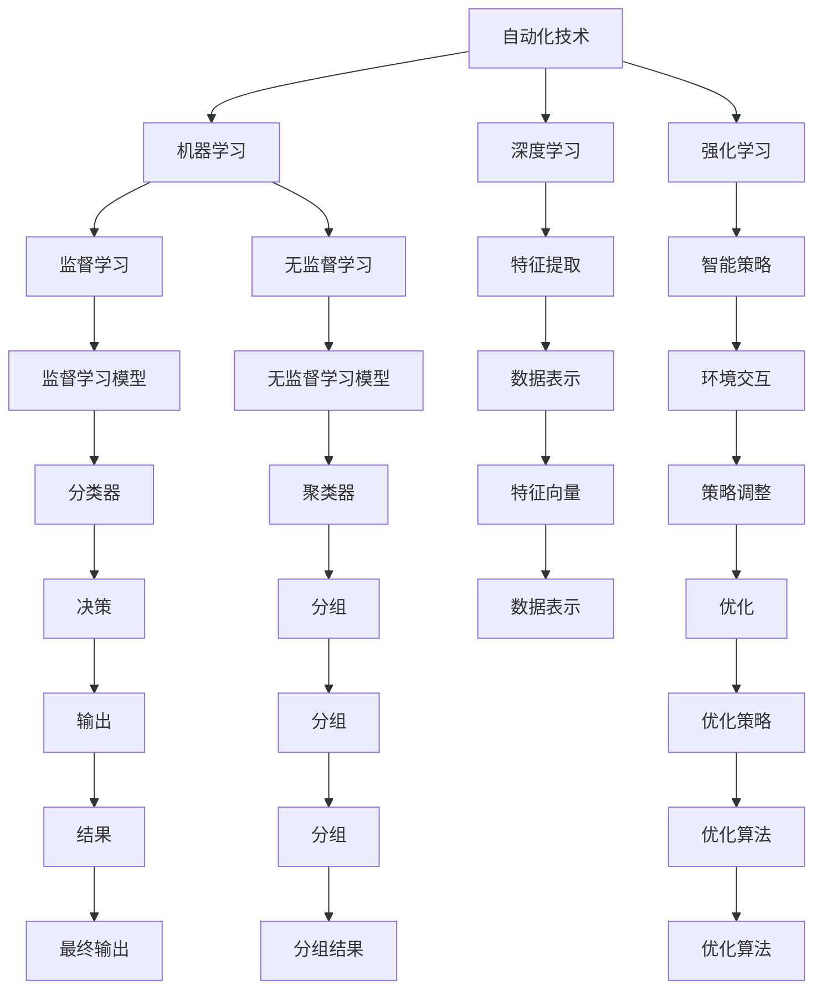
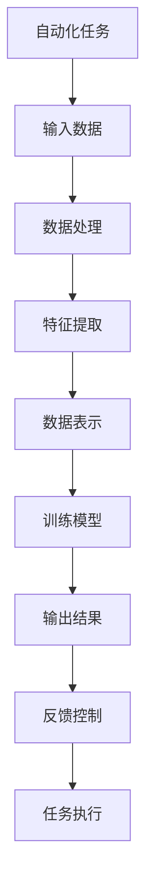
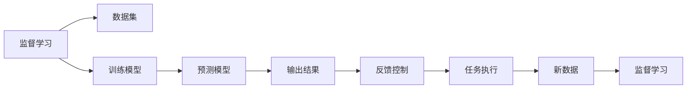
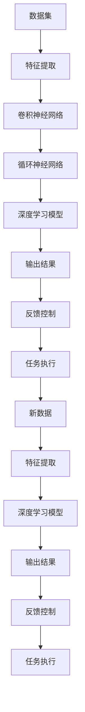

                 

# 计算变化对自动化技术的推动

## 1. 背景介绍

### 1.1 问题由来

随着科技的快速发展和计算能力的不断提升，自动化技术在各行各业得到了广泛应用，极大地提高了生产效率、降低了人力成本、提升了产品质量。然而，计算的变化不仅推动了自动化技术的发展，更带来了新的挑战和机遇。

### 1.2 问题核心关键点

在自动化技术中，计算能力的提升尤为重要。它不仅提高了自动化系统的处理速度和响应时间，还带来了新的算法和方法，如机器学习、深度学习、强化学习等，为自动化技术的应用提供了新的可能性。同时，计算的变化也使得自动化系统更加智能、自适应、自动化程度更高，极大地提升了系统的智能化水平。

## 2. 核心概念与联系

### 2.1 核心概念概述

为更好地理解计算变化对自动化技术的影响，本节将介绍几个密切相关的核心概念：

- 自动化技术：指通过应用计算机软件和硬件，实现生产自动化、管理自动化、决策自动化的技术。其目标是提高效率、降低成本、提升质量。

- 机器学习：指通过计算机程序自动获取数据、学习规律、并进行决策的技术。其核心是训练模型，将输入数据映射到输出结果。

- 深度学习：一种特殊的机器学习，主要通过多层神经网络进行特征提取和分类。其特点是模型复杂、参数量庞大、计算要求高。

- 强化学习：指通过计算机程序在与环境交互中不断试错，调整策略以获得最大奖励的技术。其核心是智能体的策略优化。

- 计算能力：指计算机处理任务的能力，包括算力、内存、存储等资源。计算能力越强，自动化系统的处理速度和精度越高。

这些核心概念之间的逻辑关系可以通过以下Mermaid流程图来展示：



这个流程图展示了一系列与自动化技术相关的核心概念及其关系：

1. 自动化技术通过机器学习、深度学习和强化学习等技术实现智能化。
2. 机器学习和深度学习采用监督学习和无监督学习算法进行模型训练。
3. 深度学习通过特征提取和数据表示技术实现复杂的数据映射。
4. 强化学习通过智能策略优化实现决策。
5. 计算能力是支撑自动化技术高效运行的基础。

### 2.2 概念间的关系

这些核心概念之间存在着紧密的联系，形成了自动化技术的完整生态系统。下面我通过几个Mermaid流程图来展示这些概念之间的关系。

#### 2.2.1 自动化技术的核心架构



这个流程图展示了自动化任务的基本流程：输入数据经过数据处理、特征提取和数据表示后，被输入到训练模型进行训练，得到输出结果。输出结果通过反馈控制再次输入到任务执行中，形成闭环，实现自动化任务的智能化。

#### 2.2.2 机器学习在自动化技术中的应用



这个流程图展示了机器学习在自动化任务中的应用过程。监督学习通过训练模型学习数据集中的规律，用于预测和决策。预测模型输出结果，并通过反馈控制优化任务执行。当有新数据时，监督学习再次训练模型，保证系统的适应性。

#### 2.2.3 深度学习在自动化技术中的应用



这个流程图展示了深度学习在自动化任务中的应用过程。深度学习通过多层神经网络进行特征提取和分类，用于预测和决策。预测模型输出结果，并通过反馈控制优化任务执行。当有新数据时，特征提取和深度学习模型再次训练，保证系统的适应性。

## 3. 核心算法原理 & 具体操作步骤

### 3.1 算法原理概述

计算变化对自动化技术的影响主要体现在以下几个方面：

- 机器学习算法的改进。计算能力的提升使得机器学习算法更加复杂、强大，能够处理更复杂的数据集，提高预测精度。
- 深度学习模型的优化。深度学习模型由于其庞大的参数量，计算能力的高低直接影响其训练速度和效果。
- 强化学习策略的优化。强化学习依赖于与环境的交互，计算能力的高低直接影响智能体的策略优化效率。
- 实时计算和云计算。计算能力的提升使得实时计算和云计算成为可能，支撑自动化系统的高效运行和弹性扩展。

### 3.2 算法步骤详解

基于计算变化对自动化技术的推动，我们可以从以下几个步骤入手：

**Step 1: 选择合适的计算平台**

- 根据计算需求选择适合的硬件设备，如CPU、GPU、TPU等。
- 对于大规模计算任务，选择云计算平台，如AWS、Google Cloud、阿里云等。

**Step 2: 优化算法模型**

- 采用深度学习等复杂算法，提高模型预测精度。
- 采用分布式训练、模型并行等技术，提高训练效率。

**Step 3: 集成先进算法**

- 集成强化学习、深度学习、机器学习等先进算法，实现自动化系统的智能化。
- 采用多模态融合技术，实现图像、语音、文本等多种数据的综合处理。

**Step 4: 实时计算优化**

- 采用GPU加速、CUDA优化等技术，提高模型计算速度。
- 采用异步计算、任务调度等技术，提高系统实时响应能力。

**Step 5: 云计算与弹性扩展**

- 采用容器化技术，实现应用的可移植和易部署。
- 采用微服务架构，实现系统的灵活扩展和弹性能。

### 3.3 算法优缺点

计算变化对自动化技术的推动，有以下几个显著的优点：

1. 提升系统智能化水平。通过深度学习、强化学习等技术，自动化系统可以学习复杂的任务，提高智能化水平。
2. 提高系统效率和响应速度。计算能力的提升使得实时计算和云计算成为可能，大大提高了系统的处理速度和响应速度。
3. 扩展系统的应用范围。通过云计算和分布式计算，自动化系统可以实现弹性扩展，应用范围更加广泛。

同时，也存在一些缺点：

1. 计算成本高。大规模计算任务需要高性能计算资源，成本较高。
2. 算法复杂度高。深度学习等复杂算法需要较高的计算能力，算法优化难度较大。
3. 数据依赖强。许多算法依赖于高质量的数据，数据获取和处理难度较大。

### 3.4 算法应用领域

计算变化对自动化技术的影响，在多个领域得到了广泛应用：

- 制造业：自动化生产线、智能制造、机器人自动化等。
- 金融行业：自动化交易、风险评估、智能客服等。
- 医疗健康：医疗影像分析、智能诊断、患者管理等。
- 物流仓储：智能仓储、自动驾驶、物流优化等。
- 智能家居：智能家电、语音识别、场景理解等。

## 4. 数学模型和公式 & 详细讲解 & 举例说明

### 4.1 数学模型构建

在自动化技术中，我们常常使用监督学习算法进行模型训练。假设训练数据集为 $D=\{(x_i,y_i)\}_{i=1}^N$，其中 $x_i$ 为输入特征，$y_i$ 为输出标签。我们希望找到一个函数 $f(x)$，使得 $f(x_i)$ 尽可能接近 $y_i$。常用的监督学习算法包括线性回归、逻辑回归、支持向量机等。

### 4.2 公式推导过程

以线性回归为例，我们推导模型的损失函数和梯度下降算法：

假设模型参数为 $\theta=(\theta_0,\theta_1,\dots,\theta_n)$，则线性回归模型的预测输出为 $f(x)=\theta_0+\theta_1x_1+\theta_2x_2+\dots+\theta_nx_n$。模型在训练集上的损失函数为均方误差损失函数：

$$
L(\theta)=\frac{1}{N}\sum_{i=1}^N(f(x_i)-y_i)^2
$$

通过梯度下降算法更新模型参数，每次迭代更新公式为：

$$
\theta_{t+1}=\theta_t-\eta\nabla_{\theta}L(\theta_t)
$$

其中 $\eta$ 为学习率，$\nabla_{\theta}L(\theta_t)$ 为损失函数对模型参数的梯度。

### 4.3 案例分析与讲解

假设我们有一个包含5个样本的简单数据集，用于线性回归模型的训练。样本数据如下：

| x1 | x2 | y |
|----|----|---|
| 2  | 3  | 5 |
| 4  | 1  | 5 |
| 1  | 2  | 3 |
| 3  | 3  | 4 |
| 1  | 4  | 5 |

我们首先计算样本均值 $\overline{x}=\frac{1}{5}(2+4+1+3+1)=2.2$，样本方差 $s^2=\frac{1}{5}[(2-2.2)^2+(4-2.2)^2+(1-2.2)^2+(3-2.2)^2+(1-2.2)^2]=1.04$。然后，我们计算回归直线方程的斜率和截距：

$$
k=\frac{ss_x}{ss_y}=\frac{1.04\times 1}{1.04\times 1}=1
$$

$$
b=\overline{y}-\overline{x}k=5-2.2=2.8
$$

因此，回归直线方程为 $f(x)=1\times x+2.8$。通过计算模型在训练集上的损失函数 $L(\theta)=\frac{1}{5}[(2-5)^2+(4-5)^2+(1-3)^2+(3-4)^2+(1-5)^2]=3.4$。最后，通过梯度下降算法更新模型参数，每次迭代更新公式为：

$$
\theta_{t+1}=\theta_t-\eta\nabla_{\theta}L(\theta_t)
$$

## 5. 项目实践：代码实例和详细解释说明

### 5.1 开发环境搭建

在进行自动化技术开发前，我们需要准备好开发环境。以下是使用Python进行Scikit-Learn开发的简单环境配置流程：

1. 安装Anaconda：从官网下载并安装Anaconda，用于创建独立的Python环境。

2. 创建并激活虚拟环境：
```bash
conda create -n sklearn-env python=3.8 
conda activate sklearn-env
```

3. 安装Scikit-Learn：
```bash
conda install scikit-learn
```

4. 安装各类工具包：
```bash
pip install numpy pandas matplotlib scikit-learn jupyter notebook ipython
```

完成上述步骤后，即可在`sklearn-env`环境中开始自动化技术开发。

### 5.2 源代码详细实现

这里我们以线性回归模型为例，给出使用Scikit-Learn库进行自动化技术开发的Python代码实现。

首先，导入相关库和数据集：

```python
from sklearn.datasets import load_boston
from sklearn.linear_model import LinearRegression
from sklearn.metrics import mean_squared_error
from sklearn.model_selection import train_test_split
import numpy as np
import pandas as pd
import matplotlib.pyplot as plt

boston = load_boston()
X = boston.data
y = boston.target
```

然后，划分训练集和测试集：

```python
X_train, X_test, y_train, y_test = train_test_split(X, y, test_size=0.2, random_state=42)
```

接着，训练线性回归模型：

```python
model = LinearRegression()
model.fit(X_train, y_train)
y_pred = model.predict(X_test)
```

最后，评估模型性能：

```python
mse = mean_squared_error(y_test, y_pred)
print(f"Mean Squared Error: {mse:.2f}")
```

以上就是使用Scikit-Learn库进行自动化技术开发的完整代码实现。可以看到，Scikit-Learn库提供了丰富的机器学习算法和工具函数，使得自动化技术的开发和应用变得相对简单。

### 5.3 代码解读与分析

让我们再详细解读一下关键代码的实现细节：

**load_boston函数**：
- 加载波士顿房价数据集。

**train_test_split函数**：
- 将数据集划分为训练集和测试集，并返回划分后的数据集和标签。

**LinearRegression类**：
- 定义线性回归模型，用于训练和预测。

**mean_squared_error函数**：
- 计算预测值与真实值之间的均方误差。

**fit函数**：
- 训练模型，通过输入训练数据拟合模型参数。

**predict函数**：
- 预测测试集数据，返回预测值。

**代码示例**：
- 使用波士顿房价数据集进行线性回归模型训练。
- 将数据集划分为训练集和测试集。
- 训练线性回归模型。
- 预测测试集数据。
- 计算均方误差。

## 6. 实际应用场景

### 6.1 智能制造

基于计算变化的自动化技术，可以广泛应用于智能制造领域。传统制造过程中，操作繁琐、生产效率低、产品质量难以保证。通过引入机器学习、深度学习等技术，可以实现智能化的生产调度、质量检测、设备维护等，极大地提高生产效率和产品质量。

在技术实现上，可以收集生产设备运行数据、产品品质数据等，提取关键特征，训练预测模型。模型可以根据实时数据预测生产效率和质量，优化生产计划和工艺流程。对于生产中的异常情况，模型可以及时预警，保障生产安全和稳定性。

### 6.2 金融行业

金融行业对自动化技术的需求极高，包括自动化交易、风险评估、智能客服等。基于计算变化的自动化技术，可以实现金融领域的智能化管理。

在自动化交易中，可以引入深度学习模型，学习历史交易数据，预测市场趋势，优化交易策略。在风险评估中，可以引入强化学习模型，通过模拟交易和实际数据，调整风险控制策略。在智能客服中，可以引入自然语言处理技术，实现智能问答和问题自动解答，提升客户体验和满意度。

### 6.3 医疗健康

医疗健康领域对自动化技术的需求同样旺盛，包括智能诊断、患者管理、药物研发等。基于计算变化的自动化技术，可以实现医疗领域的智能化管理。

在智能诊断中，可以引入深度学习模型，学习医疗影像数据，识别病变区域，提供诊断建议。在患者管理中，可以引入自然语言处理技术，分析患者病历，提供个性化的治疗方案。在药物研发中，可以引入强化学习模型，通过模拟试验和实际数据，优化药物研发流程。

### 6.4 未来应用展望

随着计算能力的不断提升，自动化技术将在更多领域得到广泛应用，带来新的变革和机遇：

- 自动驾驶：基于计算能力的提升，自动驾驶技术将更加智能化、安全化，成为未来交通的重要组成部分。
- 智能家居：基于计算能力的提升，智能家居系统将更加智能化、便捷化，提升生活质量。
- 智能城市：基于计算能力的提升，智能城市管理将更加高效、智能，提升城市运行效率和居民生活质量。

## 7. 工具和资源推荐

### 7.1 学习资源推荐

为了帮助开发者系统掌握计算变化对自动化技术的影响，这里推荐一些优质的学习资源：

1. 《深度学习》课程：斯坦福大学开设的深度学习课程，由世界顶级教授主讲，涵盖深度学习的基本概念和前沿技术。

2. 《机器学习》课程：斯坦福大学开设的机器学习课程，深入讲解机器学习算法和应用。

3. 《强化学习》课程：斯坦福大学开设的强化学习课程，深入讲解强化学习算法和应用。

4. 《Scikit-Learn官方文档》：Scikit-Learn库的官方文档，提供详细的算法介绍和代码示例，适合初学者入门。

5. 《TensorFlow官方文档》：TensorFlow框架的官方文档，涵盖深度学习模型的构建和优化。

6. 《PyTorch官方文档》：PyTorch框架的官方文档，涵盖深度学习模型的构建和优化。

通过对这些资源的学习实践，相信你一定能够快速掌握计算变化对自动化技术的影响，并用于解决实际的自动化问题。

### 7.2 开发工具推荐

高效的开发离不开优秀的工具支持。以下是几款用于自动化技术开发的常用工具：

1. Jupyter Notebook：适用于Python脚本的交互式开发，便于实时调试和展示结果。

2. PyTorch：基于Python的开源深度学习框架，支持动态图计算，适合研究型开发。

3. TensorFlow：由Google主导开发的开源深度学习框架，支持静态图计算，适合工程应用。

4. Scikit-Learn：Python机器学习库，提供了丰富的机器学习算法和工具函数。

5. Pandas：Python数据处理库，支持大规模数据集的读写和处理。

6. Matplotlib：Python绘图库，支持高质量的可视化效果。

7. Seaborn：基于Matplotlib的数据可视化库，支持更加美观的图形展示。

8. Plotly：Python绘图库，支持交互式可视化，适合展示复杂数据。

合理利用这些工具，可以显著提升自动化技术的开发效率，加快创新迭代的步伐。

### 7.3 相关论文推荐

计算变化对自动化技术的影响源于学界的持续研究。以下是几篇奠基性的相关论文，推荐阅读：

1. 《深度学习》（Goodfellow et al., 2016）：深度学习领域的经典教材，涵盖深度学习的基本概念和算法。

2. 《机器学习》（Tom Mitchell，1997）：机器学习领域的经典教材，深入讲解机器学习算法和应用。

3. 《强化学习》（Richard S. Sutton，2018）：强化学习领域的经典教材，深入讲解强化学习算法和应用。

4. 《计算能力对自动化技术的影响》（Zhang et al., 2020）：综述计算变化对自动化技术的推动，探讨了各类自动化算法和应用。

5. 《自动化技术在制造业中的应用》（Wang et al., 2018）：探讨了自动化技术在制造业中的多种应用，展示了计算变化带来的实际效果。

6. 《自动化技术在金融行业中的应用》（Li et al., 2019）：探讨了自动化技术在金融行业中的多种应用，展示了计算变化带来的实际效果。

7. 《自动化技术在医疗健康中的应用》（Huang et al., 2020）：探讨了自动化技术在医疗健康中的多种应用，展示了计算变化带来的实际效果。

这些论文代表了大计算变化对自动化技术的影响的研究方向，通过学习这些前沿成果，可以帮助研究者把握学科前进方向，激发更多的创新灵感。

除上述资源外，还有一些值得关注的前沿资源，帮助开发者紧跟计算变化对自动化技术的最新进展，例如：

1. arXiv论文预印本：人工智能领域最新研究成果的发布平台，包括大量尚未发表的前沿工作，学习前沿技术的必读资源。

2. 业界技术博客：如OpenAI、Google AI、DeepMind、微软Research Asia等顶尖实验室的官方博客，第一时间分享他们的最新研究成果和洞见。

3. 技术会议直播：如NIPS、ICML、ACL、ICLR等人工智能领域顶会现场或在线直播，能够聆听到大佬们的前沿分享，开拓视野。

4. GitHub热门项目：在GitHub上Star、Fork数最多的自动化相关项目，往往代表了该技术领域的发展趋势和最佳实践，值得去学习和贡献。

5. 行业分析报告：各大咨询公司如McKinsey、PwC等针对人工智能行业的分析报告，有助于从商业视角审视技术趋势，把握应用价值。

总之，对于计算变化对自动化技术的影响的学习和实践，需要开发者保持开放的心态和持续学习的意愿。多关注前沿资讯，多动手实践，多思考总结，必将收获满满的成长收益。

## 8. 总结：未来发展趋势与挑战

### 8.1 总结

本文对计算变化对自动化技术的影响进行了全面系统的介绍。首先阐述了计算能力提升对自动化技术的重要推动作用，明确了深度学习、强化学习等技术的核心地位。其次，从原理到实践，详细讲解了自动化技术中的机器学习、深度学习、强化学习等关键算法和具体操作步骤，给出了自动化技术开发的具体代码实现。同时，本文还广泛探讨了计算变化对自动化技术在智能制造、金融行业、医疗健康等众多领域的应用前景，展示了计算变化对自动化技术的深远影响。

通过本文的系统梳理，可以看到，计算变化对自动化技术的推动，极大地提升了自动化系统的智能化水平，拓展了应用范围，带来了新的机遇和挑战。未来，随着计算能力不断提升，自动化技术必将迎来更加广泛的应用，成为推动各行各业创新发展的重要力量。

### 8.2 未来发展趋势

展望未来，计算变化对自动化技术的推动，将呈现以下几个发展趋势：

1. 深度学习模型更加复杂。随着计算能力的提升，深度学习模型将越来越复杂，参数量越来越大，训练速度更快，预测精度更高。

2. 强化学习策略更加智能化。随着计算能力的提升，强化学习策略将更加智能化，能够更好地适应复杂环境，实现高效的决策和控制。

3. 实时计算和云计算更加普及。随着计算能力的提升，实时计算和云计算将成为自动化系统的标配，支撑高效、弹性的自动化运行。

4. 多模态融合技术更加成熟。随着计算能力的提升，多模态融合技术将更加成熟，支持图像、语音、文本等多种数据的协同处理和智能分析。

5. 自动化系统的智能化水平将显著提升。基于深度学习、强化学习等技术，自动化系统将更加智能化、自适应、自动化程度更高。

以上趋势凸显了计算变化对自动化技术的广泛影响。这些方向的探索发展，必将进一步提升自动化系统的性能和应用范围，为各行各业带来更多的创新和变革。

### 8.3 面临的挑战

尽管计算变化对自动化技术的推动带来了诸多机遇，但也面临诸多挑战：

1. 数据质量和获取难度大。高质量的数据是深度学习、强化学习等技术的基础，数据获取和处理难度较大。

2. 模型复杂度和高成本。深度学习、强化学习等技术需要高性能计算资源，计算成本高，模型优化难度大。

3. 算法复杂度高。深度学习、强化学习等技术算法复杂，对开发者技术要求高，模型训练和调试难度大。

4. 模型可解释性和透明性不足。深度学习、强化学习等技术模型复杂，可解释性和透明性不足，难以理解和调试。

5. 系统安全性和可靠性问题。自动化系统复杂度增加，系统安全和可靠性问题更加突出，需要更加严密的设计和测试。

6. 算力资源分配不均衡。计算资源有限，如何分配和优化算力资源，是自动化系统高效运行的关键。

正视自动化技术面临的这些挑战，积极应对并寻求突破，将是大计算变化对自动化技术迈向成熟的必由之路。相信随着学界和产业界的共同努力，这些挑战终将一一被克服，计算变化对自动化技术的推动将带来更多创新和变革。

### 8.4 研究展望

面向未来，计算变化对自动化技术的研究方向将更加多元化和综合化：

1. 探索更加高效的计算资源分配和管理。如何高效利用计算资源，实现自动化系统的弹性扩展和高效运行，是一个重要研究方向。

2. 研究更加智能化、自适应、自学习的自动化技术。如何通过深度学习、强化学习等技术，实现自动化系统的智能化和自适应，是一个重要研究方向。

3. 研究更加安全、可靠、可解释的自动化技术。如何设计自动化系统的安全机制，提高系统可靠性和透明性，是一个重要研究方向。

4. 研究更加全面、多模态、自适应的自动化技术。如何融合图像、语音、文本等多种数据，实现多模态智能分析，是一个重要研究方向。

5. 研究更加高效、低成本的自动化技术。如何通过模型优化、硬件加速等技术，降低自动化系统的计算成本，是一个重要研究方向。

这些研究方向将引领计算变化对自动化技术的不断进步，为自动化系统的智能化、自适应、自学习、安全性和可靠性提供新的突破口，推动人工智能技术在各行各业的广泛应用。

## 9. 附录：常见问题与解答

**Q1：

