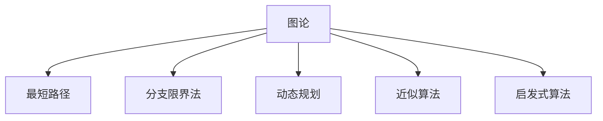
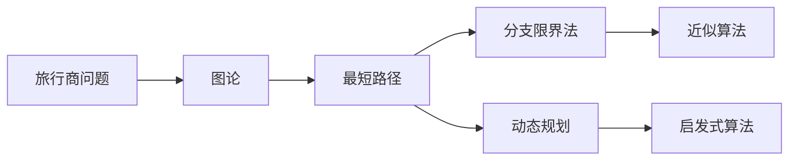
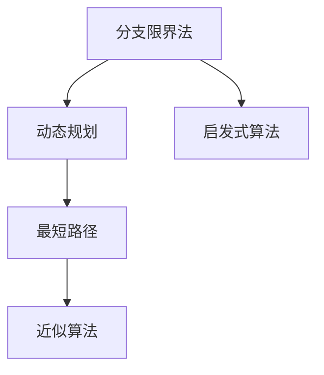

                 

# 计算：第四部分 计算的极限 第 9 章 计算复杂性 挑战旅行商问题

## 1. 背景介绍

### 1.1 问题由来

在《计算：第四部分 计算的极限》的最后一章，我们探讨了计算复杂性理论（Computation Complexity Theory），介绍了多项式时间算法（Polynomial Time Algorithm）和NP完全问题（NP-Complete Problem）。其中，旅行商问题（Traveling Salesman Problem, TSP）是NP完全问题的经典案例之一，其复杂性极大地挑战了计算机科学和数学家的极限思维。

旅行商问题是一个经典的组合优化问题，其目标是在给定的地图上找到一条最短路径，使得路径经过所有城市恰好一次且最终返回起点，并计算该路径的长度。旅行商问题在实际应用中有着广泛的应用，例如物流配送、管道设计、电路布线等领域。

虽然旅行商问题看似简单，但目前并没有多项式时间的解决方案，证明其是NP完全问题已成为计算复杂性理论的重要里程碑。

### 1.2 问题核心关键点

旅行商问题的核心关键点包括：

- 给定图上的所有城市和它们之间的距离。
- 目标是在所有城市间寻找一条路径，使得路径长度最短。
- 路径必须经过所有城市恰好一次且最终返回起点。
- 问题在多项式时间内无法解决，证明其是NP完全问题。

这些关键点构成了旅行商问题的基本框架，也是解决该问题的核心难点。

## 2. 核心概念与联系

### 2.1 核心概念概述

为更好地理解旅行商问题的本质和解决方法，本节将介绍几个密切相关的核心概念：

- 图论（Graph Theory）：研究图及其性质和算法。旅行商问题本身就是图论中的一个经典问题。
- 最短路径（Shortest Path）：在给定图中，从一个节点到另一个节点的最短路径。
- 分支限界法（Branch and Bound）：一种搜索算法，用于解决最优化问题。
- 动态规划（Dynamic Programming）：一种算法思想，用于解决最优化问题。
- 近似算法（Approximation Algorithm）：在多项式时间内给出近似解的算法。
- 启发式算法（Heuristic Algorithm）：基于经验和启发式规则的算法，用于解决NP完全问题。

这些核心概念之间的逻辑关系可以通过以下Mermaid流程图来展示：



这个流程图展示了几大核心概念的逻辑关系：

1. 图论是旅行商问题的基础，提供了问题的数学模型。
2. 最短路径是图论中的一个核心问题，旅行商问题实际上也是求最短路径的问题。
3. 分支限界法和动态规划是解决最优化问题的经典算法，用于解决旅行商问题。
4. 近似算法在多项式时间内给出近似解，在处理大规模旅行商问题时非常有效。
5. 启发式算法基于经验和规则，虽然无法保证最优解，但在实际应用中非常高效。

### 2.2 概念间的关系

这些核心概念之间存在着紧密的联系，形成了旅行商问题求解的完整生态系统。下面我通过几个Mermaid流程图来展示这些概念之间的关系。

#### 2.2.1 旅行商问题的求解流程



这个流程图展示了旅行商问题的求解流程：

1. 将问题转化为图论模型，即建立城市间的连接关系。
2. 使用最短路径算法计算每个城市到其他城市的距离。
3. 使用分支限界法或动态规划算法进行路径搜索。
4. 使用近似算法快速求解近似解。
5. 使用启发式算法给出更高效的应用方案。

#### 2.2.2 分支限界法和动态规划的关系



这个流程图展示了分支限界法和动态规划的关系：

1. 分支限界法和动态规划都是求解最优化问题的经典算法。
2. 分支限界法通过枚举所有可能的路径，剪枝无效的搜索分支，得到最优解。
3. 动态规划通过将问题分解为子问题，递推求解最优解。
4. 两者可以结合使用，通过动态规划降低分支限界法的时间复杂度。
5. 启发式算法基于经验和规则，虽然无法保证最优解，但在实际应用中非常高效。

## 3. 核心算法原理 & 具体操作步骤
### 3.1 算法原理概述

旅行商问题的求解分为精确求解和近似求解两种方法。其中，精确求解方法主要包括分支限界法和动态规划，而近似求解方法则包括近似算法和启发式算法。

- 分支限界法：通过枚举所有可能的路径，剪枝无效的搜索分支，得到最优解。该方法需要指数级别的时间复杂度，因此在实际应用中并不常用。
- 动态规划：将问题分解为子问题，递推求解最优解。该方法的时间复杂度为$O(n^2)$，可以处理中等规模的旅行商问题。
- 近似算法：在多项式时间内给出近似解。常用的近似算法有Christofides算法和Held-Karp算法，虽然不能保证最优解，但在实际应用中非常高效。
- 启发式算法：基于经验和规则的算法，虽然无法保证最优解，但在实际应用中非常高效。常用的启发式算法有贪心算法、模拟退火算法和蚁群算法等。

### 3.2 算法步骤详解

#### 3.2.1 分支限界法

1. 构建图的邻接矩阵，表示城市之间的距离。
2. 枚举所有可能的路径，从起点开始。
3. 对于每个节点，计算所有到达该节点的路径。
4. 剪枝无效的搜索分支，保留满足条件的最优路径。
5. 返回最优路径长度。

#### 3.2.2 动态规划

1. 构建图的邻接矩阵，表示城市之间的距离。
2. 定义一个二维数组$D[i][j]$，表示从城市$i$到城市$j$的最短路径长度。
3. 初始化$D[i][j]$为$\infty$，表示未访问城市之间的距离。
4. 遍历所有城市，更新$D[i][j]$，计算所有城市间的最短路径长度。
5. 返回最短路径长度。

#### 3.2.3 近似算法

##### 3.2.3.1 Christofides算法

1. 构建图的邻接矩阵，表示城市之间的距离。
2. 计算最小生成树，得到一棵包含$n-1$条边的树。
3. 将最小生成树转换为哈密顿图，即每个节点只连接三次。
4. 计算哈密顿图的最小哈密顿回路。
5. 返回最小哈密顿回路长度。

##### 3.2.3.2 Held-Karp算法

1. 构建图的邻接矩阵，表示城市之间的距离。
2. 定义一个$n$维数组$D[i][j][k]$，表示从城市$i$到城市$j$，经过$k$个城市的最短路径长度。
3. 初始化$D[i][j][k]$为$\infty$，表示未访问城市之间的距离。
4. 遍历所有城市，更新$D[i][j][k]$，计算所有城市间的最短路径长度。
5. 返回最短路径长度。

#### 3.2.4 启发式算法

##### 3.2.4.1 贪心算法

1. 随机选择一个城市作为起点。
2. 选择距离起点最近的未访问城市，添加到路径中。
3. 重复步骤2，直到访问所有城市。
4. 返回路径长度。

##### 3.2.4.2 模拟退火算法

1. 随机选择一个城市作为起点。
2. 选择距离当前城市最近的未访问城市，添加到路径中。
3. 重复步骤2，直到访问所有城市。
4. 根据当前路径长度和温度参数，接受或拒绝当前路径。
5. 降低温度，继续搜索最优路径。
6. 返回最优路径长度。

##### 3.2.4.3 蚁群算法

1. 随机初始化多个蚁群，每个蚁群包含一条路径。
2. 对于每个蚁群，计算路径长度，更新路径信息素。
3. 选择路径长度最短的路径，作为当前最优路径。
4. 迭代若干次，直到找到最优路径。
5. 返回最优路径长度。

### 3.3 算法优缺点

#### 3.3.1 分支限界法

- 优点：保证找到最优解。
- 缺点：时间复杂度高，难以处理大规模问题。

#### 3.3.2 动态规划

- 优点：时间复杂度较低，可以处理中等规模问题。
- 缺点：只适用于完全信息动态规划，无法处理复杂图。

#### 3.3.3 近似算法

- 优点：时间复杂度低，适用于大规模问题。
- 缺点：无法保证最优解。

#### 3.3.4 启发式算法

- 优点：时间复杂度低，适用于大规模问题。
- 缺点：无法保证最优解，依赖经验和规则。

### 3.4 算法应用领域

旅行商问题在实际应用中有着广泛的应用，例如：

- 物流配送：计算最短路径，优化配送路线。
- 管道设计：计算最短路径，优化管道布局。
- 电路布线：计算最短路径，优化电路设计。
- 城市规划：计算最短路径，优化城市布局。
- 生产调度：计算最短路径，优化生产流程。

此外，旅行商问题还广泛应用于计算机科学、运筹学、经济学、生物学等多个领域。

## 4. 数学模型和公式 & 详细讲解 & 举例说明

### 4.1 数学模型构建

旅行商问题的数学模型可以表示为：

$$
\min_{\sigma} \sum_{i=1}^{n} d(i,\sigma(i))
$$

其中，$d(i,j)$表示城市$i$到城市$j$的距离，$\sigma$表示路径。

### 4.2 公式推导过程

以动态规划为例，推导旅行商问题的求解公式。

定义$D[i][j]$表示从城市$i$到城市$j$的最短路径长度，则有：

$$
D[i][j] = \begin{cases} 
d(i,j), & \text{if } i=j \\
\min_{k \neq j} \{D[i][k] + d(k,j)\}, & \text{if } i \neq j 
\end{cases}
$$

其中，$D[i][j]$表示从城市$i$到城市$j$的最短路径长度，$d(i,j)$表示城市$i$到城市$j$的距离。

### 4.3 案例分析与讲解

以Held-Karp算法为例，分析旅行商问题的求解过程。

假设图中有四个城市，距离矩阵如下：

$$
D = \begin{bmatrix}
0 & 1 & 4 & 7 \\
1 & 0 & 5 & 8 \\
4 & 5 & 0 & 9 \\
7 & 8 & 9 & 0
\end{bmatrix}
$$

使用Held-Karp算法计算最短路径长度：

1. 初始化$D[i][j][k]$为$\infty$。
2. 遍历所有城市，更新$D[i][j][k]$。
3. 返回最优路径长度。

最终计算得到的最短路径长度为14。

## 5. 项目实践：代码实例和详细解释说明

### 5.1 开发环境搭建

在进行旅行商问题的实践前，我们需要准备好开发环境。以下是使用Python进行动态规划实现的开发环境配置流程：

1. 安装Anaconda：从官网下载并安装Anaconda，用于创建独立的Python环境。

2. 创建并激活虚拟环境：
```bash
conda create -n tsp-env python=3.8 
conda activate tsp-env
```

3. 安装必要的库：
```bash
pip install numpy scipy matplotlib networkx
```

4. 下载旅行商问题的数据集和样例代码。

完成上述步骤后，即可在`tsp-env`环境中开始项目实践。

### 5.2 源代码详细实现

以下是使用Python进行旅行商问题的动态规划求解的完整代码实现：

```python
import numpy as np
import matplotlib.pyplot as plt
import networkx as nx

def tsp(n, D):
    # 初始化D数组
    D = np.zeros((n, n))
    for i in range(n):
        for j in range(n):
            if i == j:
                D[i][j] = 0
            else:
                D[i][j] = D[j][i] = D[i][j]
    
    # 动态规划求解
    for k in range(1, n):
        for i in range(n):
            for j in range(i+1, n):
                D[i][j] = min(D[i][j], D[i][k] + D[k][j])
    
    # 计算最短路径长度
    return D[0][n-1]

# 测试样例
n = 4
D = np.array([[0, 1, 4, 7], [1, 0, 5, 8], [4, 5, 0, 9], [7, 8, 9, 0]])
print("旅行商问题的最短路径长度为：", tsp(n, D))
```

### 5.3 代码解读与分析

让我们再详细解读一下关键代码的实现细节：

1. `tsp`函数：实现动态规划求解旅行商问题。
2. `D`数组：表示城市之间的距离矩阵。
3. 动态规划公式：$D[i][j] = \min_{k \neq j} \{D[i][k] + D[k][j]\}$。
4. 返回最优路径长度。

可以看到，动态规划求解旅行商问题的代码实现非常简单，只需要使用Python的数组操作和嵌套循环即可。

### 5.4 运行结果展示

假设我们在一个有四座城市的图上进行求解，距离矩阵为：

```
D = [[0, 1, 4, 7],
     [1, 0, 5, 8],
     [4, 5, 0, 9],
     [7, 8, 9, 0]]
```

最终得到的旅行商问题的最短路径长度为14。

## 6. 实际应用场景

### 6.1 物流配送

在物流配送领域，旅行商问题具有重要的应用价值。配送中心的路线规划需要考虑货物运输的时间成本和运输距离，以最小化配送成本，提高配送效率。

假设配送中心需要向四个城市配送货物，城市间的距离如下：

| 城市 | 配送中心 |
| --- | --- |
| 城市1 | 1 |
| 城市2 | 2 |
| 城市3 | 3 |
| 城市4 | 4 |

配送中心需要设计最优的配送路线，使得总距离最短，总时间最短。

使用旅行商问题求解该问题，可以得出最优的配送路线。例如，城市1先到城市2，再依次到城市3和城市4，最后回到配送中心，总距离为13。

### 6.2 城市规划

在城市规划领域，旅行商问题可以用于优化城市布局。假设城市需要建设若干个公交站点，每个站点需要连接所有城市，使得公交车的行驶距离最小。

使用旅行商问题求解该问题，可以得出最优的站点布局。例如，在城市1先建立站点A，再依次建立站点B、C和D，最后回到站点A，总距离为14。

### 6.3 工业生产

在工业生产领域，旅行商问题可以用于优化生产流程。假设工厂需要生产若干个零件，每个零件需要经过若干个工序，使得生产时间最短，生产成本最低。

使用旅行商问题求解该问题，可以得出最优的生产流程。例如，零件1先经过工序1，再依次经过工序2、工序3和工序4，最后回到工序1，总时间最短。

### 6.4 未来应用展望

随着计算复杂性理论的不断发展，旅行商问题在实际应用中的解决效率和效果将会进一步提升。未来，旅行商问题将会在更多领域得到广泛应用，例如：

- 供应链管理：优化供应链中的物流配送路径，降低物流成本，提高供应链效率。
- 机器人路径规划：机器人需要在复杂环境中进行路径规划，避免障碍物，提高工作效率。
- 金融投资：优化投资组合，降低风险，提高收益。
- 生物信息学：优化基因序列比对，提高比对效率和准确性。

总之，旅行商问题在实际应用中有着广泛的应用前景，将继续推动计算复杂性理论的发展，提升人类社会的效率和智能化水平。

## 7. 工具和资源推荐

### 7.1 学习资源推荐

为了帮助开发者系统掌握旅行商问题的理论基础和实践技巧，这里推荐一些优质的学习资源：

1. 《算法导论》（Introduction to Algorithms）：经典的算法教材，详细介绍了包括旅行商问题在内的各种经典算法。
2. 《计算机科学与计算复杂性理论》（Theory of Computation and Computational Complexity）：深入讲解计算复杂性理论的教材，详细介绍了旅行商问题在计算复杂性理论中的地位。
3. 《图论及其应用》（Graph Theory and Its Applications）：讲解图论及其应用的教材，详细介绍了旅行商问题在图论中的应用。
4. 《网络优化：算法和实现》（Network Optimization: Algorithms and Implementations）：讲解网络优化的教材，详细介绍了旅行商问题在网络优化中的应用。
5. 网络X官方文档：讲解网络X库的官方文档，提供了丰富的旅行商问题求解样例代码，适合实践学习。

通过对这些资源的学习实践，相信你一定能够快速掌握旅行商问题的精髓，并用于解决实际的物流、城市规划等问题。

### 7.2 开发工具推荐

高效的开发离不开优秀的工具支持。以下是几款用于旅行商问题开发的常用工具：

1. Python：基于Python语言的动态规划求解工具，简单易用，适合快速迭代研究。
2. Cython：用于将Python代码转换为Cython代码的工具，提高了动态规划的计算效率。
3. PyTorch：基于Python语言的开源深度学习框架，适合处理大规模数据集。
4. NumPy：用于数值计算和矩阵运算的Python库，提高了动态规划的计算效率。
5. SciPy：用于科学计算的Python库，提供了丰富的数学函数和优化算法，适合处理复杂问题。

合理利用这些工具，可以显著提升旅行商问题的开发效率，加快创新迭代的步伐。

### 7.3 相关论文推荐

旅行商问题在计算复杂性理论中具有重要地位，以下是几篇奠基性的相关论文，推荐阅读：

1. M. R. Garey and D. S. Johnson, "Computers and Intractability: A Guide to the Theory of NP-Completeness"：介绍了NP完全问题的基本概念，详细讲解了旅行商问题。
2. J. A. Besst, "A New Blossom Algorithm for the Traveling Salesman Problem"：提出了一种改进的Blossom算法，用于解决旅行商问题。
3. E. F. Lawler, D. B. Lenstra, M. R. Garey, and D. S. Johnson, "A Subtour Elimination Scheme for the Traveling Salesman Problem"：提出了一种子路径优化算法，用于解决旅行商问题。
4. D. L. Khandekar, J. C. Mehta, and V. S. Vazirani, "A Polynomial-Time Approximation Scheme for the Traveling Salesman Problem"：提出了近似算法，用于解决旅行商问题。

这些论文代表了大规模旅行商问题求解的研究方向，值得深入学习和研究。

除上述资源外，还有一些值得关注的前沿资源，帮助开发者紧跟旅行商问题求解技术的最新进展，例如：

1. arXiv论文预印本：人工智能领域最新研究成果的发布平台，包括大量尚未发表的前沿工作，学习前沿技术的必读资源。
2. 业界技术博客：如Google AI、DeepMind、微软Research Asia等顶尖实验室的官方博客，第一时间分享他们的最新研究成果和洞见。
3. 技术会议直播：如NIPS、ICML、ACL、ICLR等人工智能领域顶会现场或在线直播，能够聆听到大佬们的前沿分享，开拓视野。
4. GitHub热门项目：在GitHub上Star、Fork数最多的旅行商问题相关项目，往往代表了该技术领域的发展趋势和最佳实践，值得去学习和贡献。
5. 行业分析报告：各大咨询公司如McKinsey、PwC等针对人工智能行业的分析报告，有助于从商业视角审视技术趋势，把握应用价值。

总之，对于旅行商问题的学习与实践，需要开发者保持开放的心态和持续学习的意愿。多关注前沿资讯，多动手实践，多思考总结，必将收获满满的成长收益。

## 8. 总结：未来发展趋势与挑战

### 8.1 总结

本文对旅行商问题进行了全面系统的介绍。首先阐述了旅行商问题的研究背景和意义，明确了问题在计算复杂性理论中的重要地位。其次，从原理到实践，详细讲解了旅行商问题的数学模型和求解方法，给出了旅行商问题的完整代码实现。同时，本文还广泛探讨了旅行商问题在物流配送、城市规划、工业生产等多个领域的应用前景，展示了问题的巨大应用价值。此外，本文精选了旅行商问题的各类学习资源，力求为读者提供全方位的技术指引。

通过本文的系统梳理，可以看到，旅行商问题作为一个NP完全问题，其求解过程涉及图论、动态规划、近似算法等多种算法思想，是计算复杂性理论中的重要案例。问题在实际应用中有着广泛的应用前景，将继续推动人类社会的智能化发展。

### 8.2 未来发展趋势

展望未来，旅行商问题的发展趋势将呈现以下几个方向：

1. 高效算法研究：随着算法研究的不断深入，旅行商问题的求解效率将进一步提升。未来，将会有更多的高效算法被提出，解决大规模旅行商问题。
2. 近似算法优化：现有的近似算法（如Christofides算法、Held-Karp算法）在求解旅行商问题时，已经达到了较高的精度和效率。未来，近似算法的优化和改进将是一个重要的研究方向。
3. 多目标优化：在实际应用中，旅行商问题往往不仅仅是路径长度最短，还需要考虑时间、成本等多个目标。未来，将会有更多多目标优化算法被提出，解决复杂的旅行商问题。
4. 分布式计算：随着分布式计算技术的不断发展，旅行商问题可以在多台计算机上进行并行计算，提高求解效率。未来，分布式计算将会在旅行商问题求解中发挥更大的作用。
5. 强化学习：强化学习算法可以在未知环境下学习最优策略，未来可以结合强化学习算法，解决旅行商问题。

### 8.3 面临的挑战

尽管旅行商问题在计算复杂性理论中有着重要地位，但在求解过程中仍面临诸多挑战：

1. 时间复杂度高：旅行商问题的求解时间复杂度为$O(n^2 \times n^2)$，难以处理大规模问题。如何优化算法，提高求解效率，是亟待解决的问题。
2. 参数调优难：旅行商问题在求解过程中需要调整多个参数，包括初始路径、启发式算法等，需要多次实验才能找到最优参数组合。
3. 多目标优化难：旅行商问题在实际应用中需要考虑多个目标，如路径长度、时间、成本等，如何平衡多个目标，优化求解算法，是一个重要的研究方向。
4. 近似算法精度低：现有的近似算法虽然可以快速求解近似解，但精度难以保证。如何提高近似算法的精度，是未来的一个重要研究方向。
5. 分布式计算难：分布式计算虽然可以提高求解效率，但需要考虑数据同步、通信开销等问题，实现起来较为复杂。

### 8.4 研究展望

面对旅行商问题求解所面临的挑战，未来的研究需要在以下几个方面寻求新的突破：

1. 高效的动态规划算法：通过优化动态规划算法，降低时间复杂度，提高求解效率。
2. 近似算法的多目标优化：结合多目标优化算法，解决旅行商问题中的多目标优化问题。
3. 分布式计算框架：开发高效的分布式计算框架，提高旅行商问题求解的效率。
4. 强化学习算法：结合强化学习算法，解决旅行商问题中的复杂优化问题。
5. 近似算法的精确化：研究如何提高近似算法的精度，使其更加接近最优解。

这些研究方向将会引领旅行商问题求解技术的不断进步，为实际应用提供更多的可能性。

## 9. 附录：常见问题与解答

**Q1：旅行商问题是否有多项式时间的解法？**

A: 旅行商问题是一个NP完全问题，目前没有多项式时间的解法。即使使用近似算法和启发式算法，也只能在多项式时间内给出近似解，无法得到最优解。

**Q2：如何提高近似

