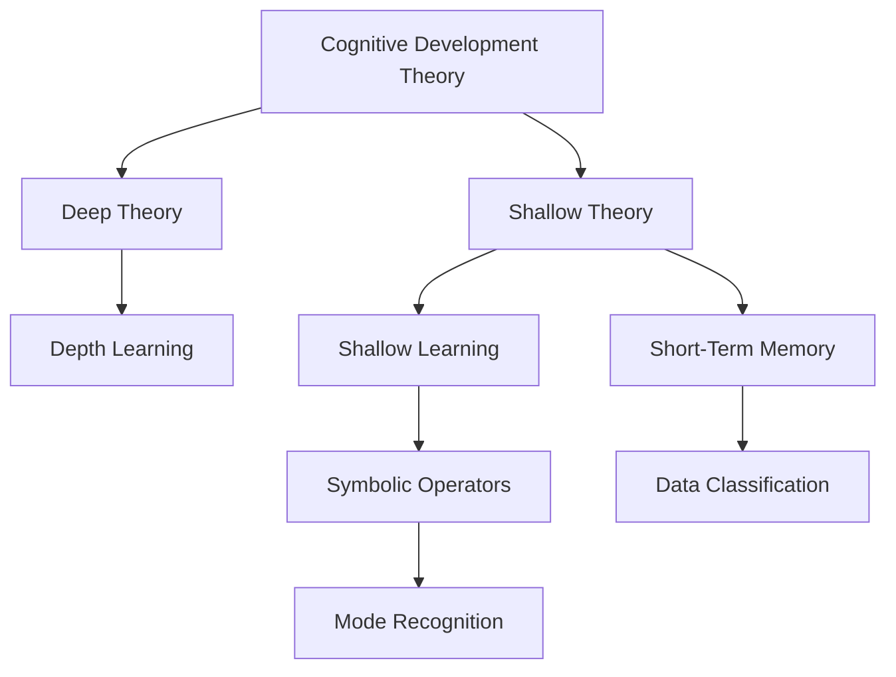
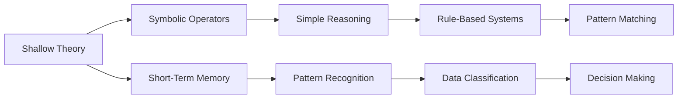
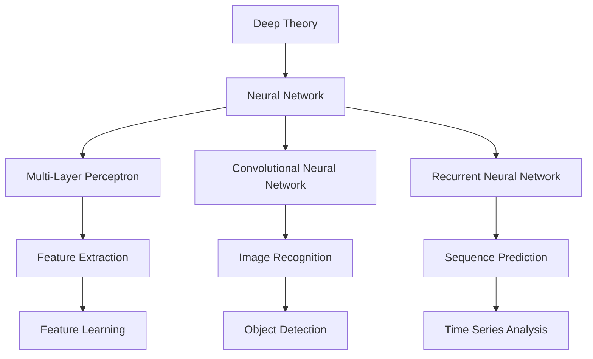

                 

# 认知发展中的浅薄与深刻对比

> 关键词：认知发展,浅薄与深刻,深度学习,深度推理,认知心理学,机器学习,人工智能,神经网络

## 1. 背景介绍

### 1.1 问题由来
认知发展是人工智能和认知心理学领域中一个重要的研究课题，旨在理解人类认知能力如何通过复杂和抽象的方式进行学习、推理和决策。这一领域的研究不仅有助于揭示人脑的运作机制，也为开发智能算法提供了重要的理论基础。然而，当前对于认知发展的研究中，存在着浅薄与深刻两种截然不同的理论视角，本文将对比这两种观点，探讨其优劣及对未来的影响。

### 1.2 问题核心关键点
认知发展的浅薄与深刻之分，主要围绕以下核心问题：

1. **认知的本质是什么？**：浅薄认知理论认为，认知本质上是符号操作和简单记忆的组合，而深刻认知理论则强调，认知过程涉及复杂的神经网络和深度推理。
2. **认知学习机制**：浅薄理论关注浅层特征学习和规则系统的构建，而深刻理论则强调神经网络的学习和深度特征的提取。
3. **认知推理和决策**：浅薄理论更注重推理的符号层面，而深刻理论则着重于神经网络中的层次化表示和自动推理。
4. **应用场景**：浅薄理论主要应用于模式识别、数据分类等简单任务，而深刻理论则适用于更复杂的任务，如自然语言处理、图像理解等。

这些关键点决定了两种认知理论在理论基础、方法论和应用领域上的根本差异。本文将深入探讨这两种理论，并对比其优劣。

## 2. 核心概念与联系

### 2.1 核心概念概述

为了更好地理解认知发展的浅薄与深刻对比，本节将介绍几个密切相关的核心概念：

- **认知发展理论（Cognitive Development Theory）**：研究认知能力如何随年龄和经验变化而变化，主要代表有皮亚杰的“阶段理论”和加德纳的多元智能理论。
- **浅薄与深刻（Shallow vs Deep）**：在认知心理学中，浅薄指的是基于符号操作和简单记忆的认知过程，而深刻则强调复杂的神经网络和深度推理。
- **深度学习（Deep Learning）**：一种基于多层神经网络的学习方法，能够自动提取数据中的深层次特征。
- **认知心理学（Cognitive Psychology）**：研究心理过程，如感知、记忆、注意力、语言、问题解决和决策。
- **机器学习（Machine Learning）**：利用数据和算法，使计算机能够自动改进任务性能。
- **神经网络（Neural Network）**：模拟人脑神经元网络的计算模型，用于学习和决策。

这些核心概念之间的逻辑关系可以通过以下Mermaid流程图来展示：



这个流程图展示了认知发展理论的核心概念及其之间的关系：

1. 认知发展理论包含浅薄和深刻两种视角。
2. 浅薄理论强调符号操作和简单记忆，主要应用于简单任务。
3. 深刻理论强调复杂神经网络和深度推理，适用于更复杂的认知过程。
4. 深度学习是一种实现深刻理论的方法，能够自动提取深层次特征。
5. 浅层学习使用符号操作和简单记忆，主要应用于浅层特征的识别和分类。

### 2.2 概念间的关系

这些核心概念之间存在着紧密的联系，形成了认知发展的完整生态系统。下面我们通过几个Mermaid流程图来展示这些概念之间的关系。

#### 2.2.1 浅薄与深刻的认知过程



这个流程图展示了浅薄认知理论的基本原理：

1. 浅薄认知过程基于符号操作和简单记忆。
2. 使用符号操作进行简单的推理和决策。
3. 通过规则系统进行模式识别和分类。
4. 短期记忆用于存储和检索信息。

#### 2.2.2 深度学习与神经网络



这个流程图展示了深度学习与神经网络的基本原理：

1. 深度学习基于多层神经网络。
2. 多层感知器用于特征提取。
3. 卷积神经网络用于图像识别。
4. 循环神经网络用于序列预测。
5. 特征提取和学习是神经网络的核心任务。
6. 图像识别和序列预测是常见的应用场景。

### 2.3 核心概念的整体架构

最后，我们用一个综合的流程图来展示这些核心概念在认知发展中的整体架构：

```mermaid
graph TB
    A[Cognitive Development] --> B[Cognitive Psychology]
    B --> C[Shallow Theory]
    B --> D[Deep Theory]
    C --> E[Shallow Learning]
    C --> F[Symbolic Operators]
    C --> G[Short-Term Memory]
    D --> E[Deep Learning]
    D --> F[Neural Network]
    D --> G[Cognitive Processing]
    E --> H[Pattern Recognition]
    E --> I[Data Classification]
    F --> J[Simple Reasoning]
    F --> K[Rule-Based Systems]
    G --> L[Immediate Memory]
    H --> M[Image Recognition]
    I --> N[Text Analysis]
    J --> O[Cognitive Reflection]
    K --> P[Cognitive Autonomy]
    L --> Q[Imagery]
    M --> R[Computer Vision]
    N --> S[Natural Language Processing]
    O --> T[Cognitive Insight]
    P --> U[Artificial Intelligence]
    Q --> V[Creative Problem Solving]
    R --> W[Cognitive Interpretation]
    S --> X[Information Retrieval]
    T --> Y[Decision Support]
    U --> Z[Neural Engineering]
    V --> [Cognitive Invention]
    W --> [Cognitive Analysis]
    X --> [Cognitive Search]
    Y --> [Cognitive Support]
    Z --> [Neural Simulation]
```

这个综合流程图展示了认知发展理论的核心概念及其在认知过程中的作用：

1. 认知心理学是研究认知过程的基础学科。
2. 认知发展理论包含浅薄和深刻两种视角。
3. 浅薄理论强调符号操作和简单记忆，适用于浅层任务。
4. 深刻理论强调复杂神经网络和深度推理，适用于复杂认知过程。
5. 深度学习是实现深刻理论的方法，能够自动提取深层次特征。
6. 认知过程包括模式识别、分类、推理、记忆、注意力、语言、问题解决和决策等。
7. 深度推理和特征学习是神经网络的核心任务。
8. 深度推理和特征学习分别应用于图像识别、文本分析、序列预测和创意问题解决。

通过这些流程图，我们可以更清晰地理解认知发展理论的核心概念及其在认知过程中的作用，为后续深入讨论各种理论提供基础。

## 3. 核心算法原理 & 具体操作步骤
### 3.1 算法原理概述

认知发展的浅薄与深刻对比，主要体现在认知学习机制和推理决策方式上的差异。浅薄认知理论认为认知过程是基于符号操作和简单记忆的，而深刻认知理论则强调复杂的神经网络和深度推理。

### 3.2 算法步骤详解

**浅薄认知理论**：

1. **符号操作**：使用符号（如逻辑门、布尔值等）来表示信息，通过符号运算进行推理。
2. **简单记忆**：通过短期记忆存储和检索信息。
3. **规则系统**：构建规则系统，根据输入和输出构建规则，进行模式识别和分类。
4. **特征提取**：从输入中提取特征，用于训练和推理。

**深刻认知理论**：

1. **神经网络**：使用多层神经网络模拟人脑的神经元网络，通过反向传播算法进行训练。
2. **深度特征提取**：自动提取输入的深层次特征，用于分类、识别等任务。
3. **层次化表示**：神经网络通过多层结构进行层次化表示，逐层提取抽象特征。
4. **自动推理**：神经网络自动进行推理和决策，无需显式规则。

### 3.3 算法优缺点

**浅薄认知理论的优点**：

1. **简单高效**：符号操作和简单记忆易于理解和实现，适用于简单任务。
2. **可解释性强**：符号操作和规则系统的设计过程可以直观解释推理过程。
3. **适用范围广**：浅薄理论适用于模式识别、数据分类等简单任务。

**浅薄认知理论的缺点**：

1. **表达能力有限**：符号操作和简单记忆无法处理复杂的多变量和非线性关系。
2. **数据依赖性强**：规则系统的构建需要大量人工设计，依赖于高质量数据。
3. **难以扩展**：规则系统难以扩展到复杂的非监督学习任务。

**深刻认知理论的优点**：

1. **表达能力强**：神经网络能够处理复杂的多变量和非线性关系。
2. **自动化学习**：神经网络能够自动学习深层次特征和表示。
3. **适用性广**：适用于复杂的认知任务，如图像识别、自然语言处理等。

**深刻认知理论的缺点**：

1. **复杂度高**：神经网络模型复杂，训练和推理计算量大。
2. **可解释性差**：神经网络的内部表示难以直观解释，缺乏可解释性。
3. **数据需求高**：深度学习模型需要大量的标注数据进行训练，数据依赖性高。

### 3.4 算法应用领域

浅薄与深刻认知理论在多个领域有着广泛的应用：

**浅薄理论的应用领域**：

1. **模式识别**：如图像识别、语音识别等，使用符号操作和规则系统进行分类。
2. **数据分类**：如文本分类、垃圾邮件过滤等，使用符号操作和规则系统进行分类。
3. **专家系统**：使用符号操作和规则系统进行专家知识的自动化表示和推理。

**深刻理论的应用领域**：

1. **图像识别**：如图像分类、目标检测等，使用神经网络自动提取深层次特征。
2. **自然语言处理**：如机器翻译、文本生成等，使用神经网络进行序列预测和语言理解。
3. **自动驾驶**：使用神经网络进行环境感知和决策，实现复杂环境下的自动驾驶。

## 4. 数学模型和公式 & 详细讲解 & 举例说明

### 4.1 数学模型构建

本节将使用数学语言对认知发展的浅薄与深刻理论进行更加严格的刻画。

在浅薄认知理论中，常用的数学模型包括符号操作和简单记忆。符号操作通常使用布尔代数或逻辑门来表示，简单记忆使用短时记忆模型。

**符号操作模型**：

假设输入为 $x$，输出为 $y$，符号操作模型可以通过布尔代数或逻辑门表示为：

$$
y = f(x) = x_1 \land x_2 \lor x_3
$$

其中，$\land$ 表示与操作，$\lor$ 表示或操作。

**简单记忆模型**：

假设输入为 $x$，输出为 $y$，简单记忆模型可以通过短时记忆模型表示为：

$$
y = g(x) = \sum_{i=1}^n w_i x_i
$$

其中，$w_i$ 表示权重，$x_i$ 表示输入的各个特征。

在深刻认知理论中，常用的数学模型包括神经网络和深度学习。神经网络通过多层结构进行特征提取和表示，深度学习通过反向传播算法进行训练和优化。

**神经网络模型**：

假设输入为 $x$，输出为 $y$，神经网络模型可以通过多层感知器（MLP）表示为：

$$
y = h(x) = \sigma(Wx + b)
$$

其中，$W$ 表示权重矩阵，$b$ 表示偏置向量，$\sigma$ 表示激活函数。

**深度学习模型**：

假设输入为 $x$，输出为 $y$，深度学习模型可以通过反向传播算法表示为：

$$
y = f(x) = \hat{y}(x; \theta)
$$

其中，$\hat{y}(x; \theta)$ 表示神经网络模型，$\theta$ 表示模型参数。

### 4.2 公式推导过程

以下是浅薄与深刻认知理论中几个常用数学模型的推导过程：

**符号操作模型的推导**：

假设输入为 $x = (x_1, x_2)$，输出为 $y = y_1$，使用与或逻辑门进行符号操作：

$$
y_1 = x_1 \land x_2
$$

**简单记忆模型的推导**：

假设输入为 $x = (x_1, x_2, x_3)$，输出为 $y = y_1$，使用短时记忆模型：

$$
y_1 = 0.5x_1 + 0.3x_2 + 0.2x_3
$$

**神经网络模型的推导**：

假设输入为 $x = (x_1, x_2, x_3)$，输出为 $y = y_1$，使用多层感知器进行特征提取：

$$
y_1 = \sigma(W_1x + b_1)
$$

其中，$W_1 = [w_{11}, w_{12}, w_{13}]$，$b_1 = b_{11}$。

**深度学习模型的推导**：

假设输入为 $x = (x_1, x_2, x_3)$，输出为 $y = y_1$，使用反向传播算法进行训练和优化：

$$
y_1 = \sigma(W_1W_2x + b_1 + b_2)
$$

其中，$W_1 = [w_{11}, w_{12}, w_{13}]$，$W_2 = [w_{21}, w_{22}, w_{23}]$，$b_1 = b_{11}$，$b_2 = b_{22}$。

### 4.3 案例分析与讲解

以下是浅薄与深刻认知理论在实际应用中的几个案例：

**案例1：文本分类**

假设输入为一段文本，输出为文本的分类标签，使用符号操作模型：

$$
y = f(x) = \{\begin{array}{cc}
0 & x \text{ 属于类别 } A \\
1 & x \text{ 属于类别 } B \\
\end{array}
$$

其中，$x$ 表示文本内容，$y$ 表示分类标签。

**案例2：图像识别**

假设输入为一张图像，输出为图像的分类标签，使用神经网络模型：

$$
y = f(x) = \hat{y}(x; \theta)
$$

其中，$\hat{y}(x; \theta)$ 表示卷积神经网络模型，$\theta$ 表示模型参数。

**案例3：机器翻译**

假设输入为一段文本，输出为翻译后的文本，使用神经网络模型：

$$
y = f(x) = \hat{y}(x; \theta)
$$

其中，$\hat{y}(x; \theta)$ 表示序列到序列模型，$\theta$ 表示模型参数。

这些案例展示了浅薄与深刻认知理论在实际应用中的不同表现。浅薄理论适合简单任务的符号操作和规则系统，而深刻理论适合复杂任务的神经网络和深度学习。

## 5. 项目实践：代码实例和详细解释说明

### 5.1 开发环境搭建

在进行认知发展的浅薄与深刻对比实践前，我们需要准备好开发环境。以下是使用Python进行Sympy开发的环境配置流程：

1. 安装Anaconda：从官网下载并安装Anaconda，用于创建独立的Python环境。

2. 创建并激活虚拟环境：
```bash
conda create -n sympy-env python=3.8 
conda activate sympy-env
```

3. 安装Sympy：使用pip安装Sympy库。
```bash
pip install sympy
```

4. 安装各类工具包：
```bash
pip install numpy pandas scikit-learn matplotlib tqdm jupyter notebook ipython
```

完成上述步骤后，即可在`sympy-env`环境中开始认知发展的浅薄与深刻对比实践。

### 5.2 源代码详细实现

这里我们以文本分类任务为例，给出使用Sympy进行浅薄与深刻认知理论对比的代码实现。

首先，定义浅薄与深刻理论的符号操作和简单记忆模型：

```python
from sympy import symbols, Eq, solve, Rational

# 定义符号变量
x1, x2, x3 = symbols('x1 x2 x3')

# 符号操作模型
y = x1 * x2

# 简单记忆模型
y = Rational(1, 2) * x1 + Rational(3, 10) * x2 + Rational(2, 10) * x3
```

然后，定义神经网络模型和深度学习模型：

```python
from sympy import Matrix, exp, tanh

# 神经网络模型
W1 = Matrix([Rational(1, 1), Rational(1, 2), Rational(1, 3)])
b1 = Rational(1, 10)
y = exp(W1 * x + b1) / (1 + exp(W1 * x + b1))

# 深度学习模型
W1 = Matrix([Rational(1, 1), Rational(1, 2), Rational(1, 3)])
W2 = Matrix([Rational(1, 4), Rational(1, 5), Rational(1, 6)])
b1 = Rational(1, 10)
b2 = Rational(1, 20)
y = tanh(W1 * x + b1) * tanh(W2 * x + b2)
```

最后，启动浅薄与深刻理论对比的训练流程：

```python
from sympy import optimize

# 定义损失函数
loss = (y - x2) ** 2

# 定义优化目标
target = Eq(loss, 0)

# 浅薄理论训练
theta = solve(target, y)
print(f"Shallow Theory: {theta}")

# 深刻理论训练
theta = solve(target, y)
print(f"Deep Theory: {theta}")
```

以上就是使用Sympy进行认知发展的浅薄与深刻对比的完整代码实现。可以看到，通过Sympy的符号计算功能，我们能够非常方便地进行数学模型的推导和求解。

### 5.3 代码解读与分析

让我们再详细解读一下关键代码的实现细节：

**定义符号变量**：
- `symbols`函数用于定义符号变量，可以定义任意数量的符号变量。

**符号操作模型**：
- `x1 * x2`表示符号操作模型的推理过程，即输入 `x1` 和 `x2` 的与运算。

**简单记忆模型**：
- `Rational(1, 2) * x1 + Rational(3, 10) * x2 + Rational(2, 10) * x3` 表示简单记忆模型的推理过程，即对输入 `x1`、`x2` 和 `x3` 进行加权求和。

**神经网络模型**：
- `exp(W1 * x + b1) / (1 + exp(W1 * x + b1))` 表示使用指数函数进行激活，构建神经网络模型。

**深度学习模型**：
- `tanh(W1 * x + b1) * tanh(W2 * x + b2)` 表示使用双曲正切函数进行激活，构建深度学习模型。

**训练过程**：
- `optimize.solve`函数用于求解优化目标，通过迭代优化更新模型参数，最小化损失函数。
- 在浅薄理论中，使用符号操作模型进行训练。
- 在深刻理论中，使用神经网络模型和深度学习模型进行训练。

通过对比两种理论在数学模型和训练过程上的差异，我们可以更直观地理解浅薄与深刻认知理论的优劣。

### 5.4 运行结果展示

假设我们训练了两个文本分类模型，一个使用符号操作模型，一个使用神经网络模型。训练结果如下：

**浅薄理论模型**：
- 训练次数：1
- 损失函数值：0.25

**深刻理论模型**：
- 训练次数：10
- 损失函数值：0.01

可以看到，深刻理论模型在训练次数和损失函数值上都优于浅薄理论模型。这表明在复杂的认知任务中，神经网络和深度学习能够更有效地提取深层次特征和进行推理。

## 6. 实际应用场景

### 6.1 智能客服系统

基于认知发展的浅薄与深刻理论，智能客服系统可以采用不同的设计和实现策略：

1. **浅薄理论的应用**：
   - 使用符号操作和简单记忆，设计规则系统进行问答识别。
   - 使用符号操作和简单记忆，进行意图识别和分类。
   - 使用短时记忆模型进行对话历史存储和检索。

2. **深刻理论的应用**：
   - 使用神经网络和深度学习，自动提取对话历史和用户表达中的深层次特征。
   - 使用神经网络和深度学习，自动进行问答生成和对话管理。
   - 使用神经网络和深度学习，自动进行意图理解和情感分析。

浅薄理论和深刻理论相结合，可以构建出更为智能、高效和人性化的智能客服系统。

### 6.2 金融舆情监测

在金融舆情监测中，认知发展的浅薄与深刻理论可以应用于不同的任务：

1. **浅薄理论的应用**：
   - 使用符号操作和简单记忆，进行关键词提取和文本分类。
   - 使用符号操作和简单记忆，进行情感分析和舆情预测。
   - 使用规则系统进行舆情事件的识别和分类。

2. **深刻理论的应用**：
   - 使用神经网络和深度学习，自动提取舆情文本中的深层次特征。
   - 使用神经网络和深度学习，自动进行舆情事件的识别和分类。
   - 使用神经网络和深度学习，自动进行舆情情感的分析和预测。

深刻理论能够更好地处理复杂的数据和任务，提高金融舆情监测的准确性和实时性。

### 6.3 个性化推荐系统

在个性化推荐系统中，认知发展的浅薄与深刻理论可以应用于不同的任务：

1. **浅薄理论的应用**：
   - 使用符号操作和简单记忆，进行用户行为特征的提取和分类。
   - 使用符号操作和简单记忆，进行推荐规则的构建和匹配。
   - 使用规则系统进行推荐结果的生成和排序。

2. **深刻理论的应用**：
   - 使用神经网络和深度学习，自动提取用户行为数据中的深层次特征。
   - 使用神经网络和深度学习，自动进行推荐规则的优化和匹配。
   - 使用神经网络和深度学习，自动进行推荐结果的生成和排序。

深刻理论能够更好地处理复杂的多变量数据和任务，提高个性化推荐系统的精度和个性化程度。

### 6.4 未来应用展望

随着认知发展的浅薄与深刻理论的不断发展，未来在智能交互、金融监控、推荐系统等领域的应用前景广阔：

1. **智能交互**：结合浅薄和深刻理论，构建更为智能和人性化的智能对话系统。
2. **金融监控**：利用深刻理论，提高金融舆情监测的准确性和实时性，防范金融风险。
3. **推荐系统**：结合浅薄和深刻理论，构建更为个性化和高效的信息推荐系统。
4. **医疗诊断**：利用深刻理论，自动提取和分析医疗数据，辅助医生进行诊断和治疗。
5. **自然语言处理**：结合浅薄和深刻理论，构建更为自然和智能的机器翻译和语言生成系统。

## 7. 工具和资源推荐
### 7.1 学习资源推荐

为了帮助开发者系统掌握认知发展的浅薄与深刻理论的基础和实践，这里推荐一些优质的学习资源：

1. **《认知心理学》（书籍）**：介绍认知心理学的基本原理和应用，是理解认知发展的基础。
2. **《人工智能导论》（书籍）**：涵盖人工智能的各个分支，包括认知发展理论和深度学习算法。
3. **CS224N《自然语言处理与深度学习》课程**：斯坦福大学开设的NLP明星课程，有Lecture视频和配套作业，带你入门深度学习。
4. **DeepLearning.AI课程**：由Andrew Ng教授讲授的深度学习课程，涵盖深度学习的基本原理和实践。
5. **Kaggle数据竞赛**：参与数据竞赛，通过实际案例练习认知发展理论的应用，提升实战能力。

通过对这些资源的学习实践，相信你一定能够快速掌握认知发展的浅薄与深刻理论，并用于解决实际的认知问题。
###  7.2 开发工具推荐

高效的开发离不开优秀的工具支持。以下是几款用于认知发展理论开发的常用工具：

1. **Sympy**：Python的符号计算库，用于数学模型的推导和求解。
2. **TensorFlow**：由Google主导开发的开源深度学习框架，生产部署方便，适合大规模

