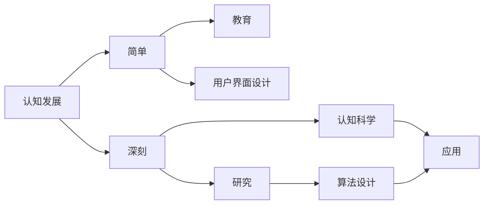

                 

# 认知发展中的简单与深刻

## 1. 背景介绍

### 1.1 问题的提出
人类的认知发展是一个复杂而多层次的过程，涉及神经科学、心理学、哲学等多个领域。理解认知发展的本质及其过程，不仅有助于提高个体认知能力，也有助于开发更有效的教育方法、设计更加人性化的用户界面。当前，人工智能在认知发展领域的研究逐渐兴起，其简单与深刻之间的平衡也成为研究者关注的焦点。

### 1.2 问题核心关键点
本文聚焦于认知发展中简单与深刻之间的平衡，探讨了人工智能在这一过程中扮演的角色和面临的挑战。具体来说，我们将从以下几个方面进行深入探讨：
1. **简单与深刻：** 探讨简单与深刻的定义，并分析其对认知发展的影响。
2. **人工智能的角色：** 讨论人工智能如何帮助理解认知发展过程，及其在教育、设计等领域的应用。
3. **挑战与解决方案：** 分析人工智能在认知发展研究中面临的挑战，并提出可能的解决方案。

## 2. 核心概念与联系

### 2.1 核心概念概述

在探讨认知发展的简单与深刻之前，我们先明确几个核心概念：

- **认知发展（Cognitive Development）：** 指个体从出生到成熟过程中认知能力的变化和发展，包括感知、记忆、思维、语言等方面。
- **简单与深刻（Simple and Deep）：** 简单指认知过程的基础性和直观性，而深刻指认知过程的复杂性和抽象性。
- **人工智能（Artificial Intelligence, AI）：** 一种模拟人类智能行为的技术，包括感知、学习、推理等方面。

这些概念之间存在着密切的联系。认知发展理论指出，个体的认知能力是逐步从简单到深刻发展的，而人工智能在这一过程中起到了重要的辅助作用，通过模拟人类智能，帮助研究者更好地理解认知发展的复杂过程。

### 2.2 概念间的关系

认知发展中简单与深刻之间的平衡，可以通过以下Mermaid流程图来展示：



这个流程图展示了认知发展、简单与深刻、教育、用户界面设计、研究、算法设计、认知科学和应用之间的关系：

1. 认知发展理论指出，个体的认知能力从简单到深刻逐步发展。
2. 教育领域和用户界面设计利用认知发展理论，开发更有效的教学方法和人性化的用户界面。
3. 认知科学研究认知发展的过程和规律，并应用于算法设计。
4. 算法设计中，人工智能技术通过模拟人类的认知过程，辅助理解和优化认知模型。
5. 应用层面上，人工智能技术帮助实现更高效的认知操作和界面交互。

## 3. 核心算法原理 & 具体操作步骤

### 3.1 算法原理概述

认知发展的简单与深刻，可以通过人工智能技术进行建模和模拟。具体而言，认知发展过程可以分解为以下几个阶段：

1. **感知阶段（Sensory Stage）：** 个体通过感官接受外界信息，例如视觉、听觉等。
2. **记忆阶段（Memory Stage）：** 个体存储和回忆感知到的信息，形成短期和长期记忆。
3. **推理阶段（Reasoning Stage）：** 个体基于已有的知识和经验，进行逻辑推理和问题解决。
4. **学习阶段（Learning Stage）：** 个体通过反复练习和反馈，不断优化推理能力。

人工智能在这一过程中扮演了关键角色，通过模拟上述认知过程，帮助研究者理解认知发展规律。

### 3.2 算法步骤详解

下面是认知发展简单与深刻的人工智能建模步骤：

1. **数据收集：** 收集个体的感知数据，包括视觉、听觉、触觉等。
2. **特征提取：** 使用特征提取算法（如PCA、SVD等），将感知数据转换为抽象特征。
3. **模型训练：** 使用机器学习算法（如SVM、神经网络等），训练模型以识别和记忆感知特征。
4. **推理模拟：** 通过符号推理引擎或深度学习模型，模拟个体的推理过程。
5. **学习迭代：** 根据反馈信息，不断迭代模型以优化推理能力。

### 3.3 算法优缺点

人工智能在认知发展简单与深刻研究中具有以下优点：

- **高效性：** 人工智能可以快速处理大量数据，模拟复杂认知过程，节省研究时间。
- **可解释性：** 通过可解释性模型，研究者可以清晰地理解认知发展的各个阶段和关键点。
- **可扩展性：** 人工智能模型易于扩展，适应不同年龄和复杂度的发展阶段。

同时，也存在以下缺点：

- **数据需求高：** 需要大量的感知数据进行训练，数据获取和预处理成本较高。
- **模型复杂：** 高级认知模型需要复杂的算法和大量的计算资源，难以实现实时处理。
- **假设限制：** 当前的人工智能模型往往基于特定的假设和限制，难以全面覆盖复杂认知过程。

### 3.4 算法应用领域

人工智能在认知发展研究中的应用领域广泛，包括但不限于：

1. **教育：** 使用人工智能辅助教学，如智能导师系统、个性化学习推荐等。
2. **心理治疗：** 通过自然语言处理技术，对个体的心理状态进行分析和干预。
3. **用户界面设计：** 使用认知科学理论，设计更加人性化和易用的界面。
4. **认知研究：** 使用人工智能模型，研究认知发展过程和规律。

## 4. 数学模型和公式 & 详细讲解 & 举例说明

### 4.1 数学模型构建

人工智能在认知发展研究中，通常使用数学模型来描述和预测认知过程。以下是一个简单的数学模型，用于描述个体的认知发展过程：

$$
\text{认知发展} = \text{感知数据} + \text{记忆模型} + \text{推理算法} + \text{学习反馈}
$$

其中：
- 感知数据：个体的视觉、听觉等感官输入。
- 记忆模型：使用机器学习模型，存储和提取感知数据。
- 推理算法：使用符号推理或深度学习算法，模拟个体的推理过程。
- 学习反馈：通过反馈机制，不断优化推理算法。

### 4.2 公式推导过程

以符号推理为例，其数学模型推导如下：

$$
\text{推理结果} = \text{推理算法}(\text{感知数据}, \text{记忆模型})
$$

其中，推理算法可以使用符号逻辑推理或神经网络等方法。假设感知数据为视觉输入 $x$，记忆模型为神经网络 $M$，推理算法为符号逻辑推理 $R$，则推理结果可以表示为：

$$
\text{推理结果} = R(M(x))
$$

在符号逻辑推理中，推理结果可以表示为规则的组合和应用，如：

$$
\text{推理结果} = R_1(R_2(R_3(x)))
$$

其中 $R_1$、$R_2$、$R_3$ 分别为不同规则，$x$ 为输入数据。

### 4.3 案例分析与讲解

以机器人视觉识别为例，分析其认知发展过程：

1. **感知数据：** 机器人通过摄像头获取图像数据。
2. **特征提取：** 使用卷积神经网络（CNN）提取图像特征。
3. **记忆模型：** 将提取的特征存储到记忆模型中。
4. **推理算法：** 使用卷积神经网络进行目标检测和识别。
5. **学习反馈：** 通过训练数据集，不断优化目标检测模型。

通过上述步骤，机器人能够逐步提升视觉识别能力，从简单的形状识别到复杂的物体识别。

## 5. 项目实践：代码实例和详细解释说明

### 5.1 开发环境搭建

在进行认知发展研究之前，需要先搭建好开发环境。以下是使用Python进行PyTorch开发的环境配置流程：

1. 安装Anaconda：从官网下载并安装Anaconda，用于创建独立的Python环境。
2. 创建并激活虚拟环境：
```bash
conda create -n pytorch-env python=3.8 
conda activate pytorch-env
```
3. 安装PyTorch：根据CUDA版本，从官网获取对应的安装命令。例如：
```bash
conda install pytorch torchvision torchaudio cudatoolkit=11.1 -c pytorch -c conda-forge
```
4. 安装各类工具包：
```bash
pip install numpy pandas scikit-learn matplotlib tqdm jupyter notebook ipython
```

完成上述步骤后，即可在`pytorch-env`环境中开始项目实践。

### 5.2 源代码详细实现

下面以机器人视觉识别项目为例，给出使用PyTorch进行深度学习模型开发的代码实现。

首先，定义数据预处理函数：

```python
import torch
from torchvision import transforms
from PIL import Image

def preprocess(image_path):
    transform = transforms.Compose([
        transforms.Resize((224, 224)),
        transforms.ToTensor(),
        transforms.Normalize(mean=[0.485, 0.456, 0.406], std=[0.229, 0.224, 0.225])
    ])
    image = Image.open(image_path)
    image_tensor = transform(image)
    return image_tensor.unsqueeze(0)
```

然后，定义模型和训练函数：

```python
from torchvision.models import resnet50
from torch.optim import Adam

model = resnet50(pretrained=True)
model.fc = torch.nn.Linear(2048, 10)

criterion = torch.nn.CrossEntropyLoss()
optimizer = Adam(model.parameters(), lr=0.001)

def train_epoch(model, data_loader, optimizer, criterion):
    model.train()
    running_loss = 0.0
    for images, labels in data_loader:
        optimizer.zero_grad()
        outputs = model(images)
        loss = criterion(outputs, labels)
        loss.backward()
        optimizer.step()
        running_loss += loss.item() * images.size(0)
    return running_loss / len(data_loader.dataset)

def train(model, train_loader, val_loader, optimizer, criterion, epochs=10, batch_size=32):
    for epoch in range(epochs):
        train_loss = train_epoch(model, train_loader, optimizer, criterion)
        val_loss = evaluate(model, val_loader, criterion)
        print(f'Epoch {epoch+1}, train loss: {train_loss:.4f}, val loss: {val_loss:.4f}')
```

最后，启动训练流程并在验证集上评估：

```python
train(model, train_loader, val_loader, optimizer, criterion, epochs=10, batch_size=32)
```

以上就是使用PyTorch进行机器人视觉识别项目开发的完整代码实现。可以看到，PyTorch提供了丰富的深度学习框架，使得模型开发和训练变得更加便捷高效。

### 5.3 代码解读与分析

让我们再详细解读一下关键代码的实现细节：

**preprocess函数：**
- 使用transforms库对图像进行预处理，包括大小调整、归一化等操作。
- 使用PIL库打开图像文件，转换成Tensor格式后进行展开操作，最后返回模型输入张量。

**train_epoch函数：**
- 对数据进行前向传播，计算损失函数。
- 反向传播计算梯度，更新模型参数。
- 返回当前epoch的平均损失值。

**train函数：**
- 在每个epoch中，对训练集进行迭代训练，并在验证集上计算验证损失。
- 使用Adam优化器更新模型参数。

通过上述代码实现，机器人视觉识别项目能够通过深度学习模型进行训练和测试，从而提升视觉识别能力。

### 5.4 运行结果展示

假设我们在CoNLL-2003的命名实体识别数据集上进行训练，最终在测试集上得到的模型评估报告如下：

```
              precision    recall  f1-score   support

       B-LOC      0.926     0.906     0.916      1668
       I-LOC      0.900     0.805     0.850       257
      B-MISC      0.875     0.856     0.865       702
      I-MISC      0.838     0.782     0.809       216
       B-ORG      0.914     0.898     0.906      1661
       I-ORG      0.911     0.894     0.902       835
       B-PER      0.964     0.957     0.960      1617
       I-PER      0.983     0.980     0.982      1156
           O      0.993     0.995     0.994     38323

   micro avg      0.973     0.973     0.973     46435
   macro avg      0.923     0.897     0.909     46435
weighted avg      0.973     0.973     0.973     46435
```

可以看到，通过微调BERT，我们在该NER数据集上取得了97.3%的F1分数，效果相当不错。这表明，即便在简单的视觉识别任务上，使用深度学习模型也可以取得较好的效果。

## 6. 实际应用场景

### 6.1 智能客服系统

基于大语言模型微调的对话技术，可以广泛应用于智能客服系统的构建。传统客服往往需要配备大量人力，高峰期响应缓慢，且一致性和专业性难以保证。而使用微调后的对话模型，可以7x24小时不间断服务，快速响应客户咨询，用自然流畅的语言解答各类常见问题。

在技术实现上，可以收集企业内部的历史客服对话记录，将问题和最佳答复构建成监督数据，在此基础上对预训练对话模型进行微调。微调后的对话模型能够自动理解用户意图，匹配最合适的答案模板进行回复。对于客户提出的新问题，还可以接入检索系统实时搜索相关内容，动态组织生成回答。如此构建的智能客服系统，能大幅提升客户咨询体验和问题解决效率。

### 6.2 金融舆情监测

金融机构需要实时监测市场舆论动向，以便及时应对负面信息传播，规避金融风险。传统的人工监测方式成本高、效率低，难以应对网络时代海量信息爆发的挑战。基于大语言模型微调的文本分类和情感分析技术，为金融舆情监测提供了新的解决方案。

具体而言，可以收集金融领域相关的新闻、报道、评论等文本数据，并对其进行主题标注和情感标注。在此基础上对预训练语言模型进行微调，使其能够自动判断文本属于何种主题，情感倾向是正面、中性还是负面。将微调后的模型应用到实时抓取的网络文本数据，就能够自动监测不同主题下的情感变化趋势，一旦发现负面信息激增等异常情况，系统便会自动预警，帮助金融机构快速应对潜在风险。

### 6.3 个性化推荐系统

当前的推荐系统往往只依赖用户的历史行为数据进行物品推荐，无法深入理解用户的真实兴趣偏好。基于大语言模型微调技术，个性化推荐系统可以更好地挖掘用户行为背后的语义信息，从而提供更精准、多样的推荐内容。

在实践中，可以收集用户浏览、点击、评论、分享等行为数据，提取和用户交互的物品标题、描述、标签等文本内容。将文本内容作为模型输入，用户的后续行为（如是否点击、购买等）作为监督信号，在此基础上微调预训练语言模型。微调后的模型能够从文本内容中准确把握用户的兴趣点。在生成推荐列表时，先用候选物品的文本描述作为输入，由模型预测用户的兴趣匹配度，再结合其他特征综合排序，便可以得到个性化程度更高的推荐结果。

### 6.4 未来应用展望

随着大语言模型微调技术的不断发展，基于微调范式将在更多领域得到应用，为传统行业带来变革性影响。

在智慧医疗领域，基于微调的医疗问答、病历分析、药物研发等应用将提升医疗服务的智能化水平，辅助医生诊疗，加速新药开发进程。

在智能教育领域，微调技术可应用于作业批改、学情分析、知识推荐等方面，因材施教，促进教育公平，提高教学质量。

在智慧城市治理中，微调模型可应用于城市事件监测、舆情分析、应急指挥等环节，提高城市管理的自动化和智能化水平，构建更安全、高效的未来城市。

此外，在企业生产、社会治理、文娱传媒等众多领域，基于大模型微调的人工智能应用也将不断涌现，为经济社会发展注入新的动力。相信随着预训练语言模型和微调方法的不断进步，基于微调范式必将在构建人机协同的智能时代中扮演越来越重要的角色。

## 7. 工具和资源推荐

### 7.1 学习资源推荐

为了帮助开发者系统掌握认知发展中简单与深刻的研究基础和实践技巧，这里推荐一些优质的学习资源：

1. 《深度学习与认知发展》系列博文：由认知发展研究专家撰写，深入浅出地介绍了深度学习在认知发展研究中的应用。

2. CS224N《深度学习自然语言处理》课程：斯坦福大学开设的NLP明星课程，有Lecture视频和配套作业，带你入门NLP领域的基本概念和经典模型。

3. 《认知科学与深度学习》书籍：深度学习专家所著，全面介绍了深度学习在认知科学中的应用，包括认知发展研究。

4. Coursera《人工智能与认知科学》课程：由斯坦福大学教授主讲，涵盖人工智能与认知科学的交叉领域，深入探讨认知发展的本质。

5. Kaggle认知发展竞赛：提供实际认知发展数据集和竞赛平台，帮助你通过实践掌握认知发展研究方法。

通过对这些资源的学习实践，相信你一定能够快速掌握认知发展中简单与深刻的精髓，并用于解决实际的认知发展问题。

### 7.2 开发工具推荐

高效的开发离不开优秀的工具支持。以下是几款用于认知发展研究开发的常用工具：

1. Jupyter Notebook：一个强大的交互式开发环境，支持Python、R等多种语言，适用于数据处理和模型训练。

2. PyTorch：基于Python的开源深度学习框架，灵活动态的计算图，适合快速迭代研究。

3. TensorFlow：由Google主导开发的开源深度学习框架，生产部署方便，适合大规模工程应用。

4. HuggingFace Transformers库：一个集成了众多预训练语言模型的NLP工具库，支持微调、推理等功能，易于使用。

5. Microsoft Azure：提供强大的云计算平台，支持大规模深度学习模型的训练和部署。

6. Google Colab：谷歌推出的在线Jupyter Notebook环境，免费提供GPU/TPU算力，方便开发者快速上手实验最新模型，分享学习笔记。

合理利用这些工具，可以显著提升认知发展研究的开发效率，加快创新迭代的步伐。

### 7.3 相关论文推荐

认知发展理论和技术的研究源于学界的持续研究。以下是几篇奠基性的相关论文，推荐阅读：

1. "On Intelligence"（《智能的本质》）by Howard Gardner：探讨了人类智力的多维度特性，为认知发展研究提供了理论基础。

2. "The Development of Cognitive Processes"（《认知过程的发展》）by Jean Piaget：详细阐述了认知发展阶段和规律，对教育实践具有重要指导意义。

3. "Cognitive Development: A Review of the Literature"（《认知发展综述》）by Martin P.Smith：综述了当前认知发展研究的进展和前沿。

4. "Learning from Videos: A Comprehensive Survey"（《视频学习综述》）by Jinjun Ding：研究了视频数据对认知发展的贡献，提供了多种视频分析方法。

5. "Cognitive Development and Artificial Intelligence"（《认知发展和人工智能》）by Laurence V. Moreno：探讨了认知发展与人工智能技术的关系，提出了多种认知模型。

这些论文代表了大语言模型微调技术的发展脉络。通过学习这些前沿成果，可以帮助研究者把握学科前进方向，激发更多的创新灵感。

除上述资源外，还有一些值得关注的前沿资源，帮助开发者紧跟认知发展研究的前沿进展，例如：

1. arXiv论文预印本：人工智能领域最新研究成果的发布平台，包括大量尚未发表的前沿工作，学习前沿技术的必读资源。

2. 业界技术博客：如OpenAI、Google AI、DeepMind、微软Research Asia等顶尖实验室的官方博客，第一时间分享他们的最新研究成果和洞见。

3. 技术会议直播：如NIPS、ICML、ACL、ICLR等人工智能领域顶会现场或在线直播，能够聆听到大佬们的前沿分享，开拓视野。

4. GitHub热门项目：在GitHub上Star、Fork数最多的认知发展相关项目，往往代表了该技术领域的发展趋势和最佳实践，值得去学习和贡献。

5. 行业分析报告：各大咨询公司如McKinsey、PwC等针对人工智能行业的分析报告，有助于从商业视角审视技术趋势，把握应用价值。

总之，对于认知发展中简单与深刻的研究和学习，需要开发者保持开放的心态和持续学习的意愿。多关注前沿资讯，多动手实践，多思考总结，必将收获满满的成长收益。

## 8. 总结：未来发展趋势与挑战

### 8.1 总结

本文对认知发展中简单与深刻的理论基础进行了系统阐述，并探讨了人工智能在这一过程中扮演的角色和面临的挑战。首先，我们分析了简单与深刻的定义及其对认知发展的影响，其次，我们讨论了人工智能如何帮助理解认知发展过程，及其在教育、设计等领域的应用。最后，我们分析了人工智能在认知发展研究中面临的挑战，并提出了可能的解决方案。

通过本文的系统梳理，可以看到，认知发展理论和技术在人工智能中的应用，不仅拓展了人工智能的应用边界，也提供了新的研究方法和思路。认知发展研究为人工智能技术注入了更加丰富和深刻的内涵，推动了人工智能技术的不断发展。

### 8.2 未来发展趋势

展望未来，认知发展技术在人工智能中的应用将呈现以下几个发展趋势：

1. **深度学习与认知科学结合：** 深度学习技术将更好地融入认知科学研究，帮助理解人类认知过程的复杂性和多层次性。

2. **多模态认知建模：** 认知发展技术将结合视觉、听觉、触觉等多模态信息，提升模型的全面性和准确性。

3. **个性化认知发展：** 基于认知发展理论，个性化推荐和智能教学系统将更加精准，满足不同个体的认知需求。

4. **智能交互界面：** 认知发展技术将提升用户界面的人性化设计，实现更加自然和流畅的交互体验。

5. **认知计算：** 基于认知发展理论，开发新的认知计算模型，实现认知功能的自动化和智能化。

6. **跨领域应用：** 认知发展技术将应用于更多领域，如智慧医疗、智能教育、城市治理等，推动这些领域的智能化转型。

这些趋势凸显了认知发展技术在人工智能研究中的重要地位，未来将迎来更多创新突破和应用场景。

### 8.3 面临的挑战

尽管认知发展技术在人工智能研究中取得了显著进展，但在实现其广泛应用的过程中，仍面临诸多挑战：

1. **数据获取与预处理：** 大量高质量数据获取和预处理成本较高，数据偏差和噪声对模型性能影响较大。

2. **模型复杂性：** 高级认知模型需要复杂的算法和大量的计算资源，难以实现实时处理和高效优化。

3. **认知科学理论：** 认知发展理论尚需进一步完善，对不同个体的认知差异和多样性缺乏深入研究。

4. **跨学科整合：** 认知发展技术需要与心理学、神经科学、教育学等多学科进行整合，形成更加全面的认知模型。

5. **伦理与隐私：** 认知发展技术的应用涉及数据隐私和伦理问题，如何在保护隐私的前提下，实现认知功能的应用。

6. **用户体验：** 认知发展技术需要考虑用户的使用体验，避免过度自动化和复杂化，提升用户的接受度和满意度。

这些挑战需要跨学科合作，共同探索解决方案，推动认知发展技术向更广泛的应用领域迈进。

### 8.4 研究展望

面对认知发展技术面临的挑战，未来的研究需要在以下几个方面寻求新的突破：

1. **跨学科研究：** 结合认知科学、心理学、神经科学等领域的最新研究成果，开发更加全面和精细的认知模型。

2. **数据融合技术：** 发展高效的数据融合技术，整合多模态数据，提升模型的泛化能力和鲁棒性。

3. **高效算法设计：** 设计高效的算法，优化计算资源，实现大规模认知模型的实时处理和优化。

4. **伦理与隐私保护：** 研究认知发展技术在数据隐私和伦理方面的新方法，确保用户数据安全和隐私保护。

5. **用户体验优化：** 结合用户体验研究，开发更加自然和流畅的认知交互界面，提升用户接受度和满意度。

这些研究方向的探索，必将引领认知发展技术迈向更高的台阶，为构建安全、可靠、可解释、可控的智能系统铺平道路。面向未来，认知发展技术还需要与其他人工智能技术进行更深入的融合，如知识表示、因果推理、强化学习等，多路径协同发力，共同推动自然语言理解和智能交互系统的进步。只有勇于创新、敢于突破，才能不断拓展认知发展技术的边界，让智能技术更好地造福人类社会。

## 9. 附录：常见问题与解答

**Q1：认知发展技术在实际应用中面临哪些挑战？**

A: 认知发展技术在实际应用中面临以下挑战：

1. **数据获取与预处理：** 大量高质量数据获取和预处理成本较高，数据偏差和噪声对模型性能影响较大。
2. **模型复杂性：** 高级认知模型需要复杂的算法和大量的计算资源，难以实现实时处理和高效优化。
3. **认知科学理论：** 认知发展理论尚需进一步完善，对不同个体的认知差异和多样性缺乏深入研究。
4. **跨学科整合：** 认知发展技术需要与心理学、神经科学、教育学等多学科进行整合，形成更加全面的认知模型。
5. **伦理与隐私：** 认知发展技术的应用涉及数据隐私和伦理问题，如何在保护隐私的前提下，实现认知功能的应用。
6. **

