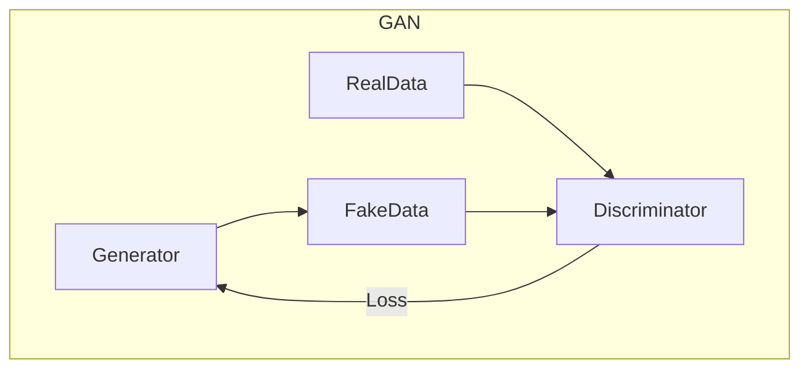

# GAN 生成模型：生成器 (Generator) 原理与代码实例讲解

## 1. 背景介绍

### 1.1 问题的由来

在深度学习领域中,生成模型(Generative Model)是一类广泛应用的模型,旨在从训练数据中学习数据的概率分布,并基于学习到的分布生成新的样本数据。然而,传统的生成模型如隐马尔可夫模型(HMM)、高斯混合模型(GMM)等存在一些局限性,难以处理高维、复杂的数据分布。

为了解决这一问题,2014年,Ian Goodfellow等人在著名论文"Generative Adversarial Networks"中提出了生成对抗网络(Generative Adversarial Networks, GAN)模型。GAN模型的核心思想是将生成过程建模为一个由生成器(Generator)和判别器(Discriminator)组成的对抗过程。

### 1.2 研究现状

自GAN模型提出以来,它在图像生成、语音合成、文本生成等多个领域展现出了巨大的潜力。研究人员不断对GAN模型进行改进和扩展,如DCGAN、CycleGAN、Pix2Pix等,以提高生成质量、稳定训练过程、扩展应用场景等。

然而,GAN模型仍然存在一些挑战,如模式崩溃(Mode Collapse)、训练不稳定、评估指标缺乏等,这些问题都阻碍了GAN模型在实际应用中的广泛部署。

### 1.3 研究意义

深入理解GAN模型中生成器(Generator)的原理及实现细节,对于提高GAN模型的性能、扩展其应用场景至关重要。本文将重点介绍生成器的核心概念、算法原理、数学模型以及代码实现,旨在帮助读者全面掌握GAN生成器的工作机制。

### 1.4 本文结构

本文将分为以下几个部分:

1. 背景介绍
2. 核心概念与联系
3. 核心算法原理与具体操作步骤
4. 数学模型和公式详细讲解与举例说明
5. 项目实践:代码实例和详细解释说明
6. 实际应用场景
7. 工具和资源推荐
8. 总结:未来发展趋势与挑战
9. 附录:常见问题与解答

## 2. 核心概念与联系

在介绍GAN生成器的具体原理之前,我们先来了解一些核心概念及其相互关系。

### 2.1 生成模型与判别模型

生成模型(Generative Model)和判别模型(Discriminative Model)是机器学习中两类不同的模型范式。

- **生成模型**旨在学习数据的联合概率分布$P(X,Y)$,通过建模$P(X|Y)$和$P(Y)$来获得$P(X,Y)$。生成模型可以回答"一个观测样本是如何生成的"这个问题。
- **判别模型**则是直接对条件概率分布$P(Y|X)$进行建模,目标是给定输入$X$预测其输出$Y$。判别模型关注于"如何对观测样本进行分类或回归"。

生成模型和判别模型有不同的应用场景,前者更适合于数据生成、异常检测等,而后者则常用于分类、回归等监督学习任务。

### 2.2 GAN模型框架

GAN模型由两个网络组成:生成器(Generator)和判别器(Discriminator)。

- **生成器(Generator)** 的目标是从一个潜在的随机噪声分布中生成逼真的样本数据,使其尽可能接近真实数据分布。
- **判别器(Discriminator)** 的目标是将真实样本与生成器生成的假样本区分开来。

生成器和判别器相互对抗,生成器希望欺骗判别器,而判别器则努力区分真伪样本。在这个对抗过程中,双方网络都在不断提高自身能力,最终使生成器能够生成高质量的样本。

### 2.3 生成器的作用

在GAN框架中,生成器扮演着至关重要的角色:

1. **数据生成**: 生成器的主要目的是从随机噪声中生成逼真的数据样本,如图像、语音、文本等。
2. **概率建模**: 生成器实际上是在隐式地学习数据的概率分布,使生成的样本符合真实数据分布。
3. **数据增广**: 在数据稀缺的情况下,生成器可用于生成额外的训练数据,增强模型的泛化能力。
4. **数据私密化**: 生成器可用于生成隐私数据的合成版本,保护真实数据的隐私性。

## 3. 核心算法原理与具体操作步骤

### 3.1 算法原理概述

生成器的核心思想是将一个简单的噪声分布(如高斯分布或均匀分布)映射到复杂的数据分布。这通常是通过深度神经网络实现的,网络的输入是一个随机噪声向量$z$,输出是一个生成的数据样本$G(z)$。

在GAN的训练过程中,生成器$G$和判别器$D$相互对抗,形成一个**极小极大游戏(Minimax Game)**:

$$\underset{G}{\operatorname{min}} \, \underset{D}{\operatorname{max}} \, V(D,G) = \mathbb{E}_{x \sim p_{\text{data}}(x)}\big[\log D(x)\big] + \mathbb{E}_{z \sim p_z(z)}\big[\log(1-D(G(z)))\big]$$

其中:

- $G$试图最小化$V(D,G)$,使生成的样本$G(z)$尽可能欺骗判别器$D$,即$D(G(z))$趋近于1。
- $D$试图最大化$V(D,G)$,正确识别真实样本和生成样本,即$D(x)$趋近于1且$D(G(z))$趋近于0。

通过这个对抗过程,生成器将被迫生成越来越逼真的样本,使判别器无法轻易区分真伪。

### 3.2 算法步骤详解

1. **初始化生成器$G$和判别器$D$**

   初始化两个深度神经网络,分别作为生成器和判别器的参数。通常生成器是一个上采样卷积网络,判别器是一个下采样卷积网络。

2. **生成噪声数据**

   从一个简单的噪声分布(如高斯分布或均匀分布)中采样一批随机噪声向量$z$,作为生成器的输入。

3. **生成假样本**

   将噪声向量$z$输入到生成器$G$中,得到一批生成的假样本$G(z)$。

4. **训练判别器**

   将真实样本$x$和生成的假样本$G(z)$输入到判别器$D$中,计算判别器在真实样本上的损失$\log D(x)$和在生成样本上的损失$\log(1-D(G(z)))$,并对判别器的参数进行梯度更新,使其能够更好地区分真伪样本。

5. **训练生成器**

   固定判别器$D$的参数,将噪声向量$z$输入到生成器$G$中,得到生成样本$G(z)$。计算生成器的损失$\log(1-D(G(z)))$,并对生成器的参数进行梯度更新,使其能够生成更加逼真的样本,欺骗判别器。

6. **重复训练**

   重复步骤2-5,直到生成器和判别器达到一个动态平衡,生成的样本质量令人满意为止。

### 3.3 算法优缺点

**优点**:

- 生成质量高:GAN能够生成高质量、逼真的样本数据。
- 概率建模能力强:GAN能够有效地学习数据的隐式概率分布。
- 应用广泛:GAN可应用于图像、语音、文本等多种数据类型的生成任务。

**缺点**:

- 训练不稳定:GAN的训练过程容易出现模式崩溃、梯度消失等问题,训练较为困难。
- 缺乏评估指标:目前还缺乏通用的评估指标来衡量生成样本的质量。
- 模式丢失:生成器可能只学习到数据分布的一部分,忽略了一些模式。

### 3.4 算法应用领域

GAN及其变体模型已被广泛应用于多个领域:

- **图像生成**: 生成逼真的人脸、物体、场景等图像。
- **图像翻译**: 将一种图像风格转换为另一种风格,如将素描图像上色。
- **超分辨率重建**: 从低分辨率图像生成高分辨率图像。
- **语音合成**: 根据文本生成自然语音。
- **文本生成**: 生成逼真的文本内容,如新闻、小说等。
- **数据增广**: 为数据稀缺的任务生成额外的训练数据。

## 4. 数学模型和公式详细讲解与举例说明

### 4.1 数学模型构建

在GAN模型中,生成器$G$和判别器$D$的目标函数可以形式化为:

$$\begin{aligned}
\underset{G}{\operatorname{min}} \, \underset{D}{\operatorname{max}} \, V(D,G) &= \mathbb{E}_{x \sim p_{\text{data}}(x)}\big[\log D(x)\big] + \mathbb{E}_{z \sim p_z(z)}\big[\log(1-D(G(z)))\big] \
&= \int_{x} p_{\text{data}}(x) \log D(x) \, dx + \int_{z} p_z(z) \log(1-D(G(z))) \, dz
\end{aligned}$$

其中:

- $p_{\text{data}}(x)$是真实数据样本$x$的分布。
- $p_z(z)$是随机噪声$z$的分布,通常取高斯分布或均匀分布。
- $G(z)$是生成器网络,将噪声$z$映射到生成的样本$G(z)$。
- $D(x)$和$D(G(z))$分别表示判别器对真实样本和生成样本的判别概率输出。

判别器$D$的目标是最大化$V(D,G)$,即最大化对真实样本的判别概率,最小化对生成样本的判别概率。而生成器$G$的目标是最小化$V(D,G)$,即生成的样本$G(z)$能够最大程度地欺骗判别器。

通过交替优化生成器和判别器的参数,最终达到一个**纳什均衡(Nash Equilibrium)**,此时生成器生成的样本分布$p_g$与真实数据分布$p_{\text{data}}$完全一致,判别器无法区分真伪。

### 4.2 公式推导过程

我们可以通过一些数学推导,更好地理解GAN目标函数的含义。

首先,根据**Jensen不等式**,对任意凸函数$f$和分布$P$,有:

$$\mathbb{E}_{x \sim P}[f(x)] \geq f(\mathbb{E}_{x \sim P}[x])$$

将$f(x) = -\log x$代入,可得:

$$\mathbb{E}_{x \sim P}[-\log x] \geq -\log \mathbb{E}_{x \sim P}[x]$$

由于$\mathbb{E}_{x \sim P}[x] \leq 1$,所以:

$$\mathbb{E}_{x \sim P}[-\log x] \geq -\log \mathbb{E}_{x \sim P}[x] \geq 0$$

其中等号成立当且仅当$x$为常数时。

将上式代入GAN目标函数,可得:

$$\begin{aligned}
V(D,G) &= \mathbb{E}_{x \sim p_{\text{data}}(x)}\big[\log D(x)\big] + \mathbb{E}_{z \sim p_z(z)}\big[\log(1-D(G(z)))\big] \
&= \mathbb{E}_{x \sim p_{\text{data}}(x)}\big[-\log \frac{1}{D(x)}\big] + \mathbb{E}_{z \sim p_z(z)}\big[-\log(1-D(G(z)))\big] \
&\geq -\log \mathbb{E}_{x \sim p_{\text{data}}(x)}\big[\frac{1}{D(x)}\big] - \log(1-\mathbb{E}_{z \sim p_z(z)}[D(G(