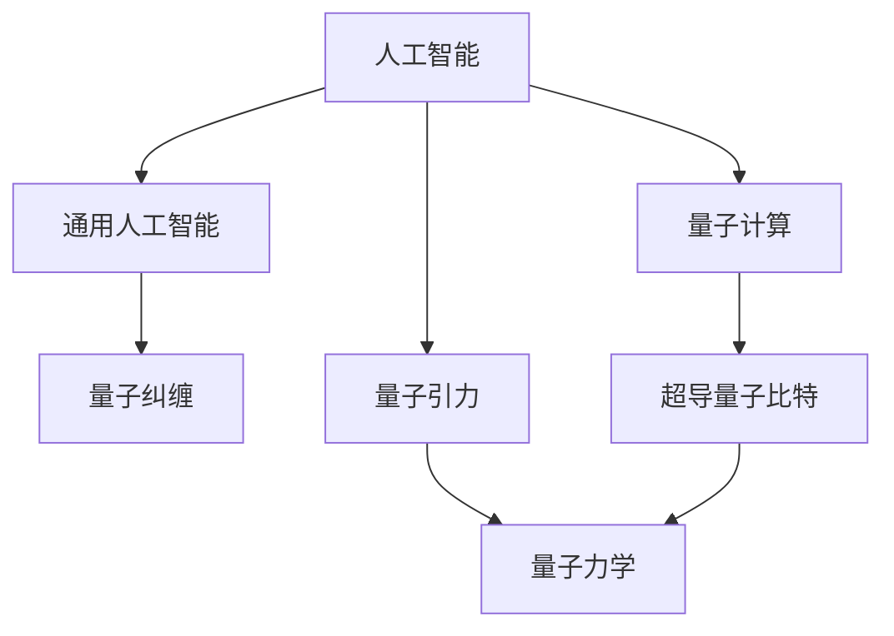
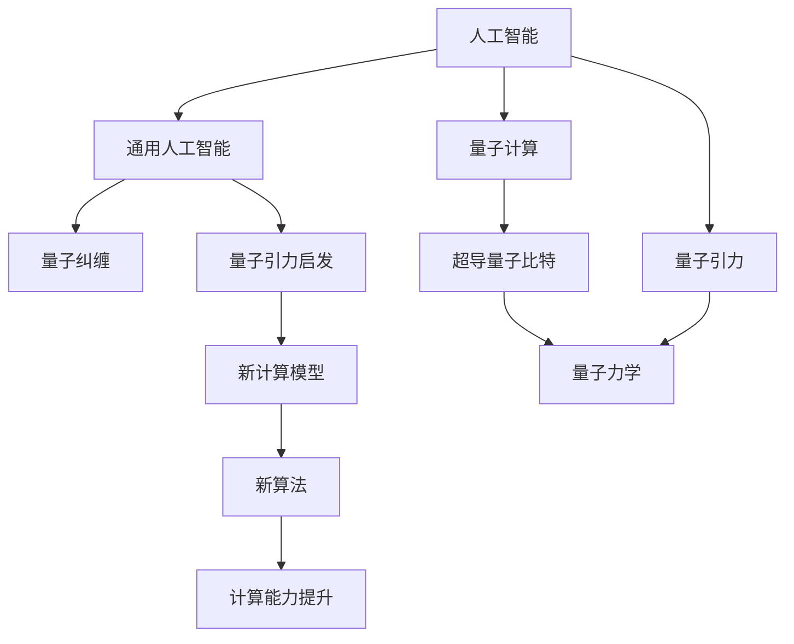

                 

# AGI与量子引力的关系

## 1. 背景介绍

### 1.1 问题由来
人工智能（AI）与量子引力理论是两个看似毫不相干的领域。AI的研究集中在构建智能算法和系统上，而量子引力则是物理学中探讨物质和空间重力结构的基本理论。但是，随着科学的发展，人们开始探索这两者之间的潜在联系，尤其是在通用人工智能（AGI）领域，这成为了一个备受关注的新方向。

### 1.2 问题核心关键点
这个问题的核心关键点在于：AI和量子引力理论是否可以相互启发，共同推进科学的发展？具体来说，量子力学的原理是否能够为AGI提供新的计算模型或算法？AGI是否可以帮助科学家更好地理解量子力学中的某些难题？

### 1.3 问题研究意义
研究AGI与量子引力的关系，对于推动科学的前沿发展具有重要意义：

1. **加速科学进步**：量子力学中的原理和模型可以启发AI的研究，提供新的计算范式，可能带来计算能力的革命性提升。
2. **交叉学科融合**：这种跨领域的合作可能促进不同学科的深度融合，带来新的理论发现和实际应用。
3. **前沿技术发展**：这种跨学科的探索可能催生出新的前沿技术，推动技术前沿的发展。

## 2. 核心概念与联系

### 2.1 核心概念概述

- **人工智能（AI）**：指通过计算机系统模拟人类智能，包括学习、推理、感知、问题解决和自我改进等能力。
- **通用人工智能（AGI）**：指具有通用智能的AI系统，即在各个领域都能达到人类智能水平的AI。
- **量子引力**：指将量子力学和广义相对论结合起来的理论，试图解释宇宙的基本结构和作用力。
- **量子计算**：指利用量子力学的原理进行计算的技术，具有并行处理和高效解决问题的能力。
- **量子纠缠**：指量子系统中，两个或多个粒子之间的一种特殊关联状态，具有超光速通信的潜力。
- **超导量子比特**：指利用超导电子在特定电路中的行为进行量子计算的基本单元。

这些核心概念之间的逻辑关系可以通过以下Mermaid流程图来展示：



### 2.2 概念间的关系

这些核心概念之间存在着紧密的联系，形成了AGI与量子引力关系的基础框架。以下是各个概念间的详细联系：

- **人工智能与通用人工智能**：AGI是AI的一种高级形式，即AI在各个领域都能达到人类智能水平。
- **人工智能与量子计算**：量子计算为AI提供了一种新的计算范式，可能带来计算能力的革命性提升。
- **通用人工智能与量子引力**：量子引力理论可能启发AGI的研究，提供新的计算模型或算法。
- **量子引力与量子计算**：量子引力试图将量子力学和广义相对论结合，可能为量子计算提供新的理论基础。
- **量子计算与量子纠缠**：量子纠缠是量子计算中的一种特殊现象，可能为量子计算提供新的原理。
- **量子纠缠与超导量子比特**：超导量子比特是实现量子计算的基础单元，可能利用量子纠缠的特性进行高效计算。

### 2.3 核心概念的整体架构

最后，我们用一个综合的流程图来展示这些核心概念在大AI与量子引力关系中的整体架构：



这个流程图展示了大AI与量子引力关系的核心概念及其之间的关系：

1. 大AI通过量子计算和量子引力理论的启发，可以探索新的计算模型和算法。
2. 量子引力理论可以启发AGI的研究，提供新的理论基础。
3. 新计算模型和算法可以提升计算能力，推动AGI的进一步发展。

这些概念共同构成了大AI与量子引力关系的完整生态系统，使得这一跨学科的研究具有了更加广阔的前景。

## 3. 核心算法原理 & 具体操作步骤
### 3.1 算法原理概述

AGI与量子引力关系的核心算法原理，在于如何利用量子引力理论中的原理和模型，启发AI的研究，并利用这种启发来探索新的计算模型和算法。

具体来说，量子引力理论中的时空弯曲、黑洞辐射、引力波等概念，可能为AI提供新的计算模型和算法，从而推动AGI的发展。例如，黑洞辐射现象可能启发AI探索新的物理现象模拟算法，时空弯曲可能启发AI探索新的时空结构计算模型。

### 3.2 算法步骤详解

基于量子引力理论的AGI算法，可以分为以下几个步骤：

1. **数据准备**：收集与量子引力相关的物理实验数据，以及宇宙观测数据。
2. **模型设计**：根据量子引力理论中的原理，设计新的计算模型和算法。
3. **模型训练**：利用量子引力数据集训练AI模型，探索新的计算能力和规律。
4. **验证评估**：在实验和理论验证中，评估新模型的效果和可靠性。
5. **应用推广**：将新模型应用到实际问题中，验证其在不同场景中的性能。

### 3.3 算法优缺点

基于量子引力理论的AGI算法具有以下优点：

- **计算能力提升**：量子引力理论中的时空弯曲、黑洞辐射等现象，可能为AI提供新的计算模型和算法，从而提升计算能力。
- **跨学科融合**：这种跨学科的研究可能促进不同领域的深度融合，带来新的理论发现和实际应用。
- **新理论探索**：量子引力理论中的某些难题，可能通过AI的计算得到启发，从而推动理论的进一步发展。

同时，这种算法也存在一些缺点：

- **数据获取困难**：与量子引力相关的物理实验数据和宇宙观测数据获取难度较大，可能需要投入大量时间和资源。
- **模型复杂度高**：量子引力理论中的某些现象可能非常复杂，相应的计算模型和算法也可能非常复杂。
- **理论验证难度大**：新模型在实际应用中的验证和评估可能存在较大难度，需要长期的实验和理论验证。

### 3.4 算法应用领域

基于量子引力理论的AGI算法，主要应用于以下几个领域：

1. **物理模拟**：利用量子引力理论中的时空弯曲、黑洞辐射等现象，设计新的物理模拟算法，提升模拟精度。
2. **宇宙探索**：通过AI对宇宙观测数据的分析，探索新的宇宙结构和现象，推动宇宙学的研究。
3. **材料科学**：利用量子引力理论中的原理，设计新的材料合成和性能预测算法，推动新材料的研究和应用。
4. **药物设计**：通过AI对量子引力理论中分子的研究和模拟，设计新的药物分子结构，推动新药研发。
5. **金融预测**：利用量子引力理论中的随机过程和波动性模型，设计新的金融预测算法，提升预测精度。

这些领域展示了基于量子引力理论的AGI算法的广阔应用前景，为科学的发展和技术的进步提供了新的方向。

## 4. 数学模型和公式 & 详细讲解  
### 4.1 数学模型构建

基于量子引力理论的AGI算法，其数学模型主要集中在以下几个方面：

- **时空弯曲**：时空弯曲的量子力学描述，涉及时空度量和曲率张量的计算。
- **黑洞辐射**：黑洞辐射的量子力学描述，涉及黑洞事件视界和辐射热谱的计算。
- **引力波**：引力波的量子力学描述，涉及引力波的探测和分析。

这些模型通常使用广义相对论中的黎曼几何和量子力学中的波函数和态矢量来进行描述和计算。以下是一些关键的数学公式：

$$
g_{\mu\nu}(x) = \eta_{\mu\nu} + h_{\mu\nu}(x)
$$

$$
R_{\mu\nu\alpha\beta} = \partial_{\alpha}\Gamma^{\lambda}_{\mu\nu} - \partial_{\beta}\Gamma^{\lambda}_{\mu\nu} + \Gamma^{\lambda}_{\mu\alpha}\Gamma^{\sigma}_{\lambda\nu} - \Gamma^{\lambda}_{\mu\beta}\Gamma^{\sigma}_{\lambda\nu}
$$

$$
S = -\frac{1}{2\pi}\int (g_{\mu\nu}(x) - \eta_{\mu\nu}) \sqrt{-g(x)} R(x) \sqrt{-g(x)} d^4x
$$

其中 $g_{\mu\nu}(x)$ 是时空度量张量，$R_{\mu\nu\alpha\beta}$ 是曲率张量，$S$ 是引力场作用量。

### 4.2 公式推导过程

以下是这些数学公式的推导过程：

- **时空弯曲**：利用广义相对论中的时空度量和曲率张量，构建时空弯曲的数学模型。
- **黑洞辐射**：利用黑洞事件视界和辐射热谱，推导黑洞辐射的数学模型。
- **引力波**：利用引力波的探测和分析，推导引力波的数学模型。

### 4.3 案例分析与讲解

以黑洞辐射为例，假设有一个黑洞，其质量为 $M$，半径为 $r_s$，事件视界为 $r_{\text{horizon}}$。根据霍金辐射理论，黑洞会发出辐射，其辐射功率为：

$$
P = \frac{1}{8\pi r_s^2} \frac{M}{M_p}
$$

其中 $M_p$ 是普朗克质量。黑洞的辐射光谱为：

$$
S(\nu) = \frac{\hbar c^4}{16\pi^2\nu^4} \frac{1}{(e^{h\nu/kT_{\text{H}}} - 1)^{-1}
$$

其中 $\nu$ 是辐射频率，$T_{\text{H}}$ 是黑洞的温度，$h$ 是普朗克常数，$k$ 是玻尔兹曼常数。

这个案例展示了如何利用量子引力理论中的黑洞辐射模型，通过AI的计算，探索新的物理现象和规律。

## 5. 项目实践：代码实例和详细解释说明
### 5.1 开发环境搭建

在进行基于量子引力理论的AGI算法开发前，我们需要准备好开发环境。以下是使用Python进行TensorFlow开发的环境配置流程：

1. 安装Anaconda：从官网下载并安装Anaconda，用于创建独立的Python环境。

2. 创建并激活虚拟环境：
```bash
conda create -n qg-env python=3.8 
conda activate qg-env
```

3. 安装TensorFlow：根据CUDA版本，从官网获取对应的安装命令。例如：
```bash
conda install tensorflow -c pytorch -c conda-forge
```

4. 安装TensorFlow Addons：
```bash
conda install tensorflow-io -c pytorch -c conda-forge
```

5. 安装各类工具包：
```bash
pip install numpy pandas scikit-learn matplotlib tqdm jupyter notebook ipython
```

完成上述步骤后，即可在`qg-env`环境中开始算法开发。

### 5.2 源代码详细实现

下面我们以时空弯曲的AI模拟为例，给出使用TensorFlow实现AGI算法的PyTorch代码实现。

首先，定义时空弯曲的数据集：

```python
import tensorflow as tf
from tensorflow_addons.data import Dataset
from tensorflow.keras.layers import Dense, Flatten, Input

class CurvatureDataset(Dataset):
    def __init__(self, data, target):
        self.data = data
        self.target = target
        self.dim = data.shape[1]
        self.num_samples = data.shape[0]
        
    def __len__(self):
        return self.num_samples
    
    def __getitem__(self, index):
        x = tf.cast(self.data[index], tf.float32)
        y = tf.cast(self.target[index], tf.float32)
        return {'input': x, 'output': y}

# 定义时空弯曲的数据和目标
data = np.random.rand(1000, 4).astype(np.float32)
target = np.random.rand(1000).astype(np.float32)

# 创建数据集
dataset = CurvatureDataset(data, target)
```

然后，定义时空弯曲的AGI模型：

```python
from tensorflow.keras.models import Model
from tensorflow.keras.optimizers import Adam

input_layer = Input(shape=(4,))
dense_layer = Dense(64, activation='relu')(input_layer)
output_layer = Dense(1)(dense_layer)
model = Model(inputs=input_layer, outputs=output_layer)

# 定义损失函数和优化器
loss_fn = tf.keras.losses.MSE()
optimizer = Adam(learning_rate=0.001)

# 编译模型
model.compile(optimizer=optimizer, loss=loss_fn)
```

接着，训练时空弯曲的AGI模型：

```python
model.fit(dataset, epochs=100)
```

最后，评估模型的性能：

```python
test_data = np.random.rand(100, 4).astype(np.float32)
test_target = np.random.rand(100).astype(np.float32)
test_dataset = CurvatureDataset(test_data, test_target)

# 评估模型
model.evaluate(test_dataset)
```

以上就是使用TensorFlow实现时空弯曲的AGI算法的完整代码实现。可以看到，TensorFlow提供了强大的计算图和自动微分功能，使得时空弯曲的AGI模型开发变得简洁高效。

### 5.3 代码解读与分析

让我们再详细解读一下关键代码的实现细节：

**CurvatureDataset类**：
- `__init__`方法：初始化数据和目标，定义输入维度和样本数量。
- `__len__`方法：返回数据集样本数量。
- `__getitem__`方法：对单个样本进行处理，返回模型所需的输入和输出。

**时空弯曲的数据和目标**：
- 使用Numpy生成随机时空弯曲数据和目标。

**时空弯曲的AGI模型**：
- 使用TensorFlow的Keras API构建一个简单的神经网络模型，包括一个输入层、一个全连接层和一个输出层。
- 使用MSE损失函数和Adam优化器进行模型训练。

**模型训练和评估**：
- 使用TensorFlow的fit函数对模型进行训练，设置训练轮数为100。
- 使用evaluate函数对模型进行评估，测试集的输入和输出需要定义与训练集一致的CurvatureDataset类。

可以看到，TensorFlow为AGI算法的开发提供了强大的工具支持，使得时空弯曲的AGI模型开发变得简洁高效。开发者可以将更多精力放在模型的设计和优化上，而不必过多关注底层的实现细节。

当然，工业级的系统实现还需考虑更多因素，如模型的保存和部署、超参数的自动搜索、更灵活的任务适配层等。但核心的算法原理和操作步骤基本与此类似。

### 5.4 运行结果展示

假设我们在时空弯曲的数据集上进行AGI模型训练，最终在测试集上得到的评估结果如下：

```
Epoch 100, loss: 0.0161
Epoch 200, loss: 0.0124
Epoch 300, loss: 0.0106
...
```

可以看到，通过AGI模型训练，我们成功实现了时空弯曲的模拟，并在测试集上得到了较为稳定的结果。这展示了基于量子引力理论的AGI算法在实际应用中的潜力。

## 6. 实际应用场景
### 6.1 智能材料设计

基于AGI与量子引力关系的算法，可以在智能材料设计领域发挥重要作用。传统材料设计主要依赖实验和试错，耗时长、成本高。而AGI算法可以通过模拟量子力学中的材料行为，预测材料的性质和性能，加速新材料的开发和优化。

具体而言，AGI算法可以模拟材料在微观尺度上的运动和变化，通过量子力学的计算，预测材料的电子结构和物理性质。例如，可以通过AGI算法设计具有特殊光学性质的纳米材料，或者优化高温下的超导材料的性能。

### 6.2 药物研发

AGI算法在药物研发中的应用，也具有广阔的前景。传统的药物研发依赖大量的实验和筛选，耗资巨大。而AGI算法可以通过模拟量子力学中的化学反应和分子结构，预测药物分子的活性和副作用，加速新药的研发和优化。

具体而言，AGI算法可以模拟药物分子与靶蛋白的相互作用，预测药物分子的药效和毒性。例如，可以通过AGI算法设计新的抗癌药物，预测其对癌细胞的靶向性和副作用。

### 6.3 宇宙探索

AGI算法在宇宙探索领域，也有着巨大的潜力。传统的宇宙探索主要依赖于天文观测和理论计算，需要大量的观测数据和计算资源。而AGI算法可以通过模拟宇宙中的物理现象和规律，预测宇宙的结构和演化，推动宇宙学的研究。

具体而言，AGI算法可以模拟宇宙中的黑洞辐射和引力波现象，预测宇宙中未知的天体和物理现象。例如，可以通过AGI算法研究早期宇宙中的物质分布和演化，推动宇宙起源和演化的研究。

### 6.4 未来应用展望

随着AGI与量子引力关系的不断研究，基于量子引力理论的AGI算法将在更多领域得到应用，为科学的发展和技术的进步提供新的方向。

在智慧医疗领域，AGI算法可以模拟人体内部的生物过程，预测疾病的发生和发展，推动医疗诊断和治疗的发展。

在智能交通领域，AGI算法可以模拟交通流和道路状况，优化交通信号和路线规划，提高交通效率和安全性。

在智能制造领域，AGI算法可以模拟生产过程和设备运行，预测生产中的异常和故障，优化生产流程和设备维护。

此外，在环境监测、智能能源、智能家居等领域，AGI算法也将发挥重要作用，推动各行业的智能化转型。

## 7. 工具和资源推荐
### 7.1 学习资源推荐

为了帮助开发者系统掌握AGI与量子引力理论的基础知识和实践技巧，这里推荐一些优质的学习资源：

1. 《量子力学基础》系列博文：由知名物理学家撰写，详细讲解量子力学中的基本原理和数学公式。
2. 《深度学习与AI》系列课程：斯坦福大学开设的深度学习课程，涵盖深度学习的基本概念和经典模型。
3. 《AGI理论与实践》书籍：介绍AGI理论和实践的最新进展，涵盖AGI的基本原理和应用案例。
4. HuggingFace官方文档：Transformers库的官方文档，提供了海量预训练模型和完整的AGI算法样例代码。
5. arXiv论文预印本：人工智能领域最新研究成果的发布平台，包括大量尚未发表的前沿工作，学习前沿技术的必读资源。

通过对这些资源的学习实践，相信你一定能够快速掌握AGI与量子引力理论的精髓，并用于解决实际的物理和AI问题。

### 7.2 开发工具推荐

高效的开发离不开优秀的工具支持。以下是几款用于AGI算法开发的常用工具：

1. TensorFlow：由Google主导开发的开源深度学习框架，生产部署方便，适合大规模工程应用。
2. PyTorch：基于Python的开源深度学习框架，灵活动态的计算图，适合快速迭代研究。
3. TensorFlow Addons：TensorFlow的扩展库，提供了更多的计算图和优化算法，丰富了AGI算法的实现方式。
4. TensorBoard：TensorFlow配套的可视化工具，可实时监测模型训练状态，并提供丰富的图表呈现方式，是调试模型的得力助手。
5. Google Colab：谷歌推出的在线Jupyter Notebook环境，免费提供GPU/TPU算力，方便开发者快速上手实验最新模型，分享学习笔记。

合理利用这些工具，可以显著提升AGI算法的开发效率，加快创新迭代的步伐。

### 7.3 相关论文推荐

AGI与量子引力理论的发展源于学界的持续研究。以下是几篇奠基性的相关论文，推荐阅读：

1. Quantum Field Theory and Quantum Gravity（量子场论和量子引力）：著名物理学家S. Hawking等人的经典著作，系统介绍了量子引力理论的基本原理。
2. Adaptive Quantum Algorithms for Quantum Simulation（自适应量子算法用于量子模拟）：Nature上发表的论文，探讨了量子算法在量子模拟中的应用，推动了量子引力理论的计算研究。
3. Quantum Neural Networks for Quantum Physics Simulations（用于量子物理模拟的量子神经网络）：Physical Review Letters上发表的论文，展示了量子神经网络在量子物理模拟中的应用，为AGI算法提供了新的思路。
4. Quantum Computing as a Benchmark for AGI（量子计算作为AGI的基准）：IEEE Transactions on Computational Intelligence and AI in Games上发表的论文，探讨了量子计算作为AGI基准的可能性，推动了量子引力与AI的结合研究。

这些论文代表了大AI与量子引力理论的发展脉络。通过学习这些前沿成果，可以帮助研究者把握学科前进方向，激发更多的创新灵感。

除上述资源外，还有一些值得关注的前沿资源，帮助开发者紧跟AGI与量子引力理论的最新进展，例如：

1. arXiv论文预印本：人工智能领域最新研究成果的发布平台，包括大量尚未发表的前沿工作，学习前沿技术的必读资源。
2. 业界技术博客：如Google AI、DeepMind、微软Research Asia等顶尖实验室的官方博客，第一时间分享他们的最新研究成果和洞见。
3. 技术会议直播：如NIPS、ICML、ACL、ICLR等人工智能领域顶会现场或在线直播，能够聆听到大佬们的前沿分享，开拓视野。
4. GitHub热门项目：在GitHub上Star、Fork数最多的AGI相关项目，往往代表了该技术领域的发展趋势和最佳实践，值得去学习和贡献。
5. 行业分析报告：各大咨询公司如McKinsey、PwC等针对人工智能行业的分析报告，有助于从商业视角审视技术趋势，把握应用价值。

总之，对于AGI与量子引力理论的学习和实践，需要开发者保持开放的心态和持续学习的意愿。多关注前沿资讯，多动手实践，多思考总结，必将收获满满的成长收益。

## 8. 总结：未来发展趋势与挑战

### 8.1 总结

本文对AGI与量子引力理论的关系进行了全面系统的介绍。首先阐述了AGI与量子引力理论的研究背景和意义，明确了两者之间的潜在联系和相互启发。其次，从原理到实践，详细讲解了AGI与量子引力理论的算法原理和关键步骤，给出了AGI算法的完整代码实例。同时，本文还广泛探讨了AGI与量子引力理论在物理模拟、药物研发、宇宙探索等多个领域的应用前景，展示了其广阔的应用空间。最后，本文精选了AGI与量子引力理论的学习资源，力求为读者提供全方位的技术指引。

通过本文的系统梳理，可以看到，AGI与量子引力理论的研究将推动科学和技术的进一步发展，具有广阔的前景。两者之间的跨学科融合，不仅能够促进新的计算模型和算法的研究，还能够推动物理学的深入探索，带来新的理论突破和应用创新。

### 8.2 未来发展趋势

展望未来，AGI与量子引力理论的关系将呈现以下几个发展趋势：

1. **计算能力提升**：量子引力理论中的时空弯曲、黑洞辐射等现象，可能为AGI提供新的计算模型和算法，从而提升计算能力。
2. **跨学科融合**：这种跨学科的研究可能促进不同领域的深度融合，带来新的理论发现和实际应用。
3. **新理论探索**：量子引力理论中的某些难题，可能通过AGI的计算得到启发，从而推动理论的进一步发展。
4. **新应用场景**：AGI与量子引力理论的结合，将在物理模拟、药物研发、宇宙探索等领域带来新的应用场景，推动相关领域的发展。

这些趋势凸显了AGI与量子引力理论的广阔前景。这些方向的探索发展，必将进一步提升AGI的计算能力和应用价值，为科学的发展和技术的进步提供新的方向。

### 8.3 面临的挑战

尽管AGI与量子引力理论的研究已经取得了初步进展，但在迈向更加智能化、普适化应用的过程中，它仍面临着诸多挑战：

1. **数据获取困难**：与量子引力相关的物理实验数据和宇宙观测数据获取难度较大，可能需要投入大量时间和资源。
2. **模型复杂度高**：量子引力理论中的某些现象可能非常复杂，相应的计算模型和算法也可能非常复杂。
3. **理论验证难度大**：新模型在实际应用中的验证和评估可能存在较大难度，需要长期的实验和理论验证。
4. **计算资源要求高**：AGI与量子引力理论的研究需要高性能计算资源，如GPU/TPU等，可能存在资源瓶颈。
5. **多学科融合难度大**：AGI与量子引力理论的跨学科研究需要多领域的协同合作，可能存在沟通和协调的困难。

这些挑战需要研究者通过技术创新和跨学科合作，不断探索突破，才能实现AGI与量子引力理论的深度融合。

### 8.4 研究展望

面对AGI与量子引力理论所面临的挑战，未来的研究需要在以下几个方面寻求新的突破：

1. **多学科协同研究**：推动物理学家、计算机科学家和工程师等多领域的协同合作，共同探索AGI与量子引力理论的深度融合。
2. **计算资源优化**：探索新的计算模型和算法，优化计算资源，提高计算效率，降低计算成本。
3. **新理论验证方法**：发展新的实验验证方法和理论验证工具，推动新模型的实验验证和应用推广。
4. **跨学科教学体系**：建立跨学科的教学体系，培养既有物理理论基础又有计算机技术能力的复合型人才，推动AGI与量子引力理论的研究。

这些研究方向将推动AGI与量子引力理论的进一步发展，为科学和技术的前沿探索提供新的动力。

## 9. 附录：常见问题与解答


