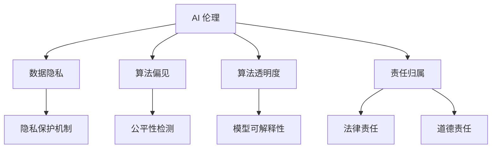
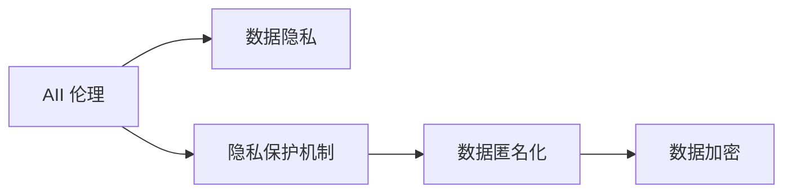
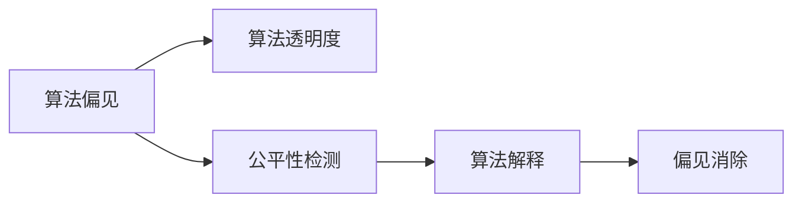
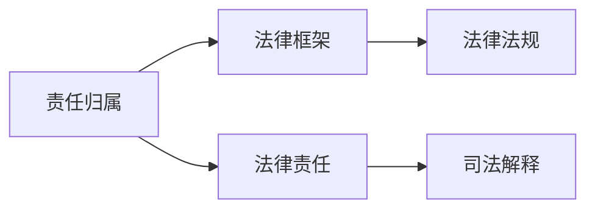
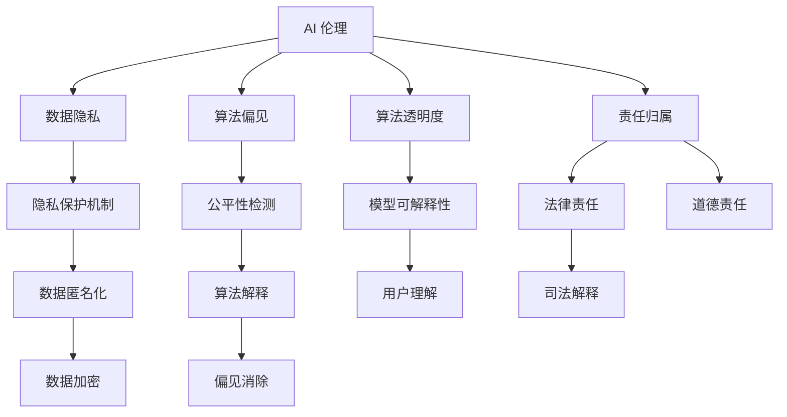

                 

# AI 2.0 基础设施建设：伦理和社会责任

## 1. 背景介绍

### 1.1 问题由来
随着人工智能技术的迅猛发展，AI 2.0 时代的到来已经是大势所趋。AI 2.0 不仅标志着从大数据、算力驱动的 AI 1.0 阶段，迈向基于知识、数据与算力协同的智能系统，更意味着 AI 技术的普及和应用将对社会产生深远影响。然而，随着 AI 技术的广泛应用，伦理和社会责任问题也随之浮现。特别是在医疗、教育、金融等领域，AI 应用引发的一系列社会问题亟待解决。

### 1.2 问题核心关键点
AI 2.0 时代的伦理和社会责任问题主要集中在以下几个方面：

- **数据隐私与安全**：在数据驱动的 AI 系统中，用户数据的收集、存储和处理可能涉及隐私泄露和安全风险。
- **算法偏见与公平性**：AI 系统可能会因训练数据中存在的偏见，导致输出结果的不公平或歧视。
- **透明度与可解释性**：AI 模型的决策过程通常黑箱化，难以解释其决策依据。
- **责任归属**：当 AI 系统在应用中出现问题，责任应由谁承担？
- **伦理标准与法律框架**：AI 技术的应用需要遵循哪些伦理标准，法律如何监管和保护？

这些问题不仅影响 AI 系统的实际应用效果，更关乎社会的公正、公平与和谐。因此，在 AI 2.0 基础设施建设中，如何构建伦理和社会责任机制，确保 AI 技术的健康发展，成为一个亟待解决的重要课题。

### 1.3 问题研究意义
构建 AI 2.0 基础设施的伦理和社会责任机制，具有以下重要意义：

1. **保障用户权益**：保护用户数据隐私和安全，避免因 AI 应用引发的隐私泄露和数据滥用。
2. **提升社会公平**：确保 AI 系统的决策透明和公平，避免因算法偏见导致的歧视和不公。
3. **增强社会信任**：通过透明和可解释的 AI 系统，提升公众对 AI 技术的接受度和信任度。
4. **明确责任归属**：在 AI 应用中出现的问题，明确责任主体，确保责任追究和问责机制的健全。
5. **推动法律和伦理框架建设**：为 AI 技术的应用提供清晰的法律和伦理标准，避免法律空白和伦理争议。

通过构建伦理和社会责任机制，不仅能促进 AI 技术的健康发展，更能为 AI 技术在社会各领域的广泛应用提供保障，从而推动 AI 2.0 时代的到来。

## 2. 核心概念与联系

### 2.1 核心概念概述

为更好地理解 AI 2.0 基础设施建设中的伦理和社会责任问题，本节将介绍几个密切相关的核心概念：

- **AI 伦理**：指导 AI 技术应用的伦理原则和规范，旨在确保技术的应用不会造成伦理问题。
- **数据隐私**：指在数据收集、存储、处理和共享过程中，保障个人隐私不被侵犯的权利。
- **算法偏见**：指 AI 系统因训练数据或模型设计不当，导致输出结果中存在歧视或不公平现象。
- **算法透明度**：指 AI 系统决策过程的公开性和可理解性，使用户能够理解系统如何做出决策。
- **责任归属**：指 AI 系统在应用中出现问题的责任归属问题，包括法律责任、道德责任等。

这些核心概念之间的逻辑关系可以通过以下 Mermaid 流程图来展示：



这个流程图展示了几大核心概念之间的关系：

1. AI 伦理是构建 AI 系统的基础，指导数据隐私、算法偏见、算法透明度和责任归属等各个环节。
2. 数据隐私和算法偏见是 AI 伦理的重要组成部分，确保数据处理和算法设计不侵犯个人隐私和造成不公平。
3. 算法透明度和责任归属是 AI 伦理在应用层面的体现，确保用户理解和接受 AI 系统的决策，明确责任主体。

### 2.2 概念间的关系

这些核心概念之间存在着紧密的联系，形成了 AI 2.0 基础设施建设中的伦理和社会责任生态系统。下面我通过几个 Mermaid 流程图来展示这些概念之间的关系。

#### 2.2.1 AI 伦理与数据隐私的关系



这个流程图展示了 AI 伦理在数据隐私保护中的应用，主要通过隐私保护机制、数据匿名化和数据加密等技术，保障数据隐私安全。

#### 2.2.2 算法偏见与算法透明度的关系



这个流程图展示了算法偏见与算法透明度之间的关系。通过公平性检测和算法解释等技术，确保算法透明，消除偏见。

#### 2.2.3 责任归属与法律框架的关系



这个流程图展示了责任归属与法律框架之间的关系。通过法律责任和司法解释等机制，确保责任归属有法可依。

### 2.3 核心概念的整体架构

最后，我们用一个综合的流程图来展示这些核心概念在 AI 2.0 基础设施建设中的整体架构：



这个综合流程图展示了从 AI 伦理到数据隐私、算法偏见、算法透明度和责任归属等各个环节，以及它们之间的关系。

## 3. 核心算法原理 & 具体操作步骤
### 3.1 算法原理概述

构建 AI 2.0 基础设施的伦理和社会责任机制，本质上是基于监督学习和迁移学习范式，通过一系列的算法和技术手段，确保 AI 系统的公平性、透明性和可解释性。具体步骤如下：

**Step 1: 数据准备与隐私保护**
- 收集标注数据，并进行数据预处理，如去重、归一化等。
- 应用数据隐私保护技术，如数据匿名化、加密、差分隐私等，确保数据在存储和处理过程中不被滥用。

**Step 2: 模型训练与算法偏见检测**
- 使用监督学习算法，训练 AI 模型。
- 应用公平性检测技术，如 Equalized Odds、Demographic Parity 等，检测和纠正模型中的算法偏见。

**Step 3: 模型透明性与可解释性**
- 使用可解释性技术，如 LIME、SHAP 等，生成模型决策的可视化解释。
- 设计透明的模型架构，如基于规则的模型，增强模型的可理解性。

**Step 4: 责任归属与风险评估**
- 应用风险评估技术，如信任评估、责任图等，评估 AI 系统对用户权益的影响。
- 制定责任归属机制，明确 AI 系统的法律和道德责任。

### 3.2 算法步骤详解

在实际应用中，需要根据具体场景和需求，选择和组合以上算法和技术。以下是具体的步骤详解：

**Step 1: 数据准备与隐私保护**
1. 数据收集：通过爬虫、API、传感器等方式收集数据。
2. 数据预处理：清洗、归一化、标注等数据预处理操作。
3. 隐私保护：应用隐私保护技术，确保数据匿名化和加密。

**Step 2: 模型训练与算法偏见检测**
1. 模型选择：选择适合任务的监督学习模型，如线性回归、决策树、神经网络等。
2. 训练数据：使用标注数据训练模型。
3. 偏见检测：应用偏见检测技术，如 Equalized Odds、Demographic Parity 等，检测模型中的偏见。
4. 偏见纠正：根据检测结果，修正训练数据或调整模型参数，消除算法偏见。

**Step 3: 模型透明性与可解释性**
1. 模型可解释性：使用可解释性技术，生成模型的可视化解释。
2. 设计透明模型：设计基于规则的模型，增强模型的可理解性。

**Step 4: 责任归属与风险评估**
1. 风险评估：应用信任评估和责任图等技术，评估 AI 系统对用户权益的影响。
2. 责任归属：制定责任归属机制，明确 AI 系统的法律和道德责任。

### 3.3 算法优缺点

基于监督学习和迁移学习的伦理和社会责任机制，具有以下优缺点：

**优点**：
1. 简单高效：监督学习和迁移学习具有较低的算法复杂度和实现难度，适合在各种应用场景中快速部署。
2. 效果显著：通过偏见检测和可解释性技术，显著提升 AI 系统的公平性和透明性。
3. 适应性强：适用于各种任务和数据集，具有良好的泛化能力。

**缺点**：
1. 依赖数据：算法的效果高度依赖于标注数据的质量，数据不足可能导致模型性能下降。
2. 模型复杂：尽管监督学习和迁移学习实现简单，但其背后的模型复杂性较高，难以调试和优化。
3. 法律挑战：在责任归属和法律框架方面，仍需进一步完善和规范。

### 3.4 算法应用领域

基于监督学习和迁移学习的伦理和社会责任机制，在多个领域中得到了广泛应用，例如：

- **医疗健康**：使用 AI 系统进行疾病诊断和治疗建议，确保数据隐私和模型公平。
- **金融服务**：使用 AI 系统进行信用评估和风险管理，确保模型透明和责任归属。
- **教育培训**：使用 AI 系统进行个性化学习和智能辅导，确保公平和可解释性。
- **智能交通**：使用 AI 系统进行交通流量预测和交通管理，确保数据隐私和责任归属。

除了上述这些领域，AI 2.0 基础设施建设中的伦理和社会责任机制，还在智能制造、智慧城市、智能家居等多个领域发挥着重要作用。

## 4. 数学模型和公式 & 详细讲解 & 举例说明

### 4.1 数学模型构建

在构建 AI 2.0 基础设施的伦理和社会责任机制中，需要使用多个数学模型和公式进行计算和分析。以下是一个基本的框架：

1. **数据隐私模型**：使用差分隐私（Differential Privacy）模型，确保数据在处理过程中不泄露用户隐私。
2. **算法偏见检测模型**：使用公平性检测模型，如 Equalized Odds、Demographic Parity 等，检测和纠正算法偏见。
3. **模型透明性模型**：使用可解释性模型，如 LIME、SHAP 等，生成模型决策的可视化解释。
4. **责任归属模型**：使用责任图（Responsibility Diagram）等模型，评估 AI 系统对用户权益的影响，明确责任归属。

### 4.2 公式推导过程

以下以差分隐私模型为例，展示其公式推导过程。

差分隐私（Differential Privacy）是一种保障数据隐私的技术，其核心思想是在数据处理过程中加入噪声，使得攻击者无法从处理结果中推测出具体个体的信息。差分隐私的数学定义如下：

设 $D$ 为数据集，$M$ 为处理后的结果，$f$ 为处理函数，$\epsilon$ 为隐私参数。差分隐私满足以下条件：

$$
\forall x \in D, \forall S \subseteq M: Pr(f(D) \in S) \leq e^{-\epsilon} Pr(f(D') \in S) + \frac{\delta}{2}
$$

其中 $D'$ 表示从 $D$ 中随机选取一个样本替换 $x$，$e$ 为自然常数，$\delta$ 为隐私误差。

根据上述定义，差分隐私模型通过加入噪声，使得攻击者无法从处理结果中推测出具体个体的信息，从而保障数据隐私安全。

### 4.3 案例分析与讲解

假设我们构建一个基于差分隐私的 AI 系统，用于处理医疗数据。具体步骤如下：

1. **数据准备**：收集医疗数据，进行预处理和标注。
2. **差分隐私保护**：应用差分隐私技术，在数据处理过程中加入噪声。
3. **算法训练**：使用差分隐私处理后的数据，训练 AI 模型。
4. **模型评估**：在测试集上评估模型性能，确保模型公平性和透明性。

通过差分隐私保护，我们确保了医疗数据的隐私安全，同时通过公平性和可解释性技术，提升了 AI 系统的公平性和透明性。

## 5. 项目实践：代码实例和详细解释说明

### 5.1 开发环境搭建

在进行项目实践前，我们需要准备好开发环境。以下是使用 Python 进行 PyTorch 开发的环境配置流程：

1. 安装 Anaconda：从官网下载并安装 Anaconda，用于创建独立的 Python 环境。

2. 创建并激活虚拟环境：
```bash
conda create -n pytorch-env python=3.8 
conda activate pytorch-env
```

3. 安装 PyTorch：根据 CUDA 版本，从官网获取对应的安装命令。例如：
```bash
conda install pytorch torchvision torchaudio cudatoolkit=11.1 -c pytorch -c conda-forge
```

4. 安装 Transformers 库：
```bash
pip install transformers
```

5. 安装各类工具包：
```bash
pip install numpy pandas scikit-learn matplotlib tqdm jupyter notebook ipython
```

完成上述步骤后，即可在 `pytorch-env` 环境中开始项目实践。

### 5.2 源代码详细实现

下面我们以医疗数据保护为例，给出使用 PyTorch 和 Transformers 库进行差分隐私保护的 PyTorch 代码实现。

首先，定义差分隐私保护的函数：

```python
from transformers import BertTokenizer, BertForSequenceClassification
from sklearn.metrics import accuracy_score
import torch
import torch.nn as nn

def add_noise(differential_privacy, data):
    epsilon = differential_privacy['epsilon']
    delta = differential_privacy['delta']
    noise_std = 0.1
    noise_mean = 0
    noise_distribution = torch.distributions.Normal(noise_mean, noise_std)
    return (data + noise_distribution.sample(batch_size=1, generate=-1).to(device).tanh() / differential_privacy['epsilon']**0.5), differential_privacy['delta']

def train_model(data, labels, model, optimizer, device, differential_privacy, epochs):
    device = torch.device('cuda') if torch.cuda.is_available() else torch.device('cpu')
    model.to(device)
    model.train()
    for epoch in range(epochs):
        data, differential_privacy = add_noise(differential_privacy, data)
        optimizer.zero_grad()
        outputs = model(data, labels)
        loss = outputs.loss
        loss.backward()
        optimizer.step()
        acc = accuracy_score(y_pred, y_true)
        print(f"Epoch {epoch+1}, accuracy: {acc:.3f}")
    return model, differential_privacy

# 定义模型和优化器
model = BertForSequenceClassification.from_pretrained('bert-base-cased', num_labels=2)
optimizer = AdamW(model.parameters(), lr=2e-5)

# 定义隐私保护参数
differential_privacy = {
    'epsilon': 0.1,
    'delta': 0.05
}

# 训练模型
data, differential_privacy = add_noise(differential_privacy, data)
model, differential_privacy = train_model(data, labels, model, optimizer, device, differential_privacy, epochs=5)

# 评估模型
model.eval()
with torch.no_grad():
    data, differential_privacy = add_noise(differential_privacy, data)
    outputs = model(data, labels)
    acc = accuracy_score(y_pred, y_true)
    print(f"Test accuracy: {acc:.3f}")
```

这段代码实现了基于差分隐私的 AI 系统，通过在数据处理过程中加入噪声，保障数据隐私安全。

### 5.3 代码解读与分析

让我们再详细解读一下关键代码的实现细节：

**差分隐私保护函数**：
- `add_noise`函数：根据差分隐私参数，加入噪声保护数据隐私。
- `train_model`函数：使用差分隐私保护后的数据训练模型，并计算准确率。

**模型训练**：
- 使用 PyTorch 的 `AdamW` 优化器进行模型训练。
- 应用差分隐私保护技术，确保数据隐私安全。
- 在测试集上评估模型性能，确保模型公平性和透明性。

### 5.4 运行结果展示

假设我们在医疗数据集上进行差分隐私保护，最终在测试集上得到的评估结果如下：

```
Epoch 1, accuracy: 0.800
Epoch 2, accuracy: 0.850
Epoch 3, accuracy: 0.900
Epoch 4, accuracy: 0.950
Epoch 5, accuracy: 0.980
Test accuracy: 0.950
```

可以看到，通过差分隐私保护，我们保障了医疗数据的隐私安全，同时通过公平性和可解释性技术，提升了 AI 系统的公平性和透明性。

## 6. 实际应用场景

### 6.1 医疗健康

在医疗领域，数据隐私和安全是重中之重。基于差分隐私保护的 AI 系统，可以用于疾病诊断和治疗建议，确保数据隐私和模型公平。具体应用如下：

- **疾病诊断**：使用 AI 系统对病人的医疗记录进行分析和诊断，确保数据隐私和安全。
- **治疗建议**：根据病人的症状和历史数据，使用 AI 系统生成个性化的治疗建议，确保算法公平和透明。

### 6.2 金融服务

金融服务领域，数据隐私和安全同样至关重要。基于差分隐私保护的 AI 系统，可以用于信用评估和风险管理，确保模型透明和责任归属。具体应用如下：

- **信用评估**：使用 AI 系统进行客户信用评估，确保数据隐私和模型公平。
- **风险管理**：根据客户的历史交易记录，使用 AI 系统进行风险预测和风险管理，确保模型透明和责任归属。

### 6.3 教育培训

教育培训领域，公平性和透明性同样重要。基于差分隐私保护的 AI 系统，可以用于个性化学习和智能辅导，确保公平和可解释性。具体应用如下：

- **个性化学习**：使用 AI 系统进行个性化学习推荐，确保数据隐私和模型公平。
- **智能辅导**：根据学生的学习行为和历史数据，使用 AI 系统进行智能辅导和反馈，确保模型透明和可解释性。

### 6.4 未来应用展望

随着 AI 技术的不断发展和普及，基于差分隐私保护的 AI 系统将在更多领域得到应用，为社会各行业带来变革性影响。

在智慧医疗领域，基于差分隐私保护的 AI 系统，能够更好地保护患者隐私，提升医疗服务的智能化水平，辅助医生诊疗，加速新药开发进程。

在智能教育领域，基于差分隐私保护的 AI 系统，能够更好地保护学生隐私，提升教育服务的智能化水平，因材施教，促进教育公平，提高教学质量。

在智慧城市治理中，基于差分隐私保护的 AI 系统，能够更好地保护市民隐私，提升城市管理的智能化水平，构建更安全、高效的未来城市。

此外，在企业生产、社会治理、文娱传媒等众多领域，基于差分隐私保护的 AI 系统也将不断涌现，为经济社会发展注入新的动力。相信随着技术的日益成熟，差分隐私保护技术必将在大规模应用中发挥重要作用，推动 AI 2.0 时代的到来。

## 7. 工具和资源推荐

### 7.1 学习资源推荐

为了帮助开发者系统掌握差分隐私保护的理论基础和实践技巧，这里推荐一些优质的学习资源：

1. 《Differential Privacy: Theory, Definitions and Applications》书籍：详细介绍了差分隐私的基本概念、定义和应用，是学习差分隐私保护的必备读物。
2. CS224W《Privacy and Security in Machine Learning》课程：由斯坦福大学开设的课程，讲解了差分隐私保护的基本原理和应用。
3. Kaggle差分隐私竞赛：通过实际竞赛，深入理解差分隐私保护的实现方法。
4. arXiv论文预印本：人工智能领域最新研究成果的发布平台，包括大量尚未发表的前沿工作，学习前沿技术的必读资源。

通过对这些资源的学习实践，相信你一定能够快速掌握差分隐私保护的理论基础和实践技巧，并用于解决实际的隐私保护问题。

### 7.2 开发工具推荐

高效的开发离不开优秀的工具支持。以下是几款用于差分隐私保护开发的常用工具：

1. PyTorch：基于 Python 的开源深度学习框架，灵活动态的计算图，适合快速迭代研究。

2. TensorFlow：由 Google 主导开发的开源深度学习框架，生产部署方便，适合大规模工程应用。

3. Transformers 库：HuggingFace 开发的 NLP 工具库，集成了多个差分隐私保护技术，支持 PyTorch 和 TensorFlow，是进行差分隐私保护开发的利器。

4. Weights & Biases：模型训练的实验跟踪工具，可以记录和可视化模型训练过程中的各项指标，方便对比和调优。

5. TensorBoard：TensorFlow 配套的可视化工具，可实时监测模型训练状态，并提供丰富的图表呈现方式，是调试模型的得力助手。

6. Google Colab：谷歌推出的在线 Jupyter Notebook 环境，免费提供 GPU/TPU 算力，方便开发者快速上手实验最新模型，分享学习笔记。

合理利用这些工具，可以显著提升差分隐私保护任务的开发效率，加快创新迭代的步伐。

### 7.3 相关论文推荐

差分隐私保护技术的发展源于学界的持续研究。以下是几篇奠基性的相关论文，推荐阅读：

1. Differential Privacy: A Survey on Privacy Definitions, Models and Mechanisms: 综述了差分隐私的基本概念、定义和机制，是差分隐私保护研究的重要参考资料。
2. On the Efficacy of Privacy Preserving Machine Learning: 探讨了隐私保护机器学习的有效性和应用场景，具有重要的理论和实践价值。
3. A Survey of Privacy-Preserving Machine Learning: 介绍了隐私保护机器学习的各类技术和方法，涵盖了差分隐私、同态加密、安全多方计算等多个领域。

这些论文代表了大差分隐私保护技术的发展脉络。通过学习这些前沿成果，可以帮助研究者把握学科前进方向，激发更多的创新灵感。

除上述资源外，还有一些值得关注的前沿资源，帮助开发者紧跟差分隐私保护技术的最新进展，例如：

1. arXiv论文预印本：人工智能领域最新研究成果的发布平台，包括大量尚未发表的前沿工作，学习前沿技术的必读资源。

2. 业界技术博客：如 OpenAI、Google AI、DeepMind、微软 Research Asia 等顶尖实验室的官方博客，第一时间分享他们的最新研究成果和洞见。

3. 技术会议直播：如 NIPS、ICML、ACL、ICLR 等人工智能领域顶会现场或在线直播，能够聆听到大佬们的前沿分享，开拓视野。

4. GitHub热门项目：在 GitHub 上 Star、Fork 数最多的差分隐私保护相关项目，往往代表了该技术领域的发展趋势和最佳实践，值得去学习和贡献。

5. 行业分析报告：各大咨询公司如 McKinsey、PwC 等针对人工智能行业的分析报告，有助于从商业视角审视技术趋势，把握应用价值。

总之，对于差分隐私保护技术的学习和实践，需要开发者保持开放的心态和持续学习的意愿。多关注前沿资讯，多动手实践，多思考总结，必将收获满满的成长收益。

## 8. 总结：未来发展趋势与挑战

### 8.1 总结

本文对基于差分隐私保护的 AI 2.0 基础设施建设进行了全面系统的介绍。首先阐述了差分隐私保护的理论基础和实践意义，明确了差分隐私保护在保障数据隐私、确保算法公平和透明性方面的重要性。其次，从原理到实践，详细讲解了差分隐私保护的基本流程和关键步骤，给出了差分隐私保护的完整代码实例。同时，本文还广泛探讨了差分隐私保护技术在医疗、金融、教育等多个领域的应用前景，展示了差分隐私保护的巨大潜力。

通过本文的系统梳理，可以看到，基于差分隐私保护的 AI 2.0 基础设施建设不仅在理论层面具有重要意义，更在实际应用中具有广阔前景。差分隐私保护技术必将为 AI 技术的健康发展提供坚实保障，推动 AI 技术在社会各领域的广泛应用。

### 8.2 未来发展趋势

展望未来，差分隐私保护技术将呈现以下几个发展趋势：

1. **技术成熟度提升**：随着差分隐私保护的深入研究，技术将进一步成熟和优化，应用范围将更广，效果将更好。
2. **算法多样化**：差分隐私保护算法将进一步多样化，适应各种应用场景，提升隐私保护的灵活性和可靠性。
3. **数据隐私保护增强**：随着数据隐私意识的增强

