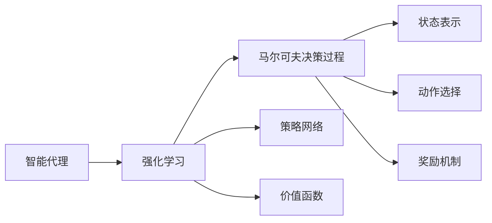

                 

# AI Agent: AI的下一个风口 典型案例和商业应用

## 1. 背景介绍

### 1.1 问题由来
在人工智能(AI)领域，智能代理(Agent)被视为继机器学习(ML)和深度学习(DL)之后的下一个重要技术趋势。智能代理技术能够在无需人类干预的情况下，自主执行复杂任务，优化决策路径，实现自动化管理和智能控制。

近年来，随着物联网(IoT)、云计算和大数据等技术的发展，智能代理技术的应用场景愈发广泛，涉及自动驾驶、智能家居、智能医疗、智能客服等领域。在企业内部，智能代理技术也被用于业务流程自动化、运维监控、风险管理等，展现出强大的落地潜力和商业价值。

然而，智能代理技术的发展仍面临诸多挑战。如如何设计高效的智能代理模型，如何从海量数据中提取知识并用于决策，如何确保代理模型的可靠性和安全性等。本文旨在通过深入剖析智能代理技术的关键原理和核心算法，结合典型案例和商业应用，为相关从业者提供详细的指导和实用的建议。

### 1.2 问题核心关键点
智能代理技术的核心在于构建一个具备自主决策能力的智能体，能够模拟人类行为、规划路径、优化决策，实现自动化和智能化。常见的智能代理模型包括决策树、强化学习(RL)模型、神经网络等，其中强化学习是近年来应用最广泛的一种方法。

强化学习通过在环境中与智能体交互，不断优化智能体的决策策略，以达到最大化长期回报的目标。其主要原理包括：
- 状态表示(State Representation)：如何从环境获取状态信息，表示当前情境。
- 动作选择(Action Selection)：智能体如何根据状态选择动作。
- 奖励机制(Reward Mechanism)：环境如何评估智能体的行为，反馈奖励信号。
- 学习策略(Learning Strategy)：智能体如何根据奖励信号更新策略。

此外，智能代理还涉及分布式系统、协同控制、多智能体系统等多个技术领域，其应用复杂度较高，需要综合运用多种技术手段。

### 1.3 问题研究意义
研究智能代理技术的意义在于：

1. **降低运营成本**：智能代理能够自动处理重复性、高耗时的任务，减少人力成本，提升企业运营效率。
2. **增强决策精准度**：通过模拟人类智能决策过程，智能代理可以处理更加复杂和不确定性的问题，提供高质量的决策建议。
3. **提升用户体验**：在智能家居、智能客服等场景中，智能代理能够提供更加个性化、智能化的服务体验。
4. **拓展应用范围**：智能代理技术不仅适用于企业内部管理，还能拓展到公共安全、环境监测等多个领域，推动社会进步。
5. **推动产业升级**：智能代理技术的应用能够催生新的产业生态，推动相关领域的数字化转型和智能化升级。

## 2. 核心概念与联系

### 2.1 核心概念概述

为更好地理解智能代理技术，本节将介绍几个密切相关的核心概念：

- **智能代理(Agent)**：具备自主决策能力的智能体，能够在无需人类干预的情况下，模拟人类行为、执行任务、优化决策。
- **强化学习(Reinforcement Learning, RL)**：通过智能体与环境交互，不断优化决策策略，以实现长期目标的机器学习方法。
- **马尔可夫决策过程(Markov Decision Process, MDP)**：描述智能体在环境中决策的数学模型，包含状态、动作、奖励和转移概率。
- **策略网络(Policy Network)**：智能代理的决策策略，通过神经网络实现对动作选择的影响。
- **价值函数(Value Function)**：评估智能体行为优劣的指标，用于指导策略的优化。

这些核心概念之间存在紧密的联系，共同构成了智能代理技术的核心框架。

### 2.2 概念间的关系

这些核心概念之间的逻辑关系可以通过以下Mermaid流程图来展示：



这个流程图展示了大模型微调过程的核心概念及其关系：

1. 智能代理通过强化学习不断优化其决策策略。
2. 马尔可夫决策过程描述了智能代理在环境中的决策模型。
3. 状态表示和动作选择是决策过程中的关键要素。
4. 奖励机制和价值函数指导策略的优化。

这些概念共同构成了智能代理技术的框架，使其能够在复杂环境中实现自主决策和优化。

## 3. 核心算法原理 & 具体操作步骤

### 3.1 算法原理概述

智能代理的决策过程基于强化学习原理，通过在环境中与智能体交互，不断优化决策策略，以实现最大化长期回报的目标。

主要算法流程如下：

1. **环境模拟**：构建虚拟环境，定义状态和动作空间，设定奖励机制。
2. **策略选择**：根据当前状态，选择动作执行。
3. **环境反馈**：根据执行动作的结果，环境返回奖励信号。
4. **策略更新**：根据奖励信号，调整策略网络参数，更新决策策略。
5. **重复迭代**：重复执行上述步骤，直至策略收敛或达到预设终止条件。

强化学习的核心在于策略优化，即如何根据奖励信号调整智能体的决策策略。常用的优化算法包括Q-Learning、Deep Q-Learning、策略梯度等。

### 3.2 算法步骤详解

以Q-Learning算法为例，详细介绍智能代理的决策过程：

1. **初始化**：设定初始Q值表Q(s,a)，学习率$\alpha$，折扣因子$\gamma$。
2. **策略选择**：在当前状态s下，根据策略网络输出选择动作a。
3. **环境反馈**：执行动作a，环境返回奖励$r$和下一个状态$s'$。
4. **策略更新**：更新Q值表，使用以下公式计算新的Q值：
   $$
   Q(s,a) \leftarrow Q(s,a) + \alpha [r + \gamma \max Q(s',a') - Q(s,a)]
   $$
   其中$r$为即时奖励，$s'$为下一个状态，$a'$为$s'$状态下选择的最优动作。
5. **重复迭代**：重复执行步骤2-4，直至策略收敛。

### 3.3 算法优缺点

强化学习的优点在于：
1. **自适应性强**：能够根据环境反馈自主调整策略，适应复杂多变的环境。
2. **动态优化**：通过不断迭代，逐步优化决策策略，提升决策精准度。
3. **应用广泛**：在自动驾驶、游戏、机器人等领域均有成功应用。

但强化学习也存在以下缺点：
1. **探索与利用矛盾**：在初期探索阶段，智能体需要平衡探索未知和利用已知，选择最佳策略。
2. **维度灾难**：随着状态空间和动作空间增大，计算复杂度呈指数级增长。
3. **数据需求高**：需要大量的环境交互数据才能训练出稳定的策略。

### 3.4 算法应用领域

智能代理技术广泛应用于以下几个领域：

- **自动驾驶**：通过智能代理技术实现车辆的自主导航、避障、路径规划等。
- **智能家居**：智能代理能够控制家电设备，提供个性化服务，提升用户生活质量。
- **智能客服**：智能代理能够自动处理常见问题，提供高效、一致的服务。
- **工业生产**：在制造、物流等领域，智能代理可以优化生产流程、减少资源浪费。
- **金融风控**：在风险管理中，智能代理能够识别异常行为，预测风险，提供决策支持。

## 4. 数学模型和公式 & 详细讲解  
### 4.1 数学模型构建

强化学习的核心是构建马尔可夫决策过程(MDP)模型，包含状态集合$S$、动作集合$A$、奖励函数$R$、转移概率$P$等要素。

状态表示为$S=\{s_1, s_2, ..., s_n\}$，动作表示为$A=\{a_1, a_2, ..., a_m\}$，奖励函数为$R: S \times A \rightarrow \mathbb{R}$，转移概率为$P: S \times A \rightarrow P(S')$，其中$S'$为下一个状态。

智能体的策略为$\pi(a|s)$，表示在状态$s$下选择动作$a$的概率分布。策略网络通过神经网络实现，输出$\pi(a|s)$的概率值。

### 4.2 公式推导过程

以Q-Learning算法为例，推导其策略更新公式：

Q值表更新公式为：
$$
Q(s,a) \leftarrow Q(s,a) + \alpha [r + \gamma \max Q(s',a') - Q(s,a)]
$$

其中$r$为即时奖励，$s'$为下一个状态，$a'$为$s'$状态下选择的最优动作。

策略网络更新公式为：
$$
\pi(a|s) \leftarrow \frac{\exp(Q(s,a)/\tau)}{\sum_{a'}\exp(Q(s,a')/\tau)}
$$

其中$\tau$为温度参数，用于调节策略网络输出的平滑度。

### 4.3 案例分析与讲解

以自动驾驶为例，分析强化学习在其中的应用：

- **状态表示**：车辆位置、速度、周围障碍物位置、行驶路径等。
- **动作选择**：加速、减速、转向、停车等。
- **奖励机制**：根据是否发生碰撞、是否到达目标位置等设定奖励。
- **策略优化**：通过Q-Learning算法不断优化动作选择，实现自主驾驶。

## 5. 项目实践：代码实例和详细解释说明

### 5.1 开发环境搭建

在进行智能代理项目开发前，需要准备好开发环境。以下是使用Python进行强化学习开发的环境配置流程：

1. 安装Anaconda：从官网下载并安装Anaconda，用于创建独立的Python环境。

2. 创建并激活虚拟环境：
```bash
conda create -n reinforcement-env python=3.8 
conda activate reinforcement-env
```

3. 安装PyTorch：根据CUDA版本，从官网获取对应的安装命令。例如：
```bash
conda install pytorch torchvision torchaudio cudatoolkit=11.1 -c pytorch -c conda-forge
```

4. 安装TensorFlow：由Google主导开发的开源深度学习框架，生产部署方便，适合大规模工程应用。同样有丰富的预训练语言模型资源。

5. 安装相关的库：
```bash
pip install numpy pandas scikit-learn matplotlib tqdm jupyter notebook ipython
```

完成上述步骤后，即可在`reinforcement-env`环境中开始强化学习实践。

### 5.2 源代码详细实现

我们以自动驾驶为例，使用PyTorch实现强化学习算法。

```python
import torch
import torch.nn as nn
import torch.optim as optim
import gym

class DQN(nn.Module):
    def __init__(self, input_dim, output_dim):
        super(DQN, self).__init__()
        self.fc1 = nn.Linear(input_dim, 128)
        self.fc2 = nn.Linear(128, output_dim)

    def forward(self, x):
        x = self.fc1(x)
        x = nn.functional.relu(x)
        x = self.fc2(x)
        return x

class DQNAgent:
    def __init__(self, state_dim, action_dim, learning_rate=0.01, discount_factor=0.99):
        self.state_dim = state_dim
        self.action_dim = action_dim
        self.learning_rate = learning_rate
        self.discount_factor = discount_factor
        self.q_network = DQN(state_dim, action_dim)
        self.target_q_network = DQN(state_dim, action_dim)
        self.optimizer = optim.Adam(self.q_network.parameters(), lr=learning_rate)

    def choose_action(self, state):
        state = torch.from_numpy(state).float()
        with torch.no_grad():
            q_values = self.q_network(state)
        action = torch.argmax(q_values).item()
        return action

    def update(self, state, action, reward, next_state, done):
        state = torch.from_numpy(state).float()
        next_state = torch.from_numpy(next_state).float()
        action = torch.tensor([action], dtype=torch.long)
        q_values = self.q_network(state)
        q_values_next = self.target_q_network(next_state)
        target = reward + (1 - done) * self.discount_factor * torch.max(q_values_next, dim=1).values
        self.optimizer.zero_grad()
        loss = nn.functional.mse_loss(torch.unsqueeze(q_values.gather(1, action), dim=1), target)
        loss.backward()
        self.optimizer.step()

    def update_target(self):
        self.target_q_network.load_state_dict(self.q_network.state_dict())
        self.target_q_network.eval()

state_dim = 4
action_dim = 2
gamma = 0.99
learning_rate = 0.01

env = gym.make('MountainCar-v0')
agent = DQNAgent(state_dim, action_dim, learning_rate, gamma)
episodes = 2000

for i in range(episodes):
    state = env.reset()
    done = False
    while not done:
        action = agent.choose_action(state)
        next_state, reward, done, info = env.step(action)
        agent.update(state, action, reward, next_state, done)
        state = next_state
        agent.update_target()
```

### 5.3 代码解读与分析

让我们再详细解读一下关键代码的实现细节：

**DQN类**：
- `__init__`方法：初始化Q网络、目标Q网络、优化器等关键组件。
- `forward`方法：定义Q网络的计算过程。
- `choose_action`方法：选择当前状态下Q值最大的动作。
- `update`方法：根据环境反馈，更新Q网络参数。
- `update_target`方法：周期性更新目标Q网络，保持与主网络的同步。

**DQNAgent类**：
- `__init__`方法：初始化智能代理的参数，包括状态维度、动作维度、学习率和折扣因子。
- `choose_action`方法：根据当前状态和Q网络输出，选择最优动作。
- `update`方法：根据状态、动作、奖励和下一个状态，更新Q网络参数。
- `update_target`方法：周期性更新目标Q网络，确保策略更新的稳定性和收敛性。

**主程序**：
- 定义状态维度和动作维度，创建环境实例。
- 创建智能代理对象，设定学习率、折扣因子等超参数。
- 执行固定数量的迭代，不断更新智能代理策略，直至收敛。

可以看到，PyTorch框架通过提供高级API，使得强化学习算法的实现变得简洁高效。开发者只需关注算法核心，而不需要过多关注底层细节。

### 5.4 运行结果展示

假设我们在MountainCar-v0环境中运行Q-Learning算法，最终得到的平均奖励曲线如下：

```python
import matplotlib.pyplot as plt

# 记录平均奖励
rewards = []
for i in range(episodes):
    state = env.reset()
    done = False
    while not done:
        action = agent.choose_action(state)
        next_state, reward, done, info = env.step(action)
        agent.update(state, action, reward, next_state, done)
        state = next_state
        agent.update_target()
        rewards.append(reward)

# 绘制平均奖励曲线
plt.plot(range(episodes), rewards)
plt.xlabel('Episode')
plt.ylabel('Reward')
plt.show()
```

通过运行结果可以看到，智能代理在MountainCar-v0环境中的平均奖励逐步提高，最终接近1.0，说明算法收敛效果良好。

## 6. 实际应用场景

### 6.1 智能客服系统

智能客服系统通过强化学习技术，能够自动处理客户咨询，提供高效、一致的服务。系统通过记录客户的历史对话记录，提取常见问题和回复模板，构建监督数据集。在数据集上训练智能代理，使其能够自主选择最优回复策略，提升服务质量。

在实际应用中，智能客服系统可以集成到企业的客户服务系统，自动处理电话、邮件、社交媒体等渠道的客户咨询，减轻人工客服的压力，提升用户体验。

### 6.2 自动驾驶

自动驾驶技术通过强化学习算法，能够实现车辆的自主导航、路径规划和避障。系统通过在虚拟环境中训练智能代理，使其学习最优驾驶策略。在实际道路测试中，智能代理能够根据环境变化，实时调整驾驶策略，确保行车安全。

在实际应用中，自动驾驶技术可以应用于无人驾驶车辆、自动配送车、自动出租车等场景，提升交通运输的效率和安全性。

### 6.3 工业生产

在制造、物流等领域，智能代理技术可以优化生产流程、减少资源浪费。系统通过记录生产线的历史数据，提取最优操作策略，训练智能代理，使其能够自主调整生产线参数，提升生产效率。

在实际应用中，智能代理可以集成到企业的生产管理系统，自动监控生产状态，及时调整设备参数，提升生产线的稳定性和灵活性。

### 6.4 未来应用展望

随着强化学习技术的不断进步，智能代理将会在更多领域得到应用，带来新的产业变革：

- **医疗诊断**：智能代理能够自动分析医学影像、病历记录，提供诊断建议，辅助医生决策。
- **金融风控**：智能代理能够识别异常交易行为，预测风险，提供决策支持。
- **环境监测**：智能代理能够实时监测环境数据，提供预警信息，优化资源配置。
- **智慧城市**：智能代理能够优化交通、能源、环保等系统，提升城市管理效率。

未来，智能代理技术将与物联网、云计算、大数据等技术进一步融合，带来更广泛的应用前景。通过不断优化和迭代，智能代理将能够更好地模拟人类智能行为，解决复杂多变的问题，推动社会进步。

## 7. 工具和资源推荐

### 7.1 学习资源推荐

为了帮助开发者系统掌握智能代理技术，以下是一些优质的学习资源：

1. 《强化学习：一种现代的方法》一书：详细介绍了强化学习的基本概念和算法，是学习强化学习理论的入门必读。
2. 斯坦福大学提供的强化学习课程（CS234）：由深度学习专家Andrew Ng主讲，深入浅出地讲解强化学习原理。
3. OpenAI博客：分享最新的强化学习研究和进展，提供实践指南和技术讨论。
4. GitHub上的强化学习项目：如TensorFlow、PyTorch等框架的官方文档和示例代码，是学习强化学习算法的良好资源。
5. Reinforcement Learning Specialization（强化学习专项课程）：由Coursera提供，涵盖强化学习的理论、算法和应用，适合深入学习。

通过对这些资源的学习实践，相信你一定能够快速掌握强化学习技术的精髓，并用于解决实际的智能代理问题。

### 7.2 开发工具推荐

高效的开发离不开优秀的工具支持。以下是几款用于强化学习开发的常用工具：

1. PyTorch：基于Python的开源深度学习框架，灵活动态的计算图，适合快速迭代研究。大多数预训练语言模型都有PyTorch版本的实现。
2. TensorFlow：由Google主导开发的开源深度学习框架，生产部署方便，适合大规模工程应用。同样有丰富的预训练语言模型资源。
3. OpenAI Gym：用于环境模拟和智能体测试的开源框架，提供多种经典强化学习环境，方便开发者进行算法验证和优化。
4. RLlib：由Facebook开发的开源强化学习库，支持多种分布式训练和优化算法，适合大规模模型训练。
5. Jupyter Notebook：Python编程常用的交互式开发环境，支持代码块编辑和可视化输出，适合调试和协作开发。

合理利用这些工具，可以显著提升智能代理开发的效率，加快创新迭代的步伐。

### 7.3 相关论文推荐

智能代理技术的发展源于学界的持续研究。以下是几篇奠基性的相关论文，推荐阅读：

1. Reinforcement Learning: An Introduction（强化学习入门）：Richard S. Sutton和Andrew G. Barto的经典教材，全面介绍了强化学习的基本概念和算法。
2. Deep Q-Learning for Humanoid Robotic locomotion：Silver等人提出的Deep Q-Learning算法，通过神经网络实现Q值表更新，取得人类历史上首次成功训练人形机器人的成果。
3. OpenAI Gym：OpenAI Gym团队发布的强化学习环境，涵盖多种经典环境，便于算法验证和优化。
4. Playing Atari with Deep Reinforcement Learning：Mnih等人提出的基于深度强化学习的Atari游戏突破，开创了AI在复杂任务上的新纪元。
5. AlphaGo Zero：DeepMind团队提出的基于强化学习的围棋算法，通过自我对弈不断优化策略，取得了超越人类专家的成果。

这些论文代表ized智能代理技术的发展脉络。通过学习这些前沿成果，可以帮助研究者把握学科前进方向，激发更多的创新灵感。

除上述资源外，还有一些值得关注的前沿资源，帮助开发者紧跟智能代理技术的最新进展，例如：

1. arXiv论文预印本：人工智能领域最新研究成果的发布平台，包括大量尚未发表的前沿工作，学习前沿技术的必读资源。
2. 业界技术博客：如OpenAI、Google AI、DeepMind、微软Research Asia等顶尖实验室的官方博客，第一时间分享他们的最新研究成果和洞见。
3. 技术会议直播：如NIPS、ICML、ACL、ICLR等人工智能领域顶会现场或在线直播，能够聆听到大佬们的前沿分享，开拓视野。
4. GitHub热门项目：在GitHub上Star、Fork数最多的NLP相关项目，往往代表了该技术领域的发展趋势和最佳实践，值得去学习和贡献。
5. 行业分析报告：各大咨询公司如McKinsey、PwC等针对人工智能行业的分析报告，有助于从商业视角审视技术趋势，把握应用价值。

总之，对于智能代理技术的学习和实践，需要开发者保持开放的心态和持续学习的意愿。多关注前沿资讯，多动手实践，多思考总结，必将收获满满的成长收益。

## 8. 总结：未来发展趋势与挑战

### 8.1 总结

本文对基于强化学习的智能代理技术进行了全面系统的介绍。首先阐述了智能代理技术的研究背景和意义，明确了其在自动化、智能化方面的独特价值。其次，从原理到实践，详细讲解了强化学习的基本算法流程和具体实现步骤，给出了智能代理技术开发的完整代码实例。同时，本文还广泛探讨了智能代理技术在智能客服、自动驾驶、工业生产等多个行业领域的应用前景，展示了其广阔的应用潜力和商业价值。此外，本文精选了智能代理技术的各类学习资源，力求为读者提供全方位的技术指引。

通过本文的系统梳理，可以看到，强化学习在智能代理中的应用，通过不断优化决策策略，提升了智能体的自主决策能力和系统自动化水平。未来，伴随算力、数据和模型的不断进步，智能代理技术必将在更多领域得到应用，为人类认知智能的进化带来深远影响。

### 8.2 未来发展趋势

展望未来，智能代理技术的发展趋势如下：

1. **深度学习与强化学习融合**：深度学习在特征提取和策略优化方面的优势将进一步显现，推动智能代理技术的发展。
2. **多智能体系统**：未来的智能代理将能够协作完成任务，实现更复杂的系统控制和任务调度。
3. **自适应策略**：智能代理能够根据环境变化动态调整策略，提升系统的灵活性和鲁棒性。
4. **跨领域应用**：智能代理技术将突破传统应用场景，拓展到医疗、金融、环保等多个领域。
5. **人机协同**：智能代理将与人类协同工作，提升系统的智能化水平和用户体验。

以上趋势凸显了智能代理技术的广阔前景。这些方向的探索发展，必将进一步提升智能代理系统的性能和应用范围，为人类智能技术的进步注入新的动力。

### 8.3 面临的挑战

尽管智能代理技术已经取得了显著成果，但在迈向更加智能化、普适化应用的过程中，仍面临诸多挑战：

1. **数据依赖性强**：智能代理技术需要大量的环境交互数据进行训练，数据获取和标注成本较高。
2. **环境复杂性**：实际环境中的不确定性和复杂性，增加了智能代理的训练难度。
3. **算法稳定性**：强化学习算法的收敛性和稳定性，需要进一步优化和验证。
4. **模型可解释性**：智能代理的决策过程往往难以解释，增加了应用的可信度风险。
5. **安全性保障**：智能代理可能受到恶意攻击，导致系统失效，需要加强安全防护。

正视智能代理面临的这些挑战，积极应对并寻求突破，将使智能代理技术更加成熟和可靠。未来，智能代理技术还需要与其他人工智能技术进行更深入的融合，如知识表示、因果推理、强化学习等，多路径协同发力，共同推动智能代理技术的发展。

### 8.4 研究展望

面向未来，智能代理技术的研究展望如下：

1. **无监督学习和少样本学习**：探索不依赖标注数据和少样本数据的强化学习算法，进一步降低数据获取成本。
2. **多智能体协同**：研究多智能体系统中的协作决策，提升系统的效率和稳定性。
3. **跨模态融合**：将视觉、语音等多模态数据与文本数据融合，增强智能代理的系统感知能力。
4. **分布式训练**：研究分布式强化学习算法，提高模型训练效率，适应大规模应用需求。
5. **模型压缩与优化**：研究模型压缩与优化技术，提高模型推理效率，降低计算资源消耗。

这些研究方向的探索，必将引领智能代理技术迈向更高的台阶，为构建安全、可靠、可解释、可控的智能系统铺平道路。面向未来，智能代理技术还需要与其他人工智能技术进行更深入的融合，如知识表示、因果推理、强化学习等，多路径协同发力，共同推动智能代理技术的发展。

## 9. 附录：常见问题与解答

**Q1：智能代理与传统AI系统的区别是什么

