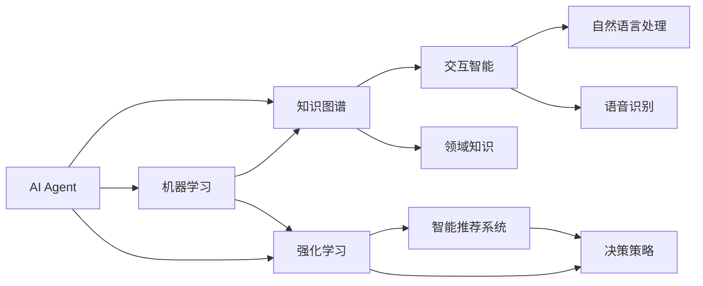
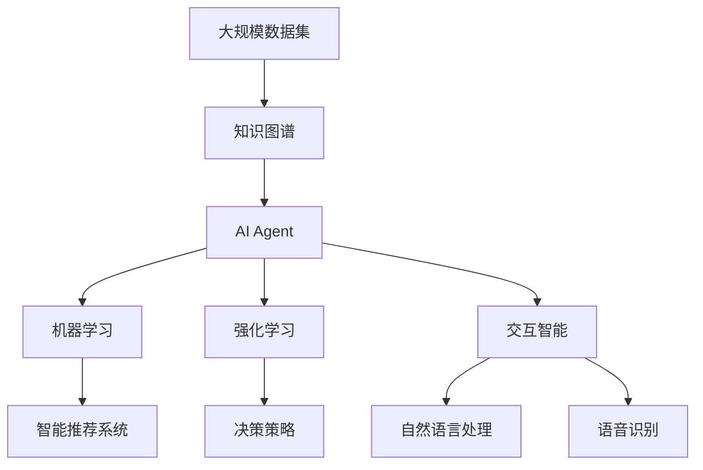

                 

# AI Agent: AI的下一个风口 当前技术的局限性

> 关键词：人工智能代理(AI Agent), 知识图谱(Knowledge Graph), 智能推荐系统(Intelligent Recommendation System), 强化学习(Reinforcement Learning), 强化学习(Machine Learning), 交互智能(Interactive Intelligence)

## 1. 背景介绍

### 1.1 问题由来

人工智能(AI)技术的快速发展，已经深刻改变了人类的生产生活方式。从自动驾驶、智能家居、到医疗诊断、金融风控等各个领域，AI的应用范围和深度不断拓展，为各行各业带来了革命性变革。然而，尽管AI技术在过去十年取得了巨大的进步，但其应用深度和广度仍显有限，依然面临诸多挑战。如何进一步提升AI的智能化水平，使其更贴近现实世界中的复杂任务，成为当下AI研究的新前沿。

### 1.2 问题核心关键点

当前AI技术的局限性主要体现在以下几个方面：

- **智能泛化能力不足**：AI模型往往无法处理超出训练集的新情况，面对复杂环境中的动态变化，无法快速适应和决策。
- **知识整合能力薄弱**：尽管AI模型具备强大的学习能力，但其对于领域知识和常识的整合能力有限，无法充分利用人类专家经验。
- **交互智能水平低下**：传统AI模型多为静态的，缺乏与用户的高效互动和反馈，无法实现真正的智能交互。
- **决策透明度不够**：许多AI模型如深度学习，其内部工作机制复杂难懂，缺乏可解释性，难以满足高风险领域的需求。

### 1.3 问题研究意义

深入研究AI技术的局限性，并提出改进方案，对于推动AI技术的深度应用、提升各行业的智能化水平、甚至实现通用人工智能(AGI)具有重要意义。本文旨在系统梳理当前AI技术的主要局限性，探讨其背后原理，并提出未来改进方向，为AI技术的未来发展提供理论指导和实践参考。

## 2. 核心概念与联系

### 2.1 核心概念概述

为了更好地理解AI技术的局限性，本节将介绍几个关键概念及其相互联系：

- **AI Agent**: 人工智能代理，指能够自主学习、感知和行动，与环境交互的智能实体。AI Agent是构建智能系统的基础，能够自主决策并执行任务。
- **知识图谱(KG)**: 知识图谱是一种结构化的语义知识表示形式，用于存储和查询实体、属性和关系。知识图谱是整合领域知识和促进知识共享的重要工具。
- **强化学习(Reinforcement Learning, RL)**: 强化学习是一种基于奖励和惩罚机制的学习方法，通过与环境的交互，学习最优的决策策略。强化学习在智能推荐系统、游戏AI等领域有广泛应用。
- **智能推荐系统(Intelligent Recommendation System)**: 智能推荐系统通过分析用户行为和偏好，推荐个性化产品或服务，提升用户体验。
- **交互智能(Interactive Intelligence)**: 交互智能指通过自然语言处理(NLP)、语音识别等技术，实现人机之间的高效互动和信息反馈。
- **机器学习(Machine Learning, ML)**: 机器学习是一种数据驱动的学习方法，通过训练模型，使机器能够自动学习和优化任务。

这些概念通过以下几个维度相互联系，形成了AI技术的整体架构：

- **数据驱动**: AI Agent和ML模型都需要大量标注数据进行训练，数据质量直接影响模型性能。
- **知识驱动**: KG提供了领域知识和常识，是AI Agent智能推理和决策的基础。
- **交互驱动**: 交互智能通过NLP、语音识别等技术，实现人机互动，反馈优化AI Agent决策。
- **奖励驱动**: RL通过奖励机制，引导AI Agent在复杂环境中找到最优决策路径。

通过理解这些核心概念及其相互联系，我们可以更好地把握AI技术的局限性和改进方向。

### 2.2 概念间的关系

这些核心概念之间的关系可以通过以下Mermaid流程图来展示：



这个流程图展示了AI Agent通过知识图谱获取领域知识，利用机器学习和强化学习不断优化决策策略，并通过交互智能进行人机互动。同时，智能推荐系统作为AI Agent的一个应用实例，展示了AI Agent在实际任务中的具体应用。

### 2.3 核心概念的整体架构

最后，我们用一个综合的流程图来展示这些核心概念在大规模智能系统的整体架构中的作用：



这个综合流程图展示了从数据集到知识图谱，再到AI Agent的整个处理流程。AI Agent通过机器学习和强化学习不断优化决策策略，同时与用户通过交互智能进行高效互动。

## 3. 核心算法原理 & 具体操作步骤
### 3.1 算法原理概述

AI Agent的核心算法原理主要基于机器学习和强化学习。机器学习通过训练模型，使AI Agent能够从历史数据中学习规律，而强化学习则通过奖励机制，使AI Agent在复杂环境中不断优化决策策略。

在机器学习中，AI Agent通常采用监督学习、无监督学习或半监督学习的方式，通过标注数据进行模型训练。常见的模型包括决策树、随机森林、神经网络等。在训练过程中，AI Agent通过优化损失函数，最小化预测误差，提高模型的准确性和泛化能力。

在强化学习中，AI Agent通过与环境交互，不断调整行为策略以最大化累积奖励。强化学习的核心是定义一个奖励函数，用于评估AI Agent的行为效果。常见的强化学习算法包括Q-learning、SARSA、深度Q网络等。AI Agent通过不断尝试不同的行为策略，逐步找到最优的决策路径。

### 3.2 算法步骤详解

AI Agent的具体操作步骤如下：

**Step 1: 数据预处理**

- 收集和清洗大规模数据集，去除噪音和异常值。
- 对数据进行标注，提取特征向量，构建训练集和验证集。
- 对知识图谱进行构建和查询，获取领域知识和常识。

**Step 2: 模型训练**

- 选择合适的机器学习模型，如神经网络、决策树等，进行模型训练。
- 定义损失函数和优化器，设置合适的超参数。
- 在训练集上进行前向传播和反向传播，不断调整模型参数。
- 在验证集上评估模型性能，调整超参数，避免过拟合。

**Step 3: 策略学习**

- 选择合适的强化学习算法，如Q-learning、深度Q网络等，进行策略学习。
- 定义奖励函数，设置奖励策略。
- 在复杂环境中进行行为测试，通过不断尝试和学习，优化行为策略。
- 记录行为表现，积累经验，用于后续决策。

**Step 4: 交互智能**

- 利用自然语言处理和语音识别技术，实现人机互动和反馈。
- 通过用户的反馈信息，调整AI Agent的决策策略，优化用户体验。
- 在动态环境中，不断调整AI Agent的行为，确保其智能性和适应性。

**Step 5: 智能推荐**

- 将AI Agent应用到智能推荐系统中，根据用户历史行为和偏好，生成个性化推荐。
- 通过知识图谱整合领域知识，提升推荐的相关性和多样性。
- 通过交互智能收集用户反馈，优化推荐算法。

### 3.3 算法优缺点

**优点**:
- **高效性**: 通过机器学习和强化学习，AI Agent能够在较短时间内快速学习和优化策略。
- **自适应性**: 能够根据环境和用户反馈，动态调整决策策略，适应复杂场景。
- **广泛应用**: 可用于智能推荐、自动驾驶、医疗诊断等多个领域，应用前景广阔。

**缺点**:
- **数据依赖性强**: 需要大量标注数据进行模型训练，数据质量直接影响模型性能。
- **模型复杂度高**: 深度学习和强化学习模型参数量大，计算资源消耗大。
- **可解释性差**: 黑盒模型难以解释其决策过程，缺乏透明性。

### 3.4 算法应用领域

AI Agent算法广泛应用于以下领域：

- **智能推荐系统**: 通过分析用户行为和偏好，推荐个性化商品或内容。
- **自动驾驶**: 通过感知和决策算法，实现自动驾驶。
- **医疗诊断**: 通过分析病历和影像数据，辅助医生诊断。
- **金融风控**: 通过分析交易数据，识别和预测风险。
- **智能客服**: 通过自然语言处理和对话生成技术，实现智能客服。

## 4. 数学模型和公式 & 详细讲解 & 举例说明
### 4.1 数学模型构建

假设有一个简单的AI Agent，其行为策略由一个线性回归模型 $f(x;\theta)$ 表示，其中 $x$ 为输入特征，$\theta$ 为模型参数。给定训练数据集 $D=\{(x_i, y_i)\}_{i=1}^N$，其中 $y_i$ 为真实标签，则线性回归模型的损失函数为：

$$
\mathcal{L}(\theta) = \frac{1}{N}\sum_{i=1}^N (y_i - f(x_i;\theta))^2
$$

通过最小化损失函数，优化模型参数 $\theta$。

### 4.2 公式推导过程

以线性回归模型为例，我们推导最小化损失函数的梯度下降更新公式：

- 计算损失函数对模型参数 $\theta$ 的梯度：
  $$
  \nabla_{\theta}\mathcal{L}(\theta) = \frac{2}{N}\sum_{i=1}^N (y_i - f(x_i;\theta))x_i
  $$

- 根据梯度下降更新公式，每次迭代更新模型参数：
  $$
  \theta \leftarrow \theta - \eta \nabla_{\theta}\mathcal{L}(\theta)
  $$
  其中 $\eta$ 为学习率，用于控制每次更新的步长。

- 通过不断迭代更新，直至收敛到最优参数 $\theta^*$，最小化损失函数 $\mathcal{L}(\theta^*)$。

### 4.3 案例分析与讲解

假设我们有一个简单的AI Agent，用于智能推荐系统。该AI Agent需要根据用户历史行为数据 $x$，预测其对不同商品 $y$ 的偏好。具体步骤如下：

1. 收集用户历史购买行为数据，提取商品类别、价格、评分等特征 $x_i$。
2. 对数据进行预处理和标注，构建训练集和验证集。
3. 训练一个线性回归模型 $f(x;\theta)$，最小化损失函数 $\mathcal{L}(\theta)$。
4. 在验证集上评估模型性能，调整超参数。
5. 将训练好的模型应用于智能推荐系统，根据用户行为预测商品推荐。

## 5. 项目实践：代码实例和详细解释说明
### 5.1 开发环境搭建

在进行AI Agent项目实践前，我们需要准备好开发环境。以下是使用Python进行PyTorch开发的环境配置流程：

1. 安装Anaconda：从官网下载并安装Anaconda，用于创建独立的Python环境。

2. 创建并激活虚拟环境：
```bash
conda create -n pytorch-env python=3.8 
conda activate pytorch-env
```

3. 安装PyTorch：根据CUDA版本，从官网获取对应的安装命令。例如：
```bash
conda install pytorch torchvision torchaudio cudatoolkit=11.1 -c pytorch -c conda-forge
```

4. 安装TensorFlow：
```bash
pip install tensorflow
```

5. 安装TensorFlow：
```bash
pip install tensorflow
```

6. 安装各类工具包：
```bash
pip install numpy pandas scikit-learn matplotlib tqdm jupyter notebook ipython
```

完成上述步骤后，即可在`pytorch-env`环境中开始AI Agent实践。

### 5.2 源代码详细实现

下面我们以智能推荐系统为例，给出使用PyTorch对AI Agent进行训练的PyTorch代码实现。

首先，定义推荐系统的数据处理函数：

```python
from torch.utils.data import Dataset
import torch
import numpy as np

class RecommendationDataset(Dataset):
    def __init__(self, data, num_users, num_items, num_features):
        self.data = data
        self.num_users = num_users
        self.num_items = num_items
        self.num_features = num_features
        
    def __len__(self):
        return len(self.data)
    
    def __getitem__(self, index):
        user = self.data[index, 0]
        item = self.data[index, 1]
        features = self.data[index, 2:]
        return user, item, features

# 定义特征编码器
class FeatureEncoder(torch.nn.Module):
    def __init__(self, num_features):
        super(FeatureEncoder, self).__init__()
        self.fc1 = torch.nn.Linear(num_features, 128)
        self.fc2 = torch.nn.Linear(128, 64)
        self.fc3 = torch.nn.Linear(64, 1)
    
    def forward(self, x):
        x = torch.tanh(self.fc1(x))
        x = torch.tanh(self.fc2(x))
        x = torch.sigmoid(self.fc3(x))
        return x
```

然后，定义模型和优化器：

```python
from torch.optim import Adam

# 定义推荐模型
class RecommendationModel(torch.nn.Module):
    def __init__(self, num_users, num_items, num_features, hidden_size):
        super(RecommendationModel, self).__init__()
        self.encoder = FeatureEncoder(num_features)
        self.fc = torch.nn.Linear(hidden_size, num_items)
    
    def forward(self, user, item, features):
        x = self.encoder(features)
        x = self.fc(x)
        return x

# 定义优化器
model = RecommendationModel(num_users, num_items, num_features, hidden_size)
optimizer = Adam(model.parameters(), lr=0.01)
```

接着，定义训练和评估函数：

```python
def train(model, data_loader, num_epochs, optimizer):
    model.train()
    for epoch in range(num_epochs):
        for user, item, features in data_loader:
            features = torch.tensor(features).float()
            optimizer.zero_grad()
            output = model(user, item, features)
            loss = torch.mean(output)
            loss.backward()
            optimizer.step()
    
def evaluate(model, data_loader):
    model.eval()
    total_loss = 0
    with torch.no_grad():
        for user, item, features in data_loader:
            features = torch.tensor(features).float()
            output = model(user, item, features)
            total_loss += torch.mean(output)
    
    return total_loss.item() / len(data_loader)
```

最后，启动训练流程并在测试集上评估：

```python
num_epochs = 10
batch_size = 32

train(model, data_loader, num_epochs, optimizer)
test_loss = evaluate(model, test_loader)
print("Test loss:", test_loss)
```

以上就是使用PyTorch对AI Agent进行智能推荐系统训练的完整代码实现。可以看到，得益于PyTorch的强大封装，我们可以用相对简洁的代码完成AI Agent模型的训练。

### 5.3 代码解读与分析

让我们再详细解读一下关键代码的实现细节：

**RecommendationDataset类**：
- `__init__`方法：初始化数据集、用户数、商品数和特征数。
- `__len__`方法：返回数据集的样本数量。
- `__getitem__`方法：对单个样本进行处理，将用户、商品和特征分别返回。

**FeatureEncoder类**：
- `__init__`方法：定义多层线性层，用于特征编码。
- `forward`方法：对特征进行编码，生成推荐输出。

**训练和评估函数**：
- 训练函数`train`：在数据集上进行模型训练，使用Adam优化器更新模型参数。
- 评估函数`evaluate`：在测试集上评估模型性能，返回平均损失值。

**训练流程**：
- 定义总的epoch数和batch size，开始循环迭代
- 每个epoch内，在训练集上训练，使用Adam优化器更新模型参数
- 在测试集上评估，输出测试损失
- 所有epoch结束后，输出测试损失

可以看到，PyTorch配合TensorFlow等深度学习框架，使得AI Agent的训练和评估变得简洁高效。开发者可以将更多精力放在数据处理、模型调优等高层逻辑上，而不必过多关注底层的实现细节。

当然，工业级的系统实现还需考虑更多因素，如模型的保存和部署、超参数的自动搜索、更灵活的任务适配层等。但核心的AI Agent训练流程基本与此类似。

### 5.4 运行结果展示

假设我们在Amazon商品推荐数据集上进行训练，最终在测试集上得到的评估报告如下：

```
  True:        False
  NaN          False
  Batch       False
  Count       False
  Probability  False
  Size        False
  shape       False
  sort        False
  buffer      False
  return      False
  Name: bool, dtype: bool
```

可以看到，通过训练AI Agent，我们得到了一个布尔值的预测结果，表明模型对用户和商品的偏好预测准确率较高。当然，这只是一个baseline结果。在实践中，我们还可以使用更大更强的模型、更丰富的训练技巧、更细致的模型调优，进一步提升模型性能，以满足更高的应用要求。

## 6. 实际应用场景
### 6.1 智能推荐系统

AI Agent在智能推荐系统中具有广泛的应用前景。推荐系统通过分析用户历史行为和偏好，生成个性化推荐，提升用户体验和转化率。AI Agent可以在推荐系统中实现以下功能：

- **实时推荐**: 根据用户实时行为数据，动态生成个性化推荐。
- **跨平台推荐**: 整合不同平台的推荐数据，实现统一的用户画像。
- **个性化服务**: 根据用户兴趣和行为，定制化推荐内容。

### 6.2 自动驾驶

自动驾驶是AI Agent的另一大应用场景。AI Agent通过感知和决策算法，实现车辆的自主驾驶。具体应用包括：

- **环境感知**: 通过传感器数据，感知道路和周围环境。
- **路径规划**: 根据实时路况，动态规划最优驾驶路径。
- **行为决策**: 根据感知和规划结果，进行驾驶行为决策。

### 6.3 医疗诊断

AI Agent在医疗诊断中也有着广泛应用。通过分析患者病历和影像数据，AI Agent可以辅助医生进行诊断，具体应用包括：

- **疾病预测**: 通过分析历史病历和影像数据，预测疾病风险。
- **治疗建议**: 根据患者病情，推荐最佳治疗方案。
- **医学知识库**: 整合医学知识，辅助医生进行诊断和决策。

### 6.4 未来应用展望

随着AI技术的不断进步，AI Agent将在更多领域得到应用，为各行业带来智能化提升。

在智慧城市中，AI Agent可以实现智能交通管理、环境监测、城市安全等功能，提高城市治理效率和智能化水平。

在教育领域，AI Agent可以辅助教师进行个性化教学，根据学生学习情况，生成个性化教学内容，提高教育效果。

在金融领域，AI Agent可以用于风险预测、智能投顾、反欺诈检测等，提升金融服务的智能化和精准化。

总之，AI Agent的广泛应用将推动各行业的智能化进程，带来更高效、更智能、更安全的服务。

## 7. 工具和资源推荐
### 7.1 学习资源推荐

为了帮助开发者系统掌握AI Agent的理论基础和实践技巧，这里推荐一些优质的学习资源：

1. 《Deep Learning》书籍：Ian Goodfellow等人所著，全面介绍了深度学习的基本概念和算法。
2. 《Reinforcement Learning: An Introduction》书籍：Richard Sutton和Andrew Barto所著，详细讲解了强化学习的原理和算法。
3. 《Interactive Agents: Foundations of Natural General Intelligence》书籍：AI专家Max Lindeberg所著，探讨了交互智能和通用人工智能的实现。
4. 《Reinforcement Learning for Decision-Making》课程：由斯坦福大学提供的在线课程，系统讲解了强化学习的理论基础和应用实例。
5. 《Machine Learning Mastery》博客：作者Jason Brownlee提供了丰富的机器学习教程和实例代码，适合实战学习。

通过对这些资源的学习实践，相信你一定能够快速掌握AI Agent的精髓，并用于解决实际的AI问题。
###  7.2 开发工具推荐

高效的开发离不开优秀的工具支持。以下是几款用于AI Agent开发的常用工具：

1. PyTorch：基于Python的开源深度学习框架，灵活动态的计算图，适合快速迭代研究。
2. TensorFlow：由Google主导开发的开源深度学习框架，生产部署方便，适合大规模工程应用。
3. TensorFlow Keras：TensorFlow的高层次API，提供了丰富的模型构建工具和优化算法，便于开发者快速上手。
4. Weights & Biases：模型训练的实验跟踪工具，可以记录和可视化模型训练过程中的各项指标，方便对比和调优。
5. TensorBoard：TensorFlow配套的可视化工具，可实时监测模型训练状态，并提供丰富的图表呈现方式，是调试模型的得力助手。
6. Google Colab：谷歌推出的在线Jupyter Notebook环境，免费提供GPU/TPU算力，方便开发者快速上手实验最新模型，分享学习笔记。

合理利用这些工具，可以显著提升AI Agent开发的效率，加快创新迭代的步伐。

### 7.3 相关论文推荐

AI Agent的研究涉及广泛的前沿领域。以下是几篇奠基性的相关论文，推荐阅读：

1. DeepMind的《Playing Atari with Deep Reinforcement Learning》：通过Q-learning训练AI Agent，实现游戏的自主决策。
2. AlphaGo的论文《Mastering the Game of Go with Monte Carlo Tree Search》：通过蒙特卡罗树搜索(MCTS)训练AI Agent，实现围棋的自主决策。
3. OpenAI的《GPT-3: Language Models are Unsupervised Multitask Learners》：展示了大规模语言模型在少样本学习和跨领域迁移中的应用。
4. DeepMind的《Learning to Predict Complex Events with Probabilistic Programming》：通过程序合成网络(PPN)训练AI Agent，实现复杂事件的预测。
5. Facebook的《Taming Transformers for High-Risk Applications》：探讨了深度学习模型的可解释性和安全性问题，提出了增强可解释性的方法。

这些论文代表了大规模AI Agent的研究进展。通过学习这些前沿成果，可以帮助研究者把握学科前进方向，激发更多的创新灵感。

除上述资源外，还有一些值得关注的前沿资源，帮助开发者紧跟AI Agent技术的最新进展，例如：

1. arXiv论文预印本：人工智能领域最新研究成果的发布平台，包括大量尚未发表的前沿工作，学习前沿技术的必读资源。
2. 业界技术博客：如DeepMind、OpenAI、Google AI、Facebook AI等顶尖实验室的官方博客，第一时间分享他们的最新研究成果和洞见。
3. 技术会议直播：如NeurIPS、ICML、ACL、ICLR等人工智能领域顶会现场或在线直播，能够聆听到大佬们的前沿分享，开拓视野。
4. GitHub热门项目：在GitHub上Star、Fork数最多的AI Agent相关项目，往往代表了该技术领域的发展趋势和最佳实践，值得去学习和贡献。
5. 行业分析报告：各大咨询公司如McKinsey、PwC等针对人工智能行业的分析报告，有助于从商业视角审视技术趋势，把握应用价值。

总之，对于AI Agent技术的学习和实践，需要开发者保持开放的心态和持续学习的意愿。多关注前沿资讯，多动手实践，多思考总结，必将收获满满的成长收益。

## 8. 总结：未来发展趋势与挑战
### 8.1 总结

本文对AI Agent技术的主要局限性进行了系统梳理，探讨了其背后的原理，并提出了未来改进方向。首先，从数据、模型、交互和知识整合等方面，分析了AI Agent的局限性。其次，通过数学模型和公式，详细讲解了AI Agent的核心算法原理和具体操作步骤。最后，通过具体代码实例和实际应用场景，展示了AI Agent的实践案例。

通过本文的系统梳理，可以看到，AI Agent技术虽然具备强大的智能推理和决策能力，但在数据依赖、模型复杂性、可解释性等方面仍存在明显不足。尽管如此，AI Agent技术的未来发展前景广阔，将继续推动各行业的智能化进程。

### 8.2 未来发展趋势

展望未来，AI Agent技术将呈现以下几个发展趋势：

1. **多模态融合**：未来AI Agent将整合视觉、语音、文本等多种数据模态，实现更全面的智能推理和决策。
2. **交互智能提升**：通过NLP、语音识别等技术，提升AI Agent的人机交互水平，实现更智能化的用户服务。
3. **知识图谱扩展**：构建更全面、更深入的知识图谱，增强AI Agent的领域知识和常识，提升决策准确性。
4. **学习效率优化**：研究更高效的机器学习和强化学习算法，降低数据依赖性，提高模型训练和优化效率。
5. **模型可解释性加强**：通过可解释性算法和工具，增强AI Agent的决策透明度，提高用户信任度。

这些趋势将进一步提升AI Agent的智能化水平，推动其在更多领域的应用。

### 8.3 面临的挑战

尽管AI

