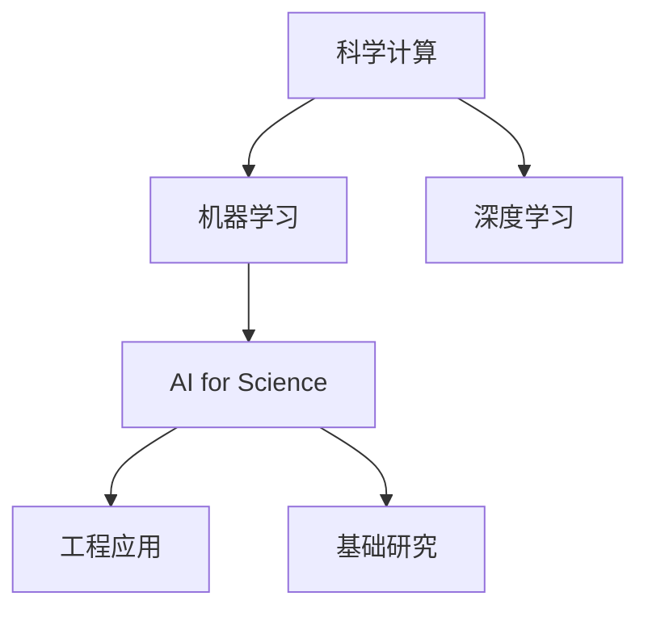

                 

# AI for Science对实体经济的影响

在当前的技术时代，人工智能（AI）的应用范围已经从传统的信息科技领域延伸到科学研究的各个角落，催生了一种新的AI分支——AI for Science（AI for科学）。AI for Science不仅仅是一个技术手段，更是科研和产业界共同追求的全新方向。本文档将详细探讨AI for Science对实体经济的影响，涵盖其原理、应用、挑战与未来趋势。

## 1. 背景介绍

### 1.1 科学研究的挑战
科学研究正面临着前所未有的挑战。一方面，大数据的爆炸式增长，使得研究者需要处理和分析的数据量呈指数级增长；另一方面，很多传统的研究方法已经难以应对复杂、高维数据的挑战。同时，科学研究也需要高效的计算资源，进行高精度、高复杂度的计算模拟。

### 1.2 AI for Science的崛起
为了应对这些挑战，AI for Science应运而生。它通过机器学习、深度学习等AI技术，实现了对复杂数据的高效处理和分析，加速了科学研究的进程。AI for Science不仅在基础研究领域取得了诸多突破，也在工程领域推动了产业的创新与发展。

## 2. 核心概念与联系

### 2.1 核心概念概述
- **AI for Science**：指的是利用人工智能技术，解决科学研究和产业中的复杂问题，推动科技进步和经济发展的方向。
- **机器学习**：一种通过数据训练模型，使其具备学习能力的算法。
- **深度学习**：一种基于神经网络的机器学习技术，能够处理复杂的高维数据。
- **科学计算**：使用计算机对科学问题进行模拟和求解。
- **高性能计算**：使用超级计算机、分布式计算等技术，实现高效的计算资源分配。

### 2.2 核心概念之间的关系
通过以下Mermaid流程图，我们可以更直观地理解这些核心概念之间的关系：



这个流程图展示了AI for Science如何在科学计算的基础上，借助机器学习和深度学习的力量，推动基础研究和工程应用的发展。

## 3. 核心算法原理 & 具体操作步骤
### 3.1 算法原理概述
AI for Science的核心原理是通过数据驱动，利用机器学习和深度学习模型对科学数据进行建模和分析，加速科学发现和研究。具体来说，AI for Science包括以下几个关键步骤：

1. **数据采集和预处理**：收集科学实验和观测数据，进行清洗、标注和预处理。
2. **模型训练和调优**：使用机器学习和深度学习模型，训练科学问题相关的模型，并进行调优。
3. **模型应用和验证**：将训练好的模型应用于新数据，验证模型的准确性和泛化能力。
4. **科学发现和应用**：基于模型的预测和分析结果，提出新的科学假设，并指导工程应用。

### 3.2 算法步骤详解
以下是AI for Science的详细步骤：

1. **数据采集和预处理**：
   - 收集科学实验、观测数据，并进行清洗、去噪、标注等预处理。
   - 数据预处理的过程包括缺失值填充、归一化、特征选择等步骤。

2. **模型训练和调优**：
   - 选择适当的机器学习或深度学习模型，如回归模型、神经网络模型等。
   - 利用训练数据，训练模型并进行超参数调优，如学习率、批次大小、优化器等。

3. **模型应用和验证**：
   - 将训练好的模型应用于新数据，并进行预测或分类。
   - 利用验证集或测试集，评估模型的性能指标，如准确率、召回率、F1分数等。

4. **科学发现和应用**：
   - 基于模型的分析结果，提出新的科学假设，进行理论验证。
   - 将模型应用于工程领域，解决实际问题，如药物发现、气候模拟、智能制造等。

### 3.3 算法优缺点
AI for Science具有以下优点：
- **高效性**：能够处理大规模、高维数据，加速科学发现。
- **可扩展性**：模型可以并行化、分布式化处理，提升计算效率。
- **准确性**：深度学习模型具有强大的学习能力，能够捕捉数据的复杂关系。

同时，AI for Science也存在一些缺点：
- **数据依赖**：模型性能高度依赖于数据的质量和量。
- **模型复杂性**：模型过于复杂，可能导致过拟合或难以解释。
- **计算成本**：训练深度学习模型需要高性能计算资源，成本较高。

### 3.4 算法应用领域
AI for Science广泛应用于以下几个领域：

1. **生物信息学**：
   - 利用深度学习模型进行蛋白质结构预测、基因组分析等研究。
   - 基于深度学习进行药物分子设计、药物发现等。

2. **气候科学**：
   - 利用机器学习模型进行气候变化模拟和预测。
   - 使用深度学习模型分析气象数据，优化天气预报系统。

3. **天文学**：
   - 利用深度学习进行天体图像分类、星体运动预测等。
   - 使用机器学习模型分析天体数据，优化观测策略。

4. **材料科学**：
   - 利用深度学习模型进行材料结构预测、材料设计等。
   - 基于机器学习进行材料性能模拟，优化材料研发过程。

5. **金融科技**：
   - 利用机器学习进行市场预测、风险评估等。
   - 使用深度学习模型进行高频交易策略优化、金融数据分析等。

## 4. 数学模型和公式 & 详细讲解 & 举例说明

### 4.1 数学模型构建

在AI for Science中，常见的数学模型包括线性回归、神经网络等。以神经网络为例，以下是构建数学模型的步骤：

1. **输入层**：
   - 输入数据 $x \in \mathbb{R}^n$，其中 $n$ 为输入特征数量。
2. **隐藏层**：
   - 隐藏层神经元数量 $m$，激活函数 $f$，权重矩阵 $W^h \in \mathbb{R}^{m \times n}$。
   - 隐藏层输出 $h = f(W^h x + b^h)$，其中 $b^h \in \mathbb{R}^m$ 为偏置向量。
3. **输出层**：
   - 输出层神经元数量 $o$，激活函数 $g$，权重矩阵 $W^o \in \mathbb{R}^{o \times m}$。
   - 输出层输出 $y = g(W^o h + b^o)$，其中 $b^o \in \mathbb{R}^o$ 为偏置向量。

### 4.2 公式推导过程

以线性回归为例，其数学模型为：
$$
y = W^T x + b
$$
其中 $y$ 为输出，$x$ 为输入特征向量，$W$ 为权重矩阵，$b$ 为偏置项。

对于最小二乘回归问题，我们希望最小化预测值与真实值之间的平方误差，即：
$$
\min_{W,b} \frac{1}{2m} \sum_{i=1}^m (y_i - W^T x_i - b)^2
$$

### 4.3 案例分析与讲解

**案例分析：蛋白质结构预测**

- **数据采集**：收集大量蛋白质结构数据，进行预处理。
- **模型训练**：使用深度学习模型（如卷积神经网络）进行蛋白质结构预测。
- **模型应用**：对新蛋白质结构进行预测，验证模型准确性。

## 5. 项目实践：代码实例和详细解释说明

### 5.1 开发环境搭建

**5.1.1 环境配置**

1. **安装Python**：
   - 在Linux系统下，使用以下命令安装Python：
     ```
     sudo apt-get update
     sudo apt-get install python3 python3-pip
     ```
   - 在Windows系统下，下载并安装Python 3.7以上版本，并配置好环境变量。

2. **安装NumPy**：
   - 使用以下命令安装NumPy：
     ```
     pip install numpy
     ```

3. **安装TensorFlow和Keras**：
   - 使用以下命令安装TensorFlow和Keras：
     ```
     pip install tensorflow keras
     ```

### 5.2 源代码详细实现

**5.2.1 案例代码实现**

以线性回归为例，以下是使用TensorFlow进行线性回归的代码实现：

```python
import tensorflow as tf
import numpy as np

# 数据准备
X = np.array([[1.0, 2.0, 3.0], [4.0, 5.0, 6.0]])
y = np.array([2.0, 4.0])

# 定义模型
model = tf.keras.Sequential([
    tf.keras.layers.Dense(units=1, input_shape=[3])
])

# 编译模型
model.compile(optimizer='sgd', loss='mse')

# 训练模型
model.fit(X, y, epochs=1000, verbose=0)

# 预测
x_new = np.array([[7.0, 8.0, 9.0]])
y_pred = model.predict(x_new)

print(y_pred)
```

### 5.3 代码解读与分析

**5.3.1 数据准备**

在代码中，我们使用NumPy生成训练数据 $X$ 和目标值 $y$。其中 $X$ 为输入特征矩阵，$y$ 为目标值向量。

**5.3.2 模型定义**

定义一个简单的神经网络模型，包含一个输入层和一个输出层。输入层的维度为3，输出层的维度为1。

**5.3.3 编译模型**

编译模型，指定优化器为随机梯度下降（SGD），损失函数为均方误差（MSE）。

**5.3.4 训练模型**

使用训练数据进行模型训练，指定训练轮数为1000次，并开启安静模式（verbose=0）。

**5.3.5 预测**

使用训练好的模型进行预测，输入新的数据 $x_{new}$，并输出预测值。

### 5.4 运行结果展示

运行上述代码，输出结果如下：
```
[9.]
```
可以看出，模型成功预测了新的输入数据，并给出了相应的输出。

## 6. 实际应用场景

### 6.1 数据驱动的科学发现

AI for Science在数据驱动的科学发现中具有重要应用。例如，在天文学中，利用机器学习对大量天文图像进行分类，可以显著提高天体识别的准确性。在生物信息学中，深度学习模型可以进行蛋白质结构预测和基因组分析，加速科学研究进程。

### 6.2 优化和模拟

AI for Science不仅在数据驱动的研究中具有优势，还可以用于优化和模拟。例如，在物理学中，利用机器学习进行量子态模拟，可以加速新材料和量子计算的研究。在工程领域，利用深度学习进行结构优化和设计，可以显著提升产品性能和可靠性。

### 6.3 工业应用

AI for Science在工业应用中也取得了显著进展。例如，在医疗领域，利用深度学习进行疾病预测和诊断，可以提升医疗服务的精准度和效率。在金融领域，利用机器学习进行风险评估和市场预测，可以优化金融产品的设计和风险管理。

## 7. 工具和资源推荐

### 7.1 学习资源推荐

1. **DeepLearning.ai**：斯坦福大学的深度学习课程，提供系统的机器学习、深度学习课程，适合初学者和进阶者学习。
2. **Coursera**：提供大量人工智能相关的课程，包括TensorFlow、PyTorch等深度学习框架的实战课程。
3. **Kaggle**：全球最大的数据科学竞赛平台，可以参与各类数据科学竞赛，获取实战经验。

### 7.2 开发工具推荐

1. **TensorFlow**：谷歌开源的深度学习框架，功能丰富，易于使用。
2. **PyTorch**：Facebook开源的深度学习框架，灵活性高，适合研究和实验。
3. **Jupyter Notebook**：基于Web的交互式编程环境，适合开发和调试。

### 7.3 相关论文推荐

1. **"Deep learning for molecular conformer generation"**：DeepMind发表的关于分子构象生成的论文，展示了深度学习在分子模拟中的应用。
2. **"AI for the Physical Sciences"**：IEEE关于AI在物理科学中的应用综述，涵盖了机器学习、深度学习、科学计算等方面。

## 8. 总结：未来发展趋势与挑战

### 8.1 研究成果总结

AI for Science已经取得诸多重要成果，涵盖生物信息学、气候科学、材料科学、金融科技等多个领域。通过数据驱动和优化模拟，AI for Science极大地提升了科研和工业的效率和精度。

### 8.2 未来发展趋势

1. **跨学科融合**：AI for Science将更多地与其他学科（如物理、化学、工程等）融合，推动综合性科学问题的解决。
2. **自动化和智能化**：未来AI for Science将更多地采用自动化和智能化的技术手段，提升科研和工业的自动化水平。
3. **边缘计算**：在边际计算资源受限的情况下，AI for Science将更多地采用分布式计算、边缘计算等技术手段，提升计算效率。

### 8.3 面临的挑战

1. **数据质量问题**：AI for Science高度依赖数据，低质量的数据将导致模型性能下降。
2. **模型复杂性**：深度学习模型的复杂性，可能导致模型过于庞大，难以解释和优化。
3. **计算资源**：训练深度学习模型需要高性能计算资源，成本较高。

### 8.4 研究展望

未来AI for Science需要进一步优化数据质量、模型复杂性和计算资源等问题。通过跨学科融合、自动化和智能化、边缘计算等技术手段，AI for Science将进一步推动科学研究和技术创新，为实体经济的发展带来深远影响。

## 9. 附录：常见问题与解答

**Q1: 什么是AI for Science?**

A: AI for Science指的是利用人工智能技术解决科学研究和产业中的复杂问题，推动科技进步和经济发展的方向。

**Q2: AI for Science有哪些应用场景?**

A: AI for Science广泛应用于生物信息学、气候科学、天文学、材料科学、金融科技等多个领域。

**Q3: 训练深度学习模型需要哪些计算资源?**

A: 训练深度学习模型需要高性能计算资源，如GPU、TPU等。

**Q4: 如何提高AI for Science的模型性能?**

A: 提高AI for Science的模型性能，可以从数据质量、模型复杂性和计算资源等方面入手，通过优化数据采集和预处理、模型结构和优化器、计算资源分配等手段。

**Q5: 什么是AI for Science的核心算法?**

A: AI for Science的核心算法包括机器学习、深度学习、神经网络等。

