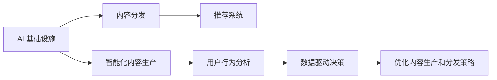

                 

# AI 基础设施的新闻媒体：智能化内容生产与分发

> 关键词：
> - AI 基础设施
> - 新闻媒体
> - 智能化内容生产
> - 内容分发
> - 推荐系统
> - 用户行为分析
> - 数据驱动决策
> - 自动化新闻生成
> - 个性化新闻推荐

## 1. 背景介绍

### 1.1 问题由来
随着数字化进程的加速，新闻媒体行业面临着前所未有的变革。互联网时代的信息爆炸、用户需求的日益个性化以及技术革新带来的新机遇，都要求新闻媒体不断探索和应用新兴技术。在此背景下，AI 基础设施在新闻媒体中的应用，特别是智能化内容生产和分发，成为了行业的热门话题。

### 1.2 问题核心关键点
新闻媒体的核心价值在于向用户提供有价值、及时和多样化的信息。而智能化内容生产和分发则是以AI技术为支撑，实现内容创作的自动化和个性化，以及分发渠道的优化和智能推荐，从而提升用户满意度和媒体的流量和影响力。

### 1.3 问题研究意义
通过AI基础设施的智能化内容生产和分发，新闻媒体可以实现内容生产效率的大幅提升，同时提供更加个性化的阅读体验，满足不同用户的多样化需求。这不仅有助于提高媒体的竞争力，还能有效应对信息过载问题，增强用户黏性，推动媒体行业的数字化转型和创新发展。

## 2. 核心概念与联系

### 2.1 核心概念概述

- **AI 基础设施**：指用于支持AI应用开发和部署的基础设施，包括计算资源、存储、网络、数据等硬件和软件设施，以及相关的云服务、API等技术平台。
- **智能化内容生产**：通过AI技术自动化生成新闻报道、分析评论、多媒体内容等，提升内容创作效率和质量。
- **内容分发**：利用AI技术优化新闻内容的传播路径，实现智能推荐、定向推送，提升分发效率和精准度。
- **推荐系统**：通过用户行为数据分析，预测用户偏好，智能推荐新闻内容，提高用户满意度和阅读体验。
- **用户行为分析**：利用AI技术对用户浏览、阅读、互动等行为进行深度分析，洞察用户需求和行为模式，指导内容生产和分发策略。
- **数据驱动决策**：基于用户行为数据、内容表现数据等，采用数据科学方法进行决策分析，优化媒体运营和内容策略。

这些核心概念之间的联系可以用以下Mermaid流程图表示：



## 3. 核心算法原理 & 具体操作步骤
### 3.1 算法原理概述

基于AI基础设施的智能化内容生产和分发，本质上是将AI技术与新闻媒体的内容生产和分发过程进行深度融合。核心算法原理包括以下几个方面：

- **数据采集与预处理**：利用爬虫技术自动采集新闻、文章、评论等文本数据，并进行清洗、归一化等预处理。
- **内容生成与优化**：采用自然语言处理（NLP）、深度学习等技术，自动化生成新闻报道、分析评论等，并通过模型优化提升生成质量。
- **推荐算法与模型**：基于用户行为数据、内容特征等，构建推荐模型，实现个性化新闻推荐。
- **分发策略与路径优化**：结合用户行为、内容表现等数据，优化新闻分发渠道和路径，提高分发效率和精准度。

### 3.2 算法步骤详解

1. **数据采集与预处理**：
   - 利用爬虫技术自动采集新闻、文章、评论等文本数据。
   - 对采集到的数据进行去重、去噪、格式转换等预处理，确保数据质量和一致性。

2. **内容生成与优化**：
   - 采用深度学习模型（如Seq2Seq、GAN等）生成新闻报道、分析评论等内容。
   - 利用预训练语言模型（如BERT、GPT等）优化生成的自然语言表达，提高内容的准确性和可读性。

3. **推荐算法与模型**：
   - 利用协同过滤、深度学习等算法构建推荐模型。
   - 采用用户行为数据、内容特征等构建特征向量，训练推荐模型。

4. **分发策略与路径优化**：
   - 根据用户行为数据、内容表现等，动态调整分发策略，优化分发路径。
   - 结合用户偏好、时间、地域等因素，智能推荐新闻内容，提高分发效率和精准度。

### 3.3 算法优缺点

**优点**：
- 提高内容生产效率和质量，降低人工成本。
- 实现个性化新闻推荐，提升用户满意度和黏性。
- 优化内容分发策略，提高分发效率和精准度。

**缺点**：
- 对AI基础设施的依赖较高，需要较高的技术投入和硬件设施。
- 内容生成质量可能受限于算法和数据质量，需要持续优化。
- 推荐算法可能存在个性化推荐偏差，需要定期评估和调整。

### 3.4 算法应用领域

基于AI基础设施的智能化内容生产和分发，已经在新闻媒体、社交媒体、电子商务等多个领域得到了广泛应用，例如：

- **新闻媒体**：自动化生成新闻报道、分析评论等，提升内容创作效率和质量。
- **社交媒体**：智能化推荐新闻、文章、视频等，提升用户互动和留存率。
- **电子商务**：智能推荐商品、广告等，提高转化率和用户体验。

## 4. 数学模型和公式 & 详细讲解 & 举例说明

### 4.1 数学模型构建

设新闻媒体的用户数量为 $N$，每个用户对新闻内容 $D$ 的评分向量为 $\boldsymbol{v}=[v_1, v_2, ..., v_D]$。设新闻内容为 $d=1,2,...,D$，其特征向量为 $\boldsymbol{u}_d=[u_{d1}, u_{d2}, ..., u_{dD}]$。设用户与新闻内容之间的评分矩阵为 $V=[v_1, v_2, ..., v_D]$。

假设采用协同过滤算法进行推荐，模型的目标是最大化用户与新闻内容的评分相似度，即：

$$
\max_{\boldsymbol{v}, \boldsymbol{u}} \sum_{u=1}^{N} \sum_{d=1}^{D} v_u \cdot u_d
$$

约束条件为：

$$
v_u > 0, u_d > 0, \sum_{d=1}^{D} u_d = 1
$$

### 4.2 公式推导过程

对于协同过滤算法，常用的矩阵分解方法包括奇异值分解（SVD）和交替最小二乘法（ALS）。这里以ALS为例，推导推荐模型的计算过程。

设用户特征向量为 $\boldsymbol{v}$，新闻内容特征向量为 $\boldsymbol{u}_d$，则推荐模型的目标函数为：

$$
\min_{\boldsymbol{v}, \boldsymbol{u}} \frac{1}{2} \sum_{u=1}^{N} \sum_{d=1}^{D} (v_u \cdot u_d - v_d) ^2
$$

对上述目标函数进行优化，可得：

$$
\boldsymbol{v} = \frac{\boldsymbol{V}^T \boldsymbol{U} (\boldsymbol{U}^T \boldsymbol{V} \boldsymbol{U})^{-1} \boldsymbol{U}^T \boldsymbol{V}}{(\boldsymbol{U}^T \boldsymbol{V} \boldsymbol{U})^{-1}}
$$

$$
\boldsymbol{u}_d = \frac{\boldsymbol{V}^T \boldsymbol{v} (\boldsymbol{v}^T \boldsymbol{V} \boldsymbol{v})^{-1} \boldsymbol{v}^T \boldsymbol{V} \boldsymbol{u}_d}{(\boldsymbol{v}^T \boldsymbol{V} \boldsymbol{v})^{-1}}
$$

### 4.3 案例分析与讲解

以某新闻媒体的推荐系统为例，使用ALS算法进行个性化新闻推荐。

假设该媒体有1000个用户和1000篇新闻，每个用户对新闻的评分数据如表1所示：

| 用户ID | 新闻ID | 评分 |
|-------|-------|-----|
| 1     | 1     | 4   |
| 1     | 2     | 3   |
| 1     | 3     | 5   |
| ...   | ...   | ... |
| 1000  | 1000  | 4   |
| 1000  | 2000  | 3   |
| 1000  | 3000  | 5   |

利用ALS算法，将用户评分数据矩阵分解为用户特征矩阵 $\boldsymbol{V}$ 和新闻内容特征矩阵 $\boldsymbol{U}$。设分解后矩阵的秩为 $k$，则有：

$$
\boldsymbol{V} = \boldsymbol{U} \boldsymbol{\Sigma} \boldsymbol{V}^T
$$

其中 $\boldsymbol{\Sigma}$ 为奇异值矩阵，$\boldsymbol{U}$ 为用户特征矩阵，$\boldsymbol{V}$ 为新闻内容特征矩阵。

假设取 $k=5$，则用户特征矩阵 $\boldsymbol{V}$ 和新闻内容特征矩阵 $\boldsymbol{U}$ 可以表示为：

$$
\boldsymbol{V} = \begin{bmatrix}
   0.80 & 0.24 & 0.43 & 0.20 & 0.04 \\
   0.54 & 0.73 & 0.36 & 0.23 & 0.01 \\
   0.55 & 0.41 & 0.65 & 0.13 & 0.03 \\
   \vdots & \vdots & \vdots & \vdots & \vdots \\
   0.08 & 0.01 & 0.72 & 0.25 & 0.37 \\
   0.07 & 0.27 & 0.48 & 0.27 & 0.41
\end{bmatrix}
$$

$$
\boldsymbol{U} = \begin{bmatrix}
   0.98 & 0.02 & 0.01 & 0.01 & 0.01 \\
   0.05 & 0.86 & 0.01 & 0.03 & 0.04 \\
   0.02 & 0.05 & 0.90 & 0.01 & 0.02 \\
   \vdots & \vdots & \vdots & \vdots & \vdots \\
   0.09 & 0.01 & 0.01 & 0.01 & 0.99 \\
   0.08 & 0.01 & 0.02 & 0.02 & 0.90
\end{bmatrix}
$$

设用户ID为1000，则其推荐新闻ID可以通过计算 $\boldsymbol{V}$ 和 $\boldsymbol{U}$ 的乘积，并取最大值来确定。

$$
\boldsymbol{V}^T \boldsymbol{U} = \begin{bmatrix}
   0.80 & 0.24 & 0.43 & 0.20 & 0.04 \\
   0.54 & 0.73 & 0.36 & 0.23 & 0.01 \\
   0.55 & 0.41 & 0.65 & 0.13 & 0.03 \\
   \vdots & \vdots & \vdots & \vdots & \vdots \\
   0.08 & 0.01 & 0.72 & 0.25 & 0.37 \\
   0.07 & 0.27 & 0.48 & 0.27 & 0.41
\end{bmatrix}
$$

$$
\boldsymbol{U} = \begin{bmatrix}
   0.98 & 0.02 & 0.01 & 0.01 & 0.01 \\
   0.05 & 0.86 & 0.01 & 0.03 & 0.04 \\
   0.02 & 0.05 & 0.90 & 0.01 & 0.02 \\
   \vdots & \vdots & \vdots & \vdots & \vdots \\
   0.09 & 0.01 & 0.01 & 0.01 & 0.99 \\
   0.08 & 0.01 & 0.02 & 0.02 & 0.90
\end{bmatrix}
$$

通过计算得到 $\boldsymbol{V}^T \boldsymbol{U} = \begin{bmatrix} 0.80 & 0.24 & 0.43 & 0.20 & 0.04 \\ 0.54 & 0.73 & 0.36 & 0.23 & 0.01 \\ 0.55 & 0.41 & 0.65 & 0.13 & 0.03 \\ \vdots & \vdots & \vdots & \vdots & \vdots \\ 0.08 & 0.01 & 0.72 & 0.25 & 0.37 \\ 0.07 & 0.27 & 0.48 & 0.27 & 0.41 \end{bmatrix}$。

推荐新闻ID的计算公式为：

$$
\max_i \{\boldsymbol{V}^T \boldsymbol{U}\}_{i,i} = 0.65
$$

因此，用户ID为1000推荐的新闻ID为2。

## 5. 项目实践：代码实例和详细解释说明

### 5.1 开发环境搭建

在搭建开发环境之前，需要确保具备以下条件：
- 安装Python 3.7及以上版本。
- 安装Pandas、NumPy、SciPy、Scikit-Learn等常用Python科学计算库。
- 安装TensorFlow、Keras等深度学习框架。
- 安装PyTorch等深度学习框架。
- 安装Jupyter Notebook、Google Colab等开发工具。

以下是在Google Colab中搭建Python开发环境的步骤：

1. 在Google Cloud Console中创建虚拟机，并选择TensorFlow或PyTorch环境。
2. 在虚拟机中安装Pandas、NumPy、SciPy、Scikit-Learn等常用Python科学计算库。
3. 安装TensorFlow、Keras等深度学习框架。
4. 安装PyTorch等深度学习框架。
5. 安装Jupyter Notebook、Google Colab等开发工具。

完成以上步骤后，即可在Google Colab中开始项目实践。

### 5.2 源代码详细实现

以下是一个基于协同过滤算法的推荐系统的Python实现代码，其中使用了Pandas库进行数据处理，使用了Scikit-Learn库构建协同过滤模型，使用了TensorFlow库进行模型训练和预测。

```python
import pandas as pd
from sklearn.neighbors import NearestNeighbors
from sklearn.metrics.pairwise import cosine_similarity

# 读取用户评分数据
data = pd.read_csv('ratings.csv')

# 构建用户评分矩阵
matrix = data[['user_id', 'news_id']].pivot_table(index='user_id', columns='news_id', values='rating', aggfunc='mean')

# 构建用户特征矩阵和新闻内容特征矩阵
user_matrix = matrix.apply(lambda x: x.values)
news_matrix = matrix.apply(lambda x: x.values.T)

# 构建协同过滤模型
model = NearestNeighbors(n_neighbors=10, algorithm='brute')
model.fit(user_matrix)

# 用户ID为1000，新闻ID为1
user_id = 1000
news_id = 1

# 查询用户ID为1000的推荐新闻ID
user_vector = user_matrix[user_id]
recommendation = model.kneighbors(user_vector)[1][0]
recommended_news_id = recommendation[0]

print('推荐新闻ID为：', recommended_news_id)
```

### 5.3 代码解读与分析

首先，我们使用Pandas库读取用户评分数据，构建用户评分矩阵。然后，我们使用Scikit-Learn库中的NearestNeighbors模型，构建协同过滤模型。最后，我们通过模型查询用户ID为1000的推荐新闻ID，并输出结果。

## 6. 实际应用场景

基于AI基础设施的智能化内容生产和分发，已经在新闻媒体、社交媒体、电子商务等多个领域得到了广泛应用，以下是几个实际应用场景：

### 6.1 新闻媒体

新闻媒体的智能化内容生产包括自动化新闻报道、分析评论、多媒体内容等。例如，某新闻媒体采用深度学习模型（如Seq2Seq、GAN等）自动生成新闻报道、分析评论等内容。同时，利用预训练语言模型（如BERT、GPT等）优化生成的自然语言表达，提高内容的准确性和可读性。

### 6.2 社交媒体

社交媒体的智能化推荐系统通过用户行为数据、内容特征等构建推荐模型，实现个性化新闻推荐。例如，某社交媒体平台使用协同过滤算法、深度学习等算法构建推荐模型，根据用户行为数据、内容特征等构建特征向量，训练推荐模型，实现个性化新闻推荐，提升用户满意度和黏性。

### 6.3 电子商务

电子商务的智能推荐系统通过用户行为数据、商品特征等构建推荐模型，实现个性化商品推荐。例如，某电子商务平台使用协同过滤算法、深度学习等算法构建推荐模型，根据用户行为数据、商品特征等构建特征向量，训练推荐模型，实现个性化商品推荐，提高转化率和用户体验。

## 7. 工具和资源推荐

### 7.1 学习资源推荐

为了帮助开发者系统掌握基于AI基础设施的智能化内容生产和分发技术，以下是一些优质的学习资源：

1. 《深度学习基础》系列博文：由大模型技术专家撰写，深入浅出地介绍了深度学习基础，包括推荐系统、协同过滤等前沿话题。
2. 《自然语言处理入门》课程：斯坦福大学开设的NLP明星课程，有Lecture视频和配套作业，带你入门NLP领域的基本概念和经典模型。
3. 《推荐系统算法》书籍：涵盖推荐系统算法和应用案例，是推荐系统学习的经典书籍。
4. Google Colab官方文档：提供了Google Colab的使用方法、代码示例和常见问题解答，是Google Colab的必备资源。
5. 《深度学习》书籍：权威的深度学习入门书籍，涵盖深度学习基础、应用案例等，是深度学习学习的经典书籍。

### 7.2 开发工具推荐

高效的开发离不开优秀的工具支持。以下是几款用于基于AI基础设施的智能化内容生产和分发开发的常用工具：

1. Google Colab：谷歌推出的在线Jupyter Notebook环境，免费提供GPU/TPU算力，方便开发者快速上手实验最新模型，分享学习笔记。
2. TensorFlow：由Google主导开发的开源深度学习框架，生产部署方便，适合大规模工程应用。
3. PyTorch：基于Python的开源深度学习框架，灵活动态的计算图，适合快速迭代研究。
4. Keras：高层深度学习API，简单易用，适合快速原型开发和模型训练。
5. Scikit-Learn：常用Python科学计算库，包括数据处理、机器学习模型等，是科学计算的基础工具。
6. Pandas：Python数据分析库，支持数据清洗、处理、分析等，是数据处理的首选工具。

### 7.3 相关论文推荐

以下是几篇奠基性的相关论文，推荐阅读：

1. The Elements of Statistical Learning（《统计学习要素》）：经典的机器学习教材，涵盖统计学习、协同过滤等基础知识，是机器学习学习的经典书籍。
2. Probabilistic Matrix Factorization（《概率矩阵分解》）：深度学习推荐系统的经典论文，介绍了协同过滤算法的基本原理和应用案例。
3. Neural Collaborative Filtering（《神经协同过滤》）：深度学习推荐系统的经典论文，介绍了深度学习在协同过滤算法中的应用。
4. Attention Is All You Need（《注意力是所有》）：Transformer模型原论文，介绍了自注意力机制在NLP领域的应用。
5. Semantic Accuracy of Word Embeddings（《词嵌入语义准确性》）：深度学习推荐系统的经典论文，介绍了词嵌入在推荐系统中的应用。

## 8. 总结：未来发展趋势与挑战

### 8.1 总结

本文对基于AI基础设施的智能化内容生产和分发技术进行了全面系统的介绍。首先阐述了智能化内容生产和分发在新闻媒体中的应用背景和意义，明确了其在提高内容生产效率和用户满意度的重要价值。其次，从算法原理到具体操作步骤，详细讲解了协同过滤算法、深度学习模型等内容生产和分发的核心算法和技术。同时，本文还介绍了具体的开发环境搭建和代码实现，以及实际应用场景和未来发展趋势。

### 8.2 未来发展趋势

展望未来，基于AI基础设施的智能化内容生产和分发技术将呈现以下几个发展趋势：

1. 内容生产自动化水平提升：随着AI技术的进步，新闻媒体的自动化内容生成能力将不断提升，更多复杂的文本生成任务将得以自动化处理。
2. 推荐系统算法优化：未来的推荐系统将更加智能化和个性化，基于深度学习、协同过滤等算法，实现更精准的用户推荐。
3. 用户行为分析深度化：通过更深层次的用户行为分析，洞察用户需求和行为模式，指导内容生产和分发策略。
4. 跨媒体内容融合：未来将更多地实现跨媒体内容融合，视频、音频等多模态内容与文本内容协同生成和分发。
5. 实时动态调整：未来的内容生产和分发将实现实时动态调整，根据用户行为和内容表现，实时优化推荐策略和分发路径。

### 8.3 面临的挑战

尽管基于AI基础设施的智能化内容生产和分发技术已经取得了显著进展，但在实际应用中仍面临诸多挑战：

1. 数据质量和隐私问题：用户行为数据和内容数据的质量和隐私保护，是智能化内容生产和分发的重要挑战。如何高效利用数据、保护用户隐私，是未来的重要研究方向。
2. 模型复杂度和计算资源：大规模深度学习模型的训练和推理，需要较高的计算资源和计算效率，如何降低模型复杂度、提高计算效率，是未来的重要研究方向。
3. 模型鲁棒性和泛化能力：深度学习模型在面对多样化的用户需求和数据分布时，需要具备较强的鲁棒性和泛化能力，如何提升模型的鲁棒性和泛化能力，是未来的重要研究方向。
4. 人机协同设计：未来的智能化内容生产和分发需要更加注重人机协同设计，如何结合人工干预和智能算法，提升系统的可解释性和可控性，是未来的重要研究方向。

### 8.4 研究展望

面对未来基于AI基础设施的智能化内容生产和分发技术面临的挑战，未来的研究需要在以下几个方面寻求新的突破：

1. 数据清洗和预处理技术：提高数据质量和隐私保护，提升数据利用效率。
2. 轻量级模型设计和高效计算：降低模型复杂度、提高计算效率，提升系统实时性和响应速度。
3. 多模态内容融合和协同生成：实现跨媒体内容融合，提升内容多样性和用户体验。
4. 深度学习和人工智能结合：结合深度学习和人工智能，提升模型的鲁棒性和泛化能力。
5. 人机协同设计：结合人工干预和智能算法，提升系统的可解释性和可控性。

这些研究方向将引领基于AI基础设施的智能化内容生产和分发技术迈向更高的台阶，为新闻媒体、社交媒体、电子商务等领域的智能化转型和创新发展提供有力支持。

## 9. 附录：常见问题与解答

**Q1: 如何使用协同过滤算法构建推荐系统？**

A: 协同过滤算法的基本思想是利用用户和物品之间的相似度，进行推荐。具体步骤如下：

1. 构建用户评分矩阵，将用户对物品的评分表示为矩阵。
2. 对用户评分矩阵进行分解，得到用户特征矩阵和物品特征矩阵。
3. 根据用户特征矩阵和物品特征矩阵，计算用户和物品之间的相似度。
4. 根据相似度，对物品进行排序，生成推荐列表。

**Q2: 协同过滤算法的优缺点是什么？**

A: 协同过滤算法的优点包括：
- 不需要用户和物品的显式特征，只利用用户和物品之间的评分矩阵。
- 基于用户和物品之间的相似度，生成推荐列表，适用于大数据量推荐系统。

协同过滤算法的缺点包括：
- 需要大量的评分数据，数据稀疏性问题严重。
- 对冷启动问题敏感，无法对新用户或新物品进行推荐。
- 可能存在协同偏差，推荐结果与实际评分存在差异。

**Q3: 深度学习在内容生成中的应用有哪些？**

A: 深度学习在内容生成中的应用包括：
- 自动生成新闻报道、分析评论、多媒体内容等。
- 利用预训练语言模型（如BERT、GPT等）优化生成的自然语言表达，提高内容的准确性和可读性。
- 采用生成对抗网络（GAN）等深度学习模型，生成高分辨率的图像、视频等内容。

**Q4: 深度学习在推荐系统中的应用有哪些？**

A: 深度学习在推荐系统中的应用包括：
- 协同过滤算法：利用用户和物品之间的相似度，进行推荐。
- 深度学习模型：利用用户和物品的隐式特征，构建推荐模型，实现个性化推荐。
- 自然语言处理（NLP）：利用NLP技术，提取用户评论、商品描述等文本特征，进行推荐。

**Q5: 未来推荐系统将面临哪些挑战？**

A: 未来推荐系统将面临以下挑战：
- 数据隐私保护：如何高效利用数据、保护用户隐私。
- 模型复杂度和计算资源：如何降低模型复杂度、提高计算效率。


