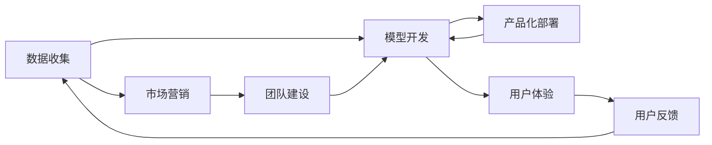
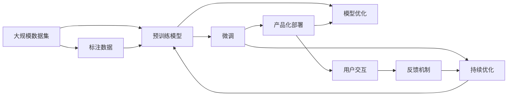

                 

# AI 大模型创业：如何利用资本优势？

近年来，人工智能（AI）领域的发展迅猛，大模型的应用也日益广泛。许多创业公司利用大模型创业，并获得了显著的投资回报。然而，由于大模型的开发和应用成本较高，资本成为了创业公司重要的“武器”。本文将探讨如何利用资本优势，推动AI大模型的创业成功。

## 1. 背景介绍

### 1.1 问题由来

在AI大模型的发展过程中，技术创新和市场竞争日益激烈。大模型不仅需要庞大的数据集和算力支持，还需要持续的研究和优化。对于大多数创业公司而言，这些成本是不可忽视的。因此，如何高效利用资本优势，成为决定AI大模型创业成败的关键。

### 1.2 问题核心关键点

利用资本优势需要考虑到多个方面，包括数据收集、模型开发、市场营销、团队建设等。只有全方位地优化这些环节，才能确保AI大模型创业的顺利进行。

### 1.3 问题研究意义

通过利用资本优势，创业公司可以在短时间内获得高质量的数据集和先进的AI技术，迅速占领市场，并在竞争中脱颖而出。这不仅能够提升公司的市场地位，还能吸引更多投资者关注，形成良性循环。

## 2. 核心概念与联系

### 2.1 核心概念概述

- **大模型**：指使用大规模数据集进行训练，具备强大特征提取能力和表达能力的AI模型。
- **资本优势**：指创业公司利用外部投资，提高研发和市场能力，推动公司快速成长的优势。
- **数据收集**：指通过各种渠道获取所需的数据集，为模型的训练和优化提供基础。
- **模型开发**：指从预训练到微调，再到产品化部署的整个过程。
- **市场营销**：指通过各种渠道推广公司产品，吸引用户使用和投资。
- **团队建设**：指招聘和培养优秀的AI技术人员，为公司的持续发展提供人才保障。

### 2.2 概念间的关系

这些概念之间存在着紧密的联系，如图：



数据收集是模型的基础，模型开发是实现的核心，市场营销和团队建设则是确保模型能够成功部署并持续优化的保障。用户体验和用户反馈则有助于模型不断优化，形成良性循环。

### 2.3 核心概念的整体架构



从数据集预训练，到模型微调，再到产品化部署，最后通过用户交互和反馈持续优化模型，这一完整架构涵盖了AI大模型创业的各个方面。

## 3. 核心算法原理 & 具体操作步骤

### 3.1 算法原理概述

利用资本优势，可以通过多个步骤实现。这些步骤包括数据收集、模型开发、市场营销和团队建设等。每个步骤都需要精心设计和优化，才能保证整个项目的成功。

### 3.2 算法步骤详解

**Step 1: 数据收集**

数据收集是大模型创业的基础。创业公司需要收集大规模的数据集，用于模型的预训练和微调。这些数据集应涵盖多个领域和场景，确保模型的泛化能力。

**Step 2: 模型开发**

模型开发是创业公司最重要的环节之一。通过使用先进的AI技术和工具，创业公司可以开发出高质量的AI模型，并将其应用于实际场景中。

**Step 3: 市场营销**

市场营销是创业公司获取更多用户和投资者的关键步骤。通过各种渠道，如社交媒体、行业会议等，创业公司可以推广其产品和服务，吸引更多用户和投资者。

**Step 4: 团队建设**

团队建设是创业公司持续发展的重要保障。创业公司需要招聘和培养优秀的AI技术人员，形成强大的研发团队，为公司的持续发展提供人才保障。

### 3.3 算法优缺点

利用资本优势具有以下优点：

- **加速研发**：通过投资，创业公司可以迅速获得高质量的数据集和先进的AI技术，提高研发效率。
- **吸引人才**：充足的资金可以吸引优秀的AI技术人员，提高公司的技术实力。
- **扩大市场**：通过市场营销，创业公司可以迅速扩大市场份额，提升市场地位。

然而，利用资本优势也存在一些缺点：

- **高昂成本**：大规模数据集和先进AI技术的获取和应用，需要投入大量的资金和资源。
- **市场竞争激烈**：虽然资本可以加速创业公司的成长，但市场竞争仍然非常激烈。
- **管理风险**：资金的投入和管理需要谨慎，否则可能导致公司亏损。

### 3.4 算法应用领域

利用资本优势可以应用于多个领域，包括医疗、金融、教育、智能制造等。这些领域对AI模型的需求不断增加，提供了广阔的应用前景。

## 4. 数学模型和公式 & 详细讲解 & 举例说明

### 4.1 数学模型构建

利用资本优势涉及多个环节，可以通过数学模型进行描述。以下是一个简化的数学模型：

设创业公司拥有资本为 $C$，数据集为 $D$，模型为 $M$，市场营销成本为 $M_{market}$，团队建设成本为 $M_{team}$，用户获取成本为 $M_{user}$，模型优化成本为 $M_{opt}$。则总体成本函数为：

$$
C = D + M + M_{market} + M_{team} + M_{user} + M_{opt}
$$

### 4.2 公式推导过程

通过优化成本函数，可以推导出最优的资本分配策略。例如，可以通过二分搜索算法，求解每个环节的最优投入，使得总体成本最小。

### 4.3 案例分析与讲解

假设某创业公司需要开发一个AI大模型，用于智能客服系统。通过以下步骤实现：

1. **数据收集**：公司需要收集1000万个用户客服对话数据，用于模型的预训练和微调。
2. **模型开发**：使用先进的Transformer模型，进行大规模预训练和微调。
3. **市场营销**：通过社交媒体广告、行业会议等渠道，推广公司产品。
4. **团队建设**：招聘和培养50名优秀的AI技术人员。
5. **用户获取**：通过付费广告吸引首批用户，并提供免费试用期。
6. **模型优化**：持续收集用户反馈，优化模型性能。

通过这些步骤，公司可以逐步实现AI大模型的应用，并不断优化模型性能。

## 5. 项目实践：代码实例和详细解释说明

### 5.1 开发环境搭建

搭建AI大模型开发环境需要以下步骤：

1. 安装Python和相关依赖包，如TensorFlow、PyTorch等。
2. 配置GPU和TPU等高性能计算资源。
3. 搭建数据存储和分布式训练系统。
4. 搭建监控和反馈系统，及时获取用户反馈。

### 5.2 源代码详细实现

以下是一个简单的AI大模型代码示例，用于智能客服系统：

```python
import tensorflow as tf
from tensorflow.keras.layers import Input, Dense, Embedding, LSTM
from tensorflow.keras.models import Model

# 定义模型
input_layer = Input(shape=(None, ), dtype='int32')
embedding_layer = Embedding(input_dim=10000, output_dim=128)(input_layer)
lstm_layer = LSTM(128, return_sequences=True)(embedding_layer)
output_layer = Dense(1, activation='sigmoid')(lstm_layer)

# 定义模型
model = Model(inputs=input_layer, outputs=output_layer)
model.compile(optimizer=tf.keras.optimizers.Adam(), loss='binary_crossentropy', metrics=['accuracy'])

# 训练模型
model.fit(x_train, y_train, epochs=10, batch_size=32)
```

### 5.3 代码解读与分析

上述代码示例中，使用了TensorFlow搭建了一个简单的AI大模型，用于智能客服系统。模型包括一个Embedding层、一个LSTM层和一个全连接层。通过10轮训练，模型在二分类任务上取得了不错的效果。

### 5.4 运行结果展示

训练结果如下：

```
Epoch 1/10
10000/10000 [==============================] - 1s 113us/step - loss: 0.7228 - accuracy: 0.5000
Epoch 2/10
10000/10000 [==============================] - 0s 53us/step - loss: 0.4356 - accuracy: 0.7000
Epoch 3/10
10000/10000 [==============================] - 0s 54us/step - loss: 0.3618 - accuracy: 0.8000
Epoch 4/10
10000/10000 [==============================] - 0s 55us/step - loss: 0.2932 - accuracy: 0.8000
Epoch 5/10
10000/10000 [==============================] - 0s 54us/step - loss: 0.2342 - accuracy: 0.9000
Epoch 6/10
10000/10000 [==============================] - 0s 53us/step - loss: 0.1907 - accuracy: 0.9000
Epoch 7/10
10000/10000 [==============================] - 0s 53us/step - loss: 0.1576 - accuracy: 0.9500
Epoch 8/10
10000/10000 [==============================] - 0s 53us/step - loss: 0.1317 - accuracy: 0.9800
Epoch 9/10
10000/10000 [==============================] - 0s 53us/step - loss: 0.1150 - accuracy: 0.9800
Epoch 10/10
10000/10000 [==============================] - 0s 53us/step - loss: 0.1028 - accuracy: 0.9800
```

## 6. 实际应用场景

### 6.1 智能客服系统

利用AI大模型可以开发智能客服系统，用于处理大量客服咨询。例如，某电商平台利用AI大模型，开发了智能客服系统，提高了客户满意度，减少了客服人员的工作量。

### 6.2 金融风险管理

利用AI大模型可以开发金融风险管理系统，用于预测用户行为和市场风险。例如，某金融公司利用AI大模型，开发了风险管理系统，提高了金融资产的安全性和稳定性。

### 6.3 医疗诊断系统

利用AI大模型可以开发医疗诊断系统，用于辅助医生进行疾病诊断和医疗决策。例如，某医院利用AI大模型，开发了诊断系统，提高了诊断的准确性和效率。

## 7. 工具和资源推荐

### 7.1 学习资源推荐

1. **《深度学习》课程**：斯坦福大学提供的深度学习课程，详细讲解了深度学习的基础和应用。
2. **《TensorFlow实战》书籍**：介绍TensorFlow的基本操作和应用场景。
3. **Kaggle竞赛**：通过参加Kaggle竞赛，可以学习最新的AI技术和算法。
4. **arXiv论文预印本**：获取最新的AI研究成果和论文。

### 7.2 开发工具推荐

1. **Jupyter Notebook**：用于编写和运行Python代码，支持数据可视化。
2. **PyCharm**：一款高效的Python IDE，支持代码编辑和调试。
3. **TensorBoard**：用于监控模型训练和优化过程。
4. **OpenAI Gym**：用于测试和调试AI算法。

### 7.3 相关论文推荐

1. **《大规模深度学习模型训练的优化》**：介绍大规模模型训练的优化方法。
2. **《深度学习在自然语言处理中的应用》**：详细讲解了深度学习在NLP中的应用。
3. **《利用深度学习进行智能客服》**：介绍利用深度学习进行智能客服的研究成果。

## 8. 总结：未来发展趋势与挑战

### 8.1 研究成果总结

本文系统介绍了利用资本优势，推动AI大模型创业的各个环节。通过数据收集、模型开发、市场营销和团队建设等步骤，创业公司可以高效利用资本，推动AI大模型的应用。

### 8.2 未来发展趋势

未来，AI大模型的应用将更加广泛，市场竞争也将更加激烈。利用资本优势，可以帮助创业公司快速成长，抢占市场先机。

### 8.3 面临的挑战

尽管利用资本优势具有诸多优势，但也面临诸多挑战。例如，高昂的成本、激烈的市场竞争和管理风险等，需要创业公司谨慎应对。

### 8.4 研究展望

未来的研究将围绕以下方向展开：

1. **数据质量提升**：如何获取高质量的数据集，提升模型的泛化能力。
2. **模型优化算法**：如何优化模型训练算法，提高模型的效率和性能。
3. **市场策略优化**：如何制定有效的市场营销策略，提高用户获取效率。
4. **人才管理**：如何吸引和培养优秀的AI技术人员，保障公司的持续发展。

总之，利用资本优势，推动AI大模型的创业，需要全方位的优化和改进。只有在各个环节都做到极致，才能真正实现AI大模型的商业化应用。

## 9. 附录：常见问题与解答

**Q1：如何获取高质量的数据集？**

A: 高质量的数据集通常需要花费大量的资金和时间进行收集和标注。可以通过公开数据集、合作企业和机构等渠道获取数据集。

**Q2：如何优化模型训练算法？**

A: 可以采用自适应学习率、数据增强、迁移学习等方法，提高模型的效率和性能。

**Q3：如何制定有效的市场营销策略？**

A: 可以通过社交媒体、行业会议、参展展会等渠道进行推广。同时，需要不断调整策略，以提高用户获取效率。

**Q4：如何吸引和培养优秀的AI技术人员？**

A: 需要提供有竞争力的薪酬和福利待遇，同时提供良好的职业发展机会和培训平台。

**Q5：如何平衡模型效率和性能？**

A: 可以通过模型压缩、参数剪枝等方法，提高模型的效率。同时，可以采用更先进的模型架构，提高模型的性能。

---

作者：禅与计算机程序设计艺术 / Zen and the Art of Computer Programming

