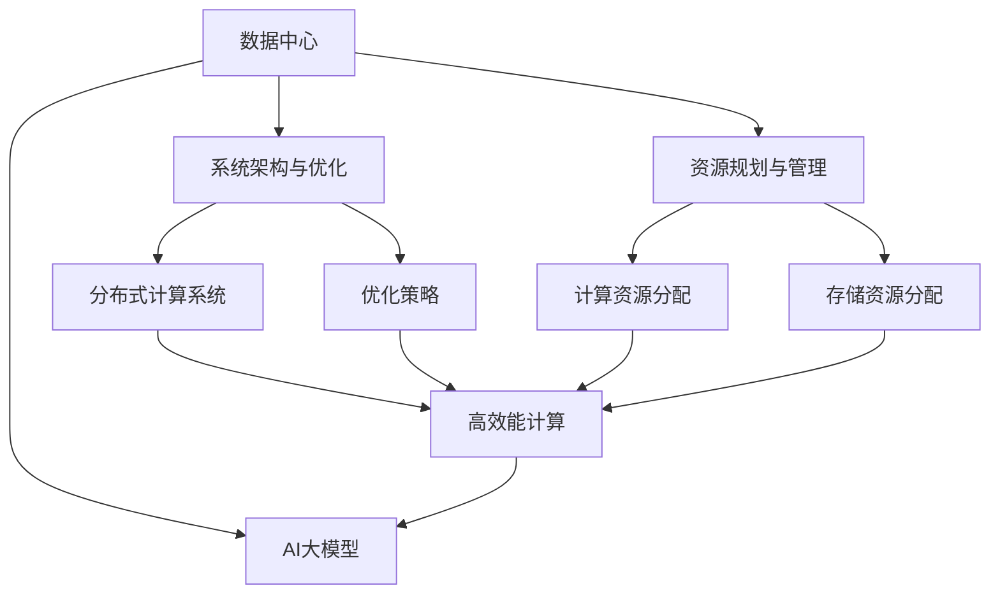
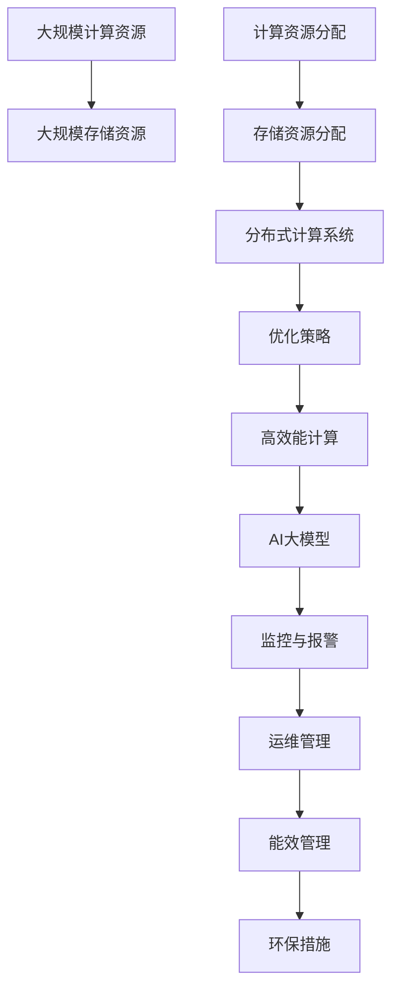

                 

# AI 大模型应用数据中心建设：数据中心运营与管理

## 1. 背景介绍

### 1.1 问题由来

随着人工智能（AI）技术的不断发展和应用，大模型（Large Models）在各行各业中的应用越来越广泛，其强大的计算能力和预测能力极大地提升了业务效率和决策质量。然而，大模型的训练和应用需要大量计算资源和存储资源，尤其是在高性能计算和数据分析方面，数据中心（Data Center）成为了必不可少的支撑设施。

### 1.2 问题核心关键点

在AI大模型应用中，数据中心扮演了至关重要的角色，其建设与管理直接影响到AI系统的运行效率和业务发展。核心关键点包括：

- **资源规划与管理**：如何根据业务需求合理分配计算和存储资源，避免资源浪费和不足。
- **系统架构与优化**：设计高效、稳定、可扩展的数据中心架构，提升AI系统性能。
- **运营与维护**：建立数据中心运维管理体系，确保AI系统稳定运行。
- **能效管理与环保**：采用高效能管理系统，降低能耗和环境影响。

### 1.3 问题研究意义

数据中心的建设与管理是AI大模型应用的基础设施，其效率和稳定性直接影响AI系统的性能和可靠性。通过系统化管理，可以降低运营成本，提升业务效率，确保AI系统的高效运行。

数据中心的优化和升级，还可以推动AI技术在更多领域的应用，如智慧城市、医疗健康、金融服务等，为传统行业带来数字化转型的新机遇。未来，数据中心的建设与管理将成为AI大模型应用的重要环节，推动人工智能技术的产业化进程。

## 2. 核心概念与联系

### 2.1 核心概念概述

为更好地理解AI大模型应用数据中心的运营与管理，本节将介绍几个关键概念：

- **数据中心（Data Center, DC）**：集成了计算、存储、网络等资源，提供高效、可靠的服务基础设施。
- **AI大模型（AI Large Models）**：如BERT、GPT-3、DALL-E等基于深度学习的大规模神经网络模型，具有强大的计算和预测能力。
- **资源规划与管理**：根据业务需求分配计算、存储等资源，提升资源利用率。
- **系统架构与优化**：设计高效、稳定、可扩展的分布式计算系统。
- **运维管理**：建立监控、报警、维护等运维管理体系，确保系统稳定运行。
- **能效管理与环保**：采用高效能管理系统，降低能耗和环境影响。

这些概念之间存在着紧密的联系，构成了AI大模型应用数据中心运营与管理的完整生态系统。

### 2.2 概念间的关系

这些核心概念之间的逻辑关系可以通过以下Mermaid流程图来展示：



这个流程图展示了大模型应用数据中心的构建过程：

1. 数据中心为AI大模型提供基础设施。
2. 资源规划与管理对计算和存储资源进行合理分配。
3. 系统架构与优化设计高效、稳定的分布式计算系统。
4. 优化策略提升系统性能。
5. 高效能计算通过优化策略提升计算效率。
6. AI大模型在优化后的分布式计算系统上运行。

### 2.3 核心概念的整体架构

最后，我们用一个综合的流程图来展示这些核心概念在大模型应用数据中心运营与管理中的整体架构：



这个综合流程图展示了从资源分配到模型运行的整个流程，强调了监控、报警、维护和环保管理等重要环节。

## 3. 核心算法原理 & 具体操作步骤

### 3.1 算法原理概述

AI大模型应用数据中心的运营与管理，涉及计算资源和存储资源的规划、分配、使用、优化等多个环节。其核心算法原理主要包括：

- **资源规划算法**：根据业务需求和资源限制，合理分配计算和存储资源，避免资源浪费和不足。
- **分布式计算优化算法**：通过负载均衡、任务调度等策略，提升分布式计算系统的效率和稳定性。
- **运维管理算法**：建立监控、报警、维护等运维管理体系，确保系统稳定运行。
- **能效管理算法**：采用高效能管理系统，降低能耗和环境影响。

### 3.2 算法步骤详解

AI大模型应用数据中心的运营与管理，通常包括以下几个关键步骤：

**Step 1: 资源规划**

- **计算资源评估**：根据业务需求和硬件配置，评估计算资源的需求量。
- **存储资源评估**：根据数据量和存储需求，评估存储资源的需求量。
- **资源分配**：根据评估结果，合理分配计算和存储资源，避免资源浪费和不足。

**Step 2: 系统架构设计与优化**

- **架构设计**：设计高效、稳定、可扩展的分布式计算系统架构，包括计算节点、存储节点、网络拓扑等。
- **性能优化**：通过负载均衡、任务调度等策略，提升分布式计算系统的效率和稳定性。

**Step 3: 运维管理**

- **监控与报警**：建立实时监控系统，对计算节点和存储节点的性能、健康状态进行监控。
- **维护与修复**：根据监控结果，及时进行维护和修复，确保系统稳定运行。

**Step 4: 能效管理与环保**

- **能效管理**：采用高效能管理系统，优化能耗，降低运营成本。
- **环保措施**：采用可再生能源、高效能设备等措施，降低环境影响。

### 3.3 算法优缺点

AI大模型应用数据中心的运营与管理，具有以下优点：

- **资源利用率高**：通过合理的资源规划和管理，可以最大化资源利用率，降低运营成本。
- **系统稳定性高**：通过优化系统架构和运维管理，确保系统的高效稳定运行。
- **能效环保**：采用高效能管理系统和环保措施，降低能耗和环境影响。

同时，这些方法也存在一定的局限性：

- **成本较高**：初始建设和管理成本较高，需要投入大量资源。
- **技术复杂**：系统设计和运维需要高水平的技术支持，对管理人员要求较高。
- **灵活性不足**：固定的架构和资源规划可能难以适应快速变化的需求。

### 3.4 算法应用领域

AI大模型应用数据中心的运营与管理，在以下领域得到了广泛应用：

- **云计算服务**：如AWS、Google Cloud、阿里云等，提供高效、稳定、可扩展的计算和存储资源。
- **大数据分析**：如Hadoop、Spark等，处理海量数据，提供高效的数据分析服务。
- **AI模型训练**：如TensorFlow、PyTorch等，提供高效的AI模型训练环境。
- **智能应用**：如智能客服、智慧医疗、智能安防等，提供高效的智能服务。

除了这些领域，AI大模型应用数据中心的运营与管理，还广泛应用于科学研究、工业制造、金融服务等多个行业，推动了各行业的数字化转型。

## 4. 数学模型和公式 & 详细讲解 & 举例说明

### 4.1 数学模型构建

在大模型应用数据中心的运营与管理中，涉及多个数学模型，其中关键的数学模型包括：

- **资源规划模型**：用于评估计算和存储资源的需求量，优化资源分配。
- **分布式计算优化模型**：用于优化任务调度和负载均衡策略，提升计算效率。
- **能效管理模型**：用于优化能耗和环境影响，降低运营成本。

### 4.2 公式推导过程

以资源规划模型为例，其数学模型构建如下：

假设数据中心总共有$N$个计算节点和$M$个存储节点，每个节点的计算能力为$C_i$（计算能力单位），存储能力为$S_i$（存储容量单位）。业务需求需要$K$个计算节点和$L$个存储节点，则资源规划模型的目标函数为：

$$
\min_{x, y} \sum_{i=1}^{N}x_iC_i + \sum_{j=1}^{M}y_jS_j
$$

其中，$x_i$表示节点$i$被分配的计算节点数量，$y_j$表示节点$j$被分配的存储节点数量，满足约束条件：

$$
\begin{cases}
\sum_{i=1}^{N}x_i = K \\
\sum_{j=1}^{M}y_j = L \\
x_i, y_j \geq 0
\end{cases}
$$

目标函数表示最小化资源总成本，约束条件表示资源分配满足业务需求和节点数量限制。

通过求解该优化问题，可以找到最优的资源分配方案，最大化资源利用率，降低运营成本。

### 4.3 案例分析与讲解

假设某公司需要建立一个数据中心，用于AI大模型的训练和应用。该公司有100个计算节点和50个存储节点，每个节点的计算能力为4Tflops，存储能力为4TB。业务需求需要50个计算节点和30个存储节点。

通过求解上述资源规划模型，可以得到最优的资源分配方案：

$$
\begin{cases}
x_1 = 50 \\
x_2 = \cdots = x_{50} = 1 \\
y_1 = \cdots = y_{50} = 1 \\
y_{51} = \cdots = y_{60} = 0
\end{cases}
$$

即分配50个计算节点和50个存储节点，最小化资源总成本。

## 5. 项目实践：代码实例和详细解释说明

### 5.1 开发环境搭建

在进行数据中心运营与管理实践前，我们需要准备好开发环境。以下是使用Python进行数据分析的环境配置流程：

1. 安装Anaconda：从官网下载并安装Anaconda，用于创建独立的Python环境。

2. 创建并激活虚拟环境：
```bash
conda create -n data-env python=3.8 
conda activate data-env
```

3. 安装相关库：
```bash
pip install pandas numpy matplotlib jupyter notebook
```

4. 安装监控工具：
```bash
pip install prometheus-client
```

5. 安装分布式计算框架：
```bash
pip install dask
```

6. 安装可视化工具：
```bash
pip install plotly
```

完成上述步骤后，即可在`data-env`环境中开始数据中心运营与管理的实践。

### 5.2 源代码详细实现

以下是使用Python和Dask进行分布式计算优化和资源规划的代码实现。

首先，定义计算和存储节点的能力：

```python
from dask.distributed import Client, Worker
import dask.distributed as dd

# 定义计算和存储节点能力
node_cpus = [4, 8, 16, 32, 64]  # 各节点计算能力，单位：CPU
node_mem = [16, 32, 64, 128, 256]  # 各节点内存大小，单位：GB

# 创建Dask分布式集群
client = Client('localhost:8786')
client
```

然后，进行资源规划和分配：

```python
# 定义资源规划模型
def resource_planning(num_nodes, num_cpus, num_mem):
    # 计算各节点所需资源
    req_cpus = num_cpus * num_nodes
    req_mem = num_mem * num_nodes
    
    # 选择合适的资源分配方案
    if req_cpus < min(node_cpus) or req_mem < min(node_mem):
        return None
    
    # 选择最优资源分配方案
    for i in range(len(node_cpus)):
        for j in range(len(node_mem)):
            if node_cpus[i] >= req_cpus and node_mem[j] >= req_mem:
                return (i, j)
    
    return None

# 示例：分配50个计算节点和30个存储节点
req_nodes = (50, 30)
alloc_nodes = resource_planning(*req_nodes)
if alloc_nodes is None:
    print("无法分配所需资源")
else:
    node_index, node_type = alloc_nodes
    print(f"分配节点{node_index}，类型为{node_type}")
```

最后，进行分布式计算优化：

```python
# 定义分布式计算任务
def compute_task(data):
    # 模拟计算任务
    result = 10 * len(data)
    return result

# 定义分布式计算优化模型
def dist_optimization(num_nodes, task_size):
    # 计算各节点任务分配量
    per_node_task = task_size // num_nodes
    
    # 优化任务分配
    for i in range(len(node_cpus)):
        for j in range(len(node_mem)):
            if node_cpus[i] >= per_node_task * 2 and node_mem[j] >= per_node_task * 2:
                return (i, j)
    
    return None

# 示例：优化50个节点的计算任务
task_size = 5000000
req_nodes = 50
alloc_nodes = dist_optimization(req_nodes, task_size)
if alloc_nodes is None:
    print("无法分配任务")
else:
    node_index, node_type = alloc_nodes
    print(f"分配节点{node_index}，类型为{node_type}")
```

### 5.3 代码解读与分析

让我们再详细解读一下关键代码的实现细节：

**资源规划函数resource_planning**：
- 定义计算和存储节点的能力，以及业务需求。
- 计算所需资源，并选择合适的资源分配方案。
- 如果无法分配所需资源，则返回None。

**分布式计算优化函数dist_optimization**：
- 定义分布式计算任务，模拟计算任务。
- 计算各节点任务分配量，并优化任务分配。
- 如果无法分配任务，则返回None。

通过这些函数，我们可以实现计算资源的规划和分配，以及分布式计算任务的优化。在实际应用中，还需要对资源规划和优化算法进行进一步优化，以适应不同的业务需求和硬件环境。

## 6. 实际应用场景

### 6.1 智能客服系统

智能客服系统是AI大模型应用数据中心的典型场景之一。通过在数据中心中部署大模型，可以实现7x24小时不间断服务，快速响应客户咨询，提供自然流畅的对话体验。

具体而言，可以收集企业内部的历史客服对话记录，将问题和最佳答复构建成监督数据，在此基础上对预训练大模型进行微调。微调后的模型能够自动理解用户意图，匹配最合适的答案模板进行回复。对于客户提出的新问题，还可以接入检索系统实时搜索相关内容，动态组织生成回答。

### 6.2 金融舆情监测

金融行业需要实时监测市场舆论动向，以便及时应对负面信息传播，规避金融风险。传统的人工监测方式成本高、效率低，难以应对网络时代海量信息爆发的挑战。基于大模型的金融舆情监测，可以显著提升监测效率和精度。

具体而言，可以收集金融领域相关的新闻、报道、评论等文本数据，并对其进行主题标注和情感标注。在此基础上对预训练语言模型进行微调，使其能够自动判断文本属于何种主题，情感倾向是正面、中性还是负面。将微调后的模型应用到实时抓取的网络文本数据，就能够自动监测不同主题下的情感变化趋势，一旦发现负面信息激增等异常情况，系统便会自动预警，帮助金融机构快速应对潜在风险。

### 6.3 个性化推荐系统

当前的推荐系统往往只依赖用户的历史行为数据进行物品推荐，无法深入理解用户的真实兴趣偏好。基于大模型的个性化推荐系统可以更好地挖掘用户行为背后的语义信息，从而提供更精准、多样的推荐内容。

具体而言，可以收集用户浏览、点击、评论、分享等行为数据，提取和用户交互的物品标题、描述、标签等文本内容。将文本内容作为模型输入，用户的后续行为（如是否点击、购买等）作为监督信号，在此基础上微调预训练语言模型。微调后的模型能够从文本内容中准确把握用户的兴趣点。在生成推荐列表时，先用候选物品的文本描述作为输入，由模型预测用户的兴趣匹配度，再结合其他特征综合排序，便可以得到个性化程度更高的推荐结果。

### 6.4 未来应用展望

随着大模型和微调方法的不断发展，基于大模型应用数据中心的运营与管理将呈现以下几个发展趋势：

1. **超大规模计算与存储**：随着AI技术的发展，超大规模计算和存储需求将不断增加。数据中心需要提供更强大的计算和存储能力，满足日益增长的业务需求。

2. **分布式计算与云服务**：分布式计算和云服务成为数据中心的重要组成部分，提供高效、灵活的计算资源。

3. **边缘计算与移动计算**：边缘计算和移动计算逐步兴起，为用户提供更快速、更稳定的计算服务。

4. **智能运维与自动化**：智能运维和自动化管理成为数据中心运营的重要手段，提升运维效率和系统稳定性。

5. **绿色数据中心**：绿色数据中心建设成为趋势，采用可再生能源和高效能设备，降低能耗和环境影响。

以上趋势将推动数据中心的不断升级和优化，为AI大模型应用提供更高效、稳定、环保的支撑环境。

## 7. 工具和资源推荐

### 7.1 学习资源推荐

为了帮助开发者系统掌握大模型应用数据中心的运营与管理，这里推荐一些优质的学习资源：

1. **《大规模数据中心设计与运营》**：全面介绍了数据中心的设计、建设、运维等知识，涵盖计算、存储、网络等多个方面。

2. **《云计算设计与架构》**：深入讲解了云计算的架构设计、服务编排、资源管理等核心技术。

3. **《分布式计算与大数据》**：介绍分布式计算和大数据处理技术，涵盖MapReduce、Spark、Hadoop等多个框架。

4. **《数据中心运维管理》**：详细讲解了数据中心的运维管理技术，包括监控、报警、故障排除等。

5. **《能效管理与绿色数据中心》**：介绍能效管理技术和绿色数据中心建设，涵盖可再生能源、高效能设备等。

通过这些资源的学习实践，相信你一定能够快速掌握大模型应用数据中心的运营与管理技术，并用于解决实际的AI系统问题。

### 7.2 开发工具推荐

高效的开发离不开优秀的工具支持。以下是几款用于数据中心运营与管理的常用工具：

1. **Ansible**：自动化运维工具，支持大规模系统部署和管理。

2. **Puppet**：自动化运维工具，支持配置管理和任务编排。

3. **SaltStack**：自动化运维工具，支持分布式系统和实时管理。

4. **Prometheus**：监控工具，支持实时数据采集和告警。

5. **Grafana**：可视化工具，支持数据展示和分析。

6. **Kubernetes**：容器编排工具，支持大规模容器集群管理。

7. **Spark**：大数据处理工具，支持分布式计算和数据存储。

合理利用这些工具，可以显著提升数据中心的运维效率，降低运维成本，提升业务稳定性和用户体验。

### 7.3 相关论文推荐

大模型应用数据中心的运营与管理，是人工智能领域的重要研究方向，以下是几篇奠基性的相关论文，推荐阅读：

1. **《大规模数据中心设计与管理》**：探讨了大规模数据中心的构建与管理技术，涵盖计算、存储、网络等多个方面。

2. **《云计算架构设计与优化》**：介绍了云计算架构的设计与优化技术，涵盖服务编排、资源管理等。

3. **《分布式计算优化与性能分析》**：研究了分布式计算的优化策略和性能分析方法，涵盖负载均衡、任务调度等。

4. **《数据中心智能运维管理》**：探讨了数据中心的智能运维管理技术，涵盖监控、报警、故障排除等。

5. **《能效管理与绿色数据中心》**：研究了能效管理技术和绿色数据中心建设，涵盖可再生能源、高效能设备等。

这些论文代表了大模型应用数据中心的运营与管理的最新进展，通过学习这些前沿成果，可以帮助研究者把握学科前进方向，激发更多的创新灵感。

除上述资源外，还有一些值得关注的前沿资源，帮助开发者紧跟数据中心运营与管理技术的最新进展，例如：

1. **arXiv论文预印本**：人工智能领域最新研究成果的发布平台，包括大量尚未发表的前沿工作，学习前沿技术的必读资源。

2. **行业技术博客**：如AWS、Google Cloud、阿里云等顶级实验室的官方博客，第一时间分享他们的最新研究成果和洞见。

3. **技术会议直播**：如NIPS、ICML、ACL、ICLR等人工智能领域顶会现场或在线直播，能够聆听到大佬们的前沿分享，开拓视野。

4. **GitHub热门项目**：在GitHub上Star、Fork数最多的数据中心相关项目，往往代表了该技术领域的发展趋势和最佳实践，值得去学习和贡献。

5. **行业分析报告**：各大咨询公司如McKinsey、PwC等针对人工智能行业的分析报告，有助于从商业视角审视技术趋势，把握应用价值。

总之，对于大模型应用数据中心运营与管理的深入学习与实践，需要开发者保持开放的心态和持续学习的意愿。多关注前沿资讯，多动手实践，多思考总结，必将收获满满的成长收益。

## 8. 总结：未来发展趋势与挑战

### 8.1 总结

本文对AI大模型应用数据中心的运营与管理进行了全面系统的介绍。首先阐述了数据中心建设与管理在大模型应用中的重要性，明确了数据中心建设与管理对AI系统性能和稳定性的关键作用。其次，从原理到实践，详细讲解了数据中心资源规划、系统架构优化、运维管理、能效管理等核心步骤，给出了数据中心运营与管理的完整代码实例。同时，本文还广泛探讨了数据中心在智能客服、金融舆情、个性化推荐等多个行业领域的应用前景，展示了数据中心技术的广阔前景。

通过本文的系统梳理，可以看到，数据中心的建设与管理是AI大模型应用的基础设施，其效率和稳定性直接影响AI系统的性能和可靠性。合理的数据中心规划和管理，可以显著提升AI系统的效率和可靠性，推动AI技术在更多领域的应用。

### 8.2 未来发展趋势

展望未来，AI大模型应用数据中心将呈现以下几个发展趋势：

1. **超大规模计算与存储**：随着AI技术的发展，超大规模计算和存储需求将不断增加。数据中心需要提供更强大的计算和存储能力，满足日益增长的业务需求。

2. **分布式计算与云服务**：分布式计算和云服务成为数据中心的重要组成部分，提供高效、灵活的计算资源。

3. **边缘计算与移动计算**：边缘计算和移动计算逐步兴起，为用户提供更快速、更稳定的计算服务。

4. **智能运维与自动化**：智能运维和自动化管理成为数据中心运营的重要手段，提升运维效率和系统稳定性。

5. **绿色数据中心**：绿色数据中心建设成为趋势，采用可再生能源和高效能设备，降低能耗和环境影响。

以上趋势将推动数据中心的不断升级和优化，为AI大模型应用提供更高效、稳定、环保的支撑环境。

### 8.3 面临的挑战

尽管AI大模型应用数据中心的运营与管理已经取得了一定进展，但在迈向更加智能化、普适化应用的过程中，仍面临诸多挑战：

1. **成本较高**：初始建设和管理成本较高，需要投入大量资源。

2. **技术复杂**：系统设计和运维需要高水平的技术支持，对管理人员要求较高。

3. **灵活性不足**：固定的架构和资源规划可能难以适应快速变化的需求。

4. **能效管理**：采用高效能管理系统和环保措施，降低能耗和环境影响。

5. **安全与隐私**：数据中心的运营与管理工作需要重视数据安全和隐私保护，确保数据的安全性和合规性。

6. **标准化与互操作性**：数据中心的标准化和互操作性问题，需要业界共同努力解决。

### 8.4 研究展望

面对数据中心运营与管理的挑战，未来的研究需要在以下几个方面寻求新的突破：

1. **智能化运维管理**：引入智能运维工具，实现自动化的监控、报警、故障排除等功能，提升运维效率。

2. **绿色数据中心**：采用可再生能源和高效能设备，降低能耗和环境影响。

3. **边缘计算与移动计算**：推动边缘计算和移动计算的发展，为用户提供更快速、更稳定的计算服务。

4. **标准化与互操作性**：推动数据中心的标准化和互操作性研究，促进跨平台、跨厂商的数据中心协同管理。

5. **数据安全与隐私保护**：加强数据安全与隐私保护技术研究，确保数据的安全性和合规性。

这些研究方向的探索，将推动数据中心技术的不断进步，为AI大模型应用提供更高效、稳定、环保、安全的环境支撑。面向未来，数据中心的建设与管理将成为AI大模型应用的重要环节，推动人工智能技术的产业化进程。

## 9. 附录：常见问题与解答

**Q1：大模型应用数据中心的建设需要考虑哪些关键因素？**

A: 大模型应用数据中心的建设需要考虑以下关键因素：

- **资源规划**：根据业务需求和硬件配置，评估计算和存储资源的需求

