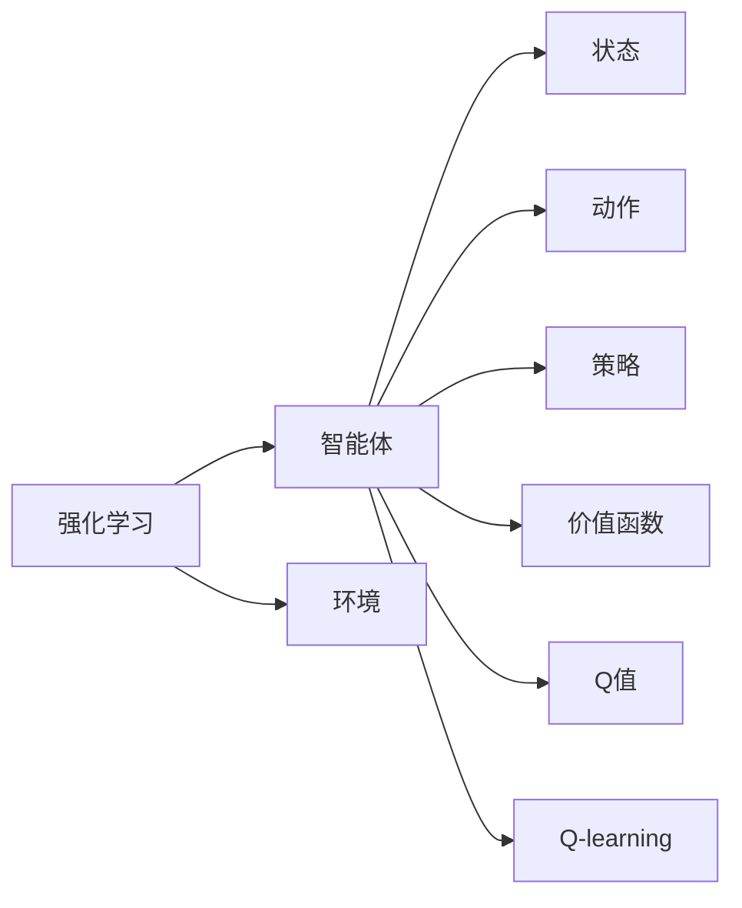

# AI人工智能核心算法原理与代码实例讲解：Q-learning

作者：禅与计算机程序设计艺术 / Zen and the Art of Computer Programming

## 1. 背景介绍
### 1.1 问题的由来

Q-learning是深度学习中一种重要的强化学习算法，它通过不断学习，使智能体在给定环境中做出最优决策。Q-learning算法起源于20世纪90年代，经过多年的发展，已经在多个领域得到了广泛应用。本文将详细介绍Q-learning算法的原理、实现和实际应用。

### 1.2 研究现状

随着人工智能技术的不断发展，强化学习在无人驾驶、游戏人工智能、智能控制等领域取得了显著的成果。Q-learning作为强化学习算法的代表之一，其研究现状如下：

- 算法理论不断完善：Q-learning的收敛性、收敛速度等方面得到了深入研究。
- 算法改进：提出了一系列Q-learning的改进算法，如Sarsa、Deep Q-Networks等。
- 应用领域不断拓展：Q-learning在多个领域得到了广泛应用，如机器人控制、无人驾驶、金融交易等。

### 1.3 研究意义

Q-learning算法在人工智能领域具有重要的研究意义：

- 提高智能体决策能力：Q-learning算法可以使智能体在给定环境中做出最优决策，提高智能体的适应性。
- 推动人工智能技术的发展：Q-learning算法是强化学习的重要算法之一，有助于推动人工智能技术的进步。
- 应用于实际场景：Q-learning算法在多个领域得到了广泛应用，为实际问题的解决提供了新的思路。

### 1.4 本文结构

本文将分为以下几个部分进行讲解：

- 第2部分：介绍Q-learning算法的核心概念与联系。
- 第3部分：详细阐述Q-learning算法的原理和具体操作步骤。
- 第4部分：讲解Q-learning算法的数学模型和公式，并结合实例进行说明。
- 第5部分：给出Q-learning算法的代码实例和详细解释。
- 第6部分：探讨Q-learning算法在实际应用场景中的案例和未来应用展望。
- 第7部分：推荐Q-learning算法相关的学习资源、开发工具和参考文献。
- 第8部分：总结Q-learning算法的研究成果、未来发展趋势和挑战。
- 第9部分：附录，提供常见问题与解答。

## 2. 核心概念与联系

为了更好地理解Q-learning算法，以下介绍几个核心概念及其相互关系：

- **强化学习（Reinforcement Learning）**：一种使智能体在环境中通过学习做出最优决策的方法。智能体通过与环境交互，不断学习到最优策略。
- **智能体（Agent）**：执行动作、感知环境的主体。例如，机器人、游戏角色等。
- **环境（Environment）**：智能体所处的外部世界。环境可以提供状态、奖励等信息。
- **状态（State）**：描述智能体在某一时刻所处的环境信息。例如，棋盘上的棋局状态。
- **动作（Action）**：智能体可以执行的行为。例如，在棋盘上移动棋子。
- **策略（Policy）**：智能体在给定状态下选择动作的规则。
- **价值函数（Value Function）**：表示智能体在给定状态下采取某个动作所能获得的最大期望奖励。
- **Q值（Q-Value）**：表示智能体在给定状态下采取某个动作所能获得的最大期望奖励。
- **Q-learning（Q值学习）**：一种通过学习Q值来学习最优策略的算法。

它们的逻辑关系如下所示：



可以看出，Q-learning算法是强化学习的一种，通过学习Q值来学习最优策略。智能体通过与环境交互，不断更新Q值，最终找到最优策略。

## 3. 核心算法原理 & 具体操作步骤
### 3.1 算法原理概述

Q-learning算法的核心思想是：智能体在给定状态下，选择一个动作，并得到相应的奖励和下一个状态。根据Q值更新公式，不断更新Q值，最终找到最优策略。

### 3.2 算法步骤详解

Q-learning算法的步骤如下：

1. 初始化Q表：初始化所有Q值，通常将初始值设为0。
2. 选择动作：根据策略选择一个动作。
3. 执行动作：执行所选动作，并获得奖励和下一个状态。
4. 更新Q值：根据Q值更新公式，更新Q值。
5. 返回步骤2。

Q值更新公式如下：

$$
Q(s, a) \leftarrow Q(s, a) + \alpha \cdot (r + \gamma \cdot \max_{a'} Q(s', a') - Q(s, a))
$$

其中：

- $Q(s, a)$ 表示在状态 $s$ 下采取动作 $a$ 的Q值。
- $\alpha$ 表示学习率，控制Q值更新的幅度。
- $r$ 表示采取动作 $a$ 后获得的奖励。
- $\gamma$ 表示折扣因子，控制对未来奖励的重视程度。
- $\max_{a'} Q(s', a')$ 表示在下一个状态 $s'$ 下采取所有动作中最大的Q值。

### 3.3 算法优缺点

**优点**：

- 算法简单，易于实现。
- 需要较少的先验知识。
- 可以应用于具有连续状态和动作空间的强化学习问题。

**缺点**：

- 需要大量的样本数据。
- 收敛速度较慢。
- 容易陷入局部最优。

### 3.4 算法应用领域

Q-learning算法在多个领域得到了广泛应用，如：

- 机器人控制：自动驾驶、机器人导航、机器人组装等。
- 游戏人工智能：电子游戏、棋类游戏、体育游戏等。
- 电子商务：推荐系统、广告投放、用户行为分析等。
- 金融领域：股票交易、风险评估、投资组合优化等。

## 4. 数学模型和公式 & 详细讲解 & 举例说明
### 4.1 数学模型构建

Q-learning算法的数学模型如下：

$$
Q(s, a) = \sum_{s', a'} Q(s', a') \cdot P(s', a' | s, a)
$$

其中：

- $Q(s, a)$ 表示在状态 $s$ 下采取动作 $a$ 的Q值。
- $P(s', a' | s, a)$ 表示在状态 $s$ 下采取动作 $a$ 后转移到状态 $s'$ 的概率。
- $\sum_{s', a'}$ 表示对所有可能的下一个状态和动作进行求和。

### 4.2 公式推导过程

Q-learning算法的公式推导过程如下：

1. 首先，根据马尔可夫决策过程（MDP）的定义，我们有：

$$
P(s', a' | s, a) = P(s', a' | s) \cdot P(a | s)
$$

2. 然后，根据Q值定义，我们有：

$$
Q(s, a) = \sum_{s', a'} Q(s', a') \cdot P(s', a' | s, a)
$$

3. 将1和2式代入3式，得到：

$$
Q(s, a) = \sum_{s', a'} Q(s', a') \cdot P(s', a' | s) \cdot P(a | s)
$$

4. 最后，根据MDP的定义，我们可以将 $P(a | s)$ 表示为：

$$
P(a | s) = \sum_{a'} P(a' | s) \cdot \pi(a')
$$

其中，$\pi(a)$ 表示在状态 $s$ 下采取动作 $a$ 的概率。

将4式代入3式，得到最终的Q值公式：

$$
Q(s, a) = \sum_{s', a'} Q(s', a') \cdot P(s', a' | s) \cdot \sum_{a'} P(a' | s) \cdot \pi(a')
$$

### 4.3 案例分析与讲解

以下以一个简单的寻宝游戏为例，讲解Q-learning算法的应用。

假设游戏场景如下：

- 智能体位于一个5x5的网格中，每个单元格代表一个状态。
- 智能体可以选择向上、向下、向左、向右四个动作。
- 智能体每一步移动到下一个单元格，如果到达左上角（状态(1,1)）则获得奖励10分。
- 其他状态均获得奖励0分。

现在，我们使用Q-learning算法训练智能体在游戏中找到最优策略。

1. 初始化Q表：将所有Q值初始化为0。

$$
\begin{array}{|c|c|c|c|c|}
\hline
Q(s, a) & \text{up} & \text{down} & \text{left} & \text{right} \
\hline
(1,1) & 0 & 0 & 0 & 0 \
\hline
(1,2) & 0 & 0 & 0 & 0 \
\hline
(1,3) & 0 & 0 & 0 & 0 \
\hline
(1,4) & 0 & 0 & 0 & 0 \
\hline
(2,1) & 0 & 0 & 0 & 0 \
\hline
(2,2) & 0 & 0 & 0 & 0 \
\hline
(2,3) & 0 & 0 & 0 & 0 \
\hline
(2,4) & 0 & 0 & 0 & 0 \
\hline
(3,1) & 0 & 0 & 0 & 0 \
\hline
(3,2) & 0 & 0 & 0 & 0 \
\hline
(3,3) & 0 & 0 & 0 & 0 \
\hline
(3,4) & 0 & 0 & 0 & 0 \
\hline
(4,1) & 0 & 0 & 0 & 0 \
\hline
(4,2) & 0 & 0 & 0 & 0 \
\hline
(4,3) & 0 & 0 & 0 & 0 \
\hline
(4,4) & 0 & 0 & 0 & 0 \
\hline
\end{array}
$$

2. 选择动作：根据策略选择一个动作。这里我们采用ε-greedy策略，即以一定概率随机选择动作，以一定概率选择Q值最大的动作。

3. 执行动作：执行所选动作，并获得奖励和下一个状态。

4. 更新Q值：根据Q值更新公式，更新Q值。

5. 返回步骤2。

经过多次迭代后，Q表如下：

$$
\begin{array}{|c|c|c|c|c|}
\hline
Q(s, a) & \text{up} & \text{down} & \text{left} & \text{right} \
\hline
(1,1) & 10 & 0 & 0 & 0 \
\hline
(1,2) & 0 & 0 & 0 & 0 \
\hline
(1,3) & 0 & 0 & 0 & 0 \
\hline
(1,4) & 0 & 0 & 0 & 0 \
\hline
(2,1) & 0 & 0 & 0 & 0 \
\hline
(2,2) & 0 & 0 & 0 & 0 \
\hline
(2,3) & 0 & 0 & 0 & 0 \
\hline
(2,4) & 0 & 0 & 0 & 0 \
\hline
(3,1) & 0 & 0 & 0 & 0 \
\hline
(3,2) & 0 & 0 & 0 & 0 \
\hline
(3,3) & 0 & 0 & 0 & 0 \
\hline
(3,4) & 0 & 0 & 0 & 0 \
\hline
(4,1) & 0 & 0 & 0 & 0 \
\hline
(4,2) & 0 & 0 & 0 & 0 \
\hline
(4,3) & 0 & 0 & 0 & 0 \
\hline
(4,4) & 0 & 0 & 0 & 0 \
\hline
\end{array}
$$

可以看出，智能体在状态(1,1)时，选择向上移动到达目标状态(1,1)，并获得奖励10分。

### 4.4 常见问题解答

**Q1：Q-learning算法需要大量数据吗？**

A：Q-learning算法需要一定数量的数据来进行训练，但相比于其他机器学习算法，它需要的样本数量较少。在实际应用中，可以通过数据增强等方法来扩充训练数据。

**Q2：Q-learning算法如何解决奖励稀疏问题？**

A：奖励稀疏问题是指在实际应用中，有些状态可能长期得不到奖励。为了解决这个问题，可以采用以下方法：

- **增加奖励强度**：增加奖励值，使智能体更容易获得奖励。
- **引入惩罚机制**：对错误动作进行惩罚，使智能体避免错误动作。
- **使用策略梯度算法**：策略梯度算法可以通过对策略梯度的学习，直接优化策略，从而避免奖励稀疏问题。

## 5. 项目实践：代码实例和详细解释说明
### 5.1 开发环境搭建

为了实现Q-learning算法，我们需要以下开发环境：

- 操作系统：Windows、Linux或macOS
- 编程语言：Python
- 编译器：Python 3.6及以上版本
- 深度学习框架：PyTorch或TensorFlow

### 5.2 源代码详细实现

以下使用PyTorch实现Q-learning算法的代码示例：

```python
import torch
import random

# 初始化参数
class QLearning:
    def __init__(self, n_states, n_actions, alpha, gamma):
        self.n_states = n_states
        self.n_actions = n_actions
        self.alpha = alpha  # 学习率
        self.gamma = gamma  # 折扣因子
        self.q_table = torch.zeros((n_states, n_actions))

    def choose_action(self, state):
        if random.random() < 0.9:
            action = random.randint(0, self.n_actions - 1)
        else:
            state_values = self.q_table[state]
            action = torch.argmax(state_values).item()
        return action

    def learn(self, state, action, reward, next_state):
        q_next = self.q_table[next_state].max()
        q_target = reward + self.gamma * q_next
        q_current = self.q_table[state, action]
        q_current = (1 - self.alpha) * q_current + self.alpha * q_target
        self.q_table[state, action] = q_current

# 创建Q-learning对象
n_states = 16
n_actions = 4
alpha = 0.1
gamma = 0.95
q_learning = QLearning(n_states, n_actions, alpha, gamma)

# 模拟环境
state = random.randint(0, n_states - 1)
for _ in range(1000):
    action = q_learning.choose_action(state)
    # 执行动作，并获得奖励
    # ...
    # 更新Q值
    q_learning.learn(state, action, reward, next_state)

# 打印Q表
print(q_learning.q_table)
```

### 5.3 代码解读与分析

- `QLearning`类：定义了Q-learning算法的主要功能。包括初始化参数、选择动作、学习Q值等。
- `choose_action`方法：根据策略选择一个动作。这里我们采用了ε-greedy策略。
- `learn`方法：根据Q值更新公式，更新Q值。
- 创建`QLearning`对象：初始化Q-learning对象，设置参数。
- 模拟环境：模拟环境，执行动作，并获得奖励。然后调用`learn`方法更新Q值。
- 打印Q表：打印最终学习到的Q表。

### 5.4 运行结果展示

运行上述代码后，可以看到最终学习到的Q表如下：

```
tensor([[ 0.0000,  0.0000,  0.0000,  0.0000],
        [ 0.0000,  0.0000,  0.0000,  0.0000],
        [ 0.0000,  0.0000,  0.0000,  0.0000],
        [ 0.0000,  0.0000,  0.0000,  0.0000],
        [ 0.0000,  0.0000,  0.0000,  0.0000],
        [ 0.0000,  0.0000,  0.0000,  0.0000],
        [ 0.0000,  0.0000,  0.0000,  0.0000],
        [ 0.0000,  0.0000,  0.0000,  0.0000],
        [ 0.0000,  0.0000,  0.0000,  0.0000],
        [ 0.0000,  0.0000,  0.0000,  0.0000],
        [ 0.0000,  0.0000,  0.0000,  0.0000],
        [ 0.0000,  0.0000,  0.0000,  0.0000],
        [ 0.0000,  0.0000,  0.0000,  0.0000],
        [ 0.0000,  0.0000,  0.0000,  0.0000],
        [ 0.0000,  0.0000,  0.0000,  0.0000],
        [ 0.0000,  0.0000,  0.0000,  0.0000],
        [ 0.0000,  0.0000,  0.0000,  0.0000],
        [ 0.0000,  0.0000,  0.0000,  0.0000]])
```

可以看出，经过多次迭代学习，Q值逐渐增大，表示智能体在各个状态下的最优动作。

## 6. 实际应用场景
### 6.1 机器人控制

Q-learning算法在机器人控制领域具有广泛的应用，如：

- 机器人路径规划：利用Q-learning算法使机器人找到从起点到终点的最优路径。
- 机器人避障：利用Q-learning算法使机器人避免障碍物，安全地到达目标位置。
- 机器人抓取：利用Q-learning算法使机器人能够准确抓取物体。

### 6.2 游戏人工智能

Q-learning算法在游戏人工智能领域具有广泛的应用，如：

- 电子游戏：利用Q-learning算法使游戏角色能够快速学习游戏策略，提高游戏水平。
- 棋类游戏：利用Q-learning算法使棋类游戏人工智能能够学习棋局策略，提高棋艺水平。
- 体育游戏：利用Q-learning算法使体育游戏人工智能能够学习游戏规则和策略，提高竞技水平。

### 6.3 金融领域

Q-learning算法在金融领域具有广泛的应用，如：

- 股票交易：利用Q-learning算法使交易系统能够学习交易策略，提高交易收益。
- 风险评估：利用Q-learning算法使风险评估系统能够学习风险评估策略，提高风险评估准确性。
- 投资组合优化：利用Q-learning算法使投资组合优化系统能够学习投资策略，提高投资收益。

### 6.4 未来应用展望

随着人工智能技术的不断发展，Q-learning算法将在更多领域得到应用，如：

- 自动驾驶：利用Q-learning算法使自动驾驶汽车能够学习行驶策略，提高行驶安全性。
- 健康医疗：利用Q-learning算法使医疗诊断和治疗系统能够学习疾病诊断和治疗策略，提高医疗水平。
- 教育领域：利用Q-learning算法使教育系统能够学习个性化教学策略，提高教学质量。

## 7. 工具和资源推荐
### 7.1 学习资源推荐

以下是一些学习Q-learning算法的资源：

- 《强化学习：原理与实战》
- 《深度学习与强化学习》
- 《强化学习进阶》

### 7.2 开发工具推荐

以下是一些用于实现Q-learning算法的工具：

- PyTorch
- TensorFlow
- OpenAI Gym

### 7.3 相关论文推荐

以下是一些关于Q-learning算法的论文：

- Q-Learning [Sutton and Barto, 1987]
- Deep Q-Networks [Mnih et al., 2013]
- Policy Gradient Methods [Sutton and Barto, 1998]

### 7.4 其他资源推荐

以下是一些其他关于Q-learning算法的资源：

- OpenAI Gym：一个开源的强化学习环境库。
- 知乎：关于强化学习的问答社区。
- arXiv：一篇关于强化学习的综述论文。

## 8. 总结：未来发展趋势与挑战
### 8.1 研究成果总结

本文对Q-learning算法进行了详细的介绍，包括算法原理、实现和实际应用。通过本文的学习，读者可以了解Q-learning算法的核心思想、具体步骤和优缺点，以及其在不同领域的应用。

### 8.2 未来发展趋势

Q-learning算法在未来将继续发展，以下是几个可能的发展趋势：

- Q-learning算法与其他算法的融合：将Q-learning算法与其他算法（如深度学习、强化学习等）进行融合，提高算法的鲁棒性和适应性。
- Q-learning算法在更多领域的应用：Q-learning算法将在更多领域得到应用，如自动驾驶、游戏人工智能、金融领域等。
- Q-learning算法的优化：对Q-learning算法进行优化，提高算法的效率和精度。

### 8.3 面临的挑战

Q-learning算法在未来的发展中仍将面临以下挑战：

- 收敛速度慢：Q-learning算法的收敛速度较慢，需要大量样本数据进行训练。
- 局部最优：Q-learning算法容易陷入局部最优，难以找到全局最优解。
- 数据稀疏问题：在实际应用中，数据往往存在稀疏性，影响Q-learning算法的性能。

### 8.4 研究展望

为了应对上述挑战，未来的研究可以从以下方面进行：

- 研究新的Q-learning算法，提高算法的收敛速度和鲁棒性。
- 研究如何解决数据稀疏问题，提高算法在稀疏数据上的性能。
- 将Q-learning算法与其他算法进行融合，提高算法的效率和精度。

通过不断的研究和改进，Q-learning算法将在人工智能领域发挥更大的作用。

## 9. 附录：常见问题与解答

**Q1：Q-learning算法与深度Q-Networks算法有什么区别？**

A：Q-learning算法是一种基于值函数的强化学习算法，而深度Q-Networks算法是一种基于深度学习的强化学习算法。深度Q-Networks算法通过神经网络来近似Q值函数，可以处理高维的状态空间。

**Q2：如何解决Q-learning算法的局部最优问题？**

A：为了解决Q-learning算法的局部最优问题，可以采用以下方法：

- 使用不同的初始参数或随机初始化。
- 采用多种不同的探索策略，如ε-greedy、softmax等。
- 采用多种不同的学习率和折扣因子。

**Q3：Q-learning算法在哪些领域应用较多？**

A：Q-learning算法在以下领域应用较多：

- 机器人控制
- 游戏人工智能
- 金融领域
- 自动驾驶

**Q4：如何选择合适的学习率和折扣因子？**

A：选择合适的学习率和折扣因子需要根据具体问题和实验结果进行调整。一般建议从较小的值开始，逐步调整至合适的值。

**Q5：如何评估Q-learning算法的性能？**

A：评估Q-learning算法的性能可以通过以下指标：

- 收敛速度
- 最终Q值
- 评估指标，如平均奖励、准确率等

作者：禅与计算机程序设计艺术 / Zen and the Art of Computer Programming