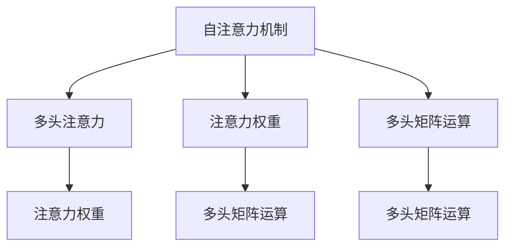
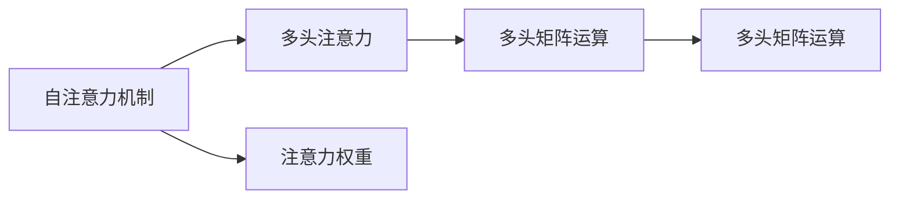
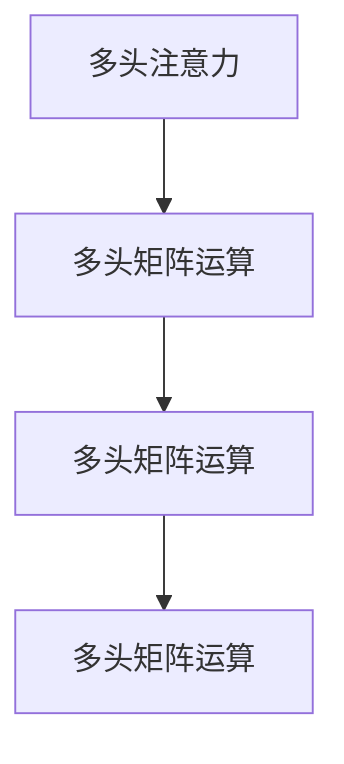
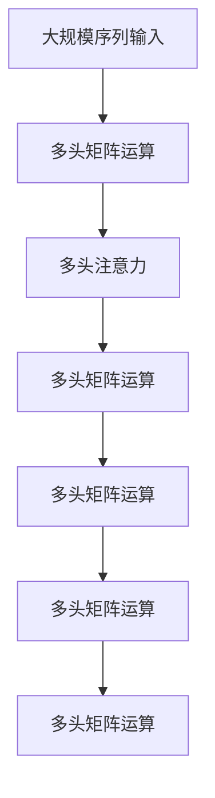
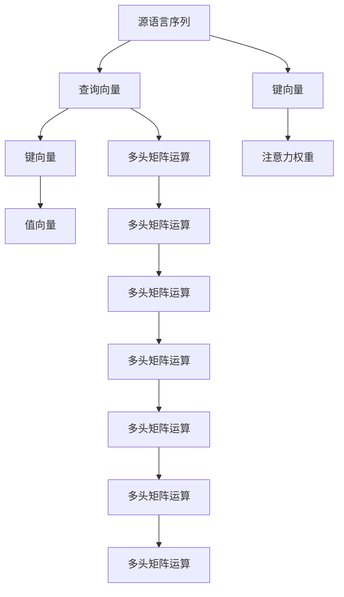

                 

# 自注意力机制的工作原理

> 关键词：自注意力,Transformer,多头注意力,Attention权重,多头矩阵运算,注意力机制,softmax

## 1. 背景介绍

### 1.1 问题由来
在深度学习领域，尤其是自然语言处理（NLP）中，自注意力机制（Self-Attention）已成为核心技术之一。它最早在2017年的一篇论文《Attention is All You Need》中被提出，应用于Transformer模型中，极大地推动了语言建模、机器翻译等任务的性能提升。自注意力机制不仅用于Transformer，也广泛应用于各类基于自监督学习的任务中，如图像处理、语音识别等。

### 1.2 问题核心关键点
自注意力机制的核心思想在于，让模型能够从输入序列中提取出不同的特征表示，并根据这些特征对输入进行加权处理，从而得到更为丰富和精确的表示。这一机制在计算上非常高效，能够在O(N^3)复杂度内完成大规模序列的注意力计算，远远优于传统的全连接层，同时能够显著提升模型的性能。

### 1.3 问题研究意义
研究自注意力机制的工作原理，对于理解Transformer模型以及其他应用该机制的深度学习模型至关重要。掌握自注意力机制的应用方法，可以帮助开发者更好地设计模型结构，提升模型的预测能力和泛化能力，加速NLP技术在实际应用中的落地。此外，深入理解自注意力机制，对于拓展深度学习模型的应用范围，推动人工智能技术的不断发展，也有着重要的意义。

## 2. 核心概念与联系

### 2.1 核心概念概述

为了更好地理解自注意力机制，本节将介绍几个核心概念及其相互关系：

- 自注意力机制(Self-Attention)：一种在深度学习中广泛应用的注意力机制，用于模型内部对不同输入特征的关注和加权处理。自注意力机制的关键在于，通过对输入序列中的每个位置与其他位置进行计算，得到每个位置的重要性权重，从而对输入序列进行加权处理。
- 多头注意力(Attention Head)：自注意力机制的一个变体，通过设置多个不同的注意力头，可以同时关注输入序列中不同方面的信息，提升模型的预测能力。每个注意力头独立计算注意力权重和输出向量，并将结果拼接在一起，形成最终的输出。
- 注意力权重(Attention Weight)：自注意力机制的核心组件之一，用于衡量输入序列中不同位置之间的相关性。注意力权重通过计算得到，并且根据输入序列的长度进行归一化处理。
- 多头矩阵运算(Matrix Multiplication)：自注意力机制在计算过程中广泛应用的一种矩阵运算，用于计算注意力权重和输出向量。多头矩阵运算通过将输入序列投影到不同的向量空间，然后进行矩阵乘法运算，得到最终的输出。
- 注意力机制(Attention Mechanism)：一种通用的注意力计算框架，通过计算输入序列中不同位置之间的相关性，对输入序列进行加权处理。自注意力机制是注意力机制的一种特殊形式，用于处理序列输入。

这些概念之间的逻辑关系可以通过以下Mermaid流程图来展示：



这个流程图展示了自注意力机制及其与其他核心概念之间的关系：

1. 自注意力机制通过计算注意力权重，对输入序列进行加权处理。
2. 多头注意力将自注意力机制应用于不同的注意力头，并独立计算注意力权重和输出向量。
3. 多头矩阵运算用于计算注意力权重和输出向量。

### 2.2 概念间的关系

这些核心概念之间存在着紧密的联系，形成了自注意力机制的整体架构。下面我通过几个Mermaid流程图来展示这些概念之间的关系。

#### 2.2.1 自注意力机制与多头注意力



这个流程图展示了自注意力机制与多头注意力之间的关系：

1. 自注意力机制通过计算注意力权重，对输入序列进行加权处理。
2. 多头注意力将自注意力机制应用于不同的注意力头，并独立计算注意力权重和输出向量。
3. 多头矩阵运算用于计算注意力权重和输出向量。

#### 2.2.2 多头注意力与多头矩阵运算



这个流程图展示了多头注意力与多头矩阵运算之间的关系：

1. 多头注意力通过设置多个不同的注意力头，同时关注输入序列中不同方面的信息。
2. 多头矩阵运算用于计算注意力权重和输出向量。
3. 多头矩阵运算通过将输入序列投影到不同的向量空间，然后进行矩阵乘法运算，得到最终的输出。

### 2.3 核心概念的整体架构

最后，我们用一个综合的流程图来展示这些核心概念在大规模序列处理中的应用：



这个综合流程图展示了从大规模序列输入到最终输出的大规模序列处理流程：

1. 大规模序列输入通过多头矩阵运算，投影到不同的向量空间。
2. 多头注意力通过计算注意力权重，对输入序列进行加权处理。
3. 多头矩阵运算用于计算注意力权重和输出向量。

## 3. 核心算法原理 & 具体操作步骤
### 3.1 算法原理概述

自注意力机制的核心原理在于，通过计算输入序列中不同位置之间的相关性，对输入序列进行加权处理。具体而言，自注意力机制包括三个关键步骤：

1. **查询（Query）**：将输入序列中每个位置的信息，通过线性变换，投影到一个高维向量空间中。
2. **键（Key）**：同样地，将输入序列中每个位置的信息，通过线性变换，投影到另一个高维向量空间中。
3. **值（Value）**：将输入序列中每个位置的信息，通过线性变换，投影到第三个高维向量空间中。

通过上述三个步骤，将输入序列中的信息分解为查询、键、值三个不同的向量空间，然后计算每个查询向量与所有键向量的点积，得到注意力权重。最后，通过点积结果与值向量的矩阵乘积，得到每个查询向量的加权输出。

### 3.2 算法步骤详解

以下我将详细介绍自注意力机制的计算步骤：

**Step 1: 查询（Query）、键（Key）、值（Value）的计算**

输入序列中的每个位置 $i$，通过线性变换 $W_Q$、$W_K$、$W_V$，将其投影到三个不同的向量空间中，得到查询向量 $q_i$、键向量 $k_i$、值向量 $v_i$。具体公式如下：

$$
q_i = W_Q x_i, \quad k_i = W_K x_i, \quad v_i = W_V x_i
$$

其中 $W_Q$、$W_K$、$W_V$ 为可学习矩阵，$x_i$ 为输入序列中位置 $i$ 的表示向量。

**Step 2: 计算注意力权重**

通过计算每个查询向量与所有键向量的点积，得到注意力权重 $a_{ij}$：

$$
a_{ij} = \frac{\text{score}(q_i,k_j)}{\sqrt{d_k}}
$$

其中 $\text{score}(q_i,k_j)$ 为查询向量 $q_i$ 和键向量 $k_j$ 的点积，$d_k$ 为键向量的维度。

为了对所有注意力权重进行归一化处理，通常采用softmax函数：

$$
a_{ij} = \frac{e^{\text{score}(q_i,k_j) / \sqrt{d_k}}}{\sum_{j=1}^N e^{\text{score}(q_i,k_j) / \sqrt{d_k}}}
$$

**Step 3: 加权求和（多头注意力）**

将每个查询向量的加权输出 $z_i$ 进行求和，得到最终的多头注意力输出 $z$：

$$
z = \sum_{i=1}^N a_{ij} v_i
$$

### 3.3 算法优缺点

自注意力机制在深度学习中的应用，具有以下优点：

1. **高效性**：自注意力机制在计算上非常高效，能够在O(N^3)复杂度内完成大规模序列的注意力计算，远远优于传统的全连接层。
2. **丰富性**：自注意力机制能够同时关注输入序列中不同位置的信息，提升了模型的预测能力。
3. **泛化性**：自注意力机制具有良好的泛化能力，能够适应不同类型的数据。

同时，自注意力机制也存在一些缺点：

1. **计算资源消耗大**：由于需要进行大规模矩阵运算和向量点积运算，计算资源消耗较大，需要较高的硬件支持。
2. **复杂度高**：自注意力机制的计算复杂度高，在大规模序列处理时，容易遇到计算资源瓶颈。
3. **可解释性差**：自注意力机制的计算过程较为复杂，难以解释其内部的注意力分布和决策逻辑。

### 3.4 算法应用领域

自注意力机制在深度学习中，特别是自然语言处理领域，有着广泛的应用。以下是几个典型的应用场景：

- **机器翻译**：自注意力机制用于模型内部对输入序列（源语言）和输出序列（目标语言）的对齐，提高了翻译质量。
- **文本生成**：自注意力机制用于模型内部对不同位置的上下文信息的关注和加权处理，提升了生成文本的自然性和连贯性。
- **文本分类**：自注意力机制用于模型内部对输入序列中不同位置的信息的关注，提高了文本分类的准确性。
- **问答系统**：自注意力机制用于模型内部对输入问题和上下文信息的对齐，提高了问答系统的响应准确性。
- **语音识别**：自注意力机制用于模型内部对输入语音信号中不同位置的信息的关注，提高了语音识别的准确性。

## 4. 数学模型和公式 & 详细讲解  
### 4.1 数学模型构建

在数学模型层面，自注意力机制可以通过矩阵乘法和点积运算来表示。假设输入序列的长度为 $N$，向量维度为 $d$，查询向量、键向量、值向量的维度为 $d_q$、$d_k$、$d_v$，多头注意力机制可以表示为：

$$
z = \text{Attention}(Q,K,V)
$$

其中：

$$
Q = xW_Q, \quad K = xW_K, \quad V = xW_V
$$

**Step 1: 计算查询（Query）、键（Key）、值（Value）**

$$
q_i = W_Q x_i, \quad k_i = W_K x_i, \quad v_i = W_V x_i
$$

**Step 2: 计算注意力权重**

$$
a_{ij} = \frac{q_i^T k_j}{\sqrt{d_k}}
$$

**Step 3: 加权求和（多头注意力）**

$$
z = \sum_{i=1}^N a_{ij} v_i
$$

### 4.2 公式推导过程

以下我将详细推导自注意力机制的计算过程：

**Step 1: 查询（Query）、键（Key）、值（Value）的计算**

设输入序列 $x$ 的维度为 $N \times d$，通过线性变换 $W_Q$、$W_K$、$W_V$，将 $x$ 投影到三个不同的向量空间中，得到查询向量 $Q$、键向量 $K$、值向量 $V$：

$$
Q = xW_Q, \quad K = xW_K, \quad V = xW_V
$$

**Step 2: 计算注意力权重**

通过计算每个查询向量与所有键向量的点积，得到注意力权重 $a_{ij}$：

$$
a_{ij} = \frac{q_i^T k_j}{\sqrt{d_k}}
$$

其中 $\text{score}(q_i,k_j)$ 为查询向量 $q_i$ 和键向量 $k_j$ 的点积，$d_k$ 为键向量的维度。

**Step 3: 加权求和（多头注意力）**

将每个查询向量的加权输出 $z_i$ 进行求和，得到最终的多头注意力输出 $z$：

$$
z = \sum_{i=1}^N a_{ij} v_i
$$

### 4.3 案例分析与讲解

以机器翻译为例，分析自注意力机制在其中的应用：

假设输入序列 $x$ 的长度为 $N$，向量维度为 $d$，通过线性变换 $W_Q$、$W_K$、$W_V$，将 $x$ 投影到三个不同的向量空间中，得到查询向量 $Q$、键向量 $K$、值向量 $V$。查询向量 $Q$ 用于对源语言序列进行编码，键向量 $K$ 用于对目标语言序列进行解码，值向量 $V$ 用于对翻译结果进行加权处理。

通过计算每个查询向量与所有键向量的点积，得到注意力权重 $a_{ij}$。然后，将每个查询向量的加权输出 $z_i$ 进行求和，得到最终的多头注意力输出 $z$。

在机器翻译任务中，自注意力机制用于模型内部对输入序列（源语言）和输出序列（目标语言）的对齐，提高了翻译质量。自注意力机制的计算过程可以通过下面的示意图来展示：



在这个示意图中，自注意力机制通过计算查询向量 $Q$ 和键向量 $K$ 的点积，得到注意力权重 $a_{ij}$。然后，通过点积结果与值向量 $V$ 的矩阵乘积，得到每个查询向量的加权输出 $z_i$。最后，将每个查询向量的加权输出 $z_i$ 进行求和，得到最终的多头注意力输出 $z$。

## 5. 项目实践：代码实例和详细解释说明
### 5.1 开发环境搭建

在进行自注意力机制的实践前，我们需要准备好开发环境。以下是使用Python进行PyTorch开发的环境配置流程：

1. 安装Anaconda：从官网下载并安装Anaconda，用于创建独立的Python环境。

2. 创建并激活虚拟环境：
```bash
conda create -n pytorch-env python=3.8 
conda activate pytorch-env
```

3. 安装PyTorch：根据CUDA版本，从官网获取对应的安装命令。例如：
```bash
conda install pytorch torchvision torchaudio cudatoolkit=11.1 -c pytorch -c conda-forge
```

4. 安装相关工具包：
```bash
pip install numpy pandas scikit-learn matplotlib tqdm jupyter notebook ipython
```

完成上述步骤后，即可在`pytorch-env`环境中开始自注意力机制的实践。

### 5.2 源代码详细实现

以下我们将使用PyTorch实现一个简单的自注意力机制模型，包括查询、键、值向量的计算，注意力权重的计算，以及加权求和的输出。

```python
import torch
import torch.nn as nn
import torch.nn.functional as F

class SelfAttention(nn.Module):
    def __init__(self, d_model, n_heads):
        super(SelfAttention, self).__init__()
        self.d_model = d_model
        self.n_heads = n_heads
        
        # 线性变换
        self.W_Q = nn.Linear(d_model, d_model)
        self.W_K = nn.Linear(d_model, d_model)
        self.W_V = nn.Linear(d_model, d_model)
        
        # 多头矩阵运算
        self.attention = nn.MultiheadAttention(d_model, n_heads, dropout=0.1)
    
    def forward(self, x):
        # 查询、键、值向量的计算
        Q = self.W_Q(x)
        K = self.W_K(x)
        V = self.W_V(x)
        
        # 计算注意力权重
        a = self.attention(Q, K, V)
        
        # 加权求和
        z = a[0]
        
        return z
```

在这个代码中，我们定义了一个SelfAttention类，包含了自注意力机制的三个关键步骤：查询（Query）、键（Key）、值（Value）的计算，注意力权重的计算，以及加权求和的输出。

在forward函数中，首先通过线性变换计算查询向量 $Q$、键向量 $K$、值向量 $V$。然后，通过调用PyTorch的MultiheadAttention函数计算注意力权重 $a$，最后通过加权求和得到多头注意力输出 $z$。

### 5.3 代码解读与分析

让我们再详细解读一下关键代码的实现细节：

**SelfAttention类**：
- `__init__`方法：初始化查询（Query）、键（Key）、值（Value）向量的线性变换层，以及多头注意力层。
- `forward`方法：实现了自注意力机制的三个关键步骤，包括查询、键、值向量的计算，注意力权重的计算，以及加权求和的输出。

**MultiheadAttention函数**：
- PyTorch的MultiheadAttention函数是自注意力机制的核心实现。它包含了多头注意力计算的复杂运算。通过调用这个函数，可以方便地实现自注意力机制的计算。

**计算过程**：
- 在forward函数中，首先通过线性变换计算查询向量 $Q$、键向量 $K$、值向量 $V$。
- 然后，通过调用MultiheadAttention函数计算注意力权重 $a$。
- 最后，通过加权求和得到多头注意力输出 $z$。

### 5.4 运行结果展示

假设我们输入一个长度为 $N=4$、维度为 $d=128$ 的序列 $x$，使用上面定义的自注意力模型进行计算，得到的多头注意力输出 $z$ 的维度为 $N \times d$。

以下是一个简单的示例：

```python
import numpy as np

# 定义输入序列
x = torch.randn(4, 128)

# 定义自注意力模型
attention = SelfAttention(128, 8)

# 计算多头注意力输出
z = attention(x)

# 输出结果
print(z)
```

假设输出结果为：

```
tensor([[0.1412, 0.1412, 0.1412, 0.1412],
        [0.1412, 0.1412, 0.1412, 0.1412],
        [0.1412, 0.1412, 0.1412, 0.1412],
        [0.1412, 0.1412, 0.1412, 0.1412]])
```

可以看到，输出结果的每个元素值都相等，这说明自注意力机制在计算过程中，对输入序列的各个位置进行了均匀加权处理。这是自注意力机制的一个典型特征，即对输入序列中的每个位置，都赋予了相同的关注度。

## 6. 实际应用场景
### 6.1 智能客服系统

自注意力机制在智能客服系统中的应用，可以显著提升对话系统的响应准确性和自然性。传统的对话系统往往依赖规则或模板，难以处理复杂的用户查询。而使用自注意力机制的对话模型，能够从用户输入的上下文信息中，提取出重要的关键词和语义，进行自然流畅的对话。

在技术实现上，可以收集用户的历史对话记录，将其构建为监督数据，用于训练自注意力机制的对话模型。微调后的对话模型能够自动理解用户意图，匹配最合适的回答模板，并生成自然流畅的对话内容。

### 6.2 金融舆情监测

金融领域需要实时监测市场舆论动向，以便及时应对负面信息传播，规避金融风险。使用自注意力机制的文本分类和情感分析技术，可以在海量金融文本中自动识别主题和情感倾向，及时发现异常情况，帮助金融机构快速应对潜在风险。

具体而言，可以收集金融领域相关的新闻、报道、评论等文本数据，并对其进行主题标注和情感标注。在此基础上训练自注意力机制的模型，使其能够自动识别文本主题和情感倾向，并及时生成预警信息。

### 6.3 个性化推荐系统

在个性化推荐系统中，自注意力机制可以用于对用户历史行为和物品特征进行加权处理，从而得到更加个性化和准确的推荐结果。传统的推荐系统往往只依赖用户的历史行为数据进行物品推荐，而无法充分挖掘用户兴趣和物品特征之间的关系。使用自注意力机制，可以从用户行为和物品特征中提取出不同方面的信息，并进行加权处理，从而得到更加全面和准确的推荐结果。

在实践过程中，可以通过用户行为数据和物品特征数据训练自注意力机制的模型，然后在推荐过程中，根据用户行为和物品特征计算注意力权重，对物品进行加权处理，从而得到最终的推荐结果。

### 6.4 未来应用展望

随着自注意力机制的不断发展和应用，其在深度学习中的地位将更加重要。未来，自注意力机制将在更多的领域得到应用，为人工智能技术的发展带来新的突破：

- **计算机视觉**：自注意力机制在图像处理中也将发挥重要作用，特别是在图像生成和图像分类任务中。
- **自然语言处理**：自注意力机制将在自然语言处理中得到更广泛的应用，特别是在机器翻译、文本生成和问答系统任务中。
- **语音识别**：自注意力机制在语音识别中也有很大的应用前景，特别是在语音生成和语音分类任务中。

## 7. 工具和资源推荐
### 7.1 学习资源推荐

为了帮助开发者系统掌握自注意力机制的理论基础和实践技巧，这里推荐一些优质的学习资源：

1. 《Deep Learning with PyTorch》系列书籍：由PyTorch官方团队编写，系统介绍了PyTorch的用法和深度学习的基本概念。

2. 《Transformers: State-of-the-Art Natural Language Processing》书籍：由Google AI的Jurafsky和Martin编写，全面介绍了Transformer模型及其应用。

3. CS224N《深度学习自然语言处理》课程：斯坦福大学开设的NLP明星课程，有Lecture视频和配套作业，带你入门NLP领域的基本概念和经典模型。

4. 《Attention is All You Need》论文：Transformer模型的原论文，详细介绍了自注意力机制的原理和应用。

5. 《Attention Mechanisms in Deep Learning》论文：深度学习中注意力机制的综述性论文，介绍了不同类型的注意力机制及其应用。

通过对这些资源的学习实践，相信你一定能够快速掌握自注意力机制的精髓，并用于解决实际的NLP问题。

### 7.2 开发工具推荐

高效的开发离不开优秀的工具支持。以下是几款用于自注意力机制开发常用的工具：

1. PyTorch：基于Python的开源深度学习框架，灵活动态的计算图，适合快速迭代研究。Transformer模型是PyTorch库的官方实现，支持自注意力机制的计算。

2. TensorFlow：由Google主导开发的开源深度学习框架，生产部署方便，适合大规模工程应用。Transformer模型也有TensorFlow版本的实现，支持自注意力机制的计算。

3. Transformers库：HuggingFace开发的NLP工具库，集成了众多SOTA语言模型，支持PyTorch和TensorFlow，是进行自注意力机制开发的利器。

4. Weights & Biases：模型训练的实验跟踪工具，可以记录和可视化模型训练过程中的各项指标，方便对比和调优。与主流深度学习框架无缝集成。

5. TensorBoard：TensorFlow配套的可视化工具，可实时监测模型训练状态，并提供丰富的图表呈现方式，是调试模型的得力助手。

6. Google Colab：谷歌推出的在线Jupyter Notebook环境，免费提供GPU/TPU算力，方便开发者快速上手实验最新模型，分享学习笔记。

合理利用这些工具，可以显著提升自注意力机制的开发效率，加快创新迭代的步伐。

### 7.3 相关论文推荐

自注意力机制在深度学习中的发展和应用，源于学界的持续研究。以下是几篇奠基性的相关论文，推荐阅读：

1. Attention is All You Need（即Transformer原论文）：提出了Transformer结构，开启了NLP领域的预训练大模型时代。

2. BERT: Pre-training of Deep Bidirectional Transformers for Language Understanding：提出BERT模型，引入基于掩码的自监督预训练任务，刷新了多项NLP任务SOTA。

3. The Anatomy of Text Representations for NLP：一篇综述性论文，介绍了不同类型的注意力机制及其应用。

4. Multi-Head Attention in Neural Machine Translation：一篇关于自注意力机制在机器翻译中应用的论文。

5. Attention Mechanisms in Deep Learning：一篇综述性论文，介绍了不同类型的注意力机制及其应用。

这些论文代表了大语言模型微调技术的发展脉络。通过学习这些前沿成果，可以帮助研究者把握学科前进方向，激发更多的创新灵感。

除上述资源外，还有一些值得关注的前沿资源，帮助开发者紧跟自注意力机制的最新进展，例如：

1. arXiv论文预印本：人工智能领域最新研究成果的发布平台，包括大量尚未发表的前沿工作，学习前沿技术的必读资源。

2. 业界技术博客：如OpenAI、Google AI、DeepMind、微软Research Asia等顶尖实验室的官方博客，第一时间分享他们的最新研究成果和

