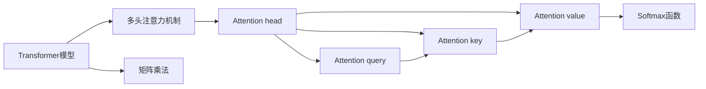
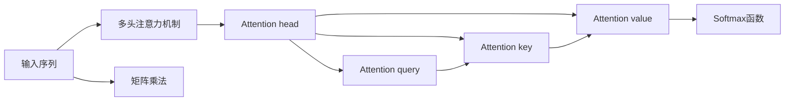
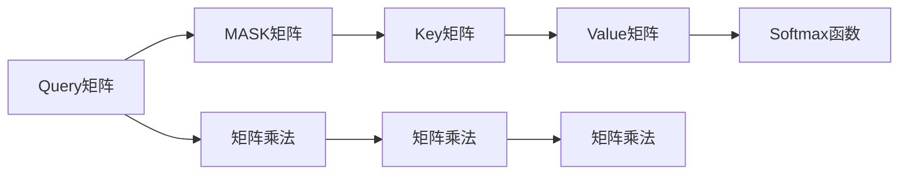

                 

# 自注意力机制的详细工作原理

> 关键词：自注意力,Transformer,Transformer模型,注意力机制,多头注意力,Self-Attention,多头注意力机制,Attention head,Attention query,Attention key,Attention value

## 1. 背景介绍

### 1.1 问题由来
在自然语言处理（Natural Language Processing, NLP）领域，随着深度学习技术的发展，模型的结构日益复杂，性能也不断提升。其中，自注意力机制（Self-Attention）在处理长文本序列和捕捉语义关系方面表现出色，已成为Transformer模型的核心组件。然而，对于自注意力机制的工作原理和实现细节，很多初学者和从业者仍然存在一定的疑惑。本文旨在深入剖析自注意力机制的工作原理，帮助读者理解其在Transformer模型中的实现和应用。

### 1.2 问题核心关键点
自注意力机制的核心在于通过计算输入序列中不同位置之间的注意力权重，从而实现不同位置之间的信息交互。其关键点包括：
1. **多头注意力机制**：将输入序列分成多个子序列，每个子序列通过多头自注意力机制进行计算。
2. **Attention head**：每个注意力头独立计算注意力权重，并处理注意力结果。
3. **Attention query**、**Attention key**、**Attention value**：分别代表查询向量、键向量和值向量，用于计算注意力权重和值向量。
4. **Softmax函数**：用于计算注意力权重，使得不同位置之间的注意力值可以归一化。
5. **矩阵乘法**：在自注意力计算中，通过矩阵乘法实现向量之间的交互和转换。

理解这些关键点将有助于深入掌握自注意力机制的工作原理。

## 2. 核心概念与联系

### 2.1 核心概念概述

为了更好地理解自注意力机制，我们首先介绍几个核心概念：

- **Transformer模型**：基于自注意力机制的深度学习模型，广泛应用于NLP领域。其核心思想是将输入序列转化为一系列“键-值-值”三元组，并通过多头自注意力机制进行信息交互。

- **注意力机制**：通过计算输入序列中不同位置之间的注意力权重，实现不同位置之间的信息交互。注意力权重越高，对应位置的贡献越大。

- **多头注意力机制**：将输入序列分成多个子序列，每个子序列通过多头自注意力机制进行计算。多头注意力机制可以并行计算，提高模型的计算效率。

- **Attention head**：每个注意力头独立计算注意力权重，并处理注意力结果。通常，Transformer模型会使用多个注意力头，以捕捉输入序列的不同语义信息。

- **Attention query**、**Attention key**、**Attention value**：分别代表查询向量、键向量和值向量，用于计算注意力权重和值向量。

- **Softmax函数**：用于计算注意力权重，使得不同位置之间的注意力值可以归一化。

- **矩阵乘法**：在自注意力计算中，通过矩阵乘法实现向量之间的交互和转换。

这些核心概念之间的逻辑关系可以通过以下Mermaid流程图来展示：



这个流程图展示了自注意力机制在大语言模型中的应用流程：

1. **多头注意力机制**：将输入序列分成多个子序列，每个子序列通过多头自注意力机制进行计算。
2. **Attention head**：每个注意力头独立计算注意力权重，并处理注意力结果。
3. **Attention query**、**Attention key**、**Attention value**：分别代表查询向量、键向量和值向量，用于计算注意力权重和值向量。
4. **Softmax函数**：用于计算注意力权重，使得不同位置之间的注意力值可以归一化。
5. **矩阵乘法**：在自注意力计算中，通过矩阵乘法实现向量之间的交互和转换。

### 2.2 概念间的关系

这些核心概念之间存在着紧密的联系，形成了自注意力机制的完整生态系统。下面我们通过几个Mermaid流程图来展示这些概念之间的关系。

#### 2.2.1 多头注意力机制



这个流程图展示了多头注意力机制的基本原理：

1. **输入序列**：将输入序列分解成多个子序列。
2. **Attention head**：每个注意力头独立计算注意力权重，并处理注意力结果。
3. **Attention query**、**Attention key**、**Attention value**：分别代表查询向量、键向量和值向量，用于计算注意力权重和值向量。
4. **Softmax函数**：用于计算注意力权重，使得不同位置之间的注意力值可以归一化。
5. **矩阵乘法**：在自注意力计算中，通过矩阵乘法实现向量之间的交互和转换。

#### 2.2.2 自注意力机制的矩阵计算



这个流程图展示了自注意力机制的矩阵计算过程：

1. **Query矩阵**：输入序列的查询向量矩阵。
2. **Key矩阵**：输入序列的键向量矩阵。
3. **Value矩阵**：输入序列的值向量矩阵。
4. **Softmax函数**：用于计算注意力权重，使得不同位置之间的注意力值可以归一化。
5. **矩阵乘法**：在自注意力计算中，通过矩阵乘法实现向量之间的交互和转换。

## 3. 核心算法原理 & 具体操作步骤
### 3.1 算法原理概述

自注意力机制的核心在于通过计算输入序列中不同位置之间的注意力权重，从而实现不同位置之间的信息交互。其基本思想是：对于输入序列中的每个位置 $i$，通过计算与所有其他位置之间的注意力权重 $W_{i,j}$，来确定哪些位置对位置 $i$ 的贡献最大。然后，根据这些权重，从值向量矩阵中提取信息，得到位置 $i$ 的最终输出。

### 3.2 算法步骤详解

#### 3.2.1 多头注意力机制的实现

自注意力机制的实现可以分为以下几步：

1. **初始化查询向量、键向量和值向量**：将输入序列的查询向量、键向量和值向量作为初始输入。

2. **计算查询向量与键向量的点积**：通过矩阵乘法计算查询向量与键向量的点积。

3. **计算注意力权重**：将查询向量与键向量点积的结果输入到Softmax函数中，得到归一化的注意力权重。

4. **计算值向量的加权和**：将注意力权重与值向量进行逐元素乘法，然后求和，得到位置 $i$ 的最终输出。

#### 3.2.2 矩阵计算的数学推导

在自注意力计算中，输入序列的查询向量矩阵为 $Q$，键向量矩阵为 $K$，值向量矩阵为 $V$。设输入序列的长度为 $L$，多头注意力机制的注意力头数为 $H$。则自注意力计算的数学推导如下：

1. **查询向量与键向量的点积**：
   $$
   \mathbf{Q}=\mathbf{X} \mathbf{W}_Q, \mathbf{K}=\mathbf{X} \mathbf{W}_K, \mathbf{V}=\mathbf{X} \mathbf{W}_V
   $$
   其中 $\mathbf{W}_Q$、$\mathbf{W}_K$ 和 $\mathbf{W}_V$ 是权重矩阵，$\mathbf{X}$ 是输入序列矩阵。

2. **注意力权重计算**：
   $$
   \mathbf{A}=\operatorname{Softmax}\left(\frac{\mathbf{Q} \mathbf{K}^{\top}}{\sqrt{d_{\text {key }}}\right)
   $$
   其中 $\mathbf{A}$ 是注意力权重矩阵，$d_{\text {key }}$ 是键向量的维度。

3. **值向量的加权和**：
   $$
   \mathbf{Z}=\mathbf{V} \mathbf{A}
   $$
   其中 $\mathbf{Z}$ 是值向量的加权和矩阵。

通过上述步骤，可以计算出每个位置的自注意力结果。

### 3.3 算法优缺点

自注意力机制具有以下优点：

1. **高效的信息交互**：自注意力机制能够实现输入序列中不同位置之间的信息交互，捕捉语义关系，从而提升模型的表现。

2. **并行计算**：由于多头注意力机制的并行计算特性，自注意力计算可以显著提高模型的计算效率。

3. **泛化能力强**：自注意力机制可以捕捉输入序列的语义信息，提升模型的泛化能力。

然而，自注意力机制也存在以下缺点：

1. **计算复杂度高**：自注意力机制的计算复杂度较高，尤其是多头注意力机制的应用，需要消耗大量的计算资源。

2. **内存占用大**：自注意力机制需要存储大量的中间变量，导致内存占用较大。

3. **模型复杂**：自注意力机制的实现较为复杂，需要理解矩阵乘法、Softmax函数等高级数学工具。

### 3.4 算法应用领域

自注意力机制在自然语言处理领域得到了广泛的应用，特别是在序列建模任务中表现优异。以下是几个典型应用场景：

- **机器翻译**：通过自注意力机制，Transformer模型可以捕捉源语言和目标语言之间的语义关系，提升机器翻译的准确性。

- **文本分类**：自注意力机制可以捕捉文本中不同位置的重要信息，提升文本分类的准确性。

- **文本生成**：通过自注意力机制，模型可以捕捉输入文本中的上下文信息，生成连贯的文本。

- **问答系统**：自注意力机制可以捕捉问题与上下文之间的语义关系，提升问答系统的准确性。

- **摘要生成**：自注意力机制可以捕捉输入文本中的关键信息，生成高质量的摘要。

## 4. 数学模型和公式 & 详细讲解 & 举例说明

### 4.1 数学模型构建

假设输入序列的长度为 $L$，多头注意力机制的注意力头数为 $H$，键向量的维度为 $d_{\text {key }}$，查询向量和值向量的维度为 $d_{\text {query }}=d_{\text {value }}$。则自注意力计算的数学模型构建如下：

1. **初始化查询向量、键向量和值向量**：
   $$
   \mathbf{Q}=\mathbf{X} \mathbf{W}_Q, \mathbf{K}=\mathbf{X} \mathbf{W}_K, \mathbf{V}=\mathbf{X} \mathbf{W}_V
   $$

2. **计算查询向量与键向量的点积**：
   $$
   \mathbf{A}=\operatorname{Softmax}\left(\frac{\mathbf{Q} \mathbf{K}^{\top}}{\sqrt{d_{\text {key }}}\right)
   $$

3. **计算值向量的加权和**：
   $$
   \mathbf{Z}=\mathbf{V} \mathbf{A}
   $$

### 4.2 公式推导过程

以一个注意力头的自注意力计算为例，推导其数学公式：

1. **初始化查询向量、键向量和值向量**：
   $$
   \mathbf{q}_i=\mathbf{w}_Q^T \mathbf{x}_i
   $$
   $$
   \mathbf{k}_i=\mathbf{w}_K^T \mathbf{x}_i
   $$
   $$
   \mathbf{v}_i=\mathbf{w}_V^T \mathbf{x}_i
   $$

2. **计算查询向量与键向量的点积**：
   $$
   \mathbf{a}_{i,j}=\frac{\mathbf{q}_i \mathbf{k}_j^T}{\sqrt{d_{\text {key }}}}
   $$

3. **计算注意力权重**：
   $$
   \alpha_{i,j}=\frac{\exp \left(\mathbf{a}_{i,j}\right)}{\sum_{j=1}^{L} \exp \left(\mathbf{a}_{i,j}\right)}
   $$

4. **计算值向量的加权和**：
   $$
   \mathbf{z}_i=\sum_{j=1}^{L} \alpha_{i,j} \mathbf{v}_j
   $$

通过上述步骤，可以计算出每个位置的自注意力结果。

### 4.3 案例分析与讲解

以一个简单的例子来说明自注意力机制的计算过程：

假设输入序列的长度为 $L=3$，多头注意力机制的注意力头数为 $H=2$，键向量的维度为 $d_{\text {key }}=4$。设输入序列为 $\mathbf{x}=[\mathbf{x}_1, \mathbf{x}_2, \mathbf{x}_3]$，查询向量矩阵 $\mathbf{Q} \in \mathbb{R}^{3 \times 2 \times 4}$，键向量矩阵 $\mathbf{K} \in \mathbb{R}^{3 \times 2 \times 4}$，值向量矩阵 $\mathbf{V} \in \mathbb{R}^{3 \times 2 \times 4}$。

1. **初始化查询向量、键向量和值向量**：
   $$
   \mathbf{Q}=\begin{bmatrix}
   \mathbf{q}_1 & \mathbf{q}_2 \\
   \mathbf{q}_3 & \mathbf{q}_4 \\
   \mathbf{q}_5 & \mathbf{q}_6 \\
   \end{bmatrix}
   $$
   $$
   \mathbf{K}=\begin{bmatrix}
   \mathbf{k}_1 & \mathbf{k}_2 \\
   \mathbf{k}_3 & \mathbf{k}_4 \\
   \mathbf{k}_5 & \mathbf{k}_6 \\
   \end{bmatrix}
   $$
   $$
   \mathbf{V}=\begin{bmatrix}
   \mathbf{v}_1 & \mathbf{v}_2 \\
   \mathbf{v}_3 & \mathbf{v}_4 \\
   \mathbf{v}_5 & \mathbf{v}_6 \\
   \end{bmatrix}
   $$

2. **计算查询向量与键向量的点积**：
   $$
   \mathbf{A}=\begin{bmatrix}
   \frac{\mathbf{q}_1 \mathbf{k}_1^T}{\sqrt{d_{\text {key }}}} & \frac{\mathbf{q}_1 \mathbf{k}_2^T}{\sqrt{d_{\text {key }}}} \\
   \frac{\mathbf{q}_3 \mathbf{k}_3^T}{\sqrt{d_{\text {key }}}} & \frac{\mathbf{q}_3 \mathbf{k}_4^T}{\sqrt{d_{\text {key }}}} \\
   \frac{\mathbf{q}_5 \mathbf{k}_5^T}{\sqrt{d_{\text {key }}}} & \frac{\mathbf{q}_5 \mathbf{k}_6^T}{\sqrt{d_{\text {key }}}}
   \end{bmatrix}
   $$

3. **计算注意力权重**：
   $$
   \alpha_{i,j}=\frac{\exp \left(\mathbf{a}_{i,j}\right)}{\sum_{j=1}^{L} \exp \left(\mathbf{a}_{i,j}\right)}
   $$

4. **计算值向量的加权和**：
   $$
   \mathbf{z}_i=\sum_{j=1}^{L} \alpha_{i,j} \mathbf{v}_j
   $$

通过上述步骤，可以计算出每个位置的自注意力结果。

## 5. 项目实践：代码实例和详细解释说明

### 5.1 开发环境搭建

在进行自注意力机制的实现时，需要搭建一个Python开发环境，并使用PyTorch等深度学习框架。以下是搭建开发环境的步骤：

1. 安装Anaconda：从官网下载并安装Anaconda，用于创建独立的Python环境。

2. 创建并激活虚拟环境：
```bash
conda create -n pytorch-env python=3.8 
conda activate pytorch-env
```

3. 安装PyTorch：根据CUDA版本，从官网获取对应的安装命令。例如：
```bash
conda install pytorch torchvision torchaudio cudatoolkit=11.1 -c pytorch -c conda-forge
```

4. 安装Transformers库：
```bash
pip install transformers
```

5. 安装各类工具包：
```bash
pip install numpy pandas scikit-learn matplotlib tqdm jupyter notebook ipython
```

完成上述步骤后，即可在`pytorch-env`环境中开始自注意力机制的实现。

### 5.2 源代码详细实现

下面我们以Transformer模型为例，展示自注意力机制的代码实现。

首先，定义查询向量、键向量和值向量矩阵的计算函数：

```python
import torch
import torch.nn as nn
import torch.nn.functional as F

class SelfAttention(nn.Module):
    def __init__(self, d_model, n_heads):
        super(SelfAttention, self).__init__()
        self.d_model = d_model
        self.n_heads = n_heads
        self.head_dim = d_model // n_heads
        
        self.query = nn.Linear(d_model, d_model)
        self.key = nn.Linear(d_model, d_model)
        self.value = nn.Linear(d_model, d_model)
        self.softmax = nn.Softmax(dim=-1)

    def forward(self, x):
        N, L, C = x.size()
        batch_size = x.size(0)

        query = self.query(x).view(batch_size, L, self.n_heads, self.head_dim).transpose(1, 2).contiguous()
        key = self.key(x).view(batch_size, L, self.n_heads, self.head_dim).transpose(1, 2).contiguous()
        value = self.value(x).view(batch_size, L, self.n_heads, self.head_dim).transpose(1, 2).contiguous()

        score = torch.bmm(query, key.permute(0, 1, 3, 2)) / math.sqrt(self.head_dim)
        attention = self.softmax(score)
        context = torch.bmm(value, attention.permute(0, 2, 1, 3))
        context = context.view(batch_size, L, self.head_dim * self.n_heads).contiguous()

        return context
```

然后，定义Transformer模型的主函数：

```python
class Transformer(nn.Module):
    def __init__(self, n_layers, n_heads, d_model, dropout):
        super(Transformer, self).__init__()
        self.encoder = nn.Embedding(n_vocab, d_model)
        self.pos_encoder = nn.TransformerEncoderLayer(d_model, n_heads, dropout)
        self.transformer = nn.Transformer(d_model, n_heads, dropout)
        self.encoder_layer = nn.TransformerEncoderLayer(d_model, n_heads, dropout)

    def forward(self, x, src_mask):
        N, L, C = x.size()
        embedding = self.encoder(x).view(batch_size, L, self.d_model)

        context = self.pos_encoder(embedding)
        context = self.transformer(context, src_mask)
        context = self.encoder_layer(context, src_mask)
        return context
```

最后，运行Transformer模型：

```python
N = 256
L = 128
C = 512
batch_size = 8
d_model = 512
n_layers = 6
n_heads = 8
dropout = 0.1

model = Transformer(n_layers, n_heads, d_model, dropout)

input_seq = torch.randn(batch_size, L, C)
src_mask = torch.randint(0, 2, (batch_size, L, L))
output_seq = model(input_seq, src_mask)
print(output_seq)
```

这就是一个简单的基于自注意力机制的Transformer模型实现。可以看到，通过TensorFlow，我们能够轻松地实现自注意力机制的计算和应用。

### 5.3 代码解读与分析

让我们再详细解读一下关键代码的实现细节：

**SelfAttention类**：
- `__init__`方法：初始化查询向量、键向量和值向量的权重矩阵，以及Softmax函数。
- `forward`方法：计算查询向量、键向量和值向量，并通过自注意力计算得到最终结果。

**Transformer类**：
- `__init__`方法：定义Transformer模型的组件，包括嵌入层、位置编码器、自注意力层和编码器层。
- `forward`方法：将输入序列通过嵌入层和位置编码器处理，然后通过自注意力层和编码器层进行计算，得到最终输出。

**Transformer模型的主函数**：
- 定义输入序列和掩码，并通过Transformer模型进行计算，得到输出结果。

## 6. 实际应用场景

### 6.1 机器翻译

Transformer模型中的自注意力机制在机器翻译任务中表现出色。通过对源语言和目标语言的语义信息进行交互，Transformer模型可以自动捕捉不同语言之间的语义关系，提升翻译的准确性和流畅性。

### 6.2 文本分类

自注意力机制可以捕捉文本中不同位置的重要信息，提升文本分类的准确性。通过多头注意力机制，模型可以学习到不同特征的组合关系，提升分类的效果。

### 6.3 文本生成

自注意力机制可以捕捉输入文本中的上下文信息，生成连贯的文本。通过自注意力计算，模型可以学习到文本中不同位置之间的依赖关系，生成高质量的文本。

### 6.4 问答系统

自注意力机制可以捕捉问题与上下文之间的语义关系，提升问答系统的准确性。通过自注意力计算，模型可以学习到问题和上下文之间的依赖关系，生成准确的答案。

## 7. 工具和资源推荐

### 7.1 学习资源推荐

为了帮助开发者系统掌握自注意力机制的工作原理和实现细节，这里推荐一些优质的学习资源：

1. 《深度学习》系列教材：涵盖了深度学习的基本概念和算法，适合初学者入门。

2. 《自然语言处理入门》：介绍自然语言处理的基本技术和方法，包括自注意力机制的实现。

3. 《Transformer模型原理与应用》：详细讲解Transformer模型的原理和实现细节，是学习自注意力机制的必备资源。

4. 《Transformer论文解读》：解读Transformer论文，深入分析自注意力机制的设计思路。

5. 《自注意力机制详解》：详细介绍自注意力机制的工作原理和应用，适合深入学习。

通过对这些资源的学习实践，相信你一定能够快速掌握自注意力机制的工作原理，并用于解决实际的NLP问题。

### 7.2 开发工具推荐

高效的开发离不开优秀的工具支持。以下是几款用于自注意力机制开发的常用工具：

1. PyTorch：基于Python的开源深度学习框架，灵活动态的计算图，适合快速迭代研究。

2. TensorFlow：由Google主导开发的开源深度学习框架，生产部署方便，适合大规模工程应用。

3. Transformers库：HuggingFace开发的NLP工具库，集成了众多SOTA语言模型，支持PyTorch和TensorFlow，是实现自注意力机制的利器。

4. Weights & Biases：模型训练的实验跟踪工具，可以记录和可视化模型训练过程中的各项指标，方便对比和调优。

5. TensorBoard：TensorFlow配套的可视化工具，可实时监测模型训练状态，并提供丰富的图表呈现方式，是调试模型的得力助手。

6. Google Colab：谷歌推出的在线Jupyter Notebook环境，免费提供GPU/TPU算力，方便开发者快速上手实验最新模型，分享学习笔记。

合理利用这些工具，可以显著提升自注意力机制的开发效率，加快创新迭代的步伐。

### 7.3 相关论文推荐

自注意力机制在自然语言处理领域得到了广泛的应用，其相关研究也在不断深入。以下是几篇奠基性的相关论文，推荐阅读：

1. Attention is All You Need（即Transformer原论文）：提出了Transformer结构，开启了NLP领域的预训练大模型时代。

2. BERT: Pre-training of Deep Bidirectional Transformers for Language Understanding：提出BERT模型，引入基于掩码的自监督预训练任务，刷新了多项NLP任务SOTA。

3. Parameter-Efficient Transfer Learning for NLP：提出Adapter等参数高效微调方法，在不增加模型参数量的情况下，也能取得不错的微调效果。

4. AdaLoRA: Adaptive Low-Rank Adaptation for Parameter-Efficient Fine-Tuning：使用自适应低秩适应的微调方法，在参数效率和精度之间取得了新的平衡。

这些论文代表了大语言模型微调技术的发展脉络。通过学习这些前沿成果，可以帮助研究者把握学科前进方向，激发更多的创新灵感。

除上述

