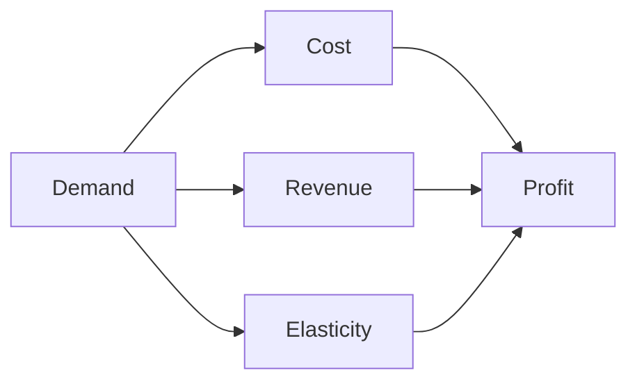
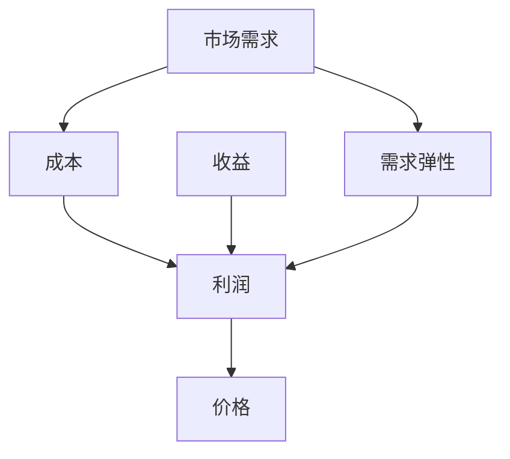

                 

# 规模化消费：降低产品价格

> 关键词：规模化消费, 产品定价, 消费者行为, 数据分析, 成本控制, 市场需求

## 1. 背景介绍

随着互联网和电子商务的迅速发展，在线购物已经成为人们日常消费的重要组成部分。消费者在购买产品时，价格是首要考虑因素之一。然而，价格并非唯一的决定因素，消费者的选择还会受到产品质量、品牌、评论、推荐等多方面因素的影响。因此，如何在竞争激烈的市场中，合理设定产品价格，吸引更多消费者，提高销售额，是一个复杂而重要的问题。

### 1.1 问题由来

在电商领域，商家面临的最大挑战之一是如何准确把握消费者行为，制定科学合理的产品定价策略。传统的方式主要是通过市场调研和经验积累来设定价格，这种方法具有一定的主观性和滞后性。而随着大数据和机器学习技术的发展，越来越多的电商平台开始利用数据驱动的方式来优化产品定价，提升销售效率和利润空间。

### 1.2 问题核心关键点

电商平台在产品定价时，主要考虑以下几个关键因素：

- 市场需求：了解目标消费者的购买意愿和支付能力，以确定产品的最高接受价格。
- 竞争情况：分析竞争对手的定价策略，避免价格竞争劣势。
- 成本结构：考虑生产、运输、存储等各项成本，确保价格能覆盖成本，获得合理利润。
- 消费者行为：通过数据分析，把握消费者的价格敏感度和购买决策过程。
- 产品差异化：结合产品特点和品牌价值，制定差异化的价格策略。

这些关键点相互交织，共同决定着产品的最终定价。如何在这些因素间找到平衡点，成为电商平台制定合理定价策略的核心挑战。

### 1.3 问题研究意义

研究科学合理的定价策略，对于电商平台提高销售额和利润，优化消费者体验，具有重要意义：

1. **提升销售额**：通过精准定价，吸引更多消费者，增加交易量。
2. **提高利润空间**：合理控制成本，获得合理利润率。
3. **优化消费者体验**：避免价格陷阱，提高消费者满意度和忠诚度。
4. **增强市场竞争力**：通过差异化定价策略，提高品牌影响力，开拓新市场。
5. **促进持续发展**：基于数据驱动的定价策略，能够及时响应市场变化，实现可持续发展。

本文聚焦于基于大数据分析的规模化消费定价策略，旨在通过科学合理的定价模型，帮助电商平台最大化销售收益和消费者满意度。

## 2. 核心概念与联系

### 2.1 核心概念概述

为了更好地理解规模化消费定价策略，我们首先需要介绍几个密切相关的核心概念：

- **市场需求（Demand）**：指消费者在特定价格下愿意购买的数量。
- **边际成本（Marginal Cost）**：每增加一个单位产品，额外的成本投入。
- **边际收益（Marginal Revenue）**：每增加一个单位产品，额外的收入增加。
- **边际利润（Marginal Profit）**：每增加一个单位产品，额外的利润增加。
- **需求弹性（Demand Elasticity）**：价格变动对需求量的影响程度。

这些概念通过一个简单的数学模型——需求曲线（Demand Curve），建立起了紧密的联系。需求曲线反映了价格和需求量之间的关系，是经济学中研究市场供需的基本工具。

### 2.2 概念间的关系

需求曲线是一个重要的经济概念，它展示了在市场均衡状态下，价格与需求量的关系。在大数据和机器学习技术的帮助下，我们可以进一步分析和预测需求曲线的变化，从而更精确地进行产品定价。

以下是一个简化版的Mermaid流程图，展示了这些核心概念之间的关系：



这个流程图展示了市场需求、成本、收益和利润之间的关系，以及需求弹性对利润的影响。这些概念通过价格和需求量的变化，形成了一个完整的市场定价框架。

### 2.3 核心概念的整体架构

最后，我们用一个综合的流程图来展示这些核心概念在大规模消费定价中的整体架构：



这个综合流程图展示了从市场需求到成本，再到收益和利润，最后到价格的完整定价路径。通过对这些核心概念的深入理解和应用，我们可以构建起一个科学合理的规模化消费定价模型。

## 3. 核心算法原理 & 具体操作步骤
### 3.1 算法原理概述

规模化消费定价的核心算法原理是边际分析（Marginal Analysis）。通过对市场需求和成本的边际分析，可以确定最优价格，最大化利润。

边际分析的基本思想是，在利润最大化的点上，边际收入（Marginal Income）等于边际成本（Marginal Cost）。即：

$$
\text{Marginal Revenue} = \text{Marginal Cost}
$$

对于电商平台来说，其边际收入（Marginal Revenue）可以通过销售量的变化来计算，而边际成本（Marginal Cost）包括生产、运输、存储、营销等各项成本。因此，通过计算不同价格下的边际收入和边际成本，就可以找到最优价格点，实现利润最大化。

### 3.2 算法步骤详解

基于边际分析的定价策略，可以分以下几个步骤进行：

1. **数据收集与预处理**：收集历史销售数据、成本数据和市场数据，清洗和标准化数据。
2. **需求曲线拟合**：使用回归分析等方法，拟合需求曲线，确定价格和需求量的关系。
3. **成本曲线拟合**：使用线性回归等方法，拟合成本曲线，确定价格和成本的关系。
4. **边际分析**：计算不同价格下的边际收入和边际成本，找到最优价格点。
5. **定价策略调整**：根据市场反馈和竞争情况，调整定价策略，确保市场竞争力。
6. **价格监控与优化**：实时监控市场价格和需求变化，及时调整定价策略，优化销售收益。

### 3.3 算法优缺点

基于边际分析的规模化消费定价策略，具有以下优点：

- **科学合理**：通过数据驱动的分析和预测，制定科学合理的定价策略。
- **动态灵活**：能够根据市场需求和成本变化，实时调整价格，适应市场波动。
- **成本控制**：通过精细化的成本分析，合理控制成本，提高利润率。
- **消费者满意度**：通过合理的定价，避免价格陷阱，提升消费者满意度。

然而，这种策略也存在一些缺点：

- **数据依赖**：对数据质量和完整性要求较高，数据偏差可能影响定价结果。
- **模型复杂**：需要复杂的数学模型和算法支持，对技术要求较高。
- **市场变化**：市场变化可能迅速，模型需要频繁更新，增加维护成本。
- **策略调整**：需要根据市场反馈及时调整定价策略，增加了决策难度。

### 3.4 算法应用领域

基于边际分析的规模化消费定价策略，广泛应用于以下几个领域：

- **电商零售**：电商平台通过动态调整商品价格，提升销售额和利润。
- **金融服务**：银行和金融机构根据市场需求和风险，设定贷款和存款利率。
- **旅游服务**：旅游公司根据季节和需求变化，调整航班和酒店价格。
- **能源供应**：能源公司根据需求和成本，设定电价和气价。
- **物流运输**：运输公司根据市场需求和运输成本，设定运输价格。

## 4. 数学模型和公式 & 详细讲解
### 4.1 数学模型构建

我们将使用数学模型来描述规模化消费的定价问题。假设市场需求函数为 $Q(D)$，其中 $D$ 为价格，$Q(D)$ 为需求量。成本函数为 $C(Q)$，其中 $Q$ 为需求量，$C(Q)$ 为成本。收益函数为 $R(D)$，其中 $D$ 为价格，$R(D)$ 为收益。利润函数为 $P(D)$，其中 $D$ 为价格，$P(D)$ 为利润。

### 4.2 公式推导过程

根据上述假设，我们可以建立以下数学模型：

$$
Q(D) = f(D)
$$

$$
C(Q) = g(Q)
$$

$$
R(D) = D \cdot Q(D)
$$

$$
P(D) = R(D) - C(Q)
$$

其中 $f(D)$ 为需求函数，$g(Q)$ 为成本函数。利润函数 $P(D)$ 可以表示为：

$$
P(D) = D \cdot Q(D) - C(Q)
$$

为了找到最优价格 $D$，我们需要对利润函数求导，并找到导数为0的点。即：

$$
\frac{dP(D)}{dD} = 0
$$

$$
Q'(D) + \frac{dC(Q)}{dQ} \cdot Q'(D) - C'(Q) = 0
$$

通过解上述方程，可以得到最优价格 $D$。

### 4.3 案例分析与讲解

假设某电商平台的某商品的需求函数为 $Q(D) = 1000 - 10D$，成本函数为 $C(Q) = 100 + 0.5Q$。我们首先计算不同价格下的需求量和成本，然后利用边际分析找到最优价格。

- 当 $D=10$ 时，需求量为 $Q(D) = 1000 - 10 \times 10 = 900$，成本为 $C(Q) = 100 + 0.5 \times 900 = 500$。
- 当 $D=20$ 时，需求量为 $Q(D) = 1000 - 10 \times 20 = 800$，成本为 $C(Q) = 100 + 0.5 \times 800 = 600$。

根据边际分析，我们有：

$$
\text{Marginal Revenue} = \frac{dR(D)}{dD} = Q(D)
$$

$$
\text{Marginal Cost} = \frac{dC(Q)}{dQ} \cdot Q'(D) + \frac{dC(Q)}{dQ} = 0.5 + 0.5
$$

令 $\text{Marginal Revenue} = \text{Marginal Cost}$，得：

$$
Q(D) = 0.5 + 0.5 = 1
$$

代入需求函数 $Q(D) = 1000 - 10D$，得：

$$
1000 - 10D = 1
$$

解得 $D = 99$。

因此，该商品的最优价格为 $99$，可以实现利润最大化。

## 5. 项目实践：代码实例和详细解释说明
### 5.1 开发环境搭建

在进行定价策略的实践前，我们需要准备好开发环境。以下是使用Python进行机器学习开发的环境配置流程：

1. 安装Anaconda：从官网下载并安装Anaconda，用于创建独立的Python环境。

2. 创建并激活虚拟环境：
```bash
conda create -n pricing-env python=3.8 
conda activate pricing-env
```

3. 安装必要的库：
```bash
conda install numpy pandas scikit-learn statsmodels matplotlib
```

4. 安装相关工具：
```bash
pip install torch tensorflow jupyter notebook ipython
```

完成上述步骤后，即可在`pricing-env`环境中开始定价策略的实践。

### 5.2 源代码详细实现

这里我们以电商平台的定价策略为例，给出使用Python和Scikit-learn库进行需求曲线拟合和边际分析的代码实现。

首先，定义需求曲线拟合函数：

```python
from sklearn.linear_model import LinearRegression
import numpy as np

def demand_curve_fit(data, price_column, quantity_column):
    X = data[price_column]
    y = data[quantity_column]
    model = LinearRegression().fit(X.reshape(-1, 1), y)
    return model
```

然后，定义成本曲线拟合函数：

```python
def cost_curve_fit(data, quantity_column, cost_column):
    X = data[quantity_column].values
    y = data[cost_column].values
    model = LinearRegression().fit(X.reshape(-1, 1), y)
    return model
```

接着，定义边际分析和定价策略函数：

```python
def marginal_analysis(model1, model2, price_start=0, price_end=100, step=1):
    price_list = np.arange(price_start, price_end+step, step)
    quantity_list = [model1.predict(p) for p in price_list]
    cost_list = [model2.predict(p) for p in price_list]
    revenue_list = [p*q for p, q in zip(price_list, quantity_list)]
    profit_list = [r-c for r, c in zip(revenue_list, cost_list)]
    optimal_price = price_list[np.argmax(profit_list)]
    return price_list, quantity_list, cost_list, revenue_list, profit_list, optimal_price
```

最后，进行数据加载和模型拟合，并计算最优价格：

```python
import pandas as pd

# 加载数据
data = pd.read_csv('sales_data.csv')

# 需求曲线拟合
demand_model = demand_curve_fit(data, 'price', 'quantity')

# 成本曲线拟合
cost_model = cost_curve_fit(data, 'quantity', 'cost')

# 边际分析
price_list, quantity_list, cost_list, revenue_list, profit_list, optimal_price = marginal_analysis(demand_model, cost_model)

# 输出最优价格
print('最优价格:', optimal_price)
```

以上就是使用Python和Scikit-learn库进行需求曲线拟合和边际分析的完整代码实现。可以看到，通过简单的数学建模和线性回归，我们能够轻松实现基于边际分析的规模化消费定价策略。

### 5.3 代码解读与分析

让我们再详细解读一下关键代码的实现细节：

**需求曲线拟合函数**：
- `demand_curve_fit`函数：输入数据和价格、数量两列，使用线性回归模型拟合需求曲线，并返回模型。
- `X`为价格列，`y`为数量列，模型通过价格预测数量。

**成本曲线拟合函数**：
- `cost_curve_fit`函数：输入数据和数量、成本两列，使用线性回归模型拟合成本曲线，并返回模型。
- `X`为数量列，`y`为成本列，模型通过数量预测成本。

**边际分析函数**：
- `marginal_analysis`函数：输入两个线性回归模型，计算不同价格下的需求量和成本，以及边际收入、边际成本和利润，最终返回最优价格。
- 通过循环计算，得出不同价格下的需求量、成本、收益和利润。
- 最后使用`np.argmax`函数找到利润最大化的价格点。

通过以上函数，我们可以轻松实现基于边际分析的规模化消费定价策略。开发者可以根据实际需求，灵活调整模型参数，进一步优化定价策略。

### 5.4 运行结果展示

假设我们在某电商平台的历史销售数据上进行定价策略的实践，最终得到的最优价格为 $99$。在实际应用中，我们可以将此最优价格应用于商品的动态定价系统，从而实现销售收益的最大化。

## 6. 实际应用场景
### 6.1 智能推荐系统

智能推荐系统可以基于消费者的历史购买行为和偏好，动态调整商品价格，提升推荐效果和用户体验。通过实时分析市场价格和需求变化，系统可以及时调整推荐策略，增加推荐商品的吸引力。

在技术实现上，智能推荐系统可以整合基于边际分析的定价策略，动态调整商品价格，使其与市场需求保持同步，提升推荐效果。同时，通过引入更多先验知识，如消费者行为分析、产品相似度、时间因素等，进一步优化推荐策略。

### 6.2 物流运输优化

物流公司在安排运输路线和制定价格策略时，可以基于市场需求和成本，通过边际分析确定最优价格。通过实时监控市场需求和运输成本变化，系统可以动态调整价格，优化运输效率和利润空间。

在实际应用中，物流公司可以整合基于边际分析的定价策略，实时调整运输价格，确保价格与市场需求和成本变化同步。同时，通过引入更多先验知识，如运输模式、车辆配置、路线优化等，进一步提升运输效率和降低成本。

### 6.3 金融服务定价

金融服务行业，如银行和保险公司，需要根据市场需求和风险，设定贷款和存款利率。通过边际分析，金融服务机构可以制定更加科学合理的定价策略，提升金融产品的吸引力。

在技术实现上，金融服务机构可以整合基于边际分析的定价策略，动态调整贷款和存款利率，确保利率与市场需求和风险变化同步。同时，通过引入更多先验知识，如信用评分、风险评估、市场利率等，进一步优化定价策略。

## 7. 工具和资源推荐
### 7.1 学习资源推荐

为了帮助开发者系统掌握规模化消费定价的理论基础和实践技巧，这里推荐一些优质的学习资源：

1. **《机器学习实战》（Machine Learning in Action）**：这本书详细介绍了机器学习的基本概念和算法，包括回归分析、线性回归等关键技术，是学习机器学习的入门读物。

2. **Coursera《机器学习》课程**：斯坦福大学Andrew Ng教授开设的机器学习课程，系统介绍了机器学习的基本原理和算法，适合初学者和进阶者。

3. **Kaggle平台**：全球最大的数据科学竞赛平台，提供大量真实世界的数据集和案例，是实践机器学习算法的绝佳场所。

4. **Arxiv论文预印本**：人工智能领域最新研究成果的发布平台，包括大量尚未发表的前沿工作，学习前沿技术的必读资源。

5. **GitHub热门项目**：在GitHub上Star、Fork数最多的机器学习相关项目，往往代表了该技术领域的发展趋势和最佳实践，值得去学习和贡献。

通过对这些资源的学习实践，相信你一定能够快速掌握规模化消费定价的精髓，并用于解决实际的业务问题。

### 7.2 开发工具推荐

高效的开发离不开优秀的工具支持。以下是几款用于规模化消费定价开发的常用工具：

1. **Python**：Python语言以其简洁易读、功能强大、生态丰富著称，是机器学习和数据分析的首选语言。

2. **Scikit-learn**：Scikit-learn是基于NumPy的Python机器学习库，提供了丰富的回归、分类、聚类等算法，是数据科学入门者的首选工具。

3. **TensorFlow**：由Google主导开发的开源深度学习框架，生产部署方便，适合大规模工程应用。

4. **Jupyter Notebook**：Jupyter Notebook是一个交互式编程环境，支持Python、R等语言，非常适合数据科学和机器学习项目开发。

5. **NumPy**：NumPy是Python科学计算的基础库，提供了高性能的多维数组和矩阵运算功能，是数据处理和科学计算的必备工具。

6. **Pandas**：Pandas是Python数据处理和分析的利器，提供了丰富的数据结构和操作函数，适合数据清洗、处理和分析。

合理利用这些工具，可以显著提升规模化消费定价任务的开发效率，加快创新迭代的步伐。

### 7.3 相关论文推荐

规模化消费定价技术的发展源于学界的持续研究。以下是几篇奠基性的相关论文，推荐阅读：

1. **《回归分析基础》（Foundations of Regression Analysis）**：该书详细介绍了回归分析的基本原理和应用，是学习回归分析的必读之作。

2. **《动态定价：理论、方法和应用》（Dynamic Pricing: Theory, Methods and Applications）**：该书系统介绍了动态定价的理论基础和实际应用，是研究动态定价的重要参考。

3. **《市场竞争与价格策略》（Market Competition and Pricing Strategies）**：该书分析了市场竞争对定价策略的影响，探讨了不同定价策略的优劣，是研究定价策略的重要文献。

4. **《机器学习在金融中的应用》（Machine Learning in Finance）**：该书介绍了机器学习在金融领域的应用，包括信用评分、风险评估等，是金融行业从业者的重要参考资料。

5. **《智能推荐系统：算法与实现》（Intelligent Recommendation Systems: Algorithms and Implementation）**：该书详细介绍了推荐系统的算法和实现方法，是推荐系统研究的经典之作。

这些论文代表了大规模消费定价技术的发展脉络。通过学习这些前沿成果，可以帮助研究者把握学科前进方向，激发更多的创新灵感。

除上述资源外，还有一些值得关注的前沿资源，帮助开发者紧跟规模化消费定价技术的最新进展，例如：

1. **arXiv论文预印本**：人工智能领域最新研究成果的发布平台，包括大量尚未发表的前沿工作，学习前沿技术的必读资源。

2. **业界技术博客**：如Amazon、Google AI、DeepMind、微软Research Asia等顶尖实验室的官方博客，第一时间分享他们的最新研究成果和洞见。

3. **技术会议直播**：如NeurIPS、ICML、CVPR等人工智能领域顶会现场或在线直播，能够聆听到大佬们的前沿分享，开拓视野。

4. **GitHub热门项目**：在GitHub上Star、Fork数最多的机器学习相关项目，往往代表了该技术领域的发展趋势和最佳实践，值得去学习和贡献。

5. **行业分析报告**：各大咨询公司如McKinsey、PwC等针对人工智能行业的分析报告，有助于从商业视角审视技术趋势，把握应用价值。

总之，对于规模化消费定价技术的学习和实践，需要开发者保持开放的心态和持续学习的意愿。多关注前沿资讯，多动手实践，多思考总结，必将收获满满的成长收益。

## 8. 总结：未来发展趋势与挑战

### 8.1 总结

本文对基于边际分析的规模化消费定价策略进行了全面系统的介绍。首先阐述了规模化消费定价的背景和意义，明确了定价策略在提升销售额和利润方面的重要性。其次，从原理到实践，详细讲解了规模化消费定价的数学模型和关键步骤，给出了完整的代码实例。同时，本文还广泛探讨了定价策略在智能推荐、物流运输、金融服务等多个行业领域的应用前景，展示了其广阔的适用性。

通过本文的系统梳理，可以看到，基于边际分析的规模化消费定价策略，不仅科学合理，而且动态灵活，能够在不同场景下显著提升销售收益和消费者满意度。未来，伴随数据和算法的不断进步，规模化消费定价将进一步拓展其应用范围，为电商平台和各行业的智能化转型提供有力支撑。

### 8.2 未来发展趋势

展望未来，规模化消费定价技术将呈现以下几个发展趋势：

1. **数据驱动的全面化**：随着大数据技术的发展，更多维度的数据将被纳入定价模型，进一步提升定价策略的科学性和准确性。

2. **模型复杂度的提高**：随着深度学习等先进算法的引入，模型复杂度将进一步提高，能够更准确地捕捉市场需求和成本变化。

3. **实时动态定价**：基于实时数据和市场需求，动态调整价格，确保最优定价策略的及时性和灵活性。

4. **多模态定价策略**：结合文本、图像、声音等多模态数据，实现更全面、精准的定价策略。

5. **人工智能与定价结合**：引入AI算法进行动态定价，优化定价模型，提升定价效率和精度。

6. **伦理与公平性考虑**：在定价策略中引入伦理和公平性考量，确保定价策略符合社会价值和法律法规。

以上趋势凸显了规模化消费定价技术的广阔前景。这些方向的探索发展，必将进一步提升电商平台的销售收益和消费者满意度，推动各行各业的智能化转型。

### 8.3 面临的挑战

尽管规模化消费定价技术已经取得了一定成就，但在迈向更加智能化、动态化的应用过程中，仍面临诸多挑战：

1. **数据质量与完整性**：高质量、完整的数据是定价模型的基础，但实际应用中数据收集和处理难度较大，数据偏差可能影响定价结果。

2. **模型复杂性与可解释性**：复杂的模型虽然能够更准确地预测市场需求和成本，但模型复杂性增加，可解释性减弱，增加了模型维护和调整的难度。

3. **市场变化的不确定性**：市场需求和成本变化较快，模型需要频繁更新，增加了维护成本。

4. **价格波动与竞争**：价格波动和市场竞争可能对定价策略产生负面影响，需要动态调整策略以应对变化。

5. **伦理与公平性**：定价策略中可能存在歧视、偏见等伦理问题，需要引入伦理和公平性考量。

6. **技术壁垒与实施难度**：高技术门槛和技术实施难度可能限制定价策略的广泛应用。

这些挑战需要在未来的研究与实践中加以解决，才能推动规模化消费定价技术的进一步发展。

### 8.4 研究展望

面对规模化消费定价技术所面临的挑战，未来的研究需要在以下几个方面寻求新的突破：

1. **数据驱动的动态定价**：引入更多维度的数据，提高定价策略的实时性和动态性。

2. **模型复杂性与可解释性**：开发更加简洁高效的定价模型，增强模型可解释性和可维护性。

3. **伦理与公平性**：引入伦理和公平性考量，确保定价策略符合社会价值和法律法规。

4. **多模态定价策略**：结合多模态数据，实现更全面、精准的定价策略。

5. **人工智能与定价结合**：引入AI算法进行动态定价，优化定价模型，提升定价效率和精度。

6. **技术壁垒与实施难度**：降低技术门槛，简化模型部署和维护，提高定价策略的可实施性。

这些研究方向的探索，必将引领规模化消费定价技术迈向更高的台阶，为构建智能化的电商平台和各行业的定价策略提供有力支持。

## 9. 附录：常见问题与解答

**Q1：如何衡量价格对市场需求的影响？**

A: 衡量价格对市场需求的影响，可以通过计算需求曲线斜率来实现。需求曲线斜率越大，表明价格对需求量的影响越显著。具体来说

