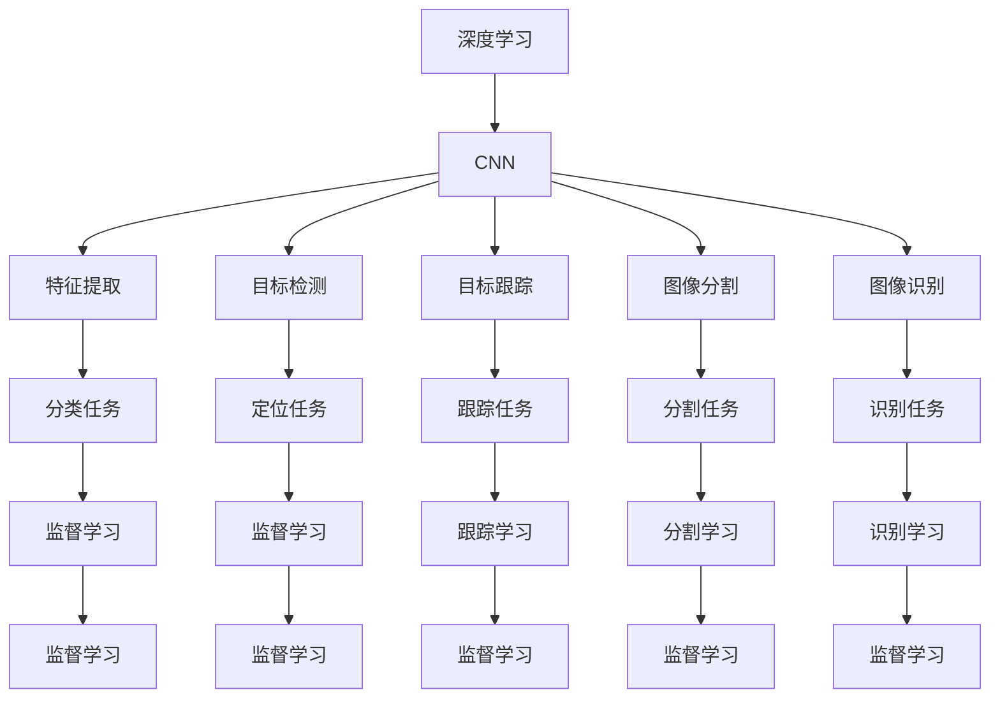
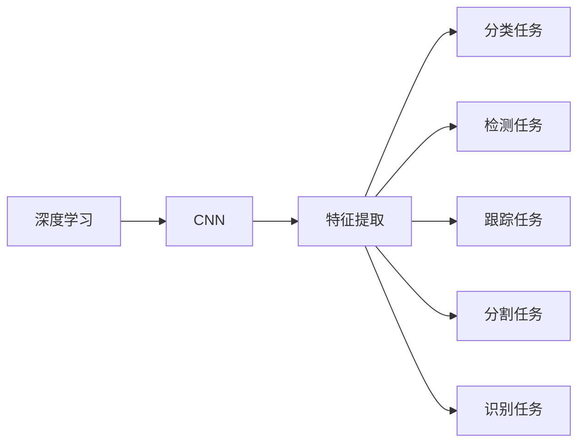
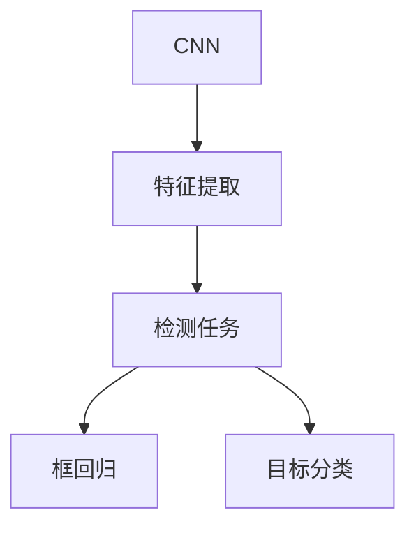
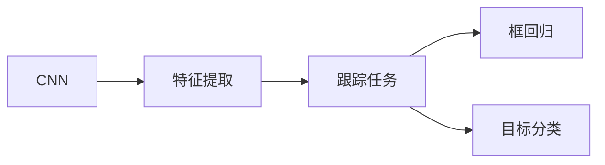

                 

# 计算机视觉 原理与代码实例讲解

> 关键词：计算机视觉, 深度学习, 卷积神经网络, 特征提取, 目标检测, 目标跟踪, 图像分割, 图像识别

## 1. 背景介绍

### 1.1 问题由来

计算机视觉(CV)作为人工智能领域的重要分支，近年来在自动驾驶、智能监控、医学影像分析等领域取得了显著的进展。深度学习技术的兴起，特别是卷积神经网络(CNN)的出现，极大地推动了CV技术的发展。基于深度学习的CV方法，如目标检测、目标跟踪、图像分割等，已经能够达到甚至超越人类专家的水平，广泛应用于各行各业。

然而，尽管深度学习CV技术已经取得了巨大成功，但仍存在一些问题需要解决。一方面，深度学习模型往往需要大量的标注数据进行训练，数据采集和标注成本较高；另一方面，深度学习模型的泛化能力仍然不足，难以适应复杂和多变的环境。这些问题限制了深度学习CV技术的广泛应用。

为应对这些挑战，基于深度学习的计算机视觉技术正不断演进，呈现出从传统的监督学习向半监督学习、无监督学习、迁移学习等多样化学习范式转型的趋势。同时，模型压缩、知识蒸馏等新兴技术也为CV技术带来了新的突破。本文旨在介绍计算机视觉的基本原理，并结合代码实例，讲解卷积神经网络的实现，展示如何利用深度学习技术进行图像识别、目标检测等任务。

## 2. 核心概念与联系

### 2.1 核心概念概述

为了更好地理解深度学习在计算机视觉中的应用，本节将介绍几个核心概念：

- **深度学习**：利用多层神经网络对数据进行表示和分类，能够处理复杂的非线性关系，适用于大规模数据的特征提取和分类任务。
- **卷积神经网络(CNN)**：一种特殊的前馈神经网络，通过卷积操作提取图像中的局部特征，具有平移不变性和局部连接性。
- **特征提取**：从原始图像数据中提取抽象特征，为分类、检测等任务提供基础。
- **目标检测**：识别图像中特定的物体并定位，是计算机视觉中的经典问题。
- **目标跟踪**：在视频序列中持续跟踪物体的位置，需要考虑背景、光照变化等因素。
- **图像分割**：将图像分割为多个区域，每个区域代表不同的对象或背景，常用于医疗、自动驾驶等领域。
- **图像识别**：识别图像中的对象或场景，是计算机视觉的基础任务。

这些概念之间的逻辑关系可以通过以下Mermaid流程图来展示：



这个流程图展示了深度学习、CNN与计算机视觉任务之间的联系：

1. CNN用于特征提取，为分类、检测等任务提供基础。
2. 目标检测、目标跟踪、图像分割、图像识别等任务，均基于CNN提取的特征进行。
3. 监督学习、半监督学习、无监督学习等多样化的学习范式，适用于不同任务的特征提取和分类。

### 2.2 概念间的关系

这些核心概念之间存在紧密的联系，形成了计算机视觉任务的完整生态系统。下面我通过几个Mermaid流程图来展示这些概念之间的关系。

#### 2.2.1 深度学习与计算机视觉



这个流程图展示了深度学习技术在计算机视觉中的应用，包括CNN特征提取、分类、检测、跟踪、分割和识别等任务。

#### 2.2.2 目标检测与特征提取



这个流程图展示了目标检测的基本流程，从CNN特征提取到目标分类和框回归。

#### 2.2.3 目标跟踪与特征提取



这个流程图展示了目标跟踪的基本流程，与目标检测类似，但需要考虑背景、光照变化等因素。

## 3. 核心算法原理 & 具体操作步骤

### 3.1 算法原理概述

深度学习在计算机视觉中的应用，主要基于卷积神经网络(CNN)。CNN通过卷积操作提取图像中的局部特征，然后将这些特征传递给全连接层进行分类或回归。CNN的卷积操作具有平移不变性和局部连接性，能够高效地提取图像中的空间信息。

### 3.2 算法步骤详解

卷积神经网络的训练流程通常包括以下几个步骤：

1. **数据准备**：收集并准备训练数据，通常需要图像标注信息。
2. **网络设计**：选择合适的CNN架构，如LeNet、AlexNet、VGG、ResNet等。
3. **模型训练**：使用训练数据对模型进行监督学习，优化模型参数以最小化损失函数。
4. **模型评估**：使用测试数据对模型进行评估，选择性能最佳的模型。
5. **模型应用**：将训练好的模型应用于实际任务，如目标检测、图像分割等。

### 3.3 算法优缺点

卷积神经网络具有以下优点：

- **局部连接**：通过局部连接提取图像特征，减少了参数数量，提高了计算效率。
- **平移不变性**：卷积操作对图像平移、旋转、缩放等变换具有不变性，能够提取图像的平移不变特征。
- **参数共享**：卷积核参数共享，减少了模型参数数量，提高了泛化能力。
- **高效特征提取**：能够自动学习图像的层次特征，适用于大规模数据的特征提取和分类任务。

同时，卷积神经网络也存在一些缺点：

- **模型复杂度**：模型结构复杂，需要大量的计算资源进行训练和推理。
- **过拟合问题**：对于小规模数据集，容易出现过拟合现象。
- **训练时间长**：模型参数数量庞大，训练时间较长。
- **可解释性不足**：神经网络往往是黑盒模型，难以解释其内部决策过程。

尽管存在这些缺点，卷积神经网络在计算机视觉中的应用仍然非常广泛，取得了显著的成果。

### 3.4 算法应用领域

卷积神经网络广泛应用于计算机视觉的各个领域，包括但不限于：

- **目标检测**：如YOLO、Faster R-CNN、SSD等，用于识别和定位图像中的物体。
- **目标跟踪**：如SiamRPN、DeepSORT等，用于在视频序列中跟踪物体。
- **图像分割**：如FCN、U-Net、Mask R-CNN等，用于将图像分割为不同的区域。
- **图像识别**：如LeNet、AlexNet、VGG、ResNet等，用于识别图像中的对象或场景。
- **人脸识别**：如FaceNet、VGGFace、DeepID等，用于识别人脸或人脸特征。

## 4. 数学模型和公式 & 详细讲解 & 举例说明

### 4.1 数学模型构建

卷积神经网络的数学模型可以形式化地表示为：

$$
f(\mathbf{x}) = \mathbf{W}^T \sigma(\mathbf{A}\mathbf{x} + \mathbf{b})
$$

其中，$f$为神经网络模型，$\mathbf{x}$为输入数据，$\mathbf{A}$为卷积核，$\sigma$为激活函数，$\mathbf{W}$为权重矩阵，$\mathbf{b}$为偏置向量。

卷积操作可以表示为：

$$
\mathbf{A} * \mathbf{x} = \begin{bmatrix}
\mathbf{a}_1 * \mathbf{x} & \mathbf{a}_2 * \mathbf{x} & \cdots & \mathbf{a}_n * \mathbf{x}
\end{bmatrix}
$$

其中，$\mathbf{a}_i$为卷积核，$\mathbf{x}$为输入数据。

### 4.2 公式推导过程

卷积神经网络的目标是通过多层卷积和池化操作，提取图像的层次特征，最终进行分类或回归。以下以简单的卷积神经网络为例，推导其特征提取过程。

假设输入图像大小为$h \times w \times 3$，卷积核大小为$s \times s$，步长为$p$，填充方式为$'valid'$，则卷积操作可以表示为：

$$
\mathbf{A} * \mathbf{x} = \begin{bmatrix}
\mathbf{a}_1 * \mathbf{x} & \mathbf{a}_2 * \mathbf{x} & \cdots & \mathbf{a}_n * \mathbf{x}
\end{bmatrix}
$$

其中，$\mathbf{a}_i$为大小为$s \times s$的卷积核，$\mathbf{x}$为输入图像。

卷积操作的结果为一个大小为$\left(\frac{h-s+2p}{p}\right) \times \left(\frac{w-s+2p}{p}\right) \times c$的特征图，其中$c$为卷积核的数量。

通过多个卷积和池化操作，可以将特征图逐步缩小，提取更高级别的特征。最后通过全连接层进行分类或回归。

### 4.3 案例分析与讲解

以目标检测中的YOLO算法为例，分析其原理和实现过程。

YOLO（You Only Look Once）算法是一种基于单个卷积神经网络的实时目标检测方法，其核心思想是将图像划分为多个网格，每个网格预测一个边界框和置信度，从而实现目标检测。

YOLO的训练流程包括以下几个步骤：

1. **数据准备**：收集并准备训练数据，通常需要图像标注信息。
2. **网络设计**：设计YOLO的卷积神经网络，包括多个卷积层和全连接层。
3. **模型训练**：使用训练数据对模型进行监督学习，优化模型参数以最小化损失函数。
4. **模型评估**：使用测试数据对模型进行评估，选择性能最佳的模型。
5. **模型应用**：将训练好的模型应用于实际任务，如目标检测。

YOLO的训练过程通过反向传播算法进行，目标函数通常为交叉熵损失函数。YOLO的目标是最大化目标检测的准确率和召回率。

## 5. 项目实践：代码实例和详细解释说明

### 5.1 开发环境搭建

在进行计算机视觉项目实践前，我们需要准备好开发环境。以下是使用Python进行TensorFlow或PyTorch开发的环境配置流程：

1. 安装Anaconda：从官网下载并安装Anaconda，用于创建独立的Python环境。

2. 创建并激活虚拟环境：
```bash
conda create -n cv-env python=3.8 
conda activate cv-env
```

3. 安装TensorFlow或PyTorch：根据CUDA版本，从官网获取对应的安装命令。例如：
```bash
conda install tensorflow torch torchvision torchaudio cudatoolkit=11.1 -c pytorch -c conda-forge
```

4. 安装图像处理库：
```bash
pip install numpy scipy matplotlib scikit-image opencv-python
```

5. 安装各类工具包：
```bash
pip install tqdm jupyter notebook ipython
```

完成上述步骤后，即可在`cv-env`环境中开始计算机视觉项目的开发。

### 5.2 源代码详细实现

下面我们以图像分类为例，给出使用TensorFlow或PyTorch进行卷积神经网络训练的Python代码实现。

首先，定义图像分类任务的数据处理函数：

```python
import numpy as np
import matplotlib.pyplot as plt
import tensorflow as tf
import tensorflow_datasets as tfds

def preprocess_image(image, label):
    image = tf.image.resize(image, (224, 224))
    image = tf.image.per_image_standardization(image)
    return image, label

def load_data():
    train_data = tfds.load('mnist', split='train', shuffle_files=True)
    test_data = tfds.load('mnist', split='test', shuffle_files=True)
    train_dataset = train_data.map(preprocess_image)
    test_dataset = test_data.map(preprocess_image)
    return train_dataset, test_dataset
```

然后，定义卷积神经网络模型：

```python
def build_model(input_shape):
    model = tf.keras.Sequential([
        tf.keras.layers.Conv2D(32, (3, 3), activation='relu', input_shape=input_shape),
        tf.keras.layers.MaxPooling2D((2, 2)),
        tf.keras.layers.Conv2D(64, (3, 3), activation='relu'),
        tf.keras.layers.MaxPooling2D((2, 2)),
        tf.keras.layers.Flatten(),
        tf.keras.layers.Dense(64, activation='relu'),
        tf.keras.layers.Dense(10, activation='softmax')
    ])
    return model
```

接着，定义训练和评估函数：

```python
def train_model(model, train_dataset, test_dataset, epochs, batch_size):
    model.compile(optimizer=tf.keras.optimizers.Adam(), loss='categorical_crossentropy', metrics=['accuracy'])
    model.fit(train_dataset, epochs=epochs, validation_data=test_dataset, batch_size=batch_size)
    test_loss, test_acc = model.evaluate(test_dataset, batch_size=batch_size)
    return test_loss, test_acc

def evaluate_model(model, test_dataset, batch_size):
    test_loss, test_acc = model.evaluate(test_dataset, batch_size=batch_size)
    return test_loss, test_acc
```

最后，启动训练流程并在测试集上评估：

```python
input_shape = (28, 28, 1)
train_dataset, test_dataset = load_data()

model = build_model(input_shape)
epochs = 10
batch_size = 32

test_loss, test_acc = train_model(model, train_dataset, test_dataset, epochs, batch_size)
print('Test loss:', test_loss)
print('Test accuracy:', test_acc)

test_loss, test_acc = evaluate_model(model, test_dataset, batch_size)
print('Test loss:', test_loss)
print('Test accuracy:', test_acc)
```

以上就是使用TensorFlow或PyTorch进行卷积神经网络训练的完整代码实现。可以看到，TensorFlow或PyTorch提供了丰富的API和工具，可以大大简化模型构建和训练的过程。

### 5.3 代码解读与分析

让我们再详细解读一下关键代码的实现细节：

**preprocess_image函数**：
- 该函数用于预处理输入的图像和标签数据，将图像缩放到标准尺寸，并进行标准化处理，以适应模型的输入要求。

**build_model函数**：
- 该函数定义了一个简单的卷积神经网络，包括多个卷积层和全连接层。最后一层使用softmax激活函数进行分类。

**train_model函数**：
- 该函数使用TensorFlow或PyTorch的API进行模型训练，包括定义损失函数、优化器和评估指标，并调用模型的fit方法进行训练。
- 在训练过程中，使用validation_data参数指定验证集，以便实时评估模型的性能。

**evaluate_model函数**：
- 该函数使用TensorFlow或PyTorch的API进行模型评估，调用模型的evaluate方法计算测试集上的损失和准确率。

**train流程**：
- 首先定义输入图像的大小，然后加载MNIST数据集。
- 构建卷积神经网络模型，并定义训练参数。
- 调用train_model函数进行模型训练，并在测试集上评估模型性能。

## 6. 实际应用场景

### 6.1 智能监控

智能监控系统可以通过计算机视觉技术，实现对视频流中的人脸、车辆等目标的检测和跟踪。系统可以实时分析监控视频，检测异常行为，如入侵、火灾等，并及时报警。

在技术实现上，可以使用YOLO、Faster R-CNN等目标检测算法，结合深度学习模型进行训练。训练好的模型可以部署到监控摄像头中，实时处理视频流数据，识别出感兴趣的目标，并进行跟踪。

### 6.2 医学影像分析

医学影像分析是计算机视觉的重要应用之一，可以帮助医生进行疾病诊断和治疗。通过计算机视觉技术，可以对医学影像进行自动分割、标注、分类等处理，提高诊断的准确性和效率。

在实际应用中，可以使用U-Net、FCN等图像分割算法，结合深度学习模型进行训练。训练好的模型可以应用于医学影像的自动分割、标注，提高诊断的准确性和效率。

### 6.3 自动驾驶

自动驾驶技术需要计算机视觉技术的支持，实现对道路环境的感知和理解。通过计算机视觉技术，可以对道路、车辆、行人等进行检测和跟踪，生成高精度的地图，提高自动驾驶的安全性和可靠性。

在自动驾驶中，可以使用目标检测算法，如YOLO、SSD等，结合深度学习模型进行训练。训练好的模型可以应用于道路环境感知、目标检测和跟踪等任务。

## 7. 工具和资源推荐

### 7.1 学习资源推荐

为了帮助开发者系统掌握深度学习在计算机视觉中的应用，这里推荐一些优质的学习资源：

1. 《深度学习》系列博文：由大模型技术专家撰写，深入浅出地介绍了深度学习原理、卷积神经网络、目标检测等前沿话题。

2. CS231n《卷积神经网络》课程：斯坦福大学开设的CV明星课程，有Lecture视频和配套作业，带你入门深度学习在图像处理中的应用。

3. 《计算机视觉: 算法与应用》书籍：全面介绍了计算机视觉的基本概念和经典算法，如特征提取、目标检测、图像分割等。

4. PyTorch官方文档：PyTorch的官方文档，提供了大量预训练模型和完整的计算机视觉任务代码，是上手实践的必备资料。

5. TensorFlow官方文档：TensorFlow的官方文档，提供了丰富的深度学习API和工具，支持大规模的计算机视觉项目。

6. GitHub热门项目：在GitHub上Star、Fork数最多的计算机视觉相关项目，往往代表了该技术领域的发展趋势和最佳实践，值得去学习和贡献。

通过对这些资源的学习实践，相信你一定能够快速掌握计算机视觉技术的基础原理和实践方法，并用于解决实际的计算机视觉问题。

### 7.2 开发工具推荐

高效的开发离不开优秀的工具支持。以下是几款用于深度学习计算机视觉开发的常用工具：

1. PyTorch：基于Python的开源深度学习框架，灵活动态的计算图，适合快速迭代研究。
2. TensorFlow：由Google主导开发的开源深度学习框架，生产部署方便，适合大规模工程应用。
3. OpenCV：开源计算机视觉库，提供了丰富的图像处理和计算机视觉算法，易于使用。
4. Weights & Biases：模型训练的实验跟踪工具，可以记录和可视化模型训练过程中的各项指标，方便对比和调优。
5. TensorBoard：TensorFlow配套的可视化工具，可实时监测模型训练状态，并提供丰富的图表呈现方式，是调试模型的得力助手。
6. Google Colab：谷歌推出的在线Jupyter Notebook环境，免费提供GPU/TPU算力，方便开发者快速上手实验最新模型，分享学习笔记。

合理利用这些工具，可以显著提升计算机视觉任务的开发效率，加快创新迭代的步伐。

### 7.3 相关论文推荐

计算机视觉和深度学习技术的发展源于学界的持续研究。以下是几篇奠基性的相关论文，推荐阅读：

1. LeCun, Y., Bottou, L., Bengio, Y., & Haffner, P. (1998). Gradient-based learning applied to document recognition. Proceedings of the IEEE.

2. Krizhevsky, A., Sutskever, I., & Hinton, G. E. (2012). ImageNet classification with deep convolutional neural networks. Advances in neural information processing systems.

3. Sermanet, P., Chintala, S., Girshick, R., et al. (2014). OverFeat: Integrated recognition, localization and detection using convolutional networks. In Proceedings of the IEEE Conference on Computer Vision and Pattern Recognition (pp. 2217-2224).

4. Simonyan, K., & Zisserman, A. (2014). Very deep convolutional networks for large-scale image recognition. arXiv preprint arXiv:1409.1556.

5. Redmon, J., & Farhadi, A. (2016). YOLO9000: Better, faster, stronger. In Proceedings of the IEEE Conference on Computer Vision and Pattern Recognition (pp. 2132-2141).

6. Farabet, C., Couprie, M., et al. (2013). Caffe: convolutional architecture for fast model training. arXiv preprint arXiv:1408.5093.

这些论文代表了大模型技术的发展脉络。通过学习这些前沿成果，可以帮助研究者把握学科前进方向，激发更多的创新灵感。

除上述资源外，还有一些值得关注的前沿资源，帮助开发者紧跟计算机视觉技术的发展，例如：

1. arXiv论文预印本：人工智能领域最新研究成果的发布平台，包括大量尚未发表的前沿工作，学习前沿技术的必读资源。

2. 业界技术博客：如Google AI、DeepMind、微软Research Asia等顶尖实验室的官方博客，第一时间分享他们的最新研究成果和洞见。

3. 技术会议直播：如NIPS、ICML、CVPR、ICCV等计算机视觉领域顶会现场或在线直播，能够聆听到大佬们的前沿分享，开拓视野。

4. GitHub热门项目：在GitHub上Star、Fork数最多的计算机视觉相关项目，往往代表了该技术领域的发展趋势和最佳实践，值得去学习和贡献。

5. 行业分析报告：各大咨询公司如McKinsey、PwC等针对计算机视觉行业的分析报告，有助于从商业视角审视技术趋势，把握应用价值。

总之，对于计算机视觉技术的学习和实践，需要开发者保持开放的心态和持续学习的意愿。多关注前沿资讯，多动手实践，多思考总结，必将收获满满的成长收益。

## 8. 总结：未来发展趋势与挑战

### 8.1 总结

本文对基于深度学习的计算机视觉的基本原理进行了全面系统的介绍。首先阐述了深度学习技术在计算机视觉中的应用，包括卷积神经网络的原理和实现方法。其次，通过代码实例，详细讲解了卷积神经网络的训练流程和应用方法，展示了大规模图像分类、目标检测等任务的实现。同时，本文还探讨了计算机视觉技术在智能监控、医学影像分析、自动驾驶等实际应用场景中的广泛应用前景，展示了深度学习技术在计算机视觉领域的强大威力。

通过本文的系统梳理，可以看到，深度学习技术在计算机视觉中的应用已经日趋成熟，深度学习模型在各种任务上均取得了显著的成果。未来，伴随深度学习模型的进一步演化，计算机视觉技术将更加智能化、自动化，为各行各业带来更多的创新应用和价值。

### 8.2 未来发展趋势

展望未来，计算机视觉技术将呈现以下几个发展趋势：

1. **模型规模不断增大**：随着算力成本的下降和数据规模的扩张，深度学习模型的参数量将继续增长，模型规模将越来越大。超大模型将能够提取更复杂、更丰富的特征，从而提升计算机视觉任务的性能。

2. **模型泛化能力增强**：未来的深度学习模型将具备更强的泛化能力，能够适应更复杂和多变的环境。多任务学习、迁移学习、对抗训练等方法将进一步提高模型的泛化能力。

3. **知识蒸馏技术普及**：知识蒸馏技术通过将复杂模型的知识传递给轻量级模型，实现知识共享和模型压缩。未来，知识蒸馏技术将得到更广泛的应用，提升计算机视觉任务的效率和效果。

4. **多模态融合技术发展**：未来的计算机视觉模型将越来越多地融合多模态数据，如图像、视频、声音等。多模态融合技术将提升模型的感知能力和表现力。

5. **实时性和计算效率提升**：未来的计算机视觉模型将更加注重实时性和计算效率，以适应更多的实时应用场景。模型压缩、量化加速、混合精度训练等技术将得到广泛应用。

6. **伦理和安全问题重视**：未来的计算机视觉系统将更加注重数据隐私、算法透明、伦理安全等问题。在模型设计和应用中，将加入更多的伦理导向和可解释性要求。

### 8.3 面临的挑战

尽管深度学习在计算机视觉中的应用已经取得了显著成果，但在实现更广泛应用的过程中，仍面临诸多挑战：

1. **数据质量和标注成本**：计算机视觉任务通常需要大量的标注数据进行训练，数据采集和标注成本较高。如何提高数据标注的效率和质量，降低标注成本，将是未来的一个重要研究方向。

2. **模型泛化能力不足**：深度学习模型的泛化能力仍然有限，难以适应复杂和多变的环境。如何在更少的数据上训练模型，提高模型的泛化能力，将是未来的一个重要研究方向。

3. **模型计算资源需求高**：深度学习模型需要大量的计算资源进行训练和推理，硬件成本较高。如何在保证模型性能的同时，降低计算资源需求，提升模型的计算效率，将是未来的一个重要研究方向。

4. **模型可解释性不足**：深度学习模型通常是黑盒模型，难以解释其内部决策过程。如何在保证模型性能的同时，增强模型的可解释性，将是未来的一个重要

