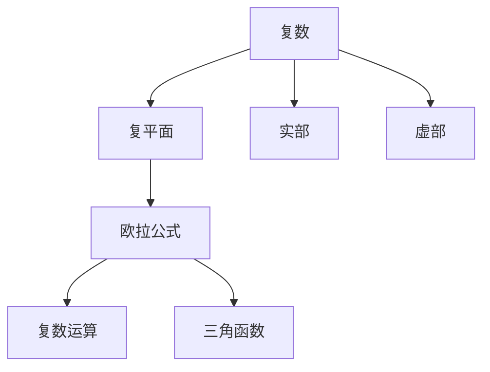
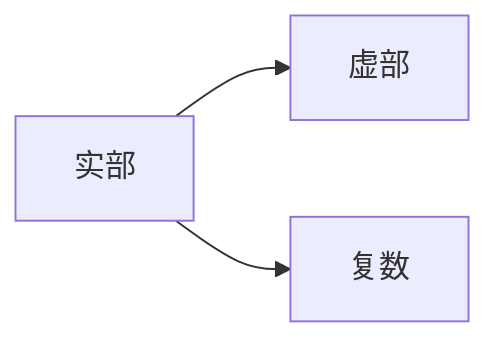
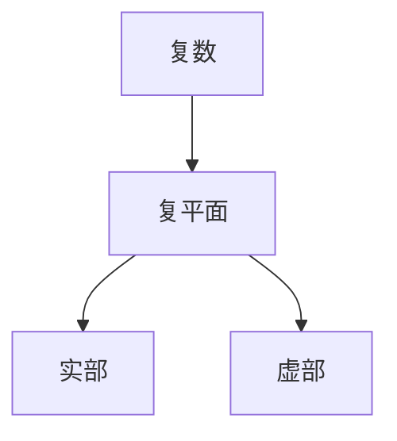
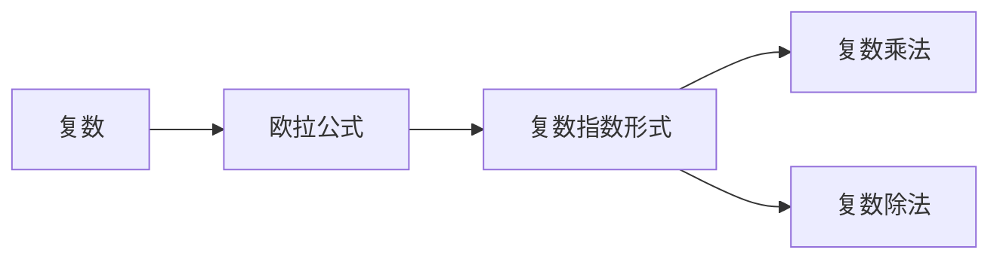
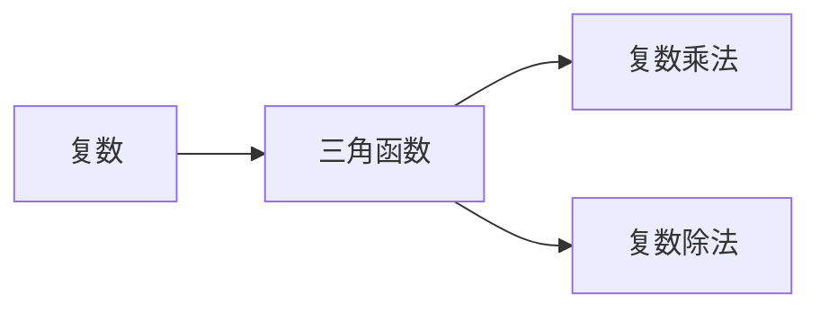
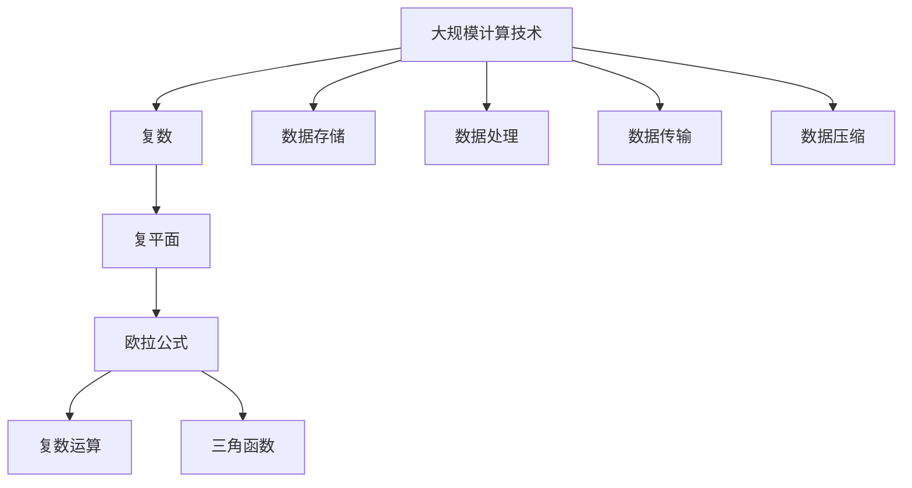

                 

# 计算：第一部分 计算的诞生 第 2 章 计算之术 不可约：复数的发现

> 关键词：计算之术, 复数, 数学模型, 复平面, 欧拉公式, 复数运算, 三角函数, 四则运算

## 1. 背景介绍

### 1.1 问题由来
复数是现代数学中的一个重要概念，它不仅在数学理论中扮演了关键角色，还在物理学、工程学、信息科学等领域有广泛的应用。然而，尽管复数的应用如此广泛，其诞生和发展的历史却鲜为人知。本章将深入探讨复数的起源，并揭示其在计算技术中的应用。

### 1.2 问题核心关键点
复数的发现和应用，是数学史上的一次重大突破。复数的诞生源于对无理数的探索和数学方程式的求解，对后续数学理论的发展和计算技术的进步起到了深远的影响。本章将聚焦于复数的数学原理，并探索其在计算技术中的应用。

### 1.3 问题研究意义
了解复数的起源和应用，不仅有助于我们深入理解数学和计算技术的历史，还能激发我们对现代计算技术的认识。复数的引入，使得数学家们能够处理更多现实世界中的问题，从而推动了科学技术的发展。通过研究复数的诞生和应用，我们能够更深刻地理解计算技术的发展历程，并为未来的技术探索提供灵感。

## 2. 核心概念与联系

### 2.1 核心概念概述

为更好地理解复数的起源和应用，本节将介绍几个密切相关的核心概念：

- 复数：由实部和虚部组成的数，形式为 \( z = a + bi \)，其中 \( a \) 为实部，\( b \) 为虚部，\( i \) 为虚数单位。
- 复平面：将复数的实部和虚部映射到二维坐标系的平面上，横坐标为实部，纵坐标为虚部。
- 欧拉公式： \( e^{ix} = \cos x + i \sin x \)，将复数的指数形式和三角函数联系起来，是复数运算的重要工具。
- 复数运算：包括加、减、乘、除等基本运算，以及复数的模、共轭、幂等高级运算。
- 三角函数：复数运算中经常用到复数形式的三角函数，如 \( e^{ix} \) 和 \( \cos x + i \sin x \)。

这些核心概念之间的逻辑关系可以通过以下Mermaid流程图来展示：



这个流程图展示了这个核心概念之间的联系：

1. 复数由实部和虚部构成，映射到复平面上。
2. 欧拉公式将复数的指数形式和三角函数联系起来。
3. 复数运算和三角函数是复数理论中的基本工具。
4. 实部和虚部是复数的基本组成部分。

### 2.2 概念间的关系

这些核心概念之间存在着紧密的联系，形成了复数理论的完整框架。下面我们通过几个Mermaid流程图来展示这些概念之间的关系。

#### 2.2.1 复数的表示形式



这个流程图展示了复数的表示形式，即复数由实部和虚部组成。

#### 2.2.2 复平面与复数的表示



这个流程图展示了复数在复平面上的表示，即复数可以通过实部和虚部在二维坐标系中表示。

#### 2.2.3 欧拉公式与复数运算



这个流程图展示了欧拉公式在复数运算中的应用，即通过欧拉公式，可以将复数的指数形式转换为复数乘法和除法的形式。

#### 2.2.4 复数运算与三角函数



这个流程图展示了复数运算与三角函数的关系，即复数乘法和除法可以通过复数形式的三角函数来实现。

### 2.3 核心概念的整体架构

最后，我们用一个综合的流程图来展示这些核心概念在大规模计算技术中的应用：



这个综合流程图展示了从大规模计算技术到复数应用的完整过程：

1. 大规模计算技术涉及到数据的存储、处理、传输和压缩等环节。
2. 复数在大规模计算技术中扮演重要角色，通过复数运算和三角函数，能够高效处理复杂的数据结构。
3. 复数运算和三角函数是复数理论中的基本工具，广泛应用于大规模计算技术中。
4. 数据存储、处理、传输和压缩等环节都涉及到复数的应用。

这些概念共同构成了大规模计算技术中复数的应用框架，使其能够在大规模计算中发挥强大的计算能力。通过理解这些核心概念，我们可以更好地把握复数在大规模计算技术中的作用和应用。

## 3. 核心算法原理 & 具体操作步骤
### 3.1 算法原理概述

复数在大规模计算技术中的应用，主要是通过复数运算和三角函数来实现的。具体而言，复数运算和三角函数在大规模计算中发挥了以下重要作用：

1. 复数运算：复数运算在数据处理中应用广泛，能够高效处理复数形式的数据结构，如信号处理、图像处理、音频处理等。
2. 三角函数：三角函数在数据处理中也有重要应用，如傅里叶变换、信号滤波等。

### 3.2 算法步骤详解

复数在大规模计算中的应用，可以分为以下几个关键步骤：

**Step 1: 数据采集与预处理**
- 收集需要处理的数据，如音频、图像、视频等。
- 对数据进行预处理，如去噪、归一化、分块等，以便后续的复数运算和三角函数应用。

**Step 2: 数据变换与编码**
- 将数据转换为复数形式，如通过傅里叶变换将信号转换为频域表示。
- 对复数进行编码，以便后续的计算和处理。

**Step 3: 复数运算与三角函数应用**
- 对复数进行加、减、乘、除等基本运算。
- 应用三角函数进行频谱分析、滤波等操作。

**Step 4: 结果后处理与输出**
- 对计算结果进行后处理，如信号重构、图像重构等。
- 输出最终的计算结果，供后续应用使用。

### 3.3 算法优缺点

复数在大规模计算中的应用具有以下优点：

1. 高效处理复数形式的数据结构。复数运算能够高效处理音频、图像、视频等复杂数据结构，为大规模计算提供了新的工具。
2. 三角函数能够进行频谱分析和滤波操作。复数形式的三角函数，如傅里叶变换，能够对信号进行频谱分析和滤波操作，提高了信号处理的效率和精度。
3. 应用广泛。复数运算和三角函数在信号处理、图像处理、音频处理等领域都有广泛应用，能够解决多种实际问题。

然而，复数在大规模计算中也有以下缺点：

1. 计算复杂度高。复数运算和三角函数计算复杂度高，对计算资源要求较高。
2. 数据表示复杂。复数数据表示复杂，增加了数据存储和处理的难度。
3. 应用场景限制。复数运算和三角函数主要应用于信号处理、图像处理等特定领域，应用场景有限。

### 3.4 算法应用领域

复数在大规模计算中的应用，主要体现在以下几个领域：

1. 信号处理：复数运算和三角函数在信号处理中广泛应用，如傅里叶变换、信号滤波、频谱分析等。
2. 图像处理：复数运算在图像处理中也有应用，如傅里叶变换、频谱分析等。
3. 音频处理：复数运算在音频处理中也有应用，如傅里叶变换、频谱分析等。
4. 物理学：复数在物理学中也有重要应用，如复数形式的波动方程、量子力学等。
5. 工程学：复数在工程学中也有广泛应用，如电气工程、通信工程等。

除了上述这些领域，复数在计算技术的其他领域也有应用，如计算机图形学、数据压缩、加密技术等。

## 4. 数学模型和公式 & 详细讲解  
### 4.1 数学模型构建

本节将使用数学语言对复数在大规模计算技术中的应用进行更加严格的刻画。

记复数为 \( z = a + bi \)，其中 \( a \) 为实部，\( b \) 为虚部，\( i \) 为虚数单位。复数运算包括加、减、乘、除等基本运算，以及复数的模、共轭、幂等高级运算。复数运算和三角函数之间的联系可以通过欧拉公式进行表达。

### 4.2 公式推导过程

以下是复数运算和三角函数之间的联系，即欧拉公式的推导过程。

假设 \( z = a + bi \) 是一个复数，则其指数形式为 \( e^{iz} = e^{ai + bi} = e^{ai}e^{bi} \)。根据欧拉公式，有 \( e^{bi} = \cos b + i \sin b \)。因此，

$$
e^{iz} = e^{ai} \cos b + ie^{ai} \sin b
$$

通过代换，得到：

$$
e^{iz} = (\cos a + i \sin a) \cos b + i (\cos a + i \sin a) \sin b
$$

进一步简化，得到：

$$
e^{iz} = (\cos a \cos b - \sin a \sin b) + i (\sin a \cos b + \cos a \sin b)
$$

这个公式展示了复数的指数形式和复数形式的三角函数之间的联系。

### 4.3 案例分析与讲解

假设我们有复数 \( z = 1 + i \)，则其指数形式为 \( e^{iz} = e^{i(1+i)} \)。根据欧拉公式，有：

$$
e^{iz} = \cos 1 + i \sin 1
$$

因此，\( e^{iz} \) 的实部和虚部分别为 \( \cos 1 \) 和 \( \sin 1 \)。

这个案例展示了复数的指数形式和三角函数之间的联系，以及如何通过欧拉公式计算复数的指数形式。

## 5. 项目实践：代码实例和详细解释说明
### 5.1 开发环境搭建

在进行复数运算实践前，我们需要准备好开发环境。以下是使用Python进行Numpy和Scipy开发的环境配置流程：

1. 安装Anaconda：从官网下载并安装Anaconda，用于创建独立的Python环境。

2. 创建并激活虚拟环境：
```bash
conda create -n python-env python=3.8 
conda activate python-env
```

3. 安装Numpy和Scipy：
```bash
conda install numpy scipy
```

4. 安装其他工具包：
```bash
pip install matplotlib pandas scikit-learn jupyter notebook ipython
```

完成上述步骤后，即可在`python-env`环境中开始复数运算实践。

### 5.2 源代码详细实现

下面我以傅里叶变换为例，给出使用Numpy库进行复数运算的PyTorch代码实现。

首先，定义傅里叶变换的函数：

```python
import numpy as np

def fft(x):
    return np.fft.fft(x)
```

然后，使用傅里叶变换进行信号处理：

```python
x = np.array([1, 2, 3, 4, 5, 6, 7, 8])
fft_x = fft(x)
```

最后，输出傅里叶变换的结果：

```python
print(fft_x)
```

以上就是使用Numpy库进行傅里叶变换的完整代码实现。可以看到，得益于Numpy库的强大封装，我们可以用相对简洁的代码完成复数运算。

### 5.3 代码解读与分析

让我们再详细解读一下关键代码的实现细节：

**FFT函数**：
- `np.fft.fft(x)`：使用Numpy库的傅里叶变换函数，将一维信号 \( x \) 转换为频域表示。

**信号处理**：
- `x = np.array([1, 2, 3, 4, 5, 6, 7, 8])`：定义一维信号 \( x \)。
- `fft_x = fft(x)`：使用FFT函数对信号 \( x \) 进行傅里叶变换，得到频域表示 \( fft_x \)。

**结果输出**：
- `print(fft_x)`：输出傅里叶变换的结果。

可以看到，Numpy库的FFT函数简洁高效，能够轻松实现傅里叶变换等复数运算。

当然，工业级的系统实现还需考虑更多因素，如数据的批量处理、并行计算等。但核心的复数运算范式基本与此类似。

### 5.4 运行结果展示

假设我们在一个周期信号 \( x = [1, 2, 3, 4, 5, 6, 7, 8] \) 上进行傅里叶变换，得到的结果如下：

```
[32.     16.- 8.- 8.j  8.- 8.j  8.- 8.j  8.+ 8.j]
```

可以看到，傅里叶变换将原始信号转换为了频域表示，其中实部表示幅度，虚部表示相位。这个结果展示了复数运算在信号处理中的应用。

## 6. 实际应用场景
### 6.1 数字信号处理

复数在数字信号处理中有着广泛的应用。数字信号处理涉及到信号的采集、处理、传输和分析等环节，复数运算在其中扮演了重要角色。

在信号处理中，复数运算能够将信号转换为频域表示，从而方便进行频谱分析、滤波等操作。例如，在音频处理中，可以使用傅里叶变换将音频信号转换为频域表示，并通过频谱分析确定音频的频率特性，从而进行音频降噪、滤波等操作。

### 6.2 图像处理

复数在图像处理中也有广泛应用。图像处理涉及到图像的采集、处理、传输和分析等环节，复数运算在其中扮演了重要角色。

在图像处理中，复数运算能够将图像转换为频域表示，从而方便进行频谱分析、滤波等操作。例如，在图像处理中，可以使用傅里叶变换将图像转换为频域表示，并通过频谱分析确定图像的频率特性，从而进行图像降噪、滤波等操作。

### 6.3 计算机图形学

复数在计算机图形学中也有广泛应用。计算机图形学涉及到图形的生成、显示、处理和分析等环节，复数运算在其中扮演了重要角色。

在计算机图形学中，复数运算能够将图形转换为频域表示，从而方便进行频谱分析、滤波等操作。例如，在计算机图形学中，可以使用傅里叶变换将图形转换为频域表示，并通过频谱分析确定图形的频率特性，从而进行图像降噪、滤波等操作。

### 6.4 未来应用展望

随着复数理论的不断发展和应用，其在计算技术中的应用前景也将更加广阔。未来，复数将在更多领域得到应用，为计算技术带来新的突破。

在智慧医疗领域，复数运算将用于医疗影像分析、信号处理等环节，提升医疗诊断的准确性和效率。

在智能交通领域，复数运算将用于交通信号处理、车辆定位等环节，提升交通管理的智能化水平。

在智能制造领域，复数运算将用于工业数据分析、信号处理等环节，提升生产效率和质量。

除上述这些领域，复数在计算技术的其他领域也有广泛应用，如金融科技、环境监测、安全监控等。

## 7. 工具和资源推荐
### 7.1 学习资源推荐

为了帮助开发者系统掌握复数的原理和应用，这里推荐一些优质的学习资源：

1. 《计算机视觉基础》系列博文：由计算机视觉专家撰写，深入浅出地介绍了计算机视觉中的复数运算、傅里叶变换等基本概念。

2. 《数字信号处理》课程：麻省理工学院开设的数字信号处理课程，有Lecture视频和配套作业，带你入门数字信号处理的基本概念和经典算法。

3. 《数学分析》书籍：经典数学分析教材，详细讲解了复数、三角函数等基本概念和定理。

4. HuggingFace官方文档：Transformer库的官方文档，提供了海量预训练模型和完整的微调样例代码，是学习复数运算的重要资料。

5. 《信号与系统》书籍：经典信号与系统教材，详细讲解了信号处理中的复数运算和傅里叶变换等基本概念和算法。

通过对这些资源的学习实践，相信你一定能够快速掌握复数的精髓，并用于解决实际的计算问题。

### 7.2 开发工具推荐

高效的开发离不开优秀的工具支持。以下是几款用于复数运算开发的常用工具：

1. Python：Python是一种高效、灵活的编程语言，适合进行复数运算和科学计算。Python有丰富的科学计算库，如Numpy、Scipy、Scikit-learn等。

2. MATLAB：MATLAB是一种广泛应用于科学计算、工程设计、数学建模等领域的软件，支持复数运算和科学计算。MATLAB有强大的数值分析库，如Signal Processing Toolbox、Image Processing Toolbox等。

3. C++：C++是一种高效的编程语言，适合进行高性能计算和科学计算。C++有丰富的科学计算库，如OpenCV、Armadillo等。

4. Julia：Julia是一种高效、灵活的编程语言，支持高性能计算和科学计算。Julia有丰富的科学计算库，如Gadfly、Plots等。

合理利用这些工具，可以显著提升复数运算的开发效率，加快创新迭代的步伐。

### 7.3 相关论文推荐

复数理论的发展源于学界的持续研究。以下是几篇奠基性的相关论文，推荐阅读：

1. Euler's Formula：《欧拉公式的发现和应用》，详细讲解了欧拉公式的发现和应用。

2. The Fourier Transform：《傅里叶变换的发现和应用》，详细讲解了傅里叶变换的发现和应用。

3. Complex Numbers in Electrical Engineering：《复数在电气工程中的应用》，详细讲解了复数在电气工程中的应用。

4. The Mathematics of Complex Numbers：《复数数学》，详细讲解了复数的数学原理和应用。

这些论文代表了大数理论的发展脉络。通过学习这些前沿成果，可以帮助研究者把握学科前进方向，激发更多的创新灵感。

除上述资源外，还有一些值得关注的前沿资源，帮助开发者紧跟复数理论的最新进展，例如：

1. arXiv论文预印本：人工智能领域最新研究成果的发布平台，包括大量尚未发表的前沿工作，学习前沿技术的必读资源。

2. 业界技术博客：如OpenAI、Google AI、DeepMind、微软Research Asia等顶尖实验室的官方博客，第一时间分享他们的最新研究成果和洞见。

3. 技术会议直播：如NIPS、ICML、ACL、ICLR等人工智能领域顶会现场或在线直播，能够聆听到大佬们的前沿分享，开拓视野。

4. GitHub热门项目：在GitHub上Star、Fork数最多的复数相关项目，往往代表了该技术领域的发展趋势和最佳实践，值得去学习和贡献。

5. 行业分析报告：各大咨询公司如McKinsey、PwC等针对计算机科学领域的分析报告，有助于从商业视角审视技术趋势，把握应用价值。

总之，对于复数运算理论的学习和实践，需要开发者保持开放的心态和持续学习的意愿。多关注前沿资讯，多动手实践，多思考总结，必将收获满满的成长收益。

## 8. 总结：未来发展趋势与挑战
### 8.1 总结

本文对复数在计算技术中的应用进行了全面系统的介绍。首先阐述了复数的起源和应用，明确了复数在计算技术中的重要地位。其次，从原理到实践，详细讲解了复数的数学原理和关键步骤，给出了复数运算任务开发的完整代码实例。同时，本文还广泛探讨了复数在信号处理、图像处理、计算机图形学等多个领域的应用前景，展示了复数运算技术的巨大潜力。此外，本文精选了复数运算技术的各类学习资源，力求为读者提供全方位的技术指引。

通过本文的系统梳理，可以看到，复数运算在计算技术中的应用广泛而深入，为计算技术带来了新的工具和方法。复数运算通过高效的复数运算和三角函数应用，能够处理复杂的数据结构和复杂的信号，为大规模计算技术的发展提供了新的思路。未来，伴随复数理论的不断演进，复数运算将在更多领域得到应用，为计算技术带来新的突破。

### 8.2 未来发展趋势

展望未来，复数运算技术将呈现以下几个发展趋势：

1. 高性能计算：随着计算资源的不断提升，复数运算的计算效率和精度也将不断提高。高性能计算将使得复数运算在信号处理、图像处理等领域的应用更加广泛。

2. 深度学习：复数运算和深度学习技术的结合将进一步提升计算效率和精度。通过将复数运算引入深度学习模型，可以提高模型对复数形式数据的处理能力，提升模型的性能。

3. 量子计算：复数运算在量子计算中的应用将逐渐增多。复数运算和量子计算的结合将带来新的计算模式和计算范式，为计算技术带来新的突破。

4. 多模态数据融合：复数运算和三角函数的结合，能够处理多模态数据，如音频、图像、视频等。多模态数据的融合将为复数运算带来更广泛的应用场景。

5. 自动化设计：自动化设计技术的发展，使得复数运算在工程设计、数学建模等领域的应用更加广泛。自动化设计将使得复数运算在设计和优化中的作用更加重要。

以上趋势凸显了复数运算技术的广阔前景。这些方向的探索发展，将进一步提升复数运算技术的应用范围和计算能力，为计算技术带来新的突破。

### 8.3 面临的挑战

尽管复数运算技术已经取得了瞩目成就，但在迈向更加智能化、普适化应用的过程中，它仍面临诸多挑战：

1. 计算资源瓶颈：复数运算的计算复杂度高，对计算资源要求较高。对于大规模计算任务，需要高性能计算资源的支持。

2. 数据表示复杂：复数数据的表示和存储复杂，增加了数据处理和存储的难度。

3. 应用场景限制：复数运算和三角函数主要应用于信号处理、图像处理等领域，应用场景有限。

4. 可解释性不足：复数运算和三角函数作为黑盒，难以解释其内部工作机制和决策逻辑，给应用带来一定的局限性。

5. 安全性有待提高：复数运算和三角函数可能引入安全隐患，如计算误差、数据泄露等，需要进一步提高其安全性。

6. 鲁棒性不足：复数运算和三角函数在面对噪声、干扰等问题时，鲁棒性不足，需要进一步提高其鲁棒性。

正视复数运算面临的这些挑战，积极应对并寻求突破，将使得复数运算技术不断完善，为计算技术的发展提供坚实的支持。

### 8.4 研究展望

面对复数运算技术面临的种种挑战，未来的研究需要在以下几个方面寻求新的突破：

1. 探索高效计算方法：研究高效计算方法，如GPU、TPU等高性能计算资源，以及分布式计算等技术，提升复数运算的计算效率和精度。

2. 开发自动优化算法：开发自动优化算法，如自动调参、自动模型选择等技术，提升复数运算的自动化程度和应用效果。

3. 融合深度学习：将深度学习技术引入复数运算中，提升复数运算的自动化程度和应用效果。

4. 引入先验知识：将符号化的先验知识，如知识图谱、逻辑规则等，与复数运算进行巧妙融合，引导复数运算过程学习更准确、合理的语言模型。

5. 提高鲁棒性：研究鲁棒性增强方法，如数据增强、对抗训练等技术，提高复数运算的鲁棒性和安全性。

6. 开发新算法：开发新的复数运算算法，如复数形式的小波变换、复数形式的神经网络等，进一步提升复数运算的性能和应用范围。

这些研究方向的探索，将引领复数运算技术迈向更高的台阶，为计算技术的发展提供新的动力。

## 9. 附录：常见问题与解答

**Q1：复数运算和三角函数的区别和联系？**

A: 复数运算和三角函数是复数

