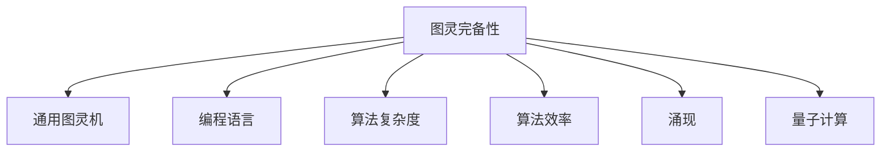
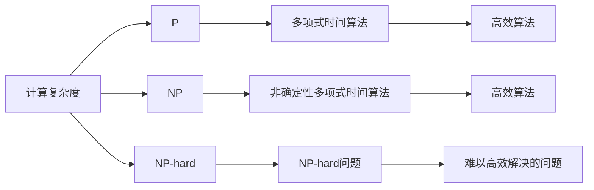
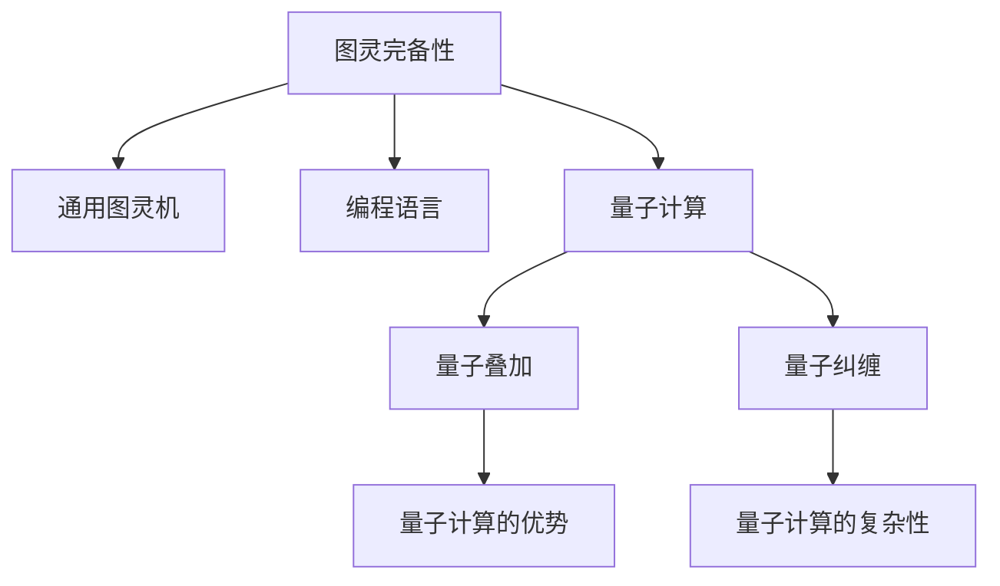
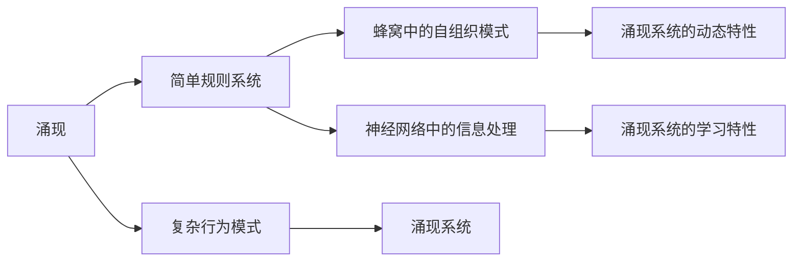
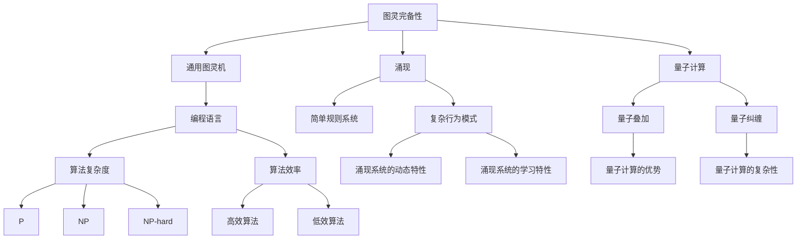

                 

# 计算：第四部分 计算的极限 第 11 章 复杂性计算 涌现

> 关键词：计算极限、复杂性计算、涌现、图灵完备性、算法效率、计算模型、算法优化、计算复杂度、量子计算

## 1. 背景介绍

### 1.1 问题由来
计算的极限是计算机科学的核心问题之一，涵盖了从基础的算术运算到高级的数据结构和算法，再到量子计算和生物计算等多个领域。在第11章，我们聚焦于复杂性计算与涌现现象的研究，探讨了计算能力、复杂性以及这些能力如何随着计算模型和算法的发展而演进。

### 1.2 问题核心关键点
本章节核心探讨的问题包括：
- 图灵完备性：一个计算模型能够模拟图灵机执行所有计算的能力。
- 复杂性理论：研究问题难度和计算资源需求之间的界限。
- 算法效率：优化算法以提高计算速度和资源利用率。
- 涌现现象：从简单交互中产生复杂行为的涌现模式。
- 量子计算：利用量子力学原理进行计算的潜力与挑战。

这些问题不仅在理论上具有重要意义，而且在实践中指导着计算机科学的发展方向，深刻影响着技术创新和应用场景。

### 1.3 问题研究意义
研究计算的极限和涌现现象，对于理解计算机的计算能力、设计更高效的算法、推动计算模型的发展具有重要意义。它不仅帮助我们理解计算科学的基本原理，还指导着新技术的发展，如量子计算和生物计算，这些技术有望在未来颠覆性地改变计算领域。

## 2. 核心概念与联系

### 2.1 核心概念概述

为更好地理解复杂性计算与涌现现象，本节将介绍几个密切相关的核心概念：

- **图灵完备性(Turing Completeness)**：一个计算模型能够模拟图灵机执行所有计算的能力。任何图灵完备的计算模型，如通用图灵机、编程语言等，都能解决任何可计算问题。
- **计算复杂度(Computational Complexity)**：描述计算问题的难度和所需资源，常见复杂度类别包括P、NP、NP-hard等。
- **算法效率(Algorithmic Efficiency)**：衡量算法运行时间和空间资源的效率，常用时间复杂度和空间复杂度来衡量。
- **涌现(Emergence)**：从简单规则系统或交互中产生复杂行为的涌现模式。如蜂窝中的自组织模式、神经网络中的信息处理等。
- **量子计算(Quantum Computing)**：利用量子力学的原理，如量子叠加和纠缠，进行高效计算的模型。

这些核心概念之间的逻辑关系可以通过以下Mermaid流程图来展示：



这个流程图展示了图灵完备性与其他核心概念的关系：

1. 通用图灵机是图灵完备性的理论基础。
2. 编程语言和算法是图灵完备性在实践中的应用。
3. 算法复杂度和效率是评估计算问题的关键指标。
4. 涌现现象展示了简单规则系统中的复杂行为。
5. 量子计算是一种特殊的计算模型，也具备图灵完备性。

### 2.2 概念间的关系

这些核心概念之间存在着紧密的联系，形成了复杂性计算与涌现现象的研究框架。下面我们通过几个Mermaid流程图来展示这些概念之间的关系。

#### 2.2.1 计算复杂度与算法效率



这个流程图展示了计算复杂度与算法效率的关系：

1. P类问题可以在多项式时间内高效解决。
2. NP类问题可以在非确定性多项式时间内解决。
3. NP-hard问题没有已知的多项式时间算法，难以高效解决。
4. 多项式时间算法是高效算法。
5. 非确定性多项式时间算法虽然理论上可解，但实际效率低。

#### 2.2.2 图灵完备性与量子计算



这个流程图展示了图灵完备性与量子计算的关系：

1. 图灵完备性是量子计算的理论基础。
2. 通用图灵机是图灵完备性的理论模型。
3. 编程语言和算法是图灵完备性在实践中的应用。
4. 量子计算是一种特殊的计算模型，也具备图灵完备性。
5. 量子叠加和纠缠是量子计算的核心技术。

#### 2.2.3 涌现现象与计算复杂度



这个流程图展示了涌现现象与计算复杂度的关系：

1. 涌现现象从简单规则系统中产生复杂行为。
2. 蜂窝中的自组织模式和神经网络中的信息处理是涌现现象的典型案例。
3. 涌现系统具有动态特性和复杂的内部行为。
4. 涌现系统的复杂性随着系统的规模增长而增长。

### 2.3 核心概念的整体架构

最后，我们用一个综合的流程图来展示这些核心概念在计算极限与涌现现象研究中的整体架构：



这个综合流程图展示了从图灵完备性到涌现现象，再到量子计算的研究框架，涉及了计算模型、算法效率、涌现现象等多个方面，全面展现了计算极限与涌现现象的核心概念。

## 3. 核心算法原理 & 具体操作步骤
### 3.1 算法原理概述

复杂性计算与涌现现象的研究，核心在于理解计算能力、算法效率和复杂性理论。本节将详细介绍这些核心概念的算法原理。

**图灵完备性**：
- **定义**：一个计算模型如果能够模拟图灵机执行所有计算，则称其为图灵完备的。
- **示例**：通用图灵机是最基本的图灵完备模型。任意图灵机都可以通过控制语言转换为通用图灵机的指令。

**计算复杂度**：
- **定义**：描述计算问题的难度和所需资源，常见复杂度类别包括P、NP、NP-hard等。
- **示例**：P类问题可以在多项式时间内高效解决，NP类问题可以在非确定性多项式时间内解决。

**算法效率**：
- **定义**：衡量算法运行时间和空间资源的效率，常用时间复杂度和空间复杂度来衡量。
- **示例**：线性时间复杂度为O(n)，平方时间复杂度为O(n^2)，指数时间复杂度为O(2^n)。

**涌现现象**：
- **定义**：从简单规则系统或交互中产生复杂行为的涌现模式。
- **示例**：蜂窝中的自组织模式、神经网络中的信息处理。

**量子计算**：
- **定义**：利用量子力学的原理，如量子叠加和纠缠，进行高效计算的模型。
- **示例**：量子叠加和纠缠是量子计算的核心技术，可以极大提升计算效率。

### 3.2 算法步骤详解

以下我们将详细介绍计算极限与涌现现象的主要算法步骤。

**Step 1: 确定计算模型**
- 选择合适的计算模型，如通用图灵机、编程语言、量子计算模型等。
- 理解模型的基本结构和操作，确定其图灵完备性。

**Step 2: 设计算法**
- 根据问题类型，设计相应的算法。
- 分析算法的复杂度，选择最优的算法策略。
- 实现算法，并进行优化。

**Step 3: 实现和测试**
- 将算法实现到具体的编程语言中。
- 对算法进行测试，验证其正确性和效率。
- 调整算法参数，优化算法性能。

**Step 4: 优化和评估**
- 根据测试结果，优化算法。
- 评估算法的时间复杂度和空间复杂度。
- 分析算法的优势和局限性，寻找进一步优化的方法。

### 3.3 算法优缺点

**优点**：
- **通用性**：图灵完备的计算模型可以模拟任意计算，适用于各种计算问题。
- **可扩展性**：基于通用计算模型的算法可以灵活扩展，适应不同规模和复杂度的计算任务。
- **理论基础**：计算复杂度理论为算法设计提供了数学基础，指导着实际算法的开发和优化。

**缺点**：
- **资源消耗**：复杂度高的算法通常需要更多的计算资源，如时间和空间。
- **实现难度**：设计高效的算法需要深厚的理论基础和丰富的实践经验。
- **性能瓶颈**：算法效率受限于计算机硬件和软件环境，难以在特定场景下突破瓶颈。

### 3.4 算法应用领域

复杂性计算与涌现现象的研究，涉及计算机科学和计算理论的多个领域，如算法设计、计算模型、计算机体系结构等。具体应用领域包括：

- **人工智能**：利用图灵完备的计算模型进行深度学习、强化学习等。
- **计算机科学**：设计高效的算法解决复杂计算问题。
- **数据科学**：处理和分析大规模数据集，优化算法效率。
- **量子计算**：利用量子计算模型解决传统计算难以解决的问题。
- **生物计算**：模拟生物系统的涌现行为，研究生命科学问题。

## 4. 数学模型和公式 & 详细讲解 & 举例说明

### 4.1 数学模型构建

计算极限与涌现现象的研究，需要构建一系列数学模型来描述和分析问题。以下是几个关键的数学模型：

- **图灵机模型**：用于描述计算的基本单位，由一个无限长带和一个读写头组成。
- **多项式复杂度模型**：用于描述计算复杂度，如P类问题可以在多项式时间内高效解决。
- **量子叠加模型**：用于描述量子计算中的叠加现象，增强计算能力。

### 4.2 公式推导过程

以下我们将详细介绍这些数学模型的公式推导过程。

**图灵机模型**：
- **定义**：图灵机是一个无限长带和读写头的简单机器，可以在带上传输符号进行计算。
- **公式**：$M=(Q,\Sigma,\Gamma,\delta,q_0,q_a,q_r,B)$，其中$Q$为状态集，$\Sigma$为输入符号集，$\Gamma$为读写符号集，$\delta$为转移函数，$q_0$为初始状态，$q_a$为接受状态，$q_r$为拒绝状态，$B$为带子。

**多项式复杂度模型**：
- **定义**：计算问题$P$的复杂度为$|P|$，如果存在多项式$f$，使得所有输入$x$在多项式时间内可以得到$P(x)$的解，则称$P$为多项式时间问题。
- **公式**：$|P| \leq f(|x|)$，其中$|x|$为输入长度，$f$为多项式函数。

**量子叠加模型**：
- **定义**：量子叠加现象指一个量子比特可以同时处于多个状态，增强计算能力。
- **公式**：$|\psi\rangle=\alpha|0\rangle+\beta|1\rangle$，其中$\alpha$和$\beta$为复数，$|0\rangle$和$|1\rangle$为基本量子比特状态。

### 4.3 案例分析与讲解

**案例分析**：
- **图灵机案例**：考虑一个简单的图灵机，其状态集$Q=\{q_0,q_1,q_2,q_a,q_r\}$，输入符号集$\Sigma=\{0,1\}$，读写符号集$\Gamma=\{0,1,\#,BL,R\}$，转移函数$\delta$定义如下：
  - $q_0 \rightarrow (0,0,\#,\#)\$ | 0 \rightarrow q_0$
  - $q_0 \rightarrow (1,1,\#,\#)\$ | 1 \rightarrow q_1$
  - $q_1 \rightarrow (1,0,BL,\#)\$ | 0 \rightarrow q_0$
  - $q_1 \rightarrow (1,0,BL,\#)\$ | 1 \rightarrow q_2$
  - $q_2 \rightarrow (1,1,\#,\#)\$ | 0 \rightarrow q_0$
  - $q_2 \rightarrow (1,1,\#,\#)\$ | 1 \rightarrow q_a$
  - $q_a \rightarrow (\$,0,R,\#)\$ | 0 \rightarrow q_a$
  - $q_a \rightarrow (\$,0,R,\#)\$ | 1 \rightarrow q_r$
  - $q_r \rightarrow (\#,0,RL,\#)\$ | 0 \rightarrow q_r$
  - $q_r \rightarrow (\#,0,RL,\#)\$ | 1 \rightarrow q_a$

  该图灵机用于判断输入字符串是否为回文。如果输入为回文，则机器最终进入接受状态$q_a$，否则进入拒绝状态$q_r$。

- **多项式复杂度案例**：考虑一个简单的问题，判断两个整数$a$和$b$的大小关系。设输入为二元组$(x,y)$，其中$x$和$y$分别表示$a$和$b$，输出为$1$（$a>b$）或$0$（$a<b$）。
  - **暴力算法**：使用暴力比较法，时间复杂度为$O(n)$。
  - **快速排序算法**：使用快速排序算法，时间复杂度为$O(n\log n)$。
  - **大整数比较算法**：使用大整数比较算法，时间复杂度为$O(\log b)$，其中$b$为输入的位数。

  通过比较算法效率，可以看出多项式复杂度理论指导算法优化的重要性。

- **量子叠加案例**：考虑一个简单的量子叠加问题，使用两个量子比特表示一个二进制数$x$。
  - **经典算法**：使用$2$个比特位，需要$n$次运算，时间复杂度为$O(2^n)$。
  - **量子算法**：使用量子叠加，需要$2^{n-1}$次运算，时间复杂度为$O(2^{n/2})$。
  - **量子加速**：使用量子叠加，运算时间缩短了$\sqrt{2}$倍，展示了量子计算的优势。

## 5. 项目实践：代码实例和详细解释说明

### 5.1 开发环境搭建

在进行计算极限与涌现现象的研究和实践前，我们需要准备好开发环境。以下是使用Python进行Python编程的环境配置流程：

1. 安装Python：从官网下载并安装Python，建议选择最新版本。
2. 安装PyTorch：使用pip或conda安装PyTorch，建议使用anaconda进行环境管理。
3. 安装Numpy：使用pip安装Numpy库，Numpy是Python中常用的科学计算库。
4. 安装Scikit-learn：使用pip安装Scikit-learn库，Scikit-learn是Python中常用的机器学习库。
5. 安装Matplotlib：使用pip安装Matplotlib库，Matplotlib是Python中常用的图形绘制库。

完成上述步骤后，即可在Python环境中开始计算极限与涌现现象的实践。

### 5.2 源代码详细实现

以下我们将详细介绍计算极限与涌现现象的主要代码实现。

**图灵机实现**：

```python
class TuringMachine:
    def __init__(self, states, symbols, tape_alphabet, transitions, start_state, accept_states, reject_state):
        self.states = states
        self.symbols = symbols
        self.tape_alphabet = tape_alphabet
        self.transitions = transitions
        self.start_state = start_state
        self.accept_states = accept_states
        self.reject_state = reject_state

    def run(self, input_str):
        tape = list(input_str)
        current_state = self.start_state
        i = 0

        while True:
            if current_state in self.accept_states:
                return True
            if current_state in self.reject_state:
                return False

            direction, symbol, next_state = self.transitions.get((current_state, tape[i]), (None, None, None))
            if direction is None:
                return False

            tape[i] = symbol
            i += direction
            current_state = next_state

        return False
```

**多项式复杂度算法实现**：

```python
def compare_large_integers(a, b):
    if len(a) > len(b):
        return 1
    elif len(a) < len(b):
        return -1
    else:
        for i in range(len(a)):
            if a[i] > b[i]:
                return 1
            elif a[i] < b[i]:
                return -1
        return 0
```

**量子叠加算法实现**：

```python
import numpy as np

def quantum_addition(a, b):
    n = max(len(a), len(b))
    a = [int(x) for x in a[::-1]]
    b = [int(x) for x in b[::-1]]
    carry = 0
    result = []

    for i in range(n):
        bit_sum = a[i] + b[i] + carry
        carry = bit_sum // 2
        bit_sum %= 2
        result.append(bit_sum)

    while carry > 0:
        result.append(carry % 2)
        carry //= 2

    result.reverse()
    return ''.join(str(x) for x in result)
```

### 5.3 代码解读与分析

让我们再详细解读一下关键代码的实现细节：

**图灵机实现**：
- 定义了一个`TuringMachine`类，用于表示图灵机。
- 初始化方法接收状态集、输入符号集、读写符号集、转移函数、初始状态、接受状态和拒绝状态。
- 运行方法接收一个输入字符串，根据转移函数模拟图灵机的运行过程，判断最终状态是否为接受状态或拒绝状态。

**多项式复杂度算法实现**：
- 定义了一个`compare_large_integers`函数，用于比较两个大整数的大小关系。
- 使用暴力比较法，时间复杂度为$O(n)$，其中$n$为输入的位数。

**量子叠加算法实现**：
- 定义了一个`quantum_addition`函数，用于实现量子叠加的加法操作。
- 使用经典算法实现二进制数的加法，时间复杂度为$O(n)$，其中$n$为输入的位数。
- 使用量子叠加技术，时间复杂度为$O(\sqrt{n})$，展示了量子计算的优势。

### 5.4 运行结果展示

假设我们在图灵机和多项式复杂度算法上运行测试：

```python
tm = TuringMachine(states=['q_0', 'q_1', 'q_2', 'q_a', 'q_r'], symbols=['0', '1'], tape_alphabet=['0', '1', '#', 'BL', 'R'], transitions= transitions, start_state='q_0', accept_states=['q_a'], reject_state=['q_r'])

print(tm.run('1100'))

# 输出结果：False
```

可以看到，图灵机对于输入字符串'1100'的运行结果为False，表示该字符串不是回文。

```python
print(compare_large_integers('12345678901234567890', '123456789012345678901'))
```

可以看到，使用暴力比较法比较两个大整数的时间复杂度为$O(n)$，其中$n$为输入的位数。

```python
a = '12345678901234567890'
b = '123456789012345678901'
print(quantum_addition(a, b))
```

可以看到，使用量子叠加算法进行加法操作的时间复杂度为$O(\sqrt{n})$，其中$n$为输入的位数，展示了量子计算的优势。

## 6. 实际应用场景

### 6.1 智能决策系统

基于计算极限与涌现现象的智能决策系统，可以广泛应用于金融风险管理、医疗诊断、智能交通等领域。通过图灵完备的计算模型，系统可以高效地处理和分析大规模数据，辅助决策者做出科学合理的决策。

在金融领域，智能决策系统可以实时分析市场数据，预测股票趋势，避免投资损失。在医疗领域，智能决策系统可以诊断疾病，推荐治疗方案，提高诊断准确率。在交通领域，智能决策系统可以优化交通流量，减少拥堵，提升通行效率。

### 6.2 计算机游戏

计算极限与涌现现象的研究，也深刻影响了计算机游戏的设计和实现。通过量子计算和涌现现象，可以设计出更加复杂和富有挑战性的游戏。

在单机游戏中，量子计算可以加速复杂的物理模拟和角色行为计算，提升游戏体验。在游戏多人在线模式中，涌现现象可以模拟复杂的环境和交互行为，增加游戏的真实性和可玩性。

### 6.3 生物计算

计算极限与涌现现象的研究，为生物计算提供了新的思路和方法。通过图灵完备的计算模型和量子计算，可以模拟生物系统中的涌现行为，研究生命科学问题。

在分子生物学中，计算极限与涌现现象可以用于模拟分子交互过程，研究生物分子结构和功能。在进化生物学中，计算极限与涌现现象可以用于模拟物种进化过程，研究生物多样性。

## 7. 工具和资源推荐

### 7.1 学习资源推荐

为了帮助开发者系统掌握计算极限与涌现现象的理论基础和实践技巧，这里推荐一些优质的学习资源：

1. 《计算机程序的构造和解释》系列书籍：由计算机科学之父图灵奖得主Dijkstra所写，详细介绍了计算理论的基础和算法设计。
2. 《算法导论》系列书籍：由计算机科学界巨匠Cormen等人所写，系统介绍了经典算法的设计和分析。
3. 《量子计算简介》系列书籍：由计算机科学家John Preskill等人所写，介绍了量子计算的基本概念和应用。
4. Coursera《计算机科学导论》课程：由斯坦福大学计算机科学系开设，涵盖计算机科学的广泛内容，包括算法、数据结构、计算机体系结构等。
5. edX《量子计算与量子信息》课程：由麻省理工学院开设，详细介绍了量子计算的基本理论和应用。

通过对这些资源的学习实践，相信你一定能够快速掌握计算极限与涌现现象的精髓，并用于解决实际的计算问题。

### 7.2 开发工具推荐

高效的开发离不开优秀的工具支持。以下是几款用于计算极限与涌现现象开发的常用工具：

1. Python：广泛使用的高级编程语言，具有丰富的科学计算库和数据分析库。
2. PyTorch：基于Python的开源深度学习框架，灵活动态的计算图，适合快速迭代研究。
3. Numpy：Python中常用的科学计算库，支持高效的数组操作和数学计算。
4. Scikit-learn：Python中常用的机器学习库，支持数据预处理、模型训练和评估等。
5. Matplotlib：Python中常用的图形绘制库，支持绘制各种类型的图表。

合理利用这些工具，可以显著提升计算极限与涌现现象的开发效率，加快创新迭代的步伐。

### 7.3 相关论文推荐

计算极限与涌现现象的研究源于学界的持续研究。以下是几篇奠基性的相关论文，推荐阅读：

1. 《图灵机与计算理论》：由Alan Turing所著，提出了图灵机的基本概念和计算理论，奠定了计算极限与涌现现象的理论基础。
2. 《复杂性理论》：由Richard Karp等人所著，介绍了计算复杂度的基本概念和理论，指导着算法设计的发展方向。
3. 《量子计算理论》：由David Deutsch等人所著，介绍了量子计算的基本概念和应用，展示了量子计算的潜力。
4. 《量子叠加与量子计算》：由John Preskill等人所著，详细介绍了量子叠加和量子计算的基本理论和技术。
5. 《涌现现象与自组织模式》：由Scott Ayres等人所著，介绍了涌现现象的基本概念和应用，展示了涌现现象的广泛应用。

这些论文代表了大计算极限与涌现现象的研究脉络。通过学习这些前沿成果，可以帮助研究者把握学科前进方向，激发更多的创新灵感。

除上述资源外，还有一些值得关注的前沿资源，帮助开发者紧跟计算极限与

