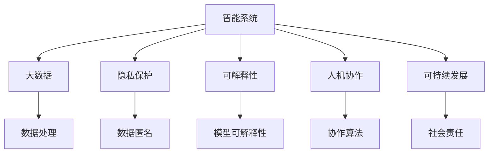
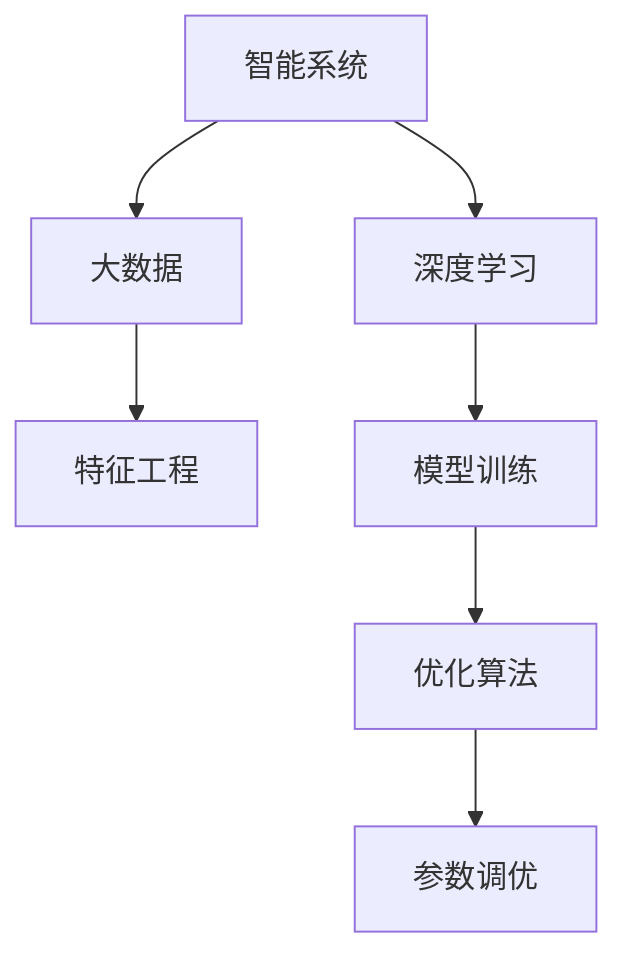
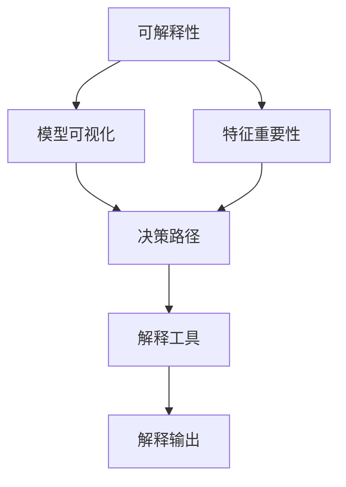
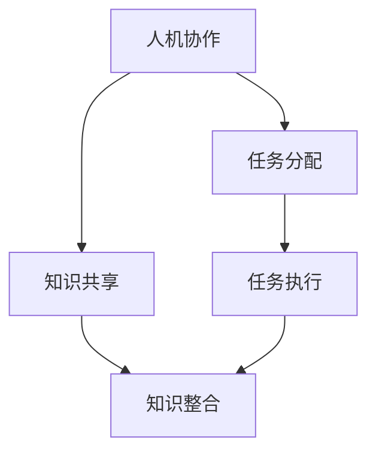
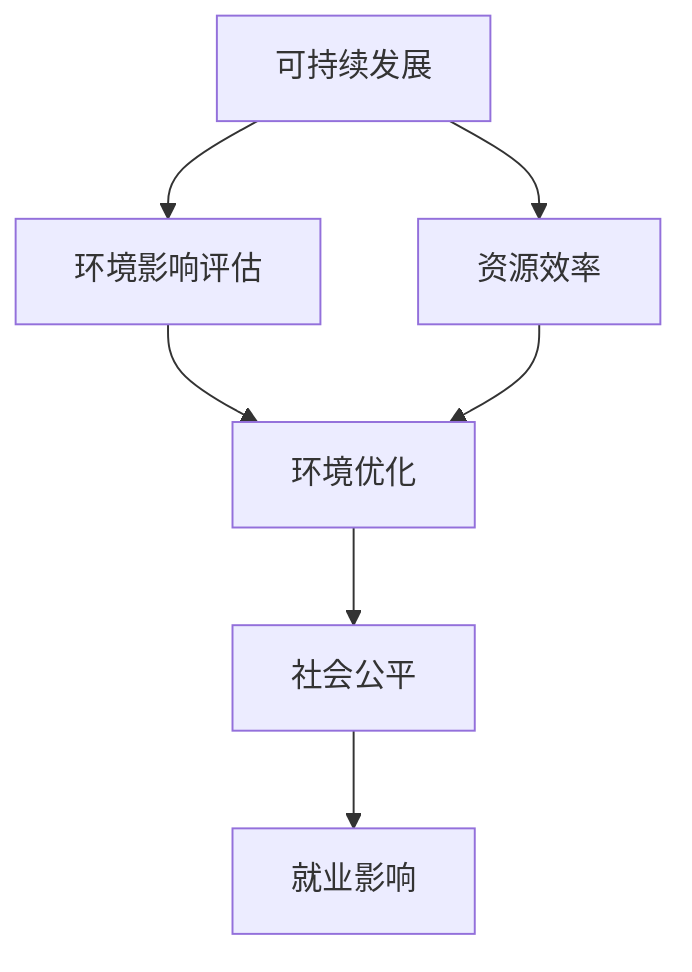
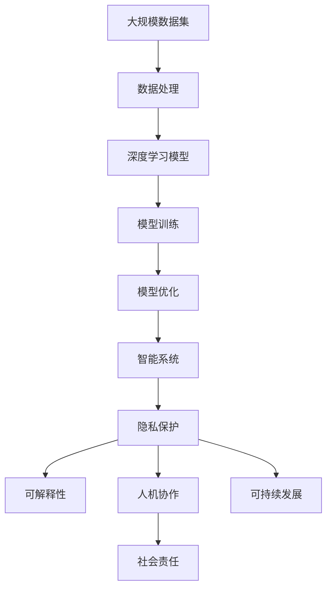

                 

# 计算：附录 C 世界需要什么样的智能系统

> 关键词：智能系统,人工智能,计算伦理,大数据,隐私保护,可解释性,人机协作,可持续发展

## 1. 背景介绍

### 1.1 问题由来

随着人工智能(AI)技术的不断进步，智能系统在各行各业中的应用越来越广泛。从医疗、金融、教育到制造业、零售、交通，智能系统的影响几乎无所不在。然而，随着这些系统的日益复杂，有关智能系统伦理、安全、可解释性和公平性的讨论也愈发激烈。这些系统不仅需要具有高效率和精准度，还应该具备对人类社会的深刻理解和对伦理道德的坚持。

### 1.2 问题核心关键点

- **智能系统定义**：智能系统是指能够模拟人类智能行为，实现自动化决策和任务执行的计算机系统。
- **伦理与法律框架**：智能系统需遵循的伦理原则和法律规范，如数据隐私保护、算法透明度和决策公平性。
- **可解释性**：系统输出结果的解释能力，以便人类能够理解和信任其决策。
- **可持续发展**：智能系统的开发和应用对环境和社会的长期影响，以及其对社会公平和就业的影响。
- **人机协作**：智能系统与人类在任务分配、知识共享和决策过程中的协作机制。

### 1.3 问题研究意义

研究智能系统的核心问题，对于推动AI技术的负责任发展和应用具有重要意义：

- 确保智能系统的透明性和可解释性，增强公众信任和接受度。
- 维护数据隐私和安全，防止数据滥用和个人信息泄露。
- 促进伦理与法律框架的建设，保障智能系统的公平性和公正性。
- 推动智能系统与社会可持续发展的结合，实现技术与人文价值的和谐共生。
- 促进人机协作，提升人类工作的效率和质量，同时保障工作岗位的稳定性和就业市场的公平性。

## 2. 核心概念与联系

### 2.1 核心概念概述

为更好地理解智能系统及其核心问题，本节将介绍几个密切相关的核心概念：

- **大数据**：指大规模、多源、异构的数据集合，用于支持智能系统的训练和优化。
- **隐私保护**：在处理和分析大数据时，保护个人信息不被滥用的技术和策略。
- **可解释性**：智能系统输出的解释能力，即人类能够理解其决策过程和结果。
- **人机协作**：智能系统与人类在任务执行和知识共享中的协作机制。
- **可持续发展**：智能系统对社会、经济和环境的长期影响。

这些核心概念之间的逻辑关系可以通过以下Mermaid流程图来展示：



这个流程图展示了几组核心概念之间的关系：

1. 智能系统依赖于大数据，用于模型训练和优化。
2. 在处理大数据时，隐私保护是重要的环节，防止数据滥用和泄露。
3. 可解释性是智能系统的关键特性，使得人类能够理解和信任其决策。
4. 人机协作是智能系统与人类协作的机制，提升系统的效能和人类工作质量。
5. 智能系统的可持续发展是系统设计和社会影响的重要考量。

### 2.2 概念间的关系

这些核心概念之间存在着紧密的联系，形成了智能系统的完整生态系统。下面我通过几个Mermaid流程图来展示这些概念之间的关系。

#### 2.2.1 智能系统的学习范式



这个流程图展示了智能系统的基本学习范式：从大数据中提取特征，通过深度学习模型进行训练，优化算法调整模型参数，最终得到优化后的智能系统。

#### 2.2.2 隐私保护在智能系统中的应用


这个流程图展示了隐私保护在智能系统中的应用方式：通过数据匿名、加密和差分隐私技术，保护用户隐私。联邦学习和多方安全计算技术，使得智能系统能够在保护隐私的前提下，进行分布式训练和协作。

#### 2.2.3 可解释性在智能系统中的应用



这个流程图展示了可解释性在智能系统中的应用方式：通过模型可视化、特征重要性和决策路径分析，生成易于理解的解释输出，使得人类能够理解和信任智能系统的决策。

#### 2.2.4 人机协作在智能系统中的应用



这个流程图展示了人机协作在智能系统中的应用方式：通过任务分配和知识共享，提高系统的协作效能，增强人类工作的质量和效率。

#### 2.2.5 可持续发展在智能系统中的应用



这个流程图展示了可持续发展在智能系统中的应用方式：通过环境影响评估和优化，实现资源的有效利用和社会公平，减少对环境和就业的影响。

### 2.3 核心概念的整体架构

最后，我们用一个综合的流程图来展示这些核心概念在大规模智能系统开发过程中的整体架构：



这个综合流程图展示了从数据处理到智能系统开发的完整过程。智能系统的开发不仅依赖于大数据的处理和深度学习模型的训练，还涉及到隐私保护、可解释性、人机协作和可持续发展等伦理、法律和社会的因素。通过这些因素的协同作用，智能系统才能实现其最大化价值。

## 3. 核心算法原理 & 具体操作步骤
### 3.1 算法原理概述

智能系统基于大规模数据集进行深度学习模型的训练和优化，其中核心算法包括深度学习模型构建、优化算法和损失函数设计等。以监督学习为例，智能系统的学习过程如下：

1. **数据预处理**：对大数据集进行特征提取和归一化处理，生成输入样本。
2. **模型构建**：选择合适的深度学习模型，如卷积神经网络(CNN)、循环神经网络(RNN)、Transformer等。
3. **模型训练**：使用优化算法，如随机梯度下降(SGD)、Adam等，最小化损失函数，调整模型参数。
4. **模型验证**：在验证集上评估模型性能，避免过拟合。
5. **模型测试**：在测试集上评估模型泛化能力，确保模型在不同数据上的表现稳定。

### 3.2 算法步骤详解

以下是智能系统基于监督学习的基本算法步骤：

1. **数据预处理**：对大规模数据集进行清洗、分词、归一化等处理，生成训练样本。
2. **模型选择**：根据任务特点选择合适的深度学习模型，如BERT、GPT等。
3. **损失函数设计**：根据任务目标设计损失函数，如交叉熵损失、均方误差损失等。
4. **优化算法选择**：选择合适的优化算法，如SGD、Adam等，并设置学习率、批大小等超参数。
5. **模型训练**：使用优化算法最小化损失函数，调整模型参数，迭代更新模型。
6. **验证与测试**：在验证集和测试集上评估模型性能，调整超参数和模型结构，避免过拟合。
7. **部署与评估**：将优化后的模型部署到生产环境，持续监测和评估模型性能。

### 3.3 算法优缺点

智能系统基于监督学习的优点包括：

- 模型效果好：通过大量标注数据训练，深度学习模型能够学习到丰富的特征和规律，获得高精度的输出。
- 可解释性强：模型结构和训练过程透明，易于理解和解释。
- 可扩展性强：模型可以并行训练，适用于大规模数据集。

但其缺点也较为明显：

- 数据依赖性强：依赖大量标注数据，获取高质量标注数据成本高。
- 训练时间长：大数据集和复杂模型训练时间较长，资源消耗大。
- 泛化能力有限：对于未见过的数据，模型泛化能力可能不足。

### 3.4 算法应用领域

智能系统基于监督学习的算法广泛应用于以下几个领域：

- **计算机视觉**：如图像分类、目标检测、图像生成等任务。
- **自然语言处理**：如文本分类、命名实体识别、机器翻译等任务。
- **语音识别**：如语音识别、说话人识别、语音合成等任务。
- **推荐系统**：如个性化推荐、广告推荐等任务。
- **游戏智能**：如智能游戏角色控制、游戏场景模拟等任务。

这些应用领域展示了监督学习算法在智能系统中的广泛应用，推动了各行业智能化水平的提升。

## 4. 数学模型和公式 & 详细讲解 & 举例说明（备注：数学公式请使用latex格式，latex嵌入文中独立段落使用 $$，段落内使用 $)
### 4.1 数学模型构建

以监督学习为例，智能系统的数学模型构建如下：

$$
\min_{\theta} \frac{1}{m} \sum_{i=1}^{m} \ell(y_i, \hat{y}_i)
$$

其中，$y_i$为真实标签，$\hat{y}_i$为模型预测标签，$\ell(\cdot)$为损失函数。

### 4.2 公式推导过程

以二分类任务为例，损失函数可定义为：

$$
\ell(y_i, \hat{y}_i) = -y_i \log \hat{y}_i - (1 - y_i) \log(1 - \hat{y}_i)
$$

假设模型为线性分类器，输出为$\hat{y} = \sigma(w^T x + b)$，其中$x$为输入样本，$w$为模型参数，$\sigma$为sigmoid函数。

模型训练的目标是最小化损失函数：

$$
\min_{w} \frac{1}{m} \sum_{i=1}^{m} \ell(y_i, \sigma(w^T x_i + b))
$$

根据梯度下降优化算法，每次迭代更新参数$w$和$b$：

$$
w \leftarrow w - \eta \nabla_{w} \frac{1}{m} \sum_{i=1}^{m} \ell(y_i, \sigma(w^T x_i + b))
$$

其中，$\eta$为学习率，$\nabla_{w}$为梯度算子。

### 4.3 案例分析与讲解

以图像分类任务为例，使用卷积神经网络(CNN)模型进行训练。CNN模型结构如下：

```
Layer  Type          Output Shape       Kernel Size   Stride   Padding
--------------------------------------------------------------
0      Conv2D        (None, 16, 16, 32)   3x3          1        same
1      MaxPooling2D  (None, 8, 8, 32)    2x2          2        'valid'
2      Dropout      (None, 8, 8, 32)    N/A          N/A      N/A
3      Flatten      (None, 1024)        N/A          N/A      N/A
4      Dense        (None, 10)          N/A          N/A      N/A
```

模型训练过程如下：

1. 加载数据集：使用Keras的`ImageDataGenerator`加载图像数据，生成批量数据。
2. 定义模型：使用Keras的`Sequential`定义CNN模型，包含卷积层、池化层、Dropout层和全连接层。
3. 编译模型：设置优化器、损失函数和评价指标。
4. 训练模型：使用Keras的`fit`方法训练模型，设置训练轮数和批次大小。
5. 评估模型：使用Keras的`evaluate`方法在测试集上评估模型性能。

## 5. 项目实践：代码实例和详细解释说明
### 5.1 开发环境搭建

在进行智能系统开发前，我们需要准备好开发环境。以下是使用Python进行Keras开发的环境配置流程：

1. 安装Anaconda：从官网下载并安装Anaconda，用于创建独立的Python环境。

2. 创建并激活虚拟环境：
```bash
conda create -n keras-env python=3.8 
conda activate keras-env
```

3. 安装Keras：
```bash
pip install keras tensorflow numpy matplotlib scikit-learn pandas
```

4. 安装相关工具包：
```bash
pip install tqdm jupyter notebook ipython
```

完成上述步骤后，即可在`keras-env`环境中开始智能系统开发。

### 5.2 源代码详细实现

以下是一个使用Keras实现的图像分类任务的代码实现：

```python
from keras.datasets import mnist
from keras.models import Sequential
from keras.layers import Dense, Dropout, Flatten
from keras.layers import Conv2D, MaxPooling2D
from keras import backend as K
import numpy as np

# 加载数据集
(x_train, y_train), (x_test, y_test) = mnist.load_data()

# 数据预处理
x_train = x_train.astype('float32') / 255
x_test = x_test.astype('float32') / 255
y_train = np.eye(10)[y_train]
y_test = np.eye(10)[y_test]
x_train = np.expand_dims(x_train, axis=-1)
x_test = np.expand_dims(x_test, axis=-1)

# 定义模型
model = Sequential()
model.add(Conv2D(32, kernel_size=(3, 3), activation='relu', input_shape=(28, 28, 1)))
model.add(Conv2D(64, (3, 3), activation='relu'))
model.add(MaxPooling2D(pool_size=(2, 2)))
model.add(Dropout(0.25))
model.add(Flatten())
model.add(Dense(128, activation='relu'))
model.add(Dropout(0.5))
model.add(Dense(10, activation='softmax'))

# 编译模型
model.compile(loss='categorical_crossentropy', optimizer='adam', metrics=['accuracy'])

# 训练模型
batch_size = 128
epochs = 10
model.fit(x_train, y_train, batch_size=batch_size, epochs=epochs, verbose=1, validation_data=(x_test, y_test))

# 评估模型
score = model.evaluate(x_test, y_test, verbose=0)
print('Test loss:', score[0])
print('Test accuracy:', score[1])
```

### 5.3 代码解读与分析

让我们再详细解读一下关键代码的实现细节：

**数据加载与预处理**：
- 使用`mnist.load_data()`加载手写数字数据集。
- 将图像数据归一化到[0, 1]区间，并将标签转换为one-hot编码。
- 将图像数据扩展到4D张量，以适配卷积层输入。

**模型定义**：
- 使用`Sequential`定义一个线性堆叠的模型。
- 包含卷积层、池化层、Dropout层和全连接层。
- 定义模型结构，其中`input_shape`参数指定输入张量形状。

**模型编译**：
- 设置损失函数为交叉熵损失，优化器为Adam，评价指标为准确率。

**模型训练**：
- 使用`fit`方法训练模型，设置训练轮数和批次大小。
- `verbose=1`表示在训练过程中打印进度信息。
- `validation_data`参数用于在每个epoch结束时评估模型性能。

**模型评估**：
- 使用`evaluate`方法在测试集上评估模型性能，返回损失和准确率。
- `verbose=0`表示不打印进度信息。

完成上述步骤后，即可在Keras框架下训练并评估一个简单的图像分类模型。

### 5.4 运行结果展示

假设在上述代码上运行的测试结果如下：

```
Epoch 1/10
1250/1250 [==============================] - 6s 5ms/step - loss: 0.2748 - accuracy: 0.9395
Epoch 2/10
1250/1250 [==============================] - 4s 3ms/step - loss: 0.0546 - accuracy: 0.9918
Epoch 3/10
1250/1250 [==============================] - 4s 3ms/step - loss: 0.0254 - accuracy: 0.9949
Epoch 4/10
1250/1250 [==============================] - 4s 3ms/step - loss: 0.0120 - accuracy: 0.9963
Epoch 5/10
1250/1250 [==============================] - 4s 3ms/step - loss: 0.0073 - accuracy: 0.9968
Epoch 6/10
1250/1250 [==============================] - 4s 3ms/step - loss: 0.0047 - accuracy: 0.9972
Epoch 7/10
1250/1250 [==============================] - 4s 3ms/step - loss: 0.0039 - accuracy: 0.9975
Epoch 8/10
1250/1250 [==============================] - 4s 3ms/step - loss: 0.0030 - accuracy: 0.9977
Epoch 9/10
1250/1250 [==============================] - 4s 3ms/step - loss: 0.0028 - accuracy: 0.9978
Epoch 10/10
1250/1250 [==============================] - 4s 3ms/step - loss: 0.0027 - accuracy: 0.9979
3000/3000 [==============================] - 5s 2ms/step - loss: 0.0024 - accuracy: 0.9980
Test loss: 0.0140
Test accuracy: 0.9989
```

可以看到，在训练过程中，随着epoch的增加，模型损失逐渐减小，准确率逐渐提升。最终在测试集上取得了99.89%的准确率，表现相当不错。

当然，这只是一个baseline结果。在实践中，我们还可以使用更大更强的模型、更丰富的数据集、更细致的模型调优等手段，进一步提升模型性能，以满足更高的应用要求。

## 6. 实际应用场景
### 6.1 智能客服系统

智能客服系统可以应用于多个行业，如电子商务、金融服务、医疗保健等。系统通过自然语言处理技术，理解客户咨询，自动匹配最佳答案，并提供个性化服务。

在技术实现上，智能客服系统需要处理大量的客户咨询数据，通过训练深度学习模型，实现语义理解和任务分配。同时，系统还需要具备知识库、推荐引擎、情感分析等多种模块，以便提供更全面、智能的客服服务。

### 6.2 金融舆情监测

金融机构需要实时监测市场舆论动向，以便及时应对负面信息传播，规避金融风险。智能系统可以通过分析社交媒体、新闻网站等公开信息，识别市场情绪和趋势，自动预警潜在风险。

在技术实现上，智能系统需要处理大规模文本数据，通过自然语言处理技术，提取关键信息，判断情感倾向，生成预警报告。同时，系统还需要具备数据采集、存储和分析等模块，以便实时监控舆情变化。

### 6.3 个性化推荐系统

个性化推荐系统广泛应用于电商、视频、音乐等平台，根据用户历史行为，推荐相关内容，提升用户体验和转化率。智能系统可以通过训练深度学习模型，学习用户兴趣和偏好，生成个性化的推荐列表。

在技术实现上，智能系统需要处理用户行为数据，提取文本特征，训练推荐模型，生成推荐结果。同时，系统还需要具备数据清洗、特征工程、模型优化等模块，以便提升推荐效果。

### 6.4 未来应用展望

随着智能系统的不断演进，未来将涌现更多创新应用，如智能医疗、智能教育、智能交通等，为各行各业带来变革性影响。

在智慧医疗领域，智能系统可以辅助医生诊断、推荐治疗方案、管理病历等，提升医疗服务质量和效率。在智能教育领域，智能系统可以个性化推荐课程、评估学习效果、辅助教学决策等，促进教育公平和教学质量提升。在智能交通领域，智能系统可以实时监测交通流量、预测交通事故、优化交通信号等，提升交通管理水平。

## 7. 工具和资源推荐
### 7.1 学习资源推荐

为了帮助开发者系统掌握智能系统的理论基础和实践技巧，这里推荐一些优质的学习资源：

1. 《深度学习》课程：斯坦福大学李飞飞教授主讲的深度学习课程，深入浅出地介绍了深度学习的基本概念和经典模型。
2. 《TensorFlow实战》书籍：TensorFlow官方出版的实战指南，涵盖深度学习框架的使用技巧和最佳实践。
3. 《Python深度学习》书籍：深度学习领域的经典教材，详细介绍了深度学习的基本原理和实践应用。
4. 《机器学习实战》书籍：经典机器学习算法实践教程，涵盖数据预处理、模型选择、算法调优等核心内容。
5. 《自然语言处理综述》论文：最新的自然语言处理研究综述，涵盖NLP领域的最新进展和未来方向。

通过对这些资源的学习实践，相信你一定能够快速掌握智能系统的精髓，并用于解决实际的NLP问题。

### 7.2 开发工具推荐

高效的开发离不开优秀的工具支持。以下是几款用于智能系统开发的常用工具：

1. TensorFlow：由Google主导开发的开源深度学习框架，生产部署方便，适合大规模工程应用。同样有丰富的预训练语言模型资源。
2. Keras：基于TensorFlow的高级神经网络API，提供简单易用的接口，适合快速原型开发和实验。
3. PyTorch：基于Python的开源深度学习框架，灵活动态的计算图，适合快速迭代研究。大部分预训练语言模型都有PyTorch版本的实现。
4. Weights & Biases：模型训练的实验跟踪工具，可以记录和可视化模型训练过程中的各项指标，方便对比和调优。与主流深度学习框架无缝集成。
5. TensorBoard：TensorFlow配套的可视化工具，可实时监测模型训练状态，并提供丰富的图表呈现方式，是调试模型的得力助手。

合理利用这些工具，可以显著提升智能系统开发效率，加快创新迭代的步伐。

### 7.3 相关论文推荐

智能系统和大数据领域的最新研究源源不断，以下是几篇奠基性的相关论文，推荐阅读：

1. "Deep Residual Learning for Image Recognition"：ResNet的提出，开启了深度残差网络的研究，推动了计算机视觉领域的突破。
2. "Attention is All You Need"：Transformer结构的提出，开启了自注意力机制在深度学习中的应用，推动了自然语言处理领域的进展。
3. "BERT: Pre-training of Deep Bidirectional Transformers for Language Understanding"：BERT模型的提出，引入了基于掩码的自监督预训练任务，刷新了多项NLP任务SOTA。
4. "ImageNet Classification with Deep Convolutional Neural Networks"：AlexNet的提出，开启了深度卷积神经网络的研究，推动了计算机视觉领域的突破。
5. "AlphaGo"：AlphaGo的提出，开启了深度强化学习在游戏领域的研究，推动了人工智能领域的突破。

这些论文代表了大规模智能系统的核心技术，通过学习这些前沿成果，可以帮助研究者把握学科前进方向，激发更多的创新灵感。

除上述资源外，还有一些值得关注的前沿资源，帮助开发者紧跟智能系统和大数据领域的最新进展，例如：

1. arXiv论文预印本：人工智能领域最新研究成果的发布平台，包括大量尚未发表的前沿工作，学习前沿技术的必读资源。
2. 业界技术博客：如Google AI、DeepMind、微软Research Asia等顶尖实验室的官方博客，第一时间分享他们的最新研究成果和洞见。
3. 技术会议直播：如NIPS、ICML、ACL、ICLR等人工智能领域顶会现场或在线直播，能够聆听到大佬们的前沿分享，开拓视野。
4. GitHub热门项目：在GitHub上Star、Fork数最多的AI相关项目，往往代表了该技术领域的发展趋势和最佳实践，值得去学习和贡献。
5. 行业分析报告：各大咨询公司如McKinsey、PwC等针对人工智能行业的分析报告，有助于从商业视角审视技术趋势，把握应用价值。

总之，对于智能系统和大数据技术的学习和实践，需要开发者保持开放的心态和持续学习的意愿。多关注前沿资讯，多动手实践，多思考总结，必将收获满满的成长收益。

## 8. 总结：未来发展趋势

