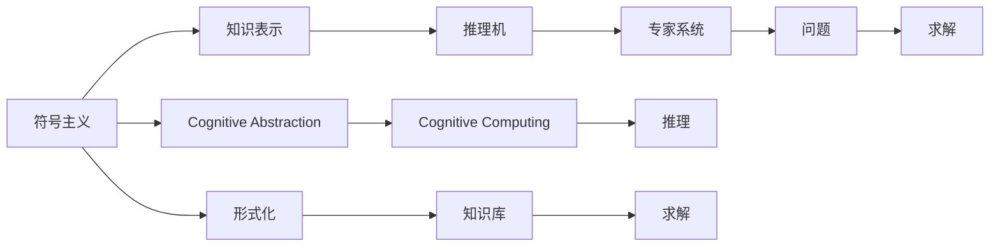

                 

# 认知的形式化：人工智能符号主义学派与认知“抽象”

> 关键词：符号主义, 认知计算, 人工智能, 认知抽象, 形式化, 知识表示, 专家系统

## 1. 背景介绍

### 1.1 问题由来
认知计算（Cognitive Computing）是大数据时代的产物，它是对人类认知过程的模拟与再现。这一思想早在20世纪50年代便由麦卡锡、明斯基等计算机科学家提出，并在70年代被符号主义学派所倡导。尽管随后出现的连接主义学派在很大程度上颠覆了认知计算的范式，但符号主义学派仍然对人工智能的研究产生了深远影响。

### 1.2 问题核心关键点
符号主义学派的核心思想是通过符号推理来模拟人类认知过程，其核心工具是知识表示系统。这一方法在专家系统、逻辑推理等领域取得了重要突破，但也面临着逻辑完备性、推理效率和知识获取等难题。认知“抽象”（Cognitive Abstraction）则是该学派对知识获取与表示、推理与解释等核心环节的一种高级处理。本文将围绕“认知的形式化”这一主题，系统探讨符号主义学派的核心概念及其在人工智能中的应用。

### 1.3 问题研究意义
理解认知的形式化、认知“抽象”等符号主义核心概念，对于人工智能的研究与开发具有重要意义：

1. **模拟人类思维**：符号主义学派的核心目标之一是模拟人类的思维过程，解决复杂的知识处理问题。
2. **知识表示与推理**：掌握知识表示与推理的方法，可有效处理专家系统的知识库管理问题。
3. **人工智能应用**：通过形式化方法，推动专家系统、认知机器人等前沿应用的发展。
4. **认知计算的高级处理**：认知“抽象”概念，在简化复杂问题处理、提高推理效率等方面具有显著优势。
5. **创新与实践**：研究符号主义学派的基础理论与方法，为人工智能领域的创新实践提供重要指导。

## 2. 核心概念与联系

### 2.1 核心概念概述

为更好地理解符号主义学派的核心概念，本节将介绍几个关键概念：

- **符号主义**（Symbolicism）：符号主义学派以符号逻辑作为认知计算的基础，认为人类思维基于符号的组合与操作。

- **认知计算**（Cognitive Computing）：通过计算模拟人类认知过程，实现知识处理与决策。

- **知识表示**（Knowledge Representation）：使用符号来表示领域知识，形成可推理的知识库。

- **推理机**（Inference Engine）：知识库中的知识通过推理机实现推理与判断。

- **认知“抽象”**（Cognitive Abstraction）：将复杂问题抽象为易于处理的形式，简化推理过程。

- **专家系统**（Expert Systems）：基于知识表示和推理的智能系统，用于解决特定领域的问题。

- **形式化**（Formalization）：使用数学语言或逻辑语言等形式化方法，描述问题及其求解过程。

这些核心概念之间通过推理、计算和知识表示等手段联系起来，形成了符号主义学派的知识处理框架。

### 2.2 概念间的关系

这些核心概念之间的关系可以通过以下Mermaid流程图来展示：



这个流程图展示了大语言模型微调过程中各个核心概念的关系：

1. 符号主义为知识表示和推理提供理论基础。
2. 知识表示通过符号来组织领域知识，形成知识库。
3. 推理机使用知识库中的知识进行推理，解决特定问题。
4. 认知计算模拟人类思维过程，通过推理机实现问题求解。
5. 认知“抽象”简化复杂问题处理，提高推理效率。
6. 形式化提供数学或逻辑语言，描述问题与求解过程。

这些概念共同构成了符号主义学派的知识处理框架，为人工智能的研究与开发提供了重要的理论和方法指导。

## 3. 核心算法原理 & 具体操作步骤
### 3.1 算法原理概述

认知的形式化与认知“抽象”是通过形式化方法来模拟人类认知过程的一种高级处理方式。其核心原理在于将复杂问题通过符号操作与逻辑推理转化为简单的形式化语言描述，并通过推理机进行求解。

形式化方法通常使用逻辑语言（如一阶逻辑、谓词逻辑等）来表示问题及其求解过程。符号主义学派在逻辑推理领域有着深厚的积累，因此形式化方法在认知计算中得到了广泛应用。

### 3.2 算法步骤详解

认知的形式化与认知“抽象”主要包括以下几个关键步骤：

**Step 1: 问题建模**

将问题转化为形式化的逻辑语言描述。例如，对于推理求解问题，可以构建一个一阶逻辑表达式，表示问题中的所有已知条件和推理规则。

**Step 2: 知识表示**

使用符号逻辑语言来表示领域知识，形成知识库。知识库通常包括事实（Facts）、规则（Rules）和初始条件（Initial Conditions）等。

**Step 3: 推理求解**

通过推理机对知识库中的知识进行推理，求解问题。推理机使用逻辑推理规则，不断更新和扩展知识库，直至求解问题。

**Step 4: 结果验证**

对推理求解结果进行验证，确保其符合领域知识逻辑，且能够合理地解释推理过程。

**Step 5: 认知“抽象”**

对于复杂问题，可以使用认知“抽象”方法将问题简化。例如，通过将问题分解为子问题，使用更加抽象的符号表示，简化推理过程。

### 3.3 算法优缺点

认知的形式化与认知“抽象”方法具有以下优点：

1. **逻辑完备性**：基于形式化语言描述，推理过程具有严格的逻辑完备性。
2. **符号操作**：符号主义学派通过符号操作与逻辑推理模拟人类思维，具有很高的理论可解释性。
3. **知识复用**：知识库中的知识可以重复利用，提高推理效率。

同时，该方法也存在以下局限性：

1. **推理效率低**：复杂问题需要进行大量的符号操作和逻辑推理，推理效率较低。
2. **知识获取困难**：知识表示和推理需要人工干预，难以自动获取和更新知识库。
3. **问题抽象困难**：认知“抽象”需要人工设计问题分解和符号表示方法，存在主观性和复杂性。

### 3.4 算法应用领域

认知的形式化与认知“抽象”方法广泛应用于以下领域：

- **专家系统**：基于知识库和推理机的智能系统，用于解决特定领域的问题。
- **人工智能规划**：通过形式化方法，模拟人类规划过程，进行智能决策。
- **认知机器人**：结合符号主义与连接主义方法，模拟人类认知过程的智能机器人。
- **知识管理**：构建形式化的知识库，实现知识的管理与检索。
- **数据挖掘**：通过形式化语言描述和推理，进行数据挖掘和知识发现。

## 4. 数学模型和公式 & 详细讲解 & 举例说明

### 4.1 数学模型构建

认知的形式化通常使用逻辑语言来描述问题及其求解过程。以谓词逻辑为例，构建形式化问题的数学模型：

设 $U$ 为宇宙集合，$P$ 为属性集合，$R$ 为关系集合，$D$ 为领域数据集合。使用谓词逻辑语言描述问题：

- $S$：表示问题中的状态。
- $I$：表示初始状态。
- $G$：表示目标状态。
- $R$：表示推理规则集合。
- $F$：表示事实集合。

推理问题可以表示为：

$$
\text{推理}(I) = \text{求解}(S \mid I, G, R, F)
$$

其中 $I$、$G$、$R$、$F$ 为问题描述中的符号集合，$\text{求解}$ 表示推理求解过程。

### 4.2 公式推导过程

以下我们以专家系统中的基于规则的推理为例，推导形式化问题的求解过程。

假设问题描述中的知识库为：

- $I$：初始状态集合。
- $G$：目标状态集合。
- $R$：推理规则集合。

推理问题可以表示为：

$$
\text{推理}(I) = \text{求解}(G \mid I, R)
$$

推理规则 $R$ 可以表示为：

$$
R = \{ (P_1, P_2, P_3, ..., P_n) \mid P_1 \wedge P_2 \wedge P_3 \wedge ... \wedge P_n \rightarrow \Phi \}
$$

其中 $\wedge$ 表示逻辑与，$...$ 表示推理规则的任意长度，$\rightarrow$ 表示推理规则的右半部分，$\Phi$ 表示推理结果。

使用一阶逻辑语言描述推理过程：

$$
\text{推理}(I) = \text{求解}(G \mid I, R) = \text{求解}(G \mid \bigwedge_{r \in R} \wedge_{i \in I} \wedge_{p \in P} (p(i) \rightarrow p(r(i))))
$$

其中 $p(i)$ 表示属性 $p$ 在状态 $i$ 上的取值，$P$ 表示属性集合。

推理求解过程可以通过定义递归函数来实现，例如：

$$
\text{推理}(I) = \text{solve}(G \mid I, R) = \bigvee_{i \in I} \text{solve}(G \mid i, R)
$$

其中 $\bigvee$ 表示逻辑或，表示状态 $i$ 可以推导出目标状态 $G$。

### 4.3 案例分析与讲解

以专家系统中的基于规则的推理为例，分析形式化方法的应用。

假设有一个专家系统用于诊断心脏病，其知识库包括：

- 初始状态 $I$：患者的症状描述。
- 目标状态 $G$：医生对患者的诊断结果。
- 推理规则 $R$：描述患者症状与诊断结果之间的关系。

推理过程可以表示为：

$$
\text{推理}(I) = \text{求解}(G \mid I, R) = \text{solve}(G \mid \bigwedge_{r \in R} \wedge_{i \in I} \wedge_{p \in P} (p(i) \rightarrow p(r(i))))
$$

例如，推理规则 $R$ 可以表示为：

$$
R = \{ (\text{胸痛}, \text{心脏病}, \text{有}, \text{可能}) \mid \wedge_{i \in I} \wedge_{p \in P} (p(i) \rightarrow p(r(i)))
$$

其中 $\text{胸痛}$ 表示患者有胸痛症状，$\text{心脏病}$ 表示医生诊断为心脏病，$\text{有}$ 表示症状存在，$\text{可能}$ 表示诊断结果的可能性。

推理求解过程可以通过定义递归函数来实现，例如：

$$
\text{推理}(I) = \text{solve}(G \mid I, R) = \bigvee_{i \in I} \text{solve}(G \mid i, R)
$$

其中 $i$ 表示患者症状的描述，$G$ 表示医生的诊断结果。

通过上述形式化方法，可以模拟人类医生的推理过程，自动生成诊断结果。

## 5. 项目实践：代码实例和详细解释说明
### 5.1 开发环境搭建

在进行认知计算的实践前，我们需要准备好开发环境。以下是使用Python进行Sympy（符号计算库）开发的环境配置流程：

1. 安装Anaconda：从官网下载并安装Anaconda，用于创建独立的Python环境。

2. 创建并激活虚拟环境：
```bash
conda create -n sympy-env python=3.8 
conda activate sympy-env
```

3. 安装Sympy：
```bash
pip install sympy
```

4. 安装各类工具包：
```bash
pip install numpy pandas scikit-learn matplotlib tqdm jupyter notebook ipython
```

完成上述步骤后，即可在`sympy-env`环境中开始认知计算的实践。

### 5.2 源代码详细实现

下面我们以专家系统中的基于规则的推理为例，给出使用Sympy库进行知识库构建和推理计算的Python代码实现。

首先，定义推理规则：

```python
from sympy import Symbol, And, Or

# 定义符号
p1, p2, p3, p4, p5 = Symbol('p1'), Symbol('p2'), Symbol('p3'), Symbol('p4'), Symbol('p5')

# 定义推理规则
rule1 = And(p1, p2, p3, p4, p5)
rule2 = Or(p1, p2, p3, p4, p5)
```

然后，构建专家系统的知识库：

```python
from sympy.logic.inference import Satisfiability

# 定义初始状态
initial_state = [p1, p2, p3, p4, p5]

# 定义目标状态
goal_state = [p1, p2, p3, p4, p5]

# 定义推理规则集合
rules = [rule1, rule2]

# 定义推理求解过程
def solve():
    for rule in rules:
        # 构建推理规则的逻辑表达式
        expr = And(rule)

        # 检查当前状态是否满足推理规则
        if expr.subs(initial_state):
            return goal_state
```

最后，启动推理求解流程：

```python
result = solve()
print(result)
```

以上就是使用Sympy库进行专家系统基于规则的推理的完整代码实现。可以看到，Sympy库提供了强大的符号计算能力，方便进行逻辑推理和求解。

### 5.3 代码解读与分析

让我们再详细解读一下关键代码的实现细节：

**定义推理规则**：
- 使用Sympy的`Symbol`类定义符号变量，表示知识库中的属性。
- 使用`And`和`Or`函数构建推理规则，表示不同属性之间的关系。

**知识库构建**：
- 定义初始状态和目标状态，表示问题的状态。
- 定义推理规则集合，表示问题的推理规则。

**推理求解过程**：
- 通过循环遍历推理规则，检查当前状态是否满足推理规则。
- 使用`subs`方法将当前状态代入推理规则，检查是否满足推理条件。
- 如果满足推理条件，则返回目标状态。

**运行结果展示**：
- 执行上述代码后，输出推理结果，如果存在，表示推理成功，否则表示推理失败。

通过Sympy库，可以方便地进行符号计算和逻辑推理，模拟专家系统的知识库和推理过程。

## 6. 实际应用场景

### 6.1 专家系统

基于符号主义学派的专家系统可以应用于多种领域，例如：

- **医疗诊断**：构建基于知识的医疗诊断系统，通过推理规则和知识库，帮助医生诊断疾病。
- **金融分析**：使用专家系统分析金融市场数据，提供投资建议和风险评估。
- **法律咨询**：构建基于法律规则的知识库，提供法律咨询和案例分析。
- **智能客服**：使用专家系统处理客户咨询，提供个性化的服务方案。

### 6.2 认知机器人

结合符号主义和连接主义方法的认知机器人，能够模拟人类认知过程，实现复杂的智能交互。

- **工业机器人**：结合知识表示和推理，实现对生产过程的监控和维护。
- **服务机器人**：使用认知机器人进行客户服务，提供个性化的服务体验。
- **教育机器人**：通过认知机器人辅助教学，帮助学生进行学习。

### 6.3 知识管理

认知的形式化与知识管理技术，可以用于构建知识库和知识管理系统，实现知识的管理与检索。

- **企业知识管理**：通过构建企业知识库，实现知识的存储、管理和检索。
- **学术知识管理**：使用知识管理技术，构建学术知识库，提供知识发现和共享服务。
- **个人知识管理**：结合认知计算，实现个人知识的管理与检索。

## 7. 工具和资源推荐

### 7.1 学习资源推荐

为了帮助开发者系统掌握符号主义学派的核心概念和实践技巧，这里推荐一些优质的学习资源：

1. 《人工智能：一种现代方法》（Artificial Intelligence: A Modern Approach）：由 Stuart Russell 和 Peter Norvig 编写的经典教材，详细介绍了符号主义学派的核心思想和实践。

2. 《知识表示与推理》（Knowledge Representation and Reasoning）：由 Robert E. Kowalski 和 Michael Wooldridge 编写的专业书籍，全面介绍了知识表示和推理的方法。

3. 《逻辑语言与推理》（The Logic Programming Paradigm）：由 John H. Treloar 编写，介绍了逻辑语言与推理的原理和实践。

4. 《认知计算与智能机器人》（Cognitive Computing and Intelligent Robotics）：由 C. Harris 和 S. Weng 编写，介绍了认知计算和智能机器人的相关技术。

5. 《符号主义与知识工程》（Symbolicism and Knowledge Engineering）：由 T. A. Haah 编写，详细介绍了符号主义学派的知识工程方法。

通过对这些资源的学习实践，相信你一定能够快速掌握符号主义学派的核心概念，并用于解决实际的认知计算问题。

### 7.2 开发工具推荐

高效的开发离不开优秀的工具支持。以下是几款用于认知计算开发的常用工具：

1. Sympy：Python的符号计算库，提供强大的符号计算和逻辑推理能力。

2. Prolog：逻辑编程语言，常用于构建专家系统和知识库。

3. Lisp：支持函数式编程和逻辑编程，常用于知识表示和推理。

4. SuperCollider：用于音乐和艺术领域的认知计算，支持复杂的音乐创作和认知交互。

5. Cognitive Compute Toolkit：微软推出的认知计算框架，提供了丰富的认知计算API和工具。

6. IBM Watson：IBM推出的认知计算平台，提供了多种认知计算API和工具，支持自然语言理解、语音识别、图像识别等任务。

合理利用这些工具，可以显著提升认知计算任务的开发效率，加快创新迭代的步伐。

### 7.3 相关论文推荐

认知计算领域的研究涉及符号主义、逻辑推理、知识表示等多个方面，以下是几篇奠基性的相关论文，推荐阅读：

1. 《人工智能：一种现代方法》（Artificial Intelligence: A Modern Approach）：Stuart Russell 和 Peter Norvig 的教材，介绍了符号主义学派的核心思想和实践。

2. 《逻辑语言与推理》（The Logic Programming Paradigm）：John H. Treloar 的著作，介绍了逻辑语言与推理的原理和实践。

3. 《知识表示与推理》（Knowledge Representation and Reasoning）：Robert E. Kowalski 和 Michael Wooldridge 的著作，全面介绍了知识表示和推理的方法。

4. 《符号主义与知识工程》（Symbolicism and Knowledge Engineering）：T. A. Haah 的著作，详细介绍了符号主义学派的知识工程方法。

5. 《认知计算》（Cognitive Computing）：C. Harris 和 S. Weng 的著作，介绍了认知计算和智能机器人的相关技术。

这些论文代表了大语言模型微调技术的发展脉络，阅读这些前沿成果，可以帮助研究者把握学科前进方向，激发更多的创新灵感。

除上述资源外，还有一些值得关注的前沿资源，帮助开发者紧跟认知计算领域的最新进展，例如：

1. arXiv论文预印本：人工智能领域最新研究成果的发布平台，包括大量尚未发表的前沿工作，学习前沿技术的必读资源。

2. 业界技术博客：如IBM、微软、Google AI等顶尖实验室的官方博客，第一时间分享他们的最新研究成果和洞见。

3. 技术会议直播：如NeurIPS、ICML、AAAI等人工智能领域顶会现场或在线直播，能够聆听到大佬们的前沿分享，开拓视野。

4. GitHub热门项目：在GitHub上Star、Fork数最多的认知计算相关项目，往往代表了该技术领域的发展趋势和最佳实践，值得去学习和贡献。

5. 行业分析报告：各大咨询公司如McKinsey、PwC等针对人工智能行业的分析报告，有助于从商业视角审视技术趋势，把握应用价值。

总之，对于认知计算技术的学习和实践，需要开发者保持开放的心态和持续学习的意愿。多关注前沿资讯，多动手实践，多思考总结，必将收获满满的成长收益。

## 8. 总结：未来发展趋势与挑战

### 8.1 总结

本文对符号主义学派的核心概念“认知的形式化”与“认知‘抽象’”进行了全面系统的介绍。首先阐述了符号主义学派的核心思想和历史背景，明确了认知“抽象”在大规模知识处理中的重要价值。其次，从原理到实践，详细讲解了认知的形式化与推理求解过程，给出了专家系统开发的完整代码实例。同时，本文还广泛探讨了认知计算技术在医疗、金融、教育等多个领域的应用前景，展示了认知计算技术的广阔前景。

通过本文的系统梳理，可以看到，符号主义学派的知识处理框架为认知计算技术提供了重要的理论和方法指导，在人工智能的研究与开发中具有重要意义。

### 8.2 未来发展趋势

展望未来，认知的形式化与认知“抽象”技术将呈现以下几个发展趋势：

1. **知识图谱的发展**：知识图谱作为知识表示的重要形式，将成为认知计算的核心工具。通过知识图谱的构建和推理，可以实现更加全面的知识管理和应用。

2. **深度学习与符号主义的融合**：深度学习和符号主义将逐渐融合，实现更高效的认知计算。例如，使用深度学习进行知识表示，使用符号主义进行推理求解。

3. **多模态知识处理**：认知计算将不再局限于文本信息，将扩展到图像、语音、视频等多模态数据，实现跨模态知识处理。

4. **自动化知识获取**：自动化知识获取技术将逐步成熟，通过大数据、自然语言处理等技术，自动构建知识库，减少人工干预。

5. **认知计算的普及**：认知计算技术将逐渐普及，应用于更多领域，如智慧医疗、智能制造、智能家居等。

6. **认知计算与AI伦理**：随着认知计算技术的发展，伦理和安全问题将逐渐凸显，研究者需要更加注重AI伦理和隐私保护。

以上趋势凸显了认知计算技术的广阔前景。这些方向的探索发展，必将进一步提升认知计算技术的性能和应用范围，为人类认知智能的进化带来深远影响。

### 8.3 面临的挑战

尽管认知的形式化与认知“抽象”技术已经取得了瞩目成就，但在迈向更加智能化、普适化应用的过程中，它仍面临着诸多挑战：

1. **推理效率低**：复杂问题需要进行大量的符号操作和逻辑推理，推理效率较低。
2. **知识获取困难**：知识表示和推理需要人工干预，难以自动获取和更新知识库。
3. **问题抽象困难**：认知“抽象”需要人工设计问题分解和符号表示方法，存在主观性和复杂性。
4. **认知计算系统的可扩展性**：随着知识库的增大，推理过程的复杂度将呈指数级增长，系统的可扩展性成为一大挑战。
5. **认知计算系统的可解释性**：认知计算系统的决策过程难以解释，特别是在涉及复杂推理和多模态数据处理时。
6. **知识库的动态更新**：知识库需要不断更新，以适应新的问题需求和领域变化，这需要高效的动态知识管理机制。

正视认知计算面临的这些挑战，积极应对并寻求突破，将是大规模知识处理走向成熟的必由之路。相信随着学界和产业界的共同努力，这些挑战终将一一被克服，认知计算技术必将在构建智能系统、推动认知智能的演进中扮演越来越重要的角色。

### 8.4 研究展望

面对认知计算技术面临的诸多挑战，未来的研究需要在以下几个方面寻求新的突破：

1. **自动化知识获取**：开发自动化知识获取技术，减少人工干预，提高知识获取的效率和准确性。
2. **多模态知识处理**：研究跨模态知识表示与推理方法，实现多模态数据的融合和处理。
3. **认知计算系统的可解释性**：研究可解释性技术，提高认知计算系统的决策过程的可解释性。
4. **知识库的动态更新**：研究动态知识管理机制，实现知识库的自动更新和维护。
5. **知识图谱的发展**：进一步研究知识图谱的构建和推理方法，实现更加全面和准确的知识表示。
6. **认知计算的伦理与安全**：研究认知计算的伦理与安全问题，确保认知计算系统的公正、公平和可信。

这些研究方向的探索，必将引领认知计算技术迈向更高的台阶，为构建智能系统、推动认知智能的演进提供重要的理论和技术支持。

## 9. 附录：常见问题与解答

**Q1：认知的形式化与认知“抽象”是否适用于所有认知计算任务？**

A: 认知的形式化与认知“抽象”适用于复杂的认知计算任务，特别是需要大量符号操作和逻辑推理的任务。但对于一些简单任务，如数值计算和图像识别，认知计算的效率较低。此时需要结合符号主义与连接主义的方法，实现更高效的认知计算。

**Q2：如何设计合理的认知“抽象”方法？**

A: 认知“抽象”的设计需要考虑问题复杂度、领域特点和推理需求。例如，对于医学

