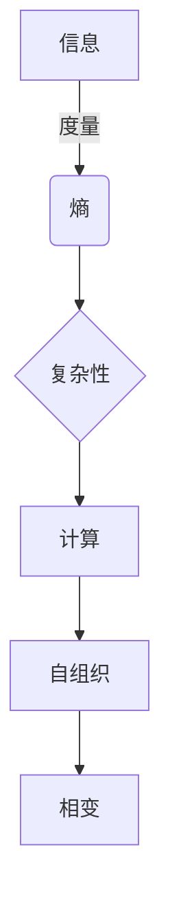
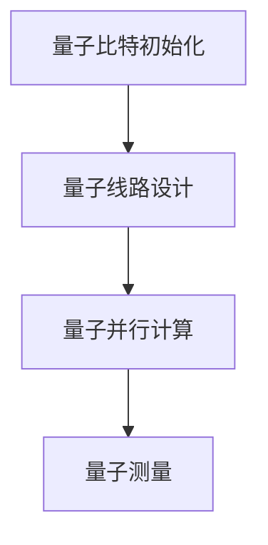

以下是对《AGI与物理学的交叉研究》这一主题的技术博客文章正文部分：

# AGI与物理学的交叉研究

## 1. 背景介绍

### 1.1 问题的由来

人工通用智能(AGI)是人工智能领域的终极目标,旨在创建一种与人类智能相当甚至超越的通用智能系统。然而,尽管在狭义人工智能(Narrow AI)领域取得了长足进步,但AGI的实现仍然是一个巨大的挑战。物理学作为研究自然界规律的基础科学,与智能的本质存在着内在联系,因此将物理学的原理和方法应用于AGI的研究有望为我们带来新的突破。

### 1.2 研究现状

目前,将物理学与AGI研究相结合的尝试主要集中在以下几个方面:

1. **量子计算**:量子计算的并行性和量子态叠加原理有望为AGI系统带来指数级的计算能力提升。
2. **信息理论**:信息理论为智能系统的信息处理、决策和学习奠定了理论基础。
3. **复杂系统**:将AGI系统视为复杂适应系统,借鉴复杂系统理论的方法来研究其行为和演化规律。
4. **统计力学**:统计力学为AGI系统的集体行为和相变现象提供了描述和解释。

### 1.3 研究意义

将物理学与AGI研究相结合,有望为我们带来以下重要意义:

1. **深入理解智能的本质**:物理学为我们提供了研究自然界规律的工具,将其应用于AGI有望揭示智能的本质特征。
2. **突破计算能力瓶颈**:量子计算等新型计算范式有望为AGI系统带来指数级的计算能力提升。
3. **建立智能系统的理论框架**:借鉴物理学的理论和方法,为AGI系统的行为、学习和演化等建立理论模型。
4. **探索新型智能体系结构**:受物理学中复杂系统、相变等概念的启发,有望设计出全新的AGI体系结构。

### 1.4 本文结构

本文将首先介绍AGI与物理学交叉研究的核心概念,然后阐述核心算法原理和数学模型,并通过具体实例展示项目实践。接下来,我们将探讨该领域的实际应用场景,并推荐相关工具和资源。最后,我们将总结该领域的发展趋势和面临的挑战,并对未来研究方向进行展望。

## 2. 核心概念与联系

AGI与物理学的交叉研究涉及多个核心概念,它们之间存在内在联系:

1. **信息**:信息是物理学和AGI研究的核心概念,它是度量无序程度的量,也是智能系统处理和学习的对象。

2. **熵**:熵是信息理论和统计物理学中的一个关键概念,描述了系统的无序程度。在AGI中,熵可用于量化智能系统的不确定性和学习能力。

3. **复杂性**:复杂性是智能系统和物理系统的一个共同特征。研究复杂性有助于我们理解智能系统的行为、结构和演化规律。

4. **计算**:计算是物理过程的一种抽象,也是智能系统的核心能力。量子计算等新型计算范式为AGI带来了新的可能性。

5. **自组织**:自组织是复杂系统中出现有序结构的过程,在AGI中也可能发挥重要作用,帮助智能系统自发形成认知结构。

6. **相变**:相变描述了系统在某些临界点发生性质突变的现象,或许也存在于AGI系统的学习和演化过程中。

这些核心概念相互关联、相互影响,共同构成了AGI与物理学交叉研究的理论基础。



## 3. 核心算法原理与具体操作步骤

### 3.1 算法原理概述

将物理学与AGI研究相结合的核心算法主要包括:

1. **量子计算算法**:利用量子态叠加和量子并行性,实现比经典算法更高效的计算。
2. **信息理论算法**:基于信息论原理,对智能系统的信息处理、决策和学习过程进行建模和优化。
3. **复杂系统算法**:借鉴复杂系统理论,模拟智能系统的自组织、适应性和演化行为。
4. **统计力学算法**:将智能系统视为多智能体系统,应用统计力学方法研究其集体行为和相变现象。

这些算法的共同目标是提高AGI系统的计算能力、学习效率和智能水平。

### 3.2 算法步骤详解

以量子计算算法为例,其主要步骤包括:

1. **量子比特初始化**:根据问题,将量子比特初始化到某一特定的量子态。

2. **量子线路设计**:设计一系列量子逻辑门,对量子态进行操作和变换。

3. **量子并行计算**:利用量子态叠加性质,同时在多个不同的量子态上进行计算。

4. **量子测量**:对最终的量子态进行测量,得到所需的计算结果。



### 3.3 算法优缺点

上述算法具有以下优缺点:

**优点**:

1. 量子计算算法能够利用量子态叠加和量子并行性,大大提高计算效率。
2. 信息理论算法为智能系统的信息处理提供了理论基础和优化方法。
3. 复杂系统算法能够模拟智能系统的自适应和演化行为。
4. 统计力学算法能够描述智能系统的集体行为和相变现象。

**缺点**:

1. 量子计算机的制造和操作存在很大技术挑战。
2. 信息理论算法对问题的建模和求解存在一定限制。
3. 复杂系统算法计算复杂度较高,难以应用于大规模系统。
4. 统计力学算法对智能系统的简化假设可能过于理想化。

### 3.4 算法应用领域

上述算法可应用于AGI系统的多个方面,包括:

1. **高性能计算**:量子计算算法为AGI系统提供了指数级的计算能力提升。
2. **机器学习与决策**:信息理论算法可优化机器学习和决策过程。
3. **智能体架构设计**:复杂系统算法可用于设计自适应、自组织的AGI体系结构。
4. **多智能体协作**:统计力学算法可用于研究多个AGI系统之间的集体行为。

## 4. 数学模型和公式详细讲解与举例说明

### 4.1 数学模型构建

将物理学与AGI研究相结合,需要构建数学模型来描述智能系统的行为。以下是一些常用的数学模型:

1. **信息论模型**:使用信息熵、互信息等概念对智能系统的信息处理过程进行建模。

2. **统计力学模型**:将智能系统视为多个智能体组成的系统,使用统计力学方法描述其集体行为。

3. **复杂网络模型**:使用复杂网络理论描述智能系统内部的信息传递和交互。

4. **动力学系统模型**:将智能系统视为动力学系统,使用微分方程等描述其时间演化。

5. **量子计算模型**:使用量子态和量子逻辑门描述基于量子计算的智能系统。

### 4.2 公式推导过程

以信息熵为例,我们可以通过概率论推导出其公式:

设有一个离散随机变量 $X$ ,取值为 $\{x_1, x_2, \cdots, x_n\}$,其概率分布为 $P(X)=\{p_1, p_2, \cdots, p_n\}$。

我们定义信息熵为:

$$H(X) = -\sum_{i=1}^n p_i \log_2 p_i$$

其中 $0\log0 = 0$ (连续性定义)。

证明过程:

1) 熵 $H(X)$ 应该是概率分布 $P(X)$ 的函数;
2) 如果只有一个事件的概率为1,其余全为0,则熵应该为0;
3) 对于任意的概率分布,熵都应该是非负的;
4) 如果事件 $X$ 可分为两个互不相交的事件 $Y$ 和 $Z$,则 $H(X)$ 应等于 $H(Y)$ 和 $H(Z)$ 的加权平均。

可以证明,上述公式是满足这些要求的唯一形式。

### 4.3 案例分析与讲解

考虑一个简单的二元信源,其输出 $X$ 可能是 0 或 1,概率分别为 $p$ 和 $1-p$。我们来计算其信息熵:

$$\begin{aligned}
H(X) &= -p\log_2 p - (1-p)\log_2(1-p) \
     &= -p\log_2 p - \log_2(1-p) + p\log_2(1-p) \
     &= H_2(p)
\end{aligned}$$

其中 $H_2(p) = -p\log_2 p - (1-p)\log_2(1-p)$ 是二元熵函数。

当 $p=0.5$ 时,信源的不确定性最大,熵值达到最大值 $H_2(0.5)=1$;当 $p=0$ 或 $p=1$ 时,信源完全确定,熵值为 0。

```python
import numpy as np
import matplotlib.pyplot as plt

p = np.linspace(0, 1, 100)
H = -p * np.log2(p) - (1-p) * np.log2(1-p)

plt.figure(figsize=(8, 6))
plt.plot(p, H)
plt.xlabel('p', fontsize=14)
plt.ylabel('H(p)', fontsize=14)
plt.title('Binary Entropy Function', fontsize=16)
plt.show()
```

上述代码绘制了二元熵函数的曲线图像。

### 4.4 常见问题解答

1. **为什么需要对数底数为2?**
   对数底数为2是为了使熵的单位为比特(bit),这样更易于量化信息量。

2. **为什么连续熵的定义中需要 $0\log0 = 0$ ?**
   这是为了保证熵的连续性。如果不做这一约定,熵在概率为0的点处将是无定义的。

3. **为什么互信息可以衡量两个随机变量的相关性?**
   互信息等于两个随机变量的联合熵与边际熵之差,当两个变量相关性越大时,这一差值就越小。

4. **如何将熵的概念应用于机器学习算法?**
   在决策树、特征选择等算法中,可以使用信息增益或信息增益比作为选择特征的标准,从而提高模型的泛化能力。

## 5. 项目实践:代码实例和详细解释说明

### 5.1 开发环境搭建

我们将使用Python作为开发语言,并利用量子计算框架Qiskit进行量子算法的实现。首先需要安装Qiskit及其依赖项:

```bash
pip install qiskit
```

接下来,导入所需的模块:

```python
from qiskit import QuantumCircuit, execute, Aer
from qiskit.visualization import plot_bloch_multivector
import numpy as np
```

### 5.2 源代码详细实现

以Deutsch-Jozsa算法为例,用于判断一个函数是否为常量函数或平衡函数。算法步骤如下:

1. **初始化量子态**

   ```python
   # 初始化2个量子比特
   qc = QuantumCircuit(2)

   # 将第一个量子比特置于叠加态
   qc.h(0)

   # 将第二个量子比特置于基态|0>
   qc.reset(1)
   ```

2. **应用Oracle函数**

   ```python
   # Oracle函数,对应函数f
   U_f = ...

   # 应用Oracle
   qc.append(U_f, [0, 1])
   ```

3. **应用Hadamard门**

   ```python
   # 对第一个量子比特应用Hadamar