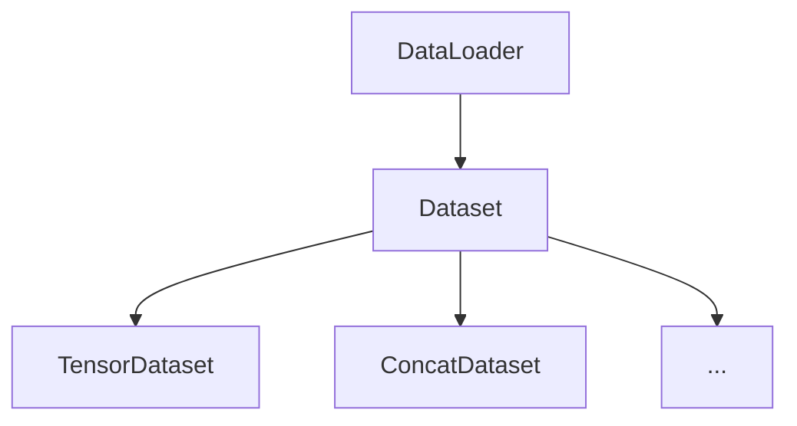

# Dataset 原理与代码实例讲解

## 1. 背景介绍
### 1.1 问题的由来
在机器学习和深度学习领域,数据集(Dataset)是模型训练和评估的基础。高质量的数据集对于模型的性能至关重要。然而,构建高效、灵活、易用的数据集并非易事。传统的数据加载方式,如 Python 的列表和 Numpy 数组,在处理大规模数据时往往效率低下,扩展性差。因此,如何设计和实现高性能的数据集,成为了一个亟待解决的问题。

### 1.2 研究现状
目前,主流的深度学习框架如 PyTorch 和 TensorFlow,都提供了自己的数据集工具。PyTorch 从 0.2 版本开始引入了 Dataset 和 DataLoader,用于构建和加载数据集。TensorFlow 则提供了 tf.data 模块,用于构建数据输入流水线。这些工具极大地方便了数据集的使用,但对于新手来说,理解其内部原理仍有一定难度。

### 1.3 研究意义
深入理解数据集的原理和实现,对于深度学习的学习和应用都有重要意义。一方面,了解数据集的内部机制,有助于我们更好地使用现有的工具,提高数据处理的效率。另一方面,熟悉数据集的实现细节,也为我们自定义数据集打下基础,使我们能够针对特定问题设计最优的数据方案。

### 1.4 本文结构
本文将重点介绍 PyTorch 中 Dataset 的原理和使用。内容安排如下:

- 第 2 节介绍 Dataset 的核心概念和相关组件。
- 第 3 节讲解 Dataset 的工作原理和典型用法。
- 第 4 节结合代码示例,展示几种常见的 Dataset 实现。
- 第 5 节总结全文,并对 Dataset 的发展趋势做简要展望。

## 2. 核心概念与联系
在 PyTorch 中,Dataset 是一个抽象类,表示一个数据集。通过继承 Dataset 基类,用户可以自定义数据集的读取和处理方式。Dataset 通常与 DataLoader 一起使用,后者用于将数据集分批次(batch)读取,并提供数据混洗(shuffle)、并行加速等功能。

Dataset 的核心是 `__getitem__` 方法,它定义了如何通过索引(index)获取数据集中的样本。此外,`__len__` 方法返回数据集的样本数量。PyTorch 提供了多个 Dataset 的子类,如 `TensorDataset`、`ConcatDataset`等,它们实现了一些常用的数据集操作。

下图展示了 Dataset 及相关类的结构关系:



## 3. 核心算法原理 & 具体操作步骤
### 3.1 算法原理概述
Dataset 的核心是 `__getitem__` 方法,它接收一个索引作为输入,返回该索引对应的数据样本。Dataset 可以看作一个数据样本的列表,`__getitem__` 方法则定义了如何读取列表中的元素。

### 3.2 算法步骤详解
以下是实现自定义 Dataset 的典型步骤:

1. 继承 `torch.utils.data.Dataset` 基类
2. 实现 `__init__` 方法,在其中完成数据集的初始化工作,如读入全部数据等
3. 实现 `__getitem__` 方法,定义如何通过索引获取样本
4. 实现 `__len__` 方法,返回数据集的样本数量

### 3.3 算法优缺点
使用 Dataset 有以下优点:

- 提供了一种标准的数据集接口,便于与其他工具(如 DataLoader)配合使用
- 允许用户自定义数据集的读取方式,提高了灵活性
- 可以充分利用 Python 的特性(如 `__getitem__` 语法)来简化代码

但 Dataset 也有一些局限性:

- 对于非常大的数据集,全部读入内存可能会占用过多资源
- Dataset 本身只提供了数据读取的接口,一些高级功能(如分批次、并行加载等)需要与其他工具(如 DataLoader)配合使用

### 3.4 算法应用领域
Dataset 广泛用于机器学习和深度学习领域,尤其是计算机视觉、自然语言处理等数据驱动的任务。几乎所有使用 PyTorch 进行模型训练的项目都会用到 Dataset。

## 4. 数学模型和公式 & 详细讲解 & 举例说明
### 4.1 数学模型构建
Dataset 可以看作一个数学映射,将索引映射到数据样本:

$$Dataset: \mathbb{N} \rightarrow \mathcal{S}$$

其中 $\mathbb{N}$ 表示非负整数集合(样本的索引),$ \mathcal{S}$ 表示数据样本的集合。

### 4.2 公式推导过程
对于给定的索引 $i$,Dataset 返回对应的数据样本 $s_i$:

$$s_i = Dataset(i), i \in \mathbb{N}, s_i \in \mathcal{S}$$

### 4.3 案例分析与讲解
以图像分类任务为例,假设我们有 1000 张图像,每张图像都有一个类别标签。那么数据集可以表示为:

$$Dataset: \{0, 1, ..., 999\} \rightarrow \{(image_0, label_0), (image_1, label_1), ..., (image_{999}, label_{999})\}$$

其中 $image_i$ 表示第 $i$ 张图像,$ label_i$ 表示第 $i$ 张图像的类别标签。

### 4.4 常见问题解答
- 问:Dataset 和 DataLoader 有什么区别?
- 答:Dataset 定义了如何读取数据集中的单个样本,而 DataLoader 在 Dataset 的基础上实现了批次读取、数据混洗等功能。它们通常配合使用。

## 5. 项目实践:代码实例和详细解释说明
### 5.1 开发环境搭建
首先需要安装 PyTorch,可以通过以下命令安装:

```bash
pip install torch
```

### 5.2 源代码详细实现
以下是一个自定义 Dataset 的示例,它实现了一个简单的图像分类数据集:

```python
import os
from PIL import Image
import torch
from torch.utils.data import Dataset

class MyDataset(Dataset):
    def __init__(self, root_dir, transform=None):
        self.root_dir = root_dir
        self.transform = transform
        self.images = os.listdir(root_dir)

    def __len__(self):
        return len(self.images)

    def __getitem__(self, index):
        img_path = os.path.join(self.root_dir, self.images[index])
        image = Image.open(img_path).convert('RGB')
        label = int(self.images[index].split("_")[0]) # 假设图像文件名的格式为 "label_xxx.jpg"

        if self.transform is not None:
            image = self.transform(image)

        return image, label
```

### 5.3 代码解读与分析
- `__init__` 方法接收图像文件夹路径 `root_dir` 和图像变换 `transform`,并读取文件夹中的所有图像文件名。
- `__len__` 方法返回图像文件的数量,即数据集的大小。
- `__getitem__` 方法根据索引读取对应的图像文件,并将其转换为 RGB 格式。然后从文件名中解析出图像的标签。最后对图像应用变换 `transform`(如果有的话),并返回图像和标签。

### 5.4 运行结果展示
使用自定义的 Dataset 进行模型训练的示例代码如下:

```python
from torch.utils.data import DataLoader
from torchvision import transforms

transform = transforms.Compose([
    transforms.Resize((224, 224)),
    transforms.ToTensor()
])

dataset = MyDataset(root_dir='path/to/image/folder', transform=transform)
dataloader = DataLoader(dataset, batch_size=32, shuffle=True)

for images, labels in dataloader:
    # 训练模型
    pass
```

这段代码首先定义了一个图像变换 `transform`,然后创建了自定义的 `MyDataset` 实例。接着使用 `DataLoader` 将数据集分批次读取,并启用了数据混洗。最后在循环中取出每个批次的图像和标签,用于训练模型。

## 6. 实际应用场景
Dataset 在各种深度学习任务中都有广泛应用,例如:

- 图像分类:将图像和对应的类别标签构建成数据集,用于训练分类模型。
- 目标检测:将图像和目标边界框、类别标签构建成数据集,用于训练检测模型。
- 语义分割:将图像和像素级别的分割标签构建成数据集,用于训练分割模型。
- 自然语言处理:将文本数据和标签(如情感标签)构建成数据集,用于训练文本分类、序列标注等模型。

### 6.4 未来应用展望
随着深度学习的发展,对高质量数据集的需求也在不断增长。未来 Dataset 的应用场景将更加广泛,数据形式也将更加多样化。同时,针对超大规模数据集、非结构化数据集等特定场景,Dataset 的设计和实现也将面临新的挑战。

## 7. 工具和资源推荐
### 7.1 学习资源推荐
- [PyTorch官方文档:Dataset & DataLoader](https://pytorch.org/tutorials/beginner/basics/data_tutorial.html)
- [PyTorch数据加载教程](https://zhuanlan.zhihu.com/p/30934236)

### 7.2 开发工具推荐
- [PyTorch](https://pytorch.org/):PyTorch官网,可以下载安装PyTorch,查阅文档等。
- [torchvision](https://pytorch.org/vision/):PyTorch官方计算机视觉库,提供了常用的数据集、模型、变换等。

### 7.3 相关论文推荐
- ImageNet Classification with Deep Convolutional Neural Networks
- Microsoft COCO: Common Objects in Context

### 7.4 其他资源推荐
- [Awesome Dataset](https://github.com/pytorch/vision):一个PyTorch数据集的集合,包含了常用的数据集及其使用示例。

## 8. 总结:未来发展趋势与挑战
### 8.1 研究成果总结
本文介绍了 PyTorch 中 Dataset 的原理和使用方法。Dataset 定义了数据集的读取接口,允许用户自定义数据集的实现。通过继承 Dataset 基类,并实现 `__getitem__` 等方法,我们可以创建自己的数据集类。Dataset 通常与 DataLoader 配合使用,以实现批次读取、数据混洗等功能。

### 8.2 未来发展趋势
未来,Dataset 将向以下方向发展:

- 更加灵活和通用的数据集接口,支持更多种类的数据。
- 更高效的数据读取和预处理方式,以支持超大规模数据集。
- 更好的内存管理和缓存机制,减少不必要的 I/O 开销。
- 更好的与分布式训练框架的集成,实现分布式数据并行。

### 8.3 面临的挑战
Dataset 的发展也面临一些挑战:

- 如何设计通用的数据集接口,以支持各种类型的数据和任务?
- 如何在保证通用性的同时,又能提供高效的数据读取和预处理?
- 如何设计内存友好的数据集实现,以支持超大规模数据集?
- 如何实现分布式数据集,以支持分布式训练?

### 8.4 研究展望
未来,Dataset 的研究将围绕上述挑战展开。通过设计更加灵活、高效、通用的数据集接口和实现,Dataset 将能够更好地支持各种深度学习任务。同时,Dataset 也将与分布式训练、内存管理等技术结合,以应对超大规模数据集带来的挑战。

## 9. 附录:常见问题与解答
- 问:如何将多个数据集合并成一个数据集?
- 答:可以使用 `ConcatDataset` 将多个数据集合并成一个数据集。例如:

```python
from torch.utils.data import ConcatDataset

dataset1 = MyDataset(...)
dataset2 = MyDataset(...)
dataset = ConcatDataset([dataset1, dataset2])
```

- 问:如何实现数据集的随机采样?
- 答:可以使用 `RandomSampler` 对数据集进行随机采样。例如:

```python
from torch.utils.data import RandomSampler

sampler = RandomSampler(dataset)
data