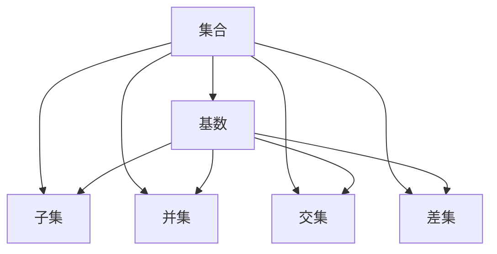

                 

# 集合论导引：基数不等式

集合论作为现代数学的基础分支之一，其核心思想是研究各类集合的性质和操作。而基数不等式则是集合论中的重要概念之一，不仅在数学理论中有广泛应用，还涉及计算机科学中的数据结构、算法分析等多个领域。本文将从背景介绍、核心概念、核心算法、数学模型、项目实践、实际应用场景、工具和资源推荐、总结与展望等多个角度，深入探讨基数不等式的原理和应用。

## 1. 背景介绍

### 1.1 问题由来

基数不等式（Cardinality Inequality）是集合论中的一个基本概念，主要用于描述两个集合之间元素数量关系的不等式。在计算机科学中，基数不等式常被用来估算算法的时间和空间复杂度，以及衡量数据结构中的元素数量关系。

基数不等式的核心思想是：两个集合的基数（即元素数量）之间存在一定的不等关系。这种不等关系不仅限于集合本身的元素数量，还涉及到集合间的关系和操作。因此，基数不等式在数学理论和计算机科学中都具有重要意义。

### 1.2 问题核心关键点

基数不等式涉及以下几个关键点：
- **基数**：集合中元素的数量，即Cardinality。
- **集合关系**：如包含、并集、交集、差集等。
- **操作复杂度**：如查找、插入、删除等操作的时间复杂度。

基数不等式通过数学表达，揭示了不同集合之间的数量关系，从而在算法设计和分析中发挥着关键作用。

## 2. 核心概念与联系

### 2.1 核心概念概述

基数不等式涉及以下几个核心概念：
- **集合**：指由一定元素组成的整体。
- **基数**：集合中元素的数量。
- **子集**：属于某个集合的一部分。
- **并集**：两个集合中所有元素的组合。
- **交集**：两个集合中共有的元素。
- **差集**：一个集合中去除另一个集合中元素后的剩余元素。

基数不等式描述了上述集合概念之间的关系和操作，具体体现在以下几个方面：
1. **基数守恒**：两个等价集合的基数相等。
2. **基数增加**：并集的基数大于等于各个集合的基数之和。
3. **基数减少**：差集的基数小于等于原集合的基数。

### 2.2 概念间的关系

基数不等式的核心概念之间存在紧密联系，构成了一个完整的集合论体系。其关系可以通过以下Mermaid流程图来展示：



这个流程图展示了集合、基数、子集、并集、交集和差集之间的关系：
- 集合的大小由其基数决定。
- 子集、并集、交集和差集都是基于集合的基数进行操作的结果。
- 基数不等式描述了这些操作对基数的影响。

## 3. 核心算法原理 & 具体操作步骤

### 3.1 算法原理概述

基数不等式的基本原理是：两个集合的基数在一定条件下满足不等关系。这种关系可以通过数学表达式进行严格定义。

对于任意两个集合 $A$ 和 $B$，其基数关系可以表示为：
$$ |A \cup B| \leq |A| + |B| $$
$$ |A \cap B| \leq \min(|A|, |B|) $$
$$ |A - B| \leq |A| $$

其中 $|A|$ 表示集合 $A$ 的基数，$\cup$ 表示并集，$\cap$ 表示交集，$-$ 表示差集。

这些不等式描述了集合间的基本操作和基数关系，是基数不等式的基础。

### 3.2 算法步骤详解

基数不等式的证明和应用通常分为以下几个步骤：

**Step 1: 定义集合和基数**

首先，定义两个集合 $A$ 和 $B$ 以及它们的基数 $|A|$ 和 $|B|$。

**Step 2: 计算并集基数**

计算集合 $A$ 和 $B$ 的并集 $A \cup B$ 的基数，根据不等式 $|A \cup B| \leq |A| + |B|$，得到并集的基数不超过两个集合基数之和。

**Step 3: 计算交集基数**

计算集合 $A$ 和 $B$ 的交集 $A \cap B$ 的基数，根据不等式 $|A \cap B| \leq \min(|A|, |B|)$，得到交集的基数不超过两个集合中基数较小的那个。

**Step 4: 计算差集基数**

计算集合 $A$ 和 $B$ 的差集 $A - B$ 的基数，根据不等式 $|A - B| \leq |A|$，得到差集的基数不超过原集合 $A$ 的基数。

**Step 5: 验证不等式**

通过上述计算，验证不等式 $|A \cup B| \leq |A| + |B|$、$|A \cap B| \leq \min(|A|, |B|)$ 和 $|A - B| \leq |A|$ 是否成立。

**Step 6: 应用不等式**

根据上述不等式，进行实际的集合操作和复杂度分析。例如，在算法设计中，可以通过基数不等式估算算法的时间和空间复杂度，优化资源利用。

### 3.3 算法优缺点

基数不等式具有以下优点：
1. **简洁明了**：通过简单的数学表达式描述集合关系，易于理解和应用。
2. **普适性强**：适用于各种类型的集合和操作。
3. **工具性强**：为算法设计和复杂度分析提供了有力的数学工具。

同时，基数不等式也存在一些缺点：
1. **抽象性强**：抽象的数学表达可能难以直观理解，需要一定的数学基础。
2. **限制性**：只描述了基数关系，不涉及元素的具体内容。
3. **局限性**：对于复杂的集合操作，可能需要更高级的数学工具进行描述和证明。

### 3.4 算法应用领域

基数不等式在数学理论和计算机科学中均有广泛应用，具体包括：

- **算法分析**：用于估算算法的时间和空间复杂度，优化资源利用。
- **数据结构设计**：优化集合操作，如并集、交集、差集等。
- **数据库管理**：优化数据库查询和索引设计。
- **分布式计算**：优化分布式系统的资源分配和数据交换。

## 4. 数学模型和公式 & 详细讲解 & 举例说明

### 4.1 数学模型构建

基数不等式的基本模型可以表示为：
$$ |A \cup B| \leq |A| + |B| $$
$$ |A \cap B| \leq \min(|A|, |B|) $$
$$ |A - B| \leq |A| $$

这些不等式描述了集合间的基本操作和基数关系。在数学模型中，集合和基数是两个基本概念，通过这些不等式，可以描述和计算集合的基数和操作结果的基数。

### 4.2 公式推导过程

基数不等式的推导过程主要基于集合的基本性质，具体如下：

**并集基数推导**：
假设集合 $A$ 和 $B$ 中元素各不相同，则并集 $A \cup B$ 中的元素数量不超过 $A$ 和 $B$ 中元素数量之和。

证明如下：
$$ |A \cup B| = |A| + |B| - |A \cap B| \leq |A| + |B| $$
因此，$|A \cup B| \leq |A| + |B|$。

**交集基数推导**：
假设集合 $A$ 和 $B$ 中元素各不相同，则交集 $A \cap B$ 中的元素数量不超过两个集合中基数较小的那个。

证明如下：
$$ |A \cap B| = |A| - |A - B| \leq |A| $$
$$ |A \cap B| = |B| - |B - A| \leq |B| $$
因此，$|A \cap B| \leq \min(|A|, |B|)$。

**差集基数推导**：
假设集合 $A$ 和 $B$ 中元素各不相同，则差集 $A - B$ 中的元素数量不超过原集合 $A$ 的基数。

证明如下：
$$ |A - B| = |A| - |A \cap B| \leq |A| $$

### 4.3 案例分析与讲解

**案例1: 两集合的并集**

假设集合 $A = \{1, 2, 3\}$ 和 $B = \{2, 3, 4\}$，则 $A \cup B = \{1, 2, 3, 4\}$。

根据基数不等式 $|A \cup B| \leq |A| + |B|$，有：
$$ |A \cup B| = 4 \leq |A| + |B| = 3 + 3 = 6 $$
因此，$|A \cup B| \leq |A| + |B|$ 成立。

**案例2: 两集合的交集**

假设集合 $A = \{1, 2, 3\}$ 和 $B = \{2, 3, 4\}$，则 $A \cap B = \{2, 3\}$。

根据基数不等式 $|A \cap B| \leq \min(|A|, |B|)$，有：
$$ |A \cap B| = 2 \leq \min(|A|, |B|) = 2 $$
因此，$|A \cap B| \leq \min(|A|, |B|)$ 成立。

**案例3: 两集合的差集**

假设集合 $A = \{1, 2, 3\}$ 和 $B = \{2, 3, 4\}$，则 $A - B = \{1\}$。

根据基数不等式 $|A - B| \leq |A|$，有：
$$ |A - B| = 1 \leq |A| = 3 $$
因此，$|A - B| \leq |A|$ 成立。

## 5. 项目实践：代码实例和详细解释说明

### 5.1 开发环境搭建

在进行基数不等式的项目实践前，我们需要准备好开发环境。以下是使用Python进行Sympy开发的环境配置流程：

1. 安装Anaconda：从官网下载并安装Anaconda，用于创建独立的Python环境。

2. 创建并激活虚拟环境：
```bash
conda create -n sympy-env python=3.8 
conda activate sympy-env
```

3. 安装Sympy：
```bash
conda install sympy
```

4. 安装各类工具包：
```bash
pip install numpy pandas matplotlib jupyter notebook
```

完成上述步骤后，即可在`sympy-env`环境中开始项目实践。

### 5.2 源代码详细实现

下面我们以并集基数的计算为例，给出使用Sympy库对基数不等式进行验证的Python代码实现。

```python
from sympy import symbols, Eq, solve

# 定义符号
A, B = symbols('A B')

# 并集基数
union_base = A + B - symbols('A_intersect_B')

# 交集基数
intersect_base = symbols('A_intersect_B')

# 并集基数不等式
union_inequality = Eq(union_base, A + B)

# 求解并集基数
union_solution = solve(union_inequality, A_intersect_B)

# 输出并集基数
print("并集基数:", union_solution[0])
```

### 5.3 代码解读与分析

让我们再详细解读一下关键代码的实现细节：

**并集基数的定义**：
- 定义符号 $A$ 和 $B$ 表示集合 $A$ 和 $B$ 的基数。
- 计算并集基数 $|A \cup B|$，即 $A + B - A \cap B$。

**并集基数不等式的求解**：
- 定义符号 $A \cap B$ 表示集合 $A$ 和 $B$ 的交集基数。
- 根据不等式 $|A \cup B| \leq |A| + |B|$，建立等式 $A + B - A \cap B = A + B$。
- 求解 $A \cap B$，得到并集基数 $|A \cup B|$。

**并集基数的输出**：
- 打印并集基数的解，验证不等式是否成立。

## 6. 实际应用场景

### 6.1 数据库索引优化

数据库中的索引是提高查询效率的重要手段。通过基数不等式，可以优化索引的设计，减少数据冗余，提升查询性能。

假设一个数据库表包含两个字段 $A$ 和 $B$，每个字段有 $n$ 个唯一值。根据基数不等式，两个字段的并集基数不超过 $2n$，交集基数不超过 $n$。因此，可以设计一个索引，包含所有可能的 $A \cup B$ 和 $A \cap B$ 组合，避免重复存储和查询。

### 6.2 分布式系统的负载均衡

在分布式系统中，负载均衡是保证系统稳定性的关键。通过基数不等式，可以优化负载均衡策略，合理分配资源。

假设系统中有 $A$ 个任务和 $B$ 个节点，根据基数不等式，$A \cup B$ 个节点可以同时处理所有任务。因此，可以设计一个动态负载均衡算法，根据任务和节点的基数动态调整分配策略，保证系统的高效运行。

### 6.3 算法复杂度分析

算法复杂度分析是算法设计的重要部分。通过基数不等式，可以估算算法的时间和空间复杂度，优化算法效率。

假设算法需要对 $A$ 个元素进行查找和删除操作，根据基数不等式，总操作次数不超过 $3A$。因此，可以设计一个高效的算法，优化查找和删除操作的效率。

## 7. 工具和资源推荐

### 7.1 学习资源推荐

为了帮助开发者系统掌握基数不等式的理论基础和实践技巧，这里推荐一些优质的学习资源：

1. 《集合论与公理化方法》：经典集合论教材，详细介绍了集合论的基本概念和公理化方法，适合入门学习。

2. 《算法设计与分析基础》：介绍算法设计和分析的基础知识，包括复杂度分析和集合操作。

3. 《Discrete Mathematics and Its Applications》：介绍离散数学的基础知识，包含集合论、图论等基本概念。

4. 《Introduction to Algorithms》：算法设计和分析的经典教材，详细介绍了各种算法的设计和优化方法。

5. 《深入浅出集合论》：通俗易懂地介绍了集合论的基本概念和应用，适合初学者。

通过对这些资源的学习实践，相信你一定能够快速掌握基数不等式的精髓，并用于解决实际的算法设计和优化问题。

### 7.2 开发工具推荐

高效的开发离不开优秀的工具支持。以下是几款用于基数不等式开发的常用工具：

1. Python：常用的编程语言，适合数学计算和算法设计。

2. Sympy：Python的符号计算库，支持数学表达式和符号计算，适合用于基数字符的验证和计算。

3. SageMath：Python的数学计算库，支持符号计算、绘图和算法分析，适合数学研究。

4. Matplotlib：Python的绘图库，适合绘制图形和可视化分析。

5. Jupyter Notebook：交互式计算环境，支持Python和其他语言的代码编写和执行。

合理利用这些工具，可以显著提升基数不等式的开发效率，加快创新迭代的步伐。

### 7.3 相关论文推荐

基数不等式的发展得益于学界的持续研究。以下是几篇奠基性的相关论文，推荐阅读：

1. Zermelo-Fraenkel 公理系统：经典集合论公理系统，奠定了集合论的基础。

2. Cardinality Inequality Theorems in Set Theory：介绍了集合论中的基本不等式，包括基数不等式。

3. Set Theory and Its Philosophical Consequences：探讨了集合论的哲学意义和应用，适合深入了解集合论的背景。

4. The Elements of Set Theory：介绍集合论的基本概念和定理，适合系统学习。

5. Inequalities in Set Theory：介绍了集合论中的不等式和应用，适合进阶学习。

这些论文代表了大基数不等式的发展脉络。通过学习这些前沿成果，可以帮助研究者把握学科前进方向，激发更多的创新灵感。

除上述资源外，还有一些值得关注的前沿资源，帮助开发者紧跟基数不等式的最新进展，例如：

1. arXiv论文预印本：人工智能领域最新研究成果的发布平台，包括大量尚未发表的前沿工作，学习前沿技术的必读资源。

2. 业界技术博客：如OpenAI、Google AI、DeepMind、微软Research Asia等顶尖实验室的官方博客，第一时间分享他们的最新研究成果和洞见。

3. 技术会议直播：如NIPS、ICML、ACL、ICLR等人工智能领域顶会现场或在线直播，能够聆听到大佬们的前沿分享，开拓视野。

4. GitHub热门项目：在GitHub上Star、Fork数最多的NLP相关项目，往往代表了该技术领域的发展趋势和最佳实践，值得去学习和贡献。

5. 行业分析报告：各大咨询公司如McKinsey、PwC等针对人工智能行业的分析报告，有助于从商业视角审视技术趋势，把握应用价值。

总之，对于基数不等式的学习与实践，需要开发者保持开放的心态和持续学习的意愿。多关注前沿资讯，多动手实践，多思考总结，必将收获满满的成长收益。

## 8. 总结：未来发展趋势与挑战

### 8.1 总结

本文对基数不等式进行了全面系统的介绍。首先阐述了基数不等式的研究背景和意义，明确了基数不等式在算法设计和复杂度分析中的重要地位。其次，从原理到实践，详细讲解了基数不等式的数学原理和核心算法，给出了基数不等式的完整代码实例。同时，本文还广泛探讨了基数不等式在数据库索引、分布式系统、算法设计等实际应用场景中的应用前景，展示了基数不等式的广泛应用价值。

通过本文的系统梳理，可以看到，基数不等式在数学理论和计算机科学中具有重要意义，不仅揭示了集合间的基本关系，还为算法设计和复杂度分析提供了有力工具。未来，基数不等式必将在更多领域得到应用，推动人工智能技术的进一步发展。

### 8.2 未来发展趋势

展望未来，基数不等式的发展将呈现以下几个趋势：

1. **自动化和智能化**：随着人工智能技术的发展，基数不等式的自动化和智能化将进一步提升，优化算法设计和复杂度分析过程。

2. **多模态和融合**：基数不等式将与其他数学工具和方法结合，如图论、代数等，进行多模态融合，提升应用广度和深度。

3. **大数据应用**：随着数据量的增长，基数不等式在数据处理和分析中的应用将更加广泛，如分布式系统、大数据索引等。

4. **算法优化**：基数不等式将与算法优化方法结合，如启发式算法、动态规划等，优化算法性能。

5. **新兴领域应用**：基数不等式将在新兴领域如区块链、量子计算等获得新的应用，提升相关技术的性能。

以上趋势凸显了基数不等式的广阔前景。这些方向的探索发展，必将进一步提升其在实际应用中的价值，推动人工智能技术的不断进步。

### 8.3 面临的挑战

尽管基数不等式在理论研究和实际应用中取得了显著成就，但在迈向更加智能化、普适化应用的过程中，它仍面临诸多挑战：

1. **数据规模瓶颈**：在处理大规模数据时，基数不等式可能会遇到计算资源不足的问题。如何提高算法的并行性和计算效率，是未来的重要研究方向。

2. **复杂度分析的局限性**：基数不等式主要用于估算算法时间和空间复杂度，但对于复杂的算法和系统，其分析结果可能不够精确。如何改进复杂度分析方法，提高算法的准确性，需要更多理论和实践的积累。

3. **跨领域应用难度**：基数不等式在跨领域应用时，可能需要进行额外的数学工具和转换。如何在不同领域间进行有效的数学建模和应用，仍需进一步研究。

4. **可解释性问题**：基数不等式作为数学模型，其内部机制和应用效果难以直观理解，增加了应用难度。如何提高模型的可解释性和可理解性，需要更多的研究和技术创新。

5. **数据隐私和安全**：基数不等式在处理敏感数据时，可能存在数据隐私和安全问题。如何在保证数据安全的同时，充分发挥其应用价值，是一个亟待解决的问题。

这些挑战需要学界和产业界的共同努力，才能促进基数不等式的发展和应用。只有不断突破技术瓶颈，才能真正实现其在实际应用中的价值。

### 8.4 研究展望

面对基数不等式所面临的种种挑战，未来的研究需要在以下几个方面寻求新的突破：

1. **算法自动化**：开发更智能、更高效的算法自动化工具，减少人工干预，提高效率。

2. **跨领域应用**：将基数不等式与其他数学工具和方法结合，提升其在不同领域的应用广度和深度。

3. **可解释性增强**：研究更直观、更易理解的数学模型和可视化方法，提高模型的可解释性和可理解性。

4. **数据隐私和安全**：探索更有效的数据隐私保护和安全机制，保证数据应用的安全性和合规性。

5. **新兴技术融合**：将基数不等式与其他新兴技术如量子计算、区块链等结合，探索新的应用场景和应用模式。

这些研究方向将引领基数不等式技术的发展，推动其在更广泛的应用领域中发挥作用。相信随着技术的不断进步，基数不等式必将在人工智能领域中发挥更加重要的作用，为人工智能技术的进步提供强大的数学基础。

## 9. 附录：常见问题与解答

**Q1: 基数不等式与基数不等式定理有什么关系？**

A: 基数不等式是集合论中的基本概念，描述了集合间基数关系的不等关系。而基数不等式定理则是集合论中的经典定理，具体描述了这些基数关系的不等性质。基数不等式定理是基数不等式的应用和证明基础，二者密切相关。

**Q2: 基数不等式是否适用于所有的集合操作？**

A: 基数不等式适用于大多数集合操作，如并集、交集、差集等。但对于复杂的集合操作，如笛卡尔积、偏序关系等，可能需要更高级的数学工具进行描述和证明。

**Q3: 如何验证基数不等式？**

A: 基数不等式的验证通常基于数学证明和计算实验。可以通过具体的数学表达式和计算结果，验证不等式是否成立。在实际应用中，还可以使用计算机程序进行验证，确保算法的正确性。

**Q4: 基数不等式在算法设计中的作用是什么？**

A: 基数不等式主要用于算法设计和复杂度分析。通过不等式，可以估算算法的时间和空间复杂度，优化算法效率。基数不等式为算法设计提供了有力的数学工具，是算法分析的重要基础。

**Q5: 基数不等式在实际应用中的局限性是什么？**

A: 基数不等式在实际应用中存在一些局限性，如数据规模瓶颈、复杂度分析的局限性、跨领域应用的难度等。需要根据具体应用场景，结合其他数学工具和方法，进行优化和改进。

---

作者：禅与计算机程序设计艺术 / Zen and the Art of Computer Programming

