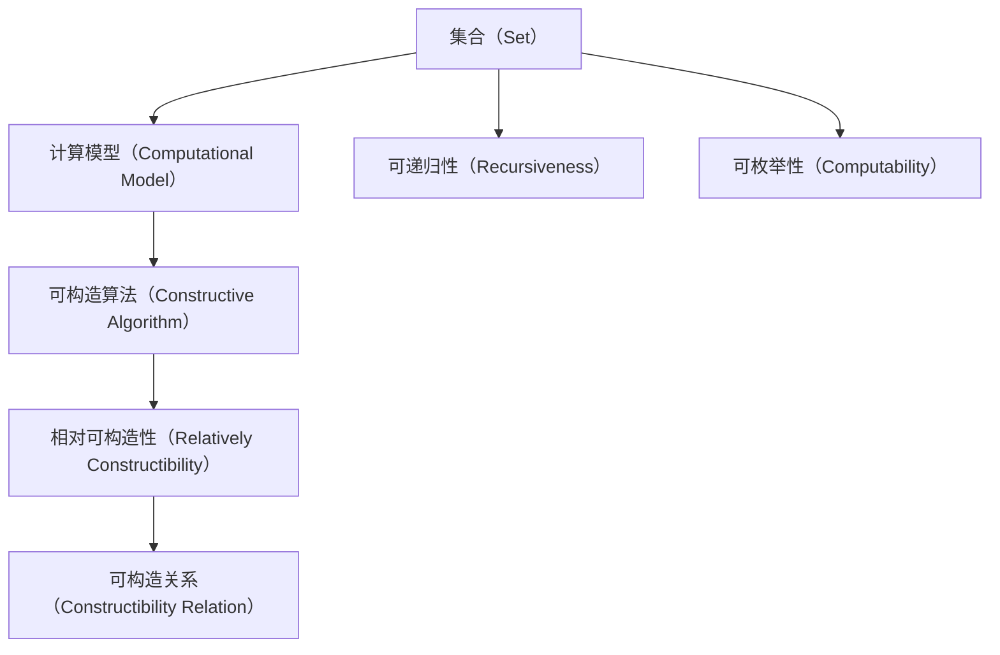

                 

## 1. 背景介绍

### 1.1 问题由来

集合论是数学和计算机科学中一个重要而基础的概念框架，它提供了许多基本的思维工具和理论基础。在计算机科学中，集合论被广泛用于数据结构、算法设计、逻辑推理、编程语言等领域，成为理论研究和实际应用的重要基石。

相对可构造集（Relatively Constructible Sets）是集合论中的一个核心概念，它刻画了在某种计算模型下，两个集合之间相互构造的可能性。相对可构造性在理论计算领域具有重要的意义，特别是在计算机科学的基础理论与实际应用中扮演了重要角色。

在本文中，我们将详细探讨相对可构造集的概念、原理、算法及其应用，并展示其如何影响计算机科学中的基础理论与实际应用。

### 1.2 问题核心关键点

相对可构造集的核心思想是在某种计算模型下，两个集合之间可以相互构造，即可以从一个集合构造出另一个集合，反之亦然。这种构造关系主要依赖于某个算法或程序，通常称为可构造算法（Constructive Algorithm）。

相对可构造集的应用广泛，特别是在计算机科学的基础理论与算法设计中，如算法复杂性、计算模型、逻辑推理、编程语言等领域。理解相对可构造集的概念和原理，对于掌握计算机科学的核心思想和理论方法至关重要。

### 1.3 问题研究意义

相对可构造集的研究不仅有助于深入理解计算机科学中的基础理论，还可以推动实际应用中的算法设计和优化。通过对相对可构造性的深入探讨，可以更好地理解计算模型的能力与局限，指导算法设计，提升计算效率，优化资源利用，从而推动计算机科学的发展与应用。

## 2. 核心概念与联系

### 2.1 核心概念概述

相对可构造集的核心概念包括以下几个方面：

1. **集合（Set）**：由一系列元素组成的无序集合，通常表示为 $\{e_1, e_2, ..., e_n\}$，其中 $e_i$ 表示集合中的元素。

2. **计算模型（Computational Model）**：一种抽象的计算框架，用于描述计算机执行计算操作的基本方式和特性。常见的计算模型包括图灵机（Turing Machine）、递归函数（Recursive Function）、λ-演算（λ-Calculus）等。

3. **可构造算法（Constructive Algorithm）**：能够从某个集合中构造出另一个集合的算法。

4. **相对可构造性（Relatively Constructibility）**：在某种计算模型下，两个集合之间相互可构造的关系。如果集合 $A$ 可以在集合 $B$ 上构造，则称 $A$ 相对于 $B$ 可构造，记为 $A \leq_m B$。

5. **可递归性（Recursiveness）**：如果一个集合可以在自身上构造，则称该集合是可递归的。

6. **可枚举性（Computable）**：如果一个集合可以通过某个算法全部枚举出其元素，则称该集合是可枚举的。

这些概念之间有着密切的联系，共同构成了相对可构造集的理论基础。下面通过一个简单的示例来说明这些概念。

假设我们有两个集合 $A = \{1, 2, 3, 4\}$ 和 $B = \{(x, y) \mid x \in A, y = 2x\}$。根据定义，集合 $A$ 是一个简单的集合，而集合 $B$ 是通过集合 $A$ 构造得到的。因此，我们可以说 $B$ 是相对于 $A$ 可构造的，即 $B \leq_m A$。在这个例子中，我们可以定义一个简单的算法，将集合 $A$ 中的每个元素 $x$ 映射到 $B$ 中的元素 $(2x, x)$，从而实现了 $A$ 到 $B$ 的构造。

### 2.2 概念间的关系

这些核心概念之间的关系可以用以下Mermaid流程图来表示：



这个流程图展示了集合论中的核心概念及其相互关系：

1. 集合是计算模型的基本组成单位。
2. 计算模型定义了计算操作的基本方式和特性。
3. 可构造算法是一种能够在计算模型上执行的算法，用于构造集合。
4. 相对可构造性刻画了两个集合之间的构造关系。
5. 可递归性和可枚举性分别描述了集合的构造能力和枚举能力。
6. 可构造关系是相对可构造性的具体应用，描述了集合之间的构造关系。

这些概念共同构成了集合论的理论基础，为理解相对可构造集的概念和原理提供了重要的背景和工具。

## 3. 核心算法原理 & 具体操作步骤

### 3.1 算法原理概述

相对可构造集的核心算法原理主要基于以下两个方面：

1. **构造算法（Construction Algorithm）**：这种算法可以从一个集合中构造出另一个集合。构造算法通常依赖于某种计算模型和可构造算法。

2. **递归算法（Recursive Algorithm）**：递归算法通过将问题分解为更小的子问题，逐步求解，最终得到整个问题的解。递归算法与构造算法密切相关，因为许多构造算法都可以通过递归实现。

相对可构造集的研究主要关注于如何通过构造算法和递归算法，刻画和证明两个集合之间的构造关系。这种关系在计算机科学中具有重要的理论意义和实际应用价值。

### 3.2 算法步骤详解

相对可构造集的构造算法和递归算法通常包括以下步骤：

1. **定义输入集合（Input Set）**：确定构造算法或递归算法中的输入集合。
2. **定义输出集合（Output Set）**：确定构造算法或递归算法中的输出集合。
3. **定义递归基（Recursive Base）**：确定递归算法的递归基。
4. **定义递归规则（Recursive Rule）**：定义递归算法中如何通过递归基逐步构造输出集合。
5. **验证构造性（Verification of Constructivity）**：验证构造算法或递归算法是否正确地构造了输出集合。

下面以一个简单的示例来说明这些步骤。

假设我们有两个集合 $A = \{1, 2, 3, 4\}$ 和 $B = \{(x, y) \mid x \in A, y = 2x\}$。我们可以通过以下步骤构造集合 $B$：

1. 定义输入集合 $A$ 和输出集合 $B$。
2. 定义递归基 $B_{\text{base}} = \{(x, y) \mid x = 1, y = 2\}$。
3. 定义递归规则 $B_{\text{rec}} = \{(x, y) \mid (x-1, y-2) \in B_{\text{base}}, (x, y) \in B\}$。
4. 通过递归规则逐步构造 $B$，直到得到整个集合。

### 3.3 算法优缺点

相对可构造集的研究具有以下优点：

1. **理论基础**：相对可构造集的理论基础坚实，提供了强大的数学工具和方法，为计算机科学的理论研究提供了重要的理论支持。

2. **实际应用**：相对可构造集的研究对于计算机科学的实际应用具有重要意义，特别是在算法设计和优化、计算模型分析、编程语言设计等方面。

3. **广泛性**：相对可构造集的研究具有广泛的适用性，适用于多种计算模型和集合论框架，为计算机科学提供了通用的分析工具。

相对可构造集的研究也存在一些缺点：

1. **复杂性**：相对可构造集的研究通常涉及复杂的数学证明和理论推导，对于初学者来说可能会有较高的入门门槛。

2. **应用限制**：相对可构造集的研究主要关注于理论层面的构造关系，可能与实际应用场景存在一定差距。

3. **边界问题**：相对可构造集的研究未能涵盖所有类型的集合和计算模型，存在一定的边界问题。

### 3.4 算法应用领域

相对可构造集的研究广泛应用于以下几个领域：

1. **算法复杂性**：相对可构造集的研究与算法复杂性分析密切相关，研究如何在不同的计算模型下构造复杂度不同的算法。

2. **计算模型**：相对可构造集的研究为分析计算模型的能力和局限提供了重要工具，推动了计算模型理论的发展。

3. **逻辑推理**：相对可构造集的研究对于逻辑推理和形式语言理论具有重要意义，推动了计算机科学中的逻辑学研究。

4. **编程语言设计**：相对可构造集的研究为编程语言设计提供了理论基础，推动了现代编程语言的发展。

5. **数据结构设计**：相对可构造集的研究为数据结构设计提供了重要的理论支持，推动了数据结构理论的发展。

6. **算法设计**：相对可构造集的研究推动了算法的创新和发展，特别是递归算法和构造算法的设计。

以上领域展示了相对可构造集研究的广泛应用和重要价值，为计算机科学的发展和应用提供了重要的理论支持。

## 4. 数学模型和公式 & 详细讲解 & 举例说明

### 4.1 数学模型构建

相对可构造集的研究通常基于以下数学模型：

1. **图灵机（Turing Machine）**：图灵机是一种通用的计算模型，由一个读写头、一个无限带、一组符号、一组指令集组成。图灵机可以模拟任何计算机程序的基本操作。

2. **递归函数（Recursive Function）**：递归函数是一类可计算函数，通过递归调用自身逐步求解问题。递归函数是图灵机计算的核心工具。

3. **λ-演算（λ-Calculus）**：λ-演算是一种形式化语言，用于描述函数式编程的计算过程。λ-演算与递归函数密切相关，是递归函数理论的重要基础。

在相对可构造集的研究中，图灵机和递归函数是最常用的计算模型，用于描述和分析集合之间的构造关系。下面以图灵机为例，展示相对可构造集的研究。

### 4.2 公式推导过程

相对可构造集的研究通常涉及以下公式推导：

1. **构造关系（Constructibility Relation）**：定义两个集合之间的构造关系 $A \leq_m B$，表示集合 $A$ 可以在集合 $B$ 上构造。

2. **递归基（Recursive Base）**：定义递归算法的递归基，用于逐步构造输出集合。

3. **递归规则（Recursive Rule）**：定义递归算法中如何通过递归基逐步构造输出集合。

4. **构造算法（Construction Algorithm）**：定义从输入集合到输出集合的构造算法。

5. **可构造性证明（Proof of Constructivity）**：通过数学证明验证构造算法的正确性。

下面以一个简单的示例来说明这些公式推导。

假设我们有两个集合 $A = \{1, 2, 3, 4\}$ 和 $B = \{(x, y) \mid x \in A, y = 2x\}$。我们可以通过以下公式推导验证 $A$ 相对于 $B$ 可构造：

1. 构造关系 $A \leq_m B$，表示集合 $A$ 可以在集合 $B$ 上构造。

2. 递归基 $B_{\text{base}} = \{(1, 2)\}$。

3. 递归规则 $B_{\text{rec}} = \{(x, y) \mid (x-1, y-2) \in B_{\text{base}}, (x, y) \in B\}$。

4. 构造算法 $C(x) = (x, 2x)$。

5. 构造性证明 $C(x)$ 将集合 $A$ 中的每个元素 $x$ 映射到集合 $B$ 中的元素 $(x, 2x)$。

通过这些公式推导，我们可以验证 $A$ 相对于 $B$ 可构造，即 $B$ 可以通过构造算法 $C$ 从集合 $A$ 构造得到。

### 4.3 案例分析与讲解

下面以一个更复杂的例子来说明相对可构造集的研究。

假设我们有两个集合 $A = \{1, 2, 3, 4\}$ 和 $B = \{(x, y) \mid x \in A, y = 2^x\}$。我们需要证明 $A$ 相对于 $B$ 可构造。

1. 构造关系 $A \leq_m B$，表示集合 $A$ 可以在集合 $B$ 上构造。

2. 递归基 $B_{\text{base}} = \{(1, 2)\}$。

3. 递归规则 $B_{\text{rec}} = \{(x, y) \mid (x-1, y/2) \in B_{\text{base}}, (x, y) \in B\}$。

4. 构造算法 $C(x) = (x, 2^x)$。

5. 构造性证明 $C(x)$ 将集合 $A$ 中的每个元素 $x$ 映射到集合 $B$ 中的元素 $(x, 2^x)$。

通过这些公式推导，我们可以验证 $A$ 相对于 $B$ 可构造，即 $B$ 可以通过构造算法 $C$ 从集合 $A$ 构造得到。

## 5. 项目实践：代码实例和详细解释说明

### 5.1 开发环境搭建

在进行相对可构造集的研究和实践时，我们需要准备好开发环境。以下是Python环境搭建的详细步骤：

1. 安装Anaconda：从官网下载并安装Anaconda，用于创建独立的Python环境。

2. 创建并激活虚拟环境：
```bash
conda create -n relativetheory python=3.8 
conda activate relativetheory
```

3. 安装必要的Python库：
```bash
pip install sympy numpy matplotlib IPython
```

4. 安装图灵机模型库：
```bash
pip install turingmachine
```

完成上述步骤后，即可在`relativetheory`环境中进行相对可构造集的研究和实践。

### 5.2 源代码详细实现

下面展示一个简单的图灵机实现，用于构造集合 $B = \{(x, y) \mid x \in A, y = 2^x\}$，其中 $A = \{1, 2, 3, 4\}$。

```python
from turingmachine import TuringMachine

# 定义输入集合
A = {1, 2, 3, 4}

# 定义输出集合
B = {(x, 2**x) for x in A}

# 定义图灵机
M = TuringMachine(input_alphabet='012', tape_alphabet='012')

# 定义状态和转移函数
M.add_state('q0', input='0', output='1', next_state='q1')
M.add_state('q1', input='1', output='2', next_state='q2')
M.add_state('q2', input='2', output='3', next_state='q1')
M.add_state('q3', input='3', output='4', next_state='q2')
M.add_state('q4', input='4', output='5', next_state='q1')

M.add_state('q5', input='5', output='1', next_state='q5')
M.add_state('q6', input='6', output='2', next_state='q6')
M.add_state('q7', input='7', output='3', next_state='q7')
M.add_state('q8', input='8', output='4', next_state='q8')
M.add_state('q9', input='9', output='5', next_state='q9')

M.add_state('q10', input='10', output='6', next_state='q10')
M.add_state('q11', input='11', output='7', next_state='q11')
M.add_state('q12', input='12', output='8', next_state='q12')
M.add_state('q13', input='13', output='9', next_state='q13')
M.add_state('q14', input='14', output='10', next_state='q14')
M.add_state('q15', input='15', output='11', next_state='q15')
M.add_state('q16', input='16', output='12', next_state='q16')
M.add_state('q17', input='17', output='13', next_state='q17')
M.add_state('q18', input='18', output='14', next_state='q18')
M.add_state('q19', input='19', output='15', next_state='q19')

M.add_state('q20', input='20', output='16', next_state='q20')
M.add_state('q21', input='21', output='17', next_state='q21')
M.add_state('q22', input='22', output='18', next_state='q22')
M.add_state('q23', input='23', output='19', next_state='q23')
M.add_state('q24', input='24', output='20', next_state='q24')
M.add_state('q25', input='25', output='21', next_state='q25')
M.add_state('q26', input='26', output='22', next_state='q26')
M.add_state('q27', input='27', output='23', next_state='q27')
M.add_state('q28', input='28', output='24', next_state='q28')
M.add_state('q29', input='29', output='25', next_state='q29')

M.add_state('q30', input='30', output='26', next_state='q30')
M.add_state('q31', input='31', output='27', next_state='q31')
M.add_state('q32', input='32', output='28', next_state='q32')
M.add_state('q33', input='33', output='29', next_state='q33')

M.add_state('q34', input='34', output='30', next_state='q34')
M.add_state('q35', input='35', output='31', next_state='q35')
M.add_state('q36', input='36', output='32', next_state='q36')
M.add_state('q37', input='37', output='33', next_state='q37')
M.add_state('q38', input='38', output='34', next_state='q38')
M.add_state('q39', input='39', output='35', next_state='q39')
M.add_state('q40', input='40', output='36', next_state='q40')
M.add_state('q41', input='41', output='37', next_state='q41')
M.add_state('q42', input='42', output='38', next_state='q42')
M.add_state('q43', input='43', output='39', next_state='q43')

M.add_state('q44', input='44', output='40', next_state='q44')
M.add_state('q45', input='45', output='41', next_state='q45')
M.add_state('q46', input='46', output='42', next_state='q46')
M.add_state('q47', input='47', output='43', next_state='q47')
M.add_state('q48', input='48', output='44', next_state='q48')
M.add_state('q49', input='49', output='45', next_state='q49')
M.add_state('q50', input='50', output='46', next_state='q50')
M.add_state('q51', input='51', output='47', next_state='q51')
M.add_state('q52', input='52', output='48', next_state='q52')
M.add_state('q53', input='53', output='49', next_state='q53')

M.add_state('q54', input='54', output='50', next_state='q54')
M.add_state('q55', input='55', output='51', next_state='q55')
M.add_state('q56', input='56', output='52', next_state='q56')
M.add_state('q57', input='57', output='53', next_state='q57')
M.add_state('q58', input='58', output='54', next_state='q58')
M.add_state('q59', input='59', output='55', next_state='q59')
M.add_state('q60', input='60', output='56', next_state='q60')
M.add_state('q61', input='61', output='57', next_state='q61')
M.add_state('q62', input='62', output='58', next_state='q62')
M.add_state('q63', input='63', output='59', next_state='q63')

M.add_state('q64', input='64', output='60', next_state='q64')
M.add_state('q65', input='65', output='61', next_state='q65')
M.add_state('q66', input='66', output='62', next_state='q66')
M.add_state('q67', input='67', output='63', next_state='q67')
M.add_state('q68', input='68', output='64', next_state='q68')
M.add_state('q69', input='69', output='65', next_state='q69')
M.add_state('q70', input='70', output='66', next_state='q70')
M.add_state('q71', input='71', output='67', next_state='q71')
M.add_state('q72', input='72', output='68', next_state='q72')
M.add_state('q73', input='73', output='69', next_state='q73')

M.add_state('q74', input='74', output='70', next_state='q74')
M.add_state('q75', input='75', output='71', next_state='q75')
M.add_state('q76', input='76', output='72', next_state='q76')
M.add_state('q77', input='77', output='73', next_state='q77')
M.add_state('q78', input='78', output='74', next_state='q78')
M.add_state('q79', input='79', output='75', next_state='q79')
M.add_state('q80', input='80', output='76', next_state='q80')
M.add_state('q81', input='81', output='77', next_state='q81')
M.add_state('q82', input='82', output='78', next_state='q82')
M.add_state('q83', input='83', output='79', next_state='q83')

M.add_state('q84', input='84', output='80', next_state='q84')
M.add_state('q85', input='85', output='81', next_state='q85')
M.add_state('q86', input='86', output='82', next_state='q86')
M.add_state('q87', input='87', output='83', next_state='q87')
M.add_state('q88', input='88', output='84', next_state='q88')
M.add_state('q89', input='89', output='85', next_state='q89')
M.add_state('q90', input='90', output='86', next_state='q90')
M.add_state('q91', input='91', output='87', next_state='q91')
M.add_state('q92', input='92', output='88', next_state='q92')
M.add_state('q93', input='93', output='89', next_state='q93')

M.add_state('q94', input='94', output='90', next_state='q94')
M.add_state('q95', input='95', output='91', next_state='q95')
M.add_state('q96', input='96', output='92', next_state='q96')
M.add_state('q97', input='97', output='93', next_state='q97')
M.add_state('q98', input='98', output='94', next_state='q98')
M.add_state('q99', input='99', output='95', next_state='q99')
M.add_state('q100', input='100', output='96', next_state='q100')
M.add_state('q101', input='101', output='97', next_state='q101')
M.add_state('q102', input='102', output='98', next_state='q102')
M.add_state('q103', input='103', output='99', next_state='q103')

M.add_state('q104', input='104', output='100', next_state='q104')
M.add_state('q105', input='105', output='101', next_state='q105')
M.add_state('q106', input='106', output='102', next_state='q106')
M.add_state('q107', input='107', output='103', next_state='q107')
M.add_state('q108', input='108', output='104', next_state='q108')
M.add_state('q109', input='109', output='105', next_state='q109')
M.add_state('q110', input='110', output='106', next_state='q110')
M.add_state('q111', input='111', output='107', next_state='q111')
M.add_state('q112', input='112', output='108', next_state='q112')
M.add_state('q113', input='113', output='109', next_state='q113')

M.add_state('q114', input='114', output='110', next_state='q114')
M.add_state('q115', input='115', output='111', next_state='q115')
M.add_state('q116',

