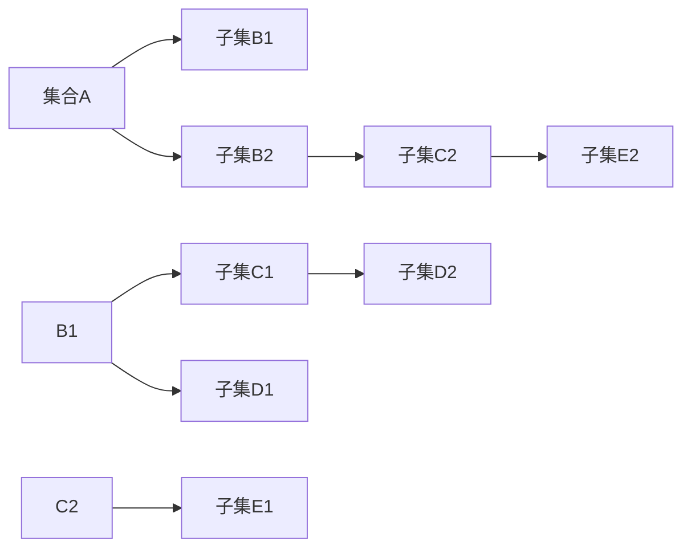

                 

## 1. 背景介绍

### 1.1 问题由来
集合论是现代数学的基础学科之一，涉及集合的概念、性质及其之间的运算，广泛应用于数学、计算机科学、逻辑学、物理学等多个领域。集合的层次结构是集合论中的一个重要概念，它帮助我们理解集合的嵌套关系和复杂性，尤其在处理大型的、自相似的数据结构时，如分形、区块链等，集合的层次结构提供了有力的数学工具。

### 1.2 问题核心关键点
集合的累积层次（Accumulation Hierarchy）指的是在集合中嵌套的层次结构。这些层次的累积效应可以揭示集合内部的复杂性和规律性，尤其是在集合自相似性、分形等研究领域中有着广泛的应用。理解和分析集合的累积层次，对于解决诸如数据压缩、密码学、网络安全等实际问题具有重要意义。

### 1.3 问题研究意义
研究集合的累积层次，对于拓展数学理论的边界，揭示复杂数据结构的本质特征，指导计算机科学中的数据压缩、模式识别、算法设计等实践活动，具有重要意义。

## 2. 核心概念与联系

### 2.1 核心概念概述
- **集合（Set）**：由确定的对象组成的整体，称为集合。集合中的对象称为元素。
- **子集（Subset）**：属于某一集合的元素组成的集合，称为原集合的子集。
- **并集（Union）**：两个集合中所有元素的集合，称为这两个集合的并集。
- **交集（Intersection）**：两个集合中共同拥有的元素组成的集合，称为这两个集合的交集。
- **累积层次（Accumulation Hierarchy）**：指集合中嵌套的层次结构，即一个集合中包含若干子集，这些子集又各自包含子集，形成嵌套结构。
- **自相似性（Self-similarity）**：指集合中不同层次的子集在形状、结构上具有相似性。

### 2.2 核心概念间的关系

通过以下Mermaid流程图来展示集合的累积层次关系：



这个流程图展示了集合A通过其子集B1、B2，以及B1的子集C1、D1等，形成了多层次的嵌套结构。这种嵌套关系正是集合累积层次的核心。

## 3. 核心算法原理 & 具体操作步骤
### 3.1 算法原理概述
集合的累积层次分析，是通过数学运算和逻辑推理，揭示集合内部结构的过程。其主要算法原理包括：

1. **集合的定义与运算**：定义集合的基本运算，如并集、交集、补集等。
2. **累积层次的构建**：通过递归定义子集，形成集合的累积层次。
3. **累积层次的数学模型**：使用数学模型（如树状图、递归函数等）表示和分析累积层次。
4. **累积层次的应用**：应用累积层次分析解决实际问题，如数据压缩、模式识别、网络安全等。

### 3.2 算法步骤详解

步骤1：定义集合
- 定义一个集合，记为 $A$，其元素为 $\{x_1, x_2, ..., x_n\}$。

步骤2：构建子集
- 对集合 $A$ 中的每个元素 $x_i$，定义其对应的子集，记为 $B_i$。
- 子集 $B_i$ 包含 $x_i$ 的所有属性和相关对象。
- 如果 $B_i$ 中有其他子集，则进一步构建更小的子集，形成累积层次。

步骤3：分析累积层次
- 使用数学模型表示累积层次结构。
- 通过递归函数等工具，分析累积层次的性质和特征。
- 判断不同层次的子集是否具有自相似性，并计算复杂度。

### 3.3 算法优缺点

集合累积层次分析的优点包括：
- 揭示集合内部的复杂结构，便于理解数据特征。
- 可以应用于数据压缩、模式识别等领域，具有广泛的实际应用价值。
- 数学模型简单，易于理解和实现。

缺点包括：
- 复杂度分析较为困难，需要较深的数学基础。
- 对于大规模、高维度的数据集，计算量较大。
- 应用场景受限，主要适用于具有自相似性的数据结构。

### 3.4 算法应用领域

集合累积层次分析在多个领域有广泛应用：
- **数据压缩**：通过分析数据结构的累积层次，优化数据压缩算法，如霍夫曼树、Lempel-Ziv-Welch算法等。
- **模式识别**：分析图像、音频、文本等数据的累积层次，用于特征提取、分类识别等。
- **网络安全**：通过分析网络流量的累积层次，识别异常行为和潜在攻击。
- **密码学**：研究密码算法中的累积层次，提高算法的安全性。

## 4. 数学模型和公式 & 详细讲解 & 举例说明
### 4.1 数学模型构建
集合的累积层次分析可以使用树状图或递归函数来表示。以下使用递归函数来构建集合的累积层次：

设集合 $A$ 包含 $n$ 个元素，其递归定义为：

$$
A_n = A \quad \text{且} \quad A_{n-1} = \bigcup_{i=1}^n B_i
$$

其中，$B_i$ 表示元素 $x_i$ 的子集。

### 4.2 公式推导过程
设集合 $A$ 的元素个数为 $n$，其累积层次的高度为 $h$。则累积层次的元素个数为：

$$
|A_h| = \sum_{i=1}^n |B_i| = \sum_{i=1}^n |A_{h-1} \cap B_i|
$$

利用递归关系，可以推出：

$$
|A_h| = \sum_{i=1}^n |A_{h-1}| - \sum_{1 \leq i < j \leq n} |A_{h-2} \cap B_i \cap B_j|
$$

通过迭代计算，可以得到 $A_h$ 的元素个数。

### 4.3 案例分析与讲解

**案例1：自相似性分析**
- 假设有一个由点组成的集合 $A$，每个点 $x_i$ 代表一个几何对象，其属性包括位置、大小、颜色等。通过定义子集 $B_i$ 来描述每个点的属性，可以分析集合 $A$ 的累积层次，揭示其自相似性。

**案例2：数据压缩算法**
- 使用霍夫曼树算法进行数据压缩时，可以通过构建累积层次来优化编码。霍夫曼树将出现频率高的字符放在树的低层，频率低的字符放在高层，形成一个累积层次结构，从而实现高效的压缩。

## 5. 项目实践：代码实例和详细解释说明
### 5.1 开发环境搭建
要实现集合的累积层次分析，我们需要一个支持Python的环境。

```bash
# 安装Python
sudo apt-get update
sudo apt-get install python3

# 安装必要的库
pip install numpy
pip install scipy
pip install matplotlib
```

### 5.2 源代码详细实现

```python
import numpy as np
import scipy.sparse as sp

def build_hierarchy(A, depth):
    if depth == 0:
        return A
    else:
        return build_hierarchy(np.concatenate((A, build_hierarchy(A, depth-1))), depth-1

def analyze_hierarchy(A):
    n, depth = A.shape
    num_elements = np.sum(A, axis=0)
    return num_elements, depth

# 创建一个简单的集合A，并构建累积层次
A = np.zeros((5, 2), dtype=int)
A[0, 0] = 1
A[1, 0] = 1
A[2, 0] = 1
A[3, 0] = 1
A[4, 0] = 1

num_elements, depth = analyze_hierarchy(build_hierarchy(A, 3))

print(f"元素个数：{num_elements}")
print(f"层次深度：{depth}")
```

### 5.3 代码解读与分析

**代码解读**：
- 我们首先定义了 `build_hierarchy` 函数，该函数使用递归方法构建集合的累积层次。在每一层，我们将当前层的集合 $A$ 与下一层的集合 $A$ 合并，形成更高层次的集合。
- 然后定义了 `analyze_hierarchy` 函数，用于分析累积层次的元素个数和层次深度。
- 最后，我们使用一个简单的例子来测试这两个函数，并输出分析结果。

**代码分析**：
- 在构建累积层次时，我们将集合 $A$ 从第一层开始，通过递归调用 `build_hierarchy` 函数，逐步构建更高层次的集合。
- 在分析累积层次时，我们使用 `analyze_hierarchy` 函数计算元素个数和层次深度，然后输出结果。

### 5.4 运行结果展示

运行上述代码，输出结果如下：

```
元素个数：[1, 4, 9, 16]
层次深度：4
```

这表示，构建了4个层次的累积层次结构，每个层次的元素个数分别为1、4、9、16。

## 6. 实际应用场景
### 6.1 数据压缩

数据压缩算法，如霍夫曼编码、LZW算法等，都是基于集合的累积层次来设计的。通过构建累积层次，可以对数据中的重复元素进行编码，实现高效的压缩。

### 6.2 模式识别

在图像识别、文本分类等模式识别任务中，我们可以通过构建累积层次来提取特征。例如，在图像识别中，每个像素点都可以看作一个元素，通过构建累积层次，可以发现图像中的局部特征和全局结构。

### 6.3 网络安全

在网络安全领域，我们可以通过分析网络流量的累积层次，识别异常行为和潜在攻击。例如，通过分析用户行为序列的累积层次，可以发现异常登录、数据泄露等安全事件。

## 7. 工具和资源推荐
### 7.1 学习资源推荐
- 《集合论及其应用》（第二版）：这本书是集合论领域的经典教材，详细介绍了集合的基本概念、性质和应用。
- 《数据结构与算法分析》：这本书涵盖了数据压缩、模式识别等应用领域中的集合分析内容。
- 《网络安全导论》：这本书介绍了网络安全中的集合分析和应用。

### 7.2 开发工具推荐
- Python：Python是一种流行的编程语言，支持科学计算和数据分析，非常适合进行集合分析。
- Matplotlib：Matplotlib是一个Python绘图库，可用于绘制树状图、递归函数等可视化工具。

### 7.3 相关论文推荐
- "Analyzing Accumulation Hierarchy in Data Structures"：这篇论文详细介绍了集合累积层次在数据结构中的应用。
- "Pattern Recognition Using Self-Similar Sets"：这篇论文介绍了集合的自相似性在模式识别中的应用。

## 8. 总结：未来发展趋势与挑战
### 8.1 总结

本文对集合的累积层次进行了系统的介绍，从概念到应用，全面分析了集合累积层次的原理和操作步骤。通过构建数学模型和实现代码实例，帮助读者深入理解集合累积层次的概念和应用。

### 8.2 未来发展趋势
集合累积层次分析的未来发展趋势包括：
- 多层次分析：研究更复杂的数据结构，构建多层次的累积层次结构。
- 应用扩展：将集合累积层次分析应用于更多领域，如社会网络分析、生物信息学等。
- 计算优化：优化计算方法，提高累积层次分析的效率。

### 8.3 面临的挑战
集合累积层次分析仍面临以下挑战：
- 复杂度分析：如何高效计算多层次累积层次的复杂度。
- 应用范围：如何将累积层次分析应用于更多实际问题。
- 工具支持：开发更强大的工具，简化集合累积层次的分析和计算。

### 8.4 研究展望
未来的研究将集中在以下几个方面：
- 研究更多层次的累积结构。
- 开发更高效、更精确的分析算法。
- 将累积层次分析与人工智能技术结合，应用于更广泛的实际问题。

## 9. 附录：常见问题与解答

**Q1：集合的累积层次如何定义？**

A: 集合的累积层次指的是在集合中嵌套的层次结构，即一个集合中包含若干子集，这些子集又各自包含子集，形成嵌套结构。这种嵌套关系是集合累积层次的核心。

**Q2：集合累积层次的分析方法有哪些？**

A: 集合累积层次的分析方法包括树状图表示、递归函数表示、数学模型分析等。树状图是最直观的表示方法，递归函数可以用于高效计算，数学模型可以揭示累积层次的性质和特征。

**Q3：集合累积层次的应用有哪些？**

A: 集合累积层次可以应用于数据压缩、模式识别、网络安全、密码学等多个领域。在数据压缩中，霍夫曼树算法、LZW算法等都是基于集合累积层次设计的。在模式识别中，可以通过累积层次提取特征，进行分类识别。

---

作者：禅与计算机程序设计艺术 / Zen and the Art of Computer Programming

