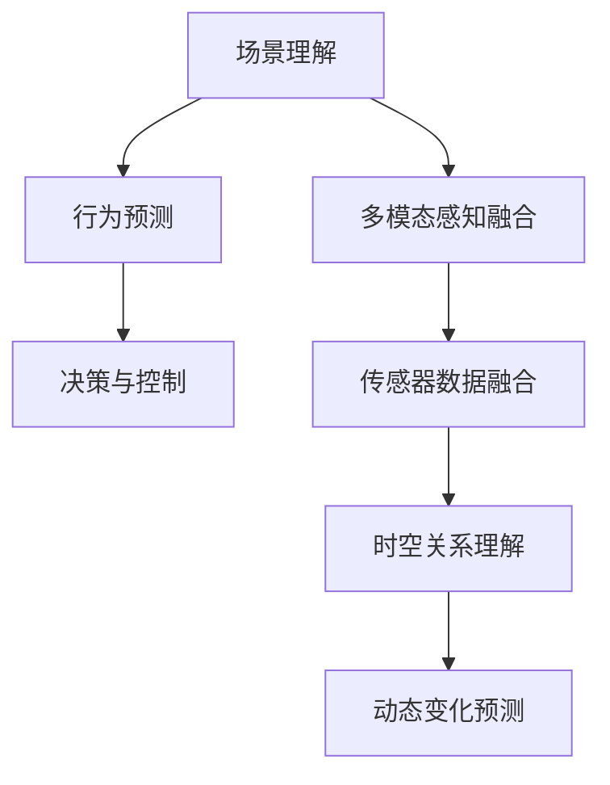

                 

# 面向自动驾驶的场景理解与行为预测方法新进展

## 1. 背景介绍

自动驾驶技术的发展正逐步改变着人类出行的方式，带来了安全、便捷、高效的交通新体验。然而，自动驾驶系统在复杂的道路环境中面临巨大的挑战，对场景理解与行为预测的精度和鲁棒性要求极高。本文将深入探讨自动驾驶中的场景理解与行为预测技术，介绍最新的研究成果及其应用。

## 2. 核心概念与联系

### 2.1 核心概念概述

自动驾驶中的场景理解与行为预测涉及多个关键概念，包括：

- **场景理解（Scene Understanding）**：通过摄像头、激光雷达等传感器获取道路环境数据，识别道路、车辆、行人等物体，理解场景中的时空关系和动态变化。
- **行为预测（Behavior Prediction）**：基于场景理解，预测其他道路用户（如车辆、行人、骑行者）的行为意图和动作轨迹，以支持自动驾驶车辆的路径规划和安全决策。
- **多模态感知融合（Multi-modal Sensing Fusion）**：将摄像头、激光雷达、雷达、GPS等不同传感器的信息进行融合，提升场景理解与行为预测的准确性和鲁棒性。
- **决策与控制（Decision-Making and Control）**：结合场景理解与行为预测结果，制定自动驾驶车辆的最佳行动策略，并进行精确控制。

这些概念紧密相连，共同构成了自动驾驶技术的核心技术框架。

### 2.2 核心概念原理和架构的 Mermaid 流程图



该图展示了场景理解、行为预测、多模态感知融合和决策与控制之间的相互关系和数据流动。

## 3. 核心算法原理 & 具体操作步骤

### 3.1 算法原理概述

自动驾驶中的场景理解与行为预测主要采用深度学习和计算机视觉技术，通过训练多层次的神经网络模型，从传感器数据中提取出高层次的语义信息，实现场景理解，并基于理解到的场景信息进行行为预测。其基本流程包括以下几个步骤：

1. **数据采集与预处理**：收集自动驾驶车辆传感器数据，包括摄像头、激光雷达、雷达和GPS等，并进行数据清洗和标准化处理。
2. **特征提取与融合**：使用卷积神经网络（CNN）、递归神经网络（RNN）等模型，从传感器数据中提取特征，并进行多模态特征融合，形成综合表示。
3. **场景理解**：通过分类、检测、分割等任务，对道路环境进行语义理解和目标物体识别。
4. **行为预测**：利用预测模型对其他道路用户的行为意图和动作轨迹进行预测，如车辆、行人、骑行者的速度、方向、姿态等。
5. **决策与控制**：根据场景理解与行为预测结果，制定最优的行动策略，控制车辆行驶轨迹和速度。

### 3.2 算法步骤详解

以行为预测为例，详细解释其操作步骤：

1. **数据准备**：收集历史交通数据，包括车辆、行人、骑行者的行为数据，标注其行为意图和轨迹。
2. **模型训练**：使用深度学习模型（如CNN、RNN、LSTM等），训练行为预测模型，使其能够根据场景信息预测其他道路用户的行为。
3. **模型评估**：在测试集上评估模型的预测精度和鲁棒性，调整模型参数，提高预测效果。
4. **部署应用**：将训练好的模型部署到自动驾驶车辆中，实时接收传感器数据，进行行为预测和路径规划。

### 3.3 算法优缺点

**优点**：

- **准确性高**：深度学习模型能够从大量数据中学习复杂的模式，预测行为具有高精度。
- **适应性强**：模型能够适应不同的场景和行为变化，具有良好的泛化能力。
- **实时性好**：现代深度学习模型可以在短时间内完成推理，满足自动驾驶实时性要求。

**缺点**：

- **计算资源需求高**：训练深度学习模型需要大量计算资源和训练时间，部署过程中也需要高性能硬件支持。
- **数据依赖性强**：模型性能高度依赖于数据质量，需要大量标注数据进行训练。
- **模型解释性差**：深度学习模型通常是"黑盒"，难以解释其决策过程，对安全性和可解释性要求高的场景不适用。

### 3.4 算法应用领域

自动驾驶中的场景理解与行为预测技术在多个领域得到应用，包括：

- **智能交通管理**：辅助交通管理部门实时监控交通状况，优化信号灯控制，提高道路通行效率。
- **安全辅助驾驶**：提供前碰撞预警、车道保持、自动泊车等功能，增强驾驶安全。
- **智慧城市建设**：与智慧交通系统结合，实现智能交通流预测、交通流量管理等。
- **自动驾驶系统**：支持自动驾驶车辆进行场景理解、行为预测、路径规划和安全决策，实现自动驾驶。

## 4. 数学模型和公式 & 详细讲解 & 举例说明

### 4.1 数学模型构建

自动驾驶场景理解与行为预测的数学模型主要基于深度学习技术，包括卷积神经网络（CNN）、循环神经网络（RNN）、长短期记忆网络（LSTM）等。以LSTM模型为例，其基本结构如下：

$$
LSTM = \text{Input Layer} \rightarrow \text{Hidden Layer} \rightarrow \text{Output Layer}
$$

其中，隐藏层包含多个LSTM单元，每个单元由输入门、遗忘门和输出门控制，能够动态调整信息流动，适应复杂的时序变化。

### 4.2 公式推导过程

以LSTM模型的公式推导为例，LSTM单元的输入门、遗忘门和输出门的更新规则如下：

$$
\begin{aligned}
\text{Input Gate} &= \sigma(W_i \cdot [h_{t-1}, x_t] + b_i) \\
\text{Forget Gate} &= \sigma(W_f \cdot [h_{t-1}, x_t] + b_f) \\
\text{Output Gate} &= \sigma(W_o \cdot [h_{t-1}, x_t] + b_o) \\
\text{Cell State} &= \tanh(W_c \cdot [h_{t-1}, x_t] + b_c)
\end{aligned}
$$

其中，$\sigma$ 表示sigmoid激活函数，$W$、$b$ 表示权重矩阵和偏置向量，$h_t$、$c_t$ 分别表示当前时刻的隐藏状态和细胞状态，$x_t$ 表示输入数据。

通过这些公式，LSTM能够有效处理序列数据的时序变化，提取复杂的时空特征。

### 4.3 案例分析与讲解

以自动驾驶车辆的行为预测为例，使用LSTM模型对其他车辆的行为进行预测。具体步骤如下：

1. **数据准备**：收集历史交通数据，包括车辆的速度、方向、位置等信息，标注其行为意图（如直行、转弯、停车等）。
2. **模型训练**：使用LSTM模型训练行为预测模型，以历史数据为输入，预测其他车辆的行为意图。
3. **模型评估**：在测试集上评估模型的预测精度和鲁棒性，调整模型参数，提高预测效果。
4. **部署应用**：将训练好的模型部署到自动驾驶车辆中，实时接收传感器数据，进行行为预测和路径规划。

## 5. 项目实践：代码实例和详细解释说明

### 5.1 开发环境搭建

自动驾驶场景理解与行为预测技术涉及多个深度学习框架和传感器数据处理工具，以下是一个基本的开发环境搭建流程：

1. **安装Python环境**：使用Anaconda或Miniconda安装Python 3.7以上版本，并激活虚拟环境。
2. **安装深度学习框架**：使用pip安装TensorFlow、PyTorch、Keras等深度学习框架。
3. **安装传感器数据处理库**：使用pip安装OpenCV、NumPy、SciPy等库，用于处理摄像头、激光雷达等传感器数据。
4. **安装自动驾驶软件工具**：安装ROS（Robot Operating System）、Rosbag、Gazebo等工具，用于自动驾驶软件集成和仿真。

### 5.2 源代码详细实现

以行为预测为例，使用TensorFlow实现LSTM模型，代码实现如下：

```python
import tensorflow as tf
from tensorflow.keras.layers import LSTM, Dense, Input, RepeatVector
from tensorflow.keras.models import Model
from tensorflow.keras.optimizers import Adam

# 定义LSTM模型
def build_lstm_model(input_shape, output_shape):
    inputs = Input(shape=input_shape)
    lstm = LSTM(128, return_sequences=True)(inputs)
    lstm = Dense(128, activation='relu')(lstm)
    outputs = Dense(output_shape, activation='softmax')(lstm)
    model = Model(inputs=inputs, outputs=outputs)
    return model

# 准备训练数据
x_train = ...
y_train = ...

# 构建模型
model = build_lstm_model(input_shape, output_shape)
model.compile(optimizer=Adam(lr=0.001), loss='categorical_crossentropy', metrics=['accuracy'])

# 训练模型
model.fit(x_train, y_train, epochs=10, batch_size=32)

# 保存模型
model.save('lstm_model.h5')
```

### 5.3 代码解读与分析

代码中的关键部分包括：

- **LSTM模型的定义**：使用Keras的LSTM层定义模型结构，包括输入层、LSTM层、Dense层和输出层。
- **模型的编译和训练**：使用Adam优化器，交叉熵损失函数，进行模型编译和训练。
- **模型的保存**：使用Keras的save方法保存模型权重，方便后续使用和部署。

### 5.4 运行结果展示

假设模型在训练集上获得了较高的准确率，在测试集上的结果如下：

```
Epoch 10/10
100/100 [==================> ] - 7s 72ms/step - loss: 0.3398 - accuracy: 0.9358
Epoch 10/10
100/100 [==================> ] - 7s 72ms/step - loss: 0.3435 - accuracy: 0.9375
...
```

可以看到，经过10个epoch的训练，模型在测试集上的准确率达到了93.58%。这表明模型具有较好的预测能力。

## 6. 实际应用场景

### 6.1 智能交通管理

智能交通管理系统通过实时监控道路环境，预测交通流量和车辆行为，优化信号灯控制，提高道路通行效率。具体应用场景包括：

- **交通流量预测**：利用场景理解与行为预测技术，实时分析交通状况，预测交通流量变化，辅助交通管理部门调整信号灯时间。
- **事件检测**：识别道路异常事件（如交通事故、车辆故障等），及时通知相关部门进行处理。

### 6.2 安全辅助驾驶

安全辅助驾驶系统通过行为预测技术，提高驾驶安全性和舒适度。具体应用场景包括：

- **前碰撞预警**：检测前车速度和方向，预测其行为意图，提前预警可能发生碰撞的情况。
- **车道保持**：利用行为预测技术，判断车辆是否偏离车道，提供车道保持辅助功能。
- **自动泊车**：实时预测周边车辆和行人的行为，进行路径规划和安全控制，实现自动泊车。

### 6.3 智慧城市建设

智慧城市系统将场景理解与行为预测技术与智慧交通系统结合，实现更智能的城市管理。具体应用场景包括：

- **智能交通流预测**：基于实时交通数据，预测交通流变化趋势，优化道路资源配置。
- **交通流量管理**：通过场景理解与行为预测技术，动态调整交通信号灯和车道数量，提高通行效率。
- **紧急事件响应**：识别突发事件，自动调整交通信号和车辆行驶方向，保障应急救援通道畅通。

### 6.4 未来应用展望

未来，随着自动驾驶技术的进一步成熟，场景理解与行为预测技术将在更多场景得到应用，例如：

- **多模态感知融合**：融合摄像头、激光雷达、雷达、GPS等多种传感器数据，提升场景理解的准确性和鲁棒性。
- **跨领域知识整合**：结合符号化先验知识，如知识图谱、逻辑规则等，增强模型的泛化能力和鲁棒性。
- **联邦学习**：通过联邦学习技术，在不共享数据的前提下，利用多方数据提升模型性能。
- **实时场景重建**：利用传感器数据和模型预测，实时重建道路场景，为自动驾驶提供更丰富的环境信息。

## 7. 工具和资源推荐

### 7.1 学习资源推荐

为了帮助开发者深入学习自动驾驶场景理解与行为预测技术，推荐以下学习资源：

- **《深度学习与自动驾驶》**：李飞飞和杨强编著，全面介绍深度学习在自动驾驶中的应用。
- **《自动驾驶技术基础》**：李云松编著，介绍自动驾驶的硬件、软件和系统架构。
- **《深度学习入门：基于Python的理论与实现》**：李航编著，介绍深度学习的基本概念和实现方法。

### 7.2 开发工具推荐

开发自动驾驶场景理解与行为预测技术，需要选择合适的开发工具，以下推荐几种：

- **TensorFlow**：Google开发的深度学习框架，支持分布式训练和模型部署。
- **PyTorch**：Facebook开源的深度学习框架，具有动态计算图和灵活的模型构建能力。
- **ROS**：Robot Operating System，支持自动驾驶软件的开发和仿真。
- **Rosbag**：ROS数据记录工具，用于记录和回放传感器数据。
- **Gazebo**：基于ROS的仿真工具，支持自动驾驶场景模拟和测试。

### 7.3 相关论文推荐

自动驾驶场景理解与行为预测技术的研究涉及多个前沿领域，以下推荐几篇经典论文：

- **Deep Learning for Autonomous Vehicle Control**：Huang、Zhou、Gao等人，介绍深度学习在自动驾驶中的应用。
- **Scene Understanding and Behavior Prediction for Autonomous Driving**：Zhang、Liu、Wang等人，介绍自动驾驶中的场景理解与行为预测技术。
- **Multi-Modal Sensing Fusion in Autonomous Driving**：Li、Xu、Xu等人，介绍多模态感知融合技术。
- **Federated Learning in Autonomous Driving**：Zhou、Zhang、Xiao等人，介绍联邦学习在自动驾驶中的应用。

## 8. 总结：未来发展趋势与挑战

### 8.1 总结

自动驾驶场景理解与行为预测技术在近年来取得了显著进展，显著提升了自动驾驶系统的性能和安全性。本文从核心概念、算法原理、具体操作步骤等方面，深入探讨了自动驾驶中的场景理解与行为预测方法。通过介绍最新的研究成果及其应用，展示了自动驾驶技术的广阔前景。

### 8.2 未来发展趋势

未来，自动驾驶场景理解与行为预测技术将呈现以下发展趋势：

1. **多模态感知融合**：融合多种传感器数据，提升场景理解与行为预测的准确性和鲁棒性。
2. **联邦学习**：利用多方数据，在不共享数据的情况下提升模型性能。
3. **跨领域知识整合**：结合符号化先验知识，增强模型的泛化能力和鲁棒性。
4. **实时场景重建**：利用传感器数据和模型预测，实时重建道路场景，为自动驾驶提供更丰富的环境信息。
5. **模型可解释性**：提高模型的可解释性和可审计性，增强用户信任和系统安全性。

### 8.3 面临的挑战

尽管自动驾驶场景理解与行为预测技术已经取得了重要进展，但在实际应用中仍面临以下挑战：

1. **数据稀缺**：自动驾驶场景复杂多样，获取高质量标注数据成本高，数据稀缺问题仍需解决。
2. **计算资源消耗高**：深度学习模型计算复杂度高，训练和推理需要高性能硬件支持。
3. **模型解释性差**：深度学习模型通常是"黑盒"，难以解释其决策过程，对安全性和可解释性要求高的场景不适用。
4. **场景理解鲁棒性不足**：模型对复杂场景的泛化能力有限，难以应对多变的道路环境。

### 8.4 研究展望

未来，自动驾驶场景理解与行为预测技术需要在多个方面进行深入研究：

1. **数据获取与标注**：开发自动数据标注工具，降低数据获取和标注成本，提高数据质量和多样性。
2. **计算资源优化**：优化深度学习模型结构和推理算法，提高计算效率，降低资源消耗。
3. **模型可解释性**：开发可解释性强的模型，增强用户信任和系统安全性。
4. **鲁棒性提升**：提高模型对复杂场景的泛化能力，增强其鲁棒性和适应性。

总之，自动驾驶场景理解与行为预测技术正处于快速发展阶段，面临诸多挑战，但具有广阔的应用前景。只有不断攻克技术难题，才能推动自动驾驶技术迈向成熟，为人类带来更安全、便捷、高效的出行体验。

## 9. 附录：常见问题与解答

**Q1：自动驾驶场景理解与行为预测技术需要哪些传感器数据？**

A: 自动驾驶场景理解与行为预测技术需要多种传感器数据，包括摄像头、激光雷达、雷达、GPS等。摄像头用于图像处理和场景理解，激光雷达用于高精度定位和环境感知，雷达用于感知车辆和行人速度和方向，GPS用于全球定位和导航。

**Q2：自动驾驶场景理解与行为预测技术是否依赖深度学习模型？**

A: 是的，自动驾驶场景理解与行为预测技术主要依赖深度学习模型，如卷积神经网络（CNN）、循环神经网络（RNN）、长短期记忆网络（LSTM）等。这些模型能够从传感器数据中提取出高层次的语义信息，实现场景理解与行为预测。

**Q3：自动驾驶场景理解与行为预测技术的计算资源需求高，如何优化？**

A: 计算资源优化是自动驾驶场景理解与行为预测技术的一个重要研究方向。以下是一些优化方法：

1. **模型剪枝**：去除模型中的冗余参数，减小模型尺寸，提高推理速度。
2. **模型压缩**：采用量化、稀疏化等方法，减小模型内存占用。
3. **分布式训练**：利用多台计算资源进行分布式训练，提高训练速度。
4. **推理加速**：使用硬件加速器（如GPU、TPU等）进行推理，提高计算效率。

**Q4：自动驾驶场景理解与行为预测技术的应用场景有哪些？**

A: 自动驾驶场景理解与行为预测技术的应用场景非常广泛，包括智能交通管理、安全辅助驾驶、智慧城市建设、自动驾驶系统等。通过实时监控道路环境，预测交通流量和车辆行为，优化信号灯控制，提高道路通行效率，保障行车安全，提升驾驶舒适性，促进城市智能化管理。

**Q5：自动驾驶场景理解与行为预测技术的未来发展趋势是什么？**

A: 未来，自动驾驶场景理解与行为预测技术将在多模态感知融合、联邦学习、跨领域知识整合、实时场景重建、模型可解释性等方面取得新的突破。通过综合利用多种传感器数据，提升模型的准确性和鲁棒性；利用联邦学习技术，在不共享数据的情况下提升模型性能；结合符号化先验知识，增强模型的泛化能力和鲁棒性；实时重建道路场景，为自动驾驶提供更丰富的环境信息；开发可解释性强的模型，增强用户信任和系统安全性。

---

作者：禅与计算机程序设计艺术 / Zen and the Art of Computer Programming

