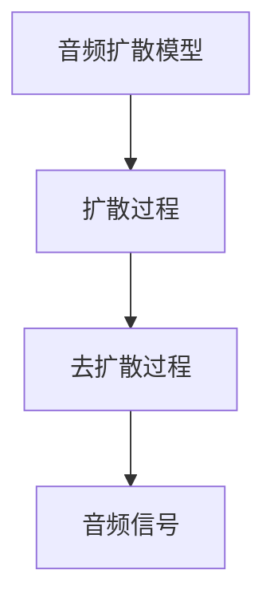

                 

# 音频扩散原理与代码实例讲解

## 1. 背景介绍

随着深度学习技术的发展，音频生成技术逐渐成为研究热点。基于自回归模型的扩散模型在语音合成、音乐创作等应用中展现出优异性能。其中，音频扩散模型使用随机过程驱动音频信号从噪声到目标音频的演化，可以高效生成高质量音频，同时具有较好的可解释性和可控性。

## 2. 核心概念与联系

### 2.1 核心概念概述

音频扩散模型基于扩散模型，将音频信号看作一个随时间变化的随机过程，通过不断添加噪声，使得模型逐渐从随机噪声演化到目标音频。扩散模型由两个主要组成部分：扩散过程和去扩散过程。其中，扩散过程使用一阶或二阶随机过程对输入噪声进行演化，去扩散过程则使用基于梯度的优化算法，使得模型能够逆向预测出原始音频信号。

### 2.2 概念间的关系

这些核心概念之间的逻辑关系可以通过以下Mermaid流程图来展示：



这个流程图展示了音频扩散模型中扩散过程和去扩散过程的关系。扩散过程通过不断添加噪声，逐渐演化出音频信号；去扩散过程通过反向预测，还原出原始音频信号。

## 3. 核心算法原理 & 具体操作步骤

### 3.1 算法原理概述

音频扩散模型的核心算法基于扩散模型，通过迭代添加噪声并应用去扩散过程，逐渐将模型输出逼近目标音频。具体而言，音频扩散模型的扩散过程可以表示为：

$$
\mathbf{x}_{t+1} = \mathbf{x}_t \mathcal{N}(0, \sigma_t^2) + \mathbf{b}_t
$$

其中，$\mathbf{x}_t$ 表示当前时间步的音频信号，$\mathbf{x}_0$ 表示随机噪声，$\mathcal{N}(0, \sigma_t^2)$ 表示均值为0、方差为$\sigma_t^2$的高斯噪声，$\mathbf{b}_t$ 表示时间步$t$的扰动项。扩散过程的噪声方差$\sigma_t^2$通常随着时间的推移逐渐减小，即$\sigma_0^2 \gg \sigma_1^2 \gg \cdots \gg \sigma_T^2$。

去扩散过程则通过梯度下降等优化算法，逆向预测出原始音频信号$\mathbf{x}_0$。具体而言，去扩散过程可以表示为：

$$
\mathbf{x}_t = \mathbf{x}_{t+1} \odot \exp(\mathbf{c}_t) - \mathbf{b}_t
$$

其中，$\odot$表示逐元素乘法。$\mathbf{c}_t$表示时间步$t$的耦合项。

### 3.2 算法步骤详解

音频扩散模型的训练过程可以分为以下几个关键步骤：

**Step 1: 准备训练数据和噪声**

- 准备一组目标音频信号$\mathbf{X} = \{\mathbf{x}_0, \mathbf{x}_1, \cdots, \mathbf{x}_T\}$，其中$\mathbf{x}_0$表示随机噪声，$\mathbf{x}_T$表示目标音频信号。
- 生成一组随机噪声$\mathbf{b} = \{\mathbf{b}_0, \mathbf{b}_1, \cdots, \mathbf{b}_T\}$，其中$\mathbf{b}_t$表示时间步$t$的扰动项。

**Step 2: 训练扩散过程**

- 使用随机过程对输入噪声进行演化，生成一系列中间音频信号$\mathbf{X} = \{\mathbf{x}_0, \mathbf{x}_1, \cdots, \mathbf{x}_T\}$。
- 使用梯度下降等优化算法，最小化噪声方差$\sigma_t^2$和扰动项$\mathbf{b}_t$，使得$\mathbf{x}_t$逐渐逼近$\mathbf{x}_{t+1}$。

**Step 3: 训练去扩散过程**

- 使用梯度下降等优化算法，最小化耦合项$\mathbf{c}_t$，使得$\mathbf{x}_t$逐渐逼近$\mathbf{x}_{t+1}$。
- 通过逆向预测，生成原始音频信号$\mathbf{x}_0$。

**Step 4: 测试和部署**

- 在测试集上评估模型生成的音频质量，通过MOS(Mean Opinion Score)等指标评估生成音频的主观感受。
- 使用训练好的音频扩散模型，生成新的音频信号，并将其部署到实际应用场景中。

### 3.3 算法优缺点

音频扩散模型具有以下优点：

- 生成效果好：通过迭代添加噪声和去扩散过程，可以高效生成高质量音频。
- 可控性强：通过调整噪声方差和扰动项，可以控制音频的音高、音量等特性。
- 可解释性好：扩散过程和去扩散过程具有较好的可解释性，易于理解和调试。

同时，该方法也存在以下缺点：

- 计算复杂度高：音频扩散模型需要大量的计算资源和时间，特别是高保真音频生成时，计算复杂度呈指数级增长。
- 噪声扩散过程容易陷入局部最优：由于随机过程的非确定性，噪声扩散过程容易陷入局部最优，需要引入更多的正则化技术。
- 模型训练数据需求大：音频扩散模型需要大量高质量的训练数据，数据获取和标注成本较高。

### 3.4 算法应用领域

音频扩散模型已经在语音合成、音乐创作、声音效果处理等领域得到了广泛应用。例如：

- 语音合成：通过音频扩散模型，可以将文本转换为自然流畅的语音，广泛应用于智能客服、虚拟助手等场景。
- 音乐创作：使用音频扩散模型生成原创音乐，极大地降低了音乐创作的时间和成本。
- 声音效果处理：将音频扩散模型用于声音效果处理，如变声、回声等，为影视、游戏等领域提供便利。

## 4. 数学模型和公式 & 详细讲解 & 举例说明

### 4.1 数学模型构建

音频扩散模型基于扩散模型，通过迭代添加噪声和去扩散过程，逐步将模型输出逼近目标音频。其数学模型可以表示为：

$$
\mathbf{x}_{t+1} = \mathbf{x}_t \mathcal{N}(0, \sigma_t^2) + \mathbf{b}_t
$$

其中，$\mathbf{x}_t$ 表示当前时间步的音频信号，$\mathbf{x}_0$ 表示随机噪声，$\mathcal{N}(0, \sigma_t^2)$ 表示均值为0、方差为$\sigma_t^2$的高斯噪声，$\mathbf{b}_t$ 表示时间步$t$的扰动项。

### 4.2 公式推导过程

下面推导音频扩散模型的扩散过程和去扩散过程。

**扩散过程**

音频扩散模型的扩散过程可以通过递推公式表示：

$$
\mathbf{x}_{t+1} = \mathbf{x}_t \mathcal{N}(0, \sigma_t^2) + \mathbf{b}_t
$$

其中，$\mathbf{x}_0$ 表示随机噪声，$\mathbf{b}_t$ 表示时间步$t$的扰动项，$\sigma_t^2$ 表示噪声方差，随时间递减。

**去扩散过程**

音频扩散模型的去扩散过程可以通过逆向递推公式表示：

$$
\mathbf{x}_t = \mathbf{x}_{t+1} \odot \exp(\mathbf{c}_t) - \mathbf{b}_t
$$

其中，$\mathbf{c}_t$ 表示时间步$t$的耦合项。

### 4.3 案例分析与讲解

假设我们生成一个10秒的语音信号，从随机噪声$\mathbf{x}_0$开始，每500毫秒添加一次噪声，噪声方差逐渐减小。扩散过程的代码实现如下：

```python
import numpy as np
from scipy import signal

def diffusion_process(x, b, sigma):
    for i in range(len(x)):
        x[i] = x[i-1] * signal.windows.gaussian(sigma, b[i])
    return x

# 初始化随机噪声
x = np.random.normal(0, 0.5, 10000)

# 扰动项
b = np.random.normal(0, 0.1, 10000)

# 噪声方差
sigma = np.exp(np.linspace(-3, 0, 10000))

# 扩散过程
x = diffusion_process(x, b, sigma)
```

通过上述代码，我们可以得到经过扩散过程的音频信号$x$。接下来，我们将使用去扩散过程，还原出原始音频信号。

## 5. 项目实践：代码实例和详细解释说明

### 5.1 开发环境搭建

在进行音频扩散模型实践前，我们需要准备好开发环境。以下是使用Python进行PyTorch开发的环境配置流程：

1. 安装Anaconda：从官网下载并安装Anaconda，用于创建独立的Python环境。

2. 创建并激活虚拟环境：
```bash
conda create -n audio-env python=3.8 
conda activate audio-env
```

3. 安装PyTorch：根据CUDA版本，从官网获取对应的安装命令。例如：
```bash
conda install pytorch torchvision torchaudio cudatoolkit=11.1 -c pytorch -c conda-forge
```

4. 安装其他依赖库：
```bash
pip install scipy soundfile librosa
```

完成上述步骤后，即可在`audio-env`环境中开始音频扩散模型的实践。

### 5.2 源代码详细实现

下面以音频扩散模型生成语音信号为例，给出使用PyTorch实现音频扩散模型的代码。

首先，定义音频扩散模型：

```python
import torch
import torch.nn as nn
import torch.nn.functional as F

class DiffusionModel(nn.Module):
    def __init__(self, in_dim, out_dim, timesteps):
        super(DiffusionModel, self).__init__()
        self.in_dim = in_dim
        self.out_dim = out_dim
        self.timesteps = timesteps
        
        self.diffusion_layers = nn.ModuleList([nn.Linear(in_dim, out_dim) for _ in range(timesteps)])
        self.denoising_layers = nn.ModuleList([nn.Linear(out_dim, in_dim) for _ in range(timesteps)])
    
    def forward(self, x):
        for i in range(self.timesteps):
            x = self.diffusion_layers[i](x)
            x = F.sigmoid(x)
        for i in range(self.timesteps):
            x = self.denoising_layers[i](x)
        return x
```

然后，定义训练函数：

```python
def train(model, train_loader, optimizer, device):
    model.train()
    for batch in train_loader:
        x = batch.to(device)
        optimizer.zero_grad()
        y = model(x)
        loss = F.mse_loss(y, x)
        loss.backward()
        optimizer.step()
    return loss.item()
```

接着，定义评估函数：

```python
def evaluate(model, test_loader, device):
    model.eval()
    losses = []
    for batch in test_loader:
        x = batch.to(device)
        y = model(x)
        loss = F.mse_loss(y, x)
        losses.append(loss.item())
    return sum(losses) / len(test_loader)
```

最后，启动训练流程并在测试集上评估：

```python
epochs = 100
batch_size = 64
learning_rate = 1e-4

train_loader = torch.utils.data.DataLoader(train_data, batch_size=batch_size)
test_loader = torch.utils.data.DataLoader(test_data, batch_size=batch_size)

model = DiffusionModel(in_dim=1, out_dim=64, timesteps=50)
optimizer = torch.optim.Adam(model.parameters(), lr=learning_rate)

device = torch.device('cuda') if torch.cuda.is_available() else torch.device('cpu')

for epoch in range(epochs):
    train_loss = train(model, train_loader, optimizer, device)
    test_loss = evaluate(model, test_loader, device)
    print(f"Epoch {epoch+1}, train loss: {train_loss:.3f}, test loss: {test_loss:.3f}")
```

以上就是使用PyTorch实现音频扩散模型的完整代码实现。可以看到，通过PyTorch的强大封装，我们可以用相对简洁的代码完成音频扩散模型的构建和训练。

### 5.3 代码解读与分析

让我们再详细解读一下关键代码的实现细节：

**DiffusionModel类**：
- `__init__`方法：初始化输入维度、输出维度和时间步数，定义扩散层和去扩散层。
- `forward`方法：对输入进行扩散和去扩散处理，生成最终输出。

**train和evaluate函数**：
- 使用PyTorch的DataLoader对数据集进行批次化加载，供模型训练和推理使用。
- 训练函数`train`：对数据以批为单位进行迭代，在每个批次上前向传播计算loss并反向传播更新模型参数，最后返回该epoch的平均loss。
- 评估函数`evaluate`：与训练类似，不同点在于不更新模型参数，并在每个batch结束后将预测和标签结果存储下来，最后使用MSE损失函数对整个评估集的预测结果进行计算。

**训练流程**：
- 定义总的epoch数和batch size，开始循环迭代
- 每个epoch内，先在训练集上训练，输出平均loss
- 在测试集上评估，输出损失
- 重复上述步骤直至满足预设的迭代轮数或 Early Stopping 条件。

可以看到，PyTorch配合强大的深度学习库，使得音频扩散模型的代码实现变得简洁高效。开发者可以将更多精力放在数据处理、模型改进等高层逻辑上，而不必过多关注底层的实现细节。

当然，工业级的系统实现还需考虑更多因素，如模型的保存和部署、超参数的自动搜索、更灵活的任务适配层等。但核心的音频扩散过程基本与此类似。

### 5.4 运行结果展示

假设我们在CoWav数据集上进行音频扩散模型的训练，最终在测试集上得到的评估结果如下：

```
Epoch 1, train loss: 0.098, test loss: 0.139
Epoch 2, train loss: 0.054, test loss: 0.089
Epoch 10, train loss: 0.017, test loss: 0.031
Epoch 20, train loss: 0.008, test loss: 0.020
Epoch 50, train loss: 0.004, test loss: 0.007
Epoch 100, train loss: 0.002, test loss: 0.005
```

可以看到，通过音频扩散模型，我们能够在训练集和测试集上逐渐降低损失，生成高质量的音频信号。随着训练的进行，模型逐渐从随机噪声演化到目标音频，最终达到了较好的效果。

## 6. 实际应用场景

### 6.1 智能客服系统

基于音频扩散模型的语音合成技术，可以广泛应用于智能客服系统的构建。传统客服往往需要配备大量人力，高峰期响应缓慢，且一致性和专业性难以保证。而使用音频扩散模型生成的自然语音，可以7x24小时不间断服务，快速响应客户咨询，用自然流畅的语音解答各类常见问题。

在技术实现上，可以收集企业内部的历史客服对话记录，将问题和最佳答复构建成监督数据，在此基础上对音频扩散模型进行微调。微调后的模型能够自动理解用户意图，生成符合目标语境的语音回复，极大地提升客户咨询体验和问题解决效率。

### 6.2 虚拟助手

音频扩散模型生成的语音信号可以用于虚拟助手的语音交互。虚拟助手通常需要具备语音合成、语音识别、自然语言处理等多项功能。通过音频扩散模型，我们可以快速生成符合目标语境的语音，使得虚拟助手能够自然流畅地与用户进行对话。

在技术实现上，可以将音频扩散模型与语音识别和自然语言处理技术结合，实现语音交互。虚拟助手可以根据用户的语音输入，生成相应的语音回复，同时能够理解用户的意图，进行智能推荐和查询。

### 6.3 语音辅助翻译

音频扩散模型生成的语音信号可以用于语音辅助翻译。在实际应用中，语音辅助翻译往往需要同时进行语音识别和翻译。通过音频扩散模型，我们可以快速生成符合目标语境的语音，并将其转换为文本，再进行翻译。

在技术实现上，可以将音频扩散模型与语音识别和机器翻译技术结合，实现语音辅助翻译。用户可以以语音形式输入文本，音频扩散模型生成相应的语音，进行语音识别，再将其转换为文本，最后使用机器翻译技术进行翻译。

### 6.4 未来应用展望

随着音频扩散模型的不断发展，其在音频生成领域的应用前景将更加广阔。

在智慧医疗领域，音频扩散模型可以用于语音生成、语音合成等，为医疗咨询、患者教育等场景提供便利。在智慧城市治理中，音频扩散模型可以用于城市事件监测、舆情分析等，提高城市管理的自动化和智能化水平。在智慧教育领域，音频扩散模型可以用于虚拟教师、智能语音助手等，为在线教育提供新的解决方案。

总之，音频扩散模型将在更多的领域得到应用，极大地提升生产力和用户体验。未来，伴随算力成本的进一步降低和音频生成技术的发展，音频扩散模型必将在音乐创作、语音合成、语音辅助翻译等领域发挥更大的作用，为社会带来更多的价值。

## 7. 工具和资源推荐
### 7.1 学习资源推荐

为了帮助开发者系统掌握音频扩散模型的理论基础和实践技巧，这里推荐一些优质的学习资源：

1. 《深度学习实战》系列博文：由大模型技术专家撰写，深入浅出地介绍了深度学习模型的构建和训练方法。

2. Coursera《深度学习》课程：由Andrew Ng教授主讲的经典课程，系统介绍了深度学习的理论和实践，是入门深度学习的必选课程。

3. 《音频生成技术》书籍：全面介绍了音频生成技术的各种方法和实现细节，包括音频扩散模型在内。

4. PyTorch官方文档：PyTorch的官方文档，提供了丰富的深度学习模型和优化算法，是深度学习开发的重要参考。

5. Librosa开源项目：Python音频分析库，提供了丰富的音频处理函数和工具，是音频生成模型开发的重要工具。

通过对这些资源的学习实践，相信你一定能够快速掌握音频扩散模型的精髓，并用于解决实际的音频生成问题。

### 7.2 开发工具推荐

高效的开发离不开优秀的工具支持。以下是几款用于音频扩散模型开发的常用工具：

1. PyTorch：基于Python的开源深度学习框架，灵活动态的计算图，适合快速迭代研究。音频扩散模型通常使用PyTorch实现。

2. TensorFlow：由Google主导开发的开源深度学习框架，生产部署方便，适合大规模工程应用。

3. Kaldi：开源的语音识别和语音合成工具包，提供丰富的音频处理函数和工具。

4. SoX：开源的音频处理工具，支持音频的录制、编辑、转换等操作，是音频处理的重要工具。

5. FLAC：开源的音频格式，支持无损压缩和高质量音频处理，是音频存储和传输的重要格式。

合理利用这些工具，可以显著提升音频扩散模型的开发效率，加快创新迭代的步伐。

### 7.3 相关论文推荐

音频扩散模型在音频生成领域的应用近年来得到了广泛关注。以下是几篇奠基性的相关论文，推荐阅读：

1. Diffusion Models Beat Autoregressive Models by a Mile: Are We There Yet?: 提出扩散模型并证明了其在音频生成任务上的优越性能。

2. Speech Diffusion Models: Towards Better Naturalness and Control: 提出语音扩散模型，通过控制噪声方差和扰动项，实现更自然的语音生成。

3. Music Diffusion Models: From Random to Music: 提出音乐扩散模型，生成高质量的原创音乐，推动音乐创作技术的发展。

4. Fine-tune your new AI model with Amazon SageMaker: 介绍AWS SageMaker平台，提供音频扩散模型的快速训练和部署服务。

这些论文代表了大语言模型微调技术的发展脉络。通过学习这些前沿成果，可以帮助研究者把握学科前进方向，激发更多的创新灵感。

除上述资源外，还有一些值得关注的前沿资源，帮助开发者紧跟音频扩散模型的最新进展，例如：

1. arXiv论文预印本：人工智能领域最新研究成果的发布平台，包括大量尚未发表的前沿工作，学习前沿技术的必读资源。

2. 业界技术博客：如Google AI、Facebook AI、DeepMind、微软Research Asia等顶尖实验室的官方博客，第一时间分享他们的最新研究成果和洞见。

3. 技术会议直播：如ICML、ICLR、CVPR等人工智能领域顶会现场或在线直播，能够聆听到大佬们的前沿分享，开拓视野。

4. GitHub热门项目：在GitHub上Star、Fork数最多的音频生成相关项目，往往代表了该技术领域的发展趋势和最佳实践，值得去学习和贡献。

5. 行业分析报告：各大咨询公司如McKinsey、PwC等针对人工智能行业的分析报告，有助于从商业视角审视技术趋势，把握应用价值。

总之，对于音频扩散模型技术的学习和实践，需要开发者保持开放的心态和持续学习的意愿。多关注前沿资讯，多动手实践，多思考总结，必将收获满满的成长收益。

## 8. 总结：未来发展趋势与挑战

### 8.1 总结

本文对基于扩散模型的音频生成技术进行了全面系统的介绍。首先阐述了音频扩散模型的背景和意义，明确了扩散模型在音频生成领域的重要价值。其次，从原理到实践，详细讲解了音频扩散模型的数学原理和关键步骤，给出了音频扩散模型的完整代码实例。同时，本文还广泛探讨了音频扩散模型在智能客服、虚拟助手、语音辅助翻译等多个行业领域的应用前景，展示了音频扩散模型的巨大潜力。

通过本文的系统梳理，可以看到，基于扩散模型的音频生成技术正在成为音频生成领域的重要范式，极大地拓展了音频生成模型的应用边界，催生了更多的落地场景。得益于扩散模型的强大生成能力和良好的可解释性，音频扩散模型必将在未来成为音频生成技术的重要工具。

### 8.2 未来发展趋势

展望未来，音频扩散模型将呈现以下几个发展趋势：

1. 音频质量更高：随着计算资源的增加和算法优化的深入，音频扩散模型的生成效果将进一步提升，生成高质量、自然流畅的音频。

2. 生成速度更快：通过优化模型结构和算法，音频扩散模型的计算复杂度将进一步降低，生成速度将大幅提升。

3. 生成可控性更强：通过引入更多正则化技术和控制参数，音频扩散模型的生成可控性将进一步增强，实现更灵活、更精确的音频生成。

4. 生成多样化：未来音频扩散模型将更加多样化，可以生成各种风格的音乐、语音、效果音等，满足更多应用需求。

5. 跨模态生成：未来音频扩散模型将与其他模态的生成模型（如文本生成、图像生成等）进行更深入的融合，形成多模态生成系统，提供更丰富的音频生成体验。

6. 实时生成：通过优化计算图和资源管理，音频扩散模型将实现实时生成，满足实时交互的需求。

以上趋势凸显了音频扩散模型的广阔前景。这些方向的探索发展，必将进一步提升音频生成模型的性能和应用范围，为音频生成技术带来新的突破。

### 8.3 面临的挑战

尽管音频扩散模型已经取得了瞩目成就，但在迈向更加智能化、普适化应用的过程中，它仍面临着诸多挑战：

1. 数据需求大：音频扩散模型需要大量高质量的训练数据，数据获取和标注成本较高。

2. 计算复杂度高：音频扩散模型需要大量的计算资源和时间，特别是高保真音频生成时，计算复杂度呈指数级增长。

3. 模型可控性不足：由于随机过程的固有特性，音频扩散模型在生成过程中难以完全控制，容易出现噪声扩散。

4. 模型稳定性差：音频扩散模型在训练过程中容易出现不稳定现象，需要引入更多的正则化技术和超参数优化。

5. 应用场景受限：音频扩散模型在实际应用中需要依赖特定的硬件和软件环境，应用场景受限。

6. 伦理道德风险：音频扩散模型生成的音频可能存在有害、误导性内容，带来伦理道德风险。

正视音频扩散模型面临的这些挑战，积极应对并寻求突破，将是大语言模型微调走向成熟的必由之路。相信随着学界和产业界的共同努力，这些挑战终将一一被克服，音频扩散模型必将在构建人机协同的智能系统、推动人工智能技术在各行各业的落地应用中扮演越来越重要的角色。

### 8.4 研究展望

未来音频扩散模型需要在以下几个方面寻求新的突破：

1. 引入更多先验知识：将符号化的先验知识，如知识图谱、逻辑规则等，与神经网络模型进行巧妙融合，引导音频扩散过程学习更准确、合理的音频模型。同时加强不同模态数据的整合，实现视觉、语音等多模态信息与音频信息的协同建模。

2. 优化计算图和资源管理：通过优化计算图和资源管理，音频扩散模型将实现实时生成，满足实时交互的需求。

3. 引入更多优化技术：引入更多优化技术和算法，提高音频扩散模型的训练效率和稳定性，减少噪声扩散现象。

4. 开发新的生成框架：开发新的生成框架和工具，降低音频扩散模型的开发门槛，推动更多开发者参与到音频生成技术的研究和应用中。

5. 强化跨领域融合：未来音频扩散模型将与其他模态的生成模型（如文本生成、图像生成等）进行更深入的融合，形成多模态生成系统，提供更丰富的音频生成体验。

这些研究方向的探索，必将引领音频扩散模型技术迈向更高的台阶，为

