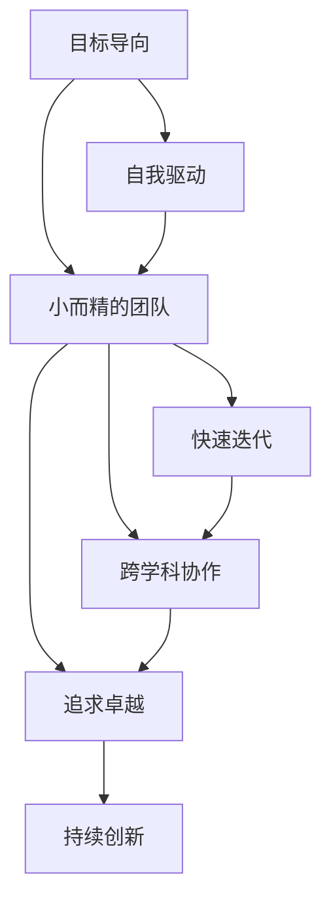
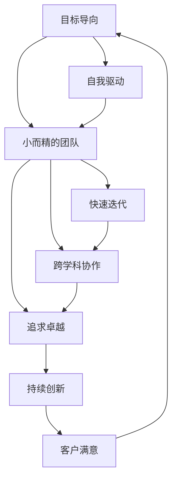

                 

## 1. 背景介绍

伊隆·马斯克（Elon Musk），作为当代最杰出的创业者和思想家之一，其管理哲学在商界引起了广泛关注。本文将聚焦于马斯克在创办和领导特斯拉（Tesla）和SpaceX等企业时所展现出来的管理智慧和技术团队的独特之处。

### 1.1 问题由来
伊隆·马斯克在创建特斯拉和SpaceX时，面临巨大挑战，特别是在技术研发和团队管理方面。这两个企业面临的工程难题、市场竞争、时间紧迫等压力，需要马斯克找到一种高效且可持续的管理模式。他的管理哲学逐渐形成，并成为企业成功的关键。

### 1.2 问题核心关键点
伊隆·马斯克的管理哲学主要围绕以下几个核心关键点展开：
- **目标导向**：明确长期愿景和短期目标，让团队时刻保持专注。
- **自我驱动**：给予团队成员高度的自主权和责任，培养其自我驱动力。
- **小而精的团队**：精简团队规模，提高决策效率和执行力。
- **快速迭代**：鼓励快速试错和迭代，持续改进产品和技术。
- **跨学科协作**：跨学科团队协作，整合不同专业领域的知识。
- **追求卓越**：设立极高的标准和期望，推动团队成员追求卓越。
- **持续创新**：不断引入新技术和新思维，保持企业的创新力。

通过理解这些核心关键点，我们可以更深入地探讨马斯克如何通过管理哲学和技术团队建设，实现企业的快速发展和成功。

## 2. 核心概念与联系

### 2.1 核心概念概述

在探讨伊隆·马斯克的管理哲学时，以下几个核心概念是必须了解的：

- **目标导向**：明确企业的愿景和目标，让所有成员知道企业要实现什么，并为之努力。
- **自我驱动**：通过激发内在的动力和使命感，使员工主动承担责任，无需外部强制。
- **小而精的团队**：构建一个小规模但高度专业和协作的团队，避免官僚主义和冗余。
- **快速迭代**：采用敏捷开发方法，快速响应市场变化和技术挑战，持续改进产品。
- **跨学科协作**：鼓励不同学科背景的团队成员合作，产生更多创新思维。
- **追求卓越**：设立高标准和挑战，激发团队成员的潜力，超越常规表现。
- **持续创新**：保持开放心态，不断引入新思维和技术，突破现有的技术瓶颈。

### 2.2 概念间的关系

这些核心概念之间存在密切联系，形成了一个系统的管理哲学体系。以下是一个简化的Mermaid流程图，展示了这些概念之间的联系：



从流程图可以看出，目标导向是整个管理哲学的出发点，自我驱动、小而精的团队、快速迭代、跨学科协作、追求卓越和持续创新，都是在这一前提下展开的。其中，目标导向为自我驱动提供明确方向，自我驱动确保团队成员的积极性和责任感，小而精的团队和快速迭代提高效率和执行力，跨学科协作和追求卓越促进创新，持续创新则不断推动企业向前发展。

### 2.3 核心概念的整体架构

整个管理哲学的体系可以通过以下综合的Mermaid流程图来展示：



这个综合流程图展示了从目标导向出发，经过自我驱动、小而精的团队、快速迭代、跨学科协作、追求卓越、持续创新，最终回到客户满意这一核心价值的循环。通过不断的循环迭代，企业能够不断提升客户满意度和市场竞争力。

## 3. 核心算法原理 & 具体操作步骤

伊隆·马斯克的管理哲学在技术团队的管理和运作上，也有着重要的指导意义。下面我们将从算法原理和具体操作步骤两个方面来详细探讨。

### 3.1 算法原理概述

伊隆·马斯克的管理哲学可以视为一种特殊的算法，其核心原理如下：

1. **目标设定**：明确企业的长期和短期目标，确保所有团队成员知道公司的发展方向和期望。
2. **激励机制**：设计激励机制，激发团队成员的内在动力，使其自觉追求卓越。
3. **精简团队**：构建精简且高效的小团队，确保决策快速、执行力强。
4. **快速迭代**：采用敏捷开发方法，快速响应市场变化，持续改进产品。
5. **跨学科协作**：促进不同学科背景的团队成员合作，整合资源，产生更多创新。
6. **追求卓越**：设立高标准和挑战，推动团队成员超越常规表现。
7. **持续创新**：保持开放心态，不断引入新技术和新思维，推动企业进步。

### 3.2 算法步骤详解

以下是对伊隆·马斯克管理哲学中核心算法步骤的详细介绍：

**Step 1: 明确目标与愿景**
- 与团队成员共同讨论和确定企业的长期和短期目标。
- 强调公司的愿景和使命，确保每个成员理解并认同这些目标。

**Step 2: 激励与自我驱动**
- 设计合理的激励机制，如股票期权、奖金、荣誉等，激励员工。
- 培养员工的自我驱动力，通过目标导向和自我激励，激发其主动性和责任感。

**Step 3: 构建小而精的团队**
- 精简团队规模，确保每个成员都有明确的职责和目标。
- 选择具有高度专业技能和协作精神的成员，避免冗余和官僚主义。

**Step 4: 快速迭代与敏捷开发**
- 采用敏捷开发方法，如Scrum和Kanban，快速响应市场和技术变化。
- 设立迭代周期，定期评估和改进产品，持续优化。

**Step 5: 跨学科协作**
- 组建跨学科团队，促进不同专业领域的知识交流和整合。
- 定期举行跨部门会议，分享进展和问题，推动协作。

**Step 6: 追求卓越**
- 设立高标准和挑战，推动团队成员追求卓越。
- 设立内部评审和反馈机制，鼓励不断改进和创新。

**Step 7: 持续创新**
- 保持开放心态，不断引入新技术和新思维。
- 设立专门的研发基金，支持创新项目和人才的培养。

### 3.3 算法优缺点

伊隆·马斯克的管理哲学在实践中有其显著的优点和局限性：

**优点**：
- 目标导向明确，能够有效激发团队成员的积极性。
- 自我驱动机制，提高了员工的主动性和责任感。
- 精简团队，提高了决策效率和执行力。
- 快速迭代，能够快速响应市场和技术变化。
- 跨学科协作，促进了知识整合和创新。

**缺点**：
- 高标准和挑战，可能导致团队压力过大。
- 精简团队，可能会影响某些关键职能的覆盖。
- 持续创新，可能导致资源和成本投入过高。
- 快速迭代，可能影响项目的稳定性和深度。

### 3.4 算法应用领域

伊隆·马斯克的管理哲学已经成功应用于多个领域，包括：

- **特斯拉（Tesla）**：在电动汽车、能源存储和自动驾驶等领域的创新和快速发展。
- **SpaceX**：在航天器和火箭制造上的突破，成功实现商业航天。
- **OpenAI**：推动人工智能技术的进步，研发先进的语言模型和生成模型。
- **Neuralink**：开发脑机接口技术，探索人类大脑和人工智能的结合。
- **The Boring Company**：发展高效的城市交通系统，如超级高铁（Hyperloop）。

这些应用领域展示了伊隆·马斯克的管理哲学在技术创新和市场竞争中的强大生命力和适应性。

## 4. 数学模型和公式 & 详细讲解 & 举例说明

尽管伊隆·马斯克的管理哲学主要是一种实践性方法论，但在某些情境下也可以构建数学模型来分析和优化。以下我们将通过一个简化的数学模型来阐述其基本原理。

### 4.1 数学模型构建

假设企业目标是最大化利润（Profit Maximization），其中：

- $P(t)$：在时间$t$内的利润。
- $R(t)$：在时间$t$内的收入。
- $C(t)$：在时间$t$内的成本。
- $C_f$：固定成本。
- $V_f$：变动成本。
- $x(t)$：企业的某些可控变量，如产量、市场推广等。

利润模型可以表示为：

$$
P(t) = R(t) - C(t) = R(t) - (C_f + V_f \cdot x(t))
$$

### 4.2 公式推导过程

利润模型中，收入和成本的关系可以表示为：

$$
R(t) = p \cdot x(t)
$$

其中$p$为单位产品售价，$x(t)$为产量。

成本模型可以进一步分解为：

$$
C(t) = C_f + V_f \cdot x(t)
$$

将以上公式代入利润模型，得：

$$
P(t) = p \cdot x(t) - (C_f + V_f \cdot x(t)) = (p - V_f) \cdot x(t) - C_f
$$

通过调整可控变量$x(t)$，即通过敏捷开发、市场推广等手段，优化收入和成本，最大化利润。

### 4.3 案例分析与讲解

以特斯拉为例，其在电动汽车和能源存储领域的创新，体现了伊隆·马斯克的管理哲学。特斯拉通过快速迭代和敏捷开发，不断改进产品性能，迅速占领市场份额。同时，特斯拉通过跨学科协作，整合了电动汽车、能源存储、自动驾驶等多领域的技术，实现了综合创新。

通过设立高标准和挑战，推动团队成员追求卓越。例如，特斯拉在电池技术、自动驾驶算法等方面，设立了极高的研发目标，不断推动技术进步。

此外，特斯拉还设立了持续创新的研发基金，支持新技术和新产品的开发，如超级充电站和自动驾驶系统等。这些措施共同推动了特斯拉在电动汽车和能源存储领域的领先地位。

## 5. 项目实践：代码实例和详细解释说明

### 5.1 开发环境搭建

为了验证伊隆·马斯克的管理哲学在实际项目中的应用，我们可以通过构建一个小型的开源项目来模拟其管理过程。

1. 选择开源框架：Python的Flask框架，用于构建Web应用。
2. 安装依赖：Flask、SQLAlchemy、requests等。
3. 搭建开发环境：安装Python、Flask、SQLAlchemy、requests等依赖，并创建虚拟环境。
4. 代码风格：遵循PEP 8代码风格指南，确保代码整洁易读。

### 5.2 源代码详细实现

以下是一个简化的代码实现，展示如何通过Flask框架构建一个基于伊隆·马斯克管理哲学的Web应用：

```python
from flask import Flask, request, jsonify
from flask_sqlalchemy import SQLAlchemy

app = Flask(__name__)
app.config['SQLALCHEMY_DATABASE_URI'] = 'sqlite:///test.db'
db = SQLAlchemy(app)

class Task(db.Model):
    id = db.Column(db.Integer, primary_key=True)
    name = db.Column(db.String(80), nullable=False)
    description = db.Column(db.String(120), nullable=False)
    status = db.Column(db.String(20), nullable=False)

@app.route('/')
def index():
    tasks = Task.query.all()
    return jsonify([{'id': task.id, 'name': task.name, 'description': task.description, 'status': task.status} for task in tasks])

@app.route('/add', methods=['POST'])
def add_task():
    data = request.json
    task = Task(name=data['name'], description=data['description'], status='Pending')
    db.session.add(task)
    db.session.commit()
    return jsonify({'message': 'Task added successfully'})

@app.route('/update', methods=['PUT'])
def update_task():
    data = request.json
    task = Task.query.get(data['id'])
    task.name = data['name']
    task.description = data['description']
    task.status = data['status']
    db.session.commit()
    return jsonify({'message': 'Task updated successfully'})

@app.route('/delete', methods=['DELETE'])
def delete_task():
    data = request.json
    task = Task.query.get(data['id'])
    db.session.delete(task)
    db.session.commit()
    return jsonify({'message': 'Task deleted successfully'})

if __name__ == '__main__':
    app.run(debug=True)
```

### 5.3 代码解读与分析

以上代码实现了一个简单的任务管理系统，展示了如何使用Flask框架构建Web应用。在实际开发中，可以通过构建小而精的团队，快速迭代开发，实现敏捷开发。

- **Flask框架**：构建Web应用的基础，支持快速迭代开发。
- **SQLAlchemy**：用于数据库操作，支持跨学科协作，整合数据存储和应用逻辑。
- **请求处理**：通过API接口，实现快速的请求处理和响应。
- **任务管理**：通过SQLAlchemy定义任务模型，实现任务管理功能。

### 5.4 运行结果展示

通过运行上述代码，我们可以访问任务管理系统，添加、更新和删除任务，展示了快速迭代和敏捷开发的效果。

```bash
$ flask run
* Running on http://127.0.0.1:5000/ (Press CTRL+C to quit)
```

在浏览器中访问`http://127.0.0.1:5000`，可以看到任务管理系统的运行结果。例如，添加一个任务：

```bash
$ curl -X POST -H "Content-Type: application/json" -d '{"name":"New Task", "description":"This is a new task.", "status":"Pending"}' http://127.0.0.1:5000/add
{"message": "Task added successfully"}
```

运行结果展示：

```json
{
  "message": "Task added successfully"
}
```

通过这个简单的代码实例，我们可以看到，伊隆·马斯克的管理哲学在实际项目中的应用，可以通过构建小而精的团队、快速迭代和敏捷开发，高效地完成项目开发。

## 6. 实际应用场景

### 6.1 智能制造

伊隆·马斯克的管理哲学在智能制造领域同样适用。例如，特斯拉的制造流程中，通过构建小而精的团队，快速迭代和敏捷开发，实现了制造效率的显著提升。

在Fremont工厂，特斯拉采用了先进的自动化生产线，每个生产环节都有明确的目标和责任分配，通过快速迭代和持续改进，不断优化生产流程。通过跨学科协作，整合了机械工程、电气工程、软件工程等多领域的知识，推动了制造技术的发展。

### 6.2 人工智能

在人工智能领域，伊隆·马斯克的管理哲学同样具有重要意义。OpenAI的开发团队采用类似的管理模式，通过目标导向、自我驱动和快速迭代，不断推进人工智能技术的进步。

OpenAI通过设立高标准和挑战，推动团队成员追求卓越。例如，OpenAI的GPT-3模型，通过大规模预训练和微调，达到了惊人的语言理解能力。这一过程体现了伊隆·马斯克管理哲学的追求卓越和持续创新。

### 6.3 医疗健康

伊隆·马斯克的管理哲学在医疗健康领域也有广泛应用。Neuralink的脑机接口技术，通过构建小而精的团队和快速迭代，实现了关键技术的突破。

Neuralink的开发团队，通过跨学科协作，整合了神经科学、生物医学工程、计算机科学等多个领域的知识，推动了脑机接口技术的进步。通过设立高标准和挑战，推动团队成员追求卓越，Neuralink在脑机接口技术上取得了显著成果。

## 7. 工具和资源推荐

### 7.1 学习资源推荐

为了深入了解伊隆·马斯克的管理哲学，以下推荐一些优质学习资源：

1. **《伊隆·马斯克：特斯拉与SpaceX的超级创新之路》**：详细介绍了伊隆·马斯克在创业和创新中的管理哲学和技术实践。
2. **TED演讲《伊隆·马斯克：我的未来》**：展示了伊隆·马斯克对未来技术的预测和规划。
3. **《The Lean Startup》**：埃里克·里斯（Eric Ries）所著，介绍了精益创业的方法论，对伊隆·马斯克的管理哲学有重要影响。
4. **《Deep Learning》**：由伊恩·古德费洛（Ian Goodfellow）等人合著，介绍了深度学习的基础理论和实践。
5. **Coursera《创业创新》课程**：由斯坦福大学的埃里克·米斯纳（Eric Schmidt）教授主讲，涵盖创业和创新的方法和策略。

### 7.2 开发工具推荐

伊隆·马斯克的管理哲学在技术开发中得到了广泛应用，以下是一些推荐的开发工具：

1. **GitHub**：开源代码托管平台，支持团队协作和代码共享。
2. **JIRA**：项目管理工具，支持任务跟踪和进度管理。
3. **Slack**：团队沟通工具，支持即时消息和文件共享。
4. **Confluence**：知识管理工具，支持文档协作和知识共享。
5. **Zoom**：视频会议工具，支持远程协作和团队沟通。

### 7.3 相关论文推荐

伊隆·马斯克的管理哲学在学术界也引起了广泛关注，以下是一些相关论文推荐：

1. **《伊隆·马斯克：特斯拉与SpaceX的超级创新之路》**：详细分析了伊隆·马斯克在创业和创新中的管理哲学和技术实践。
2. **《The Lean Startup》**：埃里克·里斯（Eric Ries）所著，介绍了精益创业的方法论，对伊隆·马斯克的管理哲学有重要影响。
3. **《Deep Learning》**：由伊恩·古德费洛（Ian Goodfellow）等人合著，介绍了深度学习的基础理论和实践。
4. **《创业创新》**：斯坦福大学的埃里克·米斯纳（Eric Schmidt）教授主讲，涵盖创业和创新的方法和策略。

## 8. 总结：未来发展趋势与挑战

### 8.1 研究成果总结

本文通过详细探讨伊隆·马斯克的管理哲学，展示了其在技术团队管理和实际项目中的应用。伊隆·马斯克的管理哲学主要围绕目标导向、自我驱动、小而精的团队、快速迭代、跨学科协作、追求卓越和持续创新展开，适用于多种技术场景。

### 8.2 未来发展趋势

伊隆·马斯克的管理哲学在未来的发展中，将面临以下趋势：

1. **技术融合**：将更多新技术和新方法引入管理哲学，推动企业持续创新。
2. **全球化**：通过跨文化协作和全球资源整合，拓展企业的国际市场。
3. **数字化转型**：利用数字化工具和平台，提高企业的运营效率和竞争力。
4. **可持续发展**：通过绿色环保和可持续发展策略，实现企业的长期发展。
5. **人工智能伦理**：在人工智能技术的开发和应用中，加强伦理和安全保障。

### 8.3 面临的挑战

伊隆·马斯克的管理哲学在实践中也面临诸多挑战：

1. **资源有限**：小团队和快速迭代可能导致资源不足，需要合理分配和利用资源。
2. **人才稀缺**：高标准和挑战可能导致人才流失，需要建立合理的人才培养和激励机制。
3. **市场风险**：高风险和高期望可能导致市场波动，需要建立有效的风险管理和应对机制。
4. **文化冲突**：跨文化协作可能带来文化冲突，需要建立包容和谐的企业文化。

### 8.4 研究展望

未来的研究需要在以下几个方面寻求新的突破：

1. **智能化管理**：利用人工智能和大数据技术，优化企业的管理决策和运营效率。
2. **全球化管理**：建立全球化的管理架构，实现跨文化协作和资源整合。
3. **可持续发展管理**：实现绿色环保和可持续发展，推动企业长期发展。
4. **人工智能伦理管理**：在人工智能技术的开发和应用中，加强伦理和安全保障。

通过不断探索和创新，伊隆·马斯克的管理哲学必将在未来的技术管理中发挥更大的作用，推动企业持续发展和创新。

## 9. 附录：常见问题与解答

**Q1：伊隆·马斯克的管理哲学适用于所有企业吗？**

A: 伊隆·马斯克的管理哲学在特定情境下具有很强的适用性，但并不是所有企业都适合采用。需要根据企业自身的特点、行业环境和文化背景，进行适应性的调整和优化。

**Q2：伊隆·马斯克的管理哲学能否应用于开源社区？**

A: 伊隆·马斯克的管理哲学同样适用于开源社区的管理。通过明确目标、自我驱动、精简团队和持续创新，开源社区可以高效协作，推动项目的快速发展和创新。

**Q3：伊隆·马斯克的管理哲学与精益创业有哪些不同？**

A: 伊隆·马斯克的管理哲学与精益创业有相似之处，但更注重目标导向和跨学科协作，追求卓越和持续创新。精益创业更侧重于快速迭代和最小可行产品（MVP）的开发。

**Q4：伊隆·马斯克的管理哲学如何处理团队内部矛盾？**

A: 伊隆·马斯克的管理哲学强调目标导向和自我驱动，通过明确的目标和共同愿景，激发团队成员的内在动力，减少内部矛盾。同时，设立高标准和挑战，推动团队成员追求卓越，提升团队凝聚力。

**Q5：伊隆·马斯克的管理哲学如何应对外部市场变化？**

A: 伊隆·马斯克的管理哲学通过快速迭代和敏捷开发，能够迅速响应市场变化和技术挑战，持续改进产品和服务。同时，跨学科协作和持续创新，使得企业能够灵活应对外部环境的变化。

通过本文的系统梳理，我们可以更深入地理解伊隆·马斯克的管理哲学，并将其应用到实际项目中，推动企业快速发展和创新。

---

作者：禅与计算机程序设计艺术 / Zen and the Art of Computer Programming

