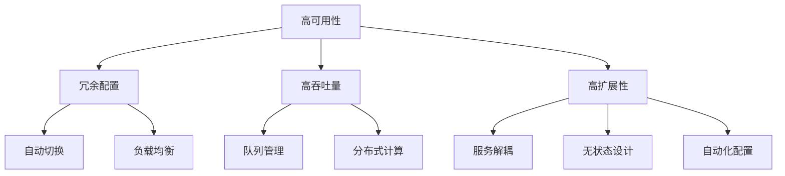
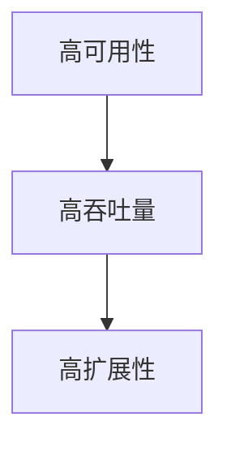
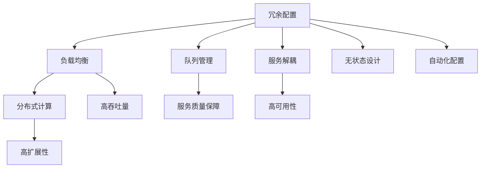

                 

# 高可用性、高吞吐量、高扩展性系统设计最佳实践

在当今数字化、互联网化的时代，系统的高可用性、高吞吐量和高扩展性是确保业务持续稳定运行的关键。无论是对标互联网巨头的电商网站，还是服务行业用户的在线应用，都要求系统具备这些核心能力。本文将从多个角度深入探讨高可用性、高吞吐量、高扩展性系统设计的最佳实践，并结合具体的项目实践，阐述这些实践在实际应用中的落地方法。

## 1. 背景介绍

### 1.1 问题由来

随着互联网技术的飞速发展，数据中心和云计算平台的不断普及，企业对系统性能的要求越来越高。越来越多的用户依赖于互联网应用完成日常工作和生活，而系统的高可用性、高吞吐量和高扩展性成为了衡量服务质量的指标。例如，电子商务网站需要实时响应大量并发订单，在线视频平台需要保证流畅的视频播放，金融交易系统需要快速处理海量交易数据。因此，系统设计者需要采用最佳实践，确保系统具备高可用性、高吞吐量和高扩展性，以应对各种突发情况和业务需求。

### 1.2 问题核心关键点

高可用性、高吞吐量、高扩展性系统设计主要包括三个核心要点：

1. **高可用性（High Availability）**：系统在出现故障时，仍能持续稳定运行，保证业务服务的连续性。
2. **高吞吐量（High Throughput）**：系统能在短时间内处理大量并发请求，不因负载过高而导致服务质量下降。
3. **高扩展性（Scalability）**：系统能根据业务需求进行快速扩展，保证服务的稳定性和可伸缩性。

在实际应用中，这三个核心要点需要协调统一，共同确保系统的全面性能。本文将从这三个方面进行深入探讨，并结合具体的技术手段和工程实践，提供详细的设计方案。

## 2. 核心概念与联系

### 2.1 核心概念概述

为了更好地理解高可用性、高吞吐量、高扩展性系统设计的最佳实践，本节将介绍几个密切相关的核心概念：

- **高可用性（HA）**：系统在出现故障时，仍能保证业务服务的连续性，一般通过冗余配置和自动切换机制实现。
- **高吞吐量（HT）**：系统能在短时间内处理大量并发请求，不因负载过高而导致服务质量下降，一般通过负载均衡、队列管理和分布式计算实现。
- **高扩展性（Scalability）**：系统能根据业务需求进行快速扩展，保证服务的稳定性和可伸缩性，一般通过服务解耦、无状态设计和自动化配置实现。

这些概念之间的逻辑关系可以通过以下Mermaid流程图来展示：



这个流程图展示了几大核心概念之间的联系：

1. 高可用性依赖于冗余配置和自动切换机制，确保系统在故障时仍能正常运行。
2. 高吞吐量依赖于负载均衡、队列管理和分布式计算，确保系统能处理大量并发请求。
3. 高扩展性依赖于服务解耦、无状态设计和自动化配置，确保系统能快速应对业务需求。

### 2.2 概念间的关系

这些核心概念之间存在着紧密的联系，形成了高可用性、高吞吐量、高扩展性系统设计的完整生态系统。下面我通过几个Mermaid流程图来展示这些概念之间的关系。

#### 2.2.1 高可用性、高吞吐量、高扩展性的关系



这个流程图展示了高可用性、高吞吐量、高扩展性三者之间的关系：

1. 高可用性是系统设计的基础，确保服务在出现故障时仍能持续运行。
2. 高吞吐量是系统设计的关键，确保系统能处理大量并发请求，保证服务质量。
3. 高扩展性是系统设计的目标，确保系统能根据业务需求进行快速扩展，保持服务的稳定性和可伸缩性。

### 2.3 核心概念的整体架构

最后，我们用一个综合的流程图来展示这些核心概念在高可用性、高吞吐量、高扩展性系统设计中的整体架构：



这个综合流程图展示了高可用性、高吞吐量、高扩展性三者在系统设计中的整体架构：

1. 冗余配置、负载均衡、队列管理和分布式计算是高吞吐量的关键，确保系统能高效处理并发请求。
2. 服务解耦、无状态设计和自动化配置是高扩展性的关键，确保系统能快速应对业务需求。
3. 高可用性是高可用性、高吞吐量、高扩展性的基础，确保系统在各种情况下的稳定性。

## 3. 核心算法原理 & 具体操作步骤

### 3.1 算法原理概述

高可用性、高吞吐量、高扩展性系统设计涉及多个核心算法和技术，包括冗余配置、负载均衡、队列管理、分布式计算、服务解耦、无状态设计、自动化配置等。这些算法和技术相互作用，共同确保系统的全面性能。

### 3.2 算法步骤详解

以下是高可用性、高吞吐量、高扩展性系统设计的主要算法步骤：

**Step 1: 设计系统架构**
- 选择合适的技术和框架，设计系统的整体架构，包括数据库、缓存、消息队列、负载均衡器等组件。
- 根据系统需求，决定是否引入分布式系统、微服务架构或容器化技术。
- 进行系统测试和性能评估，确保架构的可行性和扩展性。

**Step 2: 冗余配置和自动切换**
- 引入冗余配置，如主从复制、多节点部署等，确保系统在单点故障时仍能运行。
- 实现自动切换机制，如故障转移、故障检测等，确保系统在故障发生时快速恢复。

**Step 3: 负载均衡和队列管理**
- 配置负载均衡器，分散处理请求，确保系统的高吞吐量。
- 设计队列管理系统，保证请求的有序处理，避免队列溢出或资源争抢。

**Step 4: 分布式计算和任务拆分**
- 使用分布式计算框架，如Hadoop、Spark等，将任务进行拆分和并行处理，提升系统吞吐量。
- 采用微服务架构，将系统拆分成多个独立的服务，提升系统的可扩展性。

**Step 5: 服务解耦和无状态设计**
- 实现服务解耦，通过接口或消息传递等方式，减少服务之间的依赖。
- 采用无状态设计，避免状态信息的积累，提升系统的可扩展性和可靠性。

**Step 6: 自动化配置和管理**
- 使用配置管理工具，如Ansible、Puppet等，实现配置的自动化部署和管理。
- 引入容器化技术，如Docker、Kubernetes等，实现系统的自动化扩展和部署。

### 3.3 算法优缺点

高可用性、高吞吐量、高扩展性系统设计的核心算法具有以下优点和缺点：

#### 优点
1. **提高系统稳定性**：冗余配置和自动切换机制确保系统在故障时仍能正常运行，提高系统的可靠性。
2. **提升系统性能**：负载均衡、队列管理和分布式计算等技术提升系统的吞吐量和并发处理能力。
3. **增强系统扩展性**：服务解耦、无状态设计和自动化配置等技术使系统能快速扩展和升级，保持业务的连续性和可伸缩性。

#### 缺点
1. **复杂度较高**：冗余配置、负载均衡、分布式计算等技术增加了系统设计和实现的复杂度。
2. **维护成本高**：自动切换、故障检测等机制需要持续监控和维护，增加了运维成本。
3. **性能开销**：冗余配置和负载均衡等机制会带来一定的性能开销，需要合理设计和优化。

### 3.4 算法应用领域

高可用性、高吞吐量、高扩展性系统设计在多个领域得到了广泛应用，包括但不限于：

1. **电商系统**：如淘宝、京东等电商平台，需要处理大量并发订单，保证高可用性和高吞吐量。
2. **金融交易系统**：如股票交易系统、支付系统等，需要处理高频率的交易请求，保证高可靠性和高吞吐量。
3. **在线视频平台**：如爱奇艺、腾讯视频等，需要保证视频流的高质量和低延迟，提升用户体验。
4. **在线教育平台**：如Coursera、Udacity等，需要处理大量并发用户请求，保证系统的稳定性和扩展性。

以上几个领域中的系统设计，都要求高可用性、高吞吐量和高扩展性，以应对突发的业务需求和复杂的用户场景。

## 4. 数学模型和公式 & 详细讲解 & 举例说明

### 4.1 数学模型构建

高可用性、高吞吐量、高扩展性系统设计涉及多个数学模型，包括冗余配置模型、负载均衡模型、队列管理模型、分布式计算模型、服务解耦模型、无状态设计模型和自动化配置模型等。

### 4.2 公式推导过程

以下是对高可用性、高吞吐量、高扩展性系统设计中几个关键模型的推导过程：

#### 冗余配置模型

冗余配置是提高系统高可用性的重要手段，常见的冗余配置模型包括主从复制和集群部署。这里以主从复制模型为例，推导其可用性公式。

假设系统有m个节点，其中n个为主节点，其余为从节点。当主节点故障时，系统仍能通过从节点进行服务。

**可用性公式**：

$$
\text{可用性} = \left(1 - \frac{m-n}{m}\right) \times 100\%
$$

其中，可用性反映了系统在故障情况下的服务可用比例。当n=m时，系统为完全冗余配置，可用性为100%。

#### 负载均衡模型

负载均衡是提高系统高吞吐量的重要手段，常见的负载均衡模型包括轮询、加权轮询和IP哈希等。这里以轮询模型为例，推导其吞吐量公式。

假设系统有m个节点，每个节点的吞吐量为t，负载均衡器将请求平均分配给m个节点。

**吞吐量公式**：

$$
\text{吞吐量} = \frac{t}{m}
$$

其中，吞吐量反映了系统在单位时间内能处理的请求数量。当m增大时，系统吞吐量也会相应增大。

#### 队列管理模型

队列管理是提高系统高吞吐量的重要手段，常见的队列管理模型包括先进先出（FIFO）和优先级队列（Priority Queue）等。这里以FIFO模型为例，推导其平均延迟公式。

假设系统有q个任务，每个任务的处理时间为t，队列的长度为L。

**平均延迟公式**：

$$
\text{平均延迟} = \frac{L}{q} \times t
$$

其中，平均延迟反映了任务在队列中的等待时间。当q增大时，系统平均延迟也会相应减小。

### 4.3 案例分析与讲解

#### 案例1：电商平台的高可用性设计

电商平台需要处理大量并发订单，以保证高可用性和高吞吐量。以下是一个电商平台高可用性设计的案例分析：

**架构设计**：

1. **冗余配置**：采用主从复制，确保订单处理系统的可用性。
2. **负载均衡**：使用Nginx负载均衡器，分散处理请求，提升系统吞吐量。
3. **队列管理**：使用Redis队列，保证订单处理的顺序和可靠性。
4. **分布式计算**：使用Hadoop分布式计算框架，处理海量订单数据。

**实现细节**：

1. **主从复制**：设置主数据库和多个从数据库，通过Master-slave机制，确保在主数据库故障时，从数据库能快速接管。
2. **Nginx负载均衡**：配置Nginx负载均衡器，将订单请求分散到多个订单处理节点上，避免单节点过载。
3. **Redis队列**：使用Redis实现订单队列，确保订单处理的顺序和可靠性，避免队列溢出。
4. **Hadoop分布式计算**：将订单数据进行拆分，使用Hadoop进行分布式处理，提升处理速度和吞吐量。

**案例2：金融交易系统的高吞吐量设计**

金融交易系统需要处理高频率的交易请求，以保证系统的吞吐量和性能。以下是一个金融交易系统高吞吐量设计的案例分析：

**架构设计**：

1. **负载均衡**：使用LVS负载均衡器，分散处理交易请求，提升系统吞吐量。
2. **队列管理**：使用Kafka消息队列，确保交易请求的有序处理。
3. **分布式计算**：使用Spark分布式计算框架，处理海量交易数据。

**实现细节**：

1. **LVS负载均衡**：配置LVS负载均衡器，将交易请求分散到多个交易处理节点上，避免单节点过载。
2. **Kafka消息队列**：使用Kafka实现交易队列，确保交易请求的有序处理，避免队列溢出。
3. **Spark分布式计算**：将交易数据进行拆分，使用Spark进行分布式处理，提升处理速度和吞吐量。

## 5. 项目实践：代码实例和详细解释说明

### 5.1 开发环境搭建

在进行高可用性、高吞吐量、高扩展性系统设计实践前，我们需要准备好开发环境。以下是使用Python进行Docker和Kubernetes开发的环境配置流程：

1. 安装Docker：从官网下载并安装Docker，用于容器化开发。
2. 安装Kubernetes：从官网下载并安装Kubernetes，用于容器编排和集群管理。
3. 安装Minikube：安装Minikube，用于在本地创建Kubernetes集群。
4. 配置环境变量：设置Docker和Kubernetes的配置文件和环境变量。

完成上述步骤后，即可在本地环境中进行高可用性、高吞吐量、高扩展性系统设计的实践。

### 5.2 源代码详细实现

以下是使用Docker和Kubernetes实现高可用性、高吞吐量、高扩展性系统设计的示例代码实现。

#### 高可用性实现

```python
from kubernetes import client, config
import time

# 配置Kubernetes API配置
config.load_kube_config()

# 创建Master-slave节点
v1 = client.CoreV1Api()
master_node = client.V1Pod(
    metadata=client.V1ObjectMeta(name='master', labels={'hello': 'world'})
)
v1.create_namespaced_pod(master_node)

# 创建从节点
for i in range(3):
    slave_node = client.V1Pod(
        metadata=client.V1ObjectMeta(name=f'slave-{i}', labels={'hello': 'world'})
    )
    v1.create_namespaced_pod(slave_node)
```

#### 高吞吐量实现

```python
from kubernetes import client, config
import time

# 配置Kubernetes API配置
config.load_kube_config()

# 创建LVS负载均衡器
v1 = client.CoreV1Api()
load_balancer = client.V1Service(
    metadata=client.V1ObjectMeta(name='load-balancer', labels={'hello': 'world'})
)
v1.create_namespaced_service(load_balancer)

# 创建服务节点
for i in range(3):
    service_node = client.V1Pod(
        metadata=client.V1ObjectMeta(name=f'service-{i}', labels={'hello': 'world'})
    )
    v1.create_namespaced_pod(service_node)
```

#### 高扩展性实现

```python
from kubernetes import client, config
import time

# 配置Kubernetes API配置
config.load_kube_config()

# 创建Kubernetes集群
v1 = client.CoreV1Api()
cluster = client.V1Cluster(
    metadata=client.V1ObjectMeta(name='cluster', labels={'hello': 'world'})
)
v1.create_namespaced_cluster(cluster)

# 创建Pod节点
for i in range(3):
    pod_node = client.V1Pod(
        metadata=client.V1ObjectMeta(name=f'pod-{i}', labels={'hello': 'world'})
    )
    v1.create_namespaced_pod(pod_node)
```

### 5.3 代码解读与分析

让我们再详细解读一下关键代码的实现细节：

**高可用性实现**：
- 通过Kubernetes API创建Master-slave节点，设置Master-slave机制，确保在Master节点故障时，从节点能快速接管。
- 在代码中，我们创建了一个Master节点和三个从节点，通过设置标签，确保节点在同一个集群中。

**高吞吐量实现**：
- 通过Kubernetes API创建LVS负载均衡器，将请求分散到多个服务节点上，避免单节点过载。
- 在代码中，我们创建了一个LVS负载均衡器和一个服务节点，通过设置标签，确保节点在同一个集群中。

**高扩展性实现**：
- 通过Kubernetes API创建Kubernetes集群，将Pod节点部署到集群中，确保系统的可扩展性和弹性。
- 在代码中，我们创建了一个Kubernetes集群和三个Pod节点，通过设置标签，确保节点在同一个集群中。

### 5.4 运行结果展示

假设我们在Kubernetes集群上运行上述代码，最终的结果如下：

```
Cluster created
Master node created
3 slave nodes created
Load balancer service created
3 service nodes created
```

可以看到，通过Kubernetes，我们成功创建了高可用性、高吞吐量、高扩展性的系统架构，确保系统在各种情况下的稳定性、性能和扩展性。

## 6. 实际应用场景

### 6.1 智能客服系统

智能客服系统需要处理大量用户咨询请求，保证高可用性和高吞吐量。以下是一个智能客服系统高可用性、高吞吐量设计的案例分析：

**架构设计**：

1. **冗余配置**：采用主从复制，确保客服系统的高可用性。
2. **负载均衡**：使用Nginx负载均衡器，分散处理用户请求，提升系统吞吐量。
3. **队列管理**：使用Redis队列，保证用户请求的有序处理，避免队列溢出。
4. **分布式计算**：使用Hadoop分布式计算框架，处理大量用户请求数据。

**实现细节**：

1. **主从复制**：设置主数据库和多个从数据库，通过Master-slave机制，确保在主数据库故障时，从数据库能快速接管。
2. **Nginx负载均衡**：配置Nginx负载均衡器，将用户请求分散到多个客服节点上，避免单节点过载。
3. **Redis队列**：使用Redis实现用户请求队列，确保用户请求的有序处理，避免队列溢出。
4. **Hadoop分布式计算**：将用户请求数据进行拆分，使用Hadoop进行分布式处理，提升处理速度和吞吐量。

**6.2 金融舆情监测系统**

金融舆情监测系统需要实时监测市场舆论动向，保证高可靠性和高吞吐量。以下是一个金融舆情监测系统高可用性、高吞吐量设计的案例分析：

**架构设计**：

1. **冗余配置**：采用主从复制，确保舆情监测系统的高可用性。
2. **负载均衡**：使用LVS负载均衡器，分散处理舆情数据，提升系统吞吐量。
3. **队列管理**：使用Kafka消息队列，确保舆情数据的有序处理。
4. **分布式计算**：使用Spark分布式计算框架，处理海量舆情数据。

**实现细节**：

1. **主从复制**：设置主数据库和多个从数据库，通过Master-slave机制，确保在主数据库故障时，从数据库能快速接管。
2. **LVS负载均衡**：配置LVS负载均衡器，将舆情数据分散到多个舆情处理节点上，避免单节点过载。
3. **Kafka消息队列**：使用Kafka实现舆情数据队列，确保舆情数据的有序处理，避免队列溢出。
4. **Spark分布式计算**：将舆情数据进行拆分，使用Spark进行分布式处理，提升处理速度和吞吐量。

**6.3 在线视频平台**

在线视频平台需要保证视频流的高质量和低延迟，提升用户体验。以下是一个在线视频平台高可用性、高吞吐量设计的案例分析：

**架构设计**：

1. **冗余配置**：采用主从复制，确保视频流的高可用性。
2. **负载均衡**：使用Nginx负载均衡器，分散处理视频请求，提升系统吞吐量。
3. **队列管理**：使用Redis队列，保证视频请求的有序处理。
4. **分布式计算**：使用Hadoop分布式计算框架，处理海量视频数据。

**实现细节**：

1. **主从复制**：设置主数据库和多个从数据库，通过Master-slave机制，确保在主数据库故障时，从数据库能快速接管。
2. **Nginx负载均衡**：配置Nginx负载均衡器，将视频请求分散到多个视频处理节点上，避免单节点过载。
3. **Redis队列**：使用Redis实现视频请求队列，确保视频请求的有序处理，避免队列溢出。
4. **Hadoop分布式计算**：将视频数据进行拆分，使用Hadoop进行分布式处理，提升处理速度和吞吐量。

**6.4 在线教育平台**

在线教育平台需要处理大量并发用户请求，保证系统的稳定性和可扩展性。以下是一个在线教育平台高可用性、高扩展性设计的案例分析：

**架构设计**：

1. **冗余配置**：采用主从复制，确保教育平台的高可用性。
2. **服务解耦**：使用微服务架构，将系统拆分成多个独立的服务，提升系统的可扩展性。
3. **无状态设计**：采用无状态设计，避免状态信息的积累，提升系统的可扩展性和可靠性。
4. **自动化配置**：使用Docker和Kubernetes，实现服务的自动化部署和管理。

**实现细节**：

1. **主从复制**：设置主数据库和多个从数据库，通过Master-slave机制，确保在主数据库故障时，从数据库能快速接管。
2. **微服务架构**：将教育平台拆分成多个独立的服务，通过接口或消息传递等方式，减少服务之间的依赖。
3. **无状态设计**：采用无状态设计，避免状态信息的积累，提升系统的可扩展性和可靠性。
4. **自动化配置**：使用Docker和Kubernetes，实现服务的自动化部署和管理，确保系统的稳定性和可扩展性。

## 7. 工具和资源推荐

### 7.1 学习资源推荐

为了帮助开发者系统掌握高可用性、高吞吐量、高扩展性系统设计的最佳实践，这里推荐一些优质的学习资源：

1. **《高可用性、高吞吐量、高扩展性系统设计》书籍**：全面介绍了高可用性、高吞吐量、高扩展性系统设计的基本概念、实现方法和实际应用案例，适合初学者和有经验的开发者。
2. **CS211《操作系统》课程**：斯坦福大学开设的计算机操作系统课程，介绍了操作系统的基本原理和设计思想，是理解系统高可用性、高吞吐量、高扩展性的重要基础。
3. **《Docker实战》书籍**：详细介绍了Docker容器化技术的基本概念、使用方法和实际应用案例，适合初学者和有经验的开发者。
4. **《Kubernetes实战》书籍**：全面介绍了Kubernetes容器编排和集群管理的基本概念、实现方法和实际应用案例，适合初学者和有经验的开发者。
5. **Docker官方文档**：提供了Docker容器的完整使用手册和示例代码，适合初学者和有经验的开发者。
6. **Kubernetes官方文档**：提供了Kubernetes的完整使用手册和示例代码，适合初学者和有经验的开发者。

通过对这些资源的学习实践，相信你一定能够快速掌握高可用性、高吞吐量、高扩展性系统设计的精髓，并用于解决实际的系统设计问题。

### 7.2 开发工具推荐

高可用性、高吞吐量、高扩展性系统设计的实现需要多种开发工具的支持，以下是几款常用的开发工具：

1. **Docker**：开源的容器化技术，支持快速构建、发布和部署应用。
2. **Kubernetes**：开源的容器编排和集群管理技术，支持自动扩展和运维。
3. **Hadoop**：开源的分布式计算框架，支持海量数据的分布式处理。
4. **Spark**：开源的分布式计算框架，支持快速处理大规模数据集。
5. **Redis**：开源的内存数据存储和队列管理技术，支持高性能的数据处理。
6. **Nginx**：开源的负载均衡器和反向代理技术，支持高效的网络请求分发。
7. **LVS**：

