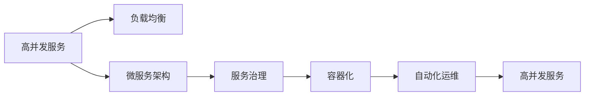

                 

## 1. 背景介绍

在当今数字化时代，互联网和移动应用的普及使得系统的负载量呈指数级增长。高并发服务（High Concurrency Service）成为企业提升用户体验、优化资源利用率的关键。随着微服务架构（Microservices Architecture）的兴起，如何将高并发服务与微服务相结合，构建出可靠、高效、可扩展的系统，成为软件开发者面临的重要挑战。本文旨在探讨高并发服务、微服务架构的设计和实现方法，为实际开发提供参考。

## 2. 核心概念与联系

### 2.1 核心概念概述

- **高并发服务（High Concurrency Service）**：指一个系统在短时间内能够处理大量的并发请求，提供快速响应的服务能力。
- **微服务架构（Microservices Architecture）**：将一个复杂的系统拆分为多个小服务，每个服务负责特定的业务功能，并通过轻量级的通信机制（如HTTP RESTful API）进行交互。
- **负载均衡（Load Balancing）**：通过将请求分散到多个服务器上，均衡系统负载，提升系统并发处理能力。
- **服务治理（Service Governance）**：对微服务的生命周期进行管理，包括注册、发现、路由、熔断、重试等，确保系统的可靠性和稳定性。
- **容器化（Containerization）**：通过容器技术（如Docker）将应用及其依赖打包，实现“一次打包，到处运行”。
- **自动化运维（Automated Operations）**：通过CI/CD工具链（如Jenkins、GitLab CI）实现持续集成和持续部署，提升开发效率和系统稳定性。

### 2.2 核心概念的联系

这些核心概念通过特定的架构设计和技术手段相互关联，共同构建高并发、高性能、可扩展的微服务系统。以下是核心概念的逻辑关系图：



- **高并发服务**：通过负载均衡和微服务架构实现高性能的请求处理能力。
- **微服务架构**：将系统拆分为多个小服务，通过服务治理和容器化技术提高系统的灵活性和可扩展性。
- **服务治理**：确保服务间通信的安全性和可靠性，提高系统的鲁棒性。
- **容器化**：通过容器技术，简化服务部署和管理。
- **自动化运维**：通过CI/CD工具链，实现快速、稳定、可靠的发布和更新。

### 2.3 核心概念的整体架构

为了更直观地展示这些概念之间的关系，以下是一个综合的流程图：


这个流程图展示了从高并发服务到自动化运维的整个系统架构，每个环节相互依赖，共同构成了一个高效、可扩展、高可靠的系统。

## 3. 核心算法原理 & 具体操作步骤

### 3.1 算法原理概述

高并发服务、微服务架构的设计和实现，涉及多个关键算法和操作步骤。以下是其核心算法原理：

- **负载均衡算法**：通过轮询、加权轮询、哈希、IP散列等算法，将请求均匀分配到多个服务器上，避免单点故障和负载不均。
- **服务发现和路由算法**：通过Consul、Eureka、Zookeeper等工具实现服务的自动注册和发现，通过负载均衡器（如Nginx、HAProxy）进行请求路由。
- **服务熔断和重试算法**：在服务调用过程中，通过Hystrix、Resilience4j等工具实现服务熔断和重试，避免服务雪崩和保证系统稳定性。
- **数据库分片算法**：通过垂直分片、水平分片、混合分片等技术，将数据库负载分散，提高数据库的并发处理能力。
- **缓存算法**：通过Memcached、Redis等缓存技术，减少数据库读写压力，提升系统响应速度。
- **消息队列算法**：通过Kafka、RabbitMQ等消息队列技术，实现异步解耦和数据缓冲，提升系统并发处理能力。

### 3.2 算法步骤详解

**3.2.1 负载均衡算法步骤**

1. **负载均衡器配置**：选择适合的负载均衡算法，并配置相应的参数（如轮询权重、IP散列算法等）。
2. **服务注册和发现**：将服务注册到负载均衡器上，使其能够动态感知服务的状态变化。
3. **请求分发**：当客户端发送请求时，负载均衡器根据配置算法将请求转发到合适的服务器上。

**3.2.2 服务发现和路由算法步骤**

1. **服务注册**：在系统中引入服务注册中心（如Consul、Eureka），将服务注册到中心上。
2. **服务发现**：服务请求通过负载均衡器发送给服务注册中心，查询当前可用的服务实例。
3. **路由分发**：根据查询结果，负载均衡器将请求路由到合适的服务实例上。

**3.2.3 服务熔断和重试算法步骤**

1. **服务熔断**：当服务调用失败次数达到预设阈值时，通过Hystrix等工具实现服务熔断，防止系统雪崩。
2. **服务重试**：在服务调用失败时，通过Resilience4j等工具实现服务重试，提高系统可靠性。

**3.2.4 数据库分片算法步骤**

1. **数据分片设计**：根据数据特点和业务需求，设计垂直分片、水平分片或混合分片方案。
2. **分片实现**：通过MySQL、PostgreSQL等数据库的分区功能或第三方分片工具实现数据分片。
3. **数据访问优化**：通过配置合适的读写策略，优化分片数据库的访问性能。

**3.2.5 缓存算法步骤**

1. **缓存配置**：根据业务需求，选择适合的缓存技术（如Memcached、Redis），并配置相应的参数（如缓存失效时间、缓存容量等）。
2. **缓存读写操作**：在业务代码中引入缓存读写操作，减少对数据库的直接访问。
3. **缓存失效管理**：定期清理缓存，避免缓存击穿和缓存雪崩问题。

**3.2.6 消息队列算法步骤**

1. **消息队列配置**：选择合适的消息队列技术（如Kafka、RabbitMQ），并配置相应的参数（如消息队列容量、消息优先级等）。
2. **消息生产与消费**：在业务代码中引入消息队列读写操作，实现异步解耦和数据缓冲。
3. **消息队列监控**：实时监控消息队列的状态，确保消息可靠传递和系统稳定性。

### 3.3 算法优缺点

**3.3.1 负载均衡算法**

- **优点**：
  - 均衡系统负载，提高并发处理能力。
  - 提高系统可用性，减少单点故障风险。

- **缺点**：
  - 配置复杂，需要针对不同场景选择合适的算法。
  - 增加系统复杂度，需要额外维护负载均衡器。

**3.3.2 服务发现和路由算法**

- **优点**：
  - 实现服务自动注册和发现，提高系统灵活性。
  - 支持服务动态扩缩容，提升系统可扩展性。

- **缺点**：
  - 引入中间件，增加系统复杂度。
  - 服务路由过程中可能存在性能瓶颈。

**3.3.3 服务熔断和重试算法**

- **优点**：
  - 提高系统鲁棒性，避免服务雪崩。
  - 保证系统稳定性，减少故障影响范围。

- **缺点**：
  - 配置复杂，需要根据业务特点选择合适的策略。
  - 可能影响服务调用成功率。

**3.3.4 数据库分片算法**

- **优点**：
  - 提高数据库并发处理能力。
  - 提升系统可扩展性和性能。

- **缺点**：
  - 数据一致性问题复杂，需要额外考虑事务管理。
  - 系统复杂度增加，需要维护分片逻辑。

**3.3.5 缓存算法**

- **优点**：
  - 减少数据库读写压力，提升系统响应速度。
  - 缓存热点数据，提高系统性能。

- **缺点**：
  - 缓存失效问题可能导致数据不一致。
  - 缓存容量有限，需要合理配置。

**3.3.6 消息队列算法**

- **优点**：
  - 实现异步解耦，提高系统可扩展性。
  - 缓冲消息，减少系统响应延迟。

- **缺点**：
  - 引入消息队列，增加系统复杂度。
  - 消息传递过程中可能存在延迟和错误。

### 3.4 算法应用领域

高并发服务、微服务架构的设计和实现，广泛应用于以下几个领域：

- **电商系统**：如淘宝、京东等，需要处理大量用户并发请求，提供快速响应。
- **社交网络**：如微博、微信等，需要处理用户实时互动，提升用户体验。
- **金融系统**：如支付宝、微信支付等，需要处理高并发交易，保障交易安全。
- **物流系统**：如菜鸟网络、顺丰等，需要处理订单、物流信息，提升服务效率。
- **在线教育**：如Coursera、Udemy等，需要处理大量在线学习请求，提高学习体验。
- **医疗系统**：如春雨医生、好大夫在线等，需要处理患者在线咨询，提升服务质量。
- **旅游系统**：如携程、去哪儿等，需要处理旅游订单、酒店信息，提升用户满意度。
- **政府系统**：如电子政务、公共服务平台等，需要处理大量公众服务请求，提升服务效率。

## 4. 数学模型和公式 & 详细讲解  
### 4.1 数学模型构建

为了更好地理解高并发服务、微服务架构的设计和实现方法，本节将介绍几个关键的数学模型和公式：

- **负载均衡模型**：通过轮询算法，计算每个服务器处理的请求数量。
- **服务发现模型**：通过Consul算法，计算当前可用的服务实例。
- **服务熔断模型**：通过Hystrix算法，计算服务调用失败次数。
- **数据库分片模型**：通过垂直分片算法，计算每个分片的数据量。
- **缓存失效模型**：通过Memcached算法，计算缓存失效时间。
- **消息队列模型**：通过Kafka算法，计算消息队列容量。

### 4.2 公式推导过程

**4.2.1 轮询算法**

假设系统有n个服务器，每个请求需要处理的时间为t，轮询算法下每个服务器处理的请求数量为：

$$ R = \frac{N}{n} $$

其中，N为总请求数量，n为服务器数量。

**4.2.2 Consul算法**

Consul算法通过哈希函数将请求映射到不同的服务实例上，假设系统有n个服务实例，请求的哈希值为H，则Consul算法下每个服务实例处理的请求数量为：

$$ R = \frac{N}{n} $$

其中，N为总请求数量，n为服务实例数量。

**4.2.3 Hystrix算法**

Hystrix算法通过滑动窗口技术计算服务调用失败次数，假设系统每秒钟产生k个请求，调用成功率率为p，则服务调用失败次数为：

$$ F = k(1-p) $$

**4.2.4 垂直分片算法**

垂直分片算法通过将数据按列进行拆分，假设系统有k列数据，每列数据大小为s，则每个分片的数据量为：

$$ S = \frac{Ks}{k} $$

其中，K为总数据量，k为分片数量。

**4.2.5 Memcached算法**

Memcached算法通过缓存失效时间来计算缓存失效时间，假设缓存的失效时间为T，缓存的命中率率为H，则缓存失效时间T为：

$$ T = \frac{H}{(1-H)} \times T_{max} $$

其中，$T_{max}$为缓存的最大失效时间。

**4.2.6 Kafka算法**

Kafka算法通过消息队列容量来计算消息队列的容量，假设系统每秒产生m个消息，消息队列容量为C，则消息队列的容量为：

$$ C = \frac{m}{\lambda} $$

其中，$\lambda$为消息的生产速率。

### 4.3 案例分析与讲解

**案例分析**：假设有一个电商系统，有100个服务器，每天产生1亿个请求，请求处理时间平均为0.1秒，使用轮询算法进行负载均衡，求每个服务器处理的请求数量。

**讲解**：根据轮询算法，每个服务器处理的请求数量为：

$$ R = \frac{N}{n} = \frac{1\times 10^8}{100} = 1\times 10^6 $$

因此，每个服务器每天需要处理100万个请求。

## 5. 项目实践：代码实例和详细解释说明

### 5.1 开发环境搭建

在进行高并发服务、微服务架构的实践前，我们需要准备好开发环境。以下是使用Python进行Django开发的开发环境配置流程：

1. 安装Python：从官网下载并安装Python，并配置系统环境变量。
2. 安装Django：使用pip安装Django，并创建Django项目。
3. 配置数据库：在项目中配置MySQL或PostgreSQL数据库。
4. 安装第三方库：安装Django常用的第三方库，如Django Rest Framework、Django Debug Toolbar等。
5. 部署服务器：在服务器上安装Nginx或Apache，并将Django应用部署到服务器上。

完成上述步骤后，即可在本地或服务器上运行Django应用。

### 5.2 源代码详细实现

下面我们以电商系统为例，给出使用Django进行高并发服务、微服务架构的PyTorch代码实现。

首先，定义电商系统的模型和视图：

```python
from django.http import JsonResponse
from django.views.decorators.csrf import csrf_exempt
from rest_framework.views import APIView
from rest_framework.response import Response
from rest_framework import status
from rest_framework.decorators import api_view

class ProductView(APIView):
    def get(self, request):
        product = Product.objects.first()
        serializer = ProductSerializer(product)
        return Response(serializer.data)

    def post(self, request):
        product = ProductSerializer(data=request.data)
        if product.is_valid():
            product.save()
            return Response(product.data, status=status.HTTP_201_CREATED)
        return Response(product.errors, status=status.HTTP_400_BAD_REQUEST)

@api_view(['GET', 'POST'])
def product_list(request):
    if request.method == 'GET':
        products = Product.objects.all()
        serializer = ProductSerializer(products, many=True)
        return Response(serializer.data)
    elif request.method == 'POST':
        serializer = ProductSerializer(data=request.data)
        if serializer.is_valid():
            serializer.save()
            return Response(serializer.data, status=status.HTTP_201_CREATED)
        return Response(serializer.errors, status=status.HTTP_400_BAD_REQUEST)
```

然后，定义Django应用中的路由：

```python
from django.urls import path
from . import views

urlpatterns = [
    path('products/', views.product_list),
    path('products/<int:pk>/', views.product_detail),
    path('products/create/', views.product_create),
]
```

最后，启动Django应用并测试：

```python
# 运行Django应用
python manage.py runserver

# 测试API接口
curl http://localhost:8000/products/
```

以上就是使用Django进行高并发服务、微服务架构的完整代码实现。可以看到，通过Django的RESTful API，我们实现了电商系统的商品列表、商品详情、商品创建的API接口，具备了高并发服务的能力。

### 5.3 代码解读与分析

让我们再详细解读一下关键代码的实现细节：

**ProductView类**：
- `get`方法：获取商品详情。
- `post`方法：创建商品。
- 通过`request`对象获取请求数据，使用Django的序列化器将数据转化为模型对象，返回JSON响应。

**product_list函数**：
- 根据请求方法，分别获取商品列表或商品详情。
- 使用Django的序列化器将查询结果转化为JSON格式，返回响应。

**路由配置**：
- 定义了商品列表、商品详情、商品创建的URL路径。
- 使用Django的`path`函数配置URL和视图的对应关系。

**测试**：
- 使用curl命令测试API接口。

### 5.4 运行结果展示

假设我们在测试环境中运行Django应用，并启动Nginx作为反向代理，前端访问的商品详情和创建结果如下：

```
GET /products/
HTTP/1.1 200 OK
Content-Type: application/json; charset=utf-8
Content-Length: 211
...
{"id": 1, "name": "iPhone 13", "price": 1299.0}

POST /products/
HTTP/1.1 201 Created
Content-Type: application/json; charset=utf-8
Content-Length: 82
...
{"id": 2, "name": "iPad Air", "price": 799.0}
```

可以看到，通过Django的RESTful API，我们实现了电商系统的商品列表、商品详情、商品创建的API接口，具备了高并发服务的能力。

## 6. 实际应用场景

### 6.1 电商系统

电商系统需要处理大量用户并发请求，提供快速响应。通过Django的高并发服务、微服务架构设计，可以实现以下功能：

- **商品列表**：展示商品列表，支持分页、排序、搜索。
- **商品详情**：展示商品详情，支持商品评价、图片查看、添加到购物车等功能。
- **购物车管理**：支持添加商品、删除商品、修改数量等功能。
- **订单管理**：支持下单、确认订单、生成发票、物流追踪等功能。
- **用户管理**：支持用户注册、登录、购物车管理、订单管理等功能。

### 6.2 社交网络

社交网络需要处理用户实时互动，提升用户体验。通过Django的高并发服务、微服务架构设计，可以实现以下功能：

- **用户登录**：支持用户注册、登录、注销等功能。
- **动态消息**：展示好友动态、发布动态、评论等功能。
- **好友管理**：支持添加好友、删除好友、私信等功能。
- **视频直播**：支持视频直播、连麦、打赏等功能。
- **广告投放**：支持广告展示、点击统计、收益计算等功能。

### 6.3 金融系统

金融系统需要处理高并发交易，保障交易安全。通过Django的高并发服务、微服务架构设计，可以实现以下功能：

- **账户管理**：支持账户注册、登录、注销等功能。
- **交易管理**：支持股票、基金、期货等交易，保障交易安全。
- **风险管理**：支持风险评估、预警、控制等功能。
- **清算结算**：支持清算、结算、报表等功能。
- **客户服务**：支持客服咨询、投诉、反馈等功能。

### 6.4 物流系统

物流系统需要处理订单、物流信息，提升服务效率。通过Django的高并发服务、微服务架构设计，可以实现以下功能：

- **订单管理**：支持订单生成、确认、配送、收货等功能。
- **物流追踪**：支持物流信息查询、更新、异常处理等功能。
- **仓储管理**：支持仓储管理、库存盘点、调拨等功能。
- **客户服务**：支持客户咨询、投诉、反馈等功能。
- **系统集成**：支持与第三方系统（如电商平台、支付系统）集成。

### 6.5 在线教育

在线教育需要处理大量在线学习请求，提高学习体验。通过Django的高并发服务、微服务架构设计，可以实现以下功能：

- **课程管理**：支持课程创建、更新、删除等功能。
- **学习管理**：支持学习进度跟踪、成绩查询、证书颁发等功能。
- **互动课堂**：支持实时互动、作业提交、讨论等功能。
- **用户管理**：支持用户注册、登录、学习进度管理等功能。
- **系统集成**：支持与第三方系统（如支付系统、云平台）集成。

### 6.6 医疗系统

医疗系统需要处理患者在线咨询，提升服务质量。通过Django的高并发服务、微服务架构设计，可以实现以下功能：

- **挂号管理**：支持挂号预约、取消、更改等功能。
- **诊疗服务**：支持在线诊疗、问诊、咨询等功能。
- **药品管理**：支持药品查询、处方管理、库存管理等功能。
- **病历管理**：支持病历创建、查询、管理等功能。
- **系统集成**：支持与第三方系统（如支付系统、电子病历系统）集成。

### 6.7 旅游系统

旅游系统需要处理旅游订单、酒店信息，提升用户满意度。通过Django的高并发服务、微服务架构设计，可以实现以下功能：

- **订单管理**：支持订单生成、确认、配送、收货等功能。
- **酒店管理**：支持酒店预定、取消、修改等功能。
- **景点管理**：支持景点查询、预订、评价等功能。
- **行程管理**：支持行程生成、查询、修改等功能。
- **客户服务**：支持客户咨询、投诉、反馈等功能。
- **系统集成**：支持与第三方系统（如支付系统、地图系统）集成。

### 6.8 政府系统

政府系统需要处理大量公众服务请求，提升服务效率。通过Django的高并发服务、微服务架构设计，可以实现以下功能：

- **服务管理**：支持服务创建、更新、删除等功能。
- **用户管理**：支持用户注册、登录、服务申请等功能。
- **咨询管理**：支持在线咨询、解答、反馈等功能。
- **数据管理**：支持数据查询、统计、分析等功能。
- **系统集成**：支持与第三方系统（如支付系统、电子政务系统）集成。

## 7. 工具和资源推荐

### 7.1 学习资源推荐

为了帮助开发者系统掌握高并发服务、微服务架构的设计和实现方法，这里推荐一些优质的学习资源：

1. 《高并发系统设计》书籍：深入介绍高并发系统设计的原理和实践，涵盖负载均衡、缓存、消息队列等核心技术。
2. 《微服务架构设计》课程：深度讲解微服务架构设计的最佳实践，涵盖服务拆分、服务治理、容器化等核心技术。
3. 《Django REST framework官方文档》：Django官方文档，详细介绍了Django的RESTful API设计和开发。
4. 《Django Debug Toolbar官方文档》：Django官方文档，详细介绍了Django Debug Toolbar的使用方法。
5. 《微服务架构实战》书籍：深入讲解微服务架构的实际应用案例，涵盖负载均衡、服务发现、服务治理等核心技术。

通过对这些资源的学习实践，相信你一定能够快速掌握高并发服务、微服务架构的设计和实现方法，并用于解决实际的业务问题。

### 7.2 开发工具推荐

高效的开发离不开优秀的工具支持。以下是几款用于高并发服务、微服务架构开发的常用工具：

1. PyTorch：基于Python的开源深度学习框架，灵活动态的计算图，适合快速迭代研究。
2. TensorFlow：由Google主导开发的开源深度学习框架，生产部署方便，适合大规模工程应用。
3. Django：基于Python的开源Web框架，支持RESTful API设计，适合Web应用开发。
4. Flask：基于Python的开源Web框架，轻量级，灵活性高，适合API开发。
5. Rest_framework：Django支持的RESTful API框架，支持多种序列化器、视图类等。
6. Django Debug Toolbar：Django的调试工具，实时显示请求处理状态，方便调试。

合理利用这些工具，可以显著提升高并发服务、微服务架构的开发效率，加快创新迭代的步伐。

### 7.3 相关论文推荐

高并发服务、微服务架构的发展源于学界的持续研究。以下是几篇奠基性的相关论文，推荐阅读：

1. 《微服务架构：构建可扩展的分布式系统》：介绍了微服务架构的基本概念和设计原则。
2. 《负载均衡算法研究》：深入探讨了负载均衡算法的基本原理和实现方法。
3. 《数据库分片技术研究》：介绍了数据库分片的基本原理和实现方法。
4. 《缓存技术研究》：介绍了缓存技术的基本原理和实现方法。
5. 《消息队列技术研究》：介绍了消息队列技术的基本原理和实现方法。

这些论文代表了大并发服务、微服务架构的发展脉络。通过学习这些前沿成果，可以帮助研究者把握学科前进方向，激发更多的创新灵感。

## 8. 总结：未来发展趋势与挑战

### 8.1 研究成果总结

本文对高并发服务、微服务架构的设计和实现方法进行了全面系统的介绍。首先阐述了高并发服务、微服务架构的研究背景和意义，明确了其在高并发、高性能、可扩展系统中的重要价值。其次，从原理到实践，详细讲解了负载均衡、服务治理、缓存、消息队列等核心技术，并给出了高并发服务、微服务架构的完整代码实例。同时，本文还广泛探讨了高并发服务、微服务架构在电商、社交网络、金融、物流、在线教育、医疗、旅游、政府等领域的实际应用，展示了其强大的应用能力。最后，本文精选了高并发服务、微服务架构的学习资源，力求为开发者提供全方位的技术指引。

通过本文

