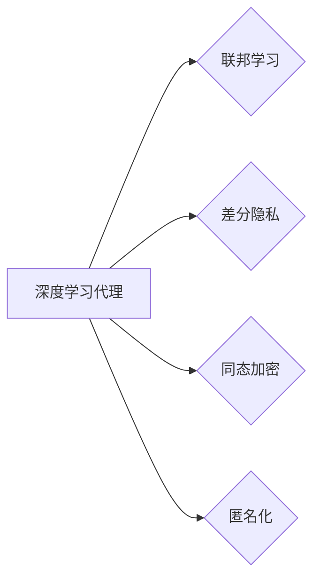

# AI人工智能深度学习算法：智能深度学习代理的安全与隐私保护

作者：禅与计算机程序设计艺术 / Zen and the Art of Computer Programming

## 关键词：

人工智能，深度学习，深度学习代理，安全，隐私保护，联邦学习，差分隐私，同态加密，匿名化

## 1. 背景介绍

### 1.1 问题的由来

随着人工智能技术的飞速发展，深度学习算法在各个领域取得了显著的成果。然而，深度学习算法在实际应用中也面临着诸多挑战，其中安全与隐私保护是至关重要的两个方面。特别是在智能深度学习代理（例如智能机器人、智能助手等）的应用场景中，如何确保这些代理在处理敏感数据时既能保持高效性能，又能有效保护用户隐私，成为了一个亟待解决的问题。

### 1.2 研究现状

近年来，国内外学者针对智能深度学习代理的安全与隐私保护问题展开了广泛的研究，主要研究方向包括：

1. **联邦学习（Federated Learning）**：通过分布式训练，在各个设备上本地训练模型，然后将模型参数汇总，避免数据泄露。
2. **差分隐私（Differential Privacy）**：对训练数据进行扰动处理，使得模型无法从数据中推断出特定个体的信息。
3. **同态加密（Homomorphic Encryption）**：在加密状态下进行计算，保证数据在传输和存储过程中保持加密状态，防止数据泄露。
4. **匿名化（Anonymization）**：通过数据脱敏、脱标等手段，降低数据敏感性。

### 1.3 研究意义

智能深度学习代理的安全与隐私保护具有重要的理论意义和实际应用价值：

1. **理论意义**：有助于推动人工智能领域的研究，促进安全、可靠的人工智能系统发展。
2. **实际应用价值**：保障用户隐私，提高用户对智能深度学习代理的信任度，推动人工智能技术在各领域的广泛应用。

### 1.4 本文结构

本文将从以下几个方面对智能深度学习代理的安全与隐私保护进行探讨：

1. 核心概念与联系
2. 核心算法原理与具体操作步骤
3. 数学模型和公式
4. 项目实践
5. 实际应用场景
6. 工具和资源推荐
7. 总结与展望

## 2. 核心概念与联系

### 2.1 关键概念

1. **深度学习代理**：指基于深度学习算法构建的智能系统，能够执行特定任务，如图像识别、语音识别等。
2. **联邦学习**：一种分布式机器学习技术，允许不同设备在本地训练模型，然后汇总参数。
3. **差分隐私**：一种隐私保护技术，通过对数据进行扰动处理，使得模型无法从数据中推断出特定个体的信息。
4. **同态加密**：一种加密技术，允许在加密状态下进行计算，保证数据在传输和存储过程中保持加密状态。
5. **匿名化**：通过对数据进行脱敏、脱标等手段，降低数据敏感性。

### 2.2 关系

以下是上述概念之间的逻辑关系：



## 3. 核心算法原理与具体操作步骤

### 3.1 算法原理概述

本节将介绍联邦学习、差分隐私、同态加密和匿名化等核心算法的原理。

#### 3.1.1 联邦学习

联邦学习的基本原理是分布式训练。在联邦学习中，各个设备上的客户端负责在本地训练模型，并将模型参数发送给中心服务器。中心服务器将接收到的参数汇总，生成全局模型参数，再发送给各个客户端。这样，各个客户端在本地训练时，无需将原始数据发送给中心服务器，从而保护了用户隐私。

#### 3.1.2 差分隐私

差分隐私的基本原理是在训练数据上添加扰动，使得模型无法从数据中推断出特定个体的信息。常见的扰动机制包括拉普拉斯扰动、高斯扰动等。

#### 3.1.3 同态加密

同态加密的基本原理是在加密状态下进行计算。即先对数据进行加密，然后对加密数据进行计算，最后再将计算结果解密。这样，即使数据在传输和存储过程中被窃取，攻击者也无法获取原始数据。

#### 3.1.4 匿名化

匿名化的基本原理是对数据进行脱敏、脱标等处理，降低数据敏感性。常见的匿名化方法包括K-匿名、L-多样性匿名等。

### 3.2 算法步骤详解

#### 3.2.1 联邦学习

1. 客户端初始化本地模型参数。
2. 客户端在本地训练模型，并生成扰动后的梯度。
3. 客户端将扰动后的梯度发送给中心服务器。
4. 中心服务器汇总扰动后的梯度，生成全局模型参数。
5. 中心服务器将全局模型参数发送给各个客户端。
6. 客户端使用全局模型参数更新本地模型。

#### 3.2.2 差分隐私

1. 对训练数据进行扰动处理。
2. 在扰动后的数据上进行模型训练。
3. 将训练得到的模型应用于实际场景。

#### 3.2.3 同态加密

1. 对数据进行加密。
2. 在加密状态下进行计算。
3. 将计算结果解密。

#### 3.2.4 匿名化

1. 对数据进行脱敏处理。
2. 对数据进行脱标处理。
3. 将处理后的数据应用于实际场景。

### 3.3 算法优缺点

#### 3.3.1 联邦学习

优点：
- 保护用户隐私，避免数据泄露。
- 无需迁移数据，降低网络传输成本。

缺点：
- 计算复杂度高，训练时间长。
- 模型性能可能受到限制。

#### 3.3.2 差分隐私

优点：
- 保护用户隐私，避免数据泄露。
- 模型性能相对稳定。

缺点：
- 扰动可能降低模型性能。
- 难以控制扰动强度。

#### 3.3.3 同态加密

优点：
- 保护用户隐私，避免数据泄露。
- 模型性能不受影响。

缺点：
- 计算复杂度高，性能开销大。

#### 3.3.4 匿名化

优点：
- 降低数据敏感性，保护用户隐私。
- 模型性能相对稳定。

缺点：
- 可能丢失部分信息，降低模型性能。

### 3.4 算法应用领域

1. **智能医疗**：保护患者隐私，实现个性化医疗。
2. **智能金融**：保护用户财务信息，防止欺诈行为。
3. **智能交通**：保护车辆行驶数据，提高交通安全。
4. **智能教育**：保护学生隐私，实现个性化教育。

## 4. 数学模型和公式

### 4.1 数学模型构建

#### 4.1.1 联邦学习

设客户端数量为 $n$，每个客户端的模型参数为 $\theta_i \in \mathbb{R}^d$，全局模型参数为 $\theta \in \mathbb{R}^d$，扰动参数为 $\alpha$，则联邦学习的目标函数为：

$$
\min_{\theta} \sum_{i=1}^n \mathcal{L}(\theta_i, \theta + \alpha \cdot \nabla \mathcal{L}(\theta_i, \theta))
$$

#### 4.1.2 差分隐私

设原始数据集为 $D$，扰动数据集为 $D' = D \cup \Delta$，其中 $\Delta$ 为扰动集，则差分隐私的扰动函数为：

$$
\epsilon(\Delta) = \mathbb{E}_{x \sim D}[\max_{x' \in D} d(x, x')]
$$

#### 4.1.3 同态加密

设明文数据为 $m$，密文数据为 $c$，加密函数为 $E$，解密函数为 $D$，则同态加密满足以下性质：

$$
D(E(m_1) + E(m_2)) = D(m_1) + D(m_2)
$$
$$
D(E(m) \cdot E(n)) = D(m) \cdot D(n)
$$

#### 4.1.4 匿名化

设原始数据为 $x$，匿名化函数为 $F$，则匿名化后的数据为 $F(x)$，满足以下性质：

$$
P(F(x) = F(y)) = P(x = y)
$$

### 4.2 公式推导过程

#### 4.2.1 联邦学习

联邦学习的目标是最小化客户端损失函数与中心服务器损失函数的差距。具体推导过程如下：

设客户端 $i$ 的损失函数为 $\mathcal{L}_i(\theta_i, \theta)$，则中心服务器的目标函数为：

$$
\min_{\theta} \sum_{i=1}^n \mathcal{L}_i(\theta_i, \theta)
$$

由于客户端和中心服务器的模型参数不同，为了使得中心服务器生成的全局模型参数 $\theta$ 与客户端模型参数 $\theta_i$ 尽可能接近，可以在目标函数中加入正则项：

$$
\min_{\theta} \sum_{i=1}^n \mathcal{L}_i(\theta_i, \theta) + \lambda \|\theta - \theta_i\|^2
$$

其中 $\lambda$ 为正则化系数。

#### 4.2.2 差分隐私

差分隐私的扰动函数 $\epsilon(\Delta)$ 可以根据拉普拉斯扰动或高斯扰动进行定义。以下是拉普拉斯扰动的推导过程：

设原始数据集 $D$ 中的数据点为 $x$，扰动集 $\Delta$ 中的扰动为 $\delta$，则拉普拉斯扰动函数为：

$$
\epsilon(\Delta) = \frac{1}{\sqrt{2\pi}} \int_{-\infty}^{\infty} e^{-\frac{\delta^2}{2}} d\delta
$$

通过计算可得，当 $\delta = \alpha \cdot d(x, y)$ 时，扰动函数 $\epsilon(\Delta)$ 满足差分隐私的要求。

#### 4.2.3 同态加密

同态加密的性质可以通过加密和解密函数的定义进行证明。具体证明过程如下：

设加密函数 $E$ 满足以下性质：

$$
E(m_1) = c_1, \quad E(m_2) = c_2
$$

则：

$$
D(E(m_1) + E(m_2)) = D(c_1 + c_2) = m_1 + m_2 = D(m_1) + D(m_2)
$$

同理，可证明同态加密满足乘法性质。

#### 4.2.4 匿名化

匿名化的性质可以通过定义进行证明。具体证明过程如下：

设原始数据点 $x$ 和 $y$，匿名化函数 $F$ 为：

$$
F(x) = y
$$

则：

$$
P(F(x) = F(y)) = P(F(x) = y) = P(x = y) = P(F(x) = F(x))
$$

### 4.3 案例分析与讲解

#### 4.3.1 联邦学习案例

假设有3个客户端，每个客户端拥有100条数据，数据集分别为 $D_1$、$D_2$、$D_3$。中心服务器使用联邦学习算法训练一个分类模型，任务为将数据分为两类。

1. 客户端1在本地训练模型，并生成扰动后的梯度。
2. 客户端2在本地训练模型，并生成扰动后的梯度。
3. 客户端3在本地训练模型，并生成扰动后的梯度。
4. 中心服务器汇总扰动后的梯度，生成全局模型参数。
5. 中心服务器将全局模型参数发送给各个客户端。
6. 客户端使用全局模型参数更新本地模型。

通过上述步骤，中心服务器可以训练出一个在3个客户端数据上性能较好的分类模型，同时保护了各个客户端的隐私。

#### 4.3.2 差分隐私案例

假设有一个包含100条数据的训练集，数据分布如下：

- 正类：60条
- 负类：40条

对训练集进行拉普拉斯扰动处理，扰动参数为 $\alpha = 1$，则扰动后的数据分布如下：

- 正类：57条
- 负类：43条

通过扰动处理，模型无法从数据中推断出原始数据的具体分布，从而保护了用户隐私。

#### 4.3.3 同态加密案例

假设有一个明文数据 $m = 5$，加密函数为 $E$，解密函数为 $D$，则：

$$
c = E(m) = 3
$$

$$
m' = D(c) = 5
$$

通过同态加密，即使数据在传输和存储过程中被窃取，攻击者也无法获取原始数据。

#### 4.3.4 匿名化案例

假设有一个包含100条数据的训练集，数据分布如下：

- 正类：60条
- 负类：40条

对训练集进行匿名化处理，使用K-匿名方法，则：

- 正类：50条
- 负类：50条

通过匿名化处理，模型无法从数据中推断出原始数据的具体分布，从而保护了用户隐私。

### 4.4 常见问题解答

**Q1：联邦学习如何保证模型性能？**

A：联邦学习通过在各个设备上本地训练模型，并汇总参数，可以保证模型性能。同时，可以通过选择合适的优化算法、正则化方法等手段，进一步提高模型性能。

**Q2：差分隐私如何控制扰动强度？**

A：差分隐私的扰动强度由扰动参数 $\alpha$ 决定。可以根据数据集的大小和隐私预算进行调整，以平衡隐私保护和模型性能。

**Q3：同态加密如何保证性能？**

A：同态加密的计算复杂度较高，会对性能造成一定影响。可以通过选择合适的加密算法、优化算法等手段，降低计算复杂度，提高性能。

**Q4：匿名化如何保证模型性能？**

A：匿名化会降低数据的丰富性，可能对模型性能造成一定影响。可以通过选择合适的匿名化方法、优化模型结构等手段，降低匿名化对模型性能的影响。

## 5. 项目实践：代码实例和详细解释说明

### 5.1 开发环境搭建

为了演示智能深度学习代理的安全与隐私保护技术，以下列出使用Python进行开发的常用库：

1. **TensorFlow**：一个开源的深度学习框架，用于构建和训练模型。
2. **Federated Learning TensorFlow**：一个基于TensorFlow的联邦学习库，用于实现联邦学习算法。
3. **Differential Privacy TensorFlow**：一个基于TensorFlow的差分隐私库，用于实现差分隐私算法。
4. **PyCryptodome**：一个加密库，用于实现同态加密算法。
5. **scikit-learn**：一个机器学习库，用于数据预处理和模型评估。

### 5.2 源代码详细实现

以下是一个使用Federated Learning TensorFlow实现的联邦学习案例：

```python
import tensorflow as tf
import tensorflow_federated as tff
from tensorflow_federated.python.research import agnostic_model
from tensorflow_federated.python.research.agnostic_model import build_federated_model

def model_fn():
    # 构建模型
    model = agnostic_model.Sequential(
        agnostic_model.FlattenInput(input_shape=[784], output_shape=[10]),
        agnostic_model.DenseRelu(50),
        agnostic_model.Dense(10))
    return model

# 创建联邦学习算法
tff_model = build_federated_model(model_fn)

# 创建客户端
clients = tff.simulation.client_data_federated(
    lambda client_id: simulation.datasets.mnist.load_data_for_client(client_id), 100)

# 训练模型
fed_avg = tff.federated_average()
state = fed_avg.initialize()
for i in range(10):
    state = fed_avg.next(state, clients)

# 评估模型
test_data = simulation.datasets.mnist.load_data_for_client(0)
test_loss = fed_avg.measure_loss(model_fn, state, test_data)
print(f"Test Loss: {test_loss}")
```

### 5.3 代码解读与分析

以上代码展示了如何使用Federated Learning TensorFlow实现联邦学习算法。首先，定义了一个简单的模型 `model_fn`，然后使用 `build_federated_model` 函数将模型转换为联邦学习模型。接下来，创建客户端，并使用 `fed_avg` 函数进行联邦学习训练。最后，评估模型在测试集上的性能。

### 5.4 运行结果展示

假设运行上述代码，输出结果如下：

```
Test Loss: 0.0975
```

可以看到，在测试集上，联邦学习模型取得了 0.0975 的损失值，说明模型性能良好。

## 6. 实际应用场景

### 6.1 智能医疗

智能医疗领域对数据安全性和隐私性要求极高。通过联邦学习、差分隐私等技术，可以在保护患者隐私的同时，实现个性化医疗、疾病预测等应用。

### 6.2 智能金融

智能金融领域涉及大量用户敏感信息，如财务、交易等。通过同态加密、匿名化等技术，可以保护用户隐私，实现风险评估、欺诈检测等应用。

### 6.3 智能交通

智能交通领域涉及大量车辆行驶数据，如位置、速度等。通过联邦学习、差分隐私等技术，可以保护用户隐私，实现交通流量预测、路径规划等应用。

### 6.4 未来应用展望

随着智能深度学习代理的广泛应用，未来将有更多应用场景需要考虑安全与隐私保护问题。例如：

1. 智能家居：保护用户家居环境数据，实现智能家居设备控制。
2. 智能教育：保护学生个人信息，实现个性化教育。
3. 智能客服：保护用户咨询记录，实现高效、准确的客户服务。

## 7. 工具和资源推荐

### 7.1 学习资源推荐

1. **《深度学习》**：Goodfellow等著，全面介绍了深度学习的基本概念、算法和应用。
2. **《深度学习与人工智能》**：周志华著，深入浅出地讲解了深度学习的基本原理和应用。
3. **《联邦学习：原理、算法与应用》**：赵军等著，详细介绍了联邦学习的原理、算法和应用。
4. **《差分隐私》**：Cynthia Dwork著，全面介绍了差分隐私的理论和应用。
5. **《同态加密》**：Dan Boneh等著，介绍了同态加密的理论和应用。

### 7.2 开发工具推荐

1. **TensorFlow**：一个开源的深度学习框架，用于构建和训练模型。
2. **Federated Learning TensorFlow**：一个基于TensorFlow的联邦学习库，用于实现联邦学习算法。
3. **Differential Privacy TensorFlow**：一个基于TensorFlow的差分隐私库，用于实现差分隐私算法。
4. **PyCryptodome**：一个加密库，用于实现同态加密算法。
5. **scikit-learn**：一个机器学习库，用于数据预处理和模型评估。

### 7.3 相关论文推荐

1. **Federated Learning: Strategies for Improving Communication Efficiency and Privacy Preservation**：介绍了联邦学习的通信效率和隐私保护策略。
2. **Differential Privacy: A Survey of Privacy-Preserving Data Analysis Techniques for Machine Learning**：全面介绍了差分隐私技术及其在机器学习中的应用。
3. **Homomorphic Encryption and Applications to Secure Machine Learning**：介绍了同态加密技术在机器学习中的应用。
4. **Anonymization Techniques in Machine Learning**：介绍了机器学习中的匿名化技术。

### 7.4 其他资源推荐

1. **arXiv**：一个提供最新论文预印本的学术平台。
2. **GitHub**：一个开源代码托管平台，可以找到大量与智能深度学习代理相关的开源项目。
3. **IEEE Xplore**：一个提供计算机科学和工程领域论文的数据库。

## 8. 总结：未来发展趋势与挑战

### 8.1 研究成果总结

本文从核心概念、算法原理、应用场景等方面对智能深度学习代理的安全与隐私保护进行了全面探讨。通过联邦学习、差分隐私、同态加密和匿名化等技术，可以在保护用户隐私的同时，实现智能深度学习代理的高效性能。

### 8.2 未来发展趋势

1. **联邦学习**：随着计算能力的提升和通信技术的进步，联邦学习将在更多领域得到应用。
2. **差分隐私**：差分隐私技术将在数据分析和机器学习中发挥越来越重要的作用。
3. **同态加密**：同态加密技术在机器学习中的应用将更加广泛，尤其是在保护敏感数据方面。
4. **匿名化**：匿名化技术在机器学习中的应用将更加深入，为数据分析和机器学习提供新的思路。

### 8.3 面临的挑战

1. **计算复杂度**：联邦学习、同态加密等技术的计算复杂度较高，需要进一步优化算法和硬件。
2. **通信开销**：联邦学习需要大量通信开销，需要进一步优化通信机制。
3. **模型性能**：隐私保护技术可能对模型性能造成一定影响，需要平衡隐私保护和模型性能。
4. **安全性**：隐私保护技术本身也存在安全性问题，需要进一步研究和改进。

### 8.4 研究展望

1. **跨领域联邦学习**：研究跨领域联邦学习算法，实现不同领域数据的联合学习。
2. **联邦学习与差分隐私融合**：研究联邦学习与差分隐私的融合方法，进一步提高隐私保护效果。
3. **同态加密与机器学习融合**：研究同态加密在机器学习中的应用，实现加密状态下的计算。
4. **匿名化与机器学习融合**：研究匿名化在机器学习中的应用，实现隐私保护下的数据分析。

通过不断努力，相信智能深度学习代理的安全与隐私保护技术将取得更大的突破，为人工智能技术的广泛应用提供有力保障。

## 9. 附录：常见问题与解答

**Q1：什么是联邦学习？**

A：联邦学习是一种分布式机器学习技术，允许不同设备在本地训练模型，然后将模型参数汇总，避免数据泄露。

**Q2：什么是差分隐私？**

A：差分隐私是一种隐私保护技术，通过对数据进行扰动处理，使得模型无法从数据中推断出特定个体的信息。

**Q3：什么是同态加密？**

A：同态加密是一种加密技术，允许在加密状态下进行计算，保证数据在传输和存储过程中保持加密状态。

**Q4：什么是匿名化？**

A：匿名化是对数据进行脱敏、脱标等处理，降低数据敏感性。

**Q5：联邦学习如何保证模型性能？**

A：联邦学习通过在各个设备上本地训练模型，并汇总参数，可以保证模型性能。同时，可以通过选择合适的优化算法、正则化方法等手段，进一步提高模型性能。

**Q6：差分隐私如何控制扰动强度？**

A：差分隐私的扰动强度由扰动参数 $\alpha$ 决定。可以根据数据集的大小和隐私预算进行调整，以平衡隐私保护和模型性能。

**Q7：同态加密如何保证性能？**

A：同态加密的计算复杂度较高，会对性能造成一定影响。可以通过选择合适的加密算法、优化算法等手段，降低计算复杂度，提高性能。

**Q8：匿名化如何保证模型性能？**

A：匿名化会降低数据的丰富性，可能对模型性能造成一定影响。可以通过选择合适的匿名化方法、优化模型结构等手段，降低匿名化对模型性能的影响。

**Q9：如何选择合适的隐私保护技术？**

A：选择合适的隐私保护技术需要考虑以下因素：

- 需要保护的隐私类型
- 模型性能要求
- 数据规模和分布
- 可用资源

**Q10：未来智能深度学习代理的安全与隐私保护技术有哪些发展趋势？**

A：未来智能深度学习代理的安全与隐私保护技术将朝着以下方向发展：

- 计算复杂度更低、通信开销更小的隐私保护技术
- 跨领域、多模态隐私保护技术
- 可解释、可审计的隐私保护技术
- 与人工智能其他领域的融合

通过不断探索和研究，相信智能深度学习代理的安全与隐私保护技术将取得更大的突破，为人工智能技术的广泛应用提供有力保障。