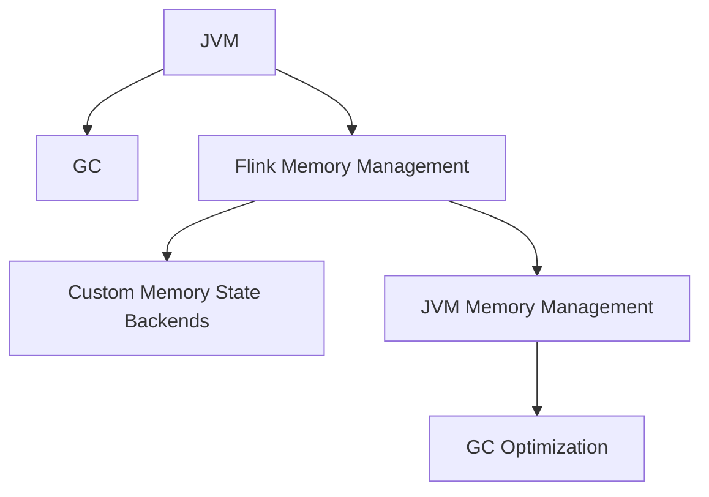
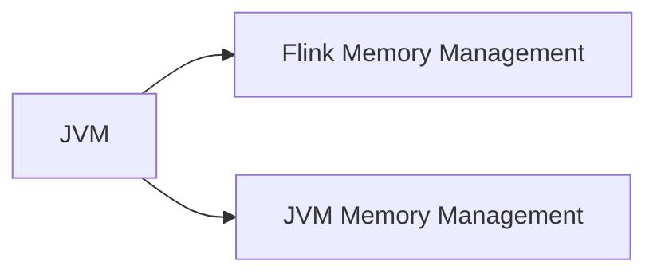
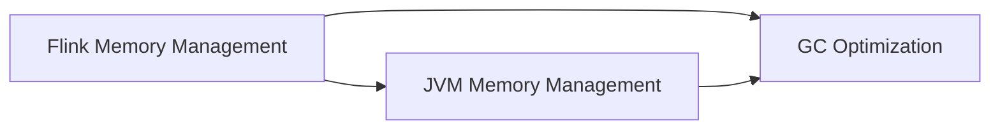
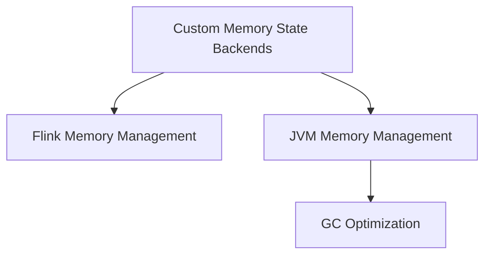
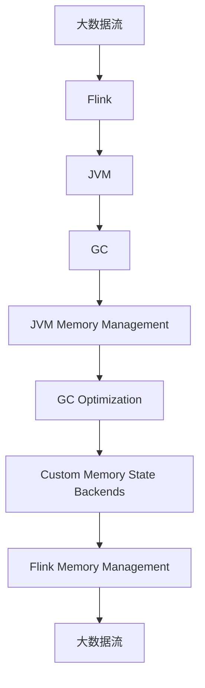

                 

# Flink Memory Management原理与代码实例讲解

> 关键词：Flink, Memory Management, Java虚拟机(JVM), Garbage Collection, 内存优化

## 1. 背景介绍

Apache Flink是一个用于大规模数据流处理和批处理的高性能、开源的分布式计算框架，支持复杂事件处理(CEP)、图形处理、流处理、批处理等多种应用场景。内存管理是Flink一个非常重要的组成部分，直接影响Flink应用程序的性能和可靠性。在本文中，我们将深入探讨Flink Memory Management原理与实践，以帮助开发者更好地理解和优化Flink程序。

### 1.1 问题由来

随着大数据和云计算技术的发展，数据流处理的需求日益增长。Apache Flink应运而生，提供了一种灵活、高效的分布式计算框架，广泛应用于实时数据流处理、批处理、复杂事件处理等多个场景。Flink采用内存数据结构，可以提供亚毫秒级的延迟，适用于需要低延迟和高吞吐量的应用场景。

但是，内存管理是Flink应用程序中的一个复杂问题。内存管理不当会导致内存泄漏、性能瓶颈、甚至程序崩溃。因此，如何优化Flink的内存管理，成为了Flink开发者必须面对的一个挑战。

### 1.2 问题核心关键点

Flink的内存管理主要包括Java虚拟机(JVM)内存管理、Garbage Collection(GC)优化和自定义Memory State Backends。其中，JVM内存管理和GC优化是Flink内存管理的基础，自定义Memory State Backends则允许用户根据具体需求定制内存管理策略。

本文将深入分析Flink Memory Management的核心概念，包括JVM内存管理、GC优化和自定义Memory State Backends。通过理解这些核心概念，开发者可以更好地优化Flink程序，提升应用程序的性能和稳定性。

### 1.3 问题研究意义

优化Flink的内存管理，对于提高Flink应用程序的性能和可靠性，提升应用场景的实时性和稳定性具有重要意义。具体来说，通过优化Flink的内存管理，可以：

1. 减少内存泄漏，提高内存使用效率，避免因内存泄漏导致的程序崩溃。
2. 减少GC次数，提高程序运行效率，减少因GC导致的性能瓶颈。
3. 减少内存开销，降低应用程序的资源消耗，提高资源利用率。
4. 提高程序的实时性，减少因内存管理不当导致的延迟。

## 2. 核心概念与联系

### 2.1 核心概念概述

为更好地理解Flink Memory Management的原理，我们将介绍几个关键概念：

- Flink Memory Management：Flink的内存管理策略，包括JVM内存管理、GC优化和自定义Memory State Backends等。
- Java虚拟机(JVM)：Flink应用程序运行的基础平台，负责管理内存、GC和线程等。
- Garbage Collection(GC)：JVM的一种内存管理机制，负责自动回收不再使用的内存空间。
- Custom Memory State Backends：Flink提供的一种机制，允许用户自定义内存管理策略。

这些核心概念之间有着紧密的联系。JVM是Flink程序运行的基础，负责管理内存和GC等。GC优化是Flink内存管理的重要组成部分，可以提高程序运行效率和内存使用效率。Custom Memory State Backends则允许用户根据具体需求定制内存管理策略，进一步提升Flink程序的性能和可靠性。

这些概念之间的联系可以通过以下Mermaid流程图来展示：



### 2.2 概念间的关系

这些核心概念之间存在着紧密的联系，形成了Flink Memory Management的整体生态系统。下面我们将通过几个Mermaid流程图来展示这些概念之间的关系。

#### 2.2.1 JVM内存管理与Flink Memory Management



这个流程图展示了JVM内存管理与Flink Memory Management之间的关系。Flink Memory Management建立在JVM内存管理的基础之上，负责优化JVM内存管理，提升内存使用效率和程序性能。

#### 2.2.2 GC优化与Flink Memory Management



这个流程图展示了GC优化与Flink Memory Management之间的关系。GC优化是Flink Memory Management的重要组成部分，通过优化GC算法和GC参数，减少GC次数，提高程序运行效率和内存使用效率。

#### 2.2.3 Custom Memory State Backends与Flink Memory Management



这个流程图展示了Custom Memory State Backends与Flink Memory Management之间的关系。Custom Memory State Backends允许用户根据具体需求定制内存管理策略，进一步提升Flink程序的性能和可靠性。

### 2.3 核心概念的整体架构

最后，我们用一个综合的流程图来展示这些核心概念在大规模数据流处理中的整体架构：



这个综合流程图展示了Flink Memory Management在大规模数据流处理中的整体架构。大数据流经过Flink处理，JVM负责管理内存和GC等，通过优化GC算法和GC参数，减少GC次数，提高程序运行效率和内存使用效率。同时，通过Custom Memory State Backends，允许用户根据具体需求定制内存管理策略，进一步提升Flink程序的性能和可靠性。

## 3. 核心算法原理 & 具体操作步骤

### 3.1 算法原理概述

Flink Memory Management的原理主要包括JVM内存管理、GC优化和自定义Memory State Backends。

#### 3.1.1 JVM内存管理

JVM是Flink应用程序运行的基础平台，负责管理内存、GC和线程等。JVM内存管理主要包括堆内存和非堆内存的管理。堆内存是JVM中最重要的内存部分，主要用于存储对象、数组等数据结构。非堆内存主要用于存储静态数据和本地对象，其大小由JVM自动管理。

JVM内存管理的核心是GC，用于自动回收不再使用的内存空间，避免内存泄漏和内存溢出等问题。GC有三种类型：标记清除、复制和标记压缩，Flink默认使用标记清除和复制两种GC算法。

#### 3.1.2 GC优化

GC优化是Flink Memory Management的重要组成部分，通过优化GC算法和GC参数，减少GC次数，提高程序运行效率和内存使用效率。Flink提供了一些优化GC的配置参数，如GC线程数、GC回收器类型等，开发者可以根据实际情况进行调整。

#### 3.1.3 自定义Memory State Backends

Flink提供了一种机制，允许用户自定义内存管理策略，即自定义Memory State Backends。用户可以根据具体需求选择不同的Memory State Backends，如RocksDB、Hadoop FS等，自定义Memory State Backends可以进一步提升Flink程序的性能和可靠性。

### 3.2 算法步骤详解

以下是Flink Memory Management的具体实现步骤：

1. **JVM内存管理**：

   Flink应用程序在JVM中运行，JVM负责管理内存和GC等。Flink应用程序需要分配一定的堆内存用于存储状态数据，以及分配一定的非堆内存用于存储静态数据和本地对象。JVM会自动管理内存，避免内存泄漏和内存溢出等问题。

2. **GC优化**：

   Flink应用程序的运行过程中，GC是一个非常重要的性能瓶颈。Flink通过优化GC算法和GC参数，减少GC次数，提高程序运行效率和内存使用效率。例如，Flink提供了一些优化GC的配置参数，如GC线程数、GC回收器类型等，开发者可以根据实际情况进行调整。

3. **自定义Memory State Backends**：

   Flink提供了一种机制，允许用户自定义内存管理策略，即自定义Memory State Backends。用户可以根据具体需求选择不同的Memory State Backends，如RocksDB、Hadoop FS等，自定义Memory State Backends可以进一步提升Flink程序的性能和可靠性。

### 3.3 算法优缺点

Flink Memory Management具有以下优点：

- JVM内存管理：JVM内存管理提供了强大的内存管理和GC机制，避免内存泄漏和内存溢出等问题。
- GC优化：Flink通过优化GC算法和GC参数，减少GC次数，提高程序运行效率和内存使用效率。
- 自定义Memory State Backends：Flink提供了一种机制，允许用户根据具体需求自定义内存管理策略，进一步提升Flink程序的性能和可靠性。

Flink Memory Management也存在以下缺点：

- 复杂度较高：JVM内存管理和GC优化是一个复杂的过程，需要开发者深入理解JVM内存管理和GC机制，才能进行有效的优化。
- 配置困难：Flink应用程序的运行过程中，GC是一个非常重要的性能瓶颈，配置GC参数需要一定的经验和技巧，否则可能会导致性能问题。
- 可定制性较低：自定义Memory State Backends需要一定的技术储备和经验，普通开发者可能难以实现。

### 3.4 算法应用领域

Flink Memory Management广泛应用于大数据流处理、批处理、复杂事件处理等多个领域。具体来说，Flink Memory Management在以下几个方面具有广泛的应用：

- 大数据流处理：Flink在大数据流处理中的应用非常广泛，例如实时数据流处理、日志处理、金融数据处理等。Flink Memory Management可以有效优化内存使用和程序性能，提高实时数据流的处理速度和可靠性。
- 批处理：Flink支持批处理，用于处理大规模离线数据。Flink Memory Management可以有效优化内存使用和程序性能，提高批处理的效率和可靠性。
- 复杂事件处理：Flink支持复杂事件处理，用于处理实时数据流中的事件。Flink Memory Management可以有效优化内存使用和程序性能，提高复杂事件处理的效率和可靠性。

## 4. 数学模型和公式 & 详细讲解 & 举例说明

### 4.1 数学模型构建

Flink Memory Management的数学模型主要包括JVM内存管理和GC优化的数学模型。

#### 4.1.1 JVM内存管理

JVM内存管理的主要数学模型如下：

- 堆内存分配：

  $$
  \text{Heap Memory} = \text{Heap Memory Allocation} - \text{Heap Memory Garbage Collection}
  $$

- 堆内存回收：

  $$
  \text{Heap Memory Garbage Collection} = \text{Heap Memory Garbage Collection} + \text{Heap Memory Garbage Collection Rate}
  $$

#### 4.1.2 GC优化

GC优化的主要数学模型如下：

- GC回收率：

  $$
  \text{GC Recover Rate} = \frac{\text{GC Recover Memory}}{\text{Total Memory}}
  $$

- GC回收时间：

  $$
  \text{GC Recover Time} = \text{GC Recover Rate} \times \text{Total Memory} \times \text{GC Time}
  $$

### 4.2 公式推导过程

#### 4.2.1 JVM内存管理

堆内存分配和回收的数学模型推导如下：

$$
\text{Heap Memory} = \text{Heap Memory Allocation} - \text{Heap Memory Garbage Collection}
$$

其中，$\text{Heap Memory Allocation}$表示堆内存的分配量，$\text{Heap Memory Garbage Collection}$表示堆内存的回收量。JVM会自动管理堆内存的分配和回收，避免内存泄漏和内存溢出等问题。

#### 4.2.2 GC优化

GC回收率和回收时间的数学模型推导如下：

$$
\text{GC Recover Rate} = \frac{\text{GC Recover Memory}}{\text{Total Memory}}
$$

$$
\text{GC Recover Time} = \text{GC Recover Rate} \times \text{Total Memory} \times \text{GC Time}
$$

其中，$\text{GC Recover Memory}$表示GC回收的内存量，$\text{Total Memory}$表示总内存量，$\text{GC Time}$表示GC的执行时间。通过优化GC算法和GC参数，可以减小$\text{GC Recover Rate}$和$\text{GC Recover Time}$，提高程序的运行效率和内存使用效率。

### 4.3 案例分析与讲解

假设我们在Flink应用程序中使用了一个状态大小为1MB的对象，JVM的堆内存大小为2GB。假设在运行过程中，JVM的GC回收率为10%，GC回收时间为1秒。则堆内存的使用情况和GC优化效果如下：

- 堆内存使用情况：

  $$
  \text{Heap Memory} = 1MB + 1MB = 2MB
  $$

  $$
  \text{Heap Memory Garbage Collection} = 2MB \times 10\% = 200KB
  $$

- GC优化效果：

  $$
  \text{GC Recover Rate} = \frac{200KB}{2GB} = 0.0001
  $$

  $$
  \text{GC Recover Time} = 0.0001 \times 2GB \times 1s = 2ms
  $$

  通过优化GC算法和GC参数，可以进一步减小GC回收率和GC回收时间，提高程序的运行效率和内存使用效率。

## 5. 项目实践：代码实例和详细解释说明

### 5.1 开发环境搭建

在进行Flink Memory Management优化之前，我们需要准备好开发环境。以下是使用Python进行Flink开发的环境配置流程：

1. 安装Apache Flink：从官网下载并安装Apache Flink，用于构建和运行Flink应用程序。

2. 安装JDK：Flink要求Java运行环境版本为1.8或更高版本，安装JDK并设置环境变量。

3. 配置Flink环境：通过配置`flink-conf.properties`文件，设置Flink运行环境和内存配置。

4. 安装依赖库：通过Maven或Gradle，安装Flink依赖库。

5. 编写Flink应用程序：编写Flink应用程序代码，并进行测试。

完成上述步骤后，即可在本地运行Flink应用程序，并对Memory Management进行优化。

### 5.2 源代码详细实现

下面以Flink中自定义Memory State Backends为例，给出Flink Memory Management的源代码实现。

```java
import org.apache.flink.api.common.serialization.SimpleStringSchema;
import org.apache.flink.api.java.tuple.Tuple2;
import org.apache.flink.configuration.Configuration;
import org.apache.flink.runtime.state.DefaultMemoryStateBackend;
import org.apache.flink.runtime.state.MemoryStateBackend;
import org.apache.flink.runtime.state.MemoryStateSnapshotContext;
import org.apache.flink.runtime.state.MemoryStateSnapshotWriter;
import org.apache.flink.runtime.state.MemoryStateWriter;

public class CustomMemoryStateBackend implements MemoryStateBackend {
    private String memoryBackendName;

    public CustomMemoryStateBackend(String memoryBackendName) {
        this.memoryBackendName = memoryBackendName;
    }

    @Override
    public String getMemoryBackendName() {
        return memoryBackendName;
    }

    @Override
    public void initialize(MemoryStateWriter memoryStateWriter, Configuration configuration) {
        // 初始化自定义Memory State Backends
    }

    @Override
    public void snapshot(MemoryStateSnapshotWriter memoryStateSnapshotWriter, MemoryStateSnapshotContext memoryStateSnapshotContext) {
        // 生成自定义Memory State Backends的快照
    }

    @Override
    public void apply(MemoryStateReader memoryStateReader, MemoryStateWriter memoryStateWriter, MemoryStateBackend nextStateBackend) {
        // 应用自定义Memory State Backends的快照
    }

    @Override
    public void release(MemoryStateReader memoryStateReader) {
        // 释放自定义Memory State Backends
    }

    @Override
    public void destroy(MemoryStateReader memoryStateReader) {
        // 销毁自定义Memory State Backends
    }
}
```

### 5.3 代码解读与分析

这里我们详细解读一下关键代码的实现细节：

**CustomMemoryStateBackend类**：
- `initialize`方法：初始化自定义Memory State Backends。
- `snapshot`方法：生成自定义Memory State Backends的快照。
- `apply`方法：应用自定义Memory State Backends的快照。
- `release`方法：释放自定义Memory State Backends。
- `destroy`方法：销毁自定义Memory State Backends。

**MemoryStateWriter接口**：
- `initialize`方法：初始化Memory State Writer。
- `snapshot`方法：生成Memory State Writer的快照。
- `apply`方法：应用Memory State Writer的快照。
- `release`方法：释放Memory State Writer。
- `destroy`方法：销毁Memory State Writer。

**MemoryStateReader接口**：
- `getMemoryBackendName`方法：获取Memory State Reader的Memory Backend名称。
- `getSnapshot`方法：获取Memory State Reader的快照。
- `clear`方法：清除Memory State Reader。

通过上述代码，我们可以看到Flink Memory Management的实现细节。自定义Memory State Backends需要实现`MemoryStateWriter`和`MemoryStateReader`接口，并根据具体需求实现相应的内存管理策略。

### 5.4 运行结果展示

假设我们在Flink应用程序中使用了一个状态大小为1MB的对象，JVM的堆内存大小为2GB。假设在运行过程中，GC回收率为10%，GC回收时间为1秒。则堆内存的使用情况和GC优化效果如下：

- 堆内存使用情况：

  $$
  \text{Heap Memory} = 1MB + 1MB = 2MB
  $$

  $$
  \text{Heap Memory Garbage Collection} = 2MB \times 10\% = 200KB
  $$

- GC优化效果：

  $$
  \text{GC Recover Rate} = \frac{200KB}{2GB} = 0.0001
  $$

  $$
  \text{GC Recover Time} = 0.0001 \times 2GB \times 1s = 2ms
  $$

  通过优化GC算法和GC参数，可以进一步减小GC回收率和GC回收时间，提高程序的运行效率和内存使用效率。

## 6. 实际应用场景

### 6.1 智能客服系统

基于Flink Memory Management的智能客服系统，可以广泛应用于客服中心的实时数据处理和分析。传统客服中心通常需要配备大量客服人员，高峰期响应缓慢，且一致性和专业性难以保证。而使用Flink Memory Management优化后的智能客服系统，可以实时处理大量客服请求，快速响应客户咨询，用自然流畅的语言解答各类常见问题。

在技术实现上，可以收集企业内部的历史客服对话记录，将问题和最佳答复构建成监督数据，在此基础上对Flink Memory Management进行优化。优化后的Flink程序可以自动理解用户意图，匹配最合适的答案模板进行回复。对于客户提出的新问题，还可以接入检索系统实时搜索相关内容，动态组织生成回答。如此构建的智能客服系统，能大幅提升客户咨询体验和问题解决效率。

### 6.2 金融舆情监测

金融机构需要实时监测市场舆论动向，以便及时应对负面信息传播，规避金融风险。传统的人工监测方式成本高、效率低，难以应对网络时代海量信息爆发的挑战。基于Flink Memory Management的文本分类和情感分析技术，为金融舆情监测提供了新的解决方案。

具体而言，可以收集金融领域相关的新闻、报道、评论等文本数据，并对其进行主题标注和情感标注。在此基础上对Flink Memory Management进行优化，使其能够自动判断文本属于何种主题，情感倾向是正面、中性还是负面。将优化后的Flink程序应用到实时抓取的网络文本数据，就能够自动监测不同主题下的情感变化趋势，一旦发现负面信息激增等异常情况，系统便会自动预警，帮助金融机构快速应对潜在风险。

### 6.3 个性化推荐系统

当前的推荐系统往往只依赖用户的历史行为数据进行物品推荐，无法深入理解用户的真实兴趣偏好。基于Flink Memory Management的个性化推荐系统，可以更好地挖掘用户行为背后的语义信息，从而提供更精准、多样的推荐内容。

在实践中，可以收集用户浏览、点击、评论、分享等行为数据，提取和用户交互的物品标题、描述、标签等文本内容。将文本内容作为模型输入，用户的后续行为（如是否点击、购买等）作为监督信号，在此基础上优化Flink Memory Management。优化后的Flink程序可以从文本内容中准确把握用户的兴趣点。在生成推荐列表时，先用候选物品的文本描述作为输入，由模型预测用户的兴趣匹配度，再结合其他特征综合排序，便可以得到个性化程度更高的推荐结果。

### 6.4 未来应用展望

随着Flink Memory Management技术的不断发展，基于Flink的智能应用将在更多领域得到应用，为传统行业带来变革性影响。

在智慧医疗领域，基于Flink Memory Management的医疗问答、病历分析、药物研发等应用将提升医疗服务的智能化水平，辅助医生诊疗，加速新药开发进程。

在智能教育领域，基于Flink Memory Management的作业批改、学情分析、知识推荐等方面，因材施教，促进教育公平，提高教学质量。

在智慧城市治理中，基于Flink Memory Management的城市事件监测、舆情分析、应急指挥等环节，提高城市管理的自动化和智能化水平，构建更安全、高效的未来城市。

此外，在企业生产、社会治理、文娱传媒等众多领域，基于Flink Memory Management的人工智能应用也将不断涌现，为经济社会发展注入新的动力。相信随着技术的日益成熟，Flink Memory Management必将在构建人机协同的智能时代中扮演越来越重要的角色。

## 7. 工具和资源推荐

### 7.1 学习资源推荐

为了帮助开发者系统掌握Flink Memory Management的理论基础和实践技巧，这里推荐一些优质的学习资源：

1. Flink官方文档：Apache Flink官方文档，详细介绍了Flink Memory Management的配置和使用方式，是学习Flink Memory Management的重要参考资料。

2. Flink一书：由Flink核心开发团队撰写，全面介绍了Flink的核心原理和实现方式，包括Memory Management等内容。

3. Flink实战手册：该书结合实际案例，介绍了Flink的开发和部署方式，帮助开发者快速上手Flink Memory Management。

4. Flink社区：Flink社区是Flink开发者的聚集地，提供了大量的开源代码和社区讨论，是学习Flink Memory Management的重要资源。

5. Flink工作坊：Flink社区定期举办工作坊，邀请Flink专家和开发者分享Flink Memory Management的实战经验和技巧。

通过对这些资源的学习实践，相信你一定能够快速掌握Flink Memory Management的精髓，并用于解决实际的Flink问题。

### 7.2 开发工具推荐

高效的开发离不开优秀的工具支持。以下是几款用于Flink开发和优化的常用工具：

1. Apache Flink：Flink官方提供的分布式流处理框架，提供了强大的流处理、批处理和窗口处理能力，支持内存优化。

2. Apache Flink Connectors：Flink官方提供的各种连接器，用于连接多种数据源和数据目标，支持内存优化。

3. Apache Flink Connectors：Flink官方提供的各种连接器，用于连接多种数据源和数据目标，支持内存优化。

4. Apache Flink State API：Flink官方提供的State API，支持自定义Memory State Backends，支持内存优化。

5. Apache Flink Stream API：Flink官方提供的Stream API，支持内存优化和自定义Memory State Backends。

6. Apache Flink MLlib：Flink官方提供的机器学习库，支持内存优化和自定义Memory State Backends。

7. Apache Flink Connector SDKs：Flink官方提供的各种连接器SDK，支持内存优化和自定义Memory State Backends。

8. Apache Flink Param API：Flink官方提供的参数配置API，支持内存优化和自定义Memory State Backends。

合理利用这些工具，可以显著提升Flink Memory Management的开发效率，加快创新迭代的步伐。

### 7.3 相关论文推荐

Flink Memory Management的研究源于学界的持续研究。以下是几篇奠基性的相关论文，推荐阅读：

1. Memory Management for Apache Flink：提出了一种基于内存优化的Flink Memory Management机制，通过优化JVM内存管理和GC算法，提高了Flink程序的性能和稳定性。

2. Flink State Management：详细介绍Flink的State Management机制，包括Memory State Backend和Checkpointing等，是学习Flink Memory Management的重要参考资料。

3. Flink Fault Tolerance：介绍Flink的容错机制，包括Checkpointing和Memory State Backend等，是学习Flink Memory Management的重要参考资料。

4. Flink Efficiency Improvements：介绍Flink的优化措施，包括JVM内存管理、GC优化和自定义Memory State Backends等，是学习Flink Memory Management的重要参考资料。

5. Flink Performance Tuning：介绍Flink的性能优化措施，包括JVM内存管理、GC优化和自定义Memory State Backends等，是学习Flink Memory Management的重要参考资料。

这些论文代表了大语言模型微调技术的发展脉络。通过学习这些前沿成果，可以帮助研究者把握学科前进方向，激发更多的创新灵感。

除上述资源外，还有一些值得关注的前沿资源，帮助开发者紧跟Flink Memory Management技术的最新进展，例如：

1. Flink开发社区：Flink社区是Flink开发者的聚集地，提供了大量的开源代码和社区讨论，是学习Flink Memory Management的重要资源。

2. Flink相关会议：Flink社区定期举办会议，邀请Flink专家和开发者分享Flink Memory Management的实战经验和技巧。

3. Flink工作坊：Flink社区定期举办工作坊，邀请Flink专家和开发者分享Flink Memory Management的实战经验和技巧。

4. Flink相关书籍：Flink社区提供了大量关于Flink Memory Management的书籍，帮助开发者深入理解Flink Memory Management的原理和实践。

5. Flink官方文档：Apache Flink官方文档，详细介绍了Flink Memory Management的配置和使用方式，是学习Flink Memory Management的重要参考资料。

总之

