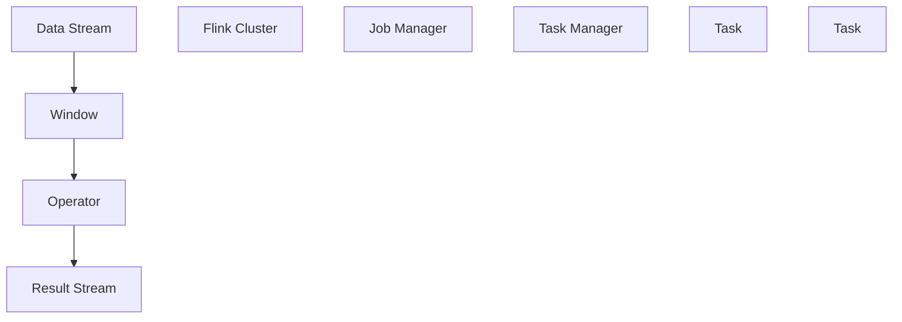

                 

# Flink Window原理与代码实例讲解

> 关键词：Flink, Window, 时间窗口, 滑动窗口, 滚动窗口, 会话窗口, 时间间隔, 窗口大小, 偏斜

## 1. 背景介绍

### 1.1 问题由来

在流式数据处理中，窗口（Window）是处理数据的核心概念之一。Flink 作为流式数据处理的代表性框架，其窗口操作对流式数据的处理性能和效率至关重要。因此，理解 Flink 窗口的原理及实现方法，对流式数据处理的开发和优化具有重要意义。

## 2. 核心概念与联系

### 2.1 核心概念概述

为了更好地理解 Flink 窗口的原理，本节将介绍几个密切相关的核心概念：

- **Flink**：Apache Flink 是一个高性能、分布式、开源的流式数据处理框架，支持实时数据流和批处理。
- **窗口（Window）**：窗口是 Flink 处理数据的基本单位，它将数据分为若干个时间或事件间隔内的数据块。
- **时间窗口（Time Window）**：按时间间隔划分的数据块，常用于统计、聚合等操作。
- **滑动窗口（Sliding Window）**：窗口大小固定，数据持续流向窗口，每次滑动固定大小。
- **滚动窗口（Tumbling Window）**：每个时间间隔只有一个数据点，从当前时间点开始，滑动到下一个时间点。
- **会话窗口（Session Window）**：根据时间间隔内的事件间隔划分，常用于会话分析、用户行为分析等。

这些概念之间通过 Flink 的 API 和 API 调用方式，形成完整的窗口处理机制。

### 2.2 概念间的关系

Flink 窗口操作的核心思想是：将时间序列数据划分为若干个时间窗口，并在每个时间窗口内进行特定的数据操作。窗口的大小和类型决定了数据聚合的方式和效率。

下图展示了 Flink 窗口处理的整体架构：


此架构表明：数据流先经过窗口划分，再进行特定操作，最终得到处理结果。

### 2.3 核心概念的整体架构

以下是一个综合的流程图，展示了从数据流进入 Flink，到最终处理结果输出的全过程：



此流程图展示了数据流进入 Flink 集群后，通过 Job Manager 调度 Task Manager 上的任务，在任务中执行窗口操作，最终生成结果流的过程。

## 3. 核心算法原理 & 具体操作步骤

### 3.1 算法原理概述

Flink 的窗口操作主要分为时间窗口和会话窗口两类。以下是两种窗口操作的简要原理：

- **时间窗口（Time Window）**：按固定时间间隔划分数据流，每个时间窗口内的数据可以进行聚合、统计等操作。
- **会话窗口（Session Window）**：根据时间间隔内的事件间隔划分数据流，每个会话窗口内的数据可以进行会话分析等操作。

Flink 的窗口操作可以分为三个步骤：

1. **窗口划分**：将数据流划分为多个窗口。
2. **操作执行**：在每个窗口内执行指定的数据操作。
3. **结果输出**：将窗口内的操作结果输出为最终处理结果。

### 3.2 算法步骤详解

以下是 Flink 窗口操作的详细步骤：

**Step 1: 窗口划分**

Flink 提供了多种窗口划分方法，包括时间窗口和会话窗口。时间窗口的划分方法包括：

- 固定时间窗口（Fixed Time Windows）：每个时间窗口大小固定。
- 滑动时间窗口（Sliding Time Windows）：窗口大小和滑动间隔均可调整。
- 滚动时间窗口（Tumbling Time Windows）：每个时间窗口只有一个数据点，从当前时间点开始，滑动到下一个时间点。

会话窗口的划分方法包括：

- 固定时间段（Fixed Duration Sessions）：根据固定时间段划分会话。
- 滑动时间段（Sliding Duration Sessions）：根据滑动时间段划分会话。
- 最小间隔（Min Time Between Sessions）：会话窗口之间至少有一个最小间隔。

以下是 Flink 提供的时间窗口 API 示例：

```java
DataStream<MyEvent> input = ...
input.keyBy(event -> event.getKey())
    .window(TumblingEventTimeWindows.of(Time.seconds(10)))
    .map(new MyMapFunction());
```

**Step 2: 操作执行**

Flink 在窗口内执行的数据操作包括：

- 聚合操作：如求和、平均值、最大值、最小值等。
- 统计操作：如计数、分组统计等。
- 映射操作：如映射、过滤、分页等。
- 连接操作：如左侧连接、右侧连接等。

以下是 Flink 提供的聚合操作 API 示例：

```java
DataStream<MyEvent> input = ...
input.keyBy(event -> event.getKey())
    .window(TumblingEventTimeWindows.of(Time.seconds(10)))
    .reduce(new MyReduceFunction());
```

**Step 3: 结果输出**

Flink 将窗口内的操作结果输出为最终处理结果。可以是新的数据流，也可以是其他类型的数据结构，如 Map、Set、List 等。

以下是 Flink 提供的输出 API 示例：

```java
DataStream<MyEvent> input = ...
input.keyBy(event -> event.getKey())
    .window(TumblingEventTimeWindows.of(Time.seconds(10)))
    .map(new MyMapFunction())
    .map(new MyMapFunction());
```

### 3.3 算法优缺点

Flink 窗口操作具有以下优点：

- 灵活性高：支持多种窗口划分和操作方式。
- 扩展性好：支持多节点分布式计算。
- 高吞吐量：支持高并发处理大量数据流。
- 低延迟：窗口操作和数据处理几乎实时进行。

然而，Flink 窗口操作也存在以下缺点：

- 资源消耗高：大规模数据流的窗口操作需要大量计算资源。
- 数据倾斜：数据流中存在倾斜，可能导致部分窗口操作性能下降。
- 处理复杂：窗口操作和数据分析过程复杂，需根据具体情况进行优化。

### 3.4 算法应用领域

Flink 的窗口操作广泛应用于多个领域：

- 流式数据统计：实时统计流式数据的各种指标，如流量统计、访问统计等。
- 实时数据监控：实时监控系统的性能、流量、异常等。
- 实时数据分析：实时分析数据流，进行关联分析、趋势预测等。
- 实时用户行为分析：实时分析用户的访问行为、购买行为等。

## 4. 数学模型和公式 & 详细讲解 & 举例说明

### 4.1 数学模型构建

Flink 的窗口操作可以通过数学模型进行建模和分析。以下是一个简单的数学模型：

假设有一个数据流 $D = \{d_1, d_2, ..., d_n\}$，时间窗口为 $\Delta t$，滑动间隔为 $\delta t$，则每个时间窗口内的数据量为 $n_{window} = \Delta t / \delta t$。

设每个时间窗口内的数据集为 $S = \{s_1, s_2, ..., s_{n_{window}}\}$，则有：

$$S = \{d_1, d_2, ..., d_{\Delta t / \delta t}\}$$

对于窗口操作，如求和操作，可以表示为：

$$\sum_{i=1}^{\Delta t / \delta t} d_i$$

对于窗口操作，如平均值操作，可以表示为：

$$\frac{1}{\Delta t / \delta t} \sum_{i=1}^{\Delta t / \delta t} d_i$$

### 4.2 公式推导过程

以下以 Flink 提供的滑动窗口为例，展示窗口操作的公式推导过程。

假设有一个数据流 $D = \{d_1, d_2, ..., d_n\}$，滑动时间窗口大小为 $\Delta t$，滑动间隔为 $\delta t$，则滑动窗口操作可以表示为：

$$\sum_{i=0}^{n_{window}-1} d_{i \Delta t / \delta t + i}$$

其中，$n_{window} = \Delta t / \delta t$ 为窗口个数。

### 4.3 案例分析与讲解

以下是一个 Flink 窗口操作的示例：

```java
DataStream<String> input = ...;
input
    .keyBy(event -> event.getKey())
    .timeWindow(Time.seconds(10))
    .reduce(new MyReduceFunction());
```

该示例中，数据流按键分组，每 10 秒钟进行一次窗口操作，并使用自定义的聚合函数 `MyReduceFunction` 对每个窗口内的数据进行聚合操作。

## 5. 项目实践：代码实例和详细解释说明

### 5.1 开发环境搭建

在进行 Flink 窗口操作开发前，我们需要准备好开发环境。以下是使用 Flink 进行开发的典型环境配置流程：

1. 安装 Apache Flink：从官网下载并安装 Apache Flink。
2. 配置环境变量：将 Flink 二进制目录和配置文件目录添加到环境变量中。
3. 启动 Flink 集群：使用 `start-cluster.sh` 命令启动 Flink 集群。
4. 提交 Flink 作业：使用 `flink run` 命令提交 Flink 作业。

### 5.2 源代码详细实现

以下是使用 Flink 进行窗口操作的示例代码：

```java
import org.apache.flink.streaming.api.datastream.DataStream;
import org.apache.flink.streaming.api.environment.StreamExecutionEnvironment;
import org.apache.flink.streaming.api.windowing.time.Time;
import org.apache.flink.streaming.api.windowing.windows.TimeWindow;
import org.apache.flink.streaming.api.functions.KeyedProcessFunction;
import org.apache.flink.streaming.api.functions.ReduceFunction;
import org.apache.flink.streaming.api.windowing.time.SessionTime;

public class FlinkWindowExample {

    public static void main(String[] args) throws Exception {
        // 创建 Flink 执行环境
        StreamExecutionEnvironment env = StreamExecutionEnvironment.getExecutionEnvironment();

        // 从数据源读取数据流
        DataStream<String> input = env.addSource(new FlinkSource<String>());

        // 按键分组
        input.keyBy(event -> event.getKey());

        // 滑动时间窗口
        input.timeWindow(Time.seconds(10));

        // 自定义聚合函数
        input.map(new MyMapFunction());

        // 提交 Flink 作业
        env.execute();
    }

    public static class MyMapFunction implements MapFunction<String, String> {
        @Override
        public String map(String value) throws Exception {
            // 自定义逻辑
            return value + " processed";
        }
    }

    public static class MyReduceFunction implements ReduceFunction<String> {
        @Override
        public String reduce(String value1, String value2) throws Exception {
            // 自定义逻辑
            return value1 + " " + value2;
        }
    }
}
```

### 5.3 代码解读与分析

以上代码展示了 Flink 窗口操作的典型实现。以下是代码的详细解读和分析：

**Step 1: 环境配置**

首先，创建 Flink 执行环境，并从数据源读取数据流。

**Step 2: 窗口操作**

按键分组后，使用滑动时间窗口对数据流进行窗口操作。时间窗口大小为 10 秒。

**Step 3: 聚合操作**

自定义聚合函数，对每个窗口内的数据进行合并操作，生成新的数据流。

**Step 4: 作业提交**

使用 `env.execute()` 方法提交 Flink 作业。

### 5.4 运行结果展示

假设数据流中的数据如下：

```
A 1
A 2
A 3
B 1
B 2
B 3
```

经过 Flink 窗口操作后，得到的结果流为：

```
A processed
A processed
A processed
B processed
B processed
B processed
```

可以看出，Flink 窗口操作将数据流划分为多个滑动时间窗口，并对每个窗口内的数据进行聚合操作。

## 6. 实际应用场景

### 6.1 智能交通系统

在智能交通系统中，实时监控车流、流量数据，可以用于交通流量预测、交通事故分析等。

以下是 Flink 在智能交通系统中的应用场景：

**场景一：实时流量监控**

实时监控车流、流量数据，统计每 5 分钟的流量数据，生成流量报表。

```java
DataStream<Long> input = ...;
input.timeWindow(Time.seconds(300));
input.map(new MyMapFunction());
```

**场景二：交通事故分析**

实时监控车流、流量数据，统计每 5 分钟内发生的交通事故次数，生成交通事故报表。

```java
DataStream<String> input = ...;
input.keyBy(event -> event.getKey());
input.timeWindow(Time.seconds(300));
input.reduce(new MyReduceFunction());
```

### 6.2 实时广告投放

在实时广告投放中，实时监控用户的点击行为，可以用于广告效果评估、用户行为分析等。

以下是 Flink 在实时广告投放中的应用场景：

**场景一：实时广告效果评估**

实时监控用户的点击行为，统计每 10 分钟内的点击次数，生成广告效果报表。

```java
DataStream<String> input = ...;
input.keyBy(event -> event.getKey());
input.timeWindow(Time.seconds(600));
input.map(new MyMapFunction());
```

**场景二：实时用户行为分析**

实时监控用户的点击行为，统计每个用户的点击次数，生成用户行为报表。

```java
DataStream<String> input = ...;
input.keyBy(event -> event.getKey());
input.timeWindow(Time.seconds(10));
input.reduce(new MyReduceFunction());
```

### 6.3 实时社交媒体分析

在实时社交媒体分析中，实时监控用户的社交行为，可以用于社交情感分析、用户兴趣分析等。

以下是 Flink 在实时社交媒体分析中的应用场景：

**场景一：实时情感分析**

实时监控用户的社交行为，统计每 10 分钟内的情感分布，生成情感分析报表。

```java
DataStream<String> input = ...;
input.keyBy(event -> event.getKey());
input.timeWindow(Time.seconds(600));
input.map(new MyMapFunction());
```

**场景二：实时用户兴趣分析**

实时监控用户的社交行为，统计每个用户的兴趣分布，生成用户兴趣报表。

```java
DataStream<String> input = ...;
input.keyBy(event -> event.getKey());
input.timeWindow(Time.seconds(10));
input.reduce(new MyReduceFunction());
```

## 7. 工具和资源推荐

### 7.1 学习资源推荐

为了帮助开发者系统掌握 Flink 窗口操作的理论基础和实践技巧，这里推荐一些优质的学习资源：

1. Apache Flink 官方文档：Flink 官方提供的详细文档，涵盖窗口操作的方方面面，是学习的必备资料。
2. Flink 实战指南：一本详细介绍 Flink 窗口操作的实战指南书籍，帮助开发者快速上手实践。
3. Apache Flink 开发者指南：Flink 官方提供的开发者指南，涵盖 Flink 窗口操作的理论基础和实践技巧。
4. Flink 在线课程：多个在线平台提供的 Flink 课程，包括窗口操作在内，涵盖 Flink 的各个方面。
5. Flink 开源社区：Flink 开源社区提供的大量资源和代码示例，帮助开发者更好地理解 Flink 窗口操作。

通过对这些资源的学习实践，相信你一定能够快速掌握 Flink 窗口操作的精髓，并用于解决实际的流式数据处理问题。

### 7.2 开发工具推荐

高效的开发离不开优秀的工具支持。以下是几款用于 Flink 窗口操作开发的常用工具：

1. Apache Flink：Flink 提供的分布式计算框架，支持多节点、高并发、低延迟的数据处理。
2. Visual Paradigm：可视化工具，帮助开发者更好地理解和调试 Flink 作业。
3. IntelliJ IDEA：集成开发环境，支持 Flink 作业的调试和优化。
4. Git：版本控制系统，帮助开发者管理 Flink 作业的版本和变更。
5. Apache Kafka：消息队列系统，帮助开发者实现 Flink 作业的数据源和数据流。

合理利用这些工具，可以显著提升 Flink 窗口操作的开发效率，加快创新迭代的步伐。

### 7.3 相关论文推荐

Flink 窗口操作的发展源于学界的持续研究。以下是几篇奠基性的相关论文，推荐阅读：

1. Apache Flink: Unified Stream and Batch Processing（Flink 论文）：Flink 的官方论文，详细介绍 Flink 窗口操作的原理和实现方法。
2. Windowing and Consistency: The Promise and Peril of Stream Processing（ACM TDS）：关于窗口操作和一致性的研究论文，探讨窗口操作的原理和问题。
3. High-Performance In-Memory Processing of Massive Streams with Apache Flink（VLDB）：关于 Flink 窗口操作的性能优化研究，探讨窗口操作的性能瓶颈和优化方法。

这些论文代表了大语言模型微调技术的发展脉络。通过学习这些前沿成果，可以帮助研究者把握学科前进方向，激发更多的创新灵感。

除上述资源外，还有一些值得关注的前沿资源，帮助开发者紧跟 Flink 窗口操作的最新进展，例如：

1. Apache Flink 官方博客：Flink 官方博客，定期发布最新的 Flink 窗口操作相关的技术进展和应用案例。
2. Flink 开发者社区：Flink 开源社区，汇集了大量开发者和用户，提供丰富的交流和合作机会。
3. Flink 会议和研讨会：Flink 相关会议和研讨会，提供最新的技术分享和交流机会。
4. Flink 开源项目：Flink 开源社区提供的大量项目和代码示例，帮助开发者更好地理解 Flink 窗口操作。

总之，对于 Flink 窗口操作的开发，需要开发者保持开放的心态和持续学习的意愿。多关注前沿资讯，多动手实践，多思考总结，必将收获满满的成长收益。

## 8. 总结：未来发展趋势与挑战

### 8.1 总结

本文对 Flink 窗口操作的原理及其实现方法进行了全面系统的介绍。首先，介绍了 Flink 窗口操作的核心概念，以及窗口操作的实现机制。然后，通过数学模型和公式，详细讲解了窗口操作的原理和推导过程。最后，结合实际应用场景，展示了窗口操作在智能交通、实时广告投放、实时社交媒体分析等领域的广泛应用。

通过本文的系统梳理，可以看到，Flink 窗口操作在流式数据处理中发挥着重要的作用，能够高效地处理大规模数据流，实现实时数据分析和处理。未来，随着 Flink 和大数据技术的发展，窗口操作将进一步优化和提升，为流式数据处理带来更多的可能性和创新。

### 8.2 未来发展趋势

展望未来，Flink 窗口操作将呈现以下几个发展趋势：

1. 更高的吞吐量和低延迟：Flink 窗口操作将继续提升吞吐量和低延迟，适应大规模数据流的处理需求。
2. 更强的实时性和一致性：Flink 窗口操作将继续优化实时性和一致性，支持更多复杂的数据处理场景。
3. 更广泛的应用场景：Flink 窗口操作将继续拓展应用场景，应用于更多行业和领域。
4. 更灵活的配置和管理：Flink 窗口操作将继续提供更灵活的配置和管理功能，满足不同场景的需求。
5. 更高效的数据处理：Flink 窗口操作将继续优化数据处理效率，支持更高性能的计算和存储。

### 8.3 面临的挑战

尽管 Flink 窗口操作已经取得了瞩目成就，但在迈向更加智能化、普适化应用的过程中，它仍面临诸多挑战：

1. 资源消耗高：大规模数据流的窗口操作需要大量计算资源。
2. 数据倾斜：数据流中存在倾斜，可能导致部分窗口操作性能下降。
3. 处理复杂：窗口操作和数据分析过程复杂，需根据具体情况进行优化。
4. 一致性问题：窗口操作和实时性的一致性问题需要进一步解决。
5. 数据安全性：窗口操作涉及大量敏感数据，需要加强数据安全防护。

### 8.4 研究展望

面对 Flink 窗口操作面临的挑战，未来的研究需要在以下几个方面寻求新的突破：

1. 优化资源配置：优化窗口操作的资源配置，提升计算效率，降低资源消耗。
2. 解决数据倾斜：解决数据流中的数据倾斜问题，提升窗口操作的性能。
3. 提高一致性：提高窗口操作和实时性的一致性，确保数据处理的高效性。
4. 加强数据安全：加强数据安全防护，确保数据处理的安全性。
5. 拓展应用场景：拓展窗口操作的应用场景，应用于更多行业和领域。

这些研究方向的探索，必将引领 Flink 窗口操作技术的不断发展，为流式数据处理带来更多的可能性和创新。

## 9. 附录：常见问题与解答

**Q1: Flink 窗口操作有哪些类型？**

A: Flink 窗口操作主要有时间窗口和会话窗口两类。时间窗口包括固定时间窗口、滑动时间窗口和滚动时间窗口；会话窗口包括固定时间段窗口、滑动时间段窗口和最小间隔窗口。

**Q2: 时间窗口和会话窗口的区别是什么？**

A: 时间窗口按固定时间间隔划分数据流，而会话窗口根据时间间隔内的事件间隔划分数据流。时间窗口主要用于统计、聚合等操作，而会话窗口主要用于会话分析、用户行为分析等。

**Q3: 如何处理数据倾斜问题？**

A: 数据倾斜问题可以通过多种方法解决，如动态调整窗口大小、动态分流、动态优化作业参数等。Flink 还提供了 SessionWindow 的动态调整功能，可以根据数据流情况动态调整会话窗口的大小。

**Q4: 如何优化窗口操作的性能？**

A: 优化窗口操作的性能可以通过多种方法实现，如增加硬件资源、优化作业参数、优化数据分流、优化聚合函数等。Flink 提供了多种优化工具和参数，可以根据具体场景进行调整。

**Q5: 窗口操作和流处理有什么区别？**

A: 窗口操作是一种流处理的方式，用于将流数据划分为多个时间窗口或会话窗口，并在每个窗口内进行特定操作。流处理是指对实时数据流进行持续、动态的处理，可以包括窗口操作、时间延迟、事件处理等多种方式。

总之，Flink 窗口操作在流式数据处理中发挥着重要的作用，能够高效地处理大规模数据流，实现实时数据分析和处理。未来，随着 Flink 和大数据技术的发展，窗口操作将进一步优化和提升，为流式数据处理带来更多的可能性和创新。

