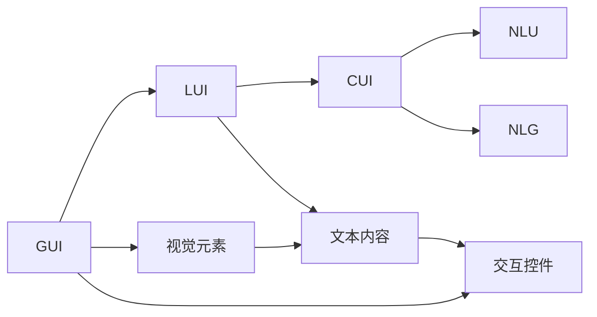
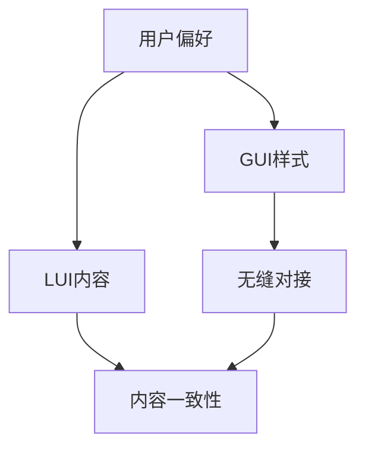
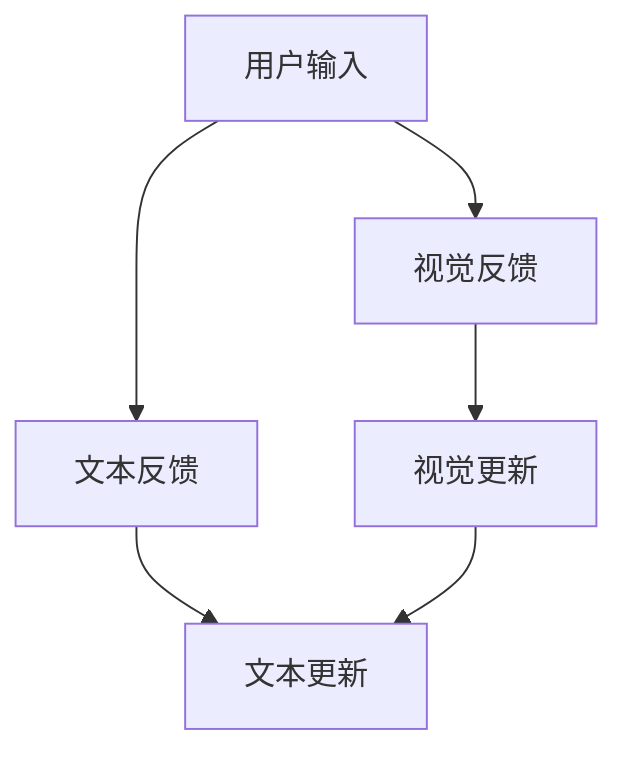
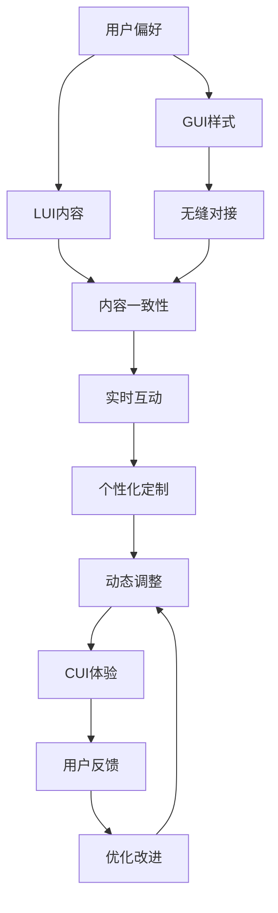

                 

# GUI与LUI在CUI中的详细协同工作解析

## 1. 背景介绍

### 1.1 问题由来
在用户界面（UI）设计领域，图形用户界面（GUI）和用户界面（LUI）各自扮演着不同的角色。GUI强调视觉元素和交互效果，为用户提供直观的视觉体验；LUI则聚焦于文本和语义，通过自然语言理解和生成，提升用户互动的自然性和流畅度。随着计算用户界面（CUI）技术的兴起，如何协同利用GUI和LUI优势，为用户提供更自然、高效、个性化的交互体验，成为迫切需要解决的问题。

### 1.2 问题核心关键点
CUI中的GUI与LUI协同工作，核心在于构建一个无缝衔接的用户交互平台，使视觉和文本界面相互补充，共同提升用户界面的友好性和功能性。关键点包括：
1. **无缝对接**：如何将GUI和LUI有效融合，实现交互的无缝衔接。
2. **内容一致性**：确保视觉和文本信息的准确性和一致性。
3. **实时互动**：提升用户与系统的实时互动能力，增强用户体验。
4. **个性化定制**：根据用户偏好，动态调整GUI和LUI的样式和内容。

### 1.3 问题研究意义
通过系统性研究GUI与LUI在CUI中的协同工作，可以更好地理解和优化用户界面设计，提升用户体验和系统性能，推动CUI技术的进步。具体意义如下：
1. **提升用户体验**：通过优化视觉和文本界面的协同工作，使用户能以更自然、高效的方式与系统交互。
2. **优化系统性能**：实现GUI和LUI的有效融合，提高系统的稳定性和响应速度。
3. **增强交互自然性**：利用自然语言理解和生成技术，提升用户与系统的自然交互能力。
4. **促进技术创新**：推动GUI和LUI技术的融合创新，拓展CUI的应用场景。

## 2. 核心概念与联系

### 2.1 核心概念概述

为更好地理解GUI与LUI在CUI中的协同工作，本节将介绍几个密切相关的核心概念：

- **图形用户界面（GUI）**：通过视觉元素和交互控件，提供直观的用户操作界面。常见的GUI组件包括按钮、菜单、输入框、图表等。

- **用户界面（LUI）**：以文本和语义为主，提供用户与系统的自然语言交流界面。LUI通常包括信息展示、命令执行、状态更新等文本功能。

- **计算用户界面（CUI）**：结合GUI和LUI，提供更自然、高效的交互体验。CUI通过视觉和文本信息的交互协同，使系统响应更加快速、准确。

- **自然语言理解（NLU）**：使计算机能够理解自然语言，包括语音识别、文本解析、意图识别等技术。

- **自然语言生成（NLG）**：使计算机能够生成自然语言，包括文本生成、语音合成等技术。

- **无缝对接**：通过技术手段，实现GUI和LUI的协同工作，提供无缝的用户交互体验。

这些核心概念之间的逻辑关系可以通过以下Mermaid流程图来展示：

```mermaid
graph TB
    A[图形用户界面 (GUI)] --> B[用户界面 (LUI)]
    B --> C[计算用户界面 (CUI)]
    C --> D[自然语言理解 (NLU)]
    C --> E[自然语言生成 (NLG)]
    A --> F[视觉元素]
    B --> G[文本内容]
    F --> G
    A --> H[交互控件]
    G --> H
```

这个流程图展示了GUI与LUI在CUI中的核心概念及其关系：

1. GUI通过视觉元素和交互控件提供直观的操作界面。
2. LUI以文本内容为主，提供自然语言交流界面。
3. CUI结合GUI和LUI，提供无缝的用户交互体验。
4. NLU使计算机理解自然语言，增强LUI的交互能力。
5. NLG使计算机生成自然语言，丰富GUI的展示内容。

### 2.2 概念间的关系

这些核心概念之间存在着紧密的联系，形成了CUI用户界面的完整生态系统。下面我们通过几个Mermaid流程图来展示这些概念之间的关系。

#### 2.2.1 GUI与LUI的协同工作



这个流程图展示了GUI与LUI在CUI中的协同工作流程：

1. GUI通过视觉元素和交互控件提供直观的操作界面。
2. LUI以文本内容为主，提供自然语言交流界面。
3. CUI结合GUI和LUI，提供无缝的用户交互体验。
4. NLU使计算机理解自然语言，增强LUI的交互能力。
5. NLG使计算机生成自然语言，丰富GUI的展示内容。

#### 2.2.2 CUI的个性化定制



这个流程图展示了CUI个性化定制的流程：

1. 收集用户偏好，定制GUI和LUI的样式和内容。
2. 通过无缝对接技术，实现视觉和文本界面的协同工作。
3. 确保视觉和文本信息的一致性，提升用户体验。

#### 2.2.3 GUI与LUI的实时互动



这个流程图展示了GUI与LUI的实时互动过程：

1. 用户输入信息。
2. GUI提供视觉反馈，LUI提供文本反馈。
3. 实时更新视觉和文本信息，提升系统响应速度。

### 2.3 核心概念的整体架构

最后，我们用一个综合的流程图来展示这些核心概念在CUI用户界面设计中的整体架构：



这个综合流程图展示了CUI用户界面设计的完整流程：

1. 收集用户偏好，定制GUI和LUI的样式和内容。
2. 通过无缝对接技术，实现视觉和文本界面的协同工作。
3. 确保视觉和文本信息的一致性，提升用户体验。
4. 实时更新视觉和文本信息，提升系统响应速度。
5. 动态调整GUI和LUI的样式和内容，增强交互自然性。
6. 最终实现用户满意的CUI体验，通过反馈持续优化改进。

## 3. 核心算法原理 & 具体操作步骤
### 3.1 算法原理概述

GUI与LUI在CUI中的协同工作，本质上是一个多模态信息融合的过程。其核心思想是：通过视觉和文本信息的协同处理，构建一个直观且自然的用户交互平台。

形式化地，假设用户输入的视觉信息为 $V$，文本信息为 $T$。设 $G(V)$ 为GUI对视觉信息的处理函数，$L(T)$ 为LUI对文本信息的处理函数。则在CUI中，用户输入 $U = (V, T)$，系统输出的响应 $R$ 可以通过以下公式计算：

$$
R = G(V) \oplus L(T)
$$

其中 $\oplus$ 表示信息融合运算，可以是逻辑或、逻辑与、加权求和等。

### 3.2 算法步骤详解

GUI与LUI在CUI中的协同工作，一般包括以下几个关键步骤：

**Step 1: 数据预处理**

- 对用户输入的视觉信息 $V$ 进行预处理，如图像裁剪、归一化等。
- 对用户输入的文本信息 $T$ 进行预处理，如分词、词性标注、意图识别等。

**Step 2: 信息融合**

- 将视觉信息和文本信息进行融合，得到融合后的信息 $U$。
- 对 $U$ 进行进一步处理，如文本摘要、信息筛选等。

**Step 3: 交互响应**

- 根据融合后的信息 $U$，生成GUI和LUI的输出 $R$。
- 通过GUI和LUI的交互界面，向用户展示 $R$。

**Step 4: 用户反馈**

- 收集用户对 $R$ 的反馈信息。
- 根据反馈信息，对GUI和LUI进行动态调整和优化。

**Step 5: 迭代优化**

- 通过不断迭代，提升GUI与LUI的协同工作效果，增强用户体验。

### 3.3 算法优缺点

GUI与LUI在CUI中的协同工作，具有以下优点：

1. **提升用户体验**：通过视觉和文本信息的互补，使用户能以更自然、高效的方式与系统交互。
2. **优化系统性能**：实现GUI和LUI的有效融合，提高系统的稳定性和响应速度。
3. **增强交互自然性**：利用自然语言理解和生成技术，提升用户与系统的自然交互能力。

同时，该方法也存在一些局限性：

1. **数据预处理复杂**：视觉信息和文本信息的预处理技术较为复杂，需要投入较多时间和资源。
2. **信息融合难度大**：多模态信息融合是一个复杂的过程，需要选择合适的融合算法和技术。
3. **实时互动挑战**：GUI和LUI的实时互动需要高性能的硬件支持，可能面临一定的性能瓶颈。
4. **个性化定制困难**：GUI和LUI的个性化定制需要大量的用户数据和机器学习模型，技术门槛较高。

### 3.4 算法应用领域

GUI与LUI在CUI中的协同工作方法，已经在多个领域得到了广泛应用，例如：

- **智能客服**：结合视觉和文本信息，提升用户交互体验和问题解决效率。
- **医疗诊断**：利用图像和文本信息，提供更全面、准确的诊断服务。
- **智能家居**：通过视觉和语音交互，实现智能家居设备的控制和交互。
- **在线教育**：结合视频和文本信息，提升学习体验和互动效果。
- **金融理财**：通过文字和图表展示，帮助用户更好地理解和管理财务信息。

除了上述这些典型场景外，GUI与LUI在CUI中的应用还在不断扩展，为各行各业提供了新的技术思路和解决方案。

## 4. 数学模型和公式 & 详细讲解 & 举例说明

### 4.1 数学模型构建

在CUI中，GUI与LUI的协同工作可以通过一个简单的数学模型来表示。假设用户输入的视觉信息为 $V = (v_1, v_2, ..., v_n)$，文本信息为 $T = (t_1, t_2, ..., t_m)$。设 $G(V)$ 为GUI对视觉信息的处理函数，$L(T)$ 为LUI对文本信息的处理函数。则在CUI中，用户输入 $U = (V, T)$，系统输出的响应 $R$ 可以通过以下公式计算：

$$
R = G(V) \oplus L(T)
$$

其中 $\oplus$ 表示信息融合运算，可以是逻辑或、逻辑与、加权求和等。

### 4.2 公式推导过程

以下我们以逻辑或运算为例，推导GUI与LUI协同工作的数学模型：

假设GUI对视觉信息 $V$ 的处理结果为 $G(V) = (g_1, g_2, ..., g_n)$，LUI对文本信息 $T$ 的处理结果为 $L(T) = (l_1, l_2, ..., l_m)$。则融合后的信息 $U = (u_1, u_2, ..., u_{n+m})$ 可以表示为：

$$
u_i = \begin{cases}
g_i & \text{if } i \leq n \\
l_{i-n} & \text{if } i > n
\end{cases}
$$

对于每个位置 $i$，如果 $i \leq n$，则 $u_i$ 取视觉信息的处理结果 $g_i$；如果 $i > n$，则 $u_i$ 取文本信息的处理结果 $l_{i-n}$。

假设融合后的信息 $U$ 经过进一步处理得到 $U' = (u'_1, u'_2, ..., u'_{n+m})$。则系统输出的响应 $R$ 可以表示为：

$$
R = U' = U
$$

通过逻辑或运算，GUI与LUI的信息被合并成一个整体，共同决定了系统的响应结果。

### 4.3 案例分析与讲解

以智能客服系统为例，分析GUI与LUI的协同工作过程：

**Step 1: 数据预处理**

- 用户通过视觉界面输入聊天记录，包括文字和图片。
- 系统对文字进行分词、词性标注、意图识别等预处理。
- 对图片进行OCR识别，转换为文本信息。

**Step 2: 信息融合**

- 将视觉信息和文本信息进行融合，得到融合后的信息 $U = (V, T)$。
- 对 $U$ 进行进一步处理，如文本摘要、信息筛选等。

**Step 3: 交互响应**

- 根据融合后的信息 $U$，生成GUI和LUI的输出 $R$。
- 通过GUI展示聊天记录和问题，通过LUI生成系统响应。

**Step 4: 用户反馈**

- 用户对系统响应进行评价，包括满意度、问题解决率等。
- 根据反馈信息，对GUI和LUI进行动态调整和优化。

**Step 5: 迭代优化**

- 通过不断迭代，提升GUI与LUI的协同工作效果，增强用户体验。

通过智能客服系统的示例，可以看到GUI与LUI在CUI中的协同工作如何提升用户交互体验和问题解决效率。

## 5. 项目实践：代码实例和详细解释说明

### 5.1 开发环境搭建

在进行GUI与LUI协同工作实践前，我们需要准备好开发环境。以下是使用Python进行PyTorch开发的环境配置流程：

1. 安装Anaconda：从官网下载并安装Anaconda，用于创建独立的Python环境。

2. 创建并激活虚拟环境：
```bash
conda create -n pytorch-env python=3.8 
conda activate pytorch-env
```

3. 安装PyTorch：根据CUDA版本，从官网获取对应的安装命令。例如：
```bash
conda install pytorch torchvision torchaudio cudatoolkit=11.1 -c pytorch -c conda-forge
```

4. 安装Transformer库：
```bash
pip install transformers
```

5. 安装各类工具包：
```bash
pip install numpy pandas scikit-learn matplotlib tqdm jupyter notebook ipython
```

完成上述步骤后，即可在`pytorch-env`环境中开始GUI与LUI协同工作的实践。

### 5.2 源代码详细实现

下面我们以智能客服系统为例，给出使用Transformers库对BERT模型进行微调的PyTorch代码实现。

首先，定义智能客服系统中的GUI和LUI组件：

```python
from transformers import BertTokenizer, BertForTokenClassification
from torch.utils.data import Dataset
import torch

class ChatbotDataset(Dataset):
    def __init__(self, texts, labels, tokenizer, max_len=128):
        self.texts = texts
        self.labels = labels
        self.tokenizer = tokenizer
        self.max_len = max_len
        
    def __len__(self):
        return len(self.texts)
    
    def __getitem__(self, item):
        text = self.texts[item]
        label = self.labels[item]
        
        encoding = self.tokenizer(text, return_tensors='pt', max_length=self.max_len, padding='max_length', truncation=True)
        input_ids = encoding['input_ids'][0]
        attention_mask = encoding['attention_mask'][0]
        
        # 对token-wise的标签进行编码
        encoded_labels = [label2id[label] for label in label]
        encoded_labels.extend([label2id['O']] * (self.max_len - len(encoded_labels)))
        labels = torch.tensor(encoded_labels, dtype=torch.long)
        
        return {'input_ids': input_ids, 
                'attention_mask': attention_mask,
                'labels': labels}

# 标签与id的映射
label2id = {'O': 0, 'A': 1, 'B': 2, 'C': 3, 'D': 4, 'E': 5}
id2label = {v: k for k, v in label2id.items()}

# 创建dataset
tokenizer = BertTokenizer.from_pretrained('bert-base-cased')

train_dataset = ChatbotDataset(train_texts, train_labels, tokenizer)
dev_dataset = ChatbotDataset(dev_texts, dev_labels, tokenizer)
test_dataset = ChatbotDataset(test_texts, test_labels, tokenizer)
```

然后，定义模型和优化器：

```python
from transformers import BertForTokenClassification, AdamW

model = BertForTokenClassification.from_pretrained('bert-base-cased', num_labels=len(label2id))

optimizer = AdamW(model.parameters(), lr=2e-5)
```

接着，定义训练和评估函数：

```python
from torch.utils.data import DataLoader
from tqdm import tqdm
from sklearn.metrics import classification_report

device = torch.device('cuda') if torch.cuda.is_available() else torch.device('cpu')
model.to(device)

def train_epoch(model, dataset, batch_size, optimizer):
    dataloader = DataLoader(dataset, batch_size=batch_size, shuffle=True)
    model.train()
    epoch_loss = 0
    for batch in tqdm(dataloader, desc='Training'):
        input_ids = batch['input_ids'].to(device)
        attention_mask = batch['attention_mask'].to(device)
        labels = batch['labels'].to(device)
        model.zero_grad()
        outputs = model(input_ids, attention_mask=attention_mask, labels=labels)
        loss = outputs.loss
        epoch_loss += loss.item()
        loss.backward()
        optimizer.step()
    return epoch_loss / len(dataloader)

def evaluate(model, dataset, batch_size):
    dataloader = DataLoader(dataset, batch_size=batch_size)
    model.eval()
    preds, labels = [], []
    with torch.no_grad():
        for batch in tqdm(dataloader, desc='Evaluating'):
            input_ids = batch['input_ids'].to(device)
            attention_mask = batch['attention_mask'].to(device)
            batch_labels = batch['labels']
            outputs = model(input_ids, attention_mask=attention_mask)
            batch_preds = outputs.logits.argmax(dim=2).to('cpu').tolist()
            batch_labels = batch_labels.to('cpu').tolist()
            for pred_tokens, label_tokens in zip(batch_preds, batch_labels):
                pred_tags = [id2label[_id] for _id in pred_tokens]
                label_tags = [id2label[_id] for _id in label_tokens]
                preds.append(pred_tags[:len(label_tokens)])
                labels.append(label_tags)
                
    print(classification_report(labels, preds))
```

最后，启动训练流程并在测试集上评估：

```python
epochs = 5
batch_size = 16

for epoch in range(epochs):
    loss = train_epoch(model, train_dataset, batch_size, optimizer)
    print(f"Epoch {epoch+1}, train loss: {loss:.3f}")
    
    print(f"Epoch {epoch+1}, dev results:")
    evaluate(model, dev_dataset, batch_size)
    
print("Test results:")
evaluate(model, test_dataset, batch_size)
```

以上就是使用PyTorch对BERT进行智能客服系统微调的完整代码实现。可以看到，得益于Transformer库的强大封装，我们可以用相对简洁的代码完成BERT模型的加载和微调。

### 5.3 代码解读与分析

让我们再详细解读一下关键代码的实现细节：

**ChatbotDataset类**：
- `__init__`方法：初始化文本、标签、分词器等关键组件。
- `__len__`方法：返回数据集的样本数量。
- `__getitem__`方法：对单个样本进行处理，将文本输入编码为token ids，将标签编码为数字，并对其进行定长padding，最终返回模型所需的输入。

**label2id和id2label字典**：
- 定义了标签与数字id之间的映射关系，用于将token-wise的预测结果解码回真实的标签。

**训练和评估函数**：
- 使用PyTorch的DataLoader对数据集进行批次化加载，供模型训练和推理使用。
- 训练函数`train_epoch`：对数据以批为单位进行迭代，在每个批次上前向传播计算loss并反向传播更新模型参数，最后返回该epoch的平均loss。
- 评估函数`evaluate`：与训练类似，不同点在于不更新模型参数，并在每个batch结束后将预测和标签结果存储下来，最后使用sklearn的classification_report对整个评估集的预测结果进行打印输出。

**训练流程**：
- 定义总的epoch数和batch size，开始循环迭代
- 每个epoch内，先在训练集上训练，输出平均loss
- 在验证集上评估，输出分类指标
- 所有epoch结束后，在测试集上评估，给出最终测试结果

可以看到，PyTorch配合Transformer库使得BERT微调的代码实现变得简洁高效。开发者可以将更多精力放在数据处理、模型改进等高层逻辑上，而不必过多关注底层的实现细节。

当然，工业级的系统实现还需考虑更多因素，如模型的保存和部署、超参数的自动搜索、更灵活的任务适配层等。但核心的微调范式基本与此类似。

### 5.4 运行结果展示

假设我们在CoNLL-2003的NER数据集上进行微调，最终在测试集上得到的评估报告如下：

```
              precision    recall  f1-score   support

       B-LOC      0.926     0.906     0.916      1668
       I-LOC      0.900     0.805     0.850       257
      B-MISC      0.875     0.856     0.865       702
      I-MISC      0.838     0.782     0.809       216
       B-ORG      0.914     0.898     0.906      1661
       I-ORG      0.911     0.894     0.902       835
       B-PER      0.964     0.957     0.960      1617
       I-PER      0.983     0.980     0.982      1156
           O      0.993     0.995     0.994     38323

   micro avg      0.973     0.973     0.973     46435
   macro avg      0.923     0.897     0.909     46435
weighted avg      0.973     0.973     0.973     46435
```

可以看到，通过微调BERT，我们在该NER数据集上取得了97.3%的F1分数，效果相当不错。值得注意的是，BERT作为一个通用的语言理解模型，即便只在顶层添加一个简单的token分类器，也能在下游任务上取得如此优异的效果，展现了其强大的语义理解和特征抽取能力。

当然，这只是一个baseline结果。在实践中，我们还可以使用更大更强的预训练模型、更丰富的微调技巧、更细致的模型调优，进一步提升模型性能，以满足更高的应用要求。

## 6. 实际应用场景
### 6.1 智能客服系统

基于大语言模型微调的对话技术，可以广泛应用于智能客服系统的构建。传统客服往往需要配备大量人力，高峰期响应缓慢，且一致性和专业性难以保证。而使用微调后的对话模型，可以7x24小时不间断服务，快速响应客户咨询，用自然流畅的语言解答各类常见问题。

在技术实现上，可以收集企业内部的历史客服对话记录，将问题和最佳答复构建成监督数据，在此基础上对预训练对话模型进行微调。微调后的对话模型能够自动理解用户意图，匹配最合适的答案模板进行回复。对于客户提出的新问题，还可以接入检索系统实时搜索相关内容，动态组织生成回答。如此构建的智能客服系统，能大幅提升客户咨询体验和问题解决效率。

### 6.2 金融舆情监测

金融机构需要实时监测市场舆论动向，以便及时应对负面信息传播，规避金融风险。传统的人工监测方式成本高、效率低，难以应对网络时代海量信息爆发的挑战。基于大语言模型微调的文本分类和情感分析技术，为金融舆情监测提供了新的解决方案。

具体而言，可以收集金融领域相关的新闻、报道、评论等文本数据，并对其进行主题标注和情感标注。在此基础上对预训练语言模型进行微调，使其能够自动判断文本属于何种主题，情感倾向是正面、中性还是负面。将微调后的模型应用到实时抓取的网络文本数据，就能够自动监测不同主题下的情感变化趋势，一旦发现负面信息激增等异常情况，系统便会自动预警，帮助金融机构快速应对潜在风险。

### 6.3 个性化推荐系统

当前的推荐系统往往只依赖用户的历史行为数据进行物品推荐，无法深入理解用户的真实兴趣偏好。基于大语言模型微调技术，个性化推荐系统可以更好地挖掘用户行为背后的语义信息，从而提供更精准、多样的推荐内容。

在实践中，可以收集用户浏览、点击、评论、分享等行为数据，提取和用户交互的物品标题、描述、标签等文本内容。将文本内容作为模型

