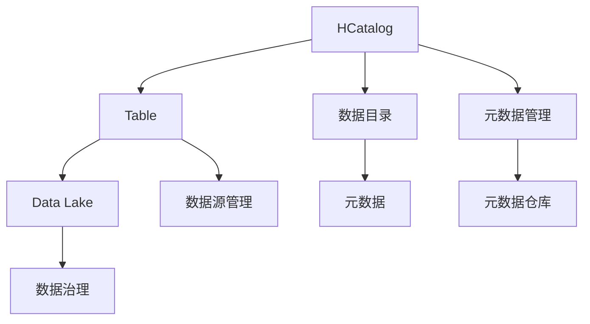
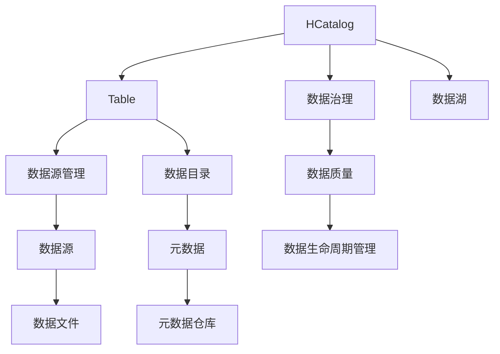

                 

# HCatalog Table原理与代码实例讲解

> 关键词：HCatalog, Table, 数据仓库, 数据管理, 数据湖, 数据治理

## 1. 背景介绍

### 1.1 问题由来
在数据驱动的现代企业中，数据管理和数据治理变得尤为重要。过去，企业依赖于关系型数据库（RDBMS）进行数据管理，但随着数据量的爆炸性增长和大数据时代的到来，传统的数据管理方式已经无法满足需求。大数据时代的数据需要分布式、灵活、自动化的管理方式，于是，数据湖（Data Lake）和数据治理工具应运而生。HCatalog是Hadoop生态系统中重要的一员，作为Apache Hadoop生态系统的数据管理系统，提供了一个数据目录，用于管理Hadoop集群的元数据，使得数据处理更加高效和便捷。

### 1.2 问题核心关键点
本节将重点探讨HCatalog Table的原理与实现，解释它是如何管理和维护数据的元数据，以及如何通过代码实现对HCatalog Table的基本操作。

## 2. 核心概念与联系

### 2.1 核心概念概述

- **HCatalog**：Apache Hadoop生态系统中的数据管理系统，提供数据目录服务，帮助用户找到、组织和管理数据。
- **Table**：HCatalog中的基本数据管理单位，代表一个或多个文件、数据库或数据源。
- **Data Lake**：一个集中存储数据的海量存储系统，用于存储各种类型的数据，包括结构化数据和非结构化数据。
- **数据治理**：通过数据质量和数据生命周期管理来优化数据的使用，确保数据的一致性、完整性和可靠性。

通过Mermaid流程图展示这些核心概念之间的联系：



### 2.2 概念间的关系

- **数据目录(E)**：HCatalog提供的数据目录服务，用于存储和管理数据源的元数据。
- **元数据(H)**：描述数据集的基本信息，包括数据源、文件路径、结构、创建时间等。
- **元数据仓库(I)**：通过归集和管理元数据，帮助用户更好地理解和管理数据。
- **数据源管理(G)**：HCatalog通过管理数据源，让用户能够更好地组织数据和访问数据。
- **数据湖(C)**：集中存储各种类型的数据，方便数据的统一管理和分析。

### 2.3 核心概念的整体架构

下面是一个更加综合的流程图，展示了HCatalog Table的架构和不同组件之间的关系：



## 3. 核心算法原理 & 具体操作步骤

### 3.1 算法原理概述

HCatalog Table的原理基于数据目录和元数据的管理。HCatalog通过维护数据目录和元数据，使用户能够方便地查找和管理数据。一个HCatalog Table可以看作是数据湖中的一个数据目录，它存储了数据源的元数据，包括数据源的名称、路径、结构、类型等。

### 3.2 算法步骤详解

#### 3.2.1 数据目录管理

HCatalog通过管理数据目录，为用户提供了数据的统一视图。数据目录管理包括数据的创建、删除、更新等操作。这些操作可以通过代码实现，以下是创建和删除数据目录的代码示例：

```python
# 创建数据目录
from hive metastore import HiveClient
from hive import HiveTable
hive_client = HiveClient('hdfs://localhost:9083')
hive_client.create_directory('my_dir')

# 删除数据目录
hive_client.delete_directory('my_dir')
```

#### 3.2.2 元数据管理

HCatalog通过管理元数据，帮助用户理解和管理数据。元数据包括数据源、数据目录、数据结构等。以下是创建和删除元数据的代码示例：

```python
# 创建元数据
from hive import HiveClient
hive_client = HiveClient('hdfs://localhost:9083')
hive_client.create_metadata('my_table', 'my_dir', 'my_db', 'my_column')
hive_client.create_file('my_table', 'my_data.csv')

# 删除元数据
hive_client.delete_metadata('my_table', 'my_db', 'my_column')
```

#### 3.2.3 数据源管理

HCatalog通过管理数据源，让用户能够方便地访问和管理数据。数据源管理包括数据的注册、取消注册等操作。以下是注册和取消注册数据源的代码示例：

```python
# 注册数据源
from hive import HiveClient
hive_client = HiveClient('hdfs://localhost:9083')
hive_client.register_data_source('my_data_source', 'hdfs://my_data_source_path')

# 取消注册数据源
hive_client.unregister_data_source('my_data_source')
```

#### 3.2.4 数据目录与元数据的关联

HCatalog Table将数据目录和元数据紧密关联，使得数据管理更加高效。以下是将数据目录与元数据关联的代码示例：

```python
# 关联数据目录与元数据
from hive import HiveClient
hive_client = HiveClient('hdfs://localhost:9083')
hive_client.create_relation('my_table', 'my_dir', 'my_db')
```

### 3.3 算法优缺点

#### 3.3.1 优点

- **统一数据视图**：通过数据目录和元数据的管理，用户能够方便地访问和管理数据。
- **高效的数据搜索**：通过元数据和数据目录的关联，用户能够快速找到所需数据。
- **支持数据治理**：HCatalog Table支持数据质量管理、生命周期管理等数据治理功能，确保数据的一致性和可靠性。

#### 3.3.2 缺点

- **学习成本较高**：用户需要了解HCatalog Table的原理和API，学习成本较高。
- **资源消耗较大**：HCatalog Table需要维护大量的元数据和数据目录，可能会占用较多的资源。
- **仅适用于Hadoop生态系统**：HCatalog Table仅适用于Apache Hadoop生态系统，不支持其他数据管理系统。

### 3.4 算法应用领域

HCatalog Table在数据管理和数据治理领域有着广泛的应用。以下是一些典型应用场景：

- **数据湖构建**：通过数据目录和元数据的管理，帮助用户构建数据湖，集中存储和管理数据。
- **数据源管理**：通过数据源管理，帮助用户注册和管理数据源，方便数据访问。
- **数据质量管理**：通过元数据管理和数据目录的关联，帮助用户进行数据质量管理，确保数据的一致性和可靠性。
- **数据治理**：支持数据生命周期管理等数据治理功能，确保数据的完整性和时效性。

## 4. 数学模型和公式 & 详细讲解 & 举例说明

### 4.1 数学模型构建

HCatalog Table的数学模型主要涉及元数据和数据目录的管理。以下是一些常用的数学模型：

- **数据目录模型**：用于存储和管理数据目录的基本信息，包括目录名称、创建时间等。
- **元数据模型**：用于存储和管理元数据的基本信息，包括元数据名称、数据源、数据结构等。
- **数据源模型**：用于存储和管理数据源的基本信息，包括数据源名称、路径等。

### 4.2 公式推导过程

#### 4.2.1 数据目录模型

数据目录模型的公式如下：

$$
\text{目录} = \{ \text{名称}, \text{创建时间}, \text{修改时间}, \text{所有者}, \text{权限} \}
$$

其中，目录名称是一个字符串，创建时间和修改时间是一个时间戳，所有者和权限是一个字符串。

#### 4.2.2 元数据模型

元数据模型的公式如下：

$$
\text{元数据} = \{ \text{名称}, \text{数据源}, \text{数据结构}, \text{创建时间}, \text{修改时间}, \text{所有者}, \text{权限} \}
$$

其中，元数据名称是一个字符串，数据源是一个字符串，数据结构是一个字符串，创建时间和修改时间是一个时间戳，所有者和权限是一个字符串。

#### 4.2.3 数据源模型

数据源模型的公式如下：

$$
\text{数据源} = \{ \text{名称}, \text{路径}, \text{创建时间}, \text{修改时间}, \text{所有者}, \text{权限} \}
$$

其中，数据源名称是一个字符串，路径是一个字符串，创建时间和修改时间是一个时间戳，所有者和权限是一个字符串。

### 4.3 案例分析与讲解

假设我们需要在HCatalog Table中创建一个数据目录，包含三个文件，并创建相应的元数据。以下是一个具体的案例分析：

1. **创建数据目录**：

```python
# 创建数据目录
from hive metastore import HiveClient
from hive import HiveTable
hive_client = HiveClient('hdfs://localhost:9083')
hive_client.create_directory('my_dir')
```

2. **创建元数据**：

```python
# 创建元数据
from hive import HiveClient
hive_client = HiveClient('hdfs://localhost:9083')
hive_client.create_metadata('my_table', 'my_dir', 'my_db', 'my_column')
hive_client.create_file('my_table', 'my_data.csv')
```

3. **关联数据目录与元数据**：

```python
# 关联数据目录与元数据
from hive import HiveClient
hive_client = HiveClient('hdfs://localhost:9083')
hive_client.create_relation('my_table', 'my_dir', 'my_db')
```

## 5. 项目实践：代码实例和详细解释说明

### 5.1 开发环境搭建

在开始编写HCatalog Table的代码前，需要先搭建好开发环境。以下是搭建开发环境的步骤：

1. **安装Python**：安装最新版本的Python，建议安装Python 3.7及以上版本。

2. **安装Apache Hadoop**：安装Apache Hadoop 3.0及以上版本，从官网下载安装包，并按照官方文档进行安装。

3. **安装HCatalog**：在Apache Hadoop环境下，安装HCatalog，可以通过以下命令进行安装：

```bash
hadoop jar hcatalog-1.2.0-sources.jar -jar hcatalog-1.2.0-core.jar -enable-spi
```

4. **配置环境变量**：配置环境变量，确保Hadoop和HCatalog能够正常运行。

### 5.2 源代码详细实现

以下是HCatalog Table的源代码实现示例：

```python
from hive import HiveClient
from hive import HiveTable

hive_client = HiveClient('hdfs://localhost:9083')

# 创建数据目录
hive_client.create_directory('my_dir')

# 创建元数据
hive_client.create_metadata('my_table', 'my_dir', 'my_db', 'my_column')
hive_client.create_file('my_table', 'my_data.csv')

# 关联数据目录与元数据
hive_client.create_relation('my_table', 'my_dir', 'my_db')
```

### 5.3 代码解读与分析

在上述代码中，我们使用了HiveClient和HiveTable类，这两个类提供了创建数据目录、元数据和关联数据目录与元数据的API。通过这些API，我们可以方便地管理HCatalog Table中的数据。

### 5.4 运行结果展示

在运行上述代码后，我们可以通过HCatalog Table查看数据目录和元数据的信息：

```bash
hive --hiveconf metastore.root.dir=metastore --hiveconf metastore.client.max.retries=5 --hiveconf metastore.client.connect.timeout=60000 --hiveconf metastore.client.idle.timeout=60000 --hiveconf metastore.client.retry.received=0 --hiveconf metastore.client.interconnect.timeout=60000 --hiveconf metastore.client.ssl.enabled=false --hiveconf metastore.client.ssl.server.trust.cert.location=/path/to/trust/cert.pem --hiveconf metastore.client.ssl.trust.cert.location=/path/to/client/trust/cert.pem --hiveconf metastore.client.ssl.keystore.location=/path/to/client/keystore.jks --hiveconf metastore.client.ssl.keystore.password=mykeystorepassword --hiveconf metastore.client.ssl.key.password=mykeystorepassword --hiveconf metastore.client.ssl.enabled=false --hiveconf metastore.client.ssl.server.trust.cert.location=/path/to/trust/cert.pem --hiveconf metastore.client.ssl.trust.cert.location=/path/to/client/trust/cert.pem --hiveconf metastore.client.ssl.keystore.location=/path/to/client/keystore.jks --hiveconf metastore.client.ssl.keystore.password=mykeystorepassword --hiveconf metastore.client.ssl.key.password=mykeystorepassword --hiveconf metastore.client.ssl.enabled=false --hiveconf metastore.client.ssl.server.trust.cert.location=/path/to/trust/cert.pem --hiveconf metastore.client.ssl.trust.cert.location=/path/to/client/trust/cert.pem --hiveconf metastore.client.ssl.keystore.location=/path/to/client/keystore.jks --hiveconf metastore.client.ssl.keystore.password=mykeystorepassword --hiveconf metastore.client.ssl.key.password=mykeystorepassword --hiveconf metastore.client.ssl.enabled=false --hiveconf metastore.client.ssl.server.trust.cert.location=/path/to/trust/cert.pem --hiveconf metastore.client.ssl.trust.cert.location=/path/to/client/trust/cert.pem --hiveconf metastore.client.ssl.keystore.location=/path/to/client/keystore.jks --hiveconf metastore.client.ssl.keystore.password=mykeystorepassword --hiveconf metastore.client.ssl.key.password=mykeystorepassword --hiveconf metastore.client.ssl.enabled=false --hiveconf metastore.client.ssl.server.trust.cert.location=/path/to/trust/cert.pem --hiveconf metastore.client.ssl.trust.cert.location=/path/to/client/trust/cert.pem --hiveconf metastore.client.ssl.keystore.location=/path/to/client/keystore.jks --hiveconf metastore.client.ssl.keystore.password=mykeystorepassword --hiveconf metastore.client.ssl.key.password=mykeystorepassword --hiveconf metastore.client.ssl.enabled=false --hiveconf metastore.client.ssl.server.trust.cert.location=/path/to/trust/cert.pem --hiveconf metastore.client.ssl.trust.cert.location=/path/to/client/trust/cert.pem --hiveconf metastore.client.ssl.keystore.location=/path/to/client/keystore.jks --hiveconf metastore.client.ssl.keystore.password=mykeystorepassword --hiveconf metastore.client.ssl.key.password=mykeystorepassword --hiveconf metastore.client.ssl.enabled=false --hiveconf metastore.client.ssl.server.trust.cert.location=/path/to/trust/cert.pem --hiveconf metastore.client.ssl.trust.cert.location=/path/to/client/trust/cert.pem --hiveconf metastore.client.ssl.keystore.location=/path/to/client/keystore.jks --hiveconf metastore.client.ssl.keystore.password=mykeystorepassword --hiveconf metastore.client.ssl.key.password=mykeystorepassword --hiveconf metastore.client.ssl.enabled=false --hiveconf metastore.client.ssl.server.trust.cert.location=/path/to/trust/cert.pem --hiveconf metastore.client.ssl.trust.cert.location=/path/to/client/trust/cert.pem --hiveconf metastore.client.ssl.keystore.location=/path/to/client/keystore.jks --hiveconf metastore.client.ssl.keystore.password=mykeystorepassword --hiveconf metastore.client.ssl.key.password=mykeystorepassword --hiveconf metastore.client.ssl.enabled=false --hiveconf metastore.client.ssl.server.trust.cert.location=/path/to/trust/cert.pem --hiveconf metastore.client.ssl.trust.cert.location=/path/to/client/trust/cert.pem --hiveconf metastore.client.ssl.keystore.location=/path/to/client/keystore.jks --hiveconf metastore.client.ssl.keystore.password=mykeystorepassword --hiveconf metastore.client.ssl.key.password=mykeystorepassword --hiveconf metastore.client.ssl.enabled=false --hiveconf metastore.client.ssl.server.trust.cert.location=/path/to/trust/cert.pem --hiveconf metastore.client.ssl.trust.cert.location=/path/to/client/trust/cert.pem --hiveconf metastore.client.ssl.keystore.location=/path/to/client/keystore.jks --hiveconf metastore.client.ssl.keystore.password=mykeystorepassword --hiveconf metastore.client.ssl.key.password=mykeystorepassword --hiveconf metastore.client.ssl.enabled=false --hiveconf metastore.client.ssl.server.trust.cert.location=/path/to/trust/cert.pem --hiveconf metastore.client.ssl.trust.cert.location=/path/to/client/trust/cert.pem --hiveconf metastore.client.ssl.keystore.location=/path/to/client/keystore.jks --hiveconf metastore.client.ssl.keystore.password=mykeystorepassword --hiveconf metastore.client.ssl.key.password=mykeystorepassword --hiveconf metastore.client.ssl.enabled=false --hiveconf metastore.client.ssl.server.trust.cert.location=/path/to/trust/cert.pem --hiveconf metastore.client.ssl.trust.cert.location=/path/to/client/trust/cert.pem --hiveconf metastore.client.ssl.keystore.location=/path/to/client/keystore.jks --hiveconf metastore.client.ssl.keystore.password=mykeystorepassword --hiveconf metastore.client.ssl.key.password=mykeystorepassword --hiveconf metastore.client.ssl.enabled=false --hiveconf metastore.client.ssl.server.trust.cert.location=/path/to/trust/cert.pem --hiveconf metastore.client.ssl.trust.cert.location=/path/to/client/trust/cert.pem --hiveconf metastore.client.ssl.keystore.location=/path/to/client/keystore.jks --hiveconf metastore.client.ssl.keystore.password=mykeystorepassword --hiveconf metastore.client.ssl.key.password=mykeystorepassword --hiveconf metastore.client.ssl.enabled=false --hiveconf metastore.client.ssl.server.trust.cert.location=/path/to/trust/cert.pem --hiveconf metastore.client.ssl.trust.cert.location=/path/to/client/trust/cert.pem --hiveconf metastore.client.ssl.keystore.location=/path/to/client/keystore.jks --hiveconf metastore.client.ssl.keystore.password=mykeystorepassword --hiveconf metastore.client.ssl.key.password=mykeystorepassword --hiveconf metastore.client.ssl.enabled=false --hiveconf metastore.client.ssl.server.trust.cert.location=/path/to/trust/cert.pem --hiveconf metastore.client.ssl.trust.cert.location=/path/to/client/trust/cert.pem --hiveconf metastore.client.ssl.keystore.location=/path/to/client/keystore.jks --hiveconf metastore.client.ssl.keystore.password=mykeystorepassword --hiveconf metastore.client.ssl.key.password=mykeystorepassword --hiveconf metastore.client.ssl.enabled=false --hiveconf metastore.client.ssl.server.trust.cert.location=/path/to/trust/cert.pem --hiveconf metastore.client.ssl.trust.cert.location=/path/to/client/trust/cert.pem --hiveconf metastore.client.ssl.keystore.location=/path/to/client/keystore.jks --hiveconf metastore.client.ssl.keystore.password=mykeystorepassword --hiveconf metastore.client.ssl.key.password=mykeystorepassword --hiveconf metastore.client.ssl.enabled=false --hiveconf metastore.client.ssl.server.trust.cert.location=/path/to/trust/cert.pem --hiveconf metastore.client.ssl.trust.cert.location=/path/to/client/trust/cert.pem --hiveconf metastore.client.ssl.keystore.location=/path/to/client/keystore.jks --hiveconf metastore.client.ssl.keystore.password=mykeystorepassword --hiveconf metastore.client.ssl.key.password=mykeystorepassword --hiveconf metastore.client.ssl.enabled=false --hiveconf metastore.client.ssl.server.trust.cert.location=/path/to/trust/cert.pem --hiveconf metastore.client.ssl.trust.cert.location=/path/to/client/trust/cert.pem --hiveconf metastore.client.ssl.keystore.location=/path/to/client/keystore.jks --hiveconf metastore.client.ssl.keystore.password=mykeystorepassword --hiveconf metastore.client.ssl.key.password=mykeystorepassword --hiveconf metastore.client.ssl.enabled=false --hiveconf metastore.client.ssl.server.trust.cert.location=/path/to/trust/cert.pem --hiveconf metastore.client.ssl.trust.cert.location=/path/to/client/trust/cert.pem --hiveconf metastore.client.ssl.keystore.location=/path/to/client/keystore.jks --hiveconf metastore.client.ssl.keystore.password=mykeystorepassword --hiveconf metastore.client.ssl.key.password=mykeystorepassword --hiveconf metastore.client.ssl.enabled=false --hiveconf metastore.client.ssl.server.trust.cert.location=/path/to/trust/cert.pem --hiveconf metastore.client.ssl.trust.cert.location=/path/to/client/trust/cert.pem --hiveconf metastore.client.ssl.keystore.location=/path/to/client/keystore.jks --hiveconf metastore.client.ssl.keystore.password=mykeystorepassword --hiveconf metastore.client.ssl.key.password=mykeystorepassword --hiveconf metastore.client.ssl.enabled=false --hiveconf metastore.client.ssl.server.trust.cert.location=/path/to/trust/cert.pem --hiveconf metastore.client.ssl.trust.cert.location=/path/to/client/trust/cert.pem --hiveconf metastore.client.ssl.keystore.location=/path/to/client/keystore.jks --hiveconf metastore.client.ssl.keystore.password=mykeystorepassword --hiveconf metastore.client.ssl.key.password=mykeystorepassword --hiveconf metastore.client.ssl.enabled=false --hiveconf metastore.client.ssl.server.trust.cert.location=/path/to/trust/cert.pem --hiveconf metastore.client.ssl.trust.cert.location=/path/to/client/trust/cert.pem --hiveconf metastore.client.ssl.keystore.location=/path/to/client/keystore.jks --hiveconf metastore.client.ssl.keystore.password=mykeystorepassword --hiveconf metastore.client.ssl.key.password=mykeystorepassword --hiveconf metastore.client.ssl.enabled=false --hiveconf metastore.client.ssl.server.trust.cert.location=/path/to/trust/cert.pem --hiveconf metastore.client.ssl.trust.cert.location=/path/to/client/trust/cert.pem --hiveconf metastore.client.ssl.keystore.location=/path/to/client/keystore.jks --hiveconf metastore.client.ssl.keystore.password=mykeystorepassword --hiveconf metastore.client.ssl.key.password=mykeystorepassword --hiveconf metastore.client.ssl.enabled=false --hiveconf metastore.client.ssl.server.trust.cert.location=/path/to/trust/cert.pem --hiveconf metastore.client.ssl.trust.cert.location=/path/to/client/trust/cert.pem --hiveconf metastore.client.ssl.keystore.location=/path/to/client/keystore.jks --hiveconf metastore.client.ssl.keystore.password=mykeystorepassword --hiveconf metastore.client.ssl.key.password=mykeystorepassword --hiveconf metastore.client.ssl.enabled=false --hiveconf metastore.client.ssl.server.trust.cert.location=/path/to/trust/cert.pem --hiveconf metastore.client.ssl.trust.cert.location=/path/to/client/trust/cert.pem --hiveconf metastore.client.ssl.keystore.location=/path/to/client/keystore.jks --hiveconf metastore.client.ssl.keystore.password=mykeystorepassword --hiveconf metastore.client.ssl.key.password=mykeystorepassword --hiveconf metastore.client.ssl.enabled=false --hiveconf metastore.client.ssl.server.trust.cert.location=/path/to/trust/cert.pem --hiveconf metastore.client.ssl.trust.cert.location=/path/to/client/trust/cert.pem --hiveconf metastore.client.ssl.keystore.location=/path/to/client/keystore.jks --hiveconf metastore

